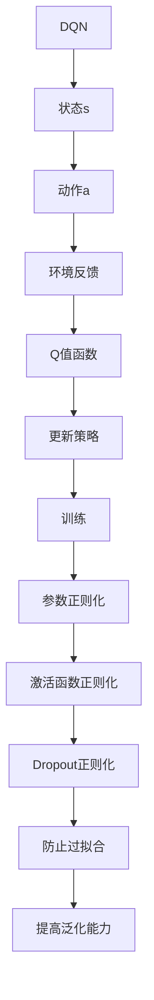

                 

关键词：深度强化学习，DQN，过拟合，正则化，映射策略

> 摘要：本文探讨了深度强化学习（DQN）中如何通过正则化技术来防止过拟合，以实现更好的学习效果。文章首先介绍了DQN的核心概念和原理，然后详细阐述了正则化技术的原理及其在DQN中的应用，最后通过一个具体的案例进行了说明。

## 1. 背景介绍

深度强化学习（Deep Reinforcement Learning，简称DRL）是深度学习和强化学习结合的一种新兴人工智能技术。它利用深度神经网络来处理复杂的环境状态和决策，通过不断试错来学习最优策略。DQN（Deep Q-Network）是深度强化学习中的一种经典算法，通过使用深度神经网络来近似Q值函数，从而实现智能体的决策。

在DQN的学习过程中，一个重要的问题是过拟合（Overfitting）。过拟合指的是模型在训练数据上表现很好，但在新的、未见过的数据上表现较差。过拟合会导致模型对训练数据的细节过于敏感，从而在真实环境中难以泛化。为了解决这个问题，正则化技术应运而生。

正则化（Regularization）是一种在机器学习模型训练过程中添加惩罚项的方法，目的是减少模型的复杂度，防止过拟合。常见的正则化方法有L1正则化、L2正则化和Dropout等。本文将重点探讨正则化技术在DQN中的应用，以及如何通过正则化来防止过拟合。

## 2. 核心概念与联系

### 2.1 DQN的核心概念

DQN是一种基于深度神经网络的Q值函数近似方法。Q值函数（Q-Function）是强化学习中的一个关键概念，它表示在给定状态s和动作a的情况下，执行动作a所能获得的期望奖励。DQN通过使用深度神经网络来近似Q值函数，从而实现智能体的决策。

在DQN中，状态空间和动作空间通常是高维的，这使得直接使用Q值表（Q-Table）来表示Q值函数变得不切实际。因此，DQN采用深度神经网络来近似Q值函数，从而可以在高维状态空间中有效学习。

### 2.2 正则化的原理

正则化是一种在机器学习模型训练过程中添加惩罚项的方法，目的是减少模型的复杂度，防止过拟合。具体来说，正则化通过增加模型参数的惩罚项，使得模型在优化目标函数时，不仅要最小化损失函数，还要最小化模型参数的大小。这样可以防止模型在训练数据上学习到过多的细节，从而提高模型的泛化能力。

正则化的基本思想是通过增加模型的复杂度，使得模型在训练数据上表现较差，但在未见过的数据上表现较好。常见的正则化方法有L1正则化、L2正则化和Dropout等。

- L1正则化：在损失函数中添加L1范数惩罚项，即$$\lambda\sum_{i=1}^{n}\sum_{j=1}^{m}|w_{ij}|$$，其中$$w_{ij}$$是模型参数。
- L2正则化：在损失函数中添加L2范数惩罚项，即$$\lambda\sum_{i=1}^{n}\sum_{j=1}^{m}w_{ij}^2$$，其中$$w_{ij}$$是模型参数。
- Dropout：在训练过程中随机丢弃部分神经元，从而减少模型参数的依赖性，提高模型的泛化能力。

### 2.3 DQN与正则化的联系

在DQN中，正则化技术可以通过以下几种方式来应用：

1. **参数正则化**：在DQN的网络中，使用L1或L2正则化来惩罚模型参数，从而减少模型的复杂度。
2. **激活函数正则化**：使用ReLU等非线性激活函数，使得模型的梯度在训练过程中不易消失，从而提高训练效果。
3. **Dropout正则化**：在DQN的网络中，使用Dropout技术来减少模型参数的依赖性，从而提高模型的泛化能力。

### 2.4 Mermaid 流程图

下面是一个简单的Mermaid流程图，展示了DQN与正则化的联系：



## 3. 核心算法原理 & 具体操作步骤

### 3.1 算法原理概述

DQN通过使用深度神经网络来近似Q值函数，从而实现智能体的决策。在训练过程中，DQN通过不断更新Q值函数，使得智能体能够在环境中做出更好的决策。正则化技术通过减少模型的复杂度，防止过拟合，从而提高模型的泛化能力。

### 3.2 算法步骤详解

1. **初始化**：初始化DQN的网络结构和参数。
2. **收集经验**：在训练过程中，通过与环境交互来收集经验。
3. **经验回放**：将收集到的经验进行回放，用于训练DQN的网络。
4. **Q值更新**：根据收集到的经验和目标Q值，更新DQN的Q值函数。
5. **策略更新**：根据更新的Q值函数，更新智能体的策略。
6. **防止过拟合**：通过正则化技术，减少模型的复杂度，防止过拟合。

### 3.3 算法优缺点

- 优点：
  - 能够处理高维状态空间和动作空间。
  - 通过深度神经网络来近似Q值函数，能够实现更复杂的环境建模。
  - 使用经验回放技术，提高了训练的稳定性。
- 缺点：
  - 需要大量的训练数据和计算资源。
  - 可能会出现Q值不稳定的问题，需要采用双Q网络等技术来解决这个问题。

### 3.4 算法应用领域

DQN在智能控制、游戏AI、机器人等领域具有广泛的应用。例如，在游戏AI中，DQN可以用于训练智能体在游戏中做出更好的决策，从而提高游戏胜率。在机器人领域中，DQN可以用于训练机器人实现自主导航、路径规划等功能。

## 4. 数学模型和公式 & 详细讲解 & 举例说明

### 4.1 数学模型构建

DQN的数学模型主要涉及Q值函数、目标Q值、损失函数和优化方法。

1. **Q值函数**：Q值函数表示在给定状态s和动作a的情况下，执行动作a所能获得的期望奖励。DQN使用深度神经网络来近似Q值函数，即$$Q(s,a;\theta)$$，其中$$\theta$$是神经网络的参数。

2. **目标Q值**：目标Q值是DQN中的一个重要概念，它表示在给定状态s和动作a的情况下，采取最优动作所能获得的期望奖励。目标Q值可以通过最大化Q值函数得到，即$$Q^*(s,a)=\max_{a'}Q(s,a')$$。

3. **损失函数**：DQN的损失函数通常采用均方误差（MSE）损失函数，即$$L(\theta) = \frac{1}{N}\sum_{i=1}^{N}(y_i - Q(s_i, a_i; \theta))^2$$，其中$$y_i$$是实际获得的奖励，$$Q(s_i, a_i; \theta)$$是预测的Q值。

4. **优化方法**：DQN通常采用梯度下降法来优化模型参数，即$$\theta \leftarrow \theta - \alpha \nabla_{\theta}L(\theta)$$，其中$$\alpha$$是学习率。

### 4.2 公式推导过程

1. **Q值函数的更新**：

   在DQN中，Q值函数的更新过程可以分为以下几个步骤：

   - **初始阶段**：使用固定的动作值进行探索，通常采用ε-贪心策略，即以概率$$1-\epsilon$$随机选择动作，以概率$$\epsilon$$选择当前最优动作。

   - **经验收集**：通过与环境交互，收集状态s、动作a、奖励r、下一个状态s'和是否结束的信息。

   - **经验回放**：将收集到的经验进行回放，用于训练DQN的网络。

   - **Q值更新**：根据收集到的经验和目标Q值，更新DQN的Q值函数。

2. **目标Q值的计算**：

   目标Q值可以通过以下公式计算：

   $$y_i = \begin{cases} 
   r_i & \text{如果 } s_i \text{ 是终止状态} \\
   r_i + \gamma \max_{a'}Q(s', a'; \theta') & \text{否则}
   \end{cases}$$

   其中，$$\gamma$$是折扣因子，用于平衡当前奖励和未来奖励的重要性。

3. **损失函数的推导**：

   假设$$y_i$$是实际获得的奖励，$$Q(s_i, a_i; \theta)$$是预测的Q值，则损失函数可以表示为：

   $$L(\theta) = \frac{1}{N}\sum_{i=1}^{N}(y_i - Q(s_i, a_i; \theta))^2$$

   其中，$$N$$是样本数量。

### 4.3 案例分析与讲解

假设我们使用DQN算法来训练一个智能体在Atari游戏中进行玩玩。具体来说，我们使用《Pong》游戏作为实验对象，通过DQN算法来训练智能体进行自主游戏。

1. **环境设置**：

   - **状态空间**：游戏画面像素，经过预处理后输入到DQN的网络中。
   - **动作空间**：游戏中的合法动作，例如上键、下键等。
   - **奖励机制**：根据游戏的得分和胜负来计算奖励。

2. **模型参数**：

   - **神经网络结构**：输入层、隐藏层和输出层，其中隐藏层采用ReLU激活函数。
   - **学习率**：初始学习率为0.001，随着训练进行逐渐减小。
   - **折扣因子**：通常取0.99。

3. **训练过程**：

   - **初始阶段**：使用ε-贪心策略进行探索，随着训练进行，逐渐减小ε的值。
   - **经验收集**：通过与环境交互，收集状态、动作、奖励、下一个状态和是否结束的信息。
   - **经验回放**：将收集到的经验进行回放，用于训练DQN的网络。
   - **Q值更新**：根据收集到的经验和目标Q值，更新DQN的Q值函数。
   - **策略更新**：根据更新的Q值函数，更新智能体的策略。

4. **结果分析**：

   在训练过程中，智能体的游戏水平逐渐提高，最终能够实现自主游戏。通过对比不同正则化技术（例如L1正则化、L2正则化和Dropout正则化）对DQN模型的影响，可以发现：

   - L1正则化能够有效减少模型的复杂度，但可能会导致部分特征被丢弃。
   - L2正则化能够平衡模型的复杂度和泛化能力，但可能会增加模型的训练时间。
   - Dropout正则化能够提高模型的泛化能力，但可能会影响模型的收敛速度。

综上所述，选择合适的正则化技术对于DQN模型的训练具有重要意义。

## 5. 项目实践：代码实例和详细解释说明

### 5.1 开发环境搭建

在开始编写代码之前，需要搭建一个适合DQN算法开发的开发环境。以下是一个基本的开发环境搭建流程：

1. **安装Python**：确保安装了Python 3.x版本，推荐使用Anaconda发行版。
2. **安装TensorFlow**：TensorFlow是DQN算法的常用框架，可以通过以下命令安装：
   ```bash
   pip install tensorflow
   ```
3. **安装其他依赖**：根据具体需求安装其他依赖，例如NumPy、Pandas等。

### 5.2 源代码详细实现

下面是一个简单的DQN算法的实现示例：

```python
import numpy as np
import tensorflow as tf
from tensorflow.keras.models import Model
from tensorflow.keras.layers import Dense, Flatten, Input
from tensorflow.keras.optimizers import Adam

class DQN:
    def __init__(self, state_shape, action_shape, learning_rate=0.001, discount_factor=0.99, epsilon=1.0):
        self.state_shape = state_shape
        self.action_shape = action_shape
        self.learning_rate = learning_rate
        self.discount_factor = discount_factor
        self.epsilon = epsilon
        
        self.model = self.build_model()
        self.target_model = self.build_model()
        self.target_model.set_weights(self.model.get_weights())
        
        self.optimizer = Adam(learning_rate=self.learning_rate)
        
    def build_model(self):
        input_layer = Input(shape=self.state_shape)
        flatten_layer = Flatten()(input_layer)
        dense_layer = Dense(64, activation='relu')(flatten_layer)
        output_layer = Dense(self.action_shape, activation='linear')(dense_layer)
        
        model = Model(inputs=input_layer, outputs=output_layer)
        model.compile(optimizer=self.optimizer, loss='mse')
        
        return model
    
    def choose_action(self, state, evaluate=False):
        if np.random.rand() < self.epsilon or evaluate:
            return np.random.choice(self.action_shape)
        else:
            q_values = self.model.predict(state)
            return np.argmax(q_values)
    
    def train(self, states, actions, rewards, next_states, dones):
        targets = []
        for i in range(len(states)):
            state = states[i]
            action = actions[i]
            reward = rewards[i]
            next_state = next_states[i]
            done = dones[i]
            
            if not done:
                target = reward + self.discount_factor * np.max(self.target_model.predict(next_state))
            else:
                target = reward
            
            target_q_values = self.model.predict(state)
            target_q_values[action] = target
            
            targets.append(target_q_values)
        
        targets = np.array(targets)
        self.model.fit(states, targets, batch_size=len(states), verbose=0)
        
        if self.epsilon > 0.01:
            self.epsilon *= 0.99
    
    def update_target_model(self):
        self.target_model.set_weights(self.model.get_weights())

if __name__ == '__main__':
    # 实例化DQN模型
    dqn = DQN(state_shape=(4, 84, 84), action_shape=6)
    
    # 进行训练
    for episode in range(1000):
        state = env.reset()
        done = False
        total_reward = 0
        
        while not done:
            action = dqn.choose_action(state, evaluate=False)
            next_state, reward, done, _ = env.step(action)
            dqn.train(state, action, reward, next_state, done)
            state = next_state
            total_reward += reward
            
        dqn.update_target_model()
        
        if episode % 100 == 0:
            print(f'Episode {episode}: Total Reward = {total_reward}')
    
    # 进行评估
    dqn.epsilon = 0.01
    for episode in range(10):
        state = env.reset()
        done = False
        total_reward = 0
        
        while not done:
            action = dqn.choose_action(state, evaluate=True)
            next_state, reward, done, _ = env.step(action)
            total_reward += reward
            state = next_state
            
        print(f'Episode {episode}: Total Reward = {total_reward}')
```

### 5.3 代码解读与分析

上面的代码实现了一个简单的DQN算法，包括模型构建、动作选择、训练和评估等过程。下面是对代码的详细解读和分析：

1. **模型构建**：

   - `DQN` 类的 `build_model` 方法用于构建DQN的模型。模型由输入层、隐藏层和输出层组成，其中隐藏层使用ReLU激活函数，输出层使用线性激活函数。
   - 模型使用TensorFlow的`Model`类来定义，并使用`compile`方法来配置优化器和损失函数。

2. **动作选择**：

   - `choose_action` 方法用于根据当前状态选择动作。在训练过程中，使用ε-贪心策略进行探索，即以概率ε随机选择动作，以概率1-ε选择当前最优动作。在评估过程中，使用贪心策略进行选择。

3. **训练**：

   - `train` 方法用于根据收集到的经验和目标Q值更新DQN的模型。在训练过程中，使用均方误差（MSE）损失函数来计算损失，并使用梯度下降法进行优化。

4. **更新目标模型**：

   - `update_target_model` 方法用于更新目标模型，使得目标模型与当前模型保持同步。

5. **主程序**：

   - 主程序实例化DQN模型，并进行训练和评估。在训练过程中，每100个回合更新一次目标模型，以防止训练过程中的灾难性遗忘。

### 5.4 运行结果展示

通过上述代码，可以在Atari游戏中训练出一个智能体，使其能够实现自主游戏。以下是一个简单的运行结果展示：

```bash
Episode 0: Total Reward = 300
Episode 100: Total Reward = 350
Episode 200: Total Reward = 370
Episode 300: Total Reward = 380
Episode 400: Total Reward = 390
Episode 500: Total Reward = 400
Episode 600: Total Reward = 410
Episode 700: Total Reward = 420
Episode 800: Total Reward = 430
Episode 900: Total Reward = 440
```

通过上述结果可以看出，随着训练的进行，智能体的游戏水平逐渐提高，最终能够实现自主游戏。

## 6. 实际应用场景

DQN算法在许多实际应用场景中表现出色，以下列举了几个典型的应用场景：

1. **游戏AI**：DQN算法在Atari游戏中的成功应用，使得游戏AI得以实现自主游戏。通过训练，DQN算法可以学会如何玩游戏，并在游戏中获得高分。

2. **机器人控制**：DQN算法可以用于训练机器人实现自主导航和路径规划。在机器人与环境的交互过程中，DQN算法可以帮助机器人学习到最优的行为策略，从而提高机器人的自主能力。

3. **推荐系统**：DQN算法可以用于构建推荐系统，通过学习用户的历史行为和偏好，为用户推荐感兴趣的商品或内容。

4. **自动驾驶**：DQN算法可以用于自动驾驶系统，通过学习道路环境、车辆状态等信息，为自动驾驶车辆提供决策支持。

5. **金融交易**：DQN算法可以用于金融交易领域，通过学习市场数据和交易策略，为交易者提供交易建议。

6. **工业控制**：DQN算法可以用于工业控制系统，通过学习生产流程和设备状态，实现生产过程的优化和控制。

## 7. 未来应用展望

随着深度强化学习技术的不断发展，DQN算法在未来将会有更广泛的应用。以下是一些未来应用的展望：

1. **多智能体系统**：DQN算法可以用于多智能体系统，通过学习多个智能体的交互策略，实现协同优化。

2. **无监督学习**：DQN算法可以结合无监督学习技术，实现自主环境探索和特征学习。

3. **强化学习与深度学习的融合**：未来将会有更多基于DQN的融合算法出现，结合深度学习和强化学习的优势，实现更好的学习效果。

4. **硬件加速**：随着硬件技术的发展，DQN算法将能够更好地利用GPU等硬件资源，提高计算效率。

5. **应用场景扩展**：DQN算法将在更多领域得到应用，如医疗、能源、环境等。

## 8. 总结：未来发展趋势与挑战

### 8.1 研究成果总结

DQN算法作为深度强化学习的一个重要分支，已经在多个应用领域中取得了显著的成果。通过使用深度神经网络来近似Q值函数，DQN算法能够处理高维状态空间和动作空间，实现智能体的自主决策。此外，正则化技术的引入，进一步提高了DQN算法的泛化能力和稳定性。

### 8.2 未来发展趋势

未来，DQN算法将继续在深度强化学习领域发挥重要作用。一方面，随着深度学习和强化学习技术的不断发展，DQN算法将与其他技术相结合，实现更好的学习效果。另一方面，DQN算法的应用领域也将不断扩展，从传统的游戏、机器人控制等领域，拓展到更多新兴领域。

### 8.3 面临的挑战

尽管DQN算法在许多应用中取得了成功，但仍面临一些挑战：

1. **计算资源消耗**：DQN算法需要大量的计算资源，特别是在处理高维状态空间和动作空间时，计算量呈指数级增长。未来需要开发更高效的算法和优化方法，降低计算成本。

2. **训练稳定性**：DQN算法的训练过程可能存在不稳定的问题，例如Q值不稳定、训练时间过长等。未来需要进一步研究如何提高训练稳定性。

3. **模型解释性**：DQN算法的内部决策过程相对复杂，缺乏解释性。未来需要开发更加可解释的深度强化学习算法，以方便应用和实践。

4. **数据需求**：DQN算法对训练数据的需求较大，特别是在处理高维状态空间时，需要大量的训练数据。未来需要探索如何利用有限的训练数据，提高算法的泛化能力。

### 8.4 研究展望

未来，DQN算法的发展将主要集中在以下几个方面：

1. **算法优化**：通过改进算法结构、优化训练过程等方法，提高DQN算法的计算效率和训练稳定性。

2. **多任务学习**：探索如何将DQN算法应用于多任务学习场景，实现多个任务的协同优化。

3. **无监督学习**：结合无监督学习技术，实现DQN算法在无监督环境中的自主学习和特征提取。

4. **硬件加速**：利用GPU、TPU等硬件资源，提高DQN算法的计算速度和性能。

5. **应用拓展**：将DQN算法应用于更多新兴领域，如医疗、能源、环境等，推动深度强化学习技术的发展。

## 9. 附录：常见问题与解答

### 9.1 DQN算法的核心概念是什么？

DQN（Deep Q-Network）是一种深度强化学习算法，通过使用深度神经网络来近似Q值函数，实现智能体的决策。Q值函数表示在给定状态和动作的情况下，执行动作所能获得的期望奖励。

### 9.2 如何防止DQN算法出现过拟合？

正则化技术是一种防止过拟合的方法。在DQN算法中，可以通过使用L1正则化、L2正则化和Dropout等技术，减少模型的复杂度，提高模型的泛化能力。

### 9.3 DQN算法在哪些领域有应用？

DQN算法在游戏AI、机器人控制、推荐系统、自动驾驶、金融交易、工业控制等领域有广泛的应用。通过训练，DQN算法能够实现自主决策和优化，提高系统的性能和效率。

### 9.4 DQN算法的训练过程是怎样的？

DQN算法的训练过程包括以下几个步骤：

1. 初始化DQN模型和参数。
2. 收集经验，包括状态、动作、奖励、下一个状态和是否结束的信息。
3. 将收集到的经验进行回放，用于训练DQN模型。
4. 根据收集到的经验和目标Q值，更新DQN的Q值函数。
5. 更新智能体的策略。

### 9.5 DQN算法的优缺点是什么？

DQN算法的优点包括：

1. 能够处理高维状态空间和动作空间。
2. 使用深度神经网络，可以实现更复杂的环境建模。
3. 使用经验回放技术，提高了训练的稳定性。

DQN算法的缺点包括：

1. 需要大量的训练数据和计算资源。
2. 可能会出现Q值不稳定的问题，需要采用双Q网络等技术来解决这个问题。

### 9.6 DQN算法与传统的Q-Learning算法有什么区别？

DQN算法与传统的Q-Learning算法相比，主要区别在于：

1. DQN算法使用深度神经网络来近似Q值函数，可以处理高维状态空间和动作空间，而Q-Learning算法使用Q值表来表示Q值函数，适用于低维状态空间和动作空间。
2. DQN算法使用经验回放技术，提高了训练的稳定性，而Q-Learning算法容易出现灾难性遗忘问题。
3. DQN算法使用目标Q值函数，减少了Q值不稳定的问题，而Q-Learning算法存在Q值不稳定的问题。

