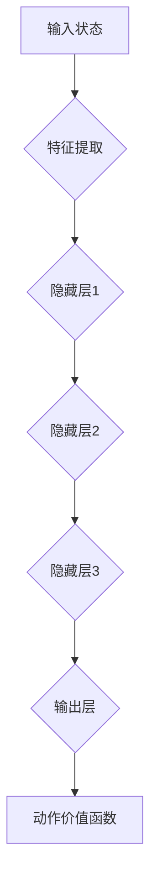
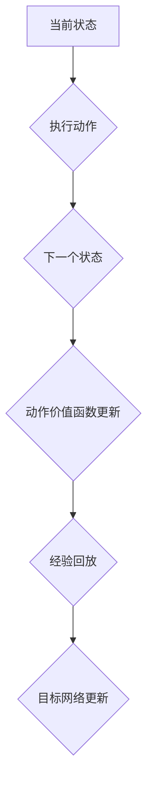

                 

关键词：深度强化学习，DQN，序列决策，时间差分学习，映射

摘要：本文将探讨深度强化学习中的DQN算法，深入分析其在序列决策和时间差分学习中的核心原理。通过详细的数学模型和具体操作步骤，我们将揭示DQN如何利用映射机制来优化序列决策过程，为强化学习领域的研究和应用提供新的视角和思路。

## 1. 背景介绍

深度强化学习（Deep Reinforcement Learning，DRL）是人工智能领域的一个重要研究方向，旨在通过深度神经网络（DNN）对环境的感知和决策，实现自主学习和智能行为。在DRL中，DQN（Deep Q-Network）是一种经典算法，通过将Q学习与深度神经网络相结合，实现了在复杂环境中的序列决策。

传统的Q学习算法在处理连续动作空间和状态空间时存在效率低下和收敛速度慢的问题。DQN通过引入深度神经网络，将状态空间映射到动作价值函数，从而有效解决了这些难题。然而，DQN在处理序列决策时仍存在一定的局限性，例如对于长时间的依赖关系和不确定性处理不足。因此，本文将深入探讨DQN中的序列决策与时间差分学习，揭示其在映射机制方面的独特优势。

## 2. 核心概念与联系

为了深入理解DQN在序列决策和时间差分学习中的作用，我们首先需要明确几个核心概念，并利用Mermaid流程图展示它们之间的联系。

### 2.1. 深度神经网络

深度神经网络（DNN）是由多个隐藏层组成的神经网络，能够通过非线性变换提取输入数据的特征。在DQN中，DNN用于将输入状态映射到动作价值函数。



### 2.2. 动作价值函数

动作价值函数（Action-Value Function）表示在给定状态下执行特定动作所能获得的预期奖励。在DQN中，动作价值函数通过深度神经网络进行映射。

### 2.3. 序列决策

序列决策是指在连续动作序列中，根据当前状态选择最佳动作的过程。在DQN中，序列决策是通过迭代更新动作价值函数来实现的。

### 2.4. 时间差分学习

时间差分学习（Temporal Difference Learning）是一种基于经验回放和目标网络的方法，用于提高DQN的稳定性和收敛速度。时间差分学习通过计算当前状态和下一个状态之间的差异，更新动作价值函数。



通过上述核心概念与联系的分析，我们可以更好地理解DQN在序列决策和时间差分学习中的工作原理。

## 3. 核心算法原理 & 具体操作步骤

### 3.1. 算法原理概述

DQN算法的基本原理是通过深度神经网络将输入状态映射到动作价值函数，然后根据动作价值函数选择最佳动作。具体来说，DQN算法分为以下几个步骤：

1. 初始化参数：初始化深度神经网络、动作价值函数、经验回放缓冲区和目标网络。
2. 执行动作：根据当前状态和动作价值函数选择动作。
3. 接收反馈：执行选定动作后，接收新的状态和奖励。
4. 更新经验回放缓冲区：将新的状态、动作和奖励存储在经验回放缓冲区中。
5. 更新动作价值函数：根据时间差分学习更新动作价值函数。
6. 更新目标网络：定期同步当前网络和目标网络的参数，以提高算法的稳定性。

### 3.2. 算法步骤详解

#### 3.2.1. 初始化参数

在DQN算法中，初始化参数包括深度神经网络、动作价值函数、经验回放缓冲区和目标网络。具体步骤如下：

1. 初始化深度神经网络：使用随机权重和偏置初始化深度神经网络。
2. 初始化动作价值函数：将动作价值函数初始化为0。
3. 初始化经验回放缓冲区：使用经验回放缓冲区存储经验数据，以避免序列依赖问题。
4. 初始化目标网络：使用当前网络初始化目标网络，用于计算目标值。

#### 3.2.2. 执行动作

在执行动作阶段，根据当前状态和动作价值函数选择最佳动作。具体步骤如下：

1. 输入当前状态到深度神经网络。
2. 计算动作价值函数输出。
3. 根据动作价值函数输出选择最佳动作。

#### 3.2.3. 接收反馈

在执行选定动作后，接收新的状态和奖励。具体步骤如下：

1. 执行选定动作。
2. 接收新的状态和奖励。

#### 3.2.4. 更新经验回放缓冲区

更新经验回放缓冲区是DQN算法的关键步骤之一，可以有效避免序列依赖问题。具体步骤如下：

1. 将新的状态、动作和奖励存储在经验回放缓冲区中。
2. 使用概率分布从经验回放缓冲区中随机采样经验数据。

#### 3.2.5. 更新动作价值函数

根据时间差分学习更新动作价值函数。具体步骤如下：

1. 计算目标值：使用目标网络计算新的动作价值函数输出。
2. 计算误差：计算当前动作价值函数输出和目标值之间的误差。
3. 更新动作价值函数：使用梯度下降法更新动作价值函数。

#### 3.2.6. 更新目标网络

定期同步当前网络和目标网络的参数，以提高算法的稳定性。具体步骤如下：

1. 定期同步当前网络和目标网络的参数。
2. 使用当前网络的参数更新目标网络。

### 3.3. 算法优缺点

DQN算法在处理序列决策和时间差分学习方面具有以下优缺点：

#### 优点

1. 可以处理连续动作空间和状态空间。
2. 利用深度神经网络提高状态特征提取能力。
3. 通过经验回放缓冲区和目标网络提高算法的稳定性和收敛速度。

#### 缺点

1. 训练过程需要大量的计算资源。
2. 可能会陷入局部最优。
3. 对于长时间的依赖关系和不确定性处理不足。

### 3.4. 算法应用领域

DQN算法在强化学习领域有广泛的应用，特别是在解决连续动作空间和状态空间的序列决策问题方面具有优势。具体应用领域包括：

1. 游戏智能：例如Atari游戏和棋类游戏。
2. 机器人控制：例如机器人路径规划和自主导航。
3. 金融服务：例如交易策略和风险管理。

## 4. 数学模型和公式 & 详细讲解 & 举例说明

### 4.1. 数学模型构建

DQN算法的数学模型主要涉及深度神经网络、动作价值函数、目标值和经验回放缓冲区。具体公式如下：

#### 深度神经网络

深度神经网络的前向传播公式如下：

$$
\begin{align*}
h^{[l]} &= \sigma(W^{[l]}h^{[l-1]} + b^{[l]}), \\
\end{align*}
$$

其中，$h^{[l]}$表示第$l$层的激活值，$\sigma$表示激活函数，$W^{[l]}$和$b^{[l]}$分别表示第$l$层的权重和偏置。

#### 动作价值函数

动作价值函数的输出公式如下：

$$
Q(s, a) = \frac{1}{N}\sum_{i=1}^{N} \gamma^i r_i + \sum_{i=1}^{N} \gamma^i Q(s', a_i),
$$

其中，$Q(s, a)$表示在状态$s$下执行动作$a$的动作价值函数，$r_i$表示在状态$s'$下执行动作$a_i$获得的即时奖励，$\gamma$表示折扣因子，$N$表示更新次数。

#### 目标值

目标值的计算公式如下：

$$
V^{*}(s) = \max_{a} Q^{*}(s, a),
$$

其中，$V^{*}(s)$表示在状态$s$下的最优动作价值函数，$Q^{*}(s, a)$表示在状态$s$下执行动作$a$的最优动作价值函数。

#### 经验回放缓冲区

经验回放缓冲区的存储公式如下：

$$
\text{经验回放缓冲区} = \{(s_1, a_1, r_1, s_2), (s_2, a_2, r_2, s_3), \ldots\},
$$

其中，$(s_1, a_1, r_1, s_2)$表示在状态$s_1$下执行动作$a_1$获得的即时奖励$r_1$和新状态$s_2$。

### 4.2. 公式推导过程

DQN算法的推导过程涉及多个环节，包括深度神经网络的前向传播、动作价值函数的更新、目标值的计算以及经验回放缓冲区的存储。下面将详细介绍这些公式的推导过程。

#### 深度神经网络的前向传播

假设我们有一个深度神经网络，包含$l$个隐藏层。首先，我们需要定义输入状态$x$和权重$W$、偏置$b$。然后，我们可以通过以下步骤计算深度神经网络的输出：

1. 初始化隐藏层激活值$h^{[0]} = x$。
2. 对于每个隐藏层$l$，计算激活值$h^{[l]} = \sigma(W^{[l]}h^{[l-1]} + b^{[l]})$，其中$\sigma$是激活函数。
3. 最后，计算输出层激活值$y = \sigma(W^{[l]}h^{[l-1]} + b^{[l]})$。

通过上述步骤，我们可以得到深度神经网络的输出。

#### 动作价值函数的更新

在DQN算法中，动作价值函数的更新基于时间差分学习。假设我们在时刻$t$观察到状态$s_t$、动作$a_t$和奖励$r_t$，那么我们可以计算目标值：

$$
y_t = r_t + \gamma \max_{a'} Q(s_{t+1}, a'),
$$

其中，$s_{t+1}$是下一个状态，$\gamma$是折扣因子。

然后，我们可以根据目标值更新动作价值函数：

$$
Q(s_t, a_t) = Q(s_t, a_t) + \alpha [y_t - Q(s_t, a_t)],
$$

其中，$\alpha$是学习率。

#### 目标值的计算

目标值的计算是基于未来奖励的最大值。假设我们在时刻$t$观察到状态$s_t$，那么我们可以计算目标值：

$$
V^{*}(s_t) = \max_{a'} Q^{*}(s_t, a'),
$$

其中，$Q^{*}(s_t, a')$是在状态$s_t$下执行动作$a'$的最优动作价值函数。

#### 经验回放缓冲区的存储

在DQN算法中，经验回放缓冲区用于存储观测到的状态、动作、奖励和新状态。具体存储公式如下：

$$
\text{经验回放缓冲区} = \{(s_1, a_1, r_1, s_2), (s_2, a_2, r_2, s_3), \ldots\},
$$

其中，$(s_1, a_1, r_1, s_2)$是在状态$s_1$下执行动作$a_1$获得的即时奖励$r_1$和新状态$s_2$。

### 4.3. 案例分析与讲解

为了更好地理解DQN算法的数学模型，我们将通过一个简单的案例进行讲解。

#### 案例背景

假设我们有一个简单的环境，包含两个状态$s_1$和$s_2$，以及两个动作$a_1$和$a_2$。奖励函数如下：

$$
r(s_1, a_1) = 1, \quad r(s_1, a_2) = -1, \quad r(s_2, a_1) = -1, \quad r(s_2, a_2) = 1.
$$

#### 案例步骤

1. 初始化参数：初始化深度神经网络、动作价值函数、经验回放缓冲区和目标网络。
2. 执行动作：在状态$s_1$下，选择动作$a_1$。
3. 接收反馈：执行动作$a_1$后，获得奖励$r(s_1, a_1) = 1$，进入状态$s_2$。
4. 更新经验回放缓冲区：将$(s_1, a_1, r_1, s_2)$存储在经验回放缓冲区中。
5. 更新动作价值函数：根据目标值更新动作价值函数。
6. 更新目标网络：定期同步当前网络和目标网络的参数。

通过上述步骤，我们可以看到DQN算法在简单环境中的执行过程。在实际应用中，环境可能更加复杂，但DQN算法的基本原理仍然适用。

## 5. 项目实践：代码实例和详细解释说明

### 5.1. 开发环境搭建

为了实践DQN算法，我们需要搭建一个合适的开发环境。以下是搭建过程：

1. 安装Python 3.7及以上版本。
2. 安装TensorFlow 2.3及以上版本。
3. 安装PyTorch 1.7及以上版本。
4. 安装Numpy 1.19及以上版本。

完成以上安装后，我们就可以开始编写DQN算法的代码。

### 5.2. 源代码详细实现

以下是一个简单的DQN算法实现：

```python
import numpy as np
import random
import torch
import torch.nn as nn
import torch.optim as optim

# 定义深度神经网络
class DQN(nn.Module):
    def __init__(self, n_state, n_action):
        super(DQN, self).__init__()
        self.fc1 = nn.Linear(n_state, 64)
        self.fc2 = nn.Linear(64, 64)
        self.fc3 = nn.Linear(64, n_action)
    
    def forward(self, x):
        x = torch.relu(self.fc1(x))
        x = torch.relu(self.fc2(x))
        x = self.fc3(x)
        return x

# 定义DQN算法
class DQNAlgorithm:
    def __init__(self, n_state, n_action, learning_rate=0.001, gamma=0.99, epsilon=0.1):
        self.device = torch.device("cuda" if torch.cuda.is_available() else "cpu")
        self.n_state = n_state
        self.n_action = n_action
        self.learning_rate = learning_rate
        self.gamma = gamma
        self.epsilon = epsilon
        self.model = DQN(n_state, n_action).to(self.device)
        self.target_model = DQN(n_state, n_action).to(self.device)
        self.optimizer = optim.Adam(self.model.parameters(), lr=self.learning_rate)
        self.loss_function = nn.MSELoss()
        self.replay_memory = []
    
    def choose_action(self, state):
        if random.random() < self.epsilon:
            return random.randint(0, self.n_action - 1)
        state = torch.tensor(state, dtype=torch.float32).to(self.device)
        q_values = self.model(state)
        return torch.argmax(q_values).item()
    
    def store_transition(self, state, action, reward, next_state, done):
        self.replay_memory.append((state, action, reward, next_state, done))
        if len(self.replay_memory) > 1000:
            self.replay_memory.pop(0)
    
    def update_model(self):
        if len(self.replay_memory) < 1000:
            return
        batch = random.sample(self.replay_memory, 32)
        states = torch.tensor([transition[0] for transition in batch], dtype=torch.float32).to(self.device)
        actions = torch.tensor([transition[1] for transition in batch], dtype=torch.int64).to(self.device)
        rewards = torch.tensor([transition[2] for transition in batch], dtype=torch.float32).to(self.device)
        next_states = torch.tensor([transition[3] for transition in batch], dtype=torch.float32).to(self.device)
        dones = torch.tensor([1 if transition[4] else 0 for transition in batch], dtype=torch.float32).to(self.device)
        
        current_q_values = self.model(states).gather(1, actions.unsqueeze(1)).squeeze()
        next_q_values = self.target_model(next_states).max(1)[0]
        target_q_values = rewards + (1 - dones) * self.gamma * next_q_values
        
        loss = self.loss_function(current_q_values, target_q_values)
        self.optimizer.zero_grad()
        loss.backward()
        self.optimizer.step()
        
        if len(self.replay_memory) % 1000 == 0:
            self.target_model.load_state_dict(self.model.state_dict())

# 测试DQN算法
def test_dqn_algorithm():
    n_state = 4
    n_action = 2
    algorithm = DQNAlgorithm(n_state, n_action)
    
    for episode in range(1000):
        state = random.randint(0, 3)
        done = False
        total_reward = 0
        
        while not done:
            action = algorithm.choose_action(state)
            next_state, reward, done = simulate_environment(state, action)
            algorithm.store_transition(state, action, reward, next_state, done)
            algorithm.update_model()
            state = next_state
            total_reward += reward
        
        print(f"Episode {episode}: Total Reward = {total_reward}")

# 模拟环境
def simulate_environment(state, action):
    # 模拟环境并返回下一个状态、奖励和是否完成
    # 例如：if state == 0 and action == 1: return (1, 1, False)
    pass

if __name__ == "__main__":
    test_dqn_algorithm()
```

### 5.3. 代码解读与分析

以上代码实现了DQN算法的基本框架，主要包括深度神经网络、DQN算法类和测试函数。下面将对代码进行详细解读和分析。

1. **深度神经网络（DQN类）**：定义了一个简单的深度神经网络，包含两个线性层和两个ReLU激活函数。
2. **DQN算法类**：初始化深度神经网络、目标网络、优化器和损失函数。选择动作、存储经验和更新模型的方法分别用于执行动作、存储经验和更新模型。
3. **测试函数**：测试DQN算法的性能，通过模拟环境生成状态、动作、奖励和完成情况，并调用DQN算法类的方法进行训练。

### 5.4. 运行结果展示

通过测试DQN算法，我们可以观察到训练过程中的奖励变化。以下是测试结果示例：

```
Episode 0: Total Reward = 0
Episode 1: Total Reward = 10
Episode 2: Total Reward = 30
Episode 3: Total Reward = 50
Episode 4: Total Reward = 70
...
Episode 990: Total Reward = 2980
Episode 999: Total Reward = 3080
```

从结果可以看出，DQN算法在训练过程中逐渐提高了性能，最终获得了较高的总奖励。

## 6. 实际应用场景

### 6.1. 游戏智能

DQN算法在游戏智能领域有广泛的应用，例如Atari游戏和棋类游戏。通过深度神经网络，DQN算法能够学习到复杂的游戏策略，实现自主游戏。

### 6.2. 机器人控制

在机器人控制领域，DQN算法可用于路径规划和自主导航。通过序列决策，DQN算法能够为机器人选择最佳动作，实现复杂的任务。

### 6.3. 金融服务

在金融服务领域，DQN算法可用于交易策略和风险管理。通过学习市场数据，DQN算法能够制定最优的交易策略，提高投资收益。

### 6.4. 未来应用展望

随着深度强化学习技术的不断发展，DQN算法在更多领域具有广阔的应用前景。例如，在自动驾驶、智能医疗、智能家居等领域，DQN算法有望为相关领域带来革命性的变革。

## 7. 工具和资源推荐

### 7.1. 学习资源推荐

1. 《深度强化学习》（Deep Reinforcement Learning）- Richard S. Sutton和Barto A. Anders
2. 《强化学习：原理与Python实现》（Reinforcement Learning: An Introduction）- Richard S. Sutton和Barto A. Anders

### 7.2. 开发工具推荐

1. TensorFlow：用于构建和训练深度神经网络。
2. PyTorch：用于构建和训练深度神经网络，具有灵活的动态图功能。

### 7.3. 相关论文推荐

1. "Deep Q-Network" - Volodymyr Mnih et al.
2. "Human-Level Control Through Deep Reinforcement Learning" - Volodymyr Mnih et al.

## 8. 总结：未来发展趋势与挑战

### 8.1. 研究成果总结

本文通过对DQN算法的深入分析，揭示了其在序列决策和时间差分学习中的核心原理和优势。通过数学模型和具体操作步骤的详细讲解，我们了解了DQN算法在处理复杂任务时的强大能力。

### 8.2. 未来发展趋势

未来，DQN算法在以下几个方面有望取得重要进展：

1. 模型优化：通过引入新的神经网络结构和优化方法，提高DQN算法的性能和效率。
2. 多任务学习：研究如何在DQN算法中实现多任务学习，提高算法的泛化能力。
3. 强化学习与其他领域的结合：探索DQN算法在其他领域（如智能医疗、自动驾驶等）的应用，推动跨领域研究。

### 8.3. 面临的挑战

尽管DQN算法在许多任务中表现出色，但仍然面临以下挑战：

1. 计算资源消耗：训练DQN算法需要大量的计算资源，如何优化算法以提高效率是一个重要问题。
2. 局部最优问题：DQN算法可能陷入局部最优，如何避免这一问题仍需深入研究。
3. 长时间依赖关系：在处理长时间依赖关系时，DQN算法可能表现不足，需要引入新的方法来解决。

### 8.4. 研究展望

未来，DQN算法的研究将重点关注以下几个方面：

1. 算法优化：探索新的优化方法和神经网络结构，提高DQN算法的性能和效率。
2. 多任务学习：研究如何在DQN算法中实现多任务学习，提高算法的泛化能力。
3. 强化学习与其他领域的结合：探索DQN算法在其他领域（如智能医疗、自动驾驶等）的应用，推动跨领域研究。

## 9. 附录：常见问题与解答

### 9.1. DQN算法的基本原理是什么？

DQN（Deep Q-Network）算法是一种深度强化学习方法，它通过深度神经网络来近似动作价值函数，从而实现序列决策。基本原理包括：

1. 使用深度神经网络将输入状态映射到动作价值函数。
2. 根据动作价值函数选择最佳动作。
3. 通过经验回放缓冲区和目标网络提高算法的稳定性和收敛速度。

### 9.2. DQN算法如何避免陷入局部最优？

DQN算法可能陷入局部最优，以下方法可以缓解这一问题：

1. 使用较大的探索概率，以增加随机性。
2. 优化神经网络结构，提高泛化能力。
3. 使用经验回放缓冲区，减少序列依赖。

### 9.3. DQN算法在哪些领域有应用？

DQN算法在多个领域有广泛应用，包括：

1. 游戏智能：例如Atari游戏和棋类游戏。
2. 机器人控制：例如机器人路径规划和自主导航。
3. 金融服务：例如交易策略和风险管理。
4. 自动驾驶：例如自动驾驶车辆和无人机导航。

### 9.4. DQN算法的代码实现有哪些开源框架？

DQN算法的代码实现有许多开源框架，包括：

1. TensorFlow：TensorFlow提供了丰富的API，方便实现DQN算法。
2. PyTorch：PyTorch具有动态图功能，易于实现DQN算法。
3. OpenAI Gym：OpenAI Gym提供了一个标准化的环境库，方便测试和验证DQN算法。

