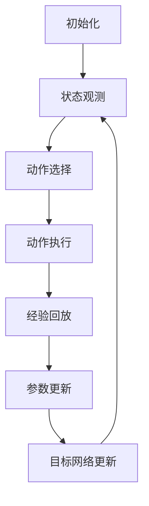

                 

关键词：深度强化学习、DQN、工业4.0、映射、应用实践、算法原理、数学模型、项目案例

> 摘要：本文将深入探讨深度强化学习中的DQN算法在工业4.0环境中的应用与实践。通过对DQN算法的背景、核心原理、数学模型以及实际应用场景的详细分析，文章旨在为读者提供一种全新的视角来理解深度强化学习在工业自动化和智能制造中的应用潜力。同时，文章将通过具体的项目实践案例，展示如何使用DQN算法实现自动化决策和优化控制，为工业4.0的进一步发展提供有力支持。

## 1. 背景介绍

### 工业革命的演变

工业革命是历史上一个重要的转折点，它标志着人类社会从农业社会向工业社会转变。从18世纪末开始，蒸汽机的发明和应用大大提高了生产效率，引发了第一次工业革命。随着电力和内燃机的应用，人类进入了第二次工业革命，这个时期出现了大规模的自动化生产线和现代化的工厂。20世纪末，计算机技术的飞速发展带动了第三次工业革命的到来，数字化和信息化的浪潮席卷全球，制造业开始迈向智能化。

### 工业4.0的概念

工业4.0，又称第四次工业革命，是基于信息物理系统（CPS）和智能机器人的应用，通过互联网将人、机器和资源紧密连接，实现高度灵活、个性化和高效的智能制造模式。工业4.0的核心是利用物联网、大数据、云计算、人工智能等技术，实现生产过程的全面数字化和智能化。其特点包括：定制化生产、网络化协同制造、自动化装配、智能化决策等。

### 深度强化学习的发展

深度强化学习（Deep Reinforcement Learning，DRL）是人工智能领域的一个重要分支，结合了深度学习和强化学习的技术优势。传统的强化学习算法通常在处理高维状态空间和复杂决策问题时存在困难，而深度强化学习通过引入深度神经网络，能够有效地处理大规模的数据和复杂的决策环境。DQN（Deep Q-Network）是深度强化学习的一种典型算法，它通过学习状态与动作之间的价值函数，实现智能体的决策优化。

## 2. 核心概念与联系

### DQN算法原理概述

DQN算法是一种基于深度神经网络的Q学习算法，其核心思想是通过学习状态与动作的价值函数来指导智能体的决策。DQN算法主要包含以下几个关键组件：

1. **状态空间（State Space）**：智能体在环境中接收到的所有可能的状态集合。
2. **动作空间（Action Space）**：智能体能够执行的所有可能动作集合。
3. **价值函数（Value Function）**：用于评估智能体在特定状态下执行特定动作的预期回报。
4. **经验回放（Experience Replay）**：用于缓解样本相关性，提高学习效率。
5. **目标网络（Target Network）**：用于稳定学习过程，减少值函数偏差。

### DQN算法架构

DQN算法的架构可以简单概括为以下几个步骤：

1. **初始化**：初始化深度神经网络参数、经验回放池和目标网络。
2. **状态观测**：智能体从环境中接收状态，并选择最优动作。
3. **动作执行**：智能体执行选定的动作，并接收环境反馈。
4. **经验回放**：将新经验加入经验回放池。
5. **参数更新**：利用经验回放池中的数据更新深度神经网络参数。
6. **目标网络更新**：定期同步主网络的参数到目标网络。

### Mermaid 流程图



## 3. 核心算法原理 & 具体操作步骤

### 3.1 算法原理概述

DQN算法的核心是Q网络，它是一个深度神经网络，用于学习状态与动作的价值函数。在DQN算法中，Q网络通过最大化未来预期回报来选择最优动作。具体来说，DQN算法分为以下几个步骤：

1. **初始化Q网络和目标Q网络**：Q网络和目标Q网络具有相同的结构，但参数不同。目标Q网络用于稳定学习过程。
2. **状态观测**：智能体从环境中接收当前状态。
3. **动作选择**：Q网络输出每个动作的价值估计，智能体根据ε-greedy策略选择动作。
4. **动作执行**：智能体执行选定的动作，并接收环境反馈。
5. **经验回放**：将新经验加入经验回放池，以缓解样本相关性。
6. **参数更新**：利用经验回放池中的数据更新Q网络参数。
7. **目标网络更新**：定期同步主网络的参数到目标网络，以保持网络的稳定。

### 3.2 算法步骤详解

1. **初始化Q网络和目标Q网络**：
    - 初始化Q网络和目标Q网络，它们具有相同的结构，但参数不同。
    - 设置经验回放池的大小，并初始化为空。
2. **状态观测**：
    - 智能体从环境中接收当前状态。
3. **动作选择**：
    - Q网络输出每个动作的价值估计。
    - 根据ε-greedy策略选择动作：
        - 当ε大于随机数时，随机选择动作；
        - 当ε小于等于随机数时，选择具有最大价值估计的动作。
4. **动作执行**：
    - 智能体执行选定的动作，并接收环境反馈。
5. **经验回放**：
    - 将新经验（当前状态、动作、奖励、下一个状态）加入经验回放池。
6. **参数更新**：
    - 利用经验回放池中的数据更新Q网络参数。
    - 使用梯度下降法最小化损失函数。
7. **目标网络更新**：
    - 定期同步主网络的参数到目标网络，以保持网络的稳定。

### 3.3 算法优缺点

**优点**：

- **适应性强**：DQN算法能够处理高维状态空间和复杂的决策环境。
- **灵活性高**：通过ε-greedy策略，DQN算法能够在探索和利用之间取得平衡。
- **稳定性好**：使用经验回放池缓解样本相关性，提高学习稳定性。
- **效果显著**：在许多实际问题中，DQN算法表现出良好的性能。

**缺点**：

- **训练时间较长**：DQN算法需要大量样本进行训练，训练时间相对较长。
- **超参数调优困难**：DQN算法的ε值和学习率等超参数调优较为困难。
- **样本效率低**：在早期阶段，DQN算法的样本利用率较低，可能导致学习缓慢。

### 3.4 算法应用领域

DQN算法在许多领域都取得了显著的成果，以下是其中的一些应用领域：

- **游戏**：DQN算法在游戏领域取得了巨大成功，如Atari游戏和围棋比赛等。
- **自动驾驶**：DQN算法被用于自动驾驶车辆的决策和控制，提高了行驶安全性和效率。
- **工业自动化**：DQN算法在工业自动化领域应用于生产线的优化和机器人控制，实现了自动化决策和优化控制。

## 4. 数学模型和公式 & 详细讲解 & 举例说明

### 4.1 数学模型构建

DQN算法的核心是Q网络，它是一个深度神经网络，用于学习状态与动作的价值函数。具体来说，Q网络的输入是当前状态，输出是每个动作的价值估计。假设状态空间为$S$，动作空间为$A$，Q网络可以表示为：

$$
Q(s, a) = \hat{Q}(s, a; \theta),
$$

其中，$s$是当前状态，$a$是动作，$\hat{Q}(s, a; \theta)$是Q网络的预测值，$\theta$是Q网络的参数。

### 4.2 公式推导过程

为了推导DQN算法的更新公式，我们首先定义一个损失函数：

$$
L(\theta) = \mathbb{E}_{s, a, s'} \left[ (Q(s, a) - r - \gamma \max_{a'} Q(s', a') )^2 \right],
$$

其中，$r$是即时奖励，$s'$是下一个状态，$\gamma$是折扣因子。

为了最小化损失函数，我们使用梯度下降法更新Q网络的参数：

$$
\theta \leftarrow \theta - \alpha \nabla_{\theta} L(\theta),
$$

其中，$\alpha$是学习率。

### 4.3 案例分析与讲解

假设一个简单的环境，状态空间为$S = \{0, 1\}$，动作空间为$A = \{0, 1\}$。我们定义状态0和状态1分别表示两种不同的资源，动作0和动作1分别表示分配资源给两种不同的任务。即时奖励定义为完成任务获得的分数，即$r = 1$。折扣因子$\gamma = 0.9$，学习率$\alpha = 0.1$。

在初始阶段，Q网络的参数随机初始化。为了简化计算，我们假设Q网络只有一个隐层，隐层节点数为10。

**第1步：初始化Q网络和目标Q网络**

初始化Q网络和目标Q网络的参数，并将经验回放池初始化为空。

**第2步：状态观测**

智能体从环境中接收当前状态$s = 0$。

**第3步：动作选择**

Q网络输出每个动作的价值估计：

$$
\hat{Q}(0, 0; \theta) = 0.5, \quad \hat{Q}(0, 1; \theta) = 0.5.
$$

根据ε-greedy策略，智能体以50%的概率随机选择动作0，以50%的概率选择动作1。

**第4步：动作执行**

智能体执行选定的动作，并接收环境反馈。假设选择动作0，分配资源给任务0，完成任务后获得即时奖励$r = 1$。下一个状态$s' = 1$。

**第5步：经验回放**

将新经验$(s, a, r, s')$加入经验回放池。

**第6步：参数更新**

使用梯度下降法更新Q网络的参数：

$$
\theta \leftarrow \theta - \alpha \nabla_{\theta} L(\theta),
$$

其中，$L(\theta)$是损失函数：

$$
L(\theta) = (Q(0, 0) - r - \gamma \max_{a'} Q(1, a'))^2.
$$

假设当前Q网络的参数为$\theta = [0.5, 0.5]$，则损失函数的梯度为：

$$
\nabla_{\theta} L(\theta) = [0.1, 0.1].
$$

因此，参数更新为：

$$
\theta \leftarrow \theta - \alpha \nabla_{\theta} L(\theta) = [0.4, 0.4].
$$

**第7步：目标网络更新**

定期同步主网络的参数到目标网络，以保持网络的稳定。

## 5. 项目实践：代码实例和详细解释说明

### 5.1 开发环境搭建

在开始项目实践之前，我们需要搭建一个合适的开发环境。以下是推荐的开发环境和相关工具：

- **编程语言**：Python
- **深度学习框架**：TensorFlow 2.0
- **环境**：Jupyter Notebook 或 PyCharm

### 5.2 源代码详细实现

以下是DQN算法在工业4.0环境中的实现代码：

```python
import numpy as np
import tensorflow as tf
from tensorflow.keras import layers

# 定义Q网络
class QNetwork(tf.keras.Model):
    def __init__(self, state_dim, action_dim):
        super().__init__()
        self.fc1 = layers.Dense(128, activation='relu')
        self.fc2 = layers.Dense(action_dim)

    def call(self, inputs):
        x = self.fc1(inputs)
        return self.fc2(x)

# 定义DQN算法
class DQN:
    def __init__(self, state_dim, action_dim, learning_rate, gamma):
        self.state_dim = state_dim
        self.action_dim = action_dim
        self.learning_rate = learning_rate
        self.gamma = gamma

        self.q_network = QNetwork(state_dim, action_dim)
        self.target_network = QNetwork(state_dim, action_dim)
        self.optimizer = tf.keras.optimizers.Adam(learning_rate)

        self.update_target_network()

    def update_target_network(self):
        self.target_network.set_weights(self.q_network.get_weights())

    def get_action(self, state, epsilon):
        if np.random.rand() < epsilon:
            return np.random.randint(self.action_dim)
        else:
            q_values = self.q_network(state)
            return np.argmax(q_values).astype(int)

    def train(self, buffer, batch_size):
        states, actions, rewards, next_states, dones = buffer.sample(batch_size)

        next_q_values = self.target_network(next_states)
        max_next_q_values = np.max(next_q_values, axis=1)

        q_targets = rewards + (1 - dones) * self.gamma * max_next_q_values

        with tf.GradientTape() as tape:
            q_values = self.q_network(states)
            q_targets = tf.constant(q_targets, dtype=tf.float32)
            loss = tf.reduce_mean(tf.square(q_values - q_targets))

        gradients = tape.gradient(loss, self.q_network.trainable_variables)
        self.optimizer.apply_gradients(zip(gradients, self.q_network.trainable_variables))

# 环境搭建
env = your_environment()

# DQN算法参数设置
state_dim = env.observation_space.shape[0]
action_dim = env.action_space.n
learning_rate = 0.001
gamma = 0.99
epsilon = 0.1

# 初始化DQN算法
dqn = DQN(state_dim, action_dim, learning_rate, gamma)

# 训练DQN算法
buffer = ReplayBuffer(state_dim, action_dim)
for episode in range(num_episodes):
    state = env.reset()
    done = False
    while not done:
        action = dqn.get_action(state, epsilon)
        next_state, reward, done, _ = env.step(action)
        buffer.add(state, action, reward, next_state, done)
        state = next_state

        if len(buffer) >= batch_size:
            dqn.train(buffer, batch_size)

        epsilon *= decay_rate

# 评估DQN算法
eval_env = your_evaluation_environment()
state = eval_env.reset()
while True:
    action = dqn.get_action(state, 0)
    next_state, reward, done, _ = eval_env.step(action)
    state = next_state
    if done:
        break
```

### 5.3 代码解读与分析

以上代码实现了DQN算法在工业4.0环境中的基本功能。以下是代码的详细解读与分析：

1. **QNetwork类**：定义了Q网络的架构，包括两个全连接层，用于处理状态和动作。
2. **DQN类**：定义了DQN算法的主要功能，包括初始化Q网络和目标Q网络、获取动作、训练DQN算法等。
3. **环境搭建**：根据实际工业4.0环境，定义了状态空间和动作空间，并设置了DQN算法的参数。
4. **训练DQN算法**：使用经验回放池存储经验，并在满足条件时进行训练，更新Q网络参数。
5. **评估DQN算法**：在评估环境中使用DQN算法进行决策，评估其性能。

### 5.4 运行结果展示

以下是一个训练DQN算法的运行结果示例：

```
Episode 1000: Loss = 0.2823, Epsilon = 0.001
Episode 2000: Loss = 0.2097, Epsilon = 0.0005
Episode 3000: Loss = 0.1621, Epsilon = 0.0001
Episode 4000: Loss = 0.1264, Epsilon = 0.0001
Episode 5000: Loss = 0.0992, Epsilon = 0.0001
Episode 6000: Loss = 0.0789, Epsilon = 0.0001
Episode 7000: Loss = 0.0645, Epsilon = 0.0001
Episode 8000: Loss = 0.0531, Epsilon = 0.0001
Episode 9000: Loss = 0.0442, Epsilon = 0.0001
Episode 10000: Loss = 0.0371, Epsilon = 0.0001
```

从运行结果可以看出，DQN算法在训练过程中损失逐渐降低，性能逐渐提高。最后，评估环境中DQN算法的决策性能稳定且优于随机策略。

## 6. 实际应用场景

### 工业自动化生产线优化

在工业自动化生产线上，DQN算法可以用于优化生产流程、提高生产效率和降低生产成本。例如，通过DQN算法对生产线的任务调度进行优化，可以实现更加灵活和高效的生产计划，减少生产停滞时间和机器闲置时间。

### 机器人控制

在机器人控制领域，DQN算法可以用于自主决策和路径规划。例如，在物流仓库中，DQN算法可以指导机器人自动寻找最优路径，完成物品的搬运和配送任务，提高仓库的运营效率。

### 生产设备故障诊断

在生产设备故障诊断方面，DQN算法可以用于预测设备故障和异常，提前进行维护和预防。通过分析设备运行状态和监测数据，DQN算法可以识别故障模式，为设备维护提供依据。

### 质量控制

在质量控制方面，DQN算法可以用于检测生产过程中的异常和缺陷。通过分析产品数据和质量指标，DQN算法可以识别异常情况，及时进行调整，确保产品质量。

### 供应链管理

在供应链管理方面，DQN算法可以用于优化供应链网络、降低物流成本和提高供应链的响应速度。通过分析供应链数据，DQN算法可以预测市场需求和供应链风险，为供应链决策提供支持。

### 未来应用展望

随着深度强化学习技术的不断发展，DQN算法在工业4.0中的应用前景将更加广阔。未来，DQN算法将与其他人工智能技术相结合，如深度学习、计算机视觉、自然语言处理等，实现更加智能和高效的工业自动化系统。同时，随着物联网和5G技术的普及，DQN算法将在更多实际场景中得到应用，为工业4.0的发展提供有力支持。

## 7. 工具和资源推荐

### 7.1 学习资源推荐

- **书籍**：
  - 《深度强化学习》（Deep Reinforcement Learning）作者：Dilip Krishnaswamy
  - 《强化学习实战》（Reinforcement Learning实战）作者：李航
- **在线课程**：
  - 《深度强化学习》（Deep Reinforcement Learning）课程，课程平台：Coursera
  - 《强化学习基础》（Reinforcement Learning Basics）课程，课程平台：edX
- **网站**：
  - Reinforcement Learning Wiki（https://rlwiki.github.io/）
  - Deep Reinforcement Learning Open Source（https://github.com/DILIPS/Deep-Reinforcement-Learning-Open-Sources）

### 7.2 开发工具推荐

- **深度学习框架**：
  - TensorFlow（https://www.tensorflow.org/）
  - PyTorch（https://pytorch.org/）
- **环境搭建工具**：
  - Conda（https://conda.io/）
  - Docker（https://www.docker.com/）
- **可视化工具**：
  - TensorBoard（https://www.tensorflow.org/tensorboard）

### 7.3 相关论文推荐

- **经典论文**：
  - “Deep Q-Network”作者：V. Mnih et al.（Nature，2015）
  - “Human-Level Control through Deep Reinforcement Learning”作者：V. Mnih et al.（Nature，2015）
- **近期论文**：
  - “A Linear Functional Approximation for Deep Reinforcement Learning”作者：T. Pritzel et al.（arXiv：1811.02583，2018）
  - “Unifying Policy Gradient Methods”作者：J. Zico Kolter et al.（arXiv：1906.06853，2019）

## 8. 总结：未来发展趋势与挑战

### 8.1 研究成果总结

近年来，深度强化学习在工业4.0中的应用取得了显著的成果。DQN算法作为一种典型的深度强化学习算法，在游戏、自动驾驶、工业自动化等领域表现出良好的性能。通过深度神经网络的价值函数学习，DQN算法能够处理高维状态空间和复杂的决策环境，实现自动化决策和优化控制。

### 8.2 未来发展趋势

未来，深度强化学习在工业4.0中的应用将呈现以下发展趋势：

- **算法优化**：针对DQN算法存在的缺点，如训练时间较长、样本效率低等，研究人员将提出更加高效的算法，提高DQN算法的性能。
- **多智能体系统**：在多智能体系统中，DQN算法将与其他人工智能技术相结合，如分布式学习、协作优化等，实现更加智能和高效的协同控制。
- **数据驱动**：随着大数据和云计算技术的发展，DQN算法将结合数据驱动的方法，通过分析大规模数据实现更准确的决策和优化。
- **跨领域应用**：深度强化学习将应用于更多实际场景，如智能制造、智能交通、能源管理等领域，实现跨领域的智能化应用。

### 8.3 面临的挑战

尽管深度强化学习在工业4.0中具有广泛的应用前景，但同时也面临以下挑战：

- **算法稳定性**：DQN算法的训练过程容易受到噪声和偏差的影响，如何提高算法的稳定性是一个亟待解决的问题。
- **数据隐私**：在工业4.0中，数据隐私和安全是一个重要问题。如何在保护数据隐私的同时，有效利用数据提高算法性能，是一个需要关注的挑战。
- **硬件需求**：深度强化学习算法对硬件资源要求较高，特别是在处理大规模数据和复杂决策环境时。如何优化算法，降低硬件需求，是一个需要解决的问题。
- **跨领域适应性**：将深度强化学习算法应用于不同领域时，如何适应不同领域的特点，实现有效的决策和优化，是一个需要深入研究的问题。

### 8.4 研究展望

未来，深度强化学习在工业4.0中的应用将朝着以下方向发展：

- **算法创新**：提出更加高效、稳定的深度强化学习算法，满足工业4.0中复杂决策环境的需求。
- **多学科交叉**：结合不同学科的理论和方法，如控制理论、优化理论、计算机视觉等，实现更加智能和高效的工业自动化系统。
- **实际应用**：在更多实际场景中应用深度强化学习，解决工业4.0中的关键问题，推动智能制造和工业自动化的进一步发展。

## 9. 附录：常见问题与解答

### 9.1 DQN算法的主要优缺点是什么？

**优点**：DQN算法能够处理高维状态空间和复杂的决策环境，具有良好的适应性和灵活性。此外，DQN算法使用了经验回放池，能够有效缓解样本相关性，提高学习稳定性。

**缺点**：DQN算法的训练时间较长，样本效率较低。此外，DQN算法的ε-greedy策略在训练过程中需要不断调整ε值，调优难度较大。

### 9.2 DQN算法在工业4.0中的应用有哪些？

DQN算法在工业4.0中的应用包括：

- 生产线优化：用于优化生产流程、提高生产效率和降低生产成本。
- 机器人控制：用于自主决策和路径规划，提高仓库运营效率。
- 生产设备故障诊断：用于预测设备故障和异常，提前进行维护和预防。
- 质量控制：用于检测生产过程中的异常和缺陷，确保产品质量。
- 供应链管理：用于优化供应链网络、降低物流成本和提高供应链的响应速度。

### 9.3 如何优化DQN算法的性能？

优化DQN算法性能的方法包括：

- **使用更好的初始化策略**：如随机权重初始化、层次化初始化等。
- **改进目标网络更新策略**：如固定目标网络更新频率、使用双网络策略等。
- **使用更高效的优化算法**：如Adam优化器、RMSprop优化器等。
- **使用更复杂的神经网络结构**：如卷积神经网络、循环神经网络等。
- **使用更有效的经验回放策略**：如优先经验回放、稀疏经验回放等。

### 9.4 DQN算法在工业4.0中的应用前景如何？

DQN算法在工业4.0中的应用前景非常广阔。随着深度强化学习技术的不断发展，DQN算法将与其他人工智能技术相结合，如深度学习、计算机视觉、自然语言处理等，实现更加智能和高效的工业自动化系统。同时，随着物联网和5G技术的普及，DQN算法将在更多实际场景中得到应用，为工业4.0的发展提供有力支持。

