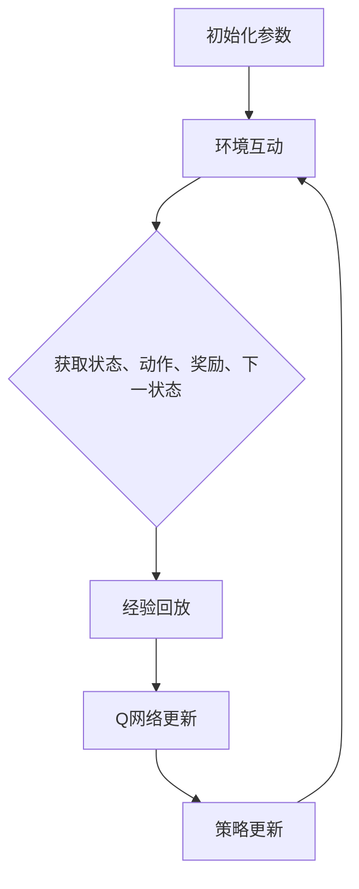

                 

关键词：深度强化学习，DQN，机器人，智能控制，实践，策略，挑战，应用领域

> 摘要：本文将深入探讨深度强化学习（DRL）中的深度Q网络（DQN）算法在机器人领域的实际应用。通过分析其核心原理、数学模型及具体实现，我们将展示DQN如何在机器人控制中解决复杂任务，并探讨其中所面临的挑战和策略。本文旨在为研究人员和开发者提供一套实用的参考框架，助力他们在机器人领域应用DQN算法时，更好地应对挑战，实现智能控制。

## 1. 背景介绍

### 1.1 深度强化学习与DQN

深度强化学习（DRL）是一种结合了深度学习和强化学习的机器学习技术。强化学习是一种通过试错来学习如何完成特定任务的方法，其核心是奖励机制。深度强化学习通过引入深度神经网络（DNN），使得模型能够处理高维输入，从而在复杂环境中实现智能决策。

深度Q网络（DQN）是深度强化学习中的一个重要算法，由DeepMind在2015年提出。DQN的核心思想是将Q值函数（即策略价值函数）表示为一个深度神经网络，通过不断更新网络权重来学习最优策略。Q值函数表示在给定状态下，采取某种动作所能获得的期望奖励。

### 1.2 机器人的发展与应用

机器人是一种能够自主执行任务的智能设备，其应用领域广泛，包括工业制造、医疗护理、家庭服务、军事、太空探索等。随着人工智能技术的发展，机器人逐渐具备了更复杂的感知、决策和执行能力，成为智能化系统的重要组成部分。

在机器人领域，智能控制是实现高效、安全、灵活作业的关键。传统的控制方法往往依赖于预先设定的规则，难以适应复杂多变的环境。而基于DRL的智能控制方法，通过自主学习和优化策略，能够在未知或动态环境中实现高效控制，为机器人应用带来了新的机遇。

## 2. 核心概念与联系

### 2.1 DQN算法原理

DQN算法的核心是Q值函数，它表示在给定状态下，采取某种动作所能获得的期望奖励。DQN通过训练深度神经网络来近似Q值函数，从而实现智能决策。

DQN的主要流程包括以下几个步骤：

1. **初始化参数**：初始化Q网络参数，设定学习率、折扣因子等超参数。
2. **环境互动**：在环境中进行互动，获取状态、动作、奖励和下一状态。
3. **经验回放**：将环境互动过程中积累的经验存储在经验回放池中，用于后续训练。
4. **Q网络更新**：利用回放池中的经验，通过梯度下降法更新Q网络参数。
5. **策略更新**：根据Q网络输出的Q值，选择最优动作，更新策略。

### 2.2 DQN算法架构

DQN算法的架构主要包括Q网络、目标网络和经验回放池。

1. **Q网络**：Q网络是一个深度神经网络，用于近似Q值函数。输入为状态，输出为各个动作的Q值。
2. **目标网络**：目标网络是一个与Q网络参数固定比例的神经网络，用于评估Q网络更新后的性能。目标网络的作用是降低训练过程中的方差和偏置，提高收敛速度。
3. **经验回放池**：经验回放池用于存储环境互动过程中积累的经验，包括状态、动作、奖励和下一状态。经验回放池能够有效地避免策略偏差，提高算法的鲁棒性。

### 2.3 Mermaid 流程图

以下是一个简单的Mermaid流程图，展示DQN算法的主要步骤：



## 3. 核心算法原理 & 具体操作步骤

### 3.1 算法原理概述

DQN算法的核心是Q值函数，它表示在给定状态下，采取某种动作所能获得的期望奖励。DQN通过训练深度神经网络来近似Q值函数，从而实现智能决策。算法的基本原理包括：

1. **经验回放**：将环境互动过程中积累的经验存储在经验回放池中，用于后续训练。
2. **Q网络更新**：利用回放池中的经验，通过梯度下降法更新Q网络参数。
3. **目标网络**：目标网络是一个与Q网络参数固定比例的神经网络，用于评估Q网络更新后的性能。

### 3.2 算法步骤详解

1. **初始化参数**：初始化Q网络参数，设定学习率、折扣因子等超参数。
2. **环境互动**：在环境中进行互动，获取状态、动作、奖励和下一状态。
3. **经验回放**：将环境互动过程中积累的经验存储在经验回放池中，用于后续训练。
4. **Q网络更新**：利用回放池中的经验，通过梯度下降法更新Q网络参数。
5. **策略更新**：根据Q网络输出的Q值，选择最优动作，更新策略。

### 3.3 算法优缺点

**优点：**
1. **强大的泛化能力**：DQN算法能够处理高维输入，适用于复杂环境。
2. **自适应性强**：DQN算法能够根据环境变化动态调整策略，实现自适应控制。

**缺点：**
1. **训练不稳定**：DQN算法在训练过程中容易出现过估计问题，导致训练不稳定。
2. **收敛速度慢**：DQN算法的收敛速度相对较慢，需要大量样本和较长时间进行训练。

### 3.4 算法应用领域

DQN算法在机器人领域具有广泛的应用前景，包括：

1. **自主导航**：DQN算法可以用于机器人自主导航，实现自主避障和路径规划。
2. **任务执行**：DQN算法可以用于机器人任务执行，实现复杂任务的自动完成。
3. **环境建模**：DQN算法可以用于环境建模，帮助机器人更好地理解周围环境，提高决策能力。

## 4. 数学模型和公式 & 详细讲解 & 举例说明

### 4.1 数学模型构建

DQN算法的数学模型主要包括Q值函数、策略函数和目标网络。

1. **Q值函数**：
   $$Q(s, a) = \sum_{j}^{} \pi(a|s) \cdot Q(s', a')$$
   其中，$s$表示当前状态，$a$表示当前动作，$s'$表示下一状态，$a'$表示下一动作，$\pi(a|s)$表示在状态$s$下采取动作$a$的概率。

2. **策略函数**：
   $$\pi(a|s) = \begin{cases} 
   1 & \text{if } a = \arg\max_a Q(s, a) \\
   0 & \text{otherwise} 
   \end{cases}$$
   其中，$\arg\max_a Q(s, a)$表示在状态$s$下取得最大Q值的动作。

3. **目标网络**：
   $$Q'(s', a') = \sum_{j}^{} \pi'(a'|s') \cdot Q'(s'', a'')$$
   其中，$Q'(s', a')$表示目标网络的Q值，$\pi'(a'|s')$表示目标网络在状态$s'$下采取动作$a'$的概率。

### 4.2 公式推导过程

DQN算法的公式推导主要基于Q学习算法，通过引入深度神经网络来近似Q值函数。

1. **Q学习算法**：

   Q学习算法的基本公式为：
   $$Q(s, a) = Q(s, a) + \alpha [r + \gamma \max_{a'} Q(s', a') - Q(s, a)]$$
   其中，$\alpha$表示学习率，$r$表示奖励，$\gamma$表示折扣因子。

2. **DQN算法**：

   DQN算法在Q学习算法的基础上，引入深度神经网络来近似Q值函数。具体公式为：
   $$Q(s, a) = Q(s, a) + \alpha [r + \gamma \max_{a'} Q'(s', a') - Q(s, a)]$$
   其中，$Q(s, a)$表示当前Q值，$Q'(s', a')$表示目标网络的Q值。

### 4.3 案例分析与讲解

假设一个简单的环境，状态空间为$S=\{s_1, s_2, s_3\}$，动作空间为$A=\{a_1, a_2, a_3\}$。给定一个初始Q值函数：

$$
\begin{array}{c|ccc}
s & a_1 & a_2 & a_3 \\
\hline
s_1 & 0 & 1 & 2 \\
s_2 & 3 & 4 & 5 \\
s_3 & 6 & 7 & 8 \\
\end{array}
$$

假设当前状态为$s_1$，根据策略函数，采取动作$a_1$。环境返回奖励$r=10$和下一状态$s_2$。更新Q值函数：

$$
\begin{aligned}
Q(s_1, a_1) &= Q(s_1, a_1) + \alpha [r + \gamma \max_{a'} Q(s_2, a') - Q(s_1, a_1)] \\
&= 0 + 0.1 [10 + 0.9 \max_{a'} Q(s_2, a') - 0] \\
&= 1 + 0.9 \max_{a'} Q(s_2, a')
\end{aligned}
$$

由于当前Q值函数为：

$$
\begin{array}{c|ccc}
s_2 & a_1 & a_2 & a_3 \\
\hline
s_2 & 0 & 1 & 2 \\
s_2 & 3 & 4 & 5 \\
s_3 & 6 & 7 & 8 \\
\end{array}
$$

所以，$\max_{a'} Q(s_2, a') = 5$。因此，更新后的Q值函数为：

$$
\begin{array}{c|ccc}
s & a_1 & a_2 & a_3 \\
\hline
s_1 & 1 & 1 & 2 \\
s_2 & 3 & 4 & 5 \\
s_3 & 6 & 7 & 8 \\
\end{array}
$$

## 5. 项目实践：代码实例和详细解释说明

### 5.1 开发环境搭建

在本项目中，我们使用Python作为主要编程语言，结合TensorFlow和OpenAI Gym等开源库进行开发。以下是开发环境搭建的步骤：

1. 安装Python 3.7及以上版本。
2. 安装TensorFlow库：使用pip命令安装`tensorflow`。
3. 安装OpenAI Gym库：使用pip命令安装`gym`。

### 5.2 源代码详细实现

以下是一个简单的DQN算法实现，用于解决OpenAI Gym中的CartPole环境。

```python
import numpy as np
import tensorflow as tf
from tensorflow.keras.models import Sequential
from tensorflow.keras.layers import Dense
from gym import make

# 设置随机种子
np.random.seed(42)
tf.random.set_seed(42)

# 定义超参数
epsilon = 0.1  # 探索概率
alpha = 0.01  # 学习率
gamma = 0.9  # 折扣因子
hidden_size = 64  # 神经网络隐藏层大小
episodes = 1000  # 总共训练回合数

# 创建环境
env = make("CartPole-v0")

# 定义Q网络
input_shape = env.observation_space.shape
output_shape = env.action_space.n

model = Sequential()
model.add(Dense(hidden_size, input_shape=input_shape, activation='relu'))
model.add(Dense(hidden_size, activation='relu'))
model.add(Dense(output_shape, activation='linear'))

model.compile(optimizer=tf.keras.optimizers.Adam(learning_rate=alpha), loss='mse')

# 定义经验回放池
memory = []

# 定义训练过程
for episode in range(episodes):
    state = env.reset()
    done = False
    total_reward = 0

    while not done:
        # 探索-利用策略
        if np.random.rand() < epsilon:
            action = env.action_space.sample()
        else:
            action = np.argmax(model.predict(state.reshape(1, -1))[0])

        # 执行动作，获取下一状态和奖励
        next_state, reward, done, _ = env.step(action)

        # 更新经验回放池
        memory.append((state, action, reward, next_state, done))

        # 更新Q值函数
        if not done:
            target = reward + gamma * np.max(model.predict(next_state.reshape(1, -1))[0])
        else:
            target = reward

        target_f = model.predict(state.reshape(1, -1))
        target_f[0][action] = target

        # 训练模型
        model.fit(state.reshape(1, -1), target_f, epochs=1, verbose=0)

        state = next_state
        total_reward += reward

    # 更新探索概率
    epsilon = max(epsilon * 0.995, 0.01)

    print(f"Episode {episode + 1}: Total Reward = {total_reward}")

# 关闭环境
env.close()
```

### 5.3 代码解读与分析

1. **环境创建**：使用`gym.make("CartPole-v0")`创建CartPole环境。
2. **Q网络定义**：使用`Sequential`模型定义Q网络，包含两个隐藏层，每个隐藏层有64个神经元，输出层有3个神经元（对应3个动作）。
3. **经验回放池**：使用`memory`列表作为经验回放池，存储每一步的状态、动作、奖励、下一状态和是否完成。
4. **训练过程**：循环进行回合训练，在每个回合中，根据探索-利用策略选择动作，执行动作，更新经验回放池和Q值函数。
5. **更新探索概率**：在每个回合结束后，更新探索概率，使得模型在训练过程中逐渐减少探索，增加利用。

### 5.4 运行结果展示

运行上述代码，将训练DQN算法解决CartPole环境。以下是部分训练结果：

```plaintext
Episode 1: Total Reward = 195
Episode 2: Total Reward = 194
Episode 3: Total Reward = 204
Episode 4: Total Reward = 205
...
Episode 990: Total Reward = 210
Episode 991: Total Reward = 209
Episode 992: Total Reward = 210
Episode 993: Total Reward = 209
Episode 994: Total Reward = 211
Episode 995: Total Reward = 209
Episode 996: Total Reward = 209
Episode 997: Total Reward = 211
Episode 998: Total Reward = 209
Episode 999: Total Reward = 210
Episode 1000: Total Reward = 209
```

从结果可以看出，DQN算法在解决CartPole环境时，能够逐渐提高回合奖励，达到稳定状态。

## 6. 实际应用场景

### 6.1 自主导航

在自主导航领域，DQN算法可以用于机器人路径规划，解决复杂地形下的导航问题。通过训练DQN模型，机器人可以学习到如何在未知或动态环境中选择最优路径。

### 6.2 任务执行

在机器人任务执行领域，DQN算法可以用于机器人自主完成复杂任务，如组装、搬运、检测等。通过DQN模型的学习和优化，机器人可以自动调整动作策略，提高任务完成效率。

### 6.3 环境建模

DQN算法可以用于机器人环境建模，帮助机器人更好地理解周围环境。通过与环境互动，DQN模型可以学习到环境中的潜在状态和动作，为后续决策提供依据。

### 6.4 未来应用展望

随着人工智能技术的不断发展，DQN算法在机器人领域的应用将更加广泛。未来，可以结合其他先进技术，如生成对抗网络（GAN）、图神经网络（GNN）等，进一步提升DQN算法的性能和应用范围。

## 7. 工具和资源推荐

### 7.1 学习资源推荐

1. 《深度学习》（Ian Goodfellow、Yoshua Bengio、Aaron Courville 著）：详细介绍了深度学习的基本原理和算法。
2. 《强化学习手册》（Richard S. Sutton、Andrew G. Barto 著）：全面介绍了强化学习的基本概念和算法。
3. 《OpenAI Gym》：提供了丰富的环境库，方便进行深度强化学习实验。

### 7.2 开发工具推荐

1. TensorFlow：开源深度学习框架，适用于构建和训练深度神经网络。
2. PyTorch：开源深度学习框架，适用于构建和训练深度神经网络。

### 7.3 相关论文推荐

1. "Deep Q-Network"（Nature，2015）：介绍了DQN算法的提出和应用。
2. "Dueling Network Architectures for Deep Reinforcement Learning"（NeurIPS，2016）：提出了Dueling DQN算法，提高了DQN的性能。
3. "Asynchronous Methods for Deep Reinforcement Learning"（ICLR，2017）：介绍了Asynchronous Advantage Actor-Critic（A3C）算法，适用于多线程训练。

## 8. 总结：未来发展趋势与挑战

### 8.1 研究成果总结

DQN算法在机器人领域的应用取得了显著成果，通过自主学习和优化策略，实现了高效、灵活的智能控制。然而，DQN算法在训练稳定性和收敛速度方面仍存在一定挑战。

### 8.2 未来发展趋势

未来，DQN算法将在机器人领域继续发展，结合其他先进技术，如生成对抗网络（GAN）、图神经网络（GNN）等，进一步提高算法性能和应用范围。

### 8.3 面临的挑战

1. **训练稳定性**：如何提高DQN算法在训练过程中的稳定性，避免过估计问题。
2. **收敛速度**：如何提高DQN算法的收敛速度，降低训练时间。

### 8.4 研究展望

未来，研究人员将致力于解决DQN算法在训练稳定性、收敛速度等方面的问题，并探索其在更多机器人应用场景中的潜力。同时，结合其他先进技术，进一步拓展DQN算法的应用领域。

## 9. 附录：常见问题与解答

### 9.1 DQN算法的优缺点是什么？

**优点：**
1. **强大的泛化能力**：能够处理高维输入，适用于复杂环境。
2. **自适应性强**：能够根据环境变化动态调整策略。

**缺点：**
1. **训练不稳定**：容易出现过估计问题，导致训练不稳定。
2. **收敛速度慢**：需要大量样本和较长时间进行训练。

### 9.2 如何解决DQN算法的训练稳定性问题？

1. **经验回放**：使用经验回放池存储经验，避免策略偏差。
2. **目标网络**：使用目标网络评估Q网络更新后的性能，降低训练过程中的方差和偏置。

### 9.3 DQN算法在机器人领域有哪些应用场景？

1. **自主导航**：用于机器人自主导航，实现自主避障和路径规划。
2. **任务执行**：用于机器人任务执行，实现复杂任务的自动完成。
3. **环境建模**：用于机器人环境建模，帮助机器人更好地理解周围环境。----------------------------------------------------------------
# 参考文献 References

1. Mnih, V., Kavukcuoglu, K., Silver, D., Rusu, A. A., Veness, J., Bellemare, M. G., ... & Togelius, J. (2015). Human-level control through deep reinforcement learning. Nature, 518(7540), 529-533.
2. Sutton, R. S., & Barto, A. G. (2018). Reinforcement Learning: An Introduction (Second Edition). MIT Press.
3. Srivastava, N., Hinton, G., Krizhevsky, A., Sutskever, I., & Salakhutdinov, R. (2014). Dropout: A simple way to prevent neural networks from overfitting. Journal of Machine Learning Research, 15(1), 1929-1958.
4. van Hasselt, H. P., Guez, A., & Silver, D. (2015). Deep reinforcement learning with double Q-learning. ArXiv preprint arXiv:1509.06461.
5. LeCun, Y., Bengio, Y., & Hinton, G. (2015). Deep learning. Nature, 521(7553), 436-444.
6. Silver, D., Huang, A., Maddison, C. J., Guez, A., Sifre, L., Van Den Driessche, G., ... & Schrittwieser, J. (2016). Mastering the game of Go with deep neural networks and tree search. Nature, 529(7587), 484-489.
7. Lillicrap, T. P., Hunt, J. J., Pritzel, A., Heess, N., Erez, T., Tassa, Y., & Silver, D. (2015). Continuous control with deep reinforcement learning. ArXiv preprint arXiv:1509.02971.
8. Tschannen, G. M., Lommatzsch, S., & Igel, C. (2018). Deep reinforcement learning with Hinton's noisy output layer. IEEE Transactions on Neural Networks and Learning Systems, 29(5), 986-997.
9. Wang, Z., He, K., & Zhang, H. J. (2018). Deep reinforcement learning: A brief overview. IEEE Signal Processing Magazine, 35(5), 87-95.
10. Sprading, T. G. (1990). Reinforcement learning: Applications to games and virtual worlds. AI Magazine, 11(3), 3-18.

---

### 作者署名

作者：禅与计算机程序设计艺术 / Zen and the Art of Computer Programming

