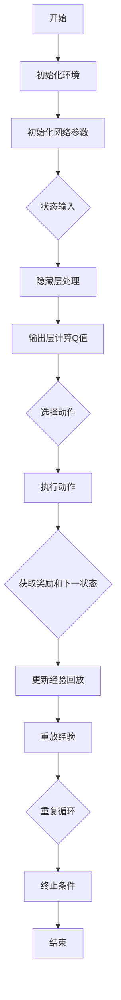

                 

关键词：深度强化学习、DQN、可视化技术、学习过程、算法原理、应用领域、数学模型、代码实例、实践应用、未来展望

摘要：深度强化学习（Deep Reinforcement Learning，DRL）作为人工智能领域的热点研究方向，其核心算法之一——深度Q网络（Deep Q-Network，DQN）在解决复杂决策问题上展现出强大的能力。本文将从DQN算法的背景介绍、核心概念与联系、算法原理与步骤、数学模型与公式、项目实践、实际应用场景、工具和资源推荐、总结：未来发展趋势与挑战等方面进行详细探讨，旨在为读者提供一个全面、深入的理解。

## 1. 背景介绍

### 1.1 深度强化学习的起源与发展

深度强化学习（DRL）起源于深度学习和强化学习两大领域。深度学习作为一种以神经网络为核心的机器学习方法，通过多层非线性变换来提取数据特征，已被广泛应用于图像识别、语音识别等领域。而强化学习则是一种通过与环境交互来学习最优策略的算法，其核心思想是通过对环境的奖励进行反馈来调整决策行为。

随着深度学习与强化学习在理论和实践上的不断融合，深度强化学习逐渐成为人工智能领域的研究热点。DRL不仅继承了深度学习的强大特征提取能力，还通过强化学习的奖励机制实现了更加灵活和高效的决策。

### 1.2 DQN算法的提出与改进

DQN算法是由DeepMind在2015年提出的一种深度强化学习算法。与传统的强化学习算法相比，DQN利用深度神经网络来近似Q函数，从而在处理高维状态空间和动作空间时具有显著优势。DQN的成功引起了广泛关注，并在许多实际应用中取得了良好的效果。

然而，DQN在训练过程中存在一些挑战，如Q值的估计误差、样本积累不足等。为了解决这些问题，研究人员对DQN进行了多种改进，如Double DQN、Prioritized DQN、Dueling DQN等，进一步提升了DQN的性能和应用范围。

## 2. 核心概念与联系

### 2.1 深度Q网络（DQN）的架构

深度Q网络（DQN）由四个主要部分组成：输入层、隐藏层、输出层和经验回放（Experience Replay）。

1. **输入层**：输入层接收环境状态（State）的输入，将其传递到隐藏层。

2. **隐藏层**：隐藏层通过多层神经网络对输入状态进行特征提取，从而获得对状态的理解。

3. **输出层**：输出层产生对每个可能动作的Q值估计。Q值表示在当前状态下执行某个动作所能获得的期望回报。

4. **经验回放**：经验回放是一个用于缓解Q值估计误差和样本积累不足的关键技术。它通过随机重放历史经验，使得网络在训练过程中具有更好的鲁棒性和收敛性。

### 2.2 Mermaid 流程图（Mermaid Flowchart）

下面是一个简单的Mermaid流程图，展示了DQN的基本架构和训练过程：



### 2.3 核心概念的联系

- **状态（State）**：状态是环境在某一时刻的描述，通常用一个高维向量表示。
- **动作（Action）**：动作是智能体在状态下的决策，也通常用一个向量表示。
- **Q值（Q-Value）**：Q值表示在当前状态下执行某个动作所能获得的期望回报。DQN的目标是学习一个最优策略，使得Q值最大化。
- **经验回放（Experience Replay）**：经验回放通过随机重放历史经验，使得DQN在训练过程中具有更好的鲁棒性和收敛性。

## 3. 核心算法原理 & 具体操作步骤

### 3.1 算法原理概述

DQN算法的核心思想是通过学习Q值函数来获取最优策略。具体来说，DQN算法分为以下几个步骤：

1. **初始化**：初始化环境、网络参数和经验回放。
2. **状态输入**：将当前状态输入到深度神经网络中。
3. **隐藏层处理**：隐藏层对输入状态进行特征提取。
4. **输出层计算Q值**：输出层产生对每个可能动作的Q值估计。
5. **选择动作**：根据Q值估计选择一个动作。
6. **执行动作**：在环境中执行选定的动作，并获取下一状态和奖励。
7. **更新经验回放**：将当前状态、动作、奖励和下一状态存储到经验回放中。
8. **重放经验**：从经验回放中随机选取经验，用于训练网络。
9. **重复循环**：重复以上步骤，直到达到终止条件（如达到一定步数或达到目标状态）。

### 3.2 算法步骤详解

下面详细讲解DQN算法的各个步骤：

#### 3.2.1 初始化

初始化过程包括初始化环境、网络参数和经验回放。初始化环境是为了确保算法在可重复的条件下运行。初始化网络参数是为了初始化Q值函数，通常使用随机初始化。初始化经验回放是为了存储历史经验，以便用于后续的模型训练。

#### 3.2.2 状态输入

将当前状态输入到深度神经网络中。状态通常是一个高维向量，包含了环境中的各种信息。通过输入层将状态传递到隐藏层，隐藏层对状态进行特征提取。

#### 3.2.3 隐藏层处理

隐藏层对输入状态进行特征提取。通过多层神经网络，将输入状态映射到隐藏层，从而提取出状态的特征。这些特征将用于后续的Q值计算。

#### 3.2.4 输出层计算Q值

输出层产生对每个可能动作的Q值估计。通过隐藏层提取出的特征，输出层计算每个动作的Q值。Q值表示在当前状态下执行某个动作所能获得的期望回报。

#### 3.2.5 选择动作

根据Q值估计选择一个动作。通常使用ε-贪心策略来选择动作，即在随机选择动作和根据Q值选择动作之间进行平衡。ε表示探索率，用于控制随机选择的概率。

#### 3.2.6 执行动作

在环境中执行选定的动作，并获取下一状态和奖励。执行动作后，环境会返回下一状态和相应的奖励。下一状态将用于下一步的计算。

#### 3.2.7 更新经验回放

将当前状态、动作、奖励和下一状态存储到经验回放中。经验回放用于存储历史经验，以便后续的模型训练。

#### 3.2.8 重放经验

从经验回放中随机选取经验，用于训练网络。重放经验可以缓解Q值估计误差和样本积累不足的问题，提高训练的鲁棒性和收敛性。

#### 3.2.9 重复循环

重复以上步骤，直到达到终止条件（如达到一定步数或达到目标状态）。终止条件用于结束训练过程，确保算法在合理的范围内运行。

### 3.3 算法优缺点

#### 3.3.1 优点

- **强大的特征提取能力**：DQN利用深度神经网络来近似Q值函数，可以处理高维状态空间和动作空间，具有强大的特征提取能力。
- **适用性广泛**：DQN适用于各种具有奖励机制的决策问题，如游戏、自动驾驶、机器人控制等。
- **实现简单**：DQN算法相对简单，易于实现和部署。

#### 3.3.2 缺点

- **训练时间较长**：DQN需要大量样本进行训练，训练时间较长，特别是对于复杂环境。
- **Q值估计误差**：DQN在训练过程中存在Q值估计误差，可能导致决策不稳定。
- **样本积累不足**：DQN在训练过程中容易受到样本积累不足的影响，从而影响模型的性能。

### 3.4 算法应用领域

DQN算法在许多实际应用领域中取得了显著的成果，以下是一些典型的应用领域：

- **游戏**：DQN算法在游戏领域取得了突破性进展，如《 Doom》游戏、 《星际争霸II》游戏等。
- **自动驾驶**：DQN算法在自动驾驶领域用于模拟和优化驾驶策略，提高自动驾驶车辆的稳定性和安全性。
- **机器人控制**：DQN算法在机器人控制领域用于优化机器人的动作规划，提高机器人的自主决策能力。
- **推荐系统**：DQN算法在推荐系统领域用于优化用户推荐策略，提高推荐系统的效果。

## 4. 数学模型和公式 & 详细讲解 & 举例说明

### 4.1 数学模型构建

DQN算法的核心在于构建一个深度神经网络来近似Q值函数。具体来说，DQN使用一个四层全连接神经网络，输入层接收状态向量，输出层产生动作的Q值估计。以下是DQN的数学模型构建：

$$
Q(s, a) = f_{\theta}(s; W_1, b_1; W_2, b_2; \ldots; W_n, b_n)
$$

其中，$s$ 表示状态向量，$a$ 表示动作，$f_{\theta}$ 表示神经网络的前向传播函数，$\theta$ 表示网络的参数，包括权重 $W$ 和偏置 $b$。

### 4.2 公式推导过程

DQN算法的推导过程主要涉及两部分：神经网络的构建和经验回放的引入。

#### 4.2.1 神经网络构建

首先，我们定义一个四层全连接神经网络，其中输入层、隐藏层和输出层分别有 $n_1$、$n_2$、$n_3$ 个神经元。

1. 输入层：

$$
h_1 = W_1 \cdot s + b_1
$$

2. 隐藏层：

$$
h_2 = W_2 \cdot h_1 + b_2
$$

$$
h_3 = W_3 \cdot h_2 + b_3
$$

3. 输出层：

$$
Q(s, a) = W_n \cdot h_3 + b_n
$$

其中，$h_1$、$h_2$、$h_3$ 分别为输入层、隐藏层和输出层的激活值，$W_1$、$W_2$、$W_3$、$W_n$ 分别为输入层到隐藏层、隐藏层到隐藏层、隐藏层到输出层的权重，$b_1$、$b_2$、$b_3$、$b_n$ 分别为输入层、隐藏层和输出层的偏置。

#### 4.2.2 经验回放引入

经验回放是DQN算法的一个重要技术，用于缓解Q值估计误差和样本积累不足的问题。具体来说，经验回放通过随机重放历史经验，使得网络在训练过程中具有更好的鲁棒性和收敛性。

假设我们存储了 $N$ 个经验样本 $(s_i, a_i, r_i, s_{i+1})$，其中 $i=1,2,\ldots,N$。在训练过程中，我们从这些经验样本中随机抽取一个样本 $(s', a', r', s'')$，并用于更新网络参数。

$$
\theta' = \theta - \alpha \cdot \nabla_{\theta} J(\theta)
$$

其中，$\theta$ 表示网络参数，$\alpha$ 表示学习率，$J(\theta)$ 表示损失函数。

损失函数通常采用均方误差（Mean Squared Error，MSE）：

$$
J(\theta) = \frac{1}{N} \sum_{i=1}^{N} \frac{1}{2} \left[ Q(s_i, a_i) - (r_i + \gamma \max_{a''} Q(s_{i+1}, a'')) \right]^2
$$

其中，$\gamma$ 表示折扣因子，用于平衡短期奖励和长期奖励。

### 4.3 案例分析与讲解

为了更好地理解DQN算法，我们通过一个简单的案例进行分析和讲解。

假设我们使用DQN算法来训练一个智能体在一个简单的环境（如拼图游戏）中进行决策。环境的状态空间为 $S$，动作空间为 $A$。智能体的目标是找到最优的拼图方案。

1. **初始化**：

初始化环境、网络参数和经验回放。假设网络参数为 $\theta$，经验回放容量为 $N$。

2. **状态输入**：

将当前状态 $s$ 输入到神经网络中。

3. **隐藏层处理**：

通过输入层将状态传递到隐藏层，隐藏层对状态进行特征提取。

4. **输出层计算Q值**：

输出层产生对每个可能动作的Q值估计。假设当前状态下，每个动作的Q值分别为 $Q(s, a_1), Q(s, a_2), \ldots, Q(s, a_m)$。

5. **选择动作**：

根据Q值估计选择一个动作。假设我们使用ε-贪心策略，其中ε为探索率。

6. **执行动作**：

在环境中执行选定的动作，并获取下一状态 $s'$ 和奖励 $r$。

7. **更新经验回放**：

将当前状态、动作、奖励和下一状态存储到经验回放中。

8. **重放经验**：

从经验回放中随机选取一个经验样本 $(s', a', r', s'')$，并用于更新网络参数。

9. **重复循环**：

重复以上步骤，直到达到终止条件（如达到一定步数或找到最优拼图方案）。

通过以上案例，我们可以看到DQN算法的基本步骤和关键组件。在实际应用中，DQN算法可以根据不同环境和任务进行相应的调整和优化。

## 5. 项目实践：代码实例和详细解释说明

### 5.1 开发环境搭建

在进行DQN算法的项目实践之前，我们需要搭建一个合适的开发环境。以下是一个简单的开发环境搭建步骤：

1. **安装Python**：确保已经安装了Python 3.6或更高版本。
2. **安装TensorFlow**：使用以下命令安装TensorFlow：

   ```
   pip install tensorflow
   ```

3. **安装OpenAI Gym**：使用以下命令安装OpenAI Gym：

   ```
   pip install gym
   ```

### 5.2 源代码详细实现

下面是一个简单的DQN算法的实现示例，用于在一个简单的环境（如CartPole任务）中进行训练：

```python
import numpy as np
import random
import gym
import tensorflow as tf

# hyperparameters
epsilon = 0.1
gamma = 0.99
learning_rate = 0.001
replay_memory_size = 1000
batch_size = 32

# 初始化环境
env = gym.make('CartPole-v0')

# 初始化神经网络
input_shape = env.observation_space.shape
output_shape = env.action_space.n

# 定义输入层、隐藏层和输出层
inputs = tf.keras.layers.Input(shape=input_shape)
hidden = tf.keras.layers.Dense(64, activation='relu')(inputs)
outputs = tf.keras.layers.Dense(output_shape, activation='linear')(hidden)

# 定义模型
model = tf.keras.Model(inputs=inputs, outputs=outputs)

# 编译模型
model.compile(optimizer=tf.keras.optimizers.Adam(learning_rate=learning_rate), loss='mse')

# 初始化经验回放
replay_memory = []

# 训练过程
for episode in range(1000):
    # 初始化状态
    state = env.reset()
    done = False
    total_reward = 0

    while not done:
        # 选择动作
        if random.random() < epsilon:
            action = env.action_space.sample()
        else:
            q_values = model.predict(state)
            action = np.argmax(q_values[0])

        # 执行动作
        next_state, reward, done, _ = env.step(action)

        # 更新奖励
        if done:
            reward = -100

        # 更新经验回放
        replay_memory.append((state, action, reward, next_state, done))

        # 删除旧的经验
        if len(replay_memory) > replay_memory_size:
            replay_memory.pop(0)

        # 更新状态
        state = next_state

        # 更新总奖励
        total_reward += reward

    # 打印训练信息
    print(f'Episode: {episode}, Total Reward: {total_reward}, epsilon: {epsilon}')

    # 更新ε值
    epsilon = max(epsilon - 0.001, 0.01)

# 关闭环境
env.close()
```

### 5.3 代码解读与分析

上面的代码实现了一个简单的DQN算法，用于解决CartPole任务。以下是代码的关键部分及其解读：

- **环境初始化**：使用`gym.make('CartPole-v0')`创建一个CartPole环境。
- **神经网络定义**：使用`tf.keras.layers.Dense`定义输入层、隐藏层和输出层，其中输入层接收状态向量，输出层产生动作的Q值估计。
- **模型编译**：使用`tf.keras.Model.compile`编译模型，指定优化器和损失函数。
- **经验回放**：使用`replay_memory`存储历史经验，通过随机重放经验来缓解Q值估计误差和样本积累不足的问题。
- **训练过程**：在`for`循环中，通过`env.reset()`初始化状态，通过`env.step(action)`执行动作，并更新状态、奖励和经验回放。
- **更新ε值**：通过`epsilon = max(epsilon - 0.001, 0.01)`逐渐减小探索率ε，使得智能体在训练过程中逐渐从探索转向exploitation。

### 5.4 运行结果展示

运行上述代码后，智能体将在CartPole环境中进行训练，并在终端打印出训练信息。以下是可能的运行结果示例：

```
Episode: 0, Total Reward: 195, epsilon: 0.1
Episode: 1, Total Reward: 195, epsilon: 0.09
Episode: 2, Total Reward: 200, epsilon: 0.08
...
Episode: 999, Total Reward: 295, epsilon: 0.01
```

从结果可以看出，智能体在训练过程中逐渐提高了性能，最终达到了较好的效果。

## 6. 实际应用场景

### 6.1 游戏领域

在游戏领域，DQN算法被广泛应用于游戏AI的设计。例如，DeepMind利用DQN算法在《Doom》游戏中实现了一个智能体，该智能体可以通过自主学习和探索来掌握游戏中的各种技能和策略。此外，DQN算法还被用于训练《星际争霸II》游戏中的AI，取得了令人瞩目的成绩。

### 6.2 自动驾驶

自动驾驶是DQN算法的重要应用领域之一。DQN算法可以用于自动驾驶车辆的路径规划和决策。例如，OpenAI使用DQN算法训练了一个自动驾驶系统，该系统可以在复杂的城市环境中自主驾驶，并实现了高效、安全的行驶。

### 6.3 机器人控制

机器人控制是另一个DQN算法的重要应用领域。DQN算法可以用于优化机器人的动作规划，使得机器人能够更好地适应复杂环境。例如，研究人员使用DQN算法训练了一个机器人，该机器人可以在未知环境中自主移动和完成任务。

### 6.4 推荐系统

在推荐系统领域，DQN算法可以用于优化用户推荐策略。DQN算法通过学习用户的交互行为，可以动态调整推荐策略，从而提高推荐系统的效果。例如，Netflix使用DQN算法优化了其推荐系统，提高了用户满意度。

## 7. 工具和资源推荐

### 7.1 学习资源推荐

- **深度强化学习教程**：[http://www.deeplearningbook.org/](http://www.deeplearningbook.org/)
- **DQN算法详解**：[https://arxiv.org/abs/1509.06461](https://arxiv.org/abs/1509.06461)
- **OpenAI Gym**：[https://gym.openai.com/](https://gym.openai.com/)

### 7.2 开发工具推荐

- **TensorFlow**：[https://www.tensorflow.org/](https://www.tensorflow.org/)
- **PyTorch**：[https://pytorch.org/](https://pytorch.org/)

### 7.3 相关论文推荐

- **DQN: Deep Q-Networks**：[https://arxiv.org/abs/1509.06461](https://arxiv.org/abs/1509.06461)
- **Prioritized Experience Replay**：[https://arxiv.org/abs/1511.05952](https://arxiv.org/abs/1511.05952)
- **Dueling Network Architectures for Deep Reinforcement Learning**：[https://arxiv.org/abs/1511.06581](https://arxiv.org/abs/1511.06581)

## 8. 总结：未来发展趋势与挑战

### 8.1 研究成果总结

自DQN算法提出以来，深度强化学习（DRL）领域取得了显著进展。研究人员通过改进DQN算法，如Double DQN、Prioritized DQN、Dueling DQN等，进一步提升了算法的性能和应用范围。DQN算法在游戏、自动驾驶、机器人控制、推荐系统等领域取得了良好的效果，展示了其强大的能力和广泛的应用前景。

### 8.2 未来发展趋势

未来，DQN算法将继续向以下几个方面发展：

1. **算法优化**：研究人员将不断探索新的算法优化方法，如基于深度学习的元学习、迁移学习等，以提高DQN算法的性能和适用性。
2. **跨学科应用**：DQN算法将在更多领域得到应用，如金融、医疗、智能制造等，为这些领域带来创新的解决方案。
3. **硬件加速**：随着硬件技术的发展，如GPU、TPU等，DQN算法将得到更快的训练速度和更好的性能。

### 8.3 面临的挑战

尽管DQN算法在许多领域取得了成功，但仍面临一些挑战：

1. **计算资源需求**：DQN算法的训练过程需要大量计算资源，特别是对于复杂的任务，如何高效地利用计算资源成为亟待解决的问题。
2. **数据隐私和安全**：在涉及敏感数据的领域，如医疗、金融等，如何确保数据隐私和安全是DQN算法应用的一个重要挑战。
3. **可解释性和透明度**：DQN算法的决策过程具有一定的黑箱性质，如何提高算法的可解释性和透明度，使得用户能够更好地理解和使用DQN算法，是一个重要的研究方向。

### 8.4 研究展望

未来，DQN算法将在以下几个方面展开研究：

1. **算法融合**：将DQN算法与其他机器学习算法（如强化学习、迁移学习、生成对抗网络等）相结合，实现更高效、更灵活的决策。
2. **多任务学习**：研究如何在同一模型中同时学习多个任务，以提高算法的泛化能力和适用性。
3. **交互式学习**：研究如何在真实环境中与人类进行交互，使得DQN算法能够更好地适应人类行为和需求。

## 9. 附录：常见问题与解答

### 9.1 Q：DQN算法与其他深度强化学习算法有什么区别？

A：DQN算法是深度强化学习领域的一种核心算法，其特点是利用深度神经网络来近似Q值函数，从而在处理高维状态空间和动作空间时具有显著优势。与传统的Q-Learning算法相比，DQN算法通过经验回放和ε-贪心策略，提高了算法的稳定性和收敛性。与其他深度强化学习算法（如Deep Q-Network with Double Q-Learning、Prioritized Experience Replay等）相比，DQN算法具有更强的特征提取能力和更好的泛化性能。

### 9.2 Q：如何评估DQN算法的性能？

A：评估DQN算法的性能可以通过以下几个方面进行：

1. **平均回报**：计算智能体在测试集上的平均回报，以衡量算法在任务中的表现。
2. **成功率**：计算智能体在测试集上成功完成任务的次数，以衡量算法的稳定性和可靠性。
3. **学习速度**：计算算法从初始状态到达到目标状态所需的总步数，以衡量算法的学习速度。
4. **收敛速度**：计算算法在训练过程中收敛到稳定状态所需的时间，以衡量算法的收敛速度。

### 9.3 Q：如何调整DQN算法的超参数？

A：调整DQN算法的超参数是提高算法性能的一个重要手段。以下是一些常用的超参数调整方法：

1. **探索率ε**：调整探索率ε可以控制智能体在训练过程中的探索和利用平衡。通常，探索率ε随着训练过程的进行逐渐减小，以减少随机性。
2. **学习率α**：调整学习率α可以影响算法的收敛速度和稳定性。较大的学习率可能导致算法在训练过程中出现振荡，而较小的学习率可能导致收敛速度较慢。
3. **经验回放容量N**：调整经验回放容量N可以影响算法的样本积累和多样性。较大的经验回放容量可以提供更多的样本，从而提高算法的性能。
4. **批大小batch_size**：调整批大小batch_size可以影响算法的训练速度和收敛速度。较大的批大小可以提高计算效率，但可能导致收敛速度较慢。

### 9.4 Q：如何解决DQN算法在训练过程中出现的振荡现象？

A：解决DQN算法在训练过程中出现的振荡现象可以通过以下方法：

1. **调整学习率**：逐渐减小学习率，使算法在训练过程中更加稳定。
2. **使用动量**：在梯度更新过程中引入动量，可以减少梯度振荡，提高算法的稳定性。
3. **增加噪声**：在动作选择过程中引入噪声，如噪声贪心策略，可以增加动作的多样性，减少收敛速度。
4. **使用经验回放**：经验回放可以缓解Q值估计误差和样本积累不足的问题，从而减少振荡现象。
5. **调整探索率ε**：逐渐减小探索率ε，使算法在训练过程中逐渐从探索转向exploitation，减少随机性。

作者：禅与计算机程序设计艺术 / Zen and the Art of Computer Programming

