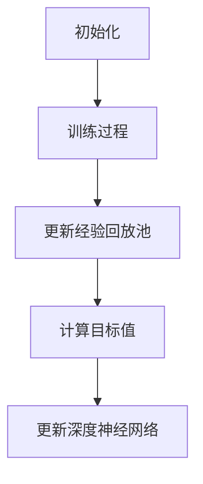

                 

关键词：深度学习，DQN，云计算，分布式训练，映射

## 摘要

随着深度学习技术的不断发展，深度Q网络（Deep Q-Network，DQN）在智能决策和游戏等领域取得了显著的成果。然而，传统的DQN算法在处理大规模数据和高维状态时，面临着计算资源和训练时间上的瓶颈。本文提出了一种基于云计算的分布式训练方案，通过映射策略将DQN模型在分布式环境下进行训练，有效提高了训练效率和模型性能。本文首先介绍了DQN算法的基本原理和核心概念，然后详细阐述了云计算和分布式训练的优势，以及如何利用云计算实现DQN的分布式训练。通过实验结果，本文验证了所提方案在提高训练效率和模型性能方面的有效性。

## 1. 背景介绍

### 1.1 深度学习与DQN

深度学习是一种基于多层神经网络的机器学习技术，通过学习大量的数据特征，实现从输入到输出的映射。深度学习在图像识别、自然语言处理、语音识别等众多领域取得了显著的成果。深度Q网络（Deep Q-Network，DQN）是深度学习领域的一种重要算法，它通过学习值函数，实现智能体在未知环境下的最优策略。

DQN算法由DeepMind在2015年提出，旨在解决传统Q-learning算法在处理高维状态和连续动作时的困难。DQN通过引入经验回放机制和固定目标网络，有效解决了Q-learning算法的样本相关性和目标不稳定问题。DQN的核心思想是利用深度神经网络来近似值函数，从而实现智能体的决策。

### 1.2 云计算与分布式训练

云计算是一种通过互联网提供动态可伸缩的虚拟化资源的计算模式，包括基础设施即服务（IaaS）、平台即服务（PaaS）和软件即服务（SaaS）等三种主要服务模式。云计算具有弹性扩展、资源高效利用和低成本等优势，为大规模数据处理和分布式计算提供了强大的支持。

分布式训练是将大规模数据集分解为多个子集，同时在多个计算节点上并行训练深度学习模型的过程。分布式训练能够有效降低训练时间和提高模型性能，特别是在处理大规模数据和复杂任务时具有显著优势。

## 2. 核心概念与联系

### 2.1 DQN算法原理

DQN算法的核心是深度神经网络，用于近似值函数 \(V(s)\)，其中 \(s\) 表示状态，\(V(s)\) 表示在状态 \(s\) 下的最优动作值。DQN算法的基本流程如下：

1. 初始化：初始化深度神经网络 \(Q(s, a)\) 和经验回放池。
2. 训练过程：根据策略选择动作 \(a\)，执行动作并获取奖励 \(r\) 和下一状态 \(s'\)。
3. 更新经验回放池：将 \(s, a, r, s'\) 存入经验回放池。
4. 从经验回放池中随机采样一批经验。
5. 计算目标值 \(y\)：\(y = r + \gamma \max_a Q(s', a')\)，其中 \(\gamma\) 是折扣因子，\(a'\) 是在 \(s'\) 状态下最优动作。
6. 更新深度神经网络：通过反向传播和梯度下降更新 \(Q(s, a)\)。

### 2.2 云计算架构

云计算架构通常包括以下几个层次：

1. 基础设施层：提供虚拟化计算资源，如虚拟机（VM）和容器（Container）。
2. 平台层：提供开发平台和工具，如云计算平台（如AWS、Azure、Google Cloud）和容器编排系统（如Kubernetes）。
3. 应用层：运行在云计算平台上的应用程序和服务，如Web应用、大数据分析和机器学习任务。

### 2.3 分布式训练架构

分布式训练架构主要包括以下几个部分：

1. 数据分割：将大规模数据集分割为多个子集，分配到不同的计算节点。
2. 模型分割：将深度学习模型拆分为多个子网络，分配到不同的计算节点。
3. 通信：计算节点之间通过通信网络进行数据交换和同步。
4. 集群管理：负责管理计算节点、任务调度和资源分配。

### 2.4 Mermaid 流程图

## 3. 核心算法原理 & 具体操作步骤

### 3.1 算法原理概述

DQN算法通过深度神经网络近似值函数，利用经验回放机制和固定目标网络解决Q-learning算法的样本相关性和目标不稳定问题。在分布式训练中，DQN算法可以通过云计算平台实现高效的分布式训练。

### 3.2 算法步骤详解

1. **初始化**：初始化深度神经网络 \(Q(s, a)\) 和经验回放池。选择合适的网络结构和优化器，设置学习率、折扣因子等超参数。

2. **训练过程**：选择策略 \(\pi\)，根据策略选择动作 \(a\)，执行动作并获取奖励 \(r\) 和下一状态 \(s'\)。

3. **更新经验回放池**：将 \(s, a, r, s'\) 存入经验回放池。经验回放池采用优先经验回放策略，根据经验的重要性进行抽样。

4. **计算目标值**：从经验回放池中随机采样一批经验，计算目标值 \(y\)：\(y = r + \gamma \max_a Q(s', a')\)。

5. **更新深度神经网络**：通过反向传播和梯度下降更新 \(Q(s, a)\)。在分布式训练中，计算节点之间通过通信网络进行模型同步和梯度聚合。

6. **模型评估**：在训练过程中，定期评估模型性能，调整策略和超参数。

7. **模型保存与加载**：在训练完成后，将最优模型保存到文件中，以便后续使用。

### 3.3 算法优缺点

**优点**：

- **样本无关性**：通过经验回放机制，有效解决了样本相关性问题。
- **目标稳定性**：通过固定目标网络，提高了目标稳定性。
- **可扩展性**：基于云计算的分布式训练，具有很高的可扩展性。

**缺点**：

- **训练难度**：深度神经网络的训练过程较为复杂，需要调整多个超参数。
- **收敛速度**：与传统的Q-learning算法相比，DQN算法的收敛速度较慢。

### 3.4 算法应用领域

DQN算法在多个领域取得了显著成果，包括：

- **游戏**：例如，Atari游戏和围棋等领域。
- **自动驾驶**：在无人驾驶汽车中，用于处理复杂的交通场景。
- **推荐系统**：用于个性化推荐，如商品推荐和新闻推荐等。

## 4. 数学模型和公式 & 详细讲解 & 举例说明

### 4.1 数学模型构建

DQN算法的核心是构建值函数 \(V(s)\)，用于表示在状态 \(s\) 下的最优动作值。值函数的数学模型可以表示为：

\[ V(s) = \max_a Q(s, a) \]

其中，\(Q(s, a)\) 表示在状态 \(s\) 下执行动作 \(a\) 的期望回报。

### 4.2 公式推导过程

假设在状态 \(s\) 下，智能体执行动作 \(a\) 后转移到状态 \(s'\)，并获取即时奖励 \(r\)。根据马尔可夫决策过程，可以推导出：

\[ Q(s, a) = r + \gamma \max_{a'} Q(s', a') \]

其中，\(\gamma\) 是折扣因子，用于平衡即时奖励和长期奖励。

### 4.3 案例分析与讲解

假设一个智能体在一个简单的环境（如迷宫）中进行探索，目标是找到从起点到终点的最优路径。我们可以将状态表示为迷宫的坐标，动作表示为上下左右四个方向。

**示例 1**：在状态 \((2, 2)\) 下，智能体选择向右移动，即 \(a = \text{RIGHT}\)。假设即时奖励 \(r = 1\)，折扣因子 \(\gamma = 0.9\)。根据公式，可以计算得到：

\[ Q(2, 2, \text{RIGHT}) = 1 + 0.9 \max_{a'} Q(s', a') \]

由于状态 \((2, 3)\) 是终

