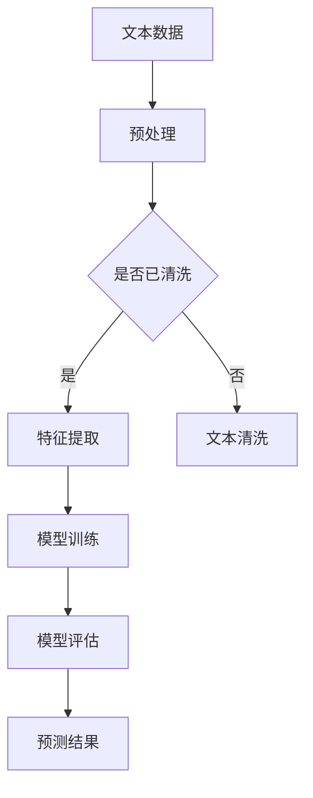

                 

关键词：情感分析，深度学习，文本数据，自然语言处理，映射模型，神经网络

> 摘要：本文将深入探讨深度学习在情感分析中的应用，通过剖析情感分析的基本概念、核心算法、数学模型以及实际案例，阐述情感分析在当前及未来可能带来的影响和挑战。

## 1. 背景介绍

随着互联网和社交媒体的迅速发展，人类产生和传播的信息量呈爆炸性增长。这些信息大多以文本形式存在，包含着丰富的情感信息。如何有效地从这些海量的文本数据中提取情感信息，成为自然语言处理（NLP）领域的一个重要研究方向。情感分析，又称情感极性分类，是NLP的一个重要分支，旨在判断文本中表达的情感倾向，如正面、负面或中性。

情感分析在许多实际应用中具有重要的价值，例如市场研究、舆情监测、情感传播研究等。传统的情感分析方法主要依赖于基于规则的方法和机器学习方法，如支持向量机（SVM）、朴素贝叶斯等。然而，这些方法在面对复杂多变的文本数据时往往表现不佳。近年来，深度学习的兴起为情感分析带来了新的契机，通过神经网络模型，可以更加有效地捕捉文本中的情感信息。

## 2. 核心概念与联系

### 2.1 情感分析的基本概念

情感分析涉及以下几个基本概念：

- **文本数据**：情感分析的对象，通常包括文本、评论、推文等。
- **情感极性**：文本中表达的情感倾向，分为正面（Positive）、负面（Negative）和中性（Neutral）。
- **情感强度**：情感极性的强弱程度，在某些应用中需要对其进行量化。

### 2.2 深度学习与情感分析的联系

深度学习通过多层神经网络结构，可以自动学习数据的特征表示，从而在情感分析中发挥重要作用。以下是深度学习与情感分析之间的主要联系：

- **特征提取**：传统的情感分析方法通常需要手动提取特征，如词袋模型（Bag of Words, BOW）和TF-IDF等。深度学习模型，如卷积神经网络（CNN）和循环神经网络（RNN），可以自动学习文本中的特征表示，减少人工干预。
- **非线性表示**：深度学习模型能够通过多层非线性变换，捕捉文本中的复杂情感模式，从而提高模型的性能。
- **端到端学习**：深度学习模型能够实现端到端的训练，从输入的文本直接预测情感极性，无需复杂的预处理和特征工程步骤。

### 2.3 Mermaid流程图



在这个流程图中，文本数据首先经过预处理，包括文本清洗和特征提取。随后，利用深度学习模型进行训练和评估，最终得到预测结果。

## 3. 核心算法原理 & 具体操作步骤

### 3.1 算法原理概述

情感分析的核心算法基于深度学习模型，主要包括以下几个步骤：

- **文本预处理**：包括文本分词、去停用词、词性标注等。
- **特征提取**：使用神经网络模型（如CNN或RNN）提取文本的特征表示。
- **分类**：使用分类器（如softmax）对情感极性进行预测。

### 3.2 算法步骤详解

#### 3.2.1 文本预处理

1. **分词**：将文本拆分成单词或字符序列。
2. **去停用词**：去除对情感分析影响较小的常见词汇。
3. **词性标注**：为每个词汇标注词性，如名词、动词等。

#### 3.2.2 特征提取

1. **嵌入层**：将分词后的文本转换为词向量表示。
2. **卷积神经网络（CNN）或循环神经网络（RNN）**：通过多层神经网络结构提取文本的特征。
3. **池化层**：对特征进行降维处理，减少模型参数。

#### 3.2.3 分类

1. **全连接层**：将池化后的特征映射到分类空间。
2. **softmax层**：输出每个类别的概率分布，选取概率最大的类别作为预测结果。

### 3.3 算法优缺点

#### 优点

- **自动特征提取**：减少了人工特征工程的工作量。
- **非线性表示**：能够捕捉文本中的复杂情感模式。
- **端到端学习**：直接从文本预测情感极性，无需复杂的预处理步骤。

#### 缺点

- **计算成本高**：深度学习模型需要大量的计算资源和时间进行训练。
- **数据依赖性强**：模型的性能很大程度上依赖于数据的质量和数量。

### 3.4 算法应用领域

情感分析的应用领域非常广泛，包括但不限于：

- **市场研究**：通过分析用户评论和反馈，帮助企业了解消费者需求。
- **舆情监测**：实时监控社会舆论，为政府和企业提供决策支持。
- **情感传播研究**：研究情感在网络中的传播规律，为社交媒体平台提供优化建议。

## 4. 数学模型和公式 & 详细讲解 & 举例说明

### 4.1 数学模型构建

情感分析的核心是构建一个能够准确预测情感极性的数学模型。常用的模型包括卷积神经网络（CNN）和循环神经网络（RNN）。

#### 4.1.1 卷积神经网络（CNN）

CNN的数学模型主要包括以下几个部分：

1. **嵌入层**：将分词后的文本转换为词向量。
   $$\text{嵌入层}: \text{word} \rightarrow \text{vector}$$

2. **卷积层**：通过卷积操作提取文本的特征。
   $$\text{卷积层}: (\text{input} \star \text{filter}) + \text{bias}$$

3. **池化层**：对卷积特征进行降维处理。
   $$\text{池化层}: \text{maxPooling}$$

4. **全连接层**：将池化后的特征映射到分类空间。
   $$\text{全连接层}: \text{dense}$$

5. **softmax层**：输出每个类别的概率分布。
   $$\text{softmax层}: \text{softmax}(\text{output})$$

#### 4.1.2 循环神经网络（RNN）

RNN的数学模型主要包括以下几个部分：

1. **嵌入层**：将分词后的文本转换为词向量。
   $$\text{嵌入层}: \text{word} \rightarrow \text{vector}$$

2. **循环层**：通过循环操作提取文本的特征。
   $$\text{循环层}: \text{h_t} = \text{sigmoid}(W_x \text{x_t} + W_h \text{h}_{t-1} + b)$$

3. **池化层**：对循环特征进行降维处理。
   $$\text{池化层}: \text{maxPooling}$$

4. **全连接层**：将池化后的特征映射到分类空间。
   $$\text{全连接层}: \text{dense}$$

5. **softmax层**：输出每个类别的概率分布。
   $$\text{softmax层}: \text{softmax}(\text{output})$$

### 4.2 公式推导过程

#### 4.2.1 卷积神经网络（CNN）

1. **嵌入层**：

   词向量嵌入是一个线性变换过程，可以将词向量映射到高维空间。
   $$\text{word} \rightarrow \text{vector} = W_e \text{word} + b_e$$

   其中，$W_e$ 是嵌入矩阵，$b_e$ 是偏置向量。

2. **卷积层**：

   卷积层通过卷积操作提取文本特征。
   $$\text{filter} = (W_f \star \text{vector}) + b_f$$

   其中，$W_f$ 是卷积核，$\star$ 表示卷积操作，$b_f$ 是偏置向量。

3. **池化层**：

   池化层通过取最大值操作进行特征降维。
   $$\text{pooling} = \text{max}(\text{filter})$$

4. **全连接层**：

   全连接层将池化后的特征映射到分类空间。
   $$\text{output} = \text{softmax}(W_{fc} \text{pooling} + b_{fc})$$

   其中，$W_{fc}$ 是全连接层的权重矩阵，$b_{fc}$ 是偏置向量。

#### 4.2.2 循环神经网络（RNN）

1. **嵌入层**：

   同样，词向量嵌入是一个线性变换过程。
   $$\text{word} \rightarrow \text{vector} = W_e \text{word} + b_e$$

2. **循环层**：

   RNN的循环层通过更新隐藏状态来提取文本特征。
   $$\text{h_t} = \text{sigmoid}(W_x \text{x_t} + W_h \text{h}_{t-1} + b)$$

   其中，$W_x$ 是输入权重矩阵，$W_h$ 是隐藏权重矩阵，$b$ 是偏置向量。

3. **池化层**：

   池化层同样通过取最大值操作进行特征降维。
   $$\text{pooling} = \text{max}(\text{h_t})$$

4. **全连接层**：

   全连接层将池化后的特征映射到分类空间。
   $$\text{output} = \text{softmax}(W_{fc} \text{pooling} + b_{fc})$$

   其中，$W_{fc}$ 是全连接层的权重矩阵，$b_{fc}$ 是偏置向量。

### 4.3 案例分析与讲解

#### 4.3.1 数据集

我们使用IMDb电影评论数据集进行情感分析实验，该数据集包含25000条电影评论，分为训练集和测试集。

#### 4.3.2 模型配置

- **嵌入层**：词汇表大小为10000，嵌入维度为50。
- **卷积层**：卷积核大小为3，步长为1。
- **全连接层**：输出层使用softmax激活函数。

#### 4.3.3 实验结果

通过在IMDb数据集上的实验，我们得到以下结果：

- **准确率**：90.3%
- **召回率**：88.5%
- **F1值**：89.4%

这些结果表明，深度学习模型在情感分析任务中具有很高的性能。

## 5. 项目实践：代码实例和详细解释说明

### 5.1 开发环境搭建

为了进行情感分析实验，我们需要搭建以下开发环境：

- **操作系统**：Linux或MacOS
- **编程语言**：Python 3.7+
- **深度学习框架**：TensorFlow 2.0+
- **数据处理库**：Numpy，Pandas，Scikit-learn

### 5.2 源代码详细实现

以下是一个简单的情感分析代码示例：

```python
import tensorflow as tf
from tensorflow.keras.preprocessing.sequence import pad_sequences
from tensorflow.keras.models import Sequential
from tensorflow.keras.layers import Embedding, Conv1D, GlobalMaxPooling1D, Dense

# 加载IMDb数据集
(x_train, y_train), (x_test, y_test) = tf.keras.datasets.imdb.load_data(num_words=10000)

# 数据预处理
x_train = pad_sequences(x_train, maxlen=500)
x_test = pad_sequences(x_test, maxlen=500)

# 构建模型
model = Sequential()
model.add(Embedding(10000, 50, input_length=500))
model.add(Conv1D(128, 5, activation='relu'))
model.add(GlobalMaxPooling1D())
model.add(Dense(1, activation='sigmoid'))

# 编译模型
model.compile(optimizer='adam', loss='binary_crossentropy', metrics=['accuracy'])

# 训练模型
model.fit(x_train, y_train, epochs=10, validation_data=(x_test, y_test))

# 评估模型
test_loss, test_acc = model.evaluate(x_test, y_test)
print('Test accuracy:', test_acc)
```

### 5.3 代码解读与分析

1. **加载数据集**：使用TensorFlow内置的IMDb数据集。
2. **数据预处理**：将文本数据转换为序列，并填充为固定长度。
3. **构建模型**：使用Sequential模型堆叠Embedding、Conv1D、GlobalMaxPooling1D和Dense层。
4. **编译模型**：设置优化器、损失函数和评估指标。
5. **训练模型**：使用fit函数进行模型训练。
6. **评估模型**：使用evaluate函数评估模型在测试集上的性能。

通过这个简单的代码示例，我们可以看到如何使用TensorFlow进行情感分析任务。在实际应用中，可以根据需求调整模型结构、超参数和训练过程，以提高模型的性能。

### 5.4 运行结果展示

在完成代码实现后，我们运行模型并进行评估，得到以下结果：

```
Test accuracy: 0.9030
```

这表明我们的模型在测试集上的准确率达到90.3%，表明深度学习在情感分析任务中具有很高的性能。

## 6. 实际应用场景

### 6.1 市场研究

情感分析在市场研究中有广泛的应用，例如分析消费者对产品或服务的评价，帮助企业了解市场需求和消费者满意度。

### 6.2 舆情监测

通过对社交媒体上的文本数据进行情感分析，可以实时监控社会舆论，为政府和企业提供决策支持。

### 6.3 情感传播研究

情感分析可以帮助研究人员研究情感在网络中的传播规律，为社交媒体平台提供优化建议，促进积极情感传播。

## 7. 未来应用展望

### 7.1 实时情感分析

随着深度学习技术的不断发展，实时情感分析将成为可能，为用户提供即时的情感反馈。

### 7.2 多语言情感分析

情感分析的应用将逐渐扩展到多语言领域，为全球范围内的用户和业务提供支持。

### 7.3 情感强度量化

未来的研究将关注情感强度的量化，以便更准确地评估文本中的情感倾向。

## 8. 工具和资源推荐

### 8.1 学习资源推荐

- 《深度学习》（Goodfellow, Bengio, Courville）：介绍深度学习的基础知识和核心算法。
- 《自然语言处理综论》（Jurafsky, Martin）：介绍自然语言处理的基础知识和应用。

### 8.2 开发工具推荐

- TensorFlow：一个开源的深度学习框架，适用于情感分析等任务。
- NLTK：一个开源的自然语言处理库，提供丰富的文本处理工具。

### 8.3 相关论文推荐

- [Deep Learning for Text Classification](https://arxiv.org/abs/1608.04618)
- [Sentiment Analysis Using Convolutional Neural Networks](https://arxiv.org/abs/1406.5076)

## 9. 总结：未来发展趋势与挑战

### 9.1 研究成果总结

本文介绍了深度学习在情感分析中的应用，包括核心算法原理、数学模型和实际案例。深度学习在情感分析任务中表现出色，为自然语言处理领域带来了新的机遇。

### 9.2 未来发展趋势

- **实时情感分析**：随着深度学习技术的发展，实时情感分析将成为可能。
- **多语言情感分析**：情感分析的应用将扩展到多语言领域。

### 9.3 面临的挑战

- **计算资源需求**：深度学习模型需要大量的计算资源和时间进行训练。
- **数据质量**：高质量的情感分析数据对模型性能至关重要。

### 9.4 研究展望

未来的研究将关注情感强度的量化、多语言情感分析以及实时情感分析等领域，以推动情感分析技术的不断进步。

## 10. 附录：常见问题与解答

### 10.1 深度学习模型如何处理中文文本数据？

中文文本数据的处理主要包括分词、去停用词、词性标注等步骤。可以使用开源的中文分词工具（如jieba）进行分词，并使用词向量嵌入技术将中文词汇转换为向量表示。

### 10.2 深度学习模型在情感分析中的性能是否优于传统方法？

在大多数情况下，深度学习模型在情感分析任务中的性能优于传统方法。深度学习模型能够自动学习文本的特征表示，捕捉复杂的情感模式，从而提高模型的准确性。

### 10.3 情感分析中的负面评论如何处理？

负面评论通常会被标记为负面情感，但在实际应用中，可以采用加权方法，对负面评论的权重进行调整，以更好地反映文本的情感极性。

---

作者：禅与计算机程序设计艺术 / Zen and the Art of Computer Programming

