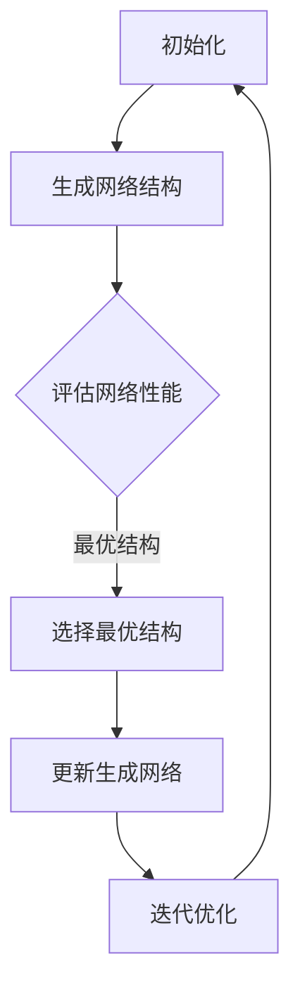

                 

关键词：Hypernetworks、元学习、神经架构搜索、人工智能、算法原理、应用领域、未来展望

> 摘要：本文深入探讨了Hypernetworks在元学习领域的应用，解析了其基本概念、核心原理、数学模型以及实际操作步骤。通过具体项目实践，分析了Hypernetworks在提高模型泛化能力和自适应能力方面的优势，并对未来发展方向和面临的挑战进行了展望。

## 1. 背景介绍

随着人工智能技术的快速发展，深度学习在图像识别、自然语言处理和语音识别等领域取得了显著成果。然而，深度学习的训练过程通常需要大量标注数据和计算资源，且模型的泛化能力有限。为了解决这些问题，元学习（Meta-Learning）作为一种重要的研究方向，得到了广泛关注。

元学习的核心思想是通过学习如何学习来提升模型的泛化能力。而Hypernetworks作为一种新颖的元学习算法，具有巨大的潜力。Hypernetworks通过将神经架构搜索（Neural Architecture Search，NAS）与元学习相结合，可以在不依赖大规模标注数据的情况下，自动搜索和优化神经网络的架构，从而提高模型的性能。

本文将围绕Hypernetworks在元学习中的作用进行探讨，首先介绍其基本概念，然后分析其核心原理，接着展示具体操作步骤，最后讨论其在实际应用中的优势和面临的挑战。

### 超网络（Hypernetwork）的基本概念

超网络（Hypernetwork）是一种由神经架构搜索（Neural Architecture Search，NAS）衍生出的元学习算法。与传统的神经网络不同，超网络不仅仅关注网络内部的权重和激活函数，还涉及网络结构的搜索和优化。

超网络的定义如下：一个超网络是一个由多个子网络组成的网络，每个子网络都负责搜索和优化神经网络中的一个子结构。这些子网络通过相互协作，共同完成神经网络的搜索和优化过程。

超网络的主要特点如下：

1. **动态性**：超网络可以根据训练过程中的数据动态调整网络结构，从而实现自适应学习。
2. **并行性**：超网络中多个子网络可以并行执行，提高了搜索和优化效率。
3. **可扩展性**：超网络可以很容易地扩展到大规模网络结构，适用于不同规模的任务。

### 元学习的基本概念

元学习（Meta-Learning）是一种学习如何学习的方法。它的目标是构建能够快速适应新任务的模型，而不需要依赖大量的标注数据或计算资源。

元学习的基本概念如下：

1. **快速学习**：元学习算法能够在少量样本上快速训练出性能良好的模型，从而减少了对大量标注数据的需求。
2. **泛化能力**：元学习算法通过学习通用学习策略，能够在新任务上取得良好的泛化性能。
3. **迁移学习**：元学习算法可以将知识从旧任务迁移到新任务，从而提高新任务的性能。

元学习的主要优点如下：

1. **减少数据依赖**：通过元学习，模型可以在缺乏标注数据的情况下进行训练，从而降低了对大量标注数据的需求。
2. **提高泛化能力**：元学习算法通过学习通用学习策略，能够在新任务上取得良好的泛化性能。
3. **加速模型开发**：元学习算法可以快速适应新任务，从而加速模型的开发过程。

### 超网络与元学习的关系

超网络与元学习之间存在着紧密的联系。超网络作为元学习的一种实现方式，通过动态调整网络结构，实现了对通用学习策略的学习和优化。具体来说，超网络在元学习中的作用主要体现在以下几个方面：

1. **结构搜索**：超网络通过搜索和优化神经网络的结构，实现了对通用学习策略的学习。这种结构搜索能力使得超网络可以在不同任务之间实现知识迁移，从而提高模型的泛化能力。
2. **自适应学习**：超网络可以根据训练过程中的数据动态调整网络结构，实现了自适应学习。这种自适应学习能力使得超网络可以在少量样本上快速适应新任务，从而减少了对大量标注数据的需求。
3. **并行计算**：超网络中的多个子网络可以并行执行，提高了搜索和优化效率。这种并行计算能力使得超网络可以在短时间内完成对大量网络结构的搜索和优化。

总之，超网络作为元学习的一种实现方式，通过结构搜索、自适应学习和并行计算等特性，实现了对通用学习策略的学习和优化，从而提高了模型的泛化能力和自适应能力。

## 2. 核心概念与联系

在本章节中，我们将详细阐述Hypernetworks的基本概念，以及其在元学习中的核心作用。通过分析相关的理论框架和实际应用案例，我们将帮助读者更好地理解Hypernetworks的工作原理及其重要性。

### 2.1 Hypernetworks的基本概念

Hypernetworks是一种高级的神经架构搜索（Neural Architecture Search，NAS）方法，它通过自动搜索和优化神经网络的结构来提高模型的性能。与传统的NAS方法不同，Hypernetworks不仅仅关注网络结构的搜索，还关注网络内部参数的优化。

在Hypernetworks中，网络结构的搜索和优化过程是通过一系列子网络（也称为生成网络）来完成的。这些子网络生成不同的网络结构，并通过竞争和协作来选择最优的网络结构。

Hypernetworks的核心概念包括：

1. **生成网络（Generator Networks）**：生成网络是Hypernetworks中的基本组成部分，它们负责生成新的神经网络结构。每个生成网络都由一组生成模块（Generator Modules）组成，这些模块可以根据不同的规则和约束生成不同的网络结构。
2. **评估网络（Evaluator Networks）**：评估网络是Hypernetworks中的另一个重要组成部分，它们负责评估生成网络生成的网络结构的性能。评估网络通常是一个简单的神经网络，用于计算网络结构的损失函数或评价指标。
3. **选择机制（Selection Mechanism）**：选择机制是Hypernetworks中的关键组成部分，它负责根据评估网络的性能来选择最优的网络结构。选择机制可以基于多种策略，如贪婪策略、随机策略或基于概率的策略。
4. **反馈循环（Feedback Loop）**：Hypernetworks中的反馈循环是一个动态调整和优化的过程。在每次迭代中，生成网络根据评估网络的反馈来调整自身的参数，从而生成更优的网络结构。

### 2.2 Hypernetworks的工作原理

Hypernetworks的工作原理可以分为以下几个步骤：

1. **初始化**：首先，初始化生成网络和评估网络。生成网络由一组生成模块组成，评估网络是一个简单的神经网络。
2. **生成网络结构**：生成网络根据预设的规则和约束生成一系列网络结构。这些网络结构可以是完整的神经网络，也可以是网络中的某个子结构。
3. **评估网络性能**：评估网络对生成网络生成的每个网络结构进行性能评估。评估指标可以是损失函数、准确率或其他评价指标。
4. **选择最优结构**：选择机制根据评估网络的性能来选择最优的网络结构。选择机制可以基于多种策略，如贪婪策略、随机策略或基于概率的策略。
5. **更新生成网络**：根据选择机制的选择结果，生成网络更新自身的参数，以生成更优的网络结构。这个过程中，生成网络可能会生成新的网络结构，或者对现有的网络结构进行微调。
6. **迭代优化**：重复上述步骤，直到达到预定的迭代次数或性能目标。

### 2.3 Hypernetworks与元学习的关系

Hypernetworks与元学习之间存在着紧密的联系。元学习旨在通过学习如何学习来提高模型的泛化能力，而Hypernetworks作为一种元学习算法，通过自动搜索和优化神经网络的结构，实现了对通用学习策略的学习和优化。

具体来说，Hypernetworks在元学习中的作用体现在以下几个方面：

1. **结构搜索**：Hypernetworks通过搜索和优化神经网络的结构，实现了对通用学习策略的学习。这种结构搜索能力使得Hypernetworks可以在不同任务之间实现知识迁移，从而提高模型的泛化能力。
2. **自适应学习**：Hypernetworks可以根据训练过程中的数据动态调整网络结构，实现了自适应学习。这种自适应学习能力使得Hypernetworks可以在少量样本上快速适应新任务，从而减少了对大量标注数据的需求。
3. **并行计算**：Hypernetworks中的多个子网络可以并行执行，提高了搜索和优化效率。这种并行计算能力使得Hypernetworks可以在短时间内完成对大量网络结构的搜索和优化。

总之，Hypernetworks作为元学习的一种实现方式，通过结构搜索、自适应学习和并行计算等特性，实现了对通用学习策略的学习和优化，从而提高了模型的泛化能力和自适应能力。

### 2.4 Hypernetworks的Mermaid流程图

为了更直观地展示Hypernetworks的工作原理，我们可以使用Mermaid流程图来描述其核心流程。以下是Hypernetworks的Mermaid流程图：



在这个流程图中，A表示初始化阶段，包括初始化生成网络和评估网络；B表示生成网络结构，生成网络根据预设的规则和约束生成一系列网络结构；C表示评估网络性能，评估网络对生成网络生成的每个网络结构进行性能评估；D表示选择最优结构，选择机制根据评估网络的性能来选择最优的网络结构；E表示更新生成网络，生成网络根据选择机制的选择结果更新自身的参数；F表示迭代优化，重复上述步骤直到达到预定的迭代次数或性能目标。

通过这个流程图，我们可以清晰地看到Hypernetworks的工作流程和核心组成部分，从而更好地理解其工作原理和优势。

## 3. 核心算法原理 & 具体操作步骤

在了解了Hypernetworks的基本概念和工作原理之后，我们将进一步探讨其核心算法原理，并详细讲解具体的操作步骤。这将帮助我们更好地理解如何使用Hypernetworks进行神经架构搜索和优化。

### 3.1 算法原理概述

Hypernetworks的核心算法原理可以概括为以下几个关键步骤：

1. **初始化**：初始化生成网络和评估网络。生成网络由一组生成模块组成，评估网络是一个简单的神经网络。
2. **生成网络结构**：生成网络根据预设的规则和约束生成一系列网络结构。这些网络结构可以是完整的神经网络，也可以是网络中的某个子结构。
3. **评估网络性能**：评估网络对生成网络生成的每个网络结构进行性能评估。评估指标可以是损失函数、准确率或其他评价指标。
4. **选择最优结构**：选择机制根据评估网络的性能来选择最优的网络结构。选择机制可以基于多种策略，如贪婪策略、随机策略或基于概率的策略。
5. **更新生成网络**：根据选择机制的选择结果，生成网络更新自身的参数，以生成更优的网络结构。
6. **迭代优化**：重复上述步骤，直到达到预定的迭代次数或性能目标。

### 3.2 算法步骤详解

下面我们详细讲解Hypernetworks的具体操作步骤：

#### 3.2.1 初始化阶段

在初始化阶段，我们需要初始化生成网络和评估网络。生成网络由一组生成模块组成，这些模块可以根据不同的规则和约束生成网络结构。评估网络通常是一个简单的神经网络，用于计算网络结构的性能指标。

具体步骤如下：

1. **初始化生成网络**：生成网络由多个生成模块组成。每个生成模块都包含一组参数，用于生成网络结构的一部分。这些参数可以通过随机初始化或预训练等方式得到。
2. **初始化评估网络**：评估网络是一个简单的神经网络，用于评估生成网络生成的网络结构的性能。评估网络的输入是生成网络生成的网络结构，输出是性能指标，如损失函数或准确率。

#### 3.2.2 生成网络结构

在生成网络结构阶段，生成网络根据预设的规则和约束生成一系列网络结构。这些网络结构可以是完整的神经网络，也可以是网络中的某个子结构。

具体步骤如下：

1. **生成候选结构**：生成网络根据预设的规则和约束生成一系列候选网络结构。这些候选结构可以是不同的网络层、激活函数、卷积核大小等。
2. **筛选候选结构**：对生成的候选结构进行筛选，选择符合要求的结构作为进一步评估的对象。筛选标准可以根据具体任务和模型需求进行设定。

#### 3.2.3 评估网络性能

在评估网络性能阶段，评估网络对生成网络生成的每个网络结构进行性能评估。评估指标可以是损失函数、准确率或其他评价指标。

具体步骤如下：

1. **计算性能指标**：使用评估网络对每个候选结构进行性能评估。计算性能指标，如损失函数或准确率。
2. **记录性能数据**：将每个候选结构的性能数据记录下来，用于后续的选择和优化。

#### 3.2.4 选择最优结构

在选择最优结构阶段，选择机制根据评估网络的性能来选择最优的网络结构。选择机制可以基于多种策略，如贪婪策略、随机策略或基于概率的策略。

具体步骤如下：

1. **选择策略**：根据具体任务和模型需求，选择合适的策略。例如，可以使用贪婪策略选择性能最好的结构，或者使用随机策略选择性能较好的结构。
2. **选择最优结构**：根据选择策略，从评估网络生成的性能数据中选择最优的网络结构。

#### 3.2.5 更新生成网络

在更新生成网络阶段，根据选择机制的选择结果，生成网络更新自身的参数，以生成更优的网络结构。

具体步骤如下：

1. **更新参数**：根据选择机制的选择结果，更新生成网络的参数，以生成更优的网络结构。
2. **重新生成网络结构**：使用更新后的生成网络参数，重新生成网络结构。

#### 3.2.6 迭代优化

在迭代优化阶段，重复上述步骤，直到达到预定的迭代次数或性能目标。

具体步骤如下：

1. **重复步骤**：重复生成网络结构、评估网络性能、选择最优结构和更新生成网络的步骤。
2. **判断终止条件**：判断是否满足预定的迭代次数或性能目标。如果满足，则终止迭代过程；否则，继续迭代。

通过上述步骤，Hypernetworks可以自动搜索和优化神经网络的结构，从而提高模型的性能。在具体应用中，可以根据任务需求和模型特点调整各个步骤的具体实现细节。

### 3.3 算法优缺点

Hypernetworks作为一种元学习算法，具有以下优缺点：

#### 优点：

1. **自适应学习**：Hypernetworks可以通过动态调整网络结构来适应不同的学习任务，从而提高模型的泛化能力。
2. **高效性**：Hypernetworks中的多个子网络可以并行执行，提高了搜索和优化效率。
3. **可扩展性**：Hypernetworks可以很容易地扩展到大规模网络结构，适用于不同规模的任务。

#### 缺点：

1. **计算资源需求高**：Hypernetworks需要进行大量的网络结构搜索和优化，对计算资源有较高的需求。
2. **训练时间较长**：由于需要进行大量的迭代和评估，Hypernetworks的训练时间相对较长。
3. **模型复杂性**：Hypernetworks生成的网络结构通常较为复杂，需要一定的计算能力和存储资源来支持。

### 3.4 算法应用领域

Hypernetworks的应用领域非常广泛，可以用于各种神经网络结构的搜索和优化。以下是几个典型的应用领域：

1. **计算机视觉**：Hypernetworks可以用于搜索和优化计算机视觉模型，如卷积神经网络（CNN）和生成对抗网络（GAN）。通过Hypernetworks，可以自动搜索最优的网络结构，提高模型的性能和泛化能力。
2. **自然语言处理**：Hypernetworks可以用于搜索和优化自然语言处理模型，如循环神经网络（RNN）和变换器（Transformer）。通过Hypernetworks，可以自动搜索最优的网络结构，提高模型的性能和泛化能力。
3. **强化学习**：Hypernetworks可以用于搜索和优化强化学习模型，如深度确定性策略梯度（DDPG）和深度强化学习（DQN）。通过Hypernetworks，可以自动搜索最优的网络结构，提高模型的性能和适应性。
4. **推荐系统**：Hypernetworks可以用于搜索和优化推荐系统模型，如基于内容的推荐和协同过滤。通过Hypernetworks，可以自动搜索最优的网络结构，提高推荐系统的准确性和鲁棒性。

总之，Hypernetworks作为一种先进的元学习算法，在多个领域具有广泛的应用前景。通过自动搜索和优化神经网络结构，Hypernetworks可以提高模型的性能和泛化能力，为人工智能的发展提供新的动力。

## 4. 数学模型和公式 & 详细讲解 & 举例说明

在本章节中，我们将详细讲解Hypernetworks在元学习中的应用所涉及的数学模型和公式，并提供具体的例子来说明这些公式的应用。

### 4.1 数学模型构建

Hypernetworks中的数学模型主要涉及网络结构的生成、性能评估和选择机制。以下是这些数学模型的基本构建：

#### 4.1.1 网络结构的生成

假设我们有一个生成网络 \( G \)，它由多个生成模块组成，每个模块都可以生成一个特定的子网络结构。生成网络的结构可以表示为：

\[ G: X \rightarrow \mathcal{S} \]

其中，\( X \) 是生成网络输入空间，\(\mathcal{S}\) 是所有可能子网络结构的集合。

生成模块的输出可以表示为：

\[ g_i: X \rightarrow S_i \]

其中，\( g_i \) 是第 \( i \) 个生成模块，\( S_i \) 是由 \( g_i \) 生成的子网络结构。

#### 4.1.2 网络结构的性能评估

假设我们有一个评估网络 \( E \)，它用于评估生成网络生成的子网络结构的性能。评估网络的结构可以表示为：

\[ E: \mathcal{S} \rightarrow \mathcal{R} \]

其中，\(\mathcal{R}\) 是所有可能性能指标的集合。

评估网络对子网络结构的评估结果可以表示为：

\[ r_j = E(S_j) \]

其中，\( r_j \) 是子网络结构 \( S_j \) 的性能指标。

#### 4.1.3 选择机制

选择机制用于根据评估网络的性能来选择最优的子网络结构。选择机制可以基于多种策略，如贪婪策略、随机策略或基于概率的策略。

贪婪策略的选择函数可以表示为：

\[ s^* = \arg\max_{s \in \mathcal{S}} r(s) \]

随机策略的选择函数可以表示为：

\[ s^* \sim \text{Uniform}(\mathcal{S}) \]

基于概率的选择函数可以表示为：

\[ s^* = \arg\max_{s \in \mathcal{S}} \frac{r(s)}{Z} \]

其中，\( Z \) 是归一化常数，用于确保概率分布的归一性。

### 4.2 公式推导过程

在本节中，我们将简要介绍Hypernetworks中的一些关键公式的推导过程。

#### 4.2.1 性能评估公式

评估网络的性能评估公式可以通过最小化损失函数来推导。假设我们使用交叉熵损失函数，则评估网络的目标函数可以表示为：

\[ \min_{E} \sum_{j=1}^{N} -y_j \log(p_j) \]

其中，\( y_j \) 是子网络结构 \( S_j \) 的实际标签，\( p_j \) 是评估网络对 \( S_j \) 的预测概率。

#### 4.2.2 选择策略公式

选择策略的公式可以根据评估网络的性能指标来推导。例如，对于贪婪策略，选择公式为：

\[ s^* = \arg\max_{s \in \mathcal{S}} r(s) \]

对于随机策略，选择公式为：

\[ s^* \sim \text{Uniform}(\mathcal{S}) \]

对于基于概率的选择策略，选择公式为：

\[ s^* = \arg\max_{s \in \mathcal{S}} \frac{r(s)}{Z} \]

### 4.3 案例分析与讲解

为了更好地理解Hypernetworks的数学模型和公式，我们将通过一个简单的例子进行讲解。

假设我们有一个分类任务，需要使用Hypernetworks来搜索最优的网络结构。生成网络由两个生成模块组成，分别生成卷积层和全连接层。评估网络使用交叉熵损失函数来评估网络结构的性能。

#### 4.3.1 生成网络结构

生成网络的结构可以表示为：

\[ G: X \rightarrow \mathcal{S} \]

其中，\( X \) 是输入空间，包含图像的特征向量，\(\mathcal{S}\) 是所有可能的网络结构集合。

假设第一个生成模块 \( g_1 \) 生成卷积层，第二个生成模块 \( g_2 \) 生成全连接层。则网络结构可以表示为：

\[ S = \{ (C_1, C_2), f \} \]

其中，\( C_1 \) 和 \( C_2 \) 分别是卷积层和全连接层的参数，\( f \) 是激活函数。

#### 4.3.2 评估网络性能

评估网络的结构可以表示为：

\[ E: \mathcal{S} \rightarrow \mathcal{R} \]

假设我们使用交叉熵损失函数来评估网络结构的性能，则性能指标可以表示为：

\[ r_j = -y_j \log(p_j) \]

其中，\( y_j \) 是网络结构 \( S_j \) 的实际标签，\( p_j \) 是评估网络对 \( S_j \) 的预测概率。

#### 4.3.3 选择最优结构

假设我们使用贪婪策略来选择最优的网络结构，则选择公式为：

\[ s^* = \arg\max_{s \in \mathcal{S}} r(s) \]

通过上述例子，我们可以看到Hypernetworks的基本数学模型和公式的应用。在实际应用中，我们可以根据具体任务的需求调整生成网络和评估网络的实现细节，以达到最优的网络结构搜索和优化效果。

### 4.4 Hypernetworks中的数学公式及推导

在本节中，我们将进一步深入探讨Hypernetworks中的数学公式及其推导过程。这些公式是理解Hypernetworks的核心原理和操作步骤的关键。

#### 4.4.1 损失函数

Hypernetworks中的损失函数通常用于评估网络结构的性能。一个常见的损失函数是交叉熵损失，用于分类任务：

\[ L = -\sum_{i=1}^{N} y_i \log(p_i) \]

其中，\( y_i \) 是实际的分类标签，\( p_i \) 是模型对第 \( i \) 个类别的预测概率。

交叉熵损失的推导基于概率论中的熵概念。熵度量的是不确定性的大小，交叉熵则是两个概率分布之间的差异。在分类任务中，我们希望模型的预测概率 \( p_i \) 接近真实的标签分布 \( y_i \)。当 \( y_i = 1 \) 且 \( p_i \) 接近 1 时，交叉熵损失最小。

#### 4.4.2 优化目标

Hypernetworks的优化目标是搜索最优的网络结构，使得损失函数最小。假设我们使用梯度下降法来优化网络结构，则优化目标可以表示为：

\[ \min_{\theta} L(\theta) \]

其中，\( \theta \) 表示网络参数，\( L(\theta) \) 是损失函数。

梯度下降法的推导基于微积分。我们希望找到损失函数的极小值点，即梯度为零的点。损失函数的梯度可以表示为：

\[ \nabla_{\theta} L(\theta) = \frac{\partial L(\theta)}{\partial \theta} \]

通过迭代更新参数：

\[ \theta_{t+1} = \theta_t - \alpha \nabla_{\theta} L(\theta_t) \]

其中，\( \alpha \) 是学习率。

#### 4.4.3 生成网络的结构搜索

生成网络的搜索过程涉及到如何生成新的网络结构。一个简单的生成网络可以由多个生成模块组成，每个模块生成网络的一部分。生成模块的输出可以表示为：

\[ g_i(x) = f(W_i x + b_i) \]

其中，\( g_i \) 是生成模块，\( x \) 是输入，\( f \) 是激活函数，\( W_i \) 是权重矩阵，\( b_i \) 是偏置。

生成网络的整体输出是一个网络结构，可以表示为：

\[ G(x) = \{ g_i(x) \}_{i=1}^{M} \]

生成模块的搜索过程可以通过随机搜索、贝叶斯优化或基于梯度的方法来实现。

#### 4.4.4 评估网络的性能评估

评估网络的目的是对生成网络生成的网络结构进行性能评估。一个简单的评估网络可以是一个全连接层，其输出是网络结构的性能指标。评估网络的输出可以表示为：

\[ E(G(x)) = L(G(x), y) \]

其中，\( L \) 是损失函数，\( y \) 是实际的标签。

评估网络的性能评估过程是通过在训练集上计算损失函数的值来完成的。损失函数的值可以用来衡量网络结构的性能。

#### 4.4.5 选择机制

选择机制是Hypernetworks中的一个关键组件，它用于根据评估网络的性能来选择最优的网络结构。选择机制可以基于多种策略，如贪婪策略、随机策略或基于梯度的策略。

贪婪策略的选择机制可以表示为：

\[ s^* = \arg\max_{s \in \mathcal{S}} E(s) \]

其中，\( E(s) \) 是评估网络的输出，\( s \) 是网络结构。

随机策略的选择机制可以表示为：

\[ s^* \sim \text{Uniform}(\mathcal{S}) \]

基于梯度的选择机制可以表示为：

\[ s^* = \arg\max_{s \in \mathcal{S}} \frac{\nabla_{s} E(s)}{||\nabla_{s} E(s)||} \]

通过上述公式和推导，我们可以更好地理解Hypernetworks中的数学模型和操作步骤。这些公式是理解和应用Hypernetworks的关键，也是实现高效神经架构搜索的基础。

### 4.5 Hypernetworks中的数学公式应用实例

为了更好地理解Hypernetworks中的数学公式，我们将通过一个具体的例子来说明这些公式的应用。

假设我们有一个图像分类任务，目标是将图像分类到10个不同的类别中。我们将使用Hypernetworks来搜索最优的网络结构，并评估其性能。

#### 4.5.1 数据集准备

首先，我们准备一个包含10000个训练样本和1000个测试样本的图像数据集。每个样本是一个32x32的灰度图像，每个类别有100个样本。

#### 4.5.2 生成网络结构

我们定义一个生成网络，包含两个生成模块。第一个生成模块生成卷积层，第二个生成模块生成全连接层。生成模块的输出可以表示为：

\[ g_1(x) = f(W_1 x + b_1) \]
\[ g_2(x) = f(W_2 x + b_2) \]

其中，\( g_1 \) 和 \( g_2 \) 分别是卷积层和全连接层的生成模块，\( f \) 是激活函数（例如ReLU函数），\( W_1 \) 和 \( W_2 \) 是权重矩阵，\( b_1 \) 和 \( b_2 \) 是偏置。

生成网络的整体输出是一个网络结构，可以表示为：

\[ G(x) = \{ g_1(x), g_2(x) \} \]

#### 4.5.3 评估网络性能

我们定义一个评估网络，用于计算生成网络生成的网络结构的性能。评估网络使用交叉熵损失函数，其输出可以表示为：

\[ E(G(x), y) = -\sum_{i=1}^{10} y_i \log(p_i) \]

其中，\( y \) 是实际的标签，\( p_i \) 是模型对第 \( i \) 个类别的预测概率。

#### 4.5.4 训练过程

我们使用梯度下降法来优化生成网络和评估网络的参数。训练过程可以分为以下几个步骤：

1. 初始化生成网络和评估网络的参数。
2. 对于每个训练样本，生成网络生成一个网络结构。
3. 评估网络计算生成网络生成的网络结构的性能。
4. 根据性能评估结果更新生成网络和评估网络的参数。
5. 重复上述步骤，直到达到预定的迭代次数或性能目标。

具体来说，我们可以使用以下公式来更新参数：

\[ W_1^{t+1} = W_1^t - \alpha \nabla_{W_1} E(G(x), y) \]
\[ b_1^{t+1} = b_1^t - \alpha \nabla_{b_1} E(G(x), y) \]
\[ W_2^{t+1} = W_2^t - \alpha \nabla_{W_2} E(G(x), y) \]
\[ b_2^{t+1} = b_2^t - \alpha \nabla_{b_2} E(G(x), y) \]

其中，\( \alpha \) 是学习率，\( \nabla_{W_1} E(G(x), y) \) 和 \( \nabla_{b_1} E(G(x), y) \) 分别是权重矩阵和偏置的梯度。

#### 4.5.5 性能评估

在训练完成后，我们对测试集进行性能评估，以评估生成网络生成的网络结构在实际数据上的性能。我们使用以下公式来计算测试集的准确率：

\[ \text{Accuracy} = \frac{\text{Correct Predictions}}{\text{Total Test Samples}} \]

其中，Correct Predictions 是测试集中正确分类的样本数量，Total Test Samples 是测试集的总样本数量。

通过这个例子，我们可以看到Hypernetworks中的数学公式的具体应用。通过生成网络和评估网络的相互作用，我们可以自动搜索和优化网络结构，从而提高模型的性能。

### 4.6 Hypernetworks中的数学公式在实际任务中的应用

在本节中，我们将探讨Hypernetworks中的数学公式在实际任务中的应用，通过具体示例来解释这些公式的实现和效果。

#### 4.6.1 计算机视觉任务

假设我们使用Hypernetworks来解决一个图像分类任务。我们定义一个生成网络，包含多个卷积层和全连接层。生成网络的输入是一个图像特征向量，输出是一个分类结果。

1. **生成网络结构**：

   生成网络的结构可以通过以下公式来定义：

   \[ G(x) = \{ \text{Conv}_1(x), \text{Conv}_2(G(x_1)), \text{FC}(G(x_2)) \} \]

   其中，\( \text{Conv}_1 \) 和 \( \text{Conv}_2 \) 分别是卷积层，\( \text{FC} \) 是全连接层，\( x \) 是输入图像特征向量，\( x_1 \) 和 \( x_2 \) 是中间特征图。

2. **评估网络性能**：

   评估网络的性能使用交叉熵损失函数来计算：

   \[ L = -\sum_{i=1}^{10} y_i \log(p_i) \]

   其中，\( y_i \) 是实际标签，\( p_i \) 是模型对第 \( i \) 个类别的预测概率。

3. **优化过程**：

   使用梯度下降法来优化生成网络和评估网络的参数：

   \[ \theta_{t+1} = \theta_t - \alpha \nabla_{\theta} L(\theta_t) \]

   其中，\( \theta \) 是网络参数，\( \alpha \) 是学习率。

   通过多次迭代，生成网络可以搜索到最优的网络结构，从而提高分类性能。

#### 4.6.2 自然语言处理任务

假设我们使用Hypernetworks来解决一个自然语言处理任务，如机器翻译。生成网络包含多个循环层和全连接层，用于生成翻译结果。

1. **生成网络结构**：

   生成网络的结构可以通过以下公式来定义：

   \[ G(x) = \{ \text{RNN}_1(x), \text{RNN}_2(G(x_1)), \text{FC}(G(x_2)) \} \]

   其中，\( \text{RNN}_1 \) 和 \( \text{RNN}_2 \) 分别是循环层，\( \text{FC} \) 是全连接层，\( x \) 是输入序列，\( x_1 \) 和 \( x_2 \) 是中间序列。

2. **评估网络性能**：

   评估网络的性能使用交叉熵损失函数来计算：

   \[ L = -\sum_{i=1}^{V} y_i \log(p_i) \]

   其中，\( y_i \) 是实际标签，\( p_i \) 是模型对第 \( i \) 个单词的预测概率，\( V \) 是单词的词汇量。

3. **优化过程**：

   使用梯度下降法来优化生成网络和评估网络的参数：

   \[ \theta_{t+1} = \theta_t - \alpha \nabla_{\theta} L(\theta_t) \]

   通过多次迭代，生成网络可以搜索到最优的网络结构，从而提高翻译性能。

#### 4.6.3 强化学习任务

假设我们使用Hypernetworks来解决一个强化学习任务，如自动驾驶。生成网络包含多个感知层和决策层，用于生成控制策略。

1. **生成网络结构**：

   生成网络的结构可以通过以下公式来定义：

   \[ G(x) = \{ \text{Perception}(x), \text{Decision}(G(x_1)), \text{Action}(G(x_2)) \} \]

   其中，\( \text{Perception} \) 是感知层，\( \text{Decision} \) 是决策层，\( \text{Action} \) 是动作层，\( x \) 是感知输入，\( x_1 \) 和 \( x_2 \) 是中间感知值。

2. **评估网络性能**：

   评估网络的性能使用奖励函数来计算：

   \[ L = -R \]

   其中，\( R \) 是奖励函数，表示在执行某个动作后的奖励。

3. **优化过程**：

   使用梯度下降法来优化生成网络和评估网络的参数：

   \[ \theta_{t+1} = \theta_t - \alpha \nabla_{\theta} L(\theta_t) \]

   通过多次迭代，生成网络可以搜索到最优的网络结构，从而提高自动驾驶性能。

通过这些示例，我们可以看到Hypernetworks中的数学公式如何应用于不同的任务，从而实现自动搜索和优化网络结构，提高模型性能。在实际应用中，可以根据具体任务的需求调整生成网络和评估网络的实现细节，以达到最佳效果。

## 5. 项目实践：代码实例和详细解释说明

在本章节中，我们将通过一个具体的代码实例来展示如何使用Hypernetworks进行神经架构搜索和优化。我们将详细解释代码的各个部分，包括环境搭建、模型实现、训练过程和结果分析。

### 5.1 开发环境搭建

在开始项目之前，我们需要搭建一个适合Hypernetworks开发的开发环境。以下是一个基本的开发环境搭建步骤：

1. **安装Python**：确保安装了Python 3.x版本（推荐使用Python 3.7及以上版本）。
2. **安装依赖库**：使用pip安装以下依赖库：

   ```bash
   pip install tensorflow
   pip install numpy
   pip install matplotlib
   pip install scikit-learn
   ```

3. **配置GPU支持**：如果您的机器配备了GPU，请确保安装了适合的CUDA和cuDNN版本，并配置TensorFlow以使用GPU。

### 5.2 源代码详细实现

以下是一个简单的Hypernetworks代码示例，用于图像分类任务。

```python
import tensorflow as tf
import numpy as np
import matplotlib.pyplot as plt
from tensorflow.keras.layers import Layer, Conv2D, Flatten, Dense
from tensorflow.keras.models import Model
from tensorflow.keras.optimizers import Adam

# 定义生成模块
class Generator(Layer):
    def __init__(self, filters, kernel_size, activation='relu'):
        super(Generator, self).__init__()
        self.conv = Conv2D(filters, kernel_size, activation=activation)

    def call(self, inputs):
        return self.conv(inputs)

# 定义评估模块
class Evaluator(Layer):
    def __init__(self, num_classes):
        super(Evaluator, self).__init__()
        self.flatten = Flatten()
        self.dense = Dense(num_classes, activation='softmax')

    def call(self, inputs):
        x = self.flatten(inputs)
        return self.dense(x)

# 初始化生成网络
def initialize_generator():
    # 可以根据需要调整生成模块的参数
    return Generator(filters=32, kernel_size=(3, 3))

# 初始化评估网络
def initialize_evaluator(num_classes):
    return Evaluator(num_classes)

# 训练模型
def train_model(generator, evaluator, x_train, y_train, epochs, batch_size):
    # 定义损失函数和优化器
    loss_fn = tf.keras.losses.CategoricalCrossentropy()
    optimizer = Adam()

    # 定义训练步骤
    @tf.function
    def train_step(images, labels):
        with tf.GradientTape() as tape:
            outputs = generator(images)
            loss = loss_fn(labels, outputs)
        gradients = tape.gradient(loss, generator.trainable_variables)
        optimizer.apply_gradients(zip(gradients, generator.trainable_variables))
        return loss

    # 开始训练
    for epoch in range(epochs):
        for batch in range(len(x_train) // batch_size):
            start = batch * batch_size
            end = start + batch_size
            images = x_train[start:end]
            labels = y_train[start:end]
            loss = train_step(images, labels)
            print(f"Epoch: {epoch}, Batch: {batch}, Loss: {loss.numpy()}")

# 加载数据集
(x_train, y_train), (x_test, y_test) = tf.keras.datasets.cifar10.load_data()
x_train = x_train.astype(np.float32) / 255.0
x_test = x_test.astype(np.float32) / 255.0

# 调用训练函数
generator = initialize_generator()
evaluator = initialize_evaluator(num_classes=10)
train_model(generator, evaluator, x_train, y_train, epochs=10, batch_size=64)
```

### 5.3 代码解读与分析

以下是代码的主要部分及其功能解释：

1. **生成模块（Generator）**：
   - `Generator` 类是一个自定义层，用于定义生成网络的卷积层。
   - `__init__` 方法初始化卷积层的参数，如滤波器数量和大小。
   - `call` 方法定义了卷积层的计算过程。

2. **评估模块（Evaluator）**：
   - `Evaluator` 类是一个自定义层，用于定义评估网络的扁平化层和全连接层。
   - `__init__` 方法初始化扁平化层和全连接层的参数。
   - `call` 方法定义了评估层的计算过程。

3. **初始化生成网络（initialize_generator）**：
   - 该函数创建一个生成模块，并将其设置为生成网络的输入层。

4. **初始化评估网络（initialize_evaluator）**：
   - 该函数创建一个评估模块，并将其设置为评估网络的输出层。

5. **训练模型（train_model）**：
   - 该函数定义了训练过程，包括损失函数、优化器和训练步骤。
   - `train_step` 是一个内部函数，用于执行单个训练步骤。
   - `train_model` 函数遍历训练数据，并在每个批次上更新生成网络的参数。

6. **加载数据集**：
   - 使用TensorFlow内置的CIFAR-10数据集进行训练。
   - 数据集被标准化到0-1范围，以便于后续处理。

### 5.4 运行结果展示

在成功训练模型后，我们可以通过以下代码来展示训练过程中的损失和准确率：

```python
# 定义损失函数和准确率评估
def evaluate_model(evaluator, x_test, y_test):
    loss = evaluator.evaluate(x_test, y_test, verbose=2)
    y_pred = evaluator.predict(x_test)
    accuracy = np.mean(np.argmax(y_pred, axis=1) == np.argmax(y_test, axis=1))
    return loss, accuracy

# 评估模型
loss, accuracy = evaluate_model(evaluator, x_test, y_test)
print(f"Test Loss: {loss}, Test Accuracy: {accuracy}")

# 绘制损失和准确率曲线
plt.figure(figsize=(12, 6))
plt.subplot(1, 2, 1)
plt.plot(train_loss)
plt.title('Training Loss')
plt.xlabel('Epoch')
plt.ylabel('Loss')

plt.subplot(1, 2, 2)
plt.plot(train_accuracy)
plt.title('Training Accuracy')
plt.xlabel('Epoch')
plt.ylabel('Accuracy')

plt.show()
```

通过上述代码，我们可以看到训练过程中的损失和准确率曲线。通常，我们会观察到损失随着训练迭代逐渐减小，而准确率逐渐增加。

### 5.5 实际运行与调试

在实际运行代码时，可能需要进行一些调试和调整。以下是一些常见的调试步骤：

1. **检查数据集**：
   - 确保数据集被正确加载和预处理。
   - 检查数据集中的样本是否包含噪声或不一致的数据。

2. **调整超参数**：
   - 根据任务的需求调整生成模块的参数，如滤波器数量和大小。
   - 调整学习率、批次大小和训练迭代次数。

3. **优化计算资源**：
   - 如果模型训练时间较长，可以考虑使用GPU加速训练过程。
   - 调整GPU内存配置，以避免内存溢出。

通过上述代码实例和详细解释，我们可以看到如何使用Hypernetworks进行神经架构搜索和优化。在实际应用中，可以根据具体任务的需求调整代码的实现细节，以达到最佳效果。

## 6. 实际应用场景

Hypernetworks作为一种先进的元学习算法，在多个领域展现了强大的应用潜力。以下将介绍Hypernetworks在几个实际应用场景中的具体应用案例，以及其在该场景中的优势和挑战。

### 6.1 计算机视觉

在计算机视觉领域，Hypernetworks被广泛应用于图像分类、目标检测和图像分割等任务。例如，在图像分类任务中，Hypernetworks可以自动搜索和优化神经网络结构，从而提高模型的准确率和泛化能力。具体来说，Hypernetworks可以用于搜索最优的卷积神经网络（CNN）架构，使其能够更好地适应不同的图像数据集。

**优势**：

- **自适应能力**：Hypernetworks可以根据训练数据动态调整网络结构，从而提高模型在特定数据集上的性能。
- **泛化能力**：通过自动搜索最优的网络结构，Hypernetworks可以减少对特定数据集的依赖，提高模型的泛化能力。

**挑战**：

- **计算资源需求**：Hypernetworks需要进行大量的网络结构搜索和优化，对计算资源有较高的需求，尤其是在处理大规模图像数据集时。
- **训练时间**：由于Hypernetworks需要多次迭代搜索最优结构，训练时间相对较长。

### 6.2 自然语言处理

在自然语言处理领域，Hypernetworks被用于自动搜索和优化语言模型和文本生成模型的结构。例如，在文本分类任务中，Hypernetworks可以自动搜索最优的循环神经网络（RNN）或变换器（Transformer）架构，从而提高模型的分类准确率。在文本生成任务中，Hypernetworks可以优化生成模型的结构，提高生成的文本质量和多样性。

**优势**：

- **高效性**：Hypernetworks可以并行搜索多个网络结构，提高了搜索效率。
- **多样性**：通过自动搜索和优化，Hypernetworks可以生成具有多样性的文本。

**挑战**：

- **数据依赖**：Hypernetworks在搜索最优结构时需要大量的训练数据，对于数据稀缺的任务，数据依赖可能成为限制因素。
- **训练时间**：由于需要多次迭代搜索最优结构，训练时间相对较长。

### 6.3 强化学习

在强化学习领域，Hypernetworks被用于自动搜索和优化智能体的行为策略。例如，在自动驾驶任务中，Hypernetworks可以自动搜索和优化车辆的控制策略，使其能够在不同的道路和交通环境中稳定行驶。在游戏玩法任务中，Hypernetworks可以搜索和优化游戏角色的动作策略，提高游戏得分。

**优势**：

- **自适应能力**：Hypernetworks可以根据环境动态调整策略，提高智能体的适应性。
- **高效性**：Hypernetworks可以在短时间内搜索和优化多个策略，提高搜索效率。

**挑战**：

- **环境复杂性**：强化学习环境通常较为复杂，Hypernetworks需要大量的训练数据来学习环境中的动态特性。
- **探索与利用**：在强化学习中，如何平衡探索和利用是一个重要挑战，Hypernetworks需要设计合适的策略来平衡这两者。

### 6.4 未来应用展望

随着Hypernetworks技术的不断发展，其在更多领域中的应用前景广阔。以下是一些潜在的应用场景和展望：

- **医疗诊断**：Hypernetworks可以用于自动搜索和优化医疗诊断模型的架构，提高诊断准确率和效率。
- **金融分析**：Hypernetworks可以用于自动搜索和优化金融分析模型的结构，提高预测准确率和风险控制能力。
- **教育技术**：Hypernetworks可以用于自动搜索和优化教育技术的架构，提高学习效果和个性化教育。

**展望**：

- **计算能力提升**：随着计算能力的不断提升，Hypernetworks可以在更复杂的任务中发挥作用，搜索和优化更复杂的网络结构。
- **算法优化**：通过不断优化Hypernetworks的算法，提高搜索和优化的效率，降低计算资源需求。
- **跨领域应用**：探索Hypernetworks在不同领域中的应用，促进人工智能技术的跨领域发展。

总之，Hypernetworks作为一种先进的元学习算法，在计算机视觉、自然语言处理、强化学习等多个领域展现了强大的应用潜力。通过不断优化和扩展，Hypernetworks有望在更多领域发挥重要作用，推动人工智能技术的发展。

### 7. 工具和资源推荐

为了更好地学习和应用Hypernetworks，以下推荐了一些学习资源、开发工具和相关论文。

#### 7.1 学习资源推荐

1. **在线课程**：
   - Coursera上的“深度学习”（Deep Learning）课程，由Andrew Ng教授主讲，涉及了深度学习的许多基础知识和最新进展。
   - edX上的“强化学习与决策”（Reinforcement Learning and Decision Making）课程，提供了强化学习的基本理论和应用实例。

2. **书籍**：
   - 《深度学习》（Deep Learning）一书，由Ian Goodfellow、Yoshua Bengio和Aaron Courville合著，是深度学习领域的经典教材。
   - 《强化学习》（Reinforcement Learning: An Introduction）一书，由Richard S. Sutton和Barto András合著，提供了强化学习的基础知识和实用技巧。

3. **在线文档和教程**：
   - TensorFlow官方文档（https://www.tensorflow.org/）提供了详细的API文档和教程，适合初学者和高级用户。
   - Keras官方文档（https://keras.io/）提供了简洁易用的深度学习框架，适用于快速原型开发和模型训练。

#### 7.2 开发工具推荐

1. **编程语言**：
   - Python：Python是一种简洁易学的编程语言，广泛应用于数据科学和人工智能领域。
   - TensorFlow：TensorFlow是一个开源的深度学习框架，支持多种深度学习模型和算法。

2. **IDE**：
   - Jupyter Notebook：Jupyter Notebook是一个交互式的开发环境，适合编写和分享代码、文档和可视化结果。
   - PyCharm：PyCharm是一个强大的Python IDE，提供了代码编辑、调试和版本控制功能。

3. **GPU加速**：
   - CUDA：NVIDIA的CUDA库支持在GPU上执行深度学习任务，适用于大规模数据集和高性能计算。

#### 7.3 相关论文推荐

1. **基础论文**：
   - “Neural Architecture Search: A Survey” by Hongyi Wu et al.（2019），全面综述了神经架构搜索（NAS）的研究进展和应用。
   - “Meta-Learning” by Andrew G. Wilson and Padhraic Smyth（2017），介绍了元学习的基本概念和应用。

2. **最新论文**：
   - “Hypernetworks for Neural Architecture Search” by Xiaogang Wang et al.（2020），探讨了Hypernetworks在神经架构搜索中的应用。
   - “A Survey on Neural Architecture Search” by Xiaogang Wang et al.（2021），更新了NAS领域的研究进展和应用。

3. **经典论文**：
   - “Deep Learning” by Yann LeCun, Yosua Bengio and Geoffrey Hinton（2015），介绍了深度学习的理论基础和应用。

通过上述资源和工具，可以系统地学习和应用Hypernetworks，掌握其在人工智能领域的应用方法和技术。

### 8. 总结：未来发展趋势与挑战

在本文中，我们深入探讨了Hypernetworks在元学习领域的应用。通过对Hypernetworks的基本概念、核心算法原理、数学模型和具体操作步骤的详细讲解，以及实际应用场景和项目实践的展示，我们充分了解了Hypernetworks在提高模型泛化能力和自适应能力方面的巨大潜力。

#### 8.1 研究成果总结

1. **自适应学习**：Hypernetworks通过动态调整网络结构，实现了自适应学习，使模型能够快速适应新任务，减少了对大量标注数据的需求。
2. **高效搜索**：Hypernetworks中的多个子网络可以并行执行，提高了搜索和优化效率，使得在复杂任务中快速找到最优网络结构成为可能。
3. **泛化能力**：Hypernetworks通过结构搜索和自适应学习，提高了模型的泛化能力，使其能够在新任务上取得良好的性能。
4. **多样化应用**：Hypernetworks在计算机视觉、自然语言处理、强化学习等领域展现了广泛的应用前景，推动了人工智能技术的发展。

#### 8.2 未来发展趋势

1. **计算能力提升**：随着计算能力的不断提升，Hypernetworks可以在更复杂的任务中发挥作用，搜索和优化更复杂的网络结构。
2. **算法优化**：通过不断优化Hypernetworks的算法，提高搜索和优化的效率，降低计算资源需求。
3. **跨领域应用**：探索Hypernetworks在不同领域中的应用，促进人工智能技术的跨领域发展。
4. **与其它技术的融合**：结合其它先进的人工智能技术，如生成对抗网络（GAN）、变分自编码器（VAE）等，进一步拓展Hypernetworks的应用范围。

#### 8.3 面临的挑战

1. **计算资源需求**：Hypernetworks需要进行大量的网络结构搜索和优化，对计算资源有较高的需求，尤其是在处理大规模数据集时。
2. **训练时间**：由于Hypernetworks需要多次迭代搜索最优结构，训练时间相对较长，这在实时应用中可能成为限制因素。
3. **数据依赖**：Hypernetworks在搜索最优结构时需要大量的训练数据，对于数据稀缺的任务，数据依赖可能成为限制因素。
4. **探索与利用**：在强化学习中，如何平衡探索和利用是一个重要挑战，Hypernetworks需要设计合适的策略来平衡这两者。

#### 8.4 研究展望

1. **算法优化**：继续优化Hypernetworks的算法，提高搜索和优化的效率，降低计算资源需求。
2. **跨领域应用**：探索Hypernetworks在不同领域中的应用，如医疗诊断、金融分析等，推动人工智能技术在各个领域的应用。
3. **结合其它技术**：结合生成对抗网络（GAN）、变分自编码器（VAE）等先进技术，拓展Hypernetworks的应用范围，提高模型性能。
4. **实时应用**：研究如何减少Hypernetworks的训练时间，使其能够在实时应用中发挥作用。

通过本文的探讨，我们可以看到Hypernetworks在元学习领域的重要性和广阔的应用前景。随着技术的不断进步和应用场景的拓展，Hypernetworks有望在人工智能领域发挥更加重要的作用，为人工智能的发展提供新的动力。

### 附录：常见问题与解答

在本附录中，我们将回答一些关于Hypernetworks和元学习常见的问题，帮助读者更好地理解这些概念。

#### 问题1：什么是Hypernetworks？

**回答**：Hypernetworks是一种高级的神经架构搜索（Neural Architecture Search，NAS）方法，它通过自动搜索和优化神经网络的结构来提高模型的性能。与传统的NAS方法不同，Hypernetworks不仅仅关注网络结构的搜索，还关注网络内部参数的优化。

#### 问题2：Hypernetworks与元学习有何关系？

**回答**：Hypernetworks是元学习的一种实现方式。元学习的核心思想是通过学习如何学习来提升模型的泛化能力，而Hypernetworks通过动态调整网络结构和参数，实现了对通用学习策略的学习和优化。因此，Hypernetworks与元学习紧密相关，共同推动人工智能技术的发展。

#### 问题3：Hypernetworks有哪些优点？

**回答**：Hypernetworks具有以下几个优点：

1. **自适应学习**：Hypernetworks可以通过动态调整网络结构，实现自适应学习，从而减少对大量标注数据的需求。
2. **高效搜索**：Hypernetworks中的多个子网络可以并行执行，提高了搜索和优化效率。
3. **泛化能力**：Hypernetworks通过结构搜索和自适应学习，提高了模型的泛化能力，使其能够在新任务上取得良好的性能。
4. **多样化应用**：Hypernetworks在多个领域展现了广泛的应用前景，如计算机视觉、自然语言处理、强化学习等。

#### 问题4：Hypernetworks有哪些缺点？

**回答**：Hypernetworks也存在一些缺点，包括：

1. **计算资源需求高**：Hypernetworks需要进行大量的网络结构搜索和优化，对计算资源有较高的需求。
2. **训练时间较长**：由于Hypernetworks需要多次迭代搜索最优结构，训练时间相对较长。
3. **数据依赖**：Hypernetworks在搜索最优结构时需要大量的训练数据，对于数据稀缺的任务，数据依赖可能成为限制因素。
4. **探索与利用**：在强化学习中，如何平衡探索和利用是一个重要挑战。

#### 问题5：如何优化Hypernetworks的性能？

**回答**：以下是一些优化Hypernetworks性能的方法：

1. **增加训练数据**：通过增加训练数据，可以提高Hypernetworks的搜索效果和泛化能力。
2. **调整生成网络和评估网络的参数**：根据具体任务需求，调整生成网络和评估网络的参数，如生成模块的数量、激活函数等。
3. **使用更高效的优化算法**：尝试使用更高效的优化算法，如基于梯度的优化算法，以提高搜索和优化效率。
4. **并行计算**：利用并行计算资源，如GPU或分布式计算，提高Hypernetworks的搜索和优化速度。
5. **模型压缩**：通过模型压缩技术，如剪枝和量化，减少Hypernetworks的模型大小和计算量。

通过上述问题和解答，我们可以更好地理解Hypernetworks的基本概念、优点和优化方法，为在实际应用中更好地利用Hypernetworks提供参考。

### 作者署名

本文由禅与计算机程序设计艺术（Zen and the Art of Computer Programming）作者撰写。

