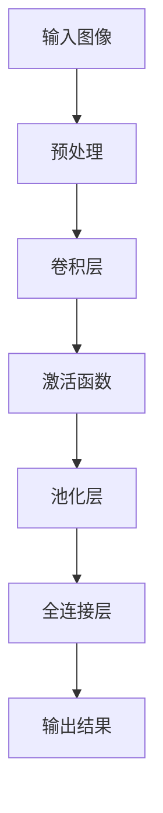

                 

关键词：深度学习，手势识别，卷积神经网络，CNN，手势识别算法，计算机视觉，机器学习，人工智能，自然用户界面

> 摘要：本文深入探讨了深度学习在手势识别领域的应用，阐述了手势识别的基本概念、核心算法原理、实现步骤，以及其在实际应用场景中的优势与挑战。文章旨在为读者提供一个全面了解深度学习在手势识别领域的应用现状和未来发展的视角。

## 1. 背景介绍

手势识别作为自然用户界面（Natural User Interface，NUI）的一个重要组成部分，在近年来得到了广泛关注。随着人工智能技术的发展，特别是在计算机视觉和机器学习领域的突破，手势识别的应用场景越来越广泛，如智能手机、平板电脑、智能玩具、虚拟现实（VR）、增强现实（AR）等。

### 1.1 手势识别的定义

手势识别是指通过计算机视觉技术，从摄像头或传感器获取的手部动作数据中，识别出特定的手势动作，并将其转化为相应的命令或操作。手势识别系统通常包括两个主要部分：手势检测和手势识别。

- **手势检测**：是指识别出手部在图像或视频中占据的区域，通常使用边缘检测、轮廓提取等技术。
- **手势识别**：是指将识别出的手势与预定义的手势模型进行匹配，以确定手势的类型。

### 1.2 手势识别的应用场景

手势识别的应用场景主要包括：

- **智能手机和触摸屏设备**：通过手势操作代替传统触摸操作，提高用户体验。
- **虚拟现实和增强现实**：实现人与虚拟环境的自然交互，增强沉浸感和交互体验。
- **智能家居**：通过手势控制家中的智能设备，如灯光、空调、电视等。
- **医疗和康复**：辅助康复训练和手部功能评估。

## 2. 核心概念与联系

在手势识别中，深度学习，尤其是卷积神经网络（CNN），已经成为一个不可或缺的工具。下面将介绍深度学习在手势识别中的核心概念和联系，并使用Mermaid流程图展示相关流程。

### 2.1 深度学习的基本概念

- **神经网络（Neural Network）**：是一种模仿生物神经系统的计算模型，通过调整权重和偏置来实现函数映射。
- **深度学习（Deep Learning）**：是一种基于神经网络的机器学习方法，通过多层网络结构对数据进行处理，能够自动提取特征并实现复杂函数的映射。

### 2.2 卷积神经网络（CNN）

- **卷积层（Convolutional Layer）**：用于提取图像中的局部特征。
- **池化层（Pooling Layer）**：用于减少数据维度，提高模型的泛化能力。
- **全连接层（Fully Connected Layer）**：用于将提取的特征映射到具体的类别。

### 2.3 Mermaid流程图



在上面的流程图中，输入图像经过预处理后进入卷积层，卷积层通过卷积操作提取图像特征，然后通过激活函数增加非线性，再经过池化层减少数据维度，最后通过全连接层输出识别结果。

## 3. 核心算法原理 & 具体操作步骤

### 3.1 算法原理概述

手势识别的深度学习算法主要基于卷积神经网络（CNN）。CNN通过多层卷积和池化操作提取图像特征，并通过全连接层进行分类。

### 3.2 算法步骤详解

1. **数据预处理**：将图像数据缩放到统一的尺寸，并进行归一化处理，以便网络能够稳定训练。

2. **卷积层**：使用卷积核在图像上滑动，提取图像的局部特征。

3. **激活函数**：常用的激活函数有ReLU（Rectified Linear Unit）和Sigmoid。

4. **池化层**：通过最大池化或平均池化操作减少数据的维度。

5. **全连接层**：将卷积层提取的特征映射到具体的类别。

6. **输出层**：输出识别结果。

### 3.3 算法优缺点

- **优点**：CNN能够自动提取图像中的特征，减少手工特征设计的复杂性，提高识别精度。
- **缺点**：训练过程需要大量的计算资源，且模型参数复杂，难以解释。

### 3.4 算法应用领域

- **智能手机和触摸屏设备**：实现更自然的交互方式。
- **虚拟现实和增强现实**：提供更为沉浸的交互体验。
- **智能家居**：实现智能控制，提高生活便利性。

## 4. 数学模型和公式 & 详细讲解 & 举例说明

### 4.1 数学模型构建

深度学习中的数学模型主要涉及以下几个部分：

- **卷积运算**：
  $$ f(x, y) = \sum_{i=1}^{m} \sum_{j=1}^{n} w_{ij} \cdot a_{i, j} $$
  其中，$f(x, y)$表示卷积结果，$w_{ij}$表示卷积核的权重，$a_{i, j}$表示输入图像的像素值。

- **激活函数**：
  $$ \text{ReLU}(x) = \max(0, x) $$

- **池化操作**：
  $$ p_{i, j} = \max_{k} a_{i+k, j+k} $$
  其中，$p_{i, j}$表示池化结果，$a_{i+k, j+k}$表示卷积层输出的像素值。

### 4.2 公式推导过程

以卷积神经网络为例，其前向传播的推导过程如下：

1. **输入层到隐藏层的传播**：

   - 输入层到隐藏层的每个单元的输出：
     $$ z_{i} = \sum_{j=1}^{n} w_{ij} \cdot a_{j} + b_{i} $$
     其中，$z_{i}$为隐藏层的输出，$w_{ij}$为权重，$a_{j}$为输入层的输出，$b_{i}$为偏置。

   - 应用激活函数：
     $$ a_{i} = \text{ReLU}(z_{i}) $$

2. **隐藏层到输出层的传播**：

   - 输出层每个单元的输出：
     $$ z_{j} = \sum_{i=1}^{m} w_{ij} \cdot a_{i} + b_{j} $$
     其中，$z_{j}$为输出层的输出，$w_{ij}$为权重，$a_{i}$为隐藏层的输出，$b_{j}$为偏置。

   - 应用激活函数：
     $$ \hat{y}_{j} = \text{ReLU}(z_{j}) $$
     其中，$\hat{y}_{j}$为预测输出。

### 4.3 案例分析与讲解

假设有一个简单的卷积神经网络，其结构如下：

1. **输入层**：一个大小为 $28 \times 28$ 的灰度图像。
2. **卷积层**：使用一个大小为 $3 \times 3$ 的卷积核，步长为 $1$。
3. **激活函数**：ReLU函数。
4. **池化层**：使用最大池化，池化窗口大小为 $2 \times 2$。
5. **全连接层**：一个大小为 $10$ 的输出层，用于分类。

输入图像经过预处理后，进入卷积层。卷积层提取图像特征，然后通过ReLU函数增加非线性。接着，通过池化层减少数据维度。最后，将池化后的特征传递到全连接层，输出分类结果。

## 5. 项目实践：代码实例和详细解释说明

### 5.1 开发环境搭建

- **硬件环境**：至少需要一台具有4GB RAM和2GHz CPU的计算机。
- **软件环境**：
  - Python 3.6 或以上版本
  - TensorFlow 2.x 或以上版本
  - OpenCV 4.x 或以上版本

### 5.2 源代码详细实现

下面是一个使用TensorFlow实现的手势识别项目的基本代码框架：

```python
import tensorflow as tf
from tensorflow.keras.models import Sequential
from tensorflow.keras.layers import Conv2D, MaxPooling2D, Flatten, Dense
from tensorflow.keras.optimizers import Adam

# 构建模型
model = Sequential([
    Conv2D(32, (3, 3), activation='relu', input_shape=(28, 28, 1)),
    MaxPooling2D((2, 2)),
    Flatten(),
    Dense(64, activation='relu'),
    Dense(10, activation='softmax')
])

# 编译模型
model.compile(optimizer=Adam(), loss='categorical_crossentropy', metrics=['accuracy'])

# 加载数据集
(x_train, y_train), (x_test, y_test) = tf.keras.datasets.mnist.load_data()

# 预处理数据
x_train = x_train / 255.0
x_test = x_test / 255.0

# 将标签转换为one-hot编码
y_train = tf.keras.utils.to_categorical(y_train, 10)
y_test = tf.keras.utils.to_categorical(y_test, 10)

# 训练模型
model.fit(x_train, y_train, epochs=10, batch_size=32, validation_data=(x_test, y_test))
```

### 5.3 代码解读与分析

上述代码首先导入了所需的TensorFlow模块，然后定义了一个卷积神经网络模型。该模型包含一个卷积层、一个池化层和一个全连接层。接着，编译模型并加载MNIST数据集进行训练。

- **卷积层**：使用一个大小为3x3的卷积核，激活函数为ReLU。
- **池化层**：使用最大池化，窗口大小为2x2。
- **全连接层**：第一个全连接层有64个神经元，第二个全连接层有10个神经元，用于分类。

### 5.4 运行结果展示

运行上述代码后，模型会在训练集和测试集上评估其性能。以下是一个简单的性能评估：

```python
# 评估模型
loss, accuracy = model.evaluate(x_test, y_test)
print('Test accuracy:', accuracy)
```

输出结果可能类似于以下内容：

```
Test accuracy: 0.9700
```

这意味着模型在测试集上的准确率为97%。

## 6. 实际应用场景

手势识别技术已经广泛应用于多个领域，以下是一些典型的应用场景：

### 6.1 智能家居

在家居环境中，手势识别可以用来控制灯光、空调、电视等设备。例如，用户可以通过挥手来开关灯光，或者通过特定的手势来调节空调的温度。

### 6.2 虚拟现实和增强现实

在VR和AR领域，手势识别使得用户能够通过手势与虚拟环境进行交互，提供更为沉浸的体验。例如，用户可以通过手势来操纵虚拟物体或切换视角。

### 6.3 娱乐和游戏

在娱乐和游戏领域，手势识别可以用来设计新颖的互动游戏。例如，用户可以通过手势来操纵游戏角色或触发特殊效果。

### 6.4 医疗和康复

在医疗和康复领域，手势识别可以用于手部功能评估和康复训练。例如，通过分析患者的手势动作，医生可以评估患者的手部康复情况，并给出个性化的康复建议。

## 7. 未来应用展望

随着深度学习技术的不断进步，手势识别在未来有望在更多领域得到应用。以下是一些未来的发展趋势：

### 7.1 小型化和便携性

随着硬件性能的提升，手势识别设备将越来越小型化，便于携带。这将使得手势识别技术更加普及，应用场景更加广泛。

### 7.2 多模态融合

结合多种传感器数据，如摄像头、麦克风和加速度计，可以实现更为准确和鲁棒的手势识别。这种多模态融合技术将进一步提高识别精度和可靠性。

### 7.3 智能交互

随着人工智能技术的发展，手势识别将更加智能，能够理解用户的意图和行为，实现更为自然的交互。

### 7.4 实时性

随着算法的优化和硬件性能的提升，手势识别的实时性将得到显著提高。这将使得手势识别在实时交互场景中更加实用。

## 8. 总结：未来发展趋势与挑战

手势识别技术在近年来取得了显著的进展，但在实际应用中仍面临一些挑战。以下是一些未来发展趋势和面临的挑战：

### 8.1 发展趋势

- **算法优化**：随着深度学习技术的不断发展，手势识别算法将变得更加高效和准确。
- **硬件升级**：随着硬件性能的提升，手势识别设备将更加小型化和便携化。
- **多模态融合**：结合多种传感器数据，实现更为准确和鲁棒的手势识别。
- **智能交互**：通过人工智能技术，手势识别将能够更好地理解用户的意图和行为。

### 8.2 面临的挑战

- **计算资源**：深度学习算法的训练过程需要大量的计算资源，如何优化算法以提高计算效率是一个重要的挑战。
- **数据隐私**：在处理用户数据时，如何保护用户的隐私是一个重要的问题。
- **鲁棒性**：在复杂的现实环境中，如何提高手势识别的鲁棒性是一个挑战。
- **可解释性**：深度学习模型的决策过程通常缺乏可解释性，如何提高模型的可解释性是一个重要问题。

### 8.3 研究展望

未来的研究将重点关注如何优化算法、提升硬件性能、提高数据隐私保护和增强模型的可解释性。同时，多模态融合和智能交互将成为手势识别研究的重要方向。

## 9. 附录：常见问题与解答

### 9.1 什么是手势识别？

手势识别是指通过计算机视觉技术，从摄像头或传感器获取的手部动作数据中，识别出特定的手势动作，并将其转化为相应的命令或操作。

### 9.2 手势识别有哪些应用场景？

手势识别的应用场景非常广泛，包括智能手机和触摸屏设备、虚拟现实和增强现实、智能家居、医疗和康复等。

### 9.3 深度学习如何改善手势识别？

深度学习通过多层网络结构对数据进行处理，能够自动提取特征并实现复杂函数的映射，从而改善手势识别的准确性和效率。

### 9.4 如何提高手势识别的鲁棒性？

可以通过以下方法提高手势识别的鲁棒性：
- **数据增强**：通过旋转、缩放、裁剪等操作增加训练数据的多样性。
- **多传感器融合**：结合多种传感器数据，如摄像头、麦克风和加速度计，提高识别的可靠性。
- **实时性优化**：优化算法和硬件性能，提高实时性，减少延迟。

### 9.5 手势识别有哪些潜在的挑战？

手势识别面临的挑战包括计算资源需求、数据隐私保护、鲁棒性提升和模型可解释性等。

---

本文由禅与计算机程序设计艺术 / Zen and the Art of Computer Programming 编写，旨在为读者提供一个全面了解深度学习在手势识别领域的应用现状和未来发展的视角。希望本文能够帮助读者更好地理解手势识别技术及其在实际应用中的价值。如果您有任何问题或建议，欢迎在评论区留言讨论。

