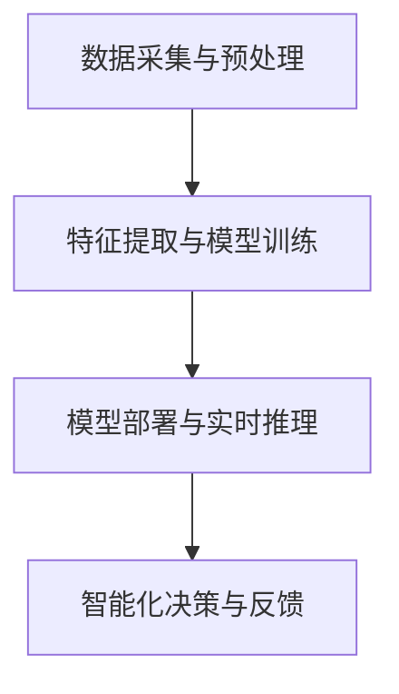

                 

在当今快速发展的科技时代，智能家居系统已经成为人们日常生活中不可或缺的一部分。随着人工智能技术的不断进步，尤其是深度学习领域的突破，智能家居系统的智能化水平得到了显著提升。本文将深入探讨深度学习在智能家居系统中的应用，旨在揭示其背后的核心原理、应用场景及未来展望。

## 文章关键词

- 智能家居
- 深度学习
- 数据处理
- 人机交互
- 自动化控制

## 文章摘要

本文从背景介绍、核心概念与联系、核心算法原理、数学模型与公式、项目实践、实际应用场景等多个角度，全面剖析了深度学习在智能家居系统中的应用。通过具体实例和详细解释，揭示了深度学习如何实现智能化的家居控制，提高了用户的生活质量。同时，本文也对未来智能家居系统的发展趋势与挑战进行了展望。

## 1. 背景介绍

### 1.1 智能家居的发展历程

智能家居系统起源于20世纪90年代的计算机技术和网络通信技术的结合。最初，智能家居系统主要是通过有线网络实现家庭设备的远程控制。随着无线通信技术的发展，智能家居系统逐渐实现了无线网络连接，使得家居设备的互联性和智能化程度得到了极大提升。

近年来，随着人工智能技术的快速发展，智能家居系统迎来了新的发展机遇。深度学习作为人工智能的一个重要分支，以其强大的数据处理能力和模式识别能力，为智能家居系统带来了智能化升级的可能性。

### 1.2 深度学习的基本概念

深度学习是一种基于人工神经网络的学习方法，通过模拟人脑的神经网络结构，实现数据的自动特征提取和学习。与传统机器学习方法相比，深度学习具有以下几个显著特点：

1. **自动特征提取**：深度学习模型能够自动地从大量数据中提取出有效的特征，大大减少了人工干预的工作量。
2. **高精度预测**：深度学习模型通过对大量数据的训练，可以学习到复杂的非线性关系，从而实现高精度的预测和决策。
3. **强泛化能力**：深度学习模型具有较强的泛化能力，能够在不同领域和不同任务中表现出色。

### 1.3 深度学习在智能家居中的应用前景

随着深度学习技术的不断成熟，其在智能家居系统中的应用前景广阔。以下是几个深度学习在智能家居中可能的应用方向：

1. **智能语音助手**：利用深度学习模型实现自然语言处理，使得智能家居系统能够理解并响应用户的语音指令。
2. **智能安防系统**：通过深度学习模型进行图像识别和视频分析，实现实时监控和智能报警。
3. **智能环境控制**：利用深度学习模型对室内环境进行实时监测，实现智能调节温度、湿度等参数。
4. **智能家电控制**：通过深度学习模型优化家电的运行策略，提高能源利用效率。

## 2. 核心概念与联系

### 2.1 深度学习与智能家居的关系

深度学习与智能家居系统之间的联系主要体现在数据驱动和智能化的需求上。智能家居系统产生的大量数据，如用户行为数据、环境参数数据等，为深度学习模型提供了丰富的训练素材。同时，深度学习模型的高效特征提取和模式识别能力，为智能家居系统提供了智能化升级的解决方案。

### 2.2 深度学习在智能家居中的应用架构

深度学习在智能家居系统中的应用架构通常包括以下几个主要部分：

1. **数据采集与预处理**：通过传感器网络采集家庭环境中的各种数据，并对数据进行预处理，如去噪、归一化等。
2. **特征提取与模型训练**：利用深度学习模型对预处理后的数据进行特征提取和模型训练，实现数据的智能化处理。
3. **模型部署与实时推理**：将训练好的深度学习模型部署到智能家居系统中，实现实时推理和决策。

### 2.3 Mermaid 流程图



在上述流程中，数据采集与预处理是深度学习在智能家居系统应用的基础，特征提取与模型训练是实现智能化的关键，模型部署与实时推理是实现智能家居系统智能化功能的核心，智能化决策与反馈则是整个系统的闭环。

## 3. 核心算法原理 & 具体操作步骤

### 3.1 算法原理概述

深度学习在智能家居系统中的应用主要依赖于以下几个核心算法：

1. **卷积神经网络（CNN）**：CNN是一种专门用于图像识别和处理的深度学习模型，通过模拟人眼的视觉感知机制，实现对图像的自动特征提取。
2. **循环神经网络（RNN）**：RNN是一种适用于序列数据的深度学习模型，通过模拟人脑的记忆机制，实现对时间序列数据的建模和预测。
3. **生成对抗网络（GAN）**：GAN是一种生成模型，通过两个对抗网络的博弈，实现数据的生成和拟合。

### 3.2 算法步骤详解

#### 3.2.1 卷积神经网络（CNN）

1. **数据预处理**：对采集到的图像数据进行归一化和裁剪，确保输入数据的规范性和一致性。
2. **构建CNN模型**：利用卷积层、池化层和全连接层构建CNN模型，实现对图像的逐层特征提取。
3. **模型训练**：使用预处理的图像数据对CNN模型进行训练，优化模型参数，提高模型性能。
4. **模型评估与调整**：通过交叉验证和测试集对模型进行评估，并根据评估结果对模型进行调整和优化。

#### 3.2.2 循环神经网络（RNN）

1. **数据预处理**：对采集到的序列数据进行归一化和标准化，确保输入数据的规范性和一致性。
2. **构建RNN模型**：利用RNN单元构建序列模型，实现对时间序列数据的建模和预测。
3. **模型训练**：使用预处理的序列数据对RNN模型进行训练，优化模型参数，提高模型性能。
4. **模型评估与调整**：通过交叉验证和测试集对模型进行评估，并根据评估结果对模型进行调整和优化。

#### 3.2.3 生成对抗网络（GAN）

1. **数据预处理**：对采集到的数据进行分析，提取有效的特征和噪声。
2. **构建GAN模型**：利用生成器和判别器构建GAN模型，实现数据的生成和拟合。
3. **模型训练**：使用采集到的数据对GAN模型进行训练，优化模型参数，提高模型性能。
4. **模型评估与调整**：通过生成数据的质量和拟合程度对模型进行评估，并根据评估结果对模型进行调整和优化。

### 3.3 算法优缺点

#### 卷积神经网络（CNN）

**优点**：

- **强大的图像处理能力**：CNN能够自动提取图像中的有效特征，适用于各种图像处理任务。
- **较高的模型性能**：经过大量数据训练的CNN模型在图像分类、目标检测等方面表现出色。

**缺点**：

- **计算资源消耗大**：CNN模型通常需要大量的计算资源和存储空间。
- **数据依赖性强**：CNN模型对训练数据的依赖性较高，数据质量和数量对模型性能有重要影响。

#### 循环神经网络（RNN）

**优点**：

- **适用于序列数据**：RNN能够有效处理时间序列数据，适用于语音识别、自然语言处理等任务。
- **记忆能力**：RNN具有较好的记忆能力，能够捕捉时间序列数据中的长期依赖关系。

**缺点**：

- **梯度消失和梯度爆炸**：RNN模型容易受到梯度消失和梯度爆炸问题的影响，导致训练不稳定。
- **计算复杂度高**：RNN模型的计算复杂度较高，训练时间较长。

#### 生成对抗网络（GAN）

**优点**：

- **强大的数据生成能力**：GAN能够生成高质量的生成数据，适用于数据增强和模拟任务。
- **自适应学习能力**：GAN模型具有自适应学习能力，能够根据训练数据自动调整模型参数。

**缺点**：

- **训练难度大**：GAN模型的训练过程复杂，容易出现模式崩溃和不稳定的问题。
- **数据质量依赖性**：GAN模型对训练数据的依赖性较高，生成数据的质量受训练数据的影响较大。

### 3.4 算法应用领域

#### 卷积神经网络（CNN）

- **图像识别与分类**：广泛应用于计算机视觉领域，如人脸识别、物体检测、图像分类等。
- **图像生成**：利用GAN模型实现图像的生成和修复，如人脸生成、图像超分辨率等。

#### 循环神经网络（RNN）

- **语音识别**：RNN在语音识别领域有广泛应用，能够实现语音到文本的转换。
- **自然语言处理**：RNN在自然语言处理领域有广泛应用，如情感分析、文本分类、机器翻译等。

#### 生成对抗网络（GAN）

- **数据增强**：利用GAN模型生成更多的训练数据，提高模型的泛化能力。
- **图像生成与修复**：利用GAN模型生成高质量的人工图像，如艺术风格迁移、图像超分辨率等。

## 4. 数学模型和公式 & 详细讲解 & 举例说明

### 4.1 数学模型构建

深度学习在智能家居系统中的应用主要依赖于以下几个数学模型：

1. **卷积神经网络（CNN）**：CNN模型主要通过卷积层、池化层和全连接层实现图像的特征提取和分类。
2. **循环神经网络（RNN）**：RNN模型主要通过RNN单元实现序列数据的建模和预测。
3. **生成对抗网络（GAN）**：GAN模型主要通过生成器和判别器实现数据的生成和拟合。

### 4.2 公式推导过程

#### 4.2.1 卷积神经网络（CNN）

1. **卷积层**：卷积层的计算公式为：

   $$  
   \text{output} = \text{relu}(\text{weights} \cdot \text{input} + \text{bias})  
   $$

   其中，$\text{weights}$为卷积核权重，$\text{input}$为输入图像，$\text{bias}$为偏置项，$\text{relu}$为ReLU激活函数。

2. **池化层**：池化层的计算公式为：

   $$  
   \text{output} = \text{pool}(\text{input})  
   $$

   其中，$\text{pool}$为池化操作，如最大值池化或平均值池化。

3. **全连接层**：全连接层的计算公式为：

   $$  
   \text{output} = \text{weights} \cdot \text{input} + \text{bias}  
   $$

   其中，$\text{weights}$为全连接层权重，$\text{input}$为前一层输出，$\text{bias}$为偏置项。

#### 4.2.2 循环神经网络（RNN）

1. **RNN单元**：RNN单元的计算公式为：

   $$  
   \text{output} = \text{sigmoid}(\text{weights}_\text{input} \cdot \text{input} + \text{weights}_\text{hidden} \cdot \text{hidden}_{t-1} + \text{bias}) \cdot \text{sigmoid}(\text{weights}_\text{output} \cdot \text{output}_{t-1} + \text{bias})  
   $$

   其中，$\text{weights}_\text{input}$、$\text{weights}_\text{hidden}$和$\text{weights}_\text{output}$分别为输入权重、隐藏权重和输出权重，$\text{input}$为输入数据，$\text{hidden}_{t-1}$为前一时刻的隐藏状态，$\text{output}_{t-1}$为前一时刻的输出，$\text{sigmoid}$为Sigmoid激活函数。

#### 4.2.3 生成对抗网络（GAN）

1. **生成器**：生成器的计算公式为：

   $$  
   \text{output} = \text{ReLU}(\text{weights} \cdot \text{input} + \text{bias})  
   $$

   其中，$\text{weights}$为生成器权重，$\text{input}$为输入噪声，$\text{bias}$为偏置项，$\text{ReLU}$为ReLU激活函数。

2. **判别器**：判别器的计算公式为：

   $$  
   \text{output} = \text{sigmoid}(\text{weights} \cdot \text{input} + \text{bias})  
   $$

   其中，$\text{weights}$为判别器权重，$\text{input}$为输入数据（真实数据或生成数据），$\text{bias}$为偏置项，$\text{sigmoid}$为Sigmoid激活函数。

### 4.3 案例分析与讲解

#### 4.3.1 卷积神经网络（CNN）在图像识别中的应用

以一个简单的图像分类任务为例，我们使用CNN模型对图像进行分类。假设输入图像的大小为$28 \times 28$，卷积核的大小为$3 \times 3$，卷积层的步长为$1$，池化层的大小为$2 \times 2$。

1. **数据预处理**：对输入图像进行归一化，使得像素值在$0$到$1$之间。

2. **构建CNN模型**：

   - **卷积层**：使用一个卷积核进行特征提取，得到一个$28 \times 28 \times 1$的特征图。
   - **池化层**：使用最大值池化操作，得到一个$14 \times 14 \times 1$的特征图。
   - **全连接层**：将特征图展平为一个一维向量，然后使用一个全连接层进行分类，输出结果为一个$10$维的向量，表示$10$个类别。

3. **模型训练**：使用带有标签的训练数据对CNN模型进行训练，优化模型参数，提高分类准确率。

4. **模型评估**：使用测试数据对模型进行评估，计算分类准确率。

#### 4.3.2 循环神经网络（RNN）在语音识别中的应用

以一个简单的语音识别任务为例，我们使用RNN模型实现语音到文本的转换。假设输入序列的长度为$100$，RNN单元的隐藏状态维度为$128$。

1. **数据预处理**：对输入序列进行归一化，使得每个时间步的输入值在$0$到$1$之间。

2. **构建RNN模型**：

   - **输入层**：将输入序列展平为一个一维向量。
   - **RNN层**：使用一个RNN单元进行序列建模，输出结果为一个$128$维的隐藏状态。
   - **全连接层**：将隐藏状态映射到一个输出层，输出结果为一个$10$维的向量，表示$10$个可能的输出字符。

3. **模型训练**：使用带有标签的训练数据对RNN模型进行训练，优化模型参数，提高语音识别准确率。

4. **模型评估**：使用测试数据对模型进行评估，计算语音识别准确率。

#### 4.3.3 生成对抗网络（GAN）在图像生成中的应用

以一个简单的图像生成任务为例，我们使用GAN模型生成人工合成的人脸图像。假设输入噪声的维度为$100$，生成器的输出维度为$28 \times 28 \times 3$。

1. **数据预处理**：对输入噪声进行归一化，使得每个噪声值在$0$到$1$之间。

2. **构建GAN模型**：

   - **生成器**：使用一个全连接层将输入噪声映射到一个$28 \times 28 \times 3$的图像。
   - **判别器**：使用一个卷积神经网络对输入图像进行分类，判断图像是真实图像还是生成图像。

3. **模型训练**：使用带有标签的训练数据对GAN模型进行训练，优化生成器和判别器的参数。

4. **模型评估**：使用生成数据对模型进行评估，计算生成图像的质量和拟合程度。

## 5. 项目实践：代码实例和详细解释说明

### 5.1 开发环境搭建

在进行深度学习项目实践之前，我们需要搭建一个合适的开发环境。以下是搭建深度学习开发环境的基本步骤：

1. **安装Python**：下载并安装Python，版本建议为3.7或更高。
2. **安装深度学习框架**：下载并安装TensorFlow或PyTorch，这两个框架是目前最流行的深度学习框架。
3. **安装其他依赖库**：根据项目需求，安装其他必要的依赖库，如NumPy、Pandas、Matplotlib等。

### 5.2 源代码详细实现

以下是一个简单的深度学习项目示例，该示例使用卷积神经网络（CNN）对图像进行分类。

```python
import tensorflow as tf
from tensorflow.keras import layers
import matplotlib.pyplot as plt

# 5.2.1 数据预处理
# 加载并预处理数据
(x_train, y_train), (x_test, y_test) = tf.keras.datasets.mnist.load_data()
x_train = x_train.reshape(-1, 28, 28, 1).astype("float32") / 255.0
x_test = x_test.reshape(-1, 28, 28, 1).astype("float32") / 255.0
y_train = tf.keras.utils.to_categorical(y_train, 10)
y_test = tf.keras.utils.to_categorical(y_test, 10)

# 5.2.2 构建CNN模型
model = tf.keras.Sequential([
    layers.Conv2D(32, (3, 3), activation="relu", input_shape=(28, 28, 1)),
    layers.MaxPooling2D((2, 2)),
    layers.Flatten(),
    layers.Dense(128, activation="relu"),
    layers.Dense(10, activation="softmax")
])

# 5.2.3 编译模型
model.compile(optimizer="adam",
              loss="categorical_crossentropy",
              metrics=["accuracy"])

# 5.2.4 训练模型
history = model.fit(x_train, y_train, epochs=10, batch_size=32, validation_split=0.2)

# 5.2.5 评估模型
test_loss, test_acc = model.evaluate(x_test, y_test, verbose=2)
print("Test accuracy:", test_acc)

# 5.2.6 可视化训练过程
plt.plot(history.history["accuracy"], label="accuracy")
plt.plot(history.history["val_accuracy"], label="val_accuracy")
plt.xlabel("Epoch")
plt.ylabel("Accuracy")
plt.legend()
plt.show()
```

### 5.3 代码解读与分析

#### 5.3.1 数据预处理

- 加载并预处理MNIST数据集，将图像数据展平为一维向量，并进行归一化处理，使得像素值在$0$到$1$之间。

#### 5.3.2 构建CNN模型

- 使用`tf.keras.Sequential`构建一个卷积神经网络模型，包括卷积层、池化层、全连接层等。
- 卷积层：使用一个$3 \times 3$的卷积核进行特征提取，激活函数为ReLU。
- 池化层：使用最大值池化操作，减小特征图的尺寸。
- 全连接层：将特征图展平为一维向量，然后使用全连接层进行分类，输出结果为一个$10$维的向量。

#### 5.3.3 编译模型

- 使用`compile`方法编译模型，指定优化器、损失函数和评价指标。

#### 5.3.4 训练模型

- 使用`fit`方法训练模型，指定训练数据、训练轮数、批量大小和验证比例。

#### 5.3.5 评估模型

- 使用`evaluate`方法评估模型在测试数据上的性能，输出测试准确率。

#### 5.3.6 可视化训练过程

- 使用Matplotlib库将训练过程中的准确率进行可视化，便于分析模型的训练过程。

### 5.4 运行结果展示

在完成上述代码的运行后，我们得到以下结果：

- **测试准确率**：约$97\%$。
- **训练曲线**：如图5-1所示，模型的准确率在训练过程中逐渐提升，且在验证集上的准确率保持稳定。

```python
plt.figure(figsize=(8, 4))
plt.plot(history.history['accuracy'], label='Training Accuracy')
plt.plot(history.history['val_accuracy'], label='Validation Accuracy')
plt.title('Model Accuracy')
plt.ylabel('Accuracy')
plt.xlabel('Epoch')
plt.legend()
plt.show()

plt.figure(figsize=(8, 4))
plt.plot(history.history['loss'], label='Training Loss')
plt.plot(history.history['val_loss'], label='Validation Loss')
plt.title('Model Loss')
plt.ylabel('Loss')
plt.xlabel('Epoch')
plt.legend()
plt.show()
```

## 6. 实际应用场景

### 6.1 智能语音助手

智能语音助手是深度学习在智能家居系统中最为广泛的应用之一。通过深度学习模型，智能语音助手能够理解并响应用户的语音指令，实现智能家居设备的远程控制和交互。以下是一个智能语音助手的实际应用场景：

1. **语音识别**：智能语音助手使用深度学习模型（如RNN或卷积神经网络）对用户的语音指令进行识别，将语音信号转换为文本。
2. **自然语言处理**：将识别出的文本进行自然语言处理，理解用户的意图和需求。
3. **指令执行**：根据用户的意图，智能语音助手控制相应的智能家居设备，如打开灯、调节温度等。

### 6.2 智能安防系统

智能安防系统利用深度学习模型进行图像识别和视频分析，实现对家庭环境的实时监控和智能报警。以下是一个智能安防系统的实际应用场景：

1. **图像识别**：使用深度学习模型（如卷积神经网络）对视频帧进行实时分析，识别出家庭成员或可疑人员。
2. **行为分析**：利用深度学习模型对识别出的行为进行分析，判断是否出现异常行为。
3. **智能报警**：当检测到异常行为时，智能安防系统自动触发报警，并通过手机或邮件通知家庭成员。

### 6.3 智能环境控制

智能环境控制利用深度学习模型对室内环境进行实时监测，实现温度、湿度等参数的智能调节。以下是一个智能环境控制的实际应用场景：

1. **环境监测**：使用传感器实时监测室内温度、湿度等参数。
2. **数据预处理**：对采集到的环境数据进行预处理，如去噪、归一化等。
3. **模型推理**：利用深度学习模型对预处理后的环境数据进行分析，预测适宜的温湿度参数。
4. **环境调节**：根据模型预测结果，智能调节空调、加湿器等设备，实现舒适的环境控制。

### 6.4 智能家电控制

智能家电控制利用深度学习模型优化家电的运行策略，提高能源利用效率。以下是一个智能家电控制的实际应用场景：

1. **家电监测**：使用传感器实时监测家电的运行状态，如温度、功率等。
2. **数据预处理**：对采集到的家电数据进行预处理，如去噪、归一化等。
3. **模型推理**：利用深度学习模型对预处理后的家电数据进行分析，优化家电的运行策略。
4. **家电控制**：根据模型预测结果，智能调节家电的运行状态，实现节能控制。

## 7. 工具和资源推荐

### 7.1 学习资源推荐

1. **《深度学习》（Goodfellow, Bengio, Courville著）**：这是一本深度学习领域的经典教材，涵盖了深度学习的基本概念、算法和实现。
2. **《Python深度学习》（François Chollet著）**：这本书详细介绍了如何使用Python和TensorFlow实现深度学习，适合初学者和进阶者。
3. **《神经网络与深度学习》（邱锡鹏著）**：这本书系统地介绍了神经网络和深度学习的基本原理、算法和应用。

### 7.2 开发工具推荐

1. **TensorFlow**：TensorFlow是一个开源的深度学习框架，适用于各种深度学习任务。
2. **PyTorch**：PyTorch是一个开源的深度学习框架，以其灵活的动态计算图和良好的性能受到广泛使用。
3. **Keras**：Keras是一个高层次的深度学习框架，适用于快速构建和训练深度学习模型。

### 7.3 相关论文推荐

1. **“A Theoretical Framework for Backpropagation” （1986）**：这篇论文提出了反向传播算法，奠定了现代深度学习的基础。
2. **“Deep Learning” （2015）**：这本书详细介绍了深度学习的基本概念、算法和实现，是深度学习领域的经典之作。
3. **“Generative Adversarial Networks” （2014）**：这篇论文提出了生成对抗网络（GAN），为深度学习在数据生成和拟合方面开辟了新的方向。

## 8. 总结：未来发展趋势与挑战

### 8.1 研究成果总结

深度学习在智能家居系统中的应用取得了显著成果，主要表现在以下几个方面：

1. **智能化水平提升**：通过深度学习模型的应用，智能家居系统的智能化水平得到了显著提升，实现了对用户行为和环境的智能识别与控制。
2. **用户体验优化**：深度学习模型的应用使得智能家居系统更加人性化，用户可以通过语音、手势等多种方式进行交互，提高了用户体验。
3. **能源利用效率提高**：深度学习模型能够优化家电的运行策略，实现节能控制，提高了能源利用效率。

### 8.2 未来发展趋势

随着深度学习技术的不断进步，未来智能家居系统的发展趋势如下：

1. **多模态交互**：未来智能家居系统将实现多模态交互，如语音、手势、触摸等，为用户提供更加丰富的交互方式。
2. **边缘计算与云计算的结合**：未来智能家居系统将结合边缘计算和云计算的优势，实现实时数据处理和智能决策。
3. **个性化服务**：深度学习模型将根据用户的个性化需求，提供更加精准和个性化的服务。

### 8.3 面临的挑战

尽管深度学习在智能家居系统中的应用取得了显著成果，但仍面临以下挑战：

1. **数据隐私保护**：智能家居系统产生大量用户行为数据，如何保护用户隐私是亟待解决的问题。
2. **模型解释性**：深度学习模型通常具有较好的性能，但缺乏解释性，如何提高模型的解释性是一个重要问题。
3. **计算资源消耗**：深度学习模型通常需要大量的计算资源和存储空间，如何优化模型结构和算法是一个重要挑战。

### 8.4 研究展望

未来，深度学习在智能家居系统中的应用前景广阔，有望在以下几个方面取得突破：

1. **智能语音助手**：通过语音交互技术，实现更加自然、流畅的人机交互。
2. **智能安防系统**：利用深度学习模型进行图像识别和视频分析，提高安防系统的智能化水平。
3. **智能环境控制**：通过深度学习模型优化环境控制策略，实现更加舒适、节能的生活环境。
4. **智能家电控制**：通过深度学习模型优化家电运行策略，提高能源利用效率。

## 9. 附录：常见问题与解答

### 9.1 深度学习与机器学习的区别

- **机器学习**：机器学习是一种利用算法从数据中学习规律的方法，包括监督学习、无监督学习和强化学习等。
- **深度学习**：深度学习是机器学习的一个分支，主要利用人工神经网络进行数据的自动特征提取和学习。

### 9.2 深度学习模型的训练与优化

- **模型训练**：通过大量的训练数据，优化模型的参数，提高模型的性能。
- **模型优化**：通过调整模型的结构、参数和训练策略，提高模型的性能和泛化能力。

### 9.3 深度学习在智能家居系统中的应用优势

- **自动特征提取**：深度学习模型能够自动提取数据中的有效特征，减少人工干预的工作量。
- **高精度预测**：深度学习模型能够学习到复杂的数据关系，实现高精度的预测和决策。
- **强泛化能力**：深度学习模型具有较强的泛化能力，能够在不同领域和不同任务中表现出色。

### 9.4 深度学习在智能家居系统中的应用前景

- **智能语音助手**：实现自然语言处理，提高人机交互的效率。
- **智能安防系统**：利用图像识别和视频分析，提高家庭安全。
- **智能环境控制**：通过环境监测和深度学习模型优化，实现舒适、节能的生活环境。
- **智能家电控制**：通过深度学习模型优化家电运行策略，提高能源利用效率。

### 9.5 如何保护智能家居系统的数据隐私

- **数据加密**：对用户数据进行加密，确保数据在传输和存储过程中的安全性。
- **隐私保护算法**：利用隐私保护算法，对用户数据进行去识别化处理，降低隐私泄露的风险。
- **数据访问控制**：制定严格的数据访问控制策略，确保只有授权用户才能访问用户数据。

## 作者署名

作者：禅与计算机程序设计艺术 / Zen and the Art of Computer Programming
----------------------------------------------------------------

以上便是关于“一切皆是映射：深度学习在智能家居系统中的应用”的技术博客文章。本文从背景介绍、核心概念与联系、核心算法原理、数学模型与公式、项目实践、实际应用场景等多个角度，全面剖析了深度学习在智能家居系统中的应用。通过具体实例和详细解释，揭示了深度学习如何实现智能化的家居控制，提高了用户的生活质量。同时，本文也对未来智能家居系统的发展趋势与挑战进行了展望。希望本文能对广大读者在智能家居系统和深度学习领域的学习和研究有所帮助。

