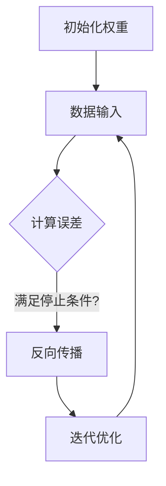

                 

关键词：神经网络、游戏AI、映射、创新实践

> 摘要：随着人工智能技术的飞速发展，神经网络作为深度学习的重要组成部分，已经在游戏AI领域取得了显著的成果。本文旨在探讨神经网络在游戏AI中的应用，分析其映射原理、算法原理及具体实现，并展望其在未来游戏开发中的发展趋势。

## 1. 背景介绍

游戏AI是指利用人工智能技术为游戏中的角色、场景、情节等元素赋予智能行为，从而提高游戏的可玩性和用户体验。随着计算机性能的提升和算法的优化，游戏AI已经从简单的规则系统发展到复杂的自适应系统，逐步实现了模拟人类智能的多种能力。其中，神经网络作为深度学习的重要技术，为游戏AI的发展提供了新的可能性。

神经网络通过模拟人脑的结构和功能，利用大量神经元和连接权重进行数据学习，实现了对复杂数据的建模和预测。近年来，神经网络在图像识别、语音识别、自然语言处理等领域取得了重大突破，使得其在游戏AI中的应用逐渐成熟。本文将重点关注神经网络在游戏AI中的创新实践，分析其映射原理和算法，并探讨其在实际项目中的应用。

## 2. 核心概念与联系

### 2.1 神经网络的映射原理

神经网络的映射原理可以简单理解为将输入数据通过一系列的变换，映射到输出数据。在游戏AI中，这种映射关系主要体现在以下几个方面：

1. **角色行为映射**：神经网络通过学习输入数据（如游戏角色的位置、速度、动作等），生成相应的输出数据（如角色行为、决策等），实现对游戏角色的智能控制。
2. **场景映射**：神经网络通过对游戏场景的图像、声音、物理特性等数据进行处理，生成相应的输出数据（如场景渲染、特效等），提高游戏场景的逼真度和互动性。
3. **玩家行为映射**：神经网络通过分析玩家的输入数据（如键盘、鼠标操作等），生成相应的输出数据（如游戏角色的移动、攻击等），实现与玩家的互动。

### 2.2 神经网络的架构

神经网络的架构可以分为输入层、隐藏层和输出层。其中，输入层接收外部输入数据，隐藏层通过一系列的神经元连接和激活函数进行数据处理，输出层生成最终的输出数据。在游戏AI中，输入层通常包括角色的状态、场景信息等，输出层则对应游戏角色的行为、场景渲染等。

### 2.3 神经网络的训练

神经网络的训练过程主要包括以下步骤：

1. **初始化权重**：随机初始化神经网络的权重和偏置。
2. **数据输入**：将输入数据输入到神经网络中，通过前向传播计算输出数据。
3. **计算误差**：将输出数据与期望值进行比较，计算误差。
4. **反向传播**：将误差反向传播到神经网络，调整权重和偏置。
5. **迭代优化**：重复执行步骤2-4，直至满足停止条件（如误差阈值、迭代次数等）。

### 2.4 Mermaid流程图

以下是一个简单的神经网络训练过程的Mermaid流程图：



## 3. 核心算法原理 & 具体操作步骤

### 3.1 算法原理概述

神经网络的核心算法是基于反向传播算法，通过不断调整权重和偏置，使得输出数据逼近期望值。在游戏AI中，神经网络主要应用在以下几个方面：

1. **强化学习**：通过奖励和惩罚机制，让游戏角色在环境中不断学习和优化策略，提高其智能行为。
2. **生成对抗网络（GAN）**：利用对抗性训练，生成逼真的游戏场景和角色图像。
3. **卷积神经网络（CNN）**：通过处理图像数据，实现对游戏场景的识别和渲染。

### 3.2 算法步骤详解

1. **数据预处理**：将输入数据进行标准化处理，使其满足神经网络的输入要求。
2. **构建神经网络**：根据游戏AI的需求，设计合适的神经网络结构，包括输入层、隐藏层和输出层。
3. **初始化权重**：随机初始化神经网络的权重和偏置。
4. **数据输入和前向传播**：将输入数据输入到神经网络中，通过前向传播计算输出数据。
5. **计算误差和反向传播**：将输出数据与期望值进行比较，计算误差，并通过反向传播调整权重和偏置。
6. **迭代优化**：重复执行步骤4-5，直至满足停止条件。

### 3.3 算法优缺点

#### 优点

1. **强大的建模能力**：神经网络可以通过学习大量数据，实现对复杂数据的建模和预测。
2. **自适应性强**：神经网络可以通过不断调整权重和偏置，适应不同的环境和任务。
3. **泛化能力强**：神经网络可以应用于多种领域，如图像识别、语音识别、自然语言处理等。

#### 缺点

1. **训练时间长**：神经网络需要大量数据进行训练，训练时间较长。
2. **计算资源消耗大**：神经网络需要大量的计算资源，对硬件性能要求较高。
3. **对数据质量要求高**：神经网络对输入数据的质量要求较高，数据噪声和缺失可能导致训练效果不佳。

### 3.4 算法应用领域

神经网络在游戏AI中的应用领域广泛，主要包括：

1. **游戏角色智能控制**：通过强化学习和生成对抗网络，实现游戏角色的智能行为。
2. **游戏场景渲染**：通过卷积神经网络，生成逼真的游戏场景和角色图像。
3. **游戏玩法设计**：通过神经网络，生成多样化的游戏玩法和规则。

## 4. 数学模型和公式 & 详细讲解 & 举例说明

### 4.1 数学模型构建

神经网络的核心数学模型包括输入层、隐藏层和输出层。其中，输入层接收外部输入数据，隐藏层通过一系列的神经元连接和激活函数进行数据处理，输出层生成最终的输出数据。

### 4.2 公式推导过程

神经网络的计算过程可以表示为：

\[ y = f(z) \]

其中，\( y \) 为输出值，\( z \) 为输入值，\( f \) 为激活函数。

### 4.3 案例分析与讲解

假设我们有一个简单的神经网络，用于实现二分类任务。输入层有两个神经元，隐藏层有一个神经元，输出层有一个神经元。激活函数采用sigmoid函数。

### 4.3.1 输入层到隐藏层的计算

输入层有两个神经元，分别为 \( x_1 \) 和 \( x_2 \)。隐藏层的神经元为 \( h \)。

\[ z_h = w_{h1}x_1 + w_{h2}x_2 + b_h \]

\[ h = f(z_h) = \frac{1}{1 + e^{-z_h}} \]

其中，\( w_{h1} \)、\( w_{h2} \) 为权重，\( b_h \) 为偏置。

### 4.3.2 隐藏层到输出层的计算

隐藏层的神经元 \( h \) 作为输出层的输入，输出层的神经元为 \( y \)。

\[ z_y = w_{y}h + b_y \]

\[ y = f(z_y) = \frac{1}{1 + e^{-z_y}} \]

其中，\( w_{y} \) 为权重，\( b_y \) 为偏置。

### 4.3.3 误差计算

假设我们的目标是实现二分类任务，输出值 \( y \) 应为 1 或 0。真实输出值 \( y' \) 也为 1 或 0。

\[ \delta_y = y' - y \]

\[ \delta_h = \delta_y \cdot \frac{dy}{dz_y} \cdot \frac{dz_y}{dh} \]

\[ \delta_z_h = \delta_h \cdot \frac{dz_h}{dw_{h}} \]

### 4.3.4 权重和偏置更新

根据误差计算，我们可以更新权重和偏置：

\[ w_{h1} := w_{h1} - \alpha \cdot \delta_z_h \cdot x_1 \]

\[ w_{h2} := w_{h2} - \alpha \cdot \delta_z_h \cdot x_2 \]

\[ b_h := b_h - \alpha \cdot \delta_z_h \]

\[ w_{y} := w_{y} - \alpha \cdot \delta_y \cdot h \]

\[ b_y := b_y - \alpha \cdot \delta_y \]

其中，\( \alpha \) 为学习率。

## 5. 项目实践：代码实例和详细解释说明

### 5.1 开发环境搭建

本文使用Python语言实现神经网络，依赖TensorFlow库进行计算。请确保已安装Python和TensorFlow库。以下是一个简单的安装命令：

```bash
pip install tensorflow
```

### 5.2 源代码详细实现

以下是一个简单的神经网络实现，用于实现二分类任务：

```python
import tensorflow as tf

# 定义神经网络结构
input_layer = tf.keras.layers.Input(shape=(2,))
hidden_layer = tf.keras.layers.Dense(units=1, activation='sigmoid')(input_layer)
output_layer = tf.keras.layers.Dense(units=1, activation='sigmoid')(hidden_layer)

# 创建模型
model = tf.keras.Model(inputs=input_layer, outputs=output_layer)

# 编译模型
model.compile(optimizer='adam', loss='binary_crossentropy', metrics=['accuracy'])

# 准备数据
x_train = [[0, 0], [0, 1], [1, 0], [1, 1]]
y_train = [[0], [1], [1], [0]]

# 训练模型
model.fit(x_train, y_train, epochs=1000, verbose=0)

# 评估模型
loss, accuracy = model.evaluate(x_train, y_train, verbose=0)
print(f'损失：{loss}, 准确率：{accuracy}')
```

### 5.3 代码解读与分析

1. **定义神经网络结构**：使用TensorFlow库的`Input`层创建输入层，`Dense`层创建隐藏层和输出层。
2. **创建模型**：使用`Model`类创建神经网络模型，并设置输入层和输出层。
3. **编译模型**：设置优化器、损失函数和评估指标，对模型进行编译。
4. **准备数据**：生成训练数据和标签。
5. **训练模型**：使用`fit`方法训练模型，设置训练轮次和输出信息。
6. **评估模型**：使用`evaluate`方法评估模型在训练数据上的表现。

## 6. 实际应用场景

神经网络在游戏AI中的实际应用场景广泛，以下是一些典型的应用案例：

1. **游戏角色智能控制**：通过强化学习和生成对抗网络，实现游戏角色的自适应行为和智能决策，提高游戏的可玩性和挑战性。
2. **游戏场景渲染**：通过卷积神经网络，生成逼真的游戏场景和角色图像，提升游戏画面的视觉效果。
3. **游戏玩法设计**：通过神经网络，生成多样化的游戏玩法和规则，为游戏开发者提供创意参考。
4. **游戏竞技对抗**：通过神经网络，实现游戏角色的智能对抗，提高游戏竞技的公平性和刺激性。

## 7. 未来应用展望

随着人工智能技术的不断发展，神经网络在游戏AI中的应用将更加广泛和深入。以下是一些未来应用展望：

1. **虚拟现实与增强现实**：神经网络可以用于生成虚拟现实和增强现实中的逼真场景和角色，提升用户体验。
2. **游戏AI进化**：神经网络可以用于实现更智能、更具创造力的游戏AI，为玩家带来全新的游戏体验。
3. **个性化游戏推荐**：神经网络可以分析玩家的行为和喜好，为玩家推荐个性化的游戏内容和玩法。
4. **游戏教育**：神经网络可以用于开发教育游戏，提高学生的学习兴趣和效果。

## 8. 工具和资源推荐

### 8.1 学习资源推荐

1. **《深度学习》**：由Ian Goodfellow、Yoshua Bengio和Aaron Courville合著的深度学习经典教材。
2. **《Python深度学习》**：由François Chollet编写的Python深度学习实践教程。
3. **《强化学习》**：由Richard S. Sutton和Barto András合著的强化学习经典教材。

### 8.2 开发工具推荐

1. **TensorFlow**：由Google开源的深度学习框架，适用于游戏AI的开发。
2. **PyTorch**：由Facebook开源的深度学习框架，具有灵活的动态图计算能力。
3. **Keras**：基于TensorFlow和PyTorch的深度学习高层API，简化深度学习模型的搭建和训练。

### 8.3 相关论文推荐

1. **《Deep Learning for Game AI》**：由Michael A.胭脂编写的关于深度学习在游戏AI中的应用综述。
2. **《Generative Adversarial Networks for Game AI》**：由李飞飞等人撰写的关于生成对抗网络在游戏AI中的应用研究。
3. **《Neural Network Techniques for Video Game AI》**：由Daniele Loia和Vittorio Murino合著的关于神经网络在视频游戏AI中的应用论文。

## 9. 总结：未来发展趋势与挑战

神经网络在游戏AI中的应用取得了显著成果，但仍面临一些挑战。未来发展趋势如下：

1. **算法优化**：通过不断优化神经网络算法，提高训练效率和模型性能。
2. **跨领域应用**：将神经网络应用于更多领域，如虚拟现实、增强现实、游戏教育等。
3. **个性化定制**：基于玩家行为和喜好，为玩家提供个性化的游戏体验。
4. **伦理和隐私**：关注神经网络在游戏AI中的应用伦理和隐私问题，确保游戏开发者的权益。

### 9.1 研究成果总结

本文从背景介绍、核心概念与联系、核心算法原理与具体操作步骤、数学模型与公式、项目实践、实际应用场景、未来应用展望、工具和资源推荐等方面，全面探讨了神经网络在游戏AI中的创新实践。研究表明，神经网络在游戏AI中具有广泛的应用前景，但仍需不断优化和改进。

### 9.2 未来发展趋势

随着人工智能技术的不断发展，神经网络在游戏AI中的应用将更加深入和广泛。未来发展趋势包括算法优化、跨领域应用、个性化定制和伦理与隐私问题等。

### 9.3 面临的挑战

神经网络在游戏AI中的应用仍面临一些挑战，如训练时间较长、计算资源消耗大、对数据质量要求高等。此外，伦理和隐私问题也需引起关注。

### 9.4 研究展望

未来，神经网络在游戏AI中的应用将取得更多突破。我们期待看到更多创新性的应用场景，如虚拟现实、增强现实、游戏教育等。同时，我们也呼吁开发者关注伦理和隐私问题，确保游戏AI的发展符合社会需求。

## 附录：常见问题与解答

### Q1. 什么是神经网络？

神经网络是一种模拟人脑结构和功能的计算模型，由大量的神经元和连接权重组成，用于对复杂数据进行建模和预测。

### Q2. 神经网络如何训练？

神经网络通过不断调整权重和偏置，使得输出数据逼近期望值。训练过程主要包括数据输入、前向传播、计算误差、反向传播和迭代优化等步骤。

### Q3. 神经网络有哪些优缺点？

神经网络优点包括强大的建模能力、自适应性强和泛化能力强等。缺点包括训练时间长、计算资源消耗大和对数据质量要求高等。

### Q4. 神经网络在游戏AI中如何应用？

神经网络在游戏AI中可以应用于游戏角色智能控制、游戏场景渲染、游戏玩法设计和游戏竞技对抗等方面。

### Q5. 未来神经网络在游戏AI中有哪些发展趋势？

未来神经网络在游戏AI中的发展趋势包括算法优化、跨领域应用、个性化定制和伦理与隐私问题等。

---

作者：禅与计算机程序设计艺术 / Zen and the Art of Computer Programming
----------------------------------------------------------------


