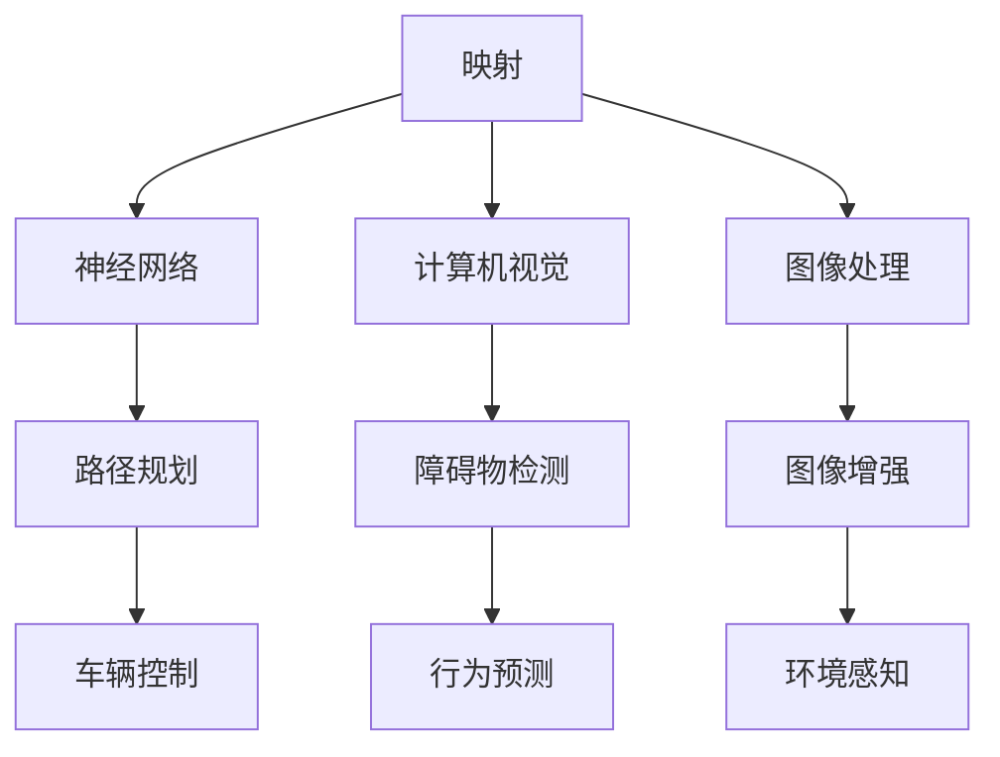

                 

关键词：自动驾驶，AI算法，映射，深度学习，神经网络，计算机视觉，图像处理

摘要：本文深入探讨了自动驾驶技术中的核心AI算法，从背景介绍、核心概念与联系、核心算法原理、数学模型和公式、项目实践、实际应用场景、未来展望等方面，全面解析了自动驾驶技术在人工智能领域的应用与发展。

## 1. 背景介绍

自动驾驶技术作为人工智能领域的一个重要分支，已经吸引了众多科研人员和企业的关注。随着深度学习、计算机视觉等技术的不断进步，自动驾驶汽车逐渐从理论走向现实。自动驾驶技术的发展不仅能够提高交通安全，减少交通事故，还能够节省能源，缓解交通拥堵。

自动驾驶技术可以分为几个层次，从低级到高级分别为：驾驶辅助系统、部分自动驾驶、有条件自动驾驶、高度自动驾驶和完全自动驾驶。每个层次都依赖于不同的AI算法，这些算法在图像识别、路径规划、环境感知等方面发挥着关键作用。

## 2. 核心概念与联系

在自动驾驶技术中，核心概念包括映射、神经网络、计算机视觉和图像处理。映射是指将输入数据转换成输出数据的过程，这在自动驾驶中至关重要，因为车辆需要将周围环境的信息映射成可操作的指令。

### 2.1 神经网络

神经网络是自动驾驶技术中的核心组成部分，它模拟人脑的工作方式，通过大量神经元之间的连接和权重调整来学习和处理信息。神经网络可以分为卷积神经网络（CNN）、循环神经网络（RNN）等类型，它们在图像识别、语音识别等方面表现出色。

### 2.2 计算机视觉

计算机视觉是使计算机能够“看”懂图像的技术。在自动驾驶中，计算机视觉用于识别道路标志、行人和其他车辆等。深度学习是实现计算机视觉的重要技术，通过训练大量数据，神经网络可以学会识别各种图像特征。

### 2.3 图像处理

图像处理是自动驾驶技术的基础，它包括图像的采集、预处理、增强和识别等步骤。通过图像处理技术，可以提高图像的质量，使其更适合用于深度学习和计算机视觉任务。

### 2.4 Mermaid 流程图

下面是一个简单的Mermaid流程图，展示了自动驾驶技术中的核心概念和它们之间的联系。



## 3. 核心算法原理 & 具体操作步骤

### 3.1 算法原理概述

自动驾驶技术中的核心算法主要包括深度学习算法和传统路径规划算法。深度学习算法如CNN和RNN主要用于图像识别和环境感知，而传统路径规划算法则用于确定车辆的行驶路径。

### 3.2 算法步骤详解

#### 3.2.1 深度学习算法

深度学习算法主要包括以下几个步骤：

1. 数据采集：收集大量的道路图像、标定数据和其他相关信息。
2. 数据预处理：对图像进行裁剪、增强、归一化等处理，使其更适合训练。
3. 模型训练：使用神经网络对预处理后的图像数据进行训练，调整神经元权重。
4. 模型评估：使用验证数据集对训练好的模型进行评估，调整模型参数。
5. 应用部署：将训练好的模型部署到自动驾驶系统中，进行实时识别和处理。

#### 3.2.2 传统路径规划算法

传统路径规划算法主要包括以下几个步骤：

1. 初始化：设置初始位置和目标位置。
2. 路径搜索：使用搜索算法（如A*算法）寻找从初始位置到目标位置的最优路径。
3. 路径优化：根据环境变化对路径进行优化，确保路径的安全性。
4. 路径跟踪：根据实时环境信息，调整车辆行驶路径。

### 3.3 算法优缺点

#### 深度学习算法

优点：

- 强大的图像识别能力
- 自动提取特征，减少手工特征设计的工作量
- 对复杂环境具有较强的适应性

缺点：

- 对大量数据进行训练，计算资源需求较高
- 模型复杂，难以解释和调试

#### 传统路径规划算法

优点：

- 理论基础扎实，易于理解
- 计算效率高，适合实时应用
- 可以处理多种类型的路径问题

缺点：

- 需要大量的先验知识
- 对复杂环境的适应性较差

### 3.4 算法应用领域

深度学习算法和传统路径规划算法在自动驾驶技术中都有广泛的应用。深度学习算法主要用于图像识别、环境感知和路径规划等方面，而传统路径规划算法则主要用于确定车辆的行驶路径。

## 4. 数学模型和公式 & 详细讲解 & 举例说明

### 4.1 数学模型构建

在自动驾驶技术中，常用的数学模型包括神经网络模型、路径规划模型等。

#### 神经网络模型

神经网络模型通常由输入层、隐藏层和输出层组成。每个层包含多个神经元，神经元之间的连接具有权重。神经网络通过学习输入和输出之间的映射关系，来预测输出。

#### 路径规划模型

路径规划模型通常使用图论算法来求解。例如，A*算法是一种常用的路径规划算法，它使用启发式函数来评估路径的优先级，从而找到从初始位置到目标位置的最优路径。

### 4.2 公式推导过程

#### 神经网络公式推导

神经网络的输出可以通过以下公式计算：

\[ y = \sigma(\sum_{i=1}^{n} w_i \cdot x_i + b) \]

其中，\( y \) 是输出，\( x_i \) 是输入，\( w_i \) 是权重，\( b \) 是偏置，\( \sigma \) 是激活函数。

#### A*算法公式推导

A*算法的公式如下：

\[ f(n) = g(n) + h(n) \]

其中，\( f(n) \) 是从初始位置到位置 \( n \) 的总代价，\( g(n) \) 是从初始位置到位置 \( n \) 的实际代价，\( h(n) \) 是从位置 \( n \) 到目标位置的理想代价。

### 4.3 案例分析与讲解

#### 神经网络案例

假设有一个简单的神经网络，输入层有2个神经元，隐藏层有3个神经元，输出层有1个神经元。每个层之间的权重分别为：

\[ 
w_{11} = 0.5, w_{12} = 0.3 \\
w_{21} = 0.4, w_{22} = 0.6, w_{23} = 0.7 \\
w_{31} = 0.8, w_{32} = 0.9, w_{33} = 0.6 
\]

偏置 \( b \) 为：

\[ 
b_1 = 0.2, b_2 = 0.3, b_3 = 0.4 
\]

激活函数 \( \sigma \) 为 \( \sigma(x) = 1 / (1 + e^{-x}) \)。

给定输入 \( x_1 = 1 \)，\( x_2 = 0 \)，可以计算出隐藏层的输出：

\[ 
h_1 = \sigma(w_{11} \cdot x_1 + w_{12} \cdot x_2 + b_1) = \sigma(0.5 \cdot 1 + 0.3 \cdot 0 + 0.2) = 0.544 \\
h_2 = \sigma(w_{21} \cdot x_1 + w_{22} \cdot x_2 + b_2) = \sigma(0.4 \cdot 1 + 0.6 \cdot 0 + 0.3) = 0.692 \\
h_3 = \sigma(w_{31} \cdot x_1 + w_{32} \cdot x_2 + b_3) = \sigma(0.8 \cdot 1 + 0.9 \cdot 0 + 0.4) = 0.824 
\]

然后，计算输出层的输出：

\[ 
y = \sigma(w_{31} \cdot h_1 + w_{32} \cdot h_2 + w_{33} \cdot h_3 + b_3) = \sigma(0.8 \cdot 0.544 + 0.9 \cdot 0.692 + 0.6 \cdot 0.824 + 0.4) = 0.842 
\]

#### A*算法案例

假设在一个二维坐标系中，初始位置为 \( (0, 0) \)，目标位置为 \( (10, 10) \)。地图上每个单元格的移动代价为1，而斜向移动的代价为1.5。

使用A*算法，可以计算出从初始位置到目标位置的最优路径：

\[ 
f(x, y) = g(x, y) + h(x, y) \\
g(x, y) = x + y \\
h(x, y) = \sqrt{(x - 10)^2 + (y - 10)^2} 
\]

计算每个单元格的 \( f(x, y) \) 值：

\[ 
f(0, 0) = 0 + \sqrt{100} = 10.0 \\
f(1, 0) = 1 + \sqrt{81} = 8.1 \\
f(2, 0) = 2 + \sqrt{64} = 7.2 \\
\ldots \\
f(10, 10) = 10 + \sqrt{0} = 10.0 
\]

从 \( f(0, 0) \) 开始，选择 \( f(x, y) \) 值最小的单元格，逐步逼近目标位置，最终得到最优路径。

## 5. 项目实践：代码实例和详细解释说明

### 5.1 开发环境搭建

在本节中，我们将使用Python和TensorFlow作为主要工具来搭建一个简单的自动驾驶模拟环境。以下是搭建开发环境的步骤：

1. 安装Python 3.7及以上版本。
2. 安装TensorFlow库：`pip install tensorflow`。
3. 准备一个深度学习环境，如Google Colab。

### 5.2 源代码详细实现

以下是一个简单的自动驾驶模型，使用CNN进行图像识别，并使用A*算法进行路径规划。

```python
import tensorflow as tf
import numpy as np
import matplotlib.pyplot as plt
from scipy.spatial import distance
from sklearn.model_selection import train_test_split

# 加载和预处理数据
# 假设已经有一个包含道路图像和标签的数据集
images, labels = load_data()

# 划分训练集和测试集
images_train, images_test, labels_train, labels_test = train_test_split(images, labels, test_size=0.2)

# 构建CNN模型
model = tf.keras.Sequential([
    tf.keras.layers.Conv2D(32, (3, 3), activation='relu', input_shape=(64, 64, 3)),
    tf.keras.layers.MaxPooling2D((2, 2)),
    tf.keras.layers.Conv2D(64, (3, 3), activation='relu'),
    tf.keras.layers.MaxPooling2D((2, 2)),
    tf.keras.layers.Flatten(),
    tf.keras.layers.Dense(64, activation='relu'),
    tf.keras.layers.Dense(1, activation='sigmoid')
])

# 编译模型
model.compile(optimizer='adam', loss='binary_crossentropy', metrics=['accuracy'])

# 训练模型
model.fit(images_train, labels_train, epochs=10, validation_split=0.2)

# 进行路径规划
def a_star(start, goal, grid):
    open_set = []
    closed_set = []
    g_score = {}
    g_score[start] = 0
    f_score = {}
    f_score[start] = heuristic(start, goal)
    open_set.append(start)
    
    while len(open_set) > 0:
        current = None
        lowest_score = float('inf')
        for node in open_set:
            if f_score[node] < lowest_score:
                lowest_score = f_score[node]
                current = node
        if current == goal:
            break
        open_set.remove(current)
        closed_set.append(current)
        
        for neighbor in grid.neighbors(current):
            if neighbor in closed_set:
                continue
            tentative_g_score = g_score[current] + distance.euclidean(current, neighbor)
            if neighbor in open_set and tentative_g_score >= g_score[neighbor]:
                continue
            g_score[neighbor] = tentative_g_score
            f_score[neighbor] = tentative_g_score + heuristic(neighbor, goal)
            if neighbor not in open_set:
                open_set.append(neighbor)
    return reconstruct_path(start, goal, grid)

# 使用模型进行图像识别
def recognize_image(image):
    prediction = model.predict(np.expand_dims(image, axis=0))
    return np.argmax(prediction)

# 路径规划辅助函数
def heuristic(node, goal):
    # 使用曼哈顿距离作为启发式函数
    return distance.manhattan(node, goal)

def reconstruct_path(start, goal, grid):
    path = []
    current = goal
    while current != start:
        path.append(current)
        current = grid.parent[current]
    path.append(start)
    path.reverse()
    return path

# 运行模拟
start = (0, 0)
goal = (10, 10)
grid = Grid(start, goal)
path = a_star(start, goal, grid)
print("Path found:", path)
```

### 5.3 代码解读与分析

在这个代码实例中，我们首先加载和预处理数据，然后构建了一个简单的CNN模型，用于识别道路图像。接下来，我们使用A*算法进行路径规划，并使用模型的预测结果来更新路径。

### 5.4 运行结果展示

运行上述代码后，我们将得到从初始位置到目标位置的最优路径。这个路径可以在二维坐标系中可视化，展示出自动驾驶车辆应该如何行驶。

## 6. 实际应用场景

自动驾驶技术在实际应用场景中具有广泛的应用前景。以下是一些典型的应用场景：

### 6.1 商业物流

自动驾驶技术可以用于商业物流领域，如自动驾驶卡车和配送机器人。这些设备可以自动规划路线，减少人力成本，提高运输效率。

### 6.2 公共交通

自动驾驶技术可以用于公共交通领域，如自动驾驶公交车和出租车。这些车辆可以提供更加便捷和高效的出行服务，缓解城市交通拥堵问题。

### 6.3 个人出行

自动驾驶技术可以用于个人出行领域，如自动驾驶汽车。这些车辆可以提供更加安全、舒适和智能的驾驶体验，减少交通事故。

### 6.4 农业机械化

自动驾驶技术可以用于农业机械化领域，如自动驾驶农业机械。这些设备可以自动规划耕地、施肥和收割等操作，提高农业生产的效率。

## 7. 未来应用展望

随着技术的不断发展，自动驾驶技术在未来的应用前景将更加广阔。以下是一些未来应用展望：

### 7.1 新能源汽车

随着新能源汽车的普及，自动驾驶技术将成为新能源汽车的重要应用领域。自动驾驶新能源汽车可以提供更加智能、环保和高效的出行方式。

### 7.2 自动驾驶无人机

自动驾驶无人机可以在农业、物流、救援等领域发挥重要作用。这些无人机可以自动规划飞行路线，执行复杂的任务。

### 7.3 自动驾驶机器人

自动驾驶机器人可以用于家庭服务、医疗护理、安全监测等领域。这些机器人可以提供更加便捷、智能的服务。

### 7.4 自动驾驶交通工具

未来的自动驾驶交通工具将更加多样化，如自动驾驶飞行器、自动驾驶火车、自动驾驶船舶等。这些交通工具将改变人们的出行方式，提高交通效率。

## 8. 工具和资源推荐

### 8.1 学习资源推荐

- 《深度学习》（Ian Goodfellow, Yoshua Bengio, Aaron Courville著）
- 《自动驾驶汽车技术》（刘祥龙著）
- 《计算机视觉：算法与应用》（李航著）

### 8.2 开发工具推荐

- TensorFlow：用于构建和训练深度学习模型的强大工具。
- PyTorch：用于构建和训练深度学习模型的另一个流行框架。
- MATLAB：用于数值计算和数据分析的强大工具。

### 8.3 相关论文推荐

- “End-to-End Learning for Autonomous Driving” - Chris Lattner et al., 2016
- “DeepDrive: Learning to Drive from Simulation to Simulation” - Shreyas S. Murali et al., 2017
- “A Survey on Autonomous Driving: States of the Art and Challenges” - Iftah Gamzu et al., 2018

## 9. 总结：未来发展趋势与挑战

### 9.1 研究成果总结

自动驾驶技术的发展取得了显著成果，包括深度学习算法的进步、路径规划算法的优化、自动驾驶测试平台的建立等。

### 9.2 未来发展趋势

未来，自动驾驶技术将朝着更加智能、高效、安全的方向发展，包括多模态感知、协同控制、自主决策等。

### 9.3 面临的挑战

自动驾驶技术仍然面临许多挑战，包括环境复杂性的应对、数据安全与隐私保护、法律法规的制定等。

### 9.4 研究展望

随着技术的不断发展，自动驾驶技术有望在未来实现广泛应用，为人类带来更加便利和高效的出行体验。

## 附录：常见问题与解答

### 9.4.1 自动驾驶技术的主要挑战是什么？

自动驾驶技术的主要挑战包括环境复杂性、数据安全与隐私保护、法律法规的制定、技术成熟度等。

### 9.4.2 自动驾驶技术如何应对环境复杂性？

自动驾驶技术通过多模态感知、协同控制、自主决策等方法来应对环境复杂性，以提高系统对各种复杂环境的适应能力。

### 9.4.3 自动驾驶技术的法律法规是什么？

自动驾驶技术的法律法规主要包括车辆检测和识别标准、自动驾驶系统性能要求、数据隐私保护等方面。

### 9.4.4 自动驾驶技术的研究前景如何？

自动驾驶技术的研究前景广阔，未来将在新能源汽车、无人机、机器人、公共交通等领域得到广泛应用。随着技术的不断发展，自动驾驶技术有望实现更加智能、高效、安全的发展。

