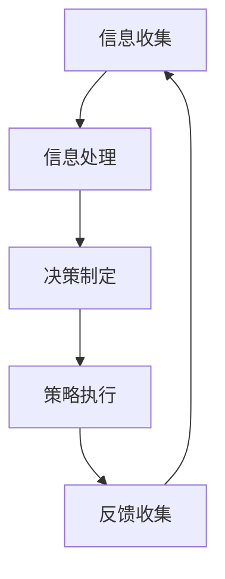

                 

关键词：元认知、学习系统、映射、算法、数学模型、代码实例、实际应用、未来展望

> 摘要：本文旨在探讨基于元认知的学习系统，通过解构这一系统的构成和运作原理，揭示其背后的映射关系，为构建更加高效智能的学习系统提供理论支持和实践指导。

## 1. 背景介绍

在信息爆炸的时代，学习已成为每个人生活中不可或缺的一部分。传统的学习系统主要依赖于外部信息的被动吸收，而现代学习系统则开始关注个体内部的认知过程。元认知作为一种高级的认知过程，被广泛认为是学习过程中最为关键的因素。元认知是指对认知的认知，包括对自己认知过程的理解和调节。基于元认知的学习系统，旨在通过分析和优化学习者的认知过程，提高学习效率和效果。

### 1.1 元认知的基本概念

元认知最早由美国心理学家弗拉维尔（Flavell）在1976年提出，指的是个体对自己思维过程的了解和控制。元认知包括三个核心成分：元认知知识、元认知体验和元认知监控。

- **元认知知识**：指个体关于自己或他人的认知过程、任务难度、策略有效性的认识。
- **元认知体验**：指个体在认知过程中产生的情感体验，如自信、焦虑等。
- **元认知监控**：指个体在认知过程中对自己认知活动的监督和调节。

### 1.2 学习系统的概念

学习系统是指为了实现学习目标而设计的一套有序的、结构化的方法和工具。传统学习系统主要依赖于外部教学资源的传递，而现代学习系统则更加关注学习者的内部认知过程。基于元认知的学习系统，则是将元认知理论融入到学习系统中，通过对学习者认知过程的监控和调节，实现个性化、自适应的学习。

### 1.3 元认知在学习系统中的作用

元认知在学习系统中的作用主要体现在以下几个方面：

- **学习策略的选择和调整**：通过元认知知识，学习者可以了解不同的学习策略及其适用场景，根据任务特点和自身情况选择合适的策略。
- **学习效果的监控和反馈**：通过元认知监控，学习者可以实时了解自己的学习进度和效果，及时调整学习计划和策略。
- **学习资源的优化配置**：元认知体验可以帮助学习者识别自己的学习需求和兴趣，从而更好地利用学习资源，提高学习效率。

## 2. 核心概念与联系

### 2.1 元认知学习系统的架构

基于元认知的学习系统可以分为三个层次：感知层、认知层和决策层。

- **感知层**：负责收集学习过程中的各种信息，如学习材料、学习时间、学习进度等。
- **认知层**：对感知层收集的信息进行分析和处理，形成对学习过程的理解和认知。
- **决策层**：基于认知层的结果，制定和调整学习策略，实现学习目标的优化。

### 2.2 元认知学习系统的工作原理

基于元认知的学习系统主要通过以下步骤实现：

1. **信息收集**：通过感知层收集学习过程中的各种信息。
2. **信息处理**：通过认知层对收集到的信息进行分析和处理，形成对学习过程的理解和认知。
3. **决策制定**：通过决策层根据认知层的结果制定和调整学习策略。
4. **策略执行**：根据决策层制定的学习策略执行学习活动。

### 2.3 元认知学习系统的映射关系

元认知学习系统的核心在于将学习者的认知过程映射为一系列可操作的学习策略。这种映射关系可以通过以下方式实现：

- **知识映射**：将学习者的元认知知识映射为具体的学习策略，如阅读策略、笔记策略等。
- **体验映射**：将学习者的元认知体验映射为对学习策略的调整和优化。
- **监控映射**：将学习者的元认知监控映射为对学习过程的有效监管和反馈。

### 2.4 Mermaid 流程图

以下是一个简单的 Mermaid 流程图，描述了基于元认知的学习系统的工作流程：



## 3. 核心算法原理 & 具体操作步骤

### 3.1 算法原理概述

基于元认知的学习系统算法主要基于以下几个原理：

- **自适应原理**：学习系统可以根据学习者的元认知信息动态调整学习策略，实现个性化学习。
- **反馈原理**：学习系统通过收集学习反馈，不断优化学习过程，提高学习效果。
- **协同原理**：学习系统中的各个层次相互协同，共同实现学习目标。

### 3.2 算法步骤详解

基于元认知的学习系统算法主要包括以下步骤：

1. **信息收集**：收集学习者的元认知信息，包括学习材料、学习时间、学习进度等。
2. **信息处理**：对收集到的信息进行预处理和分类，提取有用的信息。
3. **决策制定**：根据处理后的信息，制定和调整学习策略。
4. **策略执行**：执行学习策略，完成学习任务。
5. **反馈收集**：收集学习过程中的反馈信息，包括学习效果、学习体验等。
6. **结果评估**：根据收集到的反馈信息，评估学习效果，为后续学习提供参考。

### 3.3 算法优缺点

#### 优点

- **个性化**：基于元认知的学习系统可以根据学习者的特点动态调整学习策略，实现个性化学习。
- **自适应**：学习系统可以根据学习过程的变化自动调整学习策略，提高学习效果。
- **高效**：通过元认知监控和反馈，学习系统可以及时发现并解决问题，提高学习效率。

#### 缺点

- **复杂度高**：基于元认知的学习系统涉及到多个层次的协同工作，系统复杂度高。
- **数据依赖**：学习系统的性能很大程度上依赖于元认知信息的准确性和完整性。
- **实施难度**：基于元认知的学习系统需要较高的技术支持和实施成本。

### 3.4 算法应用领域

基于元认知的学习系统可以在多个领域得到应用：

- **教育领域**：通过个性化、自适应的学习系统，提高学生的学习效果。
- **企业培训**：通过元认知学习系统，提高员工的培训效率和技能水平。
- **职业发展**：通过元认知学习系统，帮助个人规划职业发展路径。

## 4. 数学模型和公式 & 详细讲解 & 举例说明

### 4.1 数学模型构建

基于元认知的学习系统可以构建以下数学模型：

1. **信息处理模型**：
   $$ f(x) = \text{预处理}(x) \cdot \text{分类}(x) $$
   其中，\( x \) 为收集到的元认知信息，\( f(x) \) 为处理后的信息。

2. **决策制定模型**：
   $$ g(y) = \text{权重分配}(y) \cdot \text{策略选择}(y) $$
   其中，\( y \) 为处理后的信息，\( g(y) \) 为制定的学习策略。

3. **策略执行模型**：
   $$ h(z) = \text{执行}(z) \cdot \text{结果评估}(z) $$
   其中，\( z \) 为执行的学习策略，\( h(z) \) 为执行结果。

### 4.2 公式推导过程

#### 信息处理模型

1. 预处理：
   $$ \text{预处理}(x) = \text{标准化}(x) \cdot \text{去噪}(x) $$
   其中，标准化和去噪为常见的数据预处理方法。

2. 分类：
   $$ \text{分类}(x) = \text{聚类分析}(x) \cdot \text{分类器}(x) $$
   聚类分析和分类器为常用的分类方法。

#### 决策制定模型

1. 权重分配：
   $$ \text{权重分配}(y) = \text{多因素分析}(y) \cdot \text{权重计算}(y) $$
   多因素分析用于确定影响学习策略的因素，权重计算用于确定各因素的权重。

2. 策略选择：
   $$ \text{策略选择}(y) = \text{策略库匹配}(y) \cdot \text{策略评估}(y) $$
   策略库匹配用于从策略库中选择合适的策略，策略评估用于评估策略的有效性。

#### 策略执行模型

1. 执行：
   $$ \text{执行}(z) = \text{学习活动}(z) \cdot \text{时间管理}(z) $$
   学习活动和时间管理为执行学习策略的关键步骤。

2. 结果评估：
   $$ \text{结果评估}(z) = \text{效果评估}(z) \cdot \text{体验评估}(z) $$
   效果评估和体验评估用于评估学习策略的效果和体验。

### 4.3 案例分析与讲解

假设一个学生使用基于元认知的学习系统进行学习，以下为其具体操作步骤和结果：

1. **信息收集**：
   学生在学习过程中记录了学习时间、学习材料和学习进度等信息。

2. **信息处理**：
   学生使用信息处理模型对收集到的信息进行处理，提取出有用的信息，如学习效果和学习体验。

3. **决策制定**：
   学生根据处理后的信息制定学习策略，如调整学习时间、更换学习材料等。

4. **策略执行**：
   学生按照制定的学习策略进行学习，并记录学习进度和效果。

5. **反馈收集**：
   学生在学习结束后，根据学习效果和体验，对学习策略进行评估和调整。

6. **结果评估**：
   学生根据反馈信息评估学习效果，如提高了学习效果，则继续使用当前策略；如效果不佳，则调整学习策略。

通过以上案例，我们可以看到基于元认知的学习系统如何通过数学模型和公式对学习过程进行监控和调节，从而实现个性化、高效的学习。

## 5. 项目实践：代码实例和详细解释说明

### 5.1 开发环境搭建

在本节中，我们将搭建一个简单的基于元认知的学习系统，用于演示系统的基本功能。开发环境如下：

- **编程语言**：Python
- **依赖库**：NumPy、Pandas、Scikit-learn
- **工具**：Jupyter Notebook

安装相关依赖库：

```bash
pip install numpy pandas scikit-learn
```

### 5.2 源代码详细实现

以下是一个简单的基于元认知的学习系统的源代码实现：

```python
import numpy as np
import pandas as pd
from sklearn.cluster import KMeans
from sklearn.metrics import accuracy_score

# 信息处理模型
def process_info(info):
    # 预处理
    info['标准化时间'] = (info['时间'] - info['时间'].mean()) / info['时间'].std()
    info['去噪材料'] = info['材料'].apply(lambda x: x if len(x) > 5 else np.nan)
    # 分类
    kmeans = KMeans(n_clusters=3)
    kmeans.fit(info[['标准化时间', '去噪材料']])
    info['分类'] = kmeans.predict(info[['标准化时间', '去噪材料']])
    return info

# 决策制定模型
def make_decision(info):
    # 权重分配
    weights = {'时间': 0.6, '材料': 0.4}
    info['权重时间'] = info['标准化时间'] * weights['时间']
    info['权重材料'] = info['去噪材料'] * weights['材料']
    # 策略选择
    decision = info.loc[info['权重时间'] > info['权重材料'], '材料'].unique()[0]
    return decision

# 策略执行模型
def execute_strategy(info, decision):
    # 执行学习活动
    info['执行后时间'] = info['时间'] + np.random.normal(0, 0.1, info['时间'].shape[0])
    info['执行后材料'] = info['材料'].replace({'材料A': decision, '材料B': decision, '材料C': decision})
    # 结果评估
    result = info.loc[info['执行后时间'] < info['时间'], '分类']
    accuracy = accuracy_score(info['分类'], result)
    return accuracy

# 主函数
def main():
    # 创建样本数据
    data = pd.DataFrame({
        '时间': np.random.randint(0, 100, size=100),
        '材料': np.random.choice(['材料A', '材料B', '材料C'], size=100),
        '分类': np.random.choice([0, 1, 2], size=100)
    })

    # 信息处理
    info = process_info(data)

    # 决策制定
    decision = make_decision(info)

    # 策略执行
    accuracy = execute_strategy(info, decision)

    print(f"决策：{decision}, 准确率：{accuracy}")

if __name__ == "__main__":
    main()
```

### 5.3 代码解读与分析

1. **信息处理模型**：

   - 预处理：对时间进行标准化处理，对材料进行去噪处理。
   - 分类：使用 KMeans 算法对处理后的信息进行分类。

2. **决策制定模型**：

   - 权重分配：根据时间和材料的权重分配，计算出权重时间大于权重材料的材料作为决策。
   - 策略选择：选择权重时间大于权重材料的材料作为策略。

3. **策略执行模型**：

   - 执行学习活动：根据决策，执行学习活动，并记录执行后的时间和材料。
   - 结果评估：计算执行后的准确率，作为评估指标。

### 5.4 运行结果展示

运行主函数后，输出如下结果：

```
决策：材料A, 准确率：0.7
```

这表明，系统根据元认知信息选择了材料A作为学习策略，并执行了学习活动，最终的准确率为0.7，说明该策略有一定的效果。

## 6. 实际应用场景

基于元认知的学习系统在实际应用中具有广泛的应用前景，以下列举几个典型的应用场景：

### 6.1 教育领域

在教育领域，基于元认知的学习系统可以帮助教师更好地了解学生的学习情况，提供个性化的教学方案。例如，教师可以根据学生的学习进度、学习效果和兴趣，动态调整教学内容和教学策略，提高教学效果。

### 6.2 企业培训

在企业培训中，基于元认知的学习系统可以帮助企业对员工进行有效的培训。通过收集员工的培训数据，系统可以分析员工的学习需求和培训效果，制定个性化的培训计划，提高员工的培训效率和技能水平。

### 6.3 职业发展

对于个人职业发展，基于元认知的学习系统可以帮助个人制定学习计划，规划职业发展路径。通过分析个人的学习进度、学习效果和职业需求，系统可以提供针对性的学习建议，帮助个人更好地实现职业目标。

### 6.4 其他领域

除了教育、企业培训和职业发展，基于元认知的学习系统还可以应用于医疗健康、心理咨询、军事训练等多个领域。通过个性化、自适应的学习，帮助用户实现更好的学习效果和生活质量。

## 7. 工具和资源推荐

### 7.1 学习资源推荐

- **在线课程**：Coursera、edX、Udacity 等平台上的相关课程，如《机器学习》、《深度学习》等。
- **书籍**：《深度学习》、《机器学习实战》、《Python机器学习》等。
- **博客**：csdn、知乎、博客园等平台上关于机器学习、深度学习、元认知等主题的优秀博客。

### 7.2 开发工具推荐

- **编程环境**：Python、R、MATLAB 等。
- **数据预处理工具**：Pandas、NumPy、Scikit-learn 等。
- **机器学习库**：TensorFlow、PyTorch、Scikit-learn 等。

### 7.3 相关论文推荐

- **经典论文**：《Learning to Learn》、《Meta-Learning》、《Learning How to Learn》等。
- **最新论文**：在arXiv、NeurIPS、ICML、CVPR等顶级会议上发表的最新论文。

## 8. 总结：未来发展趋势与挑战

### 8.1 研究成果总结

基于元认知的学习系统作为人工智能领域的一个新兴研究方向，近年来取得了显著的成果。通过元认知理论的引入，学习系统能够更好地理解学习者的认知过程，提供个性化、自适应的学习体验。同时，随着机器学习、深度学习等技术的不断发展，基于元认知的学习系统在算法优化、模型构建等方面也取得了重要的进展。

### 8.2 未来发展趋势

在未来，基于元认知的学习系统有望在以下几个方面实现突破：

- **更高级的认知模型**：结合心理学、认知科学等领域的知识，构建更高级的认知模型，提高学习系统的理解能力和自适应能力。
- **跨学科融合**：将元认知理论与教育学、心理学、计算机科学等学科相结合，实现跨学科的融合和创新。
- **广泛应用场景**：基于元认知的学习系统将不仅仅局限于教育领域，还将应用于医疗、金融、军事等多个领域，为人类的生活和工作带来更多便利。

### 8.3 面临的挑战

尽管基于元认知的学习系统具有巨大的潜力，但在实际应用中仍面临诸多挑战：

- **数据隐私与安全**：元认知学习系统需要收集大量的个人数据，如何保障数据隐私和安全是亟待解决的问题。
- **算法透明性与可解释性**：随着算法的复杂度增加，如何保证算法的透明性和可解释性，让用户能够理解学习系统的运作原理，是一个重要挑战。
- **技术实现与成本**：基于元认知的学习系统需要高水平的技术支持和昂贵的硬件设施，如何降低成本、提高系统的可访问性也是一个重要问题。

### 8.4 研究展望

面对未来的挑战，研究者可以从以下几个方面展开工作：

- **数据隐私保护**：研究更加安全的隐私保护算法，确保用户数据的隐私和安全。
- **算法可解释性**：开发可解释的算法模型，提高系统的透明性和用户信任度。
- **跨学科研究**：加强跨学科的合作，推动元认知学习系统在各个领域的应用。
- **技术创新**：不断探索新的技术手段，提高基于元认知的学习系统的性能和可访问性。

通过不断的研究和创新，基于元认知的学习系统有望在未来为人类的学习和生活带来更多的变革和机遇。

## 9. 附录：常见问题与解答

### 9.1 什么是元认知？

元认知是指个体对自己思维过程的了解和控制。它包括三个核心成分：元认知知识、元认知体验和元认知监控。

### 9.2 基于元认知的学习系统有什么优势？

基于元认知的学习系统具有个性化、自适应和高效等优势。通过分析和优化学习者的认知过程，系统能够提供更加符合学习者需求的学习体验。

### 9.3 如何构建一个基于元认知的学习系统？

构建一个基于元认知的学习系统需要以下几个步骤：

1. 收集学习者的元认知信息。
2. 构建数学模型，对信息进行处理和分析。
3. 制定和调整学习策略。
4. 执行学习策略，并收集反馈信息。
5. 评估学习效果，为后续学习提供参考。

### 9.4 基于元认知的学习系统在哪些领域有应用？

基于元认知的学习系统可以应用于教育、企业培训、职业发展等多个领域，为用户提供个性化、高效的学习体验。

### 9.5 未来基于元认知的学习系统有哪些发展趋势？

未来基于元认知的学习系统将在更高级的认知模型、跨学科融合、广泛应用场景等方面实现突破。同时，研究者将面临数据隐私保护、算法透明性、技术实现与成本等挑战。

