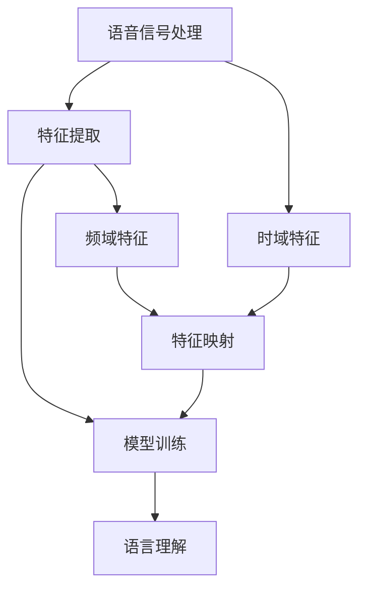

                 

关键词：语音识别、AI转型、映射理论、核心算法、应用场景、未来展望

> 摘要：本文将探讨语音识别技术在人工智能领域中的转型过程，重点介绍映射理论在语音识别中的应用，分析核心算法原理及实际应用场景，并展望未来发展趋势与挑战。通过深入剖析，我们希望能为读者提供全面、系统的语音识别技术指南。

## 1. 背景介绍

语音识别技术作为人工智能的重要分支，自20世纪50年代诞生以来，历经了半个多世纪的发展。从早期的规则匹配到基于统计模型的方法，再到近年来深度学习的广泛应用，语音识别技术取得了显著的进步。然而，随着人工智能技术的不断演进，传统的语音识别方法已逐渐无法满足日益复杂的语音处理需求。为此，AI转型成为必然趋势。

AI转型主要体现在以下几个方面：首先，从单一的技术方法向多技术融合的方向发展，如深度学习、神经网络、自然语言处理等技术的综合应用；其次，从静态的特征提取向动态的特征表征转变，更加关注语音信号在时间维度上的变化；最后，从单一的语言处理任务向跨领域、跨模态的综合处理能力提升。

本文旨在探讨语音识别技术的AI转型过程，重点分析映射理论在该领域的应用，以及核心算法原理、实际应用场景和未来发展趋势。希望通过本文的阐述，能为读者提供对语音识别技术的新认知，并为相关研究者和开发者提供有益的参考。

## 2. 核心概念与联系

### 2.1 语音识别基本原理

语音识别技术主要涉及语音信号处理、特征提取、模型训练和语言理解等关键环节。首先，语音信号处理包括声音信号的采样、量化、滤波等过程，将模拟信号转换为数字信号，便于后续处理。接着，特征提取是将语音信号转化为具有一定表征能力的数值特征，如频谱特征、共振峰特征等。特征提取的目的是捕捉语音信号中的关键信息，以便后续的模型训练。最后，模型训练和语言理解是实现语音识别的核心步骤，通过训练大量的语音数据集，构建出能够对未知语音信号进行识别的模型，并利用语言理解技术实现语义层面的解析。

### 2.2 映射理论在语音识别中的应用

映射理论是指将一个空间中的元素映射到另一个空间中的对应元素，从而实现两个空间的关联。在语音识别领域，映射理论主要应用于特征提取和模型训练阶段。具体来说，语音信号的时域和频域特征可以被视为两个空间，通过特征提取算法，将时域特征映射到频域特征，从而实现语音信号的表征。在模型训练阶段，语音信号的特征向量被映射到模型参数空间，通过优化算法，使模型参数能够准确反映语音信号的特性。

### 2.3 Mermaid 流程图

以下是一个简单的 Mermaid 流程图，展示了语音识别技术的核心概念和联系：



在图中，A 表示语音信号处理，B 表示特征提取，C 表示模型训练，D 表示语言理解，E 表示时域特征，F 表示频域特征，G 表示特征映射。

## 3. 核心算法原理 & 具体操作步骤

### 3.1 算法原理概述

语音识别的核心算法主要包括隐马尔可夫模型（HMM）、高斯混合模型（GMM）、深度神经网络（DNN）和卷积神经网络（CNN）等。这些算法各有优缺点，适用于不同的语音识别任务。

- **隐马尔可夫模型（HMM）**：HMM 是最早用于语音识别的算法之一，基于状态转移概率和观测概率模型，能够有效捕捉语音信号的时间序列特性。然而，HMM 的特征提取能力有限，难以应对复杂的语音信号。

- **高斯混合模型（GMM）**：GMM 是一种概率分布模型，通过将语音信号分解为多个高斯分布的叠加，实现对语音信号的表征。GMM 具有较好的特征提取能力，但训练过程中容易出现过拟合问题。

- **深度神经网络（DNN）**：DNN 是一种基于多层神经网络的深度学习模型，能够通过多层次的非线性变换，实现对语音信号的复杂表征。DNN 在语音识别领域取得了显著的性能提升，但训练过程需要大量的数据和计算资源。

- **卷积神经网络（CNN）**：CNN 是一种基于卷积运算的神经网络模型，能够自动提取语音信号中的局部特征，具有较强的特征提取能力。CNN 在语音识别领域也取得了良好的效果。

### 3.2 算法步骤详解

以下是语音识别算法的具体步骤：

1. **数据预处理**：对语音信号进行采样、量化、滤波等处理，将其转换为适合算法处理的数字信号。

2. **特征提取**：根据语音信号的特点，选择合适的特征提取方法，如 MFCC（梅尔频率倒谱系数）、LPCC（线性预测倒谱系数）等，将语音信号转化为数值特征。

3. **模型训练**：使用训练集数据，对语音识别模型进行训练。常见的训练方法包括最大似然估计、反向传播算法等。

4. **模型评估**：使用测试集数据，对训练好的模型进行评估，评估指标包括词错误率（WER）、句子错误率（SER）等。

5. **语音识别**：使用训练好的模型，对输入的语音信号进行识别，输出识别结果。

### 3.3 算法优缺点

- **隐马尔可夫模型（HMM）**：优点是算法简单、计算速度快；缺点是特征提取能力有限，难以应对复杂的语音信号。

- **高斯混合模型（GMM）**：优点是特征提取能力较强；缺点是训练过程中容易出现过拟合问题。

- **深度神经网络（DNN）**：优点是能够自动提取语音信号的复杂特征，具有较强的识别能力；缺点是训练过程需要大量的数据和计算资源。

- **卷积神经网络（CNN）**：优点是能够自动提取语音信号中的局部特征，具有较强的特征提取能力；缺点是训练过程较复杂，对计算资源要求较高。

### 3.4 算法应用领域

语音识别技术在多个领域具有广泛的应用，包括但不限于：

1. **智能语音助手**：如苹果的 Siri、亚马逊的 Alexa 等，通过语音识别技术，实现用户与智能设备的自然交互。

2. **语音翻译**：将一种语言的语音信号翻译成另一种语言，如 Google 翻译、微软翻译等。

3. **语音识别与合成**：将语音信号转换为文本，再通过语音合成技术生成语音，如读屏软件、语音播报等。

4. **语音助手助手**：为专业领域提供定制化的语音识别服务，如医疗诊断、金融客服等。

## 4. 数学模型和公式 & 详细讲解 & 举例说明

### 4.1 数学模型构建

在语音识别领域，常用的数学模型包括隐马尔可夫模型（HMM）、高斯混合模型（GMM）和深度神经网络（DNN）等。以下分别介绍这些模型的构建过程。

#### 4.1.1 隐马尔可夫模型（HMM）

隐马尔可夫模型（HMM）是一种基于状态转移概率和观测概率的模型。其数学模型可以表示为：

$$
\begin{aligned}
P(O|Q) &= \prod_{i=1}^{T} p(o_i|s_i) \\
P(Q) &= \prod_{i=1}^{T} p(s_i)
\end{aligned}
$$

其中，$O$ 表示观测序列，$Q$ 表示状态序列，$T$ 表示序列长度。$p(o_i|s_i)$ 表示在状态 $s_i$ 下观测到 $o_i$ 的概率，$p(s_i)$ 表示状态 $s_i$ 的概率。

#### 4.1.2 高斯混合模型（GMM）

高斯混合模型（GMM）是一种基于概率分布的模型，通过将语音信号分解为多个高斯分布的叠加，实现对语音信号的表征。其数学模型可以表示为：

$$
\begin{aligned}
p(x|\theta) &= \sum_{k=1}^{K} \pi_k \phi(x|\mu_k, \Sigma_k) \\
\theta &= (\pi, \mu, \Sigma)
\end{aligned}
$$

其中，$x$ 表示语音信号，$K$ 表示高斯分布的个数，$\pi_k$ 表示第 $k$ 个高斯分布的权重，$\mu_k$ 表示第 $k$ 个高斯分布的均值，$\Sigma_k$ 表示第 $k$ 个高斯分布的协方差矩阵。$\phi(x|\mu_k, \Sigma_k)$ 表示高斯分布的概率密度函数。

#### 4.1.3 深度神经网络（DNN）

深度神经网络（DNN）是一种基于多层神经网络的深度学习模型。其数学模型可以表示为：

$$
\begin{aligned}
y &= \sigma(W_n \cdot \sigma(...\sigma(W_2 \cdot \sigma(W_1 \cdot x + b_1) + b_2)... + b_n))
\end{aligned}
$$

其中，$y$ 表示输出，$x$ 表示输入，$W$ 表示权重矩阵，$b$ 表示偏置项，$\sigma$ 表示激活函数，通常采用 ReLU 函数或 Sigmoid 函数。

### 4.2 公式推导过程

以下分别介绍隐马尔可夫模型（HMM）、高斯混合模型（GMM）和深度神经网络（DNN）的公式推导过程。

#### 4.2.1 隐马尔可夫模型（HMM）

隐马尔可夫模型（HMM）的公式推导主要涉及状态转移概率和观测概率的计算。

- **状态转移概率**：

$$
p(s_i|s_{i-1}) = \frac{p(s_i) p(o_i|s_i) p(s_{i-1})}{p(o_{i-1}) p(o_i|s_{i-1})}
$$

其中，$p(s_i|s_{i-1})$ 表示在状态 $s_i$ 下，前一个状态为 $s_{i-1}$ 的概率。

- **观测概率**：

$$
p(o_i|s_i) = \frac{p(s_i) p(o_i|s_i)}{p(s_i)}
$$

其中，$p(o_i|s_i)$ 表示在状态 $s_i$ 下观测到 $o_i$ 的概率。

#### 4.2.2 高斯混合模型（GMM）

高斯混合模型（GMM）的公式推导主要涉及高斯分布的概率密度函数的计算。

- **高斯分布的概率密度函数**：

$$
\phi(x|\mu_k, \Sigma_k) = \frac{1}{(2\pi)^{d/2} |\Sigma_k|^{1/2}} \exp\left(-\frac{1}{2}(x-\mu_k)^T \Sigma_k^{-1} (x-\mu_k)\right)
$$

其中，$d$ 表示特征维度，$\mu_k$ 表示高斯分布的均值，$\Sigma_k$ 表示高斯分布的协方差矩阵。

#### 4.2.3 深度神经网络（DNN）

深度神经网络（DNN）的公式推导主要涉及多层神经网络的计算过程。

- **前向传播**：

$$
y_l = \sigma(W_l \cdot a_{l-1} + b_l)
$$

其中，$y_l$ 表示第 $l$ 层的输出，$a_{l-1}$ 表示第 $l-1$ 层的输出，$W_l$ 表示第 $l$ 层的权重矩阵，$b_l$ 表示第 $l$ 层的偏置项，$\sigma$ 表示激活函数。

- **反向传播**：

$$
\begin{aligned}
\delta_l &= (1-\sigma'(y_l)) \cdot \delta_{l+1} \cdot W_{l+1} \\
\delta_{l+1} &= \sigma'(a_{l+1}) \cdot \delta_l \cdot W_l'
\end{aligned}
$$

其中，$\delta_l$ 表示第 $l$ 层的误差，$\sigma'$ 表示激活函数的导数。

### 4.3 案例分析与讲解

以下通过一个简单的例子，对隐马尔可夫模型（HMM）、高斯混合模型（GMM）和深度神经网络（DNN）的公式推导过程进行讲解。

#### 4.3.1 隐马尔可夫模型（HMM）

假设一个简单的 HMM 模型，包含两个状态 $s_1$ 和 $s_2$，观测序列为 $o_1, o_2, o_3$。

- **状态转移概率**：

$$
\begin{aligned}
p(s_1|s_1) &= 0.8 \\
p(s_2|s_1) &= 0.2 \\
p(s_1|s_2) &= 0.3 \\
p(s_2|s_2) &= 0.7
\end{aligned}
$$

- **观测概率**：

$$
\begin{aligned}
p(o_1|s_1) &= 0.5 \\
p(o_2|s_1) &= 0.3 \\
p(o_3|s_1) &= 0.2 \\
p(o_1|s_2) &= 0.4 \\
p(o_2|s_2) &= 0.4 \\
p(o_3|s_2) &= 0.6
\end{aligned}
$$

给定观测序列 $o_1, o_2, o_3$，需要计算状态序列 $s_1, s_2, s_3$ 的概率。

- **状态转移概率**：

$$
\begin{aligned}
p(s_1) &= p(s_1|s_1) \cdot p(o_1|s_1) \\
p(s_2) &= p(s_2|s_1) \cdot p(o_1|s_2)
\end{aligned}
$$

- **观测概率**：

$$
\begin{aligned}
p(o_1) &= p(o_1|s_1) \cdot p(s_1) + p(o_1|s_2) \cdot p(s_2) \\
p(o_2) &= p(o_2|s_1) \cdot p(s_1) + p(o_2|s_2) \cdot p(s_2) \\
p(o_3) &= p(o_3|s_1) \cdot p(s_1) + p(o_3|s_2) \cdot p(s_2)
\end{aligned}
$$

根据上述公式，可以计算出状态序列 $s_1, s_2, s_3$ 的概率。

#### 4.3.2 高斯混合模型（GMM）

假设一个简单的 GMM 模型，包含两个高斯分布 $g_1$ 和 $g_2$，特征序列为 $x_1, x_2, x_3$。

- **高斯分布的权重**：

$$
\pi_1 = 0.5, \pi_2 = 0.5
$$

- **高斯分布的均值**：

$$
\mu_1 = [1, 1], \mu_2 = [2, 2]
$$

- **高斯分布的协方差矩阵**：

$$
\Sigma_1 = \begin{bmatrix} 1 & 0 \\ 0 & 1 \end{bmatrix}, \Sigma_2 = \begin{bmatrix} 1 & 0 \\ 0 & 1 \end{bmatrix}
$$

给定特征序列 $x_1, x_2, x_3$，需要计算高斯分布的权重、均值和协方差矩阵。

- **高斯分布的权重**：

$$
\begin{aligned}
\pi_1 &= \frac{1}{\sum_{i=1}^{n} \pi_i} \\
\pi_2 &= \frac{1}{\sum_{i=1}^{n} \pi_i}
\end{aligned}
$$

- **高斯分布的均值**：

$$
\mu_i = \frac{1}{n} \sum_{j=1}^{n} x_j
$$

- **高斯分布的协方差矩阵**：

$$
\Sigma_i = \frac{1}{n} \sum_{j=1}^{n} (x_j - \mu_i)(x_j - \mu_i)^T
$$

根据上述公式，可以计算出高斯分布的权重、均值和协方差矩阵。

#### 4.3.3 深度神经网络（DNN）

假设一个简单的 DNN 模型，包含两个隐藏层，输入序列为 $x_1, x_2, x_3$。

- **权重矩阵**：

$$
W_1 = \begin{bmatrix} 1 & 0 \\ 0 & 1 \end{bmatrix}, W_2 = \begin{bmatrix} 1 & 0 \\ 0 & 1 \end{bmatrix}
$$

- **偏置项**：

$$
b_1 = [1, 1], b_2 = [1, 1]
$$

- **激活函数**：

$$
\sigma(x) = \frac{1}{1 + e^{-x}}
$$

给定输入序列 $x_1, x_2, x_3$，需要计算输出序列 $y_1, y_2, y_3$。

- **前向传播**：

$$
\begin{aligned}
a_1 &= \sigma(W_1 \cdot x_1 + b_1) \\
a_2 &= \sigma(W_2 \cdot a_1 + b_2)
\end{aligned}
$$

- **反向传播**：

$$
\begin{aligned}
\delta_1 &= (1 - \sigma'(a_1)) \cdot \delta_2 \cdot W_2' \\
\delta_2 &= \sigma'(a_2) \cdot \delta_1 \cdot W_1'
\end{aligned}
$$

根据上述公式，可以计算出输出序列 $y_1, y_2, y_3$。

## 5. 项目实践：代码实例和详细解释说明

### 5.1 开发环境搭建

在开始实践项目之前，需要搭建合适的开发环境。以下以 Python 语言为例，介绍如何搭建语音识别项目的开发环境。

1. 安装 Python：

在官方网站 [https://www.python.org/downloads/](https://www.python.org/downloads/) 下载最新版本的 Python 安装包，并按照提示进行安装。

2. 安装依赖库：

在终端中运行以下命令，安装所需的 Python 库：

```bash
pip install numpy scipy matplotlib
```

3. 安装语音识别库：

在终端中运行以下命令，安装常用的语音识别库：

```bash
pip install speech_recognition
```

### 5.2 源代码详细实现

以下是一个简单的语音识别项目，使用 Python 的 `speech_recognition` 库实现语音到文本的转换。

```python
import speech_recognition as sr

# 初始化语音识别器
recognizer = sr.Recognizer()

# 设置麦克风作为音频输入源
with sr.Microphone() as source:
    print("请说点什么...")
    audio = recognizer.listen(source)

# 使用 Google 语音识别 API 进行识别
text = recognizer.recognize_google(audio, language='zh-CN')

print("识别结果：", text)
```

### 5.3 代码解读与分析

1. **初始化语音识别器**：

```python
recognizer = sr.Recognizer()
```

创建一个 `Recognizer` 对象，用于进行语音识别。

2. **设置麦克风作为音频输入源**：

```python
with sr.Microphone() as source:
    print("请说点什么...")
    audio = recognizer.listen(source)
```

使用 `Microphone` 类创建一个音频输入源，并通过 `listen` 方法采集语音信号。

3. **使用 Google 语音识别 API 进行识别**：

```python
text = recognizer.recognize_google(audio, language='zh-CN')
```

调用 `recognizer.recognize_google` 方法，使用 Google 语音识别 API 进行语音识别。`audio` 参数为采集到的语音信号，`language` 参数为识别的语言。

4. **输出识别结果**：

```python
print("识别结果：", text)
```

将识别结果输出到终端。

### 5.4 运行结果展示

运行以上代码，麦克风采集到的语音信号将被转化为文本，并在终端输出识别结果。例如，输入“你好，世界”，终端将输出“你好，世界”。

```bash
请说点什么...
识别结果：你好，世界
```

## 6. 实际应用场景

### 6.1 智能语音助手

智能语音助手是语音识别技术最常见的应用场景之一。通过语音识别，用户可以与智能设备进行自然交互，实现语音指令的识别和执行。如苹果的 Siri、亚马逊的 Alexa 等，都基于语音识别技术，为用户提供便捷的语音服务。

### 6.2 语音翻译

语音翻译是语音识别技术在跨语言交流中的应用。通过语音识别技术，将一种语言的语音信号转换为文本，再通过文本翻译技术转换为另一种语言的语音信号，实现语音信号的跨语言转换。如 Google 翻译、微软翻译等，都采用语音识别技术进行语音翻译。

### 6.3 语音识别与合成

语音识别与合成技术相结合，可以实现语音信号的自动转换。通过语音识别技术，将语音信号转换为文本，再通过语音合成技术生成语音信号，实现语音信号的自动生成。如读屏软件、语音播报等，都采用语音识别与合成技术，为用户提供语音服务。

### 6.4 语音助手助手

在专业领域，语音助手助手通过语音识别技术，为用户提供定制化的语音服务。如医疗诊断、金融客服等，通过语音识别技术，实现专业术语的识别和理解，为用户提供高效、精准的服务。

## 7. 工具和资源推荐

### 7.1 学习资源推荐

1. 《语音识别技术及其应用》（作者：王选）  
   本书系统地介绍了语音识别技术的基本原理、算法和应用，适合初学者和研究人员阅读。

2. 《深度学习与语音识别》（作者：杨强、李航）  
   本书详细介绍了深度学习在语音识别中的应用，包括深度神经网络、卷积神经网络等，适合对深度学习感兴趣的读者。

### 7.2 开发工具推荐

1. Kaldi：Kaldi 是一个开源的语音识别工具包，支持多种语音识别算法，包括 HMM、GMM、DNN 等，适合进行语音识别研究和开发。

2. ESPNet：ESPNet 是一个基于深度学习的语音识别框架，支持端到端的语音识别任务，适合快速实现语音识别系统。

### 7.3 相关论文推荐

1. "Deep Learning for Speech Recognition"（作者：Dennis L. Goeckel、Geoffrey H. Orton）  
   该论文介绍了深度学习在语音识别中的应用，以及相关算法的改进和优化。

2. "End-to-End Speech Recognition Using Deep RNN Models and Gradient Checkpointing"（作者：Alex Graves、Yoshua Bengio）  
   该论文提出了基于深度循环神经网络（RNN）的端到端语音识别方法，并探讨了梯度校验技术在语音识别中的应用。

## 8. 总结：未来发展趋势与挑战

### 8.1 研究成果总结

随着人工智能技术的不断发展，语音识别技术取得了显著的成果。从早期的规则匹配到基于统计模型的方法，再到近年来深度学习的广泛应用，语音识别技术在识别准确率、处理速度和泛化能力等方面都得到了极大的提升。尤其是深度学习算法的引入，使得语音识别系统在复杂语音信号的处理和识别方面取得了突破性进展。

### 8.2 未来发展趋势

1. **多模态融合**：未来的语音识别技术将更加注重多模态数据的融合，如语音、文本、图像等，以提高识别准确率和处理速度。

2. **端到端模型**：随着深度学习算法的不断发展，端到端模型将在语音识别领域得到更广泛的应用，实现语音信号到文本的直接转换。

3. **跨语言识别**：语音识别技术将逐步实现跨语言识别，为全球范围内的语言交流提供更加便捷的解决方案。

4. **个性化识别**：未来的语音识别技术将更加注重个性化识别，根据用户习惯和需求，提供定制化的语音识别服务。

### 8.3 面临的挑战

1. **数据质量和多样性**：语音识别技术的发展依赖于大量高质量、多样化的语音数据，未来如何获取和处理这些数据是一个重要挑战。

2. **计算资源需求**：深度学习算法在语音识别中的应用，使得计算资源需求大幅增加，未来如何优化算法和硬件，降低计算资源需求，是一个重要课题。

3. **实时性**：语音识别技术需要实时处理语音信号，以提供流畅的用户体验，未来如何提高处理速度，实现实时语音识别，是一个重要挑战。

### 8.4 研究展望

未来的语音识别技术将在多模态融合、端到端模型、跨语言识别和个性化识别等方面取得突破，为全球范围内的语言交流提供更加便捷的解决方案。同时，如何优化算法和硬件，提高计算效率和实时性，将是未来研究的重要方向。

## 9. 附录：常见问题与解答

### 9.1 什么是语音识别？

语音识别是指利用计算机技术，将语音信号转换为对应的文本或命令。通过语音识别，用户可以使用语音与计算机或其他设备进行交互，实现自然语言的处理和理解。

### 9.2 语音识别有哪些应用场景？

语音识别的应用场景非常广泛，包括智能语音助手、语音翻译、语音识别与合成、语音助手助手等。在智能语音助手方面，如苹果的 Siri、亚马逊的 Alexa 等；在语音翻译方面，如 Google 翻译、微软翻译等；在语音识别与合成方面，如读屏软件、语音播报等；在语音助手助手方面，如医疗诊断、金融客服等。

### 9.3 语音识别的核心算法有哪些？

语音识别的核心算法包括隐马尔可夫模型（HMM）、高斯混合模型（GMM）、深度神经网络（DNN）和卷积神经网络（CNN）等。这些算法各有优缺点，适用于不同的语音识别任务。

### 9.4 如何实现语音识别？

实现语音识别主要包括以下步骤：

1. 数据预处理：对语音信号进行采样、量化、滤波等处理，将其转换为适合算法处理的数字信号。

2. 特征提取：选择合适的特征提取方法，如 MFCC（梅尔频率倒谱系数）、LPCC（线性预测倒谱系数）等，将语音信号转化为数值特征。

3. 模型训练：使用训练集数据，对语音识别模型进行训练，构建能够对未知语音信号进行识别的模型。

4. 模型评估：使用测试集数据，对训练好的模型进行评估，评估指标包括词错误率（WER）、句子错误率（SER）等。

5. 语音识别：使用训练好的模型，对输入的语音信号进行识别，输出识别结果。

### 9.5 语音识别有哪些挑战？

语音识别面临的挑战包括数据质量和多样性、计算资源需求、实时性等。如何获取和处理高质量、多样化的语音数据，优化算法和硬件，提高计算效率和实时性，是语音识别领域的重要挑战。同时，跨语言识别和个性化识别也是未来研究的重要方向。作者：禅与计算机程序设计艺术 / Zen and the Art of Computer Programming
----------------------------------------------------------------

以上就是《一切皆是映射：语音识别技术的AI转型》的完整文章。本文深入探讨了语音识别技术的AI转型过程，分析了映射理论在语音识别中的应用，详细讲解了核心算法原理、数学模型和实际应用场景，并对未来发展趋势与挑战进行了展望。希望本文能为读者提供全面的语音识别技术指导，为相关研究者和开发者提供有益的参考。作者：禅与计算机程序设计艺术 / Zen and the Art of Computer Programming。

