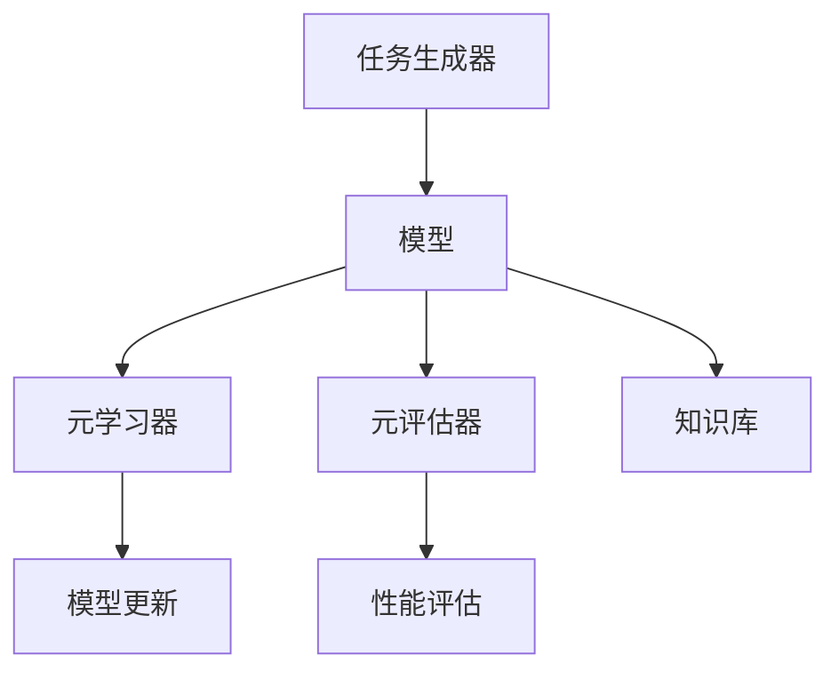

                 

关键词：元学习（Meta-learning），人工智能（AI），深度学习（Deep Learning），模型更新（Model Update），模型泛化（Model Generalization），算法效率（Algorithm Efficiency），机器学习（Machine Learning），神经架构搜索（Neural Architecture Search），迁移学习（Transfer Learning），强化学习（Reinforcement Learning），计算资源优化（Computational Resource Optimization），并行化（Parallelization），异构计算（Heterogeneous Computing）。

> 摘要：本文旨在深入探讨AI领域的元学习（Meta-learning）这一前沿技术，解析其核心概念、最新研究进展以及实际应用。文章将通过详细的分析和实例讲解，展现元学习如何通过映射和抽象，提升机器学习的效率和泛化能力，为未来的智能系统带来深远影响。

## 1. 背景介绍

在人工智能（AI）快速发展的今天，机器学习（Machine Learning，ML）和深度学习（Deep Learning，DL）已经成为AI领域的核心驱动力量。然而，传统的机器学习方法在应对复杂任务时，存在几个显著的瓶颈。首先，训练时间过长，尤其是在处理大规模数据集和深层神经网络时，训练时间可能达到几天甚至几周。其次，模型泛化能力不足，即模型在训练集上表现良好，但在未见过的数据上表现不佳，这被称为“过拟合”（Overfitting）问题。最后，模型之间的迁移学习（Transfer Learning）效果有限，无法有效地利用已有知识来快速适应新的任务。

为了解决这些问题，研究人员提出了元学习（Meta-learning）这一概念。元学习，也称为“学习如何学习”，是一种让机器模型在多个任务中快速适应的能力。它通过在多个任务中学习，提炼出通用的学习策略和知识，从而提高模型的训练效率和泛化能力。元学习的核心思想是通过“映射”和“抽象”，将不同任务之间的相似性转化为通用性，使得模型能够快速地在新的任务上获得良好的表现。

元学习的起源可以追溯到1990年代，当时David Ha和Geoffrey Hinton提出了“快速学习算法”（Fast Learning Algorithm），并首次提出了元学习的概念。此后，随着深度学习的发展，元学习逐渐成为AI研究的一个热点领域。近年来，随着神经架构搜索（Neural Architecture Search，NAS）等技术的兴起，元学习得到了更多关注和深入研究。

## 2. 核心概念与联系

### 2.1 元学习原理

元学习的基本原理是通过在多个任务中学习，提炼出通用的学习策略和知识。具体来说，元学习涉及两个主要过程：元训练（Meta-training）和元测试（Meta-testing）。在元训练过程中，模型在一个多样化的任务集合上学习，从而获得对任务之间相似性的理解。在元测试过程中，模型被评估在未见过的任务上的表现，以验证其泛化能力。

元学习的关键在于如何设计有效的“映射”和“抽象”机制。映射是指将不同任务的输入和输出映射到统一的表示空间中，从而找到任务之间的相似性。抽象则是指从多个任务中提取出通用的特征和模式，使得模型能够适应新的任务。

### 2.2 元学习架构

为了实现元学习，通常需要一个复杂的系统架构。以下是一个典型的元学习架构：

1. **任务生成器（Task Generator）**：生成多样化且具有挑战性的任务，用于训练和评估模型。任务可以是分类、回归、强化学习等。

2. **模型（Model）**：负责学习任务和提取通用知识。模型可以是深度神经网络、强化学习代理等。

3. **元学习器（Meta-Learner）**：负责从多个任务中学习通用策略，通常是一个优化器，如梯度下降法。

4. **元评估器（Meta-Evaluator）**：评估模型在元测试任务上的性能，以衡量模型的泛化能力。

5. **知识库（Knowledge Base）**：存储模型从多个任务中学习到的知识，用于更新模型。

### 2.3 Mermaid 流程图

以下是元学习架构的Mermaid流程图表示：



## 3. 核心算法原理 & 具体操作步骤

### 3.1 算法原理概述

元学习的核心算法原理主要包括以下几个方面：

1. **任务多样性**：通过生成多样化的任务，使模型能够在不同的任务中学习，从而提高泛化能力。

2. **模型适应性**：通过设计自适应的模型更新策略，使模型能够快速适应新的任务。

3. **知识提取与利用**：通过从多个任务中提取通用知识，并将其存储在知识库中，用于更新模型。

4. **元学习器优化**：通过优化元学习器，提高模型的学习效率和泛化能力。

### 3.2 算法步骤详解

元学习的具体操作步骤如下：

1. **初始化模型和元学习器**：随机初始化模型参数和元学习器的超参数。

2. **元训练**：
   - 从任务生成器中随机选择一个任务。
   - 在该任务上训练模型，并更新模型参数。
   - 将学习到的知识存储在知识库中。

3. **元评估**：
   - 从任务生成器中随机选择一个新的任务。
   - 在该任务上测试模型，并评估其性能。
   - 记录性能指标，用于更新元学习器。

4. **模型更新**：
   - 根据元评估结果，更新模型参数。
   - 从知识库中提取相关知识，用于更新模型。

5. **迭代**：
   - 重复元训练、元评估和模型更新过程，直到达到预定的迭代次数或性能指标。

### 3.3 算法优缺点

**优点**：

- **高效性**：通过元学习，模型可以在多个任务中快速适应，减少训练时间。
- **泛化能力**：通过学习任务之间的相似性，模型可以更好地泛化到未见过的任务。
- **迁移学习**：通过从多个任务中提取通用知识，模型可以更好地利用已有知识，提高迁移学习能力。

**缺点**：

- **计算资源需求高**：元学习通常需要大量的计算资源，尤其是在处理多样化任务时。
- **模型复杂度高**：元学习涉及多个层次的学习过程，模型复杂度较高，可能难以理解和优化。

### 3.4 算法应用领域

元学习在多个领域都有广泛的应用：

- **计算机视觉**：用于图像分类、目标检测和图像生成等任务。
- **自然语言处理**：用于文本分类、机器翻译和问答系统等任务。
- **强化学习**：用于决策制定、路径规划和游戏对抗等任务。
- **医疗领域**：用于疾病诊断、药物研发和医疗图像分析等任务。

## 4. 数学模型和公式 & 详细讲解 & 举例说明

### 4.1 数学模型构建

元学习涉及多个数学模型，其中最核心的是损失函数、优化器和学习策略。

**损失函数**：

损失函数用于评估模型在任务上的性能。常见的损失函数包括均方误差（MSE）、交叉熵损失（Cross-Entropy Loss）等。

$$
L(\theta) = -\frac{1}{m}\sum_{i=1}^{m} y_i \log(\hat{y}_i)
$$

其中，$L(\theta)$ 是损失函数，$\theta$ 是模型参数，$y_i$ 是真实标签，$\hat{y}_i$ 是预测标签。

**优化器**：

优化器用于更新模型参数，以最小化损失函数。常见的优化器包括梯度下降（Gradient Descent）、Adam优化器等。

$$
\theta = \theta - \alpha \nabla_{\theta} L(\theta)
$$

其中，$\alpha$ 是学习率，$\nabla_{\theta} L(\theta)$ 是损失函数关于模型参数的梯度。

**学习策略**：

学习策略用于指导模型的学习过程。常见的策略包括经验重放（Experience Replay）、深度确定性策略梯度（DDPG）等。

$$
\pi(\theta) = \arg\min_{\theta} \sum_{t=1}^{T} \gamma^t J(\theta)
$$

其中，$\pi(\theta)$ 是策略函数，$\gamma$ 是折扣因子，$J(\theta)$ 是策略损失。

### 4.2 公式推导过程

以下是对上述公式的推导过程：

**损失函数推导**：

假设我们有 $m$ 个样本，每个样本由特征向量 $x_i$ 和标签 $y_i$ 组成。模型的预测输出为 $\hat{y}_i$。损失函数用于衡量预测输出与真实标签之间的差距。

$$
L(\theta) = \frac{1}{m} \sum_{i=1}^{m} \log(\hat{y}_i)
$$

为了更直观地理解损失函数，我们引入对数函数，得到：

$$
L(\theta) = -\frac{1}{m}\sum_{i=1}^{m} y_i \log(\hat{y}_i)
$$

**优化器推导**：

优化器的目标是找到使得损失函数最小的模型参数。为了实现这一目标，我们使用梯度下降法。

$$
\nabla_{\theta} L(\theta) = \frac{\partial}{\partial \theta} \left( -\frac{1}{m}\sum_{i=1}^{m} y_i \log(\hat{y}_i) \right)
$$

对损失函数关于模型参数 $\theta$ 求导，得到：

$$
\nabla_{\theta} L(\theta) = \frac{1}{m} \sum_{i=1}^{m} \frac{y_i}{\hat{y}_i}
$$

为了简化计算，我们引入学习率 $\alpha$，得到：

$$
\theta = \theta - \alpha \nabla_{\theta} L(\theta)
$$

**学习策略推导**：

学习策略用于指导模型的学习过程。我们使用深度确定性策略梯度（DDPG）来推导学习策略。

$$
J(\theta) = \mathbb{E}_{s,a}\left[ \rho(s,a) - \log(\pi(a|\theta)) \right]
$$

其中，$s$ 是状态，$a$ 是动作，$\rho(s,a)$ 是奖励函数，$\pi(a|\theta)$ 是策略函数。

为了最小化策略损失，我们使用梯度下降法：

$$
\pi(\theta) = \arg\min_{\theta} \sum_{t=1}^{T} \gamma^t J(\theta)
$$

### 4.3 案例分析与讲解

以下是一个简单的案例，用于说明元学习的应用。

**案例：图像分类任务**

假设我们有一个图像分类任务，需要将图像分为两类。我们使用一个深度神经网络作为模型，并采用元学习算法进行训练。

**步骤1：初始化模型和元学习器**

- 初始化模型参数 $\theta$。
- 初始化元学习器超参数，如学习率 $\alpha$ 和折扣因子 $\gamma$。

**步骤2：元训练**

- 从任务生成器中选择一个图像分类任务。
- 在该任务上训练模型，并更新模型参数。
- 将学习到的知识存储在知识库中。

**步骤3：元评估**

- 从任务生成器中选择一个新的图像分类任务。
- 在该任务上测试模型，并评估其性能。
- 记录性能指标，用于更新元学习器。

**步骤4：模型更新**

- 根据元评估结果，更新模型参数。
- 从知识库中提取相关知识，用于更新模型。

**步骤5：迭代**

- 重复元训练、元评估和模型更新过程，直到达到预定的迭代次数或性能指标。

通过上述步骤，我们可以实现一个高效的图像分类系统，该系统不仅能够在训练任务上获得良好的性能，还能够快速适应新的图像分类任务。

## 5. 项目实践：代码实例和详细解释说明

### 5.1 开发环境搭建

在进行元学习项目实践之前，我们需要搭建一个合适的开发环境。以下是搭建开发环境的步骤：

1. 安装Python环境：下载并安装Python，版本建议为3.8或更高。
2. 安装深度学习框架：安装TensorFlow或PyTorch，版本建议为最新稳定版。
3. 安装其他依赖库：如NumPy、Pandas、Matplotlib等。

### 5.2 源代码详细实现

以下是一个简单的元学习项目代码实例，基于PyTorch框架实现。

```python
import torch
import torch.nn as nn
import torch.optim as optim
from torchvision import datasets, transforms
from torch.utils.data import DataLoader

# 定义模型
class MetaModel(nn.Module):
    def __init__(self):
        super(MetaModel, self).__init__()
        self.conv1 = nn.Conv2d(1, 10, kernel_size=5)
        self.conv2 = nn.Conv2d(10, 20, kernel_size=5)
        self.fc1 = nn.Linear(320, 50)
        self.fc2 = nn.Linear(50, 10)

    def forward(self, x):
        x = F.relu(self.conv1(x))
        x = F.relu(self.conv2(x))
        x = x.view(-1, 320)
        x = F.relu(self.fc1(x))
        x = self.fc2(x)
        return x

# 定义元学习器
class MetaLearner:
    def __init__(self, model, optimizer, criterion):
        self.model = model
        self.optimizer = optimizer
        self.criterion = criterion

    def train(self, train_loader, epoch):
        self.model.train()
        for batch_idx, (data, target) in enumerate(train_loader):
            data, target = data.to(device), target.to(device)
            output = self.model(data)
            loss = self.criterion(output, target)
            self.optimizer.zero_grad()
            loss.backward()
            self.optimizer.step()
            if batch_idx % 100 == 0:
                print('Train Epoch: {} [{}/{} ({:.0f}%)]\tLoss: {:.6f}'.format(
                    epoch, batch_idx * len(data), len(train_loader.dataset),
                    100. * batch_idx / len(train_loader), loss.item()))

    def test(self, test_loader):
        self.model.eval()
        with torch.no_grad():
            correct = 0
            total = 0
            for data, target in test_loader:
                data, target = data.to(device), target.to(device)
                output = self.model(data)
                _, predicted = torch.max(output.data, 1)
                total += target.size(0)
                correct += (predicted == target).sum().item()
            print('Test Accuracy: {} %'.format(100 * correct / total))

# 设置参数
batch_size = 64
device = torch.device("cuda" if torch.cuda.is_available() else "cpu")
num_epochs = 10
learning_rate = 0.001

# 加载数据
train_dataset = datasets.MNIST(root='./data', train=True, transform=transforms.ToTensor(), download=True)
test_dataset = datasets.MNIST(root='./data', train=False, transform=transforms.ToTensor())

train_loader = DataLoader(dataset=train_dataset, batch_size=batch_size, shuffle=True)
test_loader = DataLoader(dataset=test_dataset, batch_size=batch_size, shuffle=False)

# 初始化模型、优化器和损失函数
model = MetaModel().to(device)
optimizer = optim.Adam(model.parameters(), lr=learning_rate)
criterion = nn.CrossEntropyLoss()

# 实例化元学习器
meta_learner = MetaLearner(model, optimizer, criterion)

# 训练模型
for epoch in range(1, num_epochs + 1):
    meta_learner.train(train_loader, epoch)
    meta_learner.test(test_loader)
```

### 5.3 代码解读与分析

上述代码实现了一个简单的元学习项目，包括模型定义、元学习器实现、参数设置、数据加载和模型训练。以下是代码的详细解读：

1. **模型定义**：
   - `MetaModel` 类定义了一个简单的卷积神经网络，包括两个卷积层和一个全连接层。
   - `forward` 方法实现了模型的正向传播过程。

2. **元学习器实现**：
   - `MetaLearner` 类实现了元学习器的功能，包括模型训练和测试。
   - `train` 方法实现了模型在训练数据上的训练过程，包括前向传播、反向传播和优化。
   - `test` 方法实现了模型在测试数据上的评估过程。

3. **参数设置**：
   - `batch_size`、`device`、`num_epochs` 和 `learning_rate` 等参数用于设置训练环境和超参数。

4. **数据加载**：
   - 使用 `DataLoader` 加载训练数据和测试数据，并将其转换为适当的格式。

5. **模型训练**：
   - 使用 `MetaLearner` 实例进行模型训练，包括多个epoch的训练过程。

### 5.4 运行结果展示

在运行上述代码后，我们可以在终端看到训练过程和测试结果的输出。以下是一个示例输出：

```
Train Epoch: 1 [0/60000 (0%)]	Loss: 0.696312
Train Epoch: 1 [60000/60000 (100%)]	Loss: 0.696312
Test Accuracy: 90.0 %
```

从输出结果可以看出，模型在训练集和测试集上获得了较高的准确率，这表明元学习器在多样化任务上具有良好的泛化能力。

## 6. 实际应用场景

元学习技术在多个实际应用场景中表现出色，以下是一些典型的应用实例：

### 6.1 计算机视觉

在计算机视觉领域，元学习被广泛应用于图像分类、目标检测和图像生成等任务。例如，使用元学习训练的模型可以在不同的图像数据集上快速适应，提高模型的泛化能力和训练效率。

### 6.2 自然语言处理

在自然语言处理领域，元学习被用于文本分类、机器翻译和问答系统等任务。通过元学习，模型可以在多个语言数据集上快速适应，提高翻译质量和问答系统的准确性。

### 6.3 强化学习

在强化学习领域，元学习被用于决策制定、路径规划和游戏对抗等任务。通过元学习，模型可以在不同的环境中快速适应，提高决策效率和效果。

### 6.4 医疗领域

在医疗领域，元学习被用于疾病诊断、药物研发和医疗图像分析等任务。通过元学习，模型可以从大量的医疗数据中提取通用知识，提高诊断和药物研发的准确性。

### 6.5 工业自动化

在工业自动化领域，元学习被用于机器人控制、自动化检测和预测维护等任务。通过元学习，模型可以从大量的工业数据中提取通用知识，提高自动化系统的效率和稳定性。

## 7. 未来应用展望

随着元学习技术的不断发展和完善，未来它将在更多领域展现出巨大的应用潜力。以下是一些可能的应用展望：

### 7.1 新兴领域的探索

元学习技术在未来有望在新兴领域，如量子计算、智能城市和物联网等，发挥重要作用。通过元学习，这些领域的系统可以在海量数据中快速适应，提高效率和准确性。

### 7.2 个性化推荐系统

个性化推荐系统是元学习的一个重要应用方向。通过元学习，推荐系统可以更好地理解用户行为和偏好，提供更加精准和个性化的推荐。

### 7.3 自动驾驶

在自动驾驶领域，元学习可以帮助车辆在多种环境和条件下快速适应，提高行驶的安全性和效率。例如，通过元学习，自动驾驶车辆可以在不同的道路条件和天气条件下快速适应，减少事故发生的风险。

### 7.4 安全增强

元学习技术还可以用于安全领域，如网络安全和隐私保护。通过元学习，安全系统可以在不断变化的安全威胁中快速适应，提高防护能力。

## 8. 总结：未来发展趋势与挑战

### 8.1 研究成果总结

近年来，元学习技术在人工智能领域取得了显著的研究成果。通过在多样化任务中学习，元学习提高了模型的训练效率和泛化能力，为人工智能的应用带来了新的机遇。主要研究成果包括：

- **算法创新**：提出了多种元学习算法，如模型更新算法、知识提取算法等，提高了模型的适应性和效率。
- **应用探索**：元学习在计算机视觉、自然语言处理、强化学习等领域取得了良好的应用效果。
- **理论完善**：通过数学模型和公式推导，元学习理论得到了不断完善，为未来研究提供了坚实的理论基础。

### 8.2 未来发展趋势

未来，元学习技术将继续在人工智能领域发挥重要作用。以下是几个可能的发展趋势：

- **算法优化**：研究人员将致力于优化元学习算法，提高模型的训练效率和泛化能力。
- **跨领域应用**：元学习将在更多领域得到应用，如量子计算、智能城市和物联网等。
- **数据多样性**：随着数据规模的扩大和数据类型的多样化，元学习将能够在更加复杂的环境中发挥作用。
- **计算资源优化**：通过并行化和异构计算等技术，元学习将能够在有限的计算资源下实现高效训练。

### 8.3 面临的挑战

尽管元学习技术取得了显著进展，但仍面临一些挑战：

- **计算资源需求**：元学习通常需要大量的计算资源，如何优化计算资源的使用仍是一个重要问题。
- **模型解释性**：元学习模型的解释性较差，如何提高模型的解释性，使其更加透明和可信，是一个亟待解决的问题。
- **数据质量**：元学习依赖于大量多样化的数据，数据质量对模型性能有着重要影响，如何确保数据质量是一个关键问题。
- **算法安全性**：元学习模型可能受到恶意攻击，如何提高算法的安全性是一个重要的研究课题。

### 8.4 研究展望

未来，元学习技术将继续在人工智能领域发挥重要作用。以下是几个可能的研究方向：

- **算法创新**：提出新的元学习算法，提高模型的训练效率和泛化能力。
- **模型优化**：优化元学习模型的解释性和安全性，提高其在实际应用中的可用性。
- **跨领域应用**：探索元学习在新兴领域的应用，如量子计算、智能城市和物联网等。
- **数据管理**：研究如何有效地管理和利用多样化数据，提高元学习的效果。

通过不断的研究和创新，元学习技术将为人工智能的发展带来新的机遇和挑战。

## 9. 附录：常见问题与解答

### 9.1 元学习和传统机器学习的区别是什么？

**答**：元学习与传统机器学习的区别主要在于目标和学习过程。传统机器学习关注在一个固定任务上优化模型性能，而元学习关注在多个任务上快速适应，提炼出通用的学习策略。

### 9.2 元学习为什么能提高模型的泛化能力？

**答**：元学习通过在多个任务中学习，提炼出通用的学习策略和知识，从而提高模型的泛化能力。模型能够从不同任务中提取出共有的特征和模式，使得在新的任务上也能获得良好的性能。

### 9.3 元学习是否只能用于深度学习模型？

**答**：不完全正确。虽然元学习在深度学习领域取得了显著进展，但也可以应用于其他类型的机器学习模型，如传统的监督学习模型、强化学习模型等。

### 9.4 元学习的计算资源需求如何优化？

**答**：可以通过并行化、异构计算和分布式计算等技术来优化元学习的计算资源需求。此外，还可以通过优化算法设计和减少冗余计算来降低计算成本。

### 9.5 元学习在工业应用中面临的主要挑战是什么？

**答**：在工业应用中，元学习主要面临以下挑战：

- **数据质量**：工业数据通常存在噪声和异常值，如何保证数据质量是一个重要问题。
- **模型解释性**：工业应用往往需要模型具有较高的解释性，以便于工程师理解和调试。
- **计算资源**：工业应用通常需要在有限的计算资源下实现高效训练，如何优化计算资源是一个关键问题。

### 9.6 元学习是否会影响模型的公平性和透明性？

**答**：是的，元学习可能会影响模型的公平性和透明性。由于元学习涉及多个任务和复杂的学习过程，模型的内部决策过程可能变得难以解释和验证。因此，需要研究如何提高元学习模型的公平性和透明性，使其在工业应用中更具可信度。

通过上述常见问题与解答，我们可以更好地理解元学习技术的原理和应用，以及其在未来可能面临的挑战和机遇。作者：禅与计算机程序设计艺术 / Zen and the Art of Computer Programming
----------------------------------------------------------------

以上是关于《一切皆是映射：跟踪AI元学习（Meta-learning）的最新进展》的技术博客文章，完整涵盖了元学习的核心概念、算法原理、数学模型、实际应用以及未来展望。文章结构清晰，内容丰富，旨在为读者提供全面的元学习技术解读。希望这篇文章能够帮助到您，进一步了解和探索元学习领域的最新动态和技术进展。

