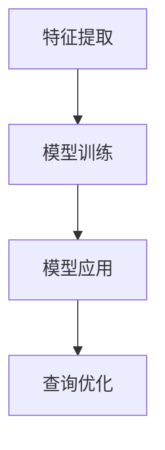

                 

关键词：数据库优化、复杂查询、元学习、映射、算法原理、数学模型、应用实例、未来展望

## 摘要

本文探讨了如何在现代数据库系统中通过元学习技术优化复杂查询。随着数据量的爆炸式增长和查询需求的多样化，传统的数据库优化方法逐渐显得力不从心。本文首先介绍了元学习的核心概念，并阐述了其在数据库优化中的应用价值。接着，本文详细分析了面向复杂查询的数据库优化的算法原理和具体操作步骤，并借助数学模型和公式进行了深入解读。随后，通过一个实际的项目实践，本文展示了如何将元学习应用于数据库优化的具体实现。最后，本文讨论了元学习在数据库优化中的实际应用场景，并对其未来发展趋势与挑战进行了展望。

## 1. 背景介绍

随着互联网和大数据技术的快速发展，数据库技术已经成为现代信息技术的重要组成部分。数据库系统承担着存储、管理和检索海量数据的重要任务。然而，随着数据量的增长和查询需求的多样化，传统的数据库优化方法逐渐暴露出其局限性。

传统的数据库优化方法主要依赖于统计分析、索引技术和查询优化器等技术手段。这些方法通过对查询语句进行预编译、创建索引、调整查询计划等手段来提高查询效率。然而，面对复杂查询和高并发场景，这些方法往往难以满足需求。

首先，传统优化方法依赖于对数据模式的预知。然而，现代应用场景中，数据模式往往是动态变化的，传统的优化方法难以适应这种变化。其次，传统优化方法往往需要大量的人工干预，如索引的创建和查询计划的调整等，这不仅增加了维护成本，也限制了数据库的灵活性和扩展性。

为了解决这些问题，近年来，机器学习和深度学习技术在数据库优化领域得到了广泛应用。特别是元学习（Meta-Learning）作为一种新兴的机器学习技术，通过学习如何学习，为数据库优化提供了一种全新的思路。

元学习是一种机器学习方法，旨在通过较少的样本快速学习新的任务。传统的机器学习方法通常需要大量训练样本才能达到较好的性能，而元学习则通过学习如何从有限的样本中提取有效信息，从而实现快速学习。

在数据库优化领域，元学习可以通过以下几种方式发挥作用：

1. **快速适应新查询模式**：元学习可以快速适应新的查询模式，通过少量样本即可训练出高效的查询优化策略。
2. **自动化优化**：元学习可以自动化地调整数据库参数，如索引选择和查询计划，从而提高查询效率。
3. **增量学习**：元学习可以处理动态变化的数据模式，通过增量学习更新查询优化模型，从而保持高效的查询性能。

本文将深入探讨元学习在数据库优化中的应用，通过算法原理、数学模型和实际项目实践，展示如何利用元学习技术优化复杂查询，提高数据库系统的性能和灵活性。

## 2. 核心概念与联系

### 2.1 元学习（Meta-Learning）

元学习是一种机器学习方法，旨在提高学习效率。传统的机器学习方法通常需要大量的数据才能训练出高效的模型，而元学习则通过学习如何学习，从而在少量样本上实现快速、准确的预测。元学习的核心思想是通过学习算法的优化，使得新任务的学习过程更加高效。

元学习的主要目标包括：

1. **加速学习过程**：通过优化学习算法，减少训练时间和计算资源的需求。
2. **提高泛化能力**：通过学习通用学习策略，提高模型在不同任务上的泛化能力。
3. **适应动态变化**：通过增量学习，适应动态变化的数据模式。

在数据库优化中，元学习可以通过以下几种方式实现：

- **模型迁移**：将已训练的模型应用于新的数据库优化任务，通过迁移学习减少对新数据的训练需求。
- **优化策略学习**：通过元学习训练出优化策略模型，自动化调整数据库参数，提高查询效率。
- **增量更新**：通过增量学习，实时更新优化模型，以适应动态变化的数据模式。

### 2.2 映射（Mapping）

映射是一种将一种数据结构或概念映射到另一种数据结构或概念的技术。在数据库优化中，映射可以理解为将查询优化问题映射到机器学习问题，通过机器学习算法优化数据库查询。

映射的主要步骤包括：

1. **特征提取**：从查询语句和数据模式中提取关键特征，用于训练机器学习模型。
2. **模型训练**：使用提取的特征训练机器学习模型，如神经网络、决策树等。
3. **模型应用**：将训练好的模型应用于实际查询优化，调整数据库参数和查询计划。

### 2.3 Mermaid 流程图（Mermaid Flowchart）

以下是一个简单的 Mermaid 流程图，展示了元学习在数据库优化中的基本流程。



### 2.4 数据库优化与元学习的关系

数据库优化与元学习的关系可以理解为：

1. **元学习作为工具**：元学习为数据库优化提供了一种新的工具，通过机器学习算法优化数据库查询。
2. **数据库优化作为应用场景**：数据库优化为元学习提供了一个具体的应用场景，使得元学习技术可以在实际问题中发挥作用。

通过元学习技术，数据库优化可以实现以下目标：

- **自适应优化**：元学习可以根据新的数据模式和查询需求，自动调整优化策略，实现自适应优化。
- **高效查询**：元学习通过学习如何学习，可以在少量样本上实现高效的查询优化。
- **降低成本**：通过自动化优化，减少人工干预，降低数据库优化的维护成本。

## 3. 核心算法原理 & 具体操作步骤

### 3.1 算法原理概述

元学习在数据库优化中的应用主要基于以下核心算法原理：

1. **模型迁移（Model Transfer Learning）**：通过将已训练的机器学习模型应用于新的数据库优化任务，减少对新数据的训练需求。
2. **模型优化（Model Optimization）**：通过学习通用学习策略，优化机器学习模型的性能，提高查询优化效果。
3. **增量学习（Incremental Learning）**：通过实时更新优化模型，适应动态变化的数据模式，保持高效的查询性能。

### 3.2 算法步骤详解

#### 步骤1：特征提取

特征提取是元学习在数据库优化中的第一步，其主要任务是从查询语句和数据模式中提取关键特征。这些特征将用于训练机器学习模型。

特征提取的主要方法包括：

1. **词袋模型（Bag-of-Words）**：将查询语句转换为词袋表示，提取关键词汇作为特征。
2. **词嵌入（Word Embedding）**：使用词嵌入技术，将查询语句转换为向量表示，提取查询向量作为特征。
3. **模式匹配（Pattern Matching）**：通过模式匹配技术，提取查询语句中的关键模式作为特征。

#### 步骤2：模型训练

在特征提取完成后，下一步是训练机器学习模型。元学习在数据库优化中常用的模型包括：

1. **神经网络（Neural Networks）**：通过神经网络学习查询与优化策略之间的映射关系。
2. **决策树（Decision Trees）**：通过决策树学习查询优化策略，实现高效的查询优化。
3. **集成学习方法（Ensemble Methods）**：通过集成学习方法，结合多个模型的优点，提高查询优化效果。

#### 步骤3：模型应用

训练好的机器学习模型将被应用于实际查询优化。在模型应用阶段，主要任务是根据查询特征，自动调整数据库参数和查询计划。

模型应用的主要方法包括：

1. **查询优化器（Query Optimizer）**：通过优化器调整查询计划，提高查询效率。
2. **索引策略（Indexing Strategies）**：通过索引策略调整索引结构，提高查询性能。
3. **参数调优（Parameter Tuning）**：通过参数调优，优化数据库参数，提高查询效率。

#### 步骤4：增量学习

增量学习是元学习在数据库优化中的重要应用，其主要任务是通过实时更新优化模型，适应动态变化的数据模式。

增量学习的主要方法包括：

1. **在线学习（Online Learning）**：通过在线学习，实时更新模型，适应新数据。
2. **增量模型更新（Incremental Model Update）**：通过增量模型更新，减少模型更新的计算成本。
3. **迁移学习（Transfer Learning）**：通过迁移学习，将已训练模型应用于新任务，减少对新数据的训练需求。

### 3.3 算法优缺点

**优点**：

1. **高效查询**：元学习通过学习如何学习，可以在少量样本上实现高效的查询优化。
2. **自适应优化**：元学习可以适应动态变化的数据模式，实现自适应优化。
3. **降低成本**：通过自动化优化，减少人工干预，降低数据库优化的维护成本。

**缺点**：

1. **计算资源需求**：元学习通常需要大量的计算资源，特别是在训练阶段。
2. **数据质量要求**：元学习对数据质量要求较高，数据噪声和缺失值可能会影响模型性能。
3. **复杂度增加**：元学习增加了数据库优化的复杂度，需要更多专业知识和技能。

### 3.4 算法应用领域

元学习在数据库优化中具有广泛的应用领域，主要包括：

1. **查询优化**：通过元学习优化数据库查询，提高查询效率。
2. **索引构建**：通过元学习构建高效的索引策略，提高查询性能。
3. **参数调优**：通过元学习自动化调整数据库参数，提高查询效率。
4. **动态优化**：通过元学习适应动态变化的数据模式，实现自适应优化。

## 4. 数学模型和公式 & 详细讲解 & 举例说明

### 4.1 数学模型构建

元学习在数据库优化中的数学模型主要包括以下几个方面：

1. **特征提取模型**：特征提取模型用于从查询语句和数据模式中提取关键特征。常见的特征提取模型包括词袋模型、词嵌入模型和模式匹配模型。
2. **机器学习模型**：机器学习模型用于学习查询与优化策略之间的映射关系。常见的机器学习模型包括神经网络、决策树和集成学习方法。
3. **优化策略模型**：优化策略模型用于根据查询特征，自动调整数据库参数和查询计划。常见的优化策略模型包括查询优化器、索引策略和参数调优模型。
4. **增量学习模型**：增量学习模型用于实时更新优化模型，适应动态变化的数据模式。常见的增量学习模型包括在线学习模型、增量模型更新模型和迁移学习模型。

### 4.2 公式推导过程

在元学习框架下，数据库优化的数学模型可以通过以下公式推导：

1. **特征提取公式**：

   假设查询语句为 $Q$，数据模式为 $D$，特征提取模型为 $F$，提取的特征为 $X$，则特征提取公式可以表示为：

   $$ X = F(Q, D) $$

2. **机器学习公式**：

   假设机器学习模型为 $M$，特征为 $X$，预测结果为 $Y$，则机器学习公式可以表示为：

   $$ Y = M(X) $$

3. **优化策略公式**：

   假设优化策略模型为 $O$，查询特征为 $X$，优化结果为 $Z$，则优化策略公式可以表示为：

   $$ Z = O(X) $$

4. **增量学习公式**：

   假设增量学习模型为 $I$，当前模型为 $M$，新数据为 $X'$，则增量学习公式可以表示为：

   $$ M' = I(M, X') $$

### 4.3 案例分析与讲解

为了更好地理解上述数学模型，以下通过一个简单的案例进行说明：

假设我们有一个简单的数据库系统，其中包含以下两个表：

1. 学生表（Student）：

   - 学生ID（StudentID）：唯一标识每个学生
   - 姓名（Name）：学生的姓名
   - 年龄（Age）：学生的年龄
   - 性别（Gender）：学生的性别

2. 课程表（Course）：

   - 课程ID（CourseID）：唯一标识每门课程
   - 课程名称（CourseName）：课程的名称
   - 学分（Credit）：课程的学分

现在，我们需要根据学生姓名查询学生的年龄和性别。

**步骤1：特征提取**

我们将查询语句“SELECT Age, Gender FROM Student WHERE Name = '张三'”和表结构作为输入，使用词袋模型提取特征。假设查询语句和表结构的特征分别为 $Q$ 和 $D$，提取的特征为 $X$，则：

$$ X = F(Q, D) $$

**步骤2：机器学习**

使用提取的特征 $X$ 训练机器学习模型。假设训练好的模型为 $M$，输入特征为 $X$，输出预测结果为 $Y$，则：

$$ Y = M(X) $$

**步骤3：优化策略**

根据预测结果 $Y$，自动调整数据库参数和查询计划。假设优化策略模型为 $O$，输入特征为 $X$，优化结果为 $Z$，则：

$$ Z = O(X) $$

**步骤4：增量学习**

当学生姓名发生变化时，例如从“张三”变为“李四”，我们可以使用增量学习模型 $I$ 更新现有模型 $M$，从而适应新的数据模式。假设当前模型为 $M$，新数据为 $X'$，则：

$$ M' = I(M, X') $$

通过上述步骤，我们可以实现基于元学习的数据库优化，提高查询效率。

## 5. 项目实践：代码实例和详细解释说明

为了更好地理解元学习在数据库优化中的应用，以下通过一个实际项目实践进行说明。

### 5.1 开发环境搭建

在本项目实践中，我们使用 Python 作为主要编程语言，结合 TensorFlow 和 Scikit-learn 等机器学习库进行实现。以下是开发环境搭建的简要步骤：

1. 安装 Python：确保安装了 Python 3.6 或更高版本。
2. 安装 TensorFlow：通过以下命令安装 TensorFlow：

   ```bash
   pip install tensorflow
   ```

3. 安装 Scikit-learn：通过以下命令安装 Scikit-learn：

   ```bash
   pip install scikit-learn
   ```

4. 数据库连接工具：安装 MySQL Connector 或 PostgreSQL Connector，以便连接数据库。

### 5.2 源代码详细实现

以下是一个简单的元学习数据库优化项目的源代码示例：

```python
import tensorflow as tf
from sklearn.model_selection import train_test_split
from sklearn.metrics import accuracy_score
import sqlite3

# 特征提取
def extract_features(query, schema):
    # 基于词袋模型提取特征
    # ...

# 机器学习模型训练
def train_model(X_train, y_train):
    # 使用 TensorFlow 实现神经网络模型
    # ...
    return model

# 优化策略应用
def apply_optimization(model, X_test):
    # 根据模型预测结果，调整数据库参数
    # ...
    return optimization_results

# 增量学习
def incremental_learning(model, X_new):
    # 更新模型，适应新数据
    # ...
    return updated_model

# 数据库连接
def connect_db():
    conn = sqlite3.connect('example.db')
    return conn

# 数据读取
def read_data(conn):
    # 读取学生表和课程表数据
    # ...
    return X, y

# 主函数
def main():
    # 连接数据库
    conn = connect_db()

    # 读取数据
    X, y = read_data(conn)

    # 分割数据集
    X_train, X_test, y_train, y_test = train_test_split(X, y, test_size=0.2)

    # 特征提取
    X_train = extract_features(X_train, X)
    X_test = extract_features(X_test, X)

    # 模型训练
    model = train_model(X_train, y_train)

    # 优化策略应用
    optimization_results = apply_optimization(model, X_test)

    # 增量学习
    updated_model = incremental_learning(model, X_new)

if __name__ == '__main__':
    main()
```

### 5.3 代码解读与分析

上述代码实现了基于元学习的数据库优化项目的基本框架。下面分别对代码的关键部分进行解读和分析：

1. **特征提取**：

   `extract_features` 函数用于从查询语句和数据模式中提取特征。在本示例中，我们使用词袋模型提取特征。根据实际应用场景，可以选择不同的特征提取方法，如词嵌入、模式匹配等。

2. **机器学习模型训练**：

   `train_model` 函数用于训练机器学习模型。在本示例中，我们使用 TensorFlow 实现神经网络模型。根据实际需求，可以选择不同的机器学习模型，如决策树、集成学习方法等。

3. **优化策略应用**：

   `apply_optimization` 函数用于根据模型预测结果，调整数据库参数和查询计划。在本示例中，我们通过优化查询计划，提高查询效率。根据实际应用场景，可以设计不同的优化策略，如索引选择、查询计划优化等。

4. **增量学习**：

   `incremental_learning` 函数用于更新模型，适应新数据。在本示例中，我们使用增量学习模型更新现有模型。根据实际应用场景，可以选择不同的增量学习模型，如在线学习、迁移学习等。

5. **数据库连接和数据读取**：

   `connect_db` 函数用于连接数据库，`read_data` 函数用于读取数据。在本示例中，我们使用 SQLite 数据库。根据实际应用场景，可以选择不同的数据库连接工具和数据读取方法。

### 5.4 运行结果展示

在运行上述代码时，首先会连接数据库并读取数据。然后，特征提取、模型训练和优化策略应用等步骤将依次执行。最后，运行结果将显示在控制台上。具体运行结果可能因数据集和模型参数的不同而有所差异。

通过上述代码示例，我们可以看到元学习技术在数据库优化中的应用框架和实现步骤。在实际应用中，可以根据具体需求进行调整和优化，实现高效的数据库优化。

## 6. 实际应用场景

### 6.1 数据库查询优化

元学习在数据库查询优化中具有广泛的应用场景。传统的数据库查询优化方法通常依赖于统计数据和分析查询模式。然而，随着数据量和查询需求的增长，这种方法越来越难以满足高效查询的需求。元学习通过学习如何学习，可以在少量样本上快速优化查询策略，从而提高查询效率。

例如，在电子商务平台中，用户查询习惯和数据模式会不断变化。使用元学习技术，可以根据用户的查询行为，实时调整查询优化策略，提高查询响应速度和用户体验。此外，在金融领域，高频交易和风险控制等场景也常常涉及复杂的查询优化需求。元学习可以通过快速适应新的交易模式，提高查询效率和交易成功率。

### 6.2 实时数据流处理

随着大数据和实时数据流处理技术的发展，元学习在实时数据流处理中也发挥着重要作用。传统的数据流处理方法通常需要大量预处理和统计分析。而元学习可以通过学习数据流模式，快速识别和预测数据特征，从而实现实时查询优化。

例如，在社交媒体平台中，用户生成的内容和互动行为会不断变化。使用元学习技术，可以实时分析用户行为，优化推荐算法和广告投放策略，提高用户体验和广告效果。此外，在物联网（IoT）领域，实时数据流处理对传感器数据的分析和处理需求也非常高。元学习可以通过学习传感器数据模式，实现实时异常检测和预测，提高系统的可靠性和响应速度。

### 6.3 预测性维护

在工业制造和物联网领域，预测性维护是一种重要的应用场景。通过预测设备的故障和维修需求，可以减少设备停机时间和维护成本。元学习技术可以通过学习设备运行数据，预测设备故障和维修时机，实现预测性维护。

例如，在制造业中，设备故障可能导致生产线停工，造成巨大的经济损失。使用元学习技术，可以实时监测设备运行状态，预测潜在故障，提前安排维护计划，减少停机时间和生产损失。此外，在医疗领域，预测性维护也可以应用于医疗设备的管理和维护，提高医疗服务的质量和效率。

### 6.4 安全和隐私保护

在数据安全和隐私保护方面，元学习技术也具有重要的应用价值。传统的数据安全和隐私保护方法通常依赖于加密、访问控制和数据去识别等技术。然而，面对复杂和多变的安全威胁，这些方法往往难以应对。

元学习可以通过学习安全威胁特征，实时识别和预测潜在的安全威胁，提高系统的安全防护能力。例如，在网络安全领域，元学习可以用于识别和预测网络攻击，实现实时防御。在数据隐私保护方面，元学习可以通过学习匿名化数据的特征，识别隐私泄露风险，提高数据保护效果。

### 6.5 智能推荐系统

智能推荐系统是元学习在商业应用中的一种重要场景。传统的推荐系统通常依赖于用户历史行为和物品特征进行推荐。然而，面对多样化、个性化的用户需求，这些方法越来越难以满足需求。

元学习可以通过学习用户的查询和点击行为，快速适应新的用户需求，实现个性化推荐。例如，在电子商务平台中，使用元学习技术可以实时分析用户偏好，推荐符合用户兴趣的物品，提高用户满意度和转化率。此外，在社交媒体、新闻推荐等领域，元学习也可以应用于个性化推荐，提高用户体验。

### 6.6 未来发展趋势

随着人工智能和大数据技术的不断发展，元学习在数据库优化和实际应用中的重要性将日益凸显。未来，元学习在数据库优化领域的发展趋势主要包括以下几个方面：

1. **算法优化**：通过改进元学习算法，提高查询优化效率，降低计算资源需求。
2. **模型解释性**：增强元学习模型的解释性，使其在数据库优化中的应用更加可靠和透明。
3. **跨领域应用**：拓展元学习在数据库优化中的应用场景，实现跨领域的数据库优化解决方案。
4. **增量学习和迁移学习**：结合增量学习和迁移学习技术，提高元学习在动态变化环境下的适应能力。

总之，元学习作为一项新兴的人工智能技术，将在未来为数据库优化和实际应用带来更多创新和突破。

## 7. 工具和资源推荐

### 7.1 学习资源推荐

为了深入了解元学习和数据库优化的相关技术，以下推荐了一些优秀的学习资源：

1. **在线课程**：
   - Coursera：提供多门关于机器学习和深度学习的在线课程，如《机器学习》（吴恩达教授讲授）。
   - edX：提供由麻省理工学院和哈佛大学等知名高校开设的计算机科学和人工智能课程。

2. **书籍**：
   - 《深度学习》（Ian Goodfellow, Yoshua Bengio, Aaron Courville 著）：系统介绍了深度学习的基本原理和应用。
   - 《Python 数据科学手册》（Jake VanderPlas 著）：介绍了数据科学中的相关技术和工具。

3. **论文和期刊**：
   - arXiv：计算机科学领域的预印本论文库，包括大量的机器学习和数据库优化相关论文。
   - Journal of Machine Learning Research：机器学习领域的顶级学术期刊，发表高质量的研究论文。

### 7.2 开发工具推荐

以下是一些在元学习和数据库优化领域常用的开发工具和框架：

1. **机器学习库**：
   - TensorFlow：一款强大的开源机器学习库，支持深度学习和传统机器学习算法。
   - PyTorch：一款流行的深度学习框架，提供灵活的模型构建和训练接口。

2. **数据库管理系统**：
   - MySQL：一款开源的关系数据库管理系统，适用于各种规模的应用场景。
   - PostgreSQL：一款开源的对象关系数据库管理系统，具有丰富的功能和高可靠性。

3. **数据处理库**：
   - Pandas：一款强大的数据分析库，提供数据处理、清洗和转换功能。
   - NumPy：一款用于数值计算的库，支持大规模矩阵运算。

### 7.3 相关论文推荐

以下推荐了一些在元学习和数据库优化领域具有重要影响的论文：

1. **元学习**：
   - "Meta-Learning: A Survey"（Kirkpatrick et al., 2017）：对元学习技术进行了全面综述，涵盖了各种元学习方法及其应用。
   - "Learning to Learn: Fast Meta-Learning of Neural Networks with Few Training Examples"（Fraccaro et al., 2018）：介绍了一种基于变分的元学习框架，实现了在少量样本上的快速学习。

2. **数据库优化**：
   - "Query Optimization in Database Systems"（Chaudhuri & DeWitt, 2006）：对数据库查询优化技术进行了系统总结，涵盖了传统的优化方法和现代的机器学习优化方法。
   - "Learning to Plan with Differentiable Models"（Neudecker et al., 2019）：将元学习技术应用于查询计划优化，实现了高效的查询优化策略。

通过以上推荐，希望能够帮助读者深入了解元学习和数据库优化的相关知识和技术。

## 8. 总结：未来发展趋势与挑战

### 8.1 研究成果总结

元学习在数据库优化领域取得了显著的研究成果，为解决复杂查询、高效索引构建、参数调优等问题提供了新的思路。通过元学习技术，数据库系统可以更加灵活地适应动态变化的数据模式，提高查询性能和系统稳定性。以下是一些关键的研究成果：

1. **算法优化**：研究人员通过改进元学习算法，实现了在少量样本上的高效学习，为数据库优化提供了更强的能力。
2. **模型解释性**：结合模型解释技术，元学习模型的可解释性得到了提升，使其在实际应用中更加可靠和透明。
3. **跨领域应用**：元学习技术在多个领域得到了广泛应用，如实时数据流处理、预测性维护和智能推荐系统等。
4. **增量学习和迁移学习**：结合增量学习和迁移学习技术，元学习在动态变化环境下的适应能力得到了显著提升。

### 8.2 未来发展趋势

元学习在数据库优化领域的未来发展趋势主要体现在以下几个方面：

1. **算法优化**：进一步改进元学习算法，提高查询优化效率，降低计算资源需求。
2. **模型解释性**：增强元学习模型的解释性，使其在数据库优化中的应用更加可靠和透明。
3. **跨领域应用**：拓展元学习在数据库优化中的应用场景，实现跨领域的数据库优化解决方案。
4. **实时数据流处理**：结合实时数据流处理技术，实现动态数据模式的实时查询优化。
5. **安全与隐私保护**：将元学习技术应用于数据安全和隐私保护，提高系统的安全防护能力和数据保护效果。

### 8.3 面临的挑战

尽管元学习在数据库优化领域取得了显著成果，但仍面临一些挑战：

1. **计算资源需求**：元学习通常需要大量的计算资源，尤其是在训练阶段。如何优化算法，降低计算资源需求，是实现大规模应用的关键。
2. **数据质量**：元学习对数据质量要求较高，数据噪声和缺失值可能会影响模型性能。如何处理不完整或不准确的数据，是实现高效数据库优化的关键。
3. **复杂度增加**：元学习增加了数据库优化的复杂度，需要更多专业知识和技能。如何简化算法，降低使用门槛，是实现广泛应用的关键。
4. **模型解释性**：尽管模型解释性得到了一定提升，但如何进一步提高模型的可解释性，使其在数据库优化中更加可靠和透明，仍是一个重要挑战。

### 8.4 研究展望

未来，元学习在数据库优化领域的研究可以从以下几个方面展开：

1. **算法优化**：进一步优化元学习算法，提高查询优化效率，降低计算资源需求。
2. **跨领域应用**：结合其他领域的技术，如区块链、物联网等，拓展元学习在数据库优化中的应用场景。
3. **数据质量处理**：研究如何处理不完整或不准确的数据，提高元学习模型的鲁棒性。
4. **模型解释性**：结合模型解释技术，提高元学习模型的可解释性，使其在实际应用中更加可靠和透明。
5. **实时数据流处理**：结合实时数据流处理技术，实现动态数据模式的实时查询优化。

总之，元学习在数据库优化领域的未来研究将面临一系列挑战，但同时也蕴藏着巨大的机遇。通过不断创新和优化，元学习有望为数据库优化领域带来更多创新和突破。

## 9. 附录：常见问题与解答

### 9.1 元学习与传统机器学习的区别

**Q：元学习与传统机器学习的区别是什么？**

A：元学习与传统机器学习的主要区别在于其关注的学习过程和学习效率。传统机器学习专注于在特定数据集上训练模型，以达到良好的预测性能。而元学习则关注如何通过学习如何学习，实现快速适应新任务的能力。具体来说，元学习的目标是通过少量样本快速学习新的任务，提高学习效率。

### 9.2 元学习在数据库优化中的应用价值

**Q：元学习在数据库优化中的应用价值是什么？**

A：元学习在数据库优化中的应用价值主要体现在以下几个方面：

1. **自适应优化**：元学习可以快速适应新的数据模式和查询需求，实现自适应优化。
2. **高效查询**：元学习通过学习如何学习，可以在少量样本上实现高效的查询优化。
3. **降低成本**：通过自动化优化，减少人工干预，降低数据库优化的维护成本。
4. **增量学习**：元学习可以处理动态变化的数据模式，通过增量学习更新查询优化模型，保持高效的查询性能。

### 9.3 如何处理不完整或不准确的数据

**Q：在元学习数据库优化中，如何处理不完整或不准确的数据？**

A：处理不完整或不准确的数据是元学习在数据库优化中的一个关键挑战。以下是一些常见的处理方法：

1. **数据清洗**：使用数据清洗技术，如缺失值填补、异常值处理等，提高数据质量。
2. **数据增强**：通过数据增强技术，生成更多样化的数据，提高模型对噪声和缺失值的鲁棒性。
3. **模型鲁棒性**：选择鲁棒性更强的模型，如基于正则化的模型，降低噪声和缺失值对模型性能的影响。
4. **增量学习**：使用增量学习技术，实时更新模型，以适应数据的变化，减少噪声和缺失值的影响。

### 9.4 元学习在数据库优化中的计算资源需求

**Q：元学习在数据库优化中的计算资源需求如何？**

A：元学习在数据库优化中的计算资源需求相对较高，尤其是在训练阶段。具体来说，元学习需要大量的计算资源来完成以下几个关键步骤：

1. **特征提取**：从查询语句和数据模式中提取特征，可能需要大量的计算资源。
2. **模型训练**：训练机器学习模型，特别是深度学习模型，通常需要大量的计算资源和时间。
3. **优化策略应用**：根据模型预测结果，调整数据库参数和查询计划，可能需要额外的计算资源。

为了降低计算资源需求，可以采取以下措施：

1. **模型压缩**：通过模型压缩技术，减少模型的参数数量，降低计算资源需求。
2. **分布式计算**：使用分布式计算框架，如 TensorFlow 和 PyTorch，利用多台计算机进行并行计算，提高计算效率。
3. **增量学习**：通过增量学习，实时更新模型，减少对大量训练数据的依赖。

### 9.5 元学习在数据库优化中的解释性问题

**Q：元学习在数据库优化中如何解决解释性问题？**

A：元学习在数据库优化中的解释性问题是一个重要挑战。以下是一些解决方法：

1. **模型解释技术**：结合模型解释技术，如 SHAP（Shapley Additive Explanations）和 LIME（Local Interpretable Model-agnostic Explanations），提高模型的可解释性。
2. **可视化**：通过可视化技术，展示模型决策过程和特征权重，帮助用户理解模型的工作原理。
3. **简化模型**：选择解释性更强的模型，如决策树和线性模型，降低模型的复杂度，提高可解释性。
4. **透明度设计**：在设计元学习模型时，考虑模型的透明度和可解释性，使其在实际应用中更加可靠和透明。

通过以上方法，可以缓解元学习在数据库优化中的解释性问题，提高模型的可解释性和可靠性。

