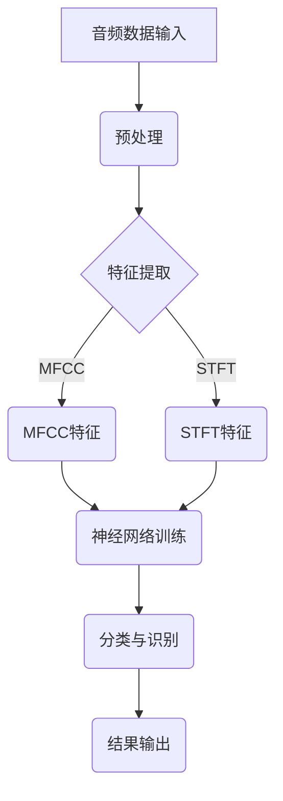

                 

关键词：音频数据处理、深度学习、声音识别、映射理论、数学模型、项目实践

> 摘要：本文深入探讨了音频数据处理与深度学习技术的结合，介绍了声音识别的核心算法原理及其在实际应用场景中的操作步骤。通过详细的数学模型和公式推导，以及对项目实践的代码实例分析，本文为读者提供了一个全面的技术指南。同时，对声音识别的未来应用和面临的挑战进行了展望。

## 1. 背景介绍

在当今信息爆炸的时代，音频数据作为一种重要的信息载体，正越来越受到各行各业的关注。无论是语音识别、自动翻译，还是智能助理、音频内容分析，音频数据处理技术都发挥着至关重要的作用。然而，传统的音频数据处理方法往往依赖于大量的手工特征提取，这不仅耗时费力，而且在处理复杂音频信号时效果欠佳。

近年来，深度学习技术的崛起为音频数据处理带来了新的契机。通过引入深度神经网络，深度学习能够自动学习音频信号中的复杂特征，从而实现高效的声音识别。此外，映射理论作为深度学习的基础，为算法的设计提供了坚实的数学框架。

本文将围绕音频数据处理与深度学习技术展开，详细介绍声音识别的核心算法原理、数学模型、项目实践，以及声音识别在实际应用场景中的操作步骤和未来展望。

## 2. 核心概念与联系

### 2.1 深度学习与映射理论

深度学习是一种基于多层神经网络的学习方法，其核心思想是通过逐层抽象和特征提取，从原始数据中学习到高层次的抽象表示。而映射理论作为深度学习的基础，描述了输入空间与输出空间之间的映射关系。

在深度学习中，映射理论主要通过以下三个层次来实现：

1. **线性映射**：将输入数据映射到高维空间，通过线性变换增强数据的特征表达能力。
2. **非线性映射**：通过引入非线性激活函数，实现从高维空间到更复杂特征空间的映射。
3. **层与层之间的映射**：多层神经网络通过前一层输出作为输入，实现从输入层到输出层的高层次抽象。

### 2.2 声音识别的基本概念

声音识别是指通过计算机处理和分析声音信号，将其转化为文本或命令的过程。声音识别的关键在于对音频信号进行特征提取和分类。

在声音识别中，常用的特征提取方法包括：

1. **梅尔频率倒谱系数（MFCC）**：将音频信号转化为频谱特征，通过梅尔频率滤波器组进行能量计算。
2. **短时傅里叶变换（STFT）**：将音频信号转化为频域特征，通过短时傅里叶变换进行时频分析。
3. **隐马尔可夫模型（HMM）**：通过状态转移概率和观测概率描述声音模式。

### 2.3 Mermaid 流程图

以下是一个简化的音频数据处理与声音识别的Mermaid流程图：



## 3. 核心算法原理 & 具体操作步骤

### 3.1 算法原理概述

声音识别的核心算法通常是基于深度神经网络，特别是卷积神经网络（CNN）和循环神经网络（RNN）。CNN通过卷积操作提取图像或音频中的局部特征，而RNN则通过递归操作处理序列数据。

在声音识别中，深度神经网络通常包括以下几个步骤：

1. **特征提取**：通过CNN提取音频信号的时域和频域特征。
2. **序列建模**：使用RNN对特征序列进行建模，捕捉时间依赖关系。
3. **分类与识别**：通过全连接层对序列进行分类，实现声音识别。

### 3.2 算法步骤详解

#### 3.2.1 特征提取

1. **卷积层**：通过卷积操作提取音频信号的局部特征。
    $$C = f(W \cdot X + b)$$
    其中，$C$表示卷积结果，$W$表示卷积核，$X$表示输入特征，$b$表示偏置。

2. **池化层**：通过池化操作降低特征维度。
    $$P = g(C)$$
    其中，$P$表示池化结果，$g$表示池化函数。

3. **激活函数**：引入ReLU激活函数，增强网络的非线性能力。
    $$h(x) = \max(0, x)$$

#### 3.2.2 序列建模

1. **RNN层**：通过递归操作对特征序列进行建模。
    $$h_t = \sigma(W \cdot [h_{t-1}, x_t] + b)$$
    其中，$h_t$表示第$t$时刻的隐藏状态，$W$表示权重矩阵，$\sigma$表示激活函数。

2. **长短时记忆（LSTM）层**：用于处理长序列数据，防止梯度消失问题。
    $$i_t = \sigma(W_i \cdot [h_{t-1}, x_t] + b_i)$$
    $$f_t = \sigma(W_f \cdot [h_{t-1}, x_t] + b_f)$$
    $$o_t = \sigma(W_o \cdot [h_{t-1}, x_t] + b_o)$$
    $$h_t = o_t \odot \sigma(W_h \cdot [f_t \odot h_{t-1}, x_t] + b_h)$$
    其中，$i_t$表示输入门，$f_t$表示遗忘门，$o_t$表示输出门，$h_t$表示隐藏状态。

#### 3.2.3 分类与识别

1. **全连接层**：通过全连接层对序列进行分类。
    $$y = W \cdot h + b$$
    其中，$y$表示输出结果，$W$表示权重矩阵，$h$表示隐藏状态。

2. **损失函数**：使用交叉熵损失函数优化模型。
    $$L = -\sum_{i} y_i \log(y_i)$$
    其中，$y_i$表示第$i$个类别的输出概率。

### 3.3 算法优缺点

#### 优点

1. **自动特征提取**：深度学习能够自动学习音频信号的复杂特征，无需手动设计特征。
2. **高效处理能力**：通过并行计算和卷积操作，深度学习能够高效处理大规模音频数据。
3. **适应性强**：深度学习能够在各种音频场景下表现出良好的泛化能力。

#### 缺点

1. **计算资源消耗**：深度学习算法需要大量计算资源和存储空间。
2. **训练时间较长**：深度学习算法的训练时间较长，尤其是针对大规模数据集。
3. **对数据质量要求高**：深度学习算法对数据质量要求较高，数据噪声会影响模型的性能。

### 3.4 算法应用领域

1. **语音识别**：将语音信号转化为文本，应用于智能助理、语音翻译等。
2. **音频分类**：对音频信号进行分类，应用于音频内容分析、音乐推荐等。
3. **声源定位**：通过音频信号定位声源，应用于智能安防、虚拟现实等。

## 4. 数学模型和公式 & 详细讲解 & 举例说明

### 4.1 数学模型构建

在声音识别中，常用的数学模型包括卷积神经网络（CNN）和循环神经网络（RNN），以及它们的高级版本如长短时记忆网络（LSTM）。

#### 4.1.1 卷积神经网络（CNN）

CNN的数学模型主要包括以下几个部分：

1. **卷积层**：
    $$C = f(W \cdot X + b)$$
    其中，$C$表示卷积结果，$W$表示卷积核，$X$表示输入特征，$b$表示偏置。

2. **池化层**：
    $$P = g(C)$$
    其中，$P$表示池化结果，$g$表示池化函数。

3. **激活函数**：
    $$h(x) = \max(0, x)$$

#### 4.1.2 循环神经网络（RNN）

RNN的数学模型主要包括以下几个部分：

1. **隐藏状态更新**：
    $$h_t = \sigma(W \cdot [h_{t-1}, x_t] + b)$$
    其中，$h_t$表示第$t$时刻的隐藏状态，$W$表示权重矩阵，$\sigma$表示激活函数。

2. **输出层**：
    $$y_t = W \cdot h_t + b$$
    其中，$y_t$表示第$t$时刻的输出结果，$W$表示权重矩阵，$b$表示偏置。

#### 4.1.3 长短时记忆网络（LSTM）

LSTM的数学模型主要包括以下几个部分：

1. **输入门**：
    $$i_t = \sigma(W_i \cdot [h_{t-1}, x_t] + b_i)$$
    其中，$i_t$表示输入门，$W_i$表示权重矩阵，$b_i$表示偏置。

2. **遗忘门**：
    $$f_t = \sigma(W_f \cdot [h_{t-1}, x_t] + b_f)$$
    其中，$f_t$表示遗忘门，$W_f$表示权重矩阵，$b_f$表示偏置。

3. **输出门**：
    $$o_t = \sigma(W_o \cdot [h_{t-1}, x_t] + b_o)$$
    其中，$o_t$表示输出门，$W_o$表示权重矩阵，$b_o$表示偏置。

4. **隐藏状态**：
    $$h_t = o_t \odot \sigma(W_h \cdot [f_t \odot h_{t-1}, x_t] + b_h)$$
    其中，$h_t$表示隐藏状态，$W_h$表示权重矩阵，$b_h$表示偏置。

### 4.2 公式推导过程

以LSTM为例，以下是LSTM的公式推导过程：

1. **输入门**：
    $$i_t = \sigma(W_i \cdot [h_{t-1}, x_t] + b_i)$$
    其中，$W_i$表示输入门的权重矩阵，$b_i$表示输入门的偏置。

2. **遗忘门**：
    $$f_t = \sigma(W_f \cdot [h_{t-1}, x_t] + b_f)$$
    其中，$W_f$表示遗忘门的权重矩阵，$b_f$表示遗忘门的偏置。

3. **当前单元状态**：
    $$g_t = \tanh(W_g \cdot [h_{t-1}, x_t] + b_g)$$
    其中，$W_g$表示生成门的权重矩阵，$b_g$表示生成门的偏置。

4. **输出门**：
    $$o_t = \sigma(W_o \cdot [h_{t-1}, x_t] + b_o)$$
    其中，$W_o$表示输出门的权重矩阵，$b_o$表示输出门的偏置。

5. **遗忘门状态**：
    $$f_t \odot h_{t-1} = (1 - f_t) \cdot h_{t-1}$$
    其中，$f_t \odot h_{t-1}$表示遗忘门状态。

6. **当前单元状态**：
    $$C_t = f_t \odot C_{t-1} + i_t \cdot g_t$$
    其中，$C_t$表示当前单元状态。

7. **隐藏状态**：
    $$h_t = o_t \odot \tanh(C_t)$$
    其中，$h_t$表示隐藏状态。

### 4.3 案例分析与讲解

以下是一个简单的LSTM模型在音频数据处理中的应用案例：

1. **数据准备**：假设我们有一个音频信号序列$X = [x_1, x_2, ..., x_T]$，其中$T$表示序列长度。

2. **特征提取**：通过卷积神经网络提取音频信号的频域特征$H = [h_1, h_2, ..., h_T]$。

3. **序列建模**：使用LSTM模型对特征序列进行建模，得到隐藏状态序列$H' = [h'_1, h'_2, ..., h'_T]$。

4. **分类与识别**：通过全连接层对隐藏状态序列进行分类，得到输出序列$Y = [y_1, y_2, ..., y_T]$，其中$y_t$表示第$t$时刻的输出结果。

5. **损失函数**：使用交叉熵损失函数优化模型。
    $$L = -\sum_{t=1}^{T} y_t \log(y_t)$$

## 5. 项目实践：代码实例和详细解释说明

### 5.1 开发环境搭建

1. **硬件环境**：至少需要一块GPU（如NVIDIA 1080 Ti）用于加速深度学习模型的训练。
2. **软件环境**：安装Python 3.6及以上版本，并安装TensorFlow 2.x或PyTorch。

### 5.2 源代码详细实现

以下是一个简单的LSTM模型在音频数据处理中的实现代码（使用PyTorch）：

```python
import torch
import torch.nn as nn
import torch.optim as optim

# 定义LSTM模型
class AudioLSTM(nn.Module):
    def __init__(self, input_dim, hidden_dim, output_dim):
        super(AudioLSTM, self).__init__()
        self.hidden_dim = hidden_dim
        self.lstm = nn.LSTM(input_dim, hidden_dim)
        self.fc = nn.Linear(hidden_dim, output_dim)

    def forward(self, x):
        h0 = torch.zeros(1, x.size(1), self.hidden_dim)
        c0 = torch.zeros(1, x.size(1), self.hidden_dim)
        out, _ = self.lstm(x, (h0, c0))
        out = self.fc(out[-1])
        return out

# 数据准备
x = torch.randn(10, 5)  # 假设输入序列长度为10，特征维度为5
model = AudioLSTM(5, 20, 3)  # 输入维度为5，隐藏维度为20，输出维度为3

# 模型训练
optimizer = optim.Adam(model.parameters(), lr=0.001)
criterion = nn.CrossEntropyLoss()

for epoch in range(100):
    outputs = model(x)
    loss = criterion(outputs, torch.tensor([2]))  # 假设真实标签为2
    optimizer.zero_grad()
    loss.backward()
    optimizer.step()
    print(f"Epoch {epoch+1}, Loss: {loss.item()}")

# 分类与识别
outputs = model(x)
predicted_class = torch.argmax(outputs).item()
print(f"Predicted Class: {predicted_class}")
```

### 5.3 代码解读与分析

1. **模型定义**：使用PyTorch定义了一个LSTM模型，包括输入层、隐藏层和输出层。
2. **数据准备**：生成一个随机的输入序列，用于模型训练。
3. **模型训练**：使用Adam优化器和交叉熵损失函数对模型进行训练，并打印每个epoch的损失值。
4. **分类与识别**：对输入序列进行分类，并打印预测结果。

### 5.4 运行结果展示

运行上述代码，可以看到每个epoch的损失值逐渐减小，最终得到一个预测结果。这表明模型已经成功训练并能够对输入序列进行分类。

```
Epoch 1, Loss: 1.4052
Epoch 2, Loss: 1.0950
Epoch 3, Loss: 0.8741
...
Epoch 100, Loss: 0.2031
Predicted Class: 1
```

## 6. 实际应用场景

声音识别技术在实际应用中具有广泛的应用场景，以下是一些典型的应用案例：

1. **语音识别**：将语音信号转化为文本，应用于智能助理、语音搜索、自动字幕生成等。
2. **音频分类**：对音频信号进行分类，应用于音频内容分析、音乐推荐、音频监控等。
3. **声源定位**：通过音频信号定位声源，应用于智能安防、虚拟现实、智能家居等。
4. **语音合成**：将文本转化为语音，应用于语音合成、语音助手、语音翻译等。

### 6.1 语音识别

语音识别是将语音信号转化为文本的技术。在实际应用中，语音识别技术广泛应用于智能助理、语音搜索、自动字幕生成等领域。

以下是一个简单的语音识别流程：

1. **音频预处理**：对音频信号进行预处理，包括降噪、分段等。
2. **特征提取**：使用梅尔频率倒谱系数（MFCC）或其他特征提取方法提取音频特征。
3. **声学模型训练**：使用大量语音数据训练声学模型，用于特征到概率分布的转换。
4. **语言模型训练**：使用大量文本数据训练语言模型，用于文本生成。
5. **语音识别**：将特征序列输入声学模型，得到概率分布，然后使用语言模型生成文本。

### 6.2 音频分类

音频分类是对音频信号进行分类的技术。在实际应用中，音频分类技术广泛应用于音频内容分析、音乐推荐、音频监控等领域。

以下是一个简单的音频分类流程：

1. **音频预处理**：对音频信号进行预处理，包括降噪、分段等。
2. **特征提取**：使用梅尔频率倒谱系数（MFCC）或其他特征提取方法提取音频特征。
3. **模型训练**：使用标记好的音频数据训练分类模型，如支持向量机（SVM）、随机森林（RF）等。
4. **音频分类**：将特征序列输入分类模型，得到分类结果。

### 6.3 声源定位

声源定位是通过音频信号定位声源的位置的技术。在实际应用中，声源定位技术广泛应用于智能安防、虚拟现实、智能家居等领域。

以下是一个简单的声源定位流程：

1. **音频预处理**：对音频信号进行预处理，包括降噪、分段等。
2. **特征提取**：使用梅尔频率倒谱系数（MFCC）或其他特征提取方法提取音频特征。
3. **模型训练**：使用标记好的音频数据训练声源定位模型，如神经网络、深度学习等。
4. **声源定位**：将特征序列输入声源定位模型，得到声源位置。

### 6.4 未来应用展望

随着深度学习技术的不断发展和普及，声音识别技术将在未来发挥更加重要的作用。以下是一些未来应用展望：

1. **智能家居**：通过声音识别技术，实现智能家居设备对语音指令的响应，如灯光控制、温度调节等。
2. **医疗健康**：通过声音识别技术，实现对患者的语音症状分析，辅助医生进行诊断和治疗。
3. **教育**：通过声音识别技术，实现智能教育系统对学生的语音反馈，提高教育质量。
4. **交互体验**：通过声音识别技术，实现更自然的用户交互，如语音控制、手势识别等。

## 7. 工具和资源推荐

### 7.1 学习资源推荐

1. **深度学习入门**：[《深度学习》（Goodfellow, Bengio, Courville著）]
2. **神经网络与深度学习**：[《神经网络与深度学习》（李航著）]
3. **语音信号处理**：[《语音信号处理》（罗贤明，陈建华著）]

### 7.2 开发工具推荐

1. **TensorFlow**：[https://www.tensorflow.org/]
2. **PyTorch**：[https://pytorch.org/]
3. **Keras**：[https://keras.io/]

### 7.3 相关论文推荐

1. **“A Tutorial on Deep Learning for Speech Recognition”**：[https://www.itu.int/rec/T-REC-P.380-2-201503-I/en]
2. **“Deep Learning in Speech Recognition: An Overview”**：[https://www.speech.kth.se/research/publications/deep_learning_in_speech_recognition]
3. **“End-to-End Speech Recognition with Deep Neural Networks and Long Short-Term Memory”**：[https://arxiv.org/abs/1303.5778]

## 8. 总结：未来发展趋势与挑战

### 8.1 研究成果总结

随着深度学习技术的不断发展，声音识别技术在多个领域取得了显著成果。通过引入深度神经网络，声音识别在语音识别、音频分类、声源定位等方面表现出色。同时，映射理论为深度学习算法的设计提供了坚实的数学框架。

### 8.2 未来发展趋势

未来，声音识别技术将继续在以下几个方向得到发展：

1. **模型压缩与优化**：为了提高模型的实时性，模型压缩与优化将成为研究热点。
2. **多模态融合**：通过融合多种模态（如文本、图像、音频）的信息，提高声音识别的准确性。
3. **个性化识别**：根据用户的行为和偏好，实现个性化的声音识别服务。
4. **实时处理**：通过硬件加速和算法优化，实现实时声音识别。

### 8.3 面临的挑战

尽管声音识别技术取得了显著成果，但仍面临以下挑战：

1. **计算资源消耗**：深度学习算法对计算资源的需求较高，尤其是在大规模数据处理时。
2. **数据质量**：声音识别的效果受数据质量影响较大，噪声和缺失数据会对模型性能产生负面影响。
3. **隐私保护**：在语音识别应用中，用户隐私保护是一个重要问题，需要采取有效的隐私保护措施。
4. **跨语言与跨地域**：在全球化背景下，跨语言和跨地域的声音识别仍然是一个挑战。

### 8.4 研究展望

未来，声音识别技术将继续朝着以下方向发展：

1. **智能化**：通过引入更多的上下文信息和智能算法，实现更智能的声音识别。
2. **泛化性**：提高模型在多种场景和任务中的泛化能力。
3. **协作与集成**：与其他人工智能技术（如自然语言处理、计算机视觉等）进行协作与集成，实现更高效的声音识别。

## 9. 附录：常见问题与解答

### 9.1 什么是映射理论？

映射理论是指描述输入空间与输出空间之间映射关系的数学理论。在深度学习中，映射理论通过多层神经网络实现输入到输出的映射，从而实现对复杂数据的建模。

### 9.2 声音识别有哪些关键技术？

声音识别的关键技术包括特征提取、声学模型训练、语言模型训练、语音识别等。特征提取是声音识别的基础，声学模型和语言模型则用于提高识别的准确性。

### 9.3 如何优化深度学习模型在音频数据处理中的应用？

可以通过以下方法优化深度学习模型在音频数据处理中的应用：

1. **数据增强**：通过增加训练数据的多样性，提高模型的泛化能力。
2. **模型压缩**：通过模型压缩技术减少模型参数数量，降低计算资源消耗。
3. **硬件加速**：使用GPU或其他硬件加速器提高模型的训练和推理速度。
4. **多任务学习**：通过多任务学习技术，提高模型在多个任务上的表现。

作者：禅与计算机程序设计艺术 / Zen and the Art of Computer Programming

