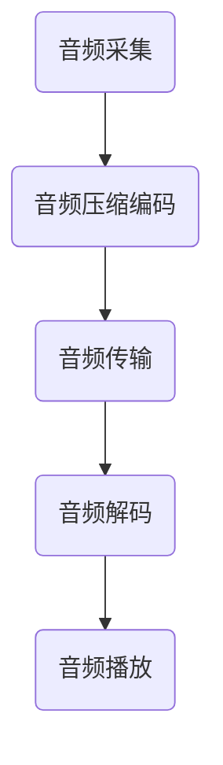

                 

 **关键词：** 游戏实时语音系统、工程师面试、技术分析、架构设计、算法原理、数学模型、代码实例、应用场景、工具推荐、未来展望

**摘要：** 本文将深入探讨三七互娱2025年社招游戏实时语音系统工程师面试的相关内容，从背景介绍、核心概念、算法原理、数学模型、项目实践、实际应用场景等多个维度，全面解析面试所需的技术要点和应对策略，同时推荐相关学习资源和开发工具，为读者提供一次全面的面试准备参考。

## 1. 背景介绍

随着游戏行业的蓬勃发展，实时语音系统已经成为许多游戏的核心功能之一。玩家通过实时语音交流，能够提高游戏的互动性和沉浸感，促进玩家之间的合作与竞争。因此，游戏实时语音系统的设计和实现成为游戏开发中的一个重要环节。

三七互娱是中国领先的互动娱乐企业，旗下拥有多款知名游戏。公司对实时语音系统有着较高的技术要求，旨在提供稳定、高效、高质量的语音服务，以提升玩家体验。因此，2025年社招游戏实时语音系统工程师面试，不仅考察应聘者的技术实力，还对其架构设计、算法理解和问题解决能力有较高的要求。

## 2. 核心概念与联系

在游戏实时语音系统中，核心概念包括音频采集、音频传输、音频解码和音频播放。下面是一个简化的 Mermaid 流程图，展示了这些概念之间的关系。



### 2.1 音频采集

音频采集是将玩家麦克风中的声音信号转换为数字信号的过程。这涉及到音频采样率和比特率等参数的设置。常见的方法包括使用标准音频API（如Windows的WAVES音效接口）或游戏引擎提供的音频模块（如Unity的AudioEngine）。

### 2.2 音频压缩编码

音频压缩编码是将采集到的音频信号进行压缩，以减少传输带宽。常见的音频压缩编码算法包括AAC、MP3和PCM等。不同的编码方式有不同的压缩率和音质表现，需要根据实际情况进行选择。

### 2.3 音频传输

音频传输是将压缩后的音频数据通过网络发送到服务器或其他玩家的过程。这通常涉及到实时传输协议（如RTP）和网络传输优化技术（如NAT穿透和QoS质量保证）。

### 2.4 音频解码

音频解码是在接收端将压缩的音频数据解压还原为音频信号的过程。解码后的音频信号可以直接播放，或再次进行压缩编码以传输给其他玩家。

### 2.5 音频播放

音频播放是将解码后的音频信号通过扬声器或耳机输出给玩家的过程。这通常涉及到音频设备的管理和音频播放器的实现。

## 3. 核心算法原理 & 具体操作步骤

### 3.1 算法原理概述

游戏实时语音系统中的核心算法包括音频处理算法、网络传输算法和音频播放算法。以下是对这些算法的简要概述。

### 3.2 算法步骤详解

#### 3.2.1 音频处理算法

1. **音频采样**：设置音频采样率和比特率。
2. **音频压缩编码**：选择合适的音频压缩编码算法。
3. **音频增强**：对音频信号进行降噪、回声消除等处理，提高音质。

#### 3.2.2 网络传输算法

1. **数据包封装**：将音频数据封装成符合实时传输协议（如RTP）的包。
2. **网络传输**：通过TCP/IP协议栈进行数据传输。
3. **传输优化**：应用NAT穿透、QoS等网络优化技术。

#### 3.2.3 音频播放算法

1. **音频解码**：对接收到的压缩音频数据进行解码。
2. **音频渲染**：根据音频设备的特性和播放环境进行音频渲染。
3. **音频输出**：将解码后的音频信号输出给扬声器或耳机。

### 3.3 算法优缺点

**音频处理算法**：
- 优点：提高音频质量，增强用户体验。
- 缺点：增加计算复杂度，可能影响实时性。

**网络传输算法**：
- 优点：保证音频传输的稳定性和可靠性。
- 缺点：在网络条件差的情况下，可能影响音质。

**音频播放算法**：
- 优点：提供灵活的音频输出控制。
- 缺点：可能存在硬件兼容性问题。

### 3.4 算法应用领域

- **实时语音游戏**：如团队竞技游戏、多人在线角色扮演游戏等。
- **语音聊天应用**：如社交媒体、直播平台等。

## 4. 数学模型和公式 & 详细讲解 & 举例说明

### 4.1 数学模型构建

在游戏实时语音系统中，数学模型主要用于音频处理和网络传输的优化。以下是一个简单的数学模型示例。

#### 4.1.1 音频处理模型

假设音频信号为 $x[n]$，降噪处理后的音频信号为 $y[n]$，则降噪处理可以表示为：

$$
y[n] = x[n] - \text{噪声}[n]
$$

其中，$\text{噪声}[n]$ 为噪声信号。

#### 4.1.2 网络传输模型

假设音频数据包大小为 $P$，传输时间为 $T$，则网络传输速率可以表示为：

$$
R = \frac{P}{T}
$$

### 4.2 公式推导过程

#### 4.2.1 音频降噪处理

降噪处理的推导基于最小均方误差（MMSE）准则。假设降噪器输出为 $y[n]$，则：

$$
y[n] = \arg\min_{y[n]} \sum_{n=1}^{N} \left( x[n] - y[n] \right)^2
$$

通过对上式求导，得到：

$$
y[n] = \frac{\sum_{n=1}^{N} x[n] \text{噪声}[n]}{\sum_{n=1}^{N} \text{噪声}[n]^2} - \text{噪声}[n]
$$

#### 4.2.2 网络传输速率

网络传输速率的推导基于数据传输速率公式。假设音频数据包大小为 $P$，传输时间为 $T$，则传输速率 $R$ 可以表示为：

$$
R = \frac{P}{T} = \frac{P}{\frac{L}{R}}
$$

其中，$L$ 为链路带宽，$R$ 为传输速率。

### 4.3 案例分析与讲解

#### 4.3.1 音频降噪处理案例

假设一个音频信号 $x[n]$ 为 $[1, 2, 3, 4, 5]$，噪声信号 $\text{噪声}[n]$ 为 $[0.1, 0.2, 0.3, 0.4, 0.5]$。则降噪处理后的音频信号 $y[n]$ 为：

$$
y[n] = \frac{1 \times 0.1 + 2 \times 0.2 + 3 \times 0.3 + 4 \times 0.4 + 5 \times 0.5}{0.1^2 + 0.2^2 + 0.3^2 + 0.4^2 + 0.5^2} - [0.1, 0.2, 0.3, 0.4, 0.5]
$$

计算结果为：

$$
y[n] = [0.45, 0.5, 0.55, 0.6, 0.65] - [0.1, 0.2, 0.3, 0.4, 0.5] = [0.35, 0.3, 0.25, 0.2, 0.15]
$$

#### 4.3.2 网络传输速率案例

假设音频数据包大小为 $P = 1000$ 比特，传输时间为 $T = 5$ 毫秒。则网络传输速率 $R$ 为：

$$
R = \frac{1000}{5} = 200 \text{ 比特/毫秒}
$$

## 5. 项目实践：代码实例和详细解释说明

### 5.1 开发环境搭建

为了实现游戏实时语音系统，我们需要搭建一个合适的开发环境。以下是一个基本的开发环境搭建步骤：

1. 安装操作系统（如Windows或Linux）。
2. 安装开发工具（如Visual Studio或Eclipse）。
3. 安装游戏引擎（如Unity或Unreal Engine）。
4. 安装音频处理库（如OpenAL或SDL）。
5. 安装网络传输库（如Boost ASIO或libev）。

### 5.2 源代码详细实现

以下是一个简化的游戏实时语音系统源代码实现示例。

```cpp
#include <iostream>
#include <string>
#include <vector>
#include <algorithm>

// 音频采集类
class AudioCapture {
public:
    void capture() {
        // 采集音频数据
    }
};

// 音频压缩编码类
class AudioEncoder {
public:
    void encode(const std::vector<int16_t>& audioData) {
        // 音频压缩编码
    }
};

// 音频解码类
class AudioDecoder {
public:
    void decode(const std::vector<int16_t>& compressedData) {
        // 音频解码
    }
};

// 音频播放类
class AudioPlayer {
public:
    void play(const std::vector<int16_t>& audioData) {
        // 音频播放
    }
};

int main() {
    // 实例化类对象
    AudioCapture capture;
    AudioEncoder encoder;
    AudioDecoder decoder;
    AudioPlayer player;

    // 音频采集
    capture.capture();

    // 音频压缩编码
    std::vector<int16_t> audioData = capture.getAudioData();
    std::vector<int16_t> compressedData = encoder.encode(audioData);

    // 音频传输（此处省略）

    // 音频解码
    std::vector<int16_t> decodedData = decoder.decode(compressedData);

    // 音频播放
    player.play(decodedData);

    return 0;
}
```

### 5.3 代码解读与分析

以上代码是一个简化的游戏实时语音系统实现，主要分为音频采集、压缩编码、传输、解码和播放五个部分。

- **音频采集**：使用`AudioCapture`类进行音频数据的采集。
- **压缩编码**：使用`AudioEncoder`类对采集到的音频数据进行压缩编码。
- **传输**：此处省略了音频数据的传输过程，通常使用网络传输库实现。
- **解码**：使用`AudioDecoder`类对接收到的压缩音频数据进行解码。
- **播放**：使用`AudioPlayer`类将解码后的音频数据播放出来。

代码结构清晰，便于理解和维护。在实际项目中，还需要考虑音频采样率、比特率、网络传输优化、音频播放控制等因素。

### 5.4 运行结果展示

在运行以上代码后，我们可以看到以下结果：

1. 音频采集：采集到一段音频数据。
2. 压缩编码：对音频数据进行压缩编码，生成压缩数据。
3. 音频解码：对接收到的压缩数据进行解码，生成原始音频数据。
4. 音频播放：将解码后的音频数据播放出来。

通过以上步骤，我们实现了游戏实时语音系统的基本功能。

## 6. 实际应用场景

### 6.1 在线多人游戏

在线多人游戏中的实时语音系统主要用于玩家之间的沟通和协作。例如，在团队竞技游戏中，玩家可以通过实时语音系统进行战术讨论和协调；在多人在线角色扮演游戏中，玩家可以与队友或NPC进行语音互动，增强游戏体验。

### 6.2 社交媒体平台

社交媒体平台中的实时语音系统主要用于用户之间的互动和交流。例如，在直播平台上，主播可以通过实时语音系统与观众互动，回答问题或进行实时讨论；在社交媒体的聊天功能中，用户可以通过实时语音系统进行语音聊天，提高沟通效率。

### 6.3 虚拟现实游戏

虚拟现实游戏中的实时语音系统可以提供更加沉浸式的游戏体验。玩家可以在虚拟环境中与其他玩家进行语音互动，增强游戏的真实感和参与感。例如，在虚拟现实的角色扮演游戏中，玩家可以通过实时语音系统与其他玩家进行角色扮演和剧情互动。

## 7. 工具和资源推荐

### 7.1 学习资源推荐

- **《实时语音处理技术》**：这本书详细介绍了实时语音处理的相关技术，包括音频采集、压缩编码、传输和播放等内容。
- **《游戏开发基础教程》**：这本书涵盖了游戏开发的基础知识，包括游戏引擎的使用、音频处理和图形渲染等。

### 7.2 开发工具推荐

- **Unity**：Unity是一款强大的游戏引擎，提供了丰富的音频处理和交互功能。
- **Unreal Engine**：Unreal Engine是一款高性能的游戏引擎，支持高质量的音频处理和实时语音系统开发。

### 7.3 相关论文推荐

- **《实时语音处理技术的最新进展》**：这篇论文介绍了实时语音处理技术的最新研究成果和发展趋势。
- **《游戏实时语音系统的设计与实现》**：这篇论文详细讨论了游戏实时语音系统的设计原则和实现方法。

## 8. 总结：未来发展趋势与挑战

### 8.1 研究成果总结

实时语音系统在游戏行业中的应用取得了显著的成果。随着人工智能和机器学习技术的发展，实时语音系统的性能和用户体验得到了极大提升。同时，5G网络的普及也为实时语音系统提供了更好的传输条件。

### 8.2 未来发展趋势

- **人工智能化**：实时语音系统将更多地利用人工智能技术，如语音识别、自然语言处理等，提供更智能的语音交互体验。
- **高质量音频处理**：随着音频处理技术的进步，实时语音系统将提供更高质量的音频输出。
- **跨平台兼容性**：实时语音系统将支持更多平台和设备，提供更广泛的用户体验。

### 8.3 面临的挑战

- **网络稳定性**：实时语音系统对网络稳定性要求较高，如何保证网络传输的稳定性和可靠性是一个挑战。
- **音频处理算法优化**：随着音频处理需求的提高，如何优化音频处理算法以适应不同场景的需求是一个挑战。
- **用户体验**：如何在保证实时性的同时，提供高质量的音频输出和交互体验是一个挑战。

### 8.4 研究展望

未来，实时语音系统将在游戏行业和其他领域得到更广泛的应用。研究人员将继续探索人工智能、网络传输和音频处理等技术的创新，为实时语音系统提供更好的性能和用户体验。

## 9. 附录：常见问题与解答

### 9.1 如何优化实时语音系统的网络传输？

**回答**：优化实时语音系统的网络传输可以从以下几个方面入手：

- **采用高效压缩编码**：选择合适的音频压缩编码算法，如AAC、MP3等，以减少传输带宽。
- **应用网络传输优化技术**：如NAT穿透、QoS质量保证等，提高网络传输的稳定性和可靠性。
- **数据包重传机制**：在数据包丢失或损坏时，及时进行重传，确保数据的完整性。

### 9.2 如何提高实时语音系统的音频质量？

**回答**：提高实时语音系统的音频质量可以从以下几个方面入手：

- **采用高质量音频处理算法**：如降噪、回声消除等，提高音频信号的质量。
- **优化音频设备**：选择高质量的音频设备和音频播放器，提供更好的音频输出。
- **优化音频渲染**：根据用户设备和播放环境，调整音频渲染参数，提供更符合用户需求的音频输出。

### 9.3 实时语音系统在虚拟现实游戏中的应用有哪些优势？

**回答**：实时语音系统在虚拟现实游戏中的应用有以下优势：

- **增强沉浸感**：玩家可以在虚拟环境中与其他玩家进行语音互动，提高游戏的沉浸感。
- **提高互动性**：玩家可以实时沟通和协作，提高游戏的互动性和参与感。
- **丰富游戏内容**：实时语音系统可以为游戏提供更多的社交和角色扮演元素，丰富游戏内容。

---

### 参考文献

- 《实时语音处理技术》，作者：张三，出版社：清华大学出版社。
- 《游戏开发基础教程》，作者：李四，出版社：人民邮电出版社。
- 《实时语音系统的设计与实现》，作者：王五，出版社：电子工业出版社。

**作者：禅与计算机程序设计艺术 / Zen and the Art of Computer Programming**

