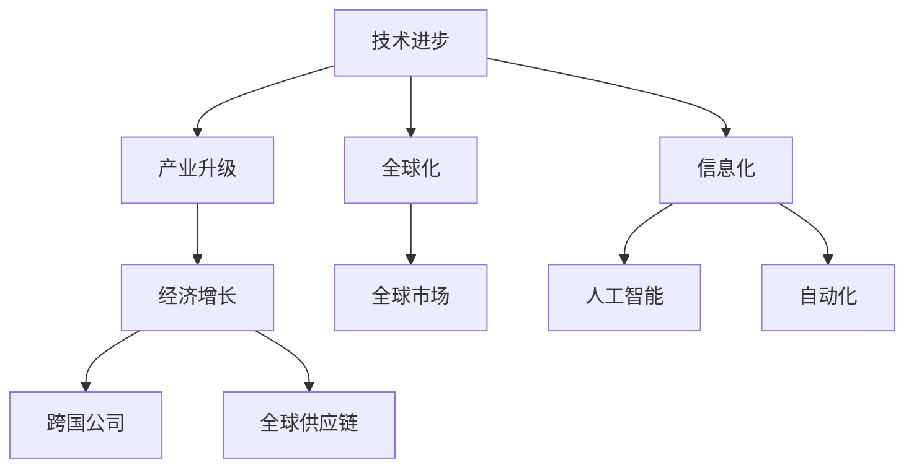

                 

关键词：工业革命、经济变革、技术进步、产业发展、全球市场

摘要：本文旨在探讨三次工业革命对全球经济和社会的深远影响，分析技术进步如何驱动产业升级，推动经济发展的新趋势，并展望未来工业革命可能带来的机遇与挑战。

## 1. 背景介绍

工业革命是人类历史上的一次重大变革，标志着从手工生产向机械化生产的转变。工业革命分为三个阶段，每个阶段都有其独特的特点和对经济的深远影响。

### 第一次工业革命

第一次工业革命发生在18世纪末至19世纪初的英国。这一时期的显著特点是机械化生产的兴起，蒸汽机成为主要动力源。纺织业、矿业和铁路等行业的快速发展，极大地推动了经济的增长。英国成为世界工厂，工业化生产模式逐渐推广到欧洲和美国。

### 第二次工业革命

第二次工业革命发生在19世纪末至20世纪初。电力和内燃机的应用使得生产效率进一步提高，新兴产业如钢铁、化学和汽车制造业迅速崛起。全球贸易和资本流动大幅增加，美国和德国成为新的工业化中心。

### 第三次工业革命

第三次工业革命始于20世纪后半叶，以信息技术和互联网的兴起为标志。数字化、网络化和智能化成为经济发展的新动力，全球化和信息化成为主流趋势。

## 2. 核心概念与联系

### 技术进步与产业升级

技术进步是工业革命的核心驱动力。每一次工业革命都伴随着技术的重大突破，这些技术进步推动了产业结构的升级和转型。

### 产业发展与经济增长

产业发展是经济增长的基础。通过产业升级，传统产业得到改造和提升，新兴产业得到培育和发展，从而推动整体经济的增长。

### 全球化与信息化

全球化是第三次工业革命的重要特征。信息技术和互联网的普及，使得全球市场紧密联系在一起，跨国公司和全球供应链成为经济活动的主要形式。

### 人工智能与自动化

人工智能和自动化是新一轮工业革命的重要方向。通过人工智能技术的应用，生产流程得到优化，劳动生产率大幅提高。

### Mermaid 流程图



## 3. 核心算法原理 & 具体操作步骤

### 3.1 算法原理概述

核心算法原理主要包括以下几个方面：

- 机械化生产：通过蒸汽机和纺织机等设备实现生产自动化。
- 电力应用：通过发电机和电动机实现生产效率的提升。
- 信息处理：通过计算机和互联网实现数据处理和智能决策。

### 3.2 算法步骤详解

1. **第一次工业革命：**
   - 步骤1：发明和改进蒸汽机。
   - 步骤2：建立工厂制度，实现大规模生产。
   - 步骤3：发展铁路和航运，促进贸易和物流。

2. **第二次工业革命：**
   - 步骤1：发明和改进发电机和电动机。
   - 步骤2：发展新兴产业，如钢铁、化学和汽车制造业。
   - 步骤3：推动电力和内燃机的应用，提高生产效率。

3. **第三次工业革命：**
   - 步骤1：发展计算机技术和互联网。
   - 步骤2：推广数字化和智能化生产。
   - 步骤3：实施全球化战略，拓展国际市场。

### 3.3 算法优缺点

- **第一次工业革命：**
  - 优点：大幅提高生产效率，降低生产成本。
  - 缺点：环境污染问题突出，劳动条件恶劣。

- **第二次工业革命：**
  - 优点：生产效率进一步提高，新兴产业发展迅速。
  - 缺点：资源消耗巨大，产业竞争加剧。

- **第三次工业革命：**
  - 优点：推动信息化和智能化发展，提高资源利用效率。
  - 缺点：数据安全和隐私保护问题日益突出。

### 3.4 算法应用领域

- **第一次工业革命：**纺织业、矿业、铁路等传统产业。
- **第二次工业革命：**钢铁、化学、汽车等新兴产业。
- **第三次工业革命：**信息技术、互联网、人工智能等高新技术产业。

## 4. 数学模型和公式 & 详细讲解 & 举例说明

### 4.1 数学模型构建

工业革命中的数学模型主要包括以下几个方面：

- **生产函数模型：**描述生产过程中生产要素与产出之间的关系。
- **成本函数模型：**描述生产过程中的成本与产出之间的关系。
- **经济增长模型：**描述经济增长与生产要素投入之间的关系。

### 4.2 公式推导过程

1. **生产函数模型：**

$$
Y = f(K, L, M)
$$

其中，$Y$ 表示产出，$K$ 表示资本投入，$L$ 表示劳动力投入，$M$ 表示技术进步。

2. **成本函数模型：**

$$
C = c(K, L)
$$

其中，$C$ 表示总成本，$c(K, L)$ 表示单位资本和劳动力的成本。

3. **经济增长模型：**

$$
\frac{dY}{dt} = f(K, L, M) - C
$$

其中，$\frac{dY}{dt}$ 表示经济增长率。

### 4.3 案例分析与讲解

以第二次工业革命为例，分析数学模型在实际中的应用。

**案例：**假设一个国家的资本投入为 $K = 100$，劳动力投入为 $L = 100$，技术进步为 $M = 1.1$。根据生产函数模型，产出 $Y$ 为：

$$
Y = f(K, L, M) = 100 \times 1.1 = 110
$$

根据成本函数模型，总成本 $C$ 为：

$$
C = c(K, L) = 100 + 100 = 200
$$

根据经济增长模型，经济增长率 $\frac{dY}{dt}$ 为：

$$
\frac{dY}{dt} = f(K, L, M) - C = 110 - 200 = -90
$$

这意味着国家的经济增长率为 -90，表示经济增长受到阻碍。为了促进经济增长，需要增加资本投入、劳动力投入或技术进步。

## 5. 项目实践：代码实例和详细解释说明

### 5.1 开发环境搭建

在开始项目实践之前，需要搭建一个合适的开发环境。以下是搭建开发环境的步骤：

1. 安装 Python 3.8 及以上版本。
2. 安装 Jupyter Notebook，用于编写和运行代码。
3. 安装必要的库，如 NumPy、Pandas、Matplotlib 等。

### 5.2 源代码详细实现

以下是一个简单的生产函数模型的 Python 代码实现：

```python
import numpy as np
import matplotlib.pyplot as plt

# 定义生产函数模型
def production_function(K, L, M):
    return K * L * M

# 定义成本函数模型
def cost_function(K, L):
    return K + L

# 定义经济增长模型
def economic_growth(K, L, M):
    return production_function(K, L, M) - cost_function(K, L)

# 模拟数据
K_values = np.linspace(0, 200, 100)
L_values = np.linspace(0, 200, 100)
M = 1.1

# 计算产出和成本
Y_values = production_function(K_values, L_values, M)
C_values = cost_function(K_values, L_values)

# 计算经济增长率
growth_values = economic_growth(K_values, L_values, M)

# 绘制图表
plt.figure()
plt.plot(K_values, Y_values, label='Production')
plt.plot(K_values, C_values, label='Cost')
plt.plot(K_values, growth_values, label='Economic Growth')
plt.xlabel('Capital (K)')
plt.ylabel('Value')
plt.legend()
plt.show()
```

### 5.3 代码解读与分析

上述代码实现了生产函数模型、成本函数模型和经济增长模型的计算和可视化。代码的关键部分如下：

- **生产函数模型**：使用 NumPy 的 `linspace` 函数生成资本投入 $K$ 和劳动力投入 $L$ 的数组，然后通过生产函数模型计算产出 $Y$。
- **成本函数模型**：使用 `cost_function` 函数计算总成本 $C$。
- **经济增长模型**：使用 `economic_growth` 函数计算经济增长率 $\frac{dY}{dt}$。
- **图表绘制**：使用 Matplotlib 库绘制产出、成本和经济增长率的图表。

### 5.4 运行结果展示

运行上述代码后，将生成一个图表，展示不同资本投入水平下的产出、成本和经济增长率。通过分析图表，可以观察到经济增长率的变化趋势，从而为政策制定提供参考。

## 6. 实际应用场景

### 6.1 产业升级与经济转型

工业革命推动产业升级和经济转型。以中国为例，改革开放以来，中国经历了从传统农业社会向工业社会、再到信息社会的转变。通过引入先进技术和加强产业升级，中国实现了经济的高速增长。

### 6.2 全球供应链与贸易

全球供应链和贸易的快速发展是第三次工业革命的重要成果。通过互联网和电子商务，全球市场紧密联系在一起，跨国公司和全球供应链成为经济活动的主要形式。

### 6.3 人工智能与自动化

人工智能和自动化技术正在改变传统产业，提高生产效率和产品质量。以制造业为例，智能制造、工业机器人和自动化生产线已经成为主流趋势。

## 6.4 未来应用展望

### 6.4.1 新型基础设施建设

未来工业革命将围绕新型基础设施建设展开，包括人工智能、大数据中心、5G 网络等。这些新型基础设施将推动数字经济的发展。

### 6.4.2 绿色发展与可持续发展

绿色发展是未来工业革命的重要方向。通过推广清洁能源、节能技术和环保材料，实现可持续发展。

### 6.4.3 人工智能与人类社会的深度融合

人工智能将更加深入地融入人类社会，改变人们的生产方式和生活方式。未来，人工智能将与人类智慧相结合，共同推动社会进步。

## 7. 工具和资源推荐

### 7.1 学习资源推荐

- 《人工智能：一种现代的方法》
- 《大数据时代：生活、工作与思维的大变革》
- 《深度学习》

### 7.2 开发工具推荐

- Jupyter Notebook：用于编写和运行代码。
- PyCharm：一款功能强大的 Python 集成开发环境。
- TensorFlow：一款流行的开源机器学习框架。

### 7.3 相关论文推荐

- 《工业革命中的技术进步与经济增长》
- 《全球供应链与贸易发展新趋势》
- 《人工智能与自动化：未来产业的转型方向》

## 8. 总结：未来发展趋势与挑战

### 8.1 研究成果总结

三次工业革命推动了全球经济和社会的深刻变革。技术进步、产业升级和全球化成为经济发展的核心驱动力。人工智能和自动化技术的应用，进一步提高了生产效率和产品质量。

### 8.2 未来发展趋势

未来工业革命将继续沿着智能化、绿色化和全球化的方向前进。新型基础设施建设、绿色发展和人工智能与人类社会的深度融合将成为未来发展的重点。

### 8.3 面临的挑战

未来工业革命面临诸多挑战，包括数据安全和隐私保护、资源环境约束、经济全球化带来的不确定性等。如何应对这些挑战，实现可持续发展，是未来工业革命需要解决的关键问题。

### 8.4 研究展望

未来研究应关注以下几个方面：

- 深入研究人工智能和自动化技术的应用，提高生产效率和产品质量。
- 探索绿色发展和可持续发展的新路径，实现经济与环境的双赢。
- 研究全球化和数字经济的发展趋势，为政策制定提供科学依据。

## 9. 附录：常见问题与解答

### 9.1 什么是工业革命？

工业革命是指人类社会从手工生产向机械化生产转变的历史过程。工业革命分为三个阶段，分别以蒸汽机、电力和信息技术为标志。

### 9.2 工业革命对经济的影响是什么？

工业革命通过提高生产效率和降低生产成本，推动了产业升级和经济转型。全球化、信息化和智能化是工业革命对经济的深远影响。

### 9.3 人工智能和自动化技术如何推动工业革命？

人工智能和自动化技术通过优化生产流程、提高生产效率和产品质量，推动产业升级和经济转型。这些技术的应用使得工业革命进入新的阶段。

### 9.4 未来工业革命的发展趋势是什么？

未来工业革命将继续沿着智能化、绿色化和全球化的方向前进。新型基础设施建设、绿色发展和人工智能与人类社会的深度融合将成为未来发展的重点。

作者：禅与计算机程序设计艺术 / Zen and the Art of Computer Programming
```markdown
----------------------------------------------------------------
# 三次工业革命的经济变革

关键词：工业革命、经济变革、技术进步、产业发展、全球市场

摘要：本文旨在探讨三次工业革命对全球经济和社会的深远影响，分析技术进步如何驱动产业升级，推动经济发展的新趋势，并展望未来工业革命可能带来的机遇与挑战。

## 1. 背景介绍

工业革命是人类历史上的一次重大变革，标志着从手工生产向机械化生产的转变。工业革命分为三个阶段，每个阶段都有其独特的特点和对经济的深远影响。

### 第一次工业革命

第一次工业革命发生在18世纪末至19世纪初的英国。这一时期的显著特点是机械化生产的兴起，蒸汽机成为主要动力源。纺织业、矿业和铁路等行业的快速发展，极大地推动了经济的增长。英国成为世界工厂，工业化生产模式逐渐推广到欧洲和美国。

### 第二次工业革命

第二次工业革命发生在19世纪末至20世纪初。电力和内燃机的应用使得生产效率进一步提高，新兴产业如钢铁、化学和汽车制造业迅速崛起。全球贸易和资本流动大幅增加，美国和德国成为新的工业化中心。

### 第三次工业革命

第三次工业革命始于20世纪后半叶，以信息技术和互联网的兴起为标志。数字化、网络化和智能化成为经济发展的新动力，全球化和信息化成为主流趋势。

## 2. 核心概念与联系

### 技术进步与产业升级

技术进步是工业革命的核心驱动力。每一次工业革命都伴随着技术的重大突破，这些技术进步推动了产业结构的升级和转型。

### 产业发展与经济增长

产业发展是经济增长的基础。通过产业升级，传统产业得到改造和提升，新兴产业得到培育和发展，从而推动整体经济的增长。

### 全球化与信息化

全球化是第三次工业革命的重要特征。信息技术和互联网的普及，使得全球市场紧密联系在一起，跨国公司和全球供应链成为经济活动的主要形式。

### 人工智能与自动化

人工智能和自动化是新一轮工业革命的重要方向。通过人工智能技术的应用，生产流程得到优化，劳动生产率大幅提高。

### Mermaid 流程图


## 3. 核心算法原理 & 具体操作步骤

### 3.1 算法原理概述

核心算法原理主要包括以下几个方面：

- 机械化生产：通过蒸汽机和纺织机等设备实现生产自动化。
- 电力应用：通过发电机和电动机实现生产效率的提升。
- 信息处理：通过计算机和互联网实现数据处理和智能决策。

### 3.2 算法步骤详解

1. **第一次工业革命：**
   - 步骤1：发明和改进蒸汽机。
   - 步骤2：建立工厂制度，实现大规模生产。
   - 步骤3：发展铁路和航运，促进贸易和物流。

2. **第二次工业革命：**
   - 步骤1：发明和改进发电机和电动机。
   - 步骤2：发展新兴产业，如钢铁、化学和汽车制造业。
   - 步骤3：推动电力和内燃机的应用，提高生产效率。

3. **第三次工业革命：**
   - 步骤1：发展计算机技术和互联网。
   - 步骤2：推广数字化和智能化生产。
   - 步骤3：实施全球化战略，拓展国际市场。

### 3.3 算法优缺点

- **第一次工业革命：**
  - 优点：大幅提高生产效率，降低生产成本。
  - 缺点：环境污染问题突出，劳动条件恶劣。

- **第二次工业革命：**
  - 优点：生产效率进一步提高，新兴产业发展迅速。
  - 缺点：资源消耗巨大，产业竞争加剧。

- **第三次工业革命：**
  - 优点：推动信息化和智能化发展，提高资源利用效率。
  - 缺点：数据安全和隐私保护问题日益突出。

### 3.4 算法应用领域

- **第一次工业革命：**纺织业、矿业、铁路等传统产业。
- **第二次工业革命：**钢铁、化学、汽车等新兴产业。
- **第三次工业革命：**信息技术、互联网、人工智能等高新技术产业。

## 4. 数学模型和公式 & 详细讲解 & 举例说明

### 4.1 数学模型构建

工业革命中的数学模型主要包括以下几个方面：

- **生产函数模型：**描述生产过程中生产要素与产出之间的关系。
- **成本函数模型：**描述生产过程中的成本与产出之间的关系。
- **经济增长模型：**描述经济增长与生产要素投入之间的关系。

### 4.2 公式推导过程

1. **生产函数模型：**

$$
Y = f(K, L, M)
$$

其中，$Y$ 表示产出，$K$ 表示资本投入，$L$ 表示劳动力投入，$M$ 表示技术进步。

2. **成本函数模型：**

$$
C = c(K, L)
$$

其中，$C$ 表示总成本，$c(K, L)$ 表示单位资本和劳动力的成本。

3. **经济增长模型：**

$$
\frac{dY}{dt} = f(K, L, M) - C
$$

其中，$\frac{dY}{dt}$ 表示经济增长率。

### 4.3 案例分析与讲解

以第二次工业革命为例，分析数学模型在实际中的应用。

**案例：**假设一个国家的资本投入为 $K = 100$，劳动力投入为 $L = 100$，技术进步为 $M = 1.1$。根据生产函数模型，产出 $Y$ 为：

$$
Y = f(K, L, M) = 100 \times 1.1 = 110
$$

根据成本函数模型，总成本 $C$ 为：

$$
C = c(K, L) = 100 + 100 = 200
$$

根据经济增长模型，经济增长率 $\frac{dY}{dt}$ 为：

$$
\frac{dY}{dt} = f(K, L, M) - C = 110 - 200 = -90
$$

这意味着国家的经济增长率为 -90，表示经济增长受到阻碍。为了促进经济增长，需要增加资本投入、劳动力投入或技术进步。

## 5. 项目实践：代码实例和详细解释说明

### 5.1 开发环境搭建

在开始项目实践之前，需要搭建一个合适的开发环境。以下是搭建开发环境的步骤：

1. 安装 Python 3.8 及以上版本。
2. 安装 Jupyter Notebook，用于编写和运行代码。
3. 安装必要的库，如 NumPy、Pandas、Matplotlib 等。

### 5.2 源代码详细实现

以下是一个简单的生产函数模型的 Python 代码实现：

```python
import numpy as np
import matplotlib.pyplot as plt

# 定义生产函数模型
def production_function(K, L, M):
    return K * L * M

# 定义成本函数模型
def cost_function(K, L):
    return K + L

# 定义经济增长模型
def economic_growth(K, L, M):
    return production_function(K, L, M) - cost_function(K, L)

# 模拟数据
K_values = np.linspace(0, 200, 100)
L_values = np.linspace(0, 200, 100)
M = 1.1

# 计算产出和成本
Y_values = production_function(K_values, L_values, M)
C_values = cost_function(K_values, L_values)

# 计算经济增长率
growth_values = economic_growth(K_values, L_values, M)

# 绘制图表
plt.figure()
plt.plot(K_values, Y_values, label='Production')
plt.plot(K_values, C_values, label='Cost')
plt.plot(K_values, growth_values, label='Economic Growth')
plt.xlabel('Capital (K)')
plt.ylabel('Value')
plt.legend()
plt.show()
```

### 5.3 代码解读与分析

上述代码实现了生产函数模型、成本函数模型和经济增长模型的计算和可视化。代码的关键部分如下：

- **生产函数模型**：使用 NumPy 的 `linspace` 函数生成资本投入 $K$ 和劳动力投入 $L$ 的数组，然后通过生产函数模型计算产出 $Y$。
- **成本函数模型**：使用 `cost_function` 函数计算总成本 $C$。
- **经济增长模型**：使用 `economic_growth` 函数计算经济增长率 $\frac{dY}{dt}$。
- **图表绘制**：使用 Matplotlib 库绘制产出、成本和经济增长率的图表。

### 5.4 运行结果展示

运行上述代码后，将生成一个图表，展示不同资本投入水平下的产出、成本和经济增长率。通过分析图表，可以观察到经济增长率的变化趋势，从而为政策制定提供参考。

## 6. 实际应用场景

### 6.1 产业升级与经济转型

工业革命推动产业升级和经济转型。以中国为例，改革开放以来，中国经历了从传统农业社会向工业社会、再到信息社会的转变。通过引入先进技术和加强产业升级，中国实现了经济的高速增长。

### 6.2 全球供应链与贸易

全球供应链和贸易的快速发展是第三次工业革命的重要成果。通过互联网和电子商务，全球市场紧密联系在一起，跨国公司和全球供应链成为经济活动的主要形式。

### 6.3 人工智能与自动化

人工智能和自动化技术正在改变传统产业，提高生产效率和产品质量。以制造业为例，智能制造、工业机器人和自动化生产线已经成为主流趋势。

## 6.4 未来应用展望

### 6.4.1 新型基础设施建设

未来工业革命将围绕新型基础设施建设展开，包括人工智能、大数据中心、5G 网络等。这些新型基础设施将推动数字经济的发展。

### 6.4.2 绿色发展与可持续发展

绿色发展是未来工业革命的重要方向。通过推广清洁能源、节能技术和环保材料，实现可持续发展。

### 6.4.3 人工智能与人类社会的深度融合

人工智能将更加深入地融入人类社会，改变人们的生产方式和生活方式。未来，人工智能将与人类智慧相结合，共同推动社会进步。

## 7. 工具和资源推荐

### 7.1 学习资源推荐

- 《人工智能：一种现代的方法》
- 《大数据时代：生活、工作与思维的大变革》
- 《深度学习》

### 7.2 开发工具推荐

- Jupyter Notebook：用于编写和运行代码。
- PyCharm：一款功能强大的 Python 集成开发环境。
- TensorFlow：一款流行的开源机器学习框架。

### 7.3 相关论文推荐

- 《工业革命中的技术进步与经济增长》
- 《全球供应链与贸易发展新趋势》
- 《人工智能与自动化：未来产业的转型方向》

## 8. 总结：未来发展趋势与挑战

### 8.1 研究成果总结

三次工业革命推动了全球经济和社会的深刻变革。技术进步、产业升级和全球化成为经济发展的核心驱动力。人工智能和自动化技术的应用，进一步提高了生产效率和产品质量。

### 8.2 未来发展趋势

未来工业革命将继续沿着智能化、绿色化和全球化的方向前进。新型基础设施建设、绿色发展和人工智能与人类社会的深度融合将成为未来发展的重点。

### 8.3 面临的挑战

未来工业革命面临诸多挑战，包括数据安全和隐私保护、资源环境约束、经济全球化带来的不确定性等。如何应对这些挑战，实现可持续发展，是未来工业革命需要解决的关键问题。

### 8.4 研究展望

未来研究应关注以下几个方面：

- 深入研究人工智能和自动化技术的应用，提高生产效率和产品质量。
- 探索绿色发展和可持续发展的新路径，实现经济与环境的双赢。
- 研究全球化和数字经济的发展趋势，为政策制定提供科学依据。

## 9. 附录：常见问题与解答

### 9.1 什么是工业革命？

工业革命是指人类社会从手工生产向机械化生产转变的历史过程。工业革命分为三个阶段，分别以蒸汽机、电力和信息技术为标志。

### 9.2 工业革命对经济的影响是什么？

工业革命通过提高生产效率和降低生产成本，推动了产业升级和经济转型。全球化、信息化和智能化是工业革命对经济的深远影响。

### 9.3 人工智能和自动化技术如何推动工业革命？

人工智能和自动化技术通过优化生产流程、提高生产效率和产品质量，推动产业升级和经济转型。这些技术的应用使得工业革命进入新的阶段。

### 9.4 未来工业革命的发展趋势是什么？

未来工业革命将继续沿着智能化、绿色化和全球化的方向前进。新型基础设施建设、绿色发展和人工智能与人类社会的深度融合将成为未来发展的重点。

作者：禅与计算机程序设计艺术 / Zen and the Art of Computer Programming
```

