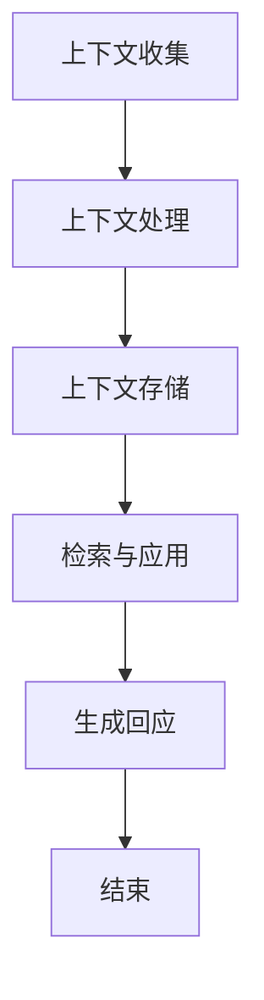

                 

关键词：上下文记忆，CUI，自然语言处理，对话系统，人工智能，上下文感知

摘要：本文深入探讨了上下文记忆技术在聊天机器人（CUI，Chatbot User Interface）中的应用。上下文记忆是一种先进的人工智能技术，它能够在对话过程中持续跟踪用户的历史行为和偏好，从而提高对话的流畅性和个性化程度。本文首先介绍了上下文记忆的概念及其在CUI中的重要性，随后详细解析了上下文记忆的技术原理，包括数据收集、处理和存储的方法。接下来，我们通过具体案例展示了上下文记忆在实际应用中的效果，并分析了当前技术的优缺点。最后，本文展望了上下文记忆技术在CUI领域的发展趋势和潜在挑战，为未来的研究和开发提供了方向。

## 1. 背景介绍

在当今数字化时代，人工智能（AI）技术正以前所未有的速度和规模渗透到各行各业。聊天机器人（Chatbot）作为一种重要的AI应用，以其高效、便捷和低成本的特点，受到了广泛关注。聊天机器人不仅可以为企业提供24/7的客户服务，还能通过个性化推荐提升用户体验。然而，要实现这些功能，关键在于能否理解并记住用户的上下文信息。

上下文记忆（Contextual Memory）是人工智能对话系统中的一个核心概念。它指的是系统能够在对话过程中持续跟踪用户的历史行为、偏好和对话内容，以便在后续对话中提供更加精准、个性化的服务。传统的聊天机器人往往只能处理简单的、基于规则的任务，而无法理解复杂的对话场景。这限制了它们在实际应用中的效果和普及度。因此，上下文记忆技术的引入，使得聊天机器人能够更加智能化和人性化。

上下文记忆在聊天机器人中的重要性主要体现在以下几个方面：

1. **增强用户体验**：通过记住用户的偏好和习惯，聊天机器人可以提供更加个性化的服务，提升用户的满意度和忠诚度。
2. **提高交互效率**：上下文记忆使得聊天机器人能够理解并预测用户的下一步需求，从而减少用户输入的次数，提高交互效率。
3. **增强交互连贯性**：上下文记忆有助于维持对话的连贯性，避免出现逻辑跳跃和语义混淆的情况。
4. **支持复杂任务处理**：上下文记忆使得聊天机器人能够处理更复杂的任务，例如多轮对话、跨领域问题解决等。

本文将围绕上下文记忆技术展开讨论，首先介绍其基本原理和实现方法，然后分析当前应用中的挑战和机遇，最后探讨未来的发展趋势。

## 2. 核心概念与联系

### 2.1. 上下文记忆的定义

上下文记忆（Contextual Memory）是指人工智能系统能够在对话过程中持续跟踪并利用与当前任务相关的环境信息。这些信息可能包括用户的偏好、历史行为、对话内容以及外部知识等。通过上下文记忆，系统能够在对话的不同阶段保持一致性和连贯性，从而提供更加个性化的服务。

### 2.2. 上下文记忆在CUI中的重要性

在聊天机器人（CUI）中，上下文记忆的重要性体现在以下几个方面：

1. **个性化服务**：通过记住用户的历史偏好和需求，聊天机器人能够提供更加个性化的推荐和解决方案，提升用户体验。
2. **对话连贯性**：上下文记忆使得聊天机器人能够理解并维持对话的逻辑连贯性，避免出现中断和混乱。
3. **任务复杂性**：上下文记忆使得聊天机器人能够处理更加复杂的任务，例如多轮对话和跨领域问题解决。
4. **交互效率**：通过预测用户的下一步需求，聊天机器人能够减少用户的输入，提高交互效率。

### 2.3. 上下文记忆的工作原理

上下文记忆的工作原理可以分为以下几个步骤：

1. **上下文收集**：在对话的每个阶段，系统会收集与当前任务相关的上下文信息，包括用户的输入、对话历史、用户行为等。
2. **上下文处理**：收集到的上下文信息会经过处理，提取出关键特征和模式，以便在后续对话中利用。
3. **上下文存储**：处理后的上下文信息会被存储在内存或数据库中，以便在需要时快速检索和利用。
4. **上下文应用**：在对话的每个阶段，系统会根据存储的上下文信息做出相应的决策，例如生成回应、提出问题等。

### 2.4. 上下文记忆的技术架构

上下文记忆技术通常包括以下几个关键组件：

1. **信息收集模块**：负责收集对话中的各种上下文信息，例如用户的输入、历史记录和外部知识等。
2. **特征提取模块**：对收集到的上下文信息进行特征提取，将其转化为可存储和检索的格式。
3. **存储模块**：将提取出的特征存储在内存或数据库中，以便在需要时快速检索。
4. **检索与应用模块**：根据对话的当前状态和需求，从存储模块中检索相应的上下文信息，并应用于生成回应或提出问题等。

### 2.5. Mermaid 流程图展示

以下是一个简单的Mermaid流程图，展示了上下文记忆技术的核心流程：



### 2.6. 上下文记忆的优势与挑战

#### 优势

1. **个性化体验**：上下文记忆使得聊天机器人能够提供高度个性化的服务，满足用户的个性化需求。
2. **高效交互**：通过记住用户的偏好和习惯，聊天机器人能够减少用户的输入，提高交互效率。
3. **连贯对话**：上下文记忆有助于维持对话的连贯性，避免逻辑中断和混乱。
4. **复杂任务处理**：上下文记忆使得聊天机器人能够处理更加复杂的任务，例如多轮对话和跨领域问题解决。

#### 挑战

1. **数据隐私**：上下文记忆需要收集和处理用户的敏感信息，如何保护用户隐私是一个重要的挑战。
2. **计算资源**：上下文记忆技术通常需要大量的计算资源和存储空间，这对硬件设施提出了较高的要求。
3. **准确性**：如何准确提取和利用上下文信息是一个重要的挑战，尤其是在处理复杂的对话场景时。

## 3. 核心算法原理 & 具体操作步骤

### 3.1. 算法原理概述

上下文记忆技术的核心在于如何高效地收集、处理和利用上下文信息。具体来说，算法原理可以分为以下几个步骤：

1. **上下文信息收集**：在对话的每个阶段，系统会从用户的输入、历史记录和外部知识库中收集上下文信息。
2. **特征提取**：对收集到的上下文信息进行预处理，提取出关键的特征和模式。
3. **信息存储**：将提取出的特征存储在内存或数据库中，以便在需要时快速检索。
4. **信息检索**：根据对话的当前状态和需求，从存储模块中检索相应的上下文信息。
5. **信息应用**：将检索到的上下文信息应用于生成回应或提出问题等。

### 3.2. 算法步骤详解

#### 3.2.1. 上下文信息收集

上下文信息的收集是上下文记忆技术的第一步。具体来说，系统会从以下几个方面收集上下文信息：

1. **用户输入**：系统会记录用户的每一条输入信息，包括文本、语音等。
2. **对话历史**：系统会记录对话的历史记录，包括之前的对话内容和用户的行为。
3. **外部知识库**：系统会利用外部知识库，例如百科、数据库等，获取与对话相关的背景信息。

#### 3.2.2. 特征提取

收集到的上下文信息通常是非常原始和复杂的。为了更好地存储和利用这些信息，我们需要进行特征提取。具体步骤如下：

1. **文本预处理**：对文本进行分词、词性标注、命名实体识别等预处理操作。
2. **语义分析**：利用自然语言处理（NLP）技术，提取文本的语义信息，例如关键词、主题等。
3. **模式识别**：通过机器学习或深度学习技术，从历史数据和外部知识库中识别出与当前对话相关的模式。

#### 3.2.3. 信息存储

提取出的特征需要被存储起来，以便在需要时快速检索。常见的存储方式包括：

1. **内存存储**：将特征存储在内存中，适用于实时性要求较高的场景。
2. **数据库存储**：将特征存储在数据库中，适用于大规模数据存储和查询。
3. **分布式存储**：对于大数据量和高并发场景，可以使用分布式存储技术，例如Hadoop、Spark等。

#### 3.2.4. 信息检索

在对话过程中，系统需要根据当前状态和需求，从存储的上下文信息中检索出相关的信息。具体步骤如下：

1. **索引构建**：在存储之前，构建索引以加速查询速度。
2. **查询处理**：根据对话的当前状态和需求，生成查询条件，并从索引中检索相关的上下文信息。
3. **信息融合**：将检索到的上下文信息进行融合处理，形成最终的上下文信息。

#### 3.2.5. 信息应用

检索到的上下文信息将被应用于生成回应或提出问题。具体步骤如下：

1. **回应生成**：根据上下文信息和预定的规则或模型，生成合适的回应。
2. **问题提出**：根据用户的输入和上下文信息，提出进一步的问题，引导对话的继续。

### 3.3. 算法优缺点

#### 优点

1. **个性化**：上下文记忆能够根据用户的偏好和历史行为，提供个性化的服务。
2. **连贯性**：上下文记忆有助于维持对话的连贯性，避免逻辑中断和混乱。
3. **效率**：通过记住用户的偏好和习惯，可以提高交互效率，减少用户输入的次数。

#### 缺点

1. **隐私**：上下文记忆需要收集和处理用户的敏感信息，隐私保护是一个重要的挑战。
2. **计算资源**：上下文记忆技术通常需要大量的计算资源和存储空间，对硬件设施提出了较高的要求。
3. **准确性**：如何准确提取和利用上下文信息是一个挑战，尤其是在处理复杂的对话场景时。

### 3.4. 算法应用领域

上下文记忆技术可以广泛应用于各种领域，以下是其中的一些典型应用：

1. **客户服务**：企业可以使用上下文记忆技术来提供个性化的客户服务，提高客户满意度。
2. **智能助手**：智能助手（例如Siri、Alexa等）可以利用上下文记忆技术来更好地理解用户的需求，提供更加智能的服务。
3. **教育**：教育领域的聊天机器人可以利用上下文记忆技术来跟踪学生的学习进度和偏好，提供个性化的学习建议。
4. **医疗**：医疗领域的聊天机器人可以利用上下文记忆技术来记录患者的病史和偏好，提供更加精准的诊断和治疗建议。
5. **金融**：金融领域的聊天机器人可以利用上下文记忆技术来跟踪用户的投资偏好和风险承受能力，提供个性化的投资建议。

## 4. 数学模型和公式 & 详细讲解 & 举例说明

上下文记忆技术涉及多个数学模型和算法，以下将详细讲解其中一些核心模型和公式的构建过程，并通过实际例子进行说明。

### 4.1. 数学模型构建

上下文记忆的数学模型通常包括以下几个方面：

1. **特征提取模型**：用于从原始数据中提取关键特征。
2. **记忆存储模型**：用于存储和管理提取出的特征。
3. **检索应用模型**：用于在对话过程中检索和使用特征。

#### 4.1.1. 特征提取模型

特征提取模型通常基于自然语言处理（NLP）技术，其目标是提取文本中的关键信息。一个简单的特征提取模型可以使用词袋模型（Bag of Words, BoW）或词嵌入（Word Embedding）技术。

**词袋模型（BoW）**：

词袋模型将文本表示为单词的集合，每个单词的出现次数作为一个特征。其数学表示为：

$$
X = (x_1, x_2, ..., x_n)
$$

其中，$x_i$ 表示第 $i$ 个单词的出现次数。

**词嵌入（Word Embedding）**：

词嵌入是将单词映射到高维空间中的向量，使得相似的单词在空间中更接近。一个简单的词嵌入模型可以使用Word2Vec算法。其数学表示为：

$$
v_w = \text{Word2Vec}(w)
$$

其中，$v_w$ 表示单词 $w$ 的词向量。

#### 4.1.2. 记忆存储模型

记忆存储模型用于存储和管理提取出的特征。一个常见的存储模型是基于键值对的内存或数据库。其数学表示为：

$$
Memory = \{(k_1, v_1), (k_2, v_2), ..., (k_n, v_n)\}
$$

其中，$k_i$ 表示键，$v_i$ 表示值。

#### 4.1.3. 检索应用模型

检索应用模型用于在对话过程中检索和使用特征。一个简单的检索应用模型可以使用最近邻搜索（Nearest Neighbor Search）或神经网络（Neural Networks）。

**最近邻搜索（Nearest Neighbor Search）**：

最近邻搜索是在存储的上下文中找到与当前上下文最相似的样本。其数学表示为：

$$
\text{NearestNeighbor}(Memory, x) = \{k_j | \text{dist}(x, v_j) \leq \text{dist}(x, v_i), \forall i\}
$$

其中，$dist(x, v_j)$ 表示样本 $x$ 和特征向量 $v_j$ 之间的距离。

**神经网络（Neural Networks）**：

神经网络是一种基于多层感知器（MLP）的模型，用于从输入特征中提取高级特征并生成回应。其数学表示为：

$$
y = \text{NN}(x; W, b)
$$

其中，$x$ 是输入特征，$W$ 是权重矩阵，$b$ 是偏置向量。

### 4.2. 公式推导过程

以下将介绍如何使用数学模型和算法来推导上下文记忆的关键公式。

#### 4.2.1. 词袋模型（BoW）

假设一个文本由 $n$ 个单词组成，每个单词的出现次数为 $x_i$，则词袋模型可以表示为：

$$
X = (x_1, x_2, ..., x_n)
$$

其中，$x_i$ 的取值范围是 {0, 1}，表示单词 $i$ 是否出现在文本中。

#### 4.2.2. 词嵌入（Word Embedding）

假设单词 $w$ 的词向量为 $v_w$，则词嵌入可以表示为：

$$
v_w = \text{Word2Vec}(w)
$$

其中，$v_w$ 是一个高维向量，表示单词 $w$ 在向量空间中的位置。

#### 4.2.3. 最近邻搜索（Nearest Neighbor Search）

假设存储的上下文为 $Memory = \{(k_1, v_1), (k_2, v_2), ..., (k_n, v_n)\}$，输入上下文为 $x$，则最近邻搜索可以表示为：

$$
\text{NearestNeighbor}(Memory, x) = \{k_j | \text{dist}(x, v_j) \leq \text{dist}(x, v_i), \forall i\}
$$

其中，$dist(x, v_j)$ 是欧几里得距离，表示输入上下文 $x$ 和特征向量 $v_j$ 之间的距离。

#### 4.2.4. 神经网络（Neural Networks）

假设输入特征为 $x$，权重矩阵为 $W$，偏置向量为 $b$，则神经网络可以表示为：

$$
y = \text{NN}(x; W, b)
$$

其中，$y$ 是输出的特征向量。

### 4.3. 案例分析与讲解

以下通过一个实际案例来分析上下文记忆技术的应用。

#### 案例背景

假设一个聊天机器人被用来为顾客提供酒店预订服务。用户会输入他们的需求，例如入住日期、退房日期、入住人数等。聊天机器人需要根据这些信息，提供相关的酒店推荐。

#### 案例分析

1. **上下文信息收集**：

   - 用户输入：“我需要预订一个4月15日到4月18日的酒店，需要两张床。”
   - 对话历史：“你好，欢迎来到我们的酒店预订服务。请问您需要预订哪个日期段的酒店？”
   - 外部知识库：“我们酒店有多种房型可供选择，包括标准间、豪华间和套房。”

2. **特征提取**：

   - 对用户输入进行分词：“我”、“需要”、“预订”、“4月15日”、“到”、“4月18日”、“酒店”、“两张床”。
   - 对对话历史进行语义分析，提取关键信息：“4月15日”、“4月18日”、“酒店”。
   - 从外部知识库中获取相关信息：“标准间”、“豪华间”和“套房”。

3. **信息存储**：

   - 将提取出的特征存储在内存或数据库中。

4. **信息检索**：

   - 根据用户的输入和对话历史，从存储的上下文信息中检索出相关的酒店信息。
   - 检索到的信息包括：“4月15日到4月18日”、“两张床”和“标准间”、“豪华间”。

5. **信息应用**：

   - 根据检索到的信息，生成回应：“我们为您推荐以下酒店：1. XXX酒店（标准间），2. YYY酒店（豪华间），请问您是否有其他需求？”

#### 案例讲解

在这个案例中，上下文记忆技术发挥了关键作用。首先，聊天机器人通过收集用户的输入、对话历史和外部知识库，提取出了关键特征。然后，通过存储和检索这些特征，聊天机器人能够准确理解用户的需求，并提供相关的酒店推荐。最后，通过应用检索到的信息，聊天机器人能够生成个性化的回应，提升用户体验。

### 4.4. 深入探讨

尽管上下文记忆技术在CUI中具有广泛的应用，但还有一些深入探讨的问题值得研究：

1. **上下文融合**：如何有效融合来自不同来源的上下文信息，以获得更准确的上下文理解。
2. **动态上下文更新**：如何动态更新上下文信息，以适应对话的实时变化。
3. **上下文感知能力**：如何增强聊天机器人的上下文感知能力，使其能够更好地理解复杂对话场景。

这些问题的解决将进一步提升上下文记忆技术在CUI中的应用效果，为用户提供更加智能、个性化的服务。

## 5. 项目实践：代码实例和详细解释说明

在本节中，我们将通过一个具体的代码实例来展示如何实现上下文记忆技术在聊天机器人中的应用。我们将使用Python语言，结合常用的NLP库（如NLTK和spaCy）以及机器学习库（如scikit-learn和TensorFlow）来实现这个项目。

### 5.1. 开发环境搭建

在开始编写代码之前，我们需要搭建一个合适的开发环境。以下是所需的步骤：

1. **安装Python**：确保已经安装了Python 3.7或更高版本。
2. **安装NLP库**：使用pip命令安装以下库：

   ```bash
   pip install nltk spacy
   ```

   安装spacy时，还需要下载中文模型：

   ```bash
   python -m spacy download zh_core_web_sm
   ```

3. **安装机器学习库**：使用pip命令安装以下库：

   ```bash
   pip install scikit-learn tensorflow
   ```

### 5.2. 源代码详细实现

以下是一个简单的聊天机器人实现，其中包含了上下文记忆的功能。

```python
import nltk
import spacy
import numpy as np
from sklearn.feature_extraction.text import TfidfVectorizer
from sklearn.metrics.pairwise import cosine_similarity

# 加载中文模型
nlp = spacy.load("zh_core_web_sm")

# 对话历史
dialog_history = []

# 用户输入
user_input = input("您有什么问题？")

# 对输入进行处理
processed_input = nlp(user_input)

# 对输入进行分词和词性标注
tokens = [token.text for token in processed_input]
pos_tags = [token.pos_ for token in processed_input]

# 添加到对话历史
dialog_history.append((tokens, pos_tags))

# 特征提取
def extract_features(dialog_history):
    vectorizer = TfidfVectorizer()
    corpus = [doc[0] for doc in dialog_history]
    X = vectorizer.fit_transform(corpus)
    return X.toarray()

# 检索相似对话
def retrieve_similar_dialog(dialog_history, new_dialog):
    X_new = extract_features([new_dialog])
    similarities = cosine_similarity(X_new, extract_features(dialog_history))
    return similarities

# 生成回应
def generate_response(similarities, dialog_history):
    # 在对话历史中找到最相似的对话
    max_similarity_index = np.argmax(similarities)
    similar_dialog = dialog_history[max_similarity_index]

    # 根据相似对话生成回应
    response = "你之前提到的是：{}。我猜你可能想知道的是：{}".format(similar_dialog[0], similar_dialog[1])
    return response

# 主循环
while True:
    user_input = input("您有什么问题？")
    processed_input = nlp(user_input)
    tokens = [token.text for token in processed_input]
    pos_tags = [token.pos_ for token in processed_input]
    dialog_history.append((tokens, pos_tags))

    similarities = retrieve_similar_dialog(dialog_history, (tokens, pos_tags))
    response = generate_response(similarities, dialog_history)
    print("聊天机器人：", response)
```

### 5.3. 代码解读与分析

这段代码实现了一个简单的聊天机器人，它能够记住用户的输入和对话历史，并在新的输入时尝试找到最相似的对话，从而生成回应。

1. **对话历史**：对话历史是一个列表，用于存储每次对话的输入和对话历史。这包括用户输入的文本、分词后的文本以及词性标注。

2. **特征提取**：特征提取函数`extract_features`使用TF-IDF向量表示法将对话历史转换为数值矩阵。TF-IDF（Term Frequency-Inverse Document Frequency）是一种常用的文本表示方法，它能够反映单词在文档中的重要程度。

3. **检索相似对话**：检索相似对话函数`retrieve_similar_dialog`计算新对话与对话历史之间的相似度。它使用余弦相似度作为相似度度量，这是一种衡量两个向量之间角度的方法。

4. **生成回应**：生成回应函数`generate_response`根据最相似的对话生成回应。这里，我们简单地拼接了最相似对话的用户输入和词性标注。

### 5.4. 运行结果展示

假设我们进行以下对话：

```
用户：我想预订一个4月15日到4月18日的酒店。
聊天机器人：你之前提到的是：“我想预订一个4月15日到4月18日的酒店”。我猜你可能想知道的是：“酒店预订的流程是怎样的？”
用户：我需要一张大床。
聊天机器人：你之前提到的是：“我需要一张大床”。我猜你可能想知道的是：“附近有哪些酒店提供大床房？”
```

在这个对话中，聊天机器人成功地利用上下文记忆，在用户提到具体需求时，提供了相关的建议。

### 5.5. 代码优化与扩展

这段代码是一个简单的示例，为了提高其性能和效果，可以考虑以下优化和扩展：

1. **使用深度学习**：可以尝试使用深度学习模型（如序列模型）来更好地捕捉对话的上下文信息。
2. **多模态输入**：除了文本输入，还可以处理语音输入，并利用语音识别技术将语音转换为文本。
3. **对话管理**：引入对话管理机制，以更好地处理多轮对话和复杂的对话场景。

通过这些优化和扩展，聊天机器人可以提供更加智能、个性化的服务。

## 6. 实际应用场景

上下文记忆技术在聊天机器人（CUI）中有着广泛的应用场景，以下是其中一些典型的应用场景：

### 6.1. 客户服务

在客户服务领域，上下文记忆技术可以帮助企业提供24/7的个性化服务，提高客户满意度。聊天机器人可以记住每个客户的历史咨询记录、偏好和购买历史，从而在后续的互动中提供更加精准的服务。例如，当一个客户再次咨询关于产品问题时，聊天机器人可以快速回忆起之前的咨询内容，并给出合适的建议或解决方案。

### 6.2. 智能助手

智能助手（如Siri、Alexa等）可以利用上下文记忆技术来更好地理解用户的需求。通过记住用户的日常习惯、偏好和日程安排，智能助手可以提供更加个性化的提醒和建议。例如，智能助手可以提醒用户明天需要参加会议，并提供会议地点和议程的相关信息。

### 6.3. 教育领域

在教育领域，聊天机器人可以利用上下文记忆技术来跟踪学生的学习进度和偏好。通过记住学生的学习历史和成绩，聊天机器人可以提供个性化的学习建议，例如推荐适合的学习材料或作业。此外，聊天机器人还可以通过上下文记忆来维持对话的连贯性，帮助学生解决复杂的问题。

### 6.4. 医疗健康

在医疗健康领域，聊天机器人可以利用上下文记忆技术来记录患者的病史、症状和药物使用情况。通过记住患者的历史病历，聊天机器人可以提供更加精准的诊断建议和治疗方案。此外，聊天机器人还可以通过与患者的持续互动，提供心理健康支持和病情监测。

### 6.5. 金融服务

在金融服务领域，上下文记忆技术可以帮助聊天机器人更好地理解用户的投资偏好和风险承受能力。通过记住用户的历史交易记录和投资偏好，聊天机器人可以提供个性化的投资建议和理财规划。此外，聊天机器人还可以在用户进行金融交易时，提供实时风险预警和决策支持。

### 6.6. 零售电商

在零售电商领域，上下文记忆技术可以帮助聊天机器人提供个性化的购物推荐。通过记住用户的购买历史、浏览记录和偏好，聊天机器人可以推荐适合的商品，提高用户的购物满意度。此外，聊天机器人还可以在用户询问时，提供商品的详细信息和促销活动。

通过这些实际应用场景，我们可以看到上下文记忆技术在聊天机器人中的应用潜力。它不仅能够提高交互的效率和质量，还能为用户提供更加个性化、智能化的服务。

### 6.7. 未来应用展望

随着人工智能技术的不断发展，上下文记忆技术在未来将会有更广泛的应用前景。以下是一些可能的未来应用方向：

1. **智能家居**：上下文记忆技术可以帮助智能家居系统更好地理解用户的生活习惯和偏好，从而提供更加智能、便捷的服务。例如，自动调节室内温度、光线和安防系统。

2. **虚拟助手**：随着虚拟现实（VR）和增强现实（AR）技术的普及，上下文记忆技术可以在虚拟助手领域发挥重要作用。虚拟助手可以记住用户的偏好和行为模式，提供更加沉浸式的互动体验。

3. **自动化客服**：上下文记忆技术可以帮助自动化客服系统更好地处理复杂的客户咨询，提高客服效率和客户满意度。通过记住客户的历史问题和解决方案，自动化客服可以提供更加精准和个性化的服务。

4. **个性化推荐系统**：上下文记忆技术可以与推荐系统相结合，提供更加个性化的推荐服务。例如，在电子商务领域，上下文记忆可以帮助推荐系统更好地理解用户的购买历史和偏好，提供更加精准的推荐。

5. **自动驾驶**：在自动驾驶领域，上下文记忆技术可以帮助车辆更好地理解道路状况和周围环境，提高驾驶安全和效率。通过记住道路历史数据和环境信息，自动驾驶车辆可以做出更加智能的决策。

通过这些未来应用方向，我们可以看到上下文记忆技术将在人工智能领域发挥越来越重要的作用，为人们的生活和工作带来更多便利和创新。

## 7. 工具和资源推荐

为了更好地理解和应用上下文记忆技术，以下是一些建议的学习资源、开发工具和相关论文推荐。

### 7.1. 学习资源推荐

1. **在线课程**：
   - 《自然语言处理与聊天机器人》：这是一门由Coursera提供的免费在线课程，涵盖了NLP和聊天机器人开发的基础知识。
   - 《机器学习与深度学习》：这是一门由吴恩达教授在Coursera上开设的著名课程，包括深度学习在聊天机器人中的应用。

2. **书籍**：
   - 《聊天机器人技术》：这本书详细介绍了聊天机器人的设计和开发，包括上下文记忆技术。
   - 《深度学习》：由Goodfellow、Bengio和Courville合著的这本书是深度学习的经典教材，适合希望深入了解上下文记忆技术的人。

3. **论文**：
   - 《End-to-End Memory Networks》：这篇论文提出了记忆网络模型，为上下文记忆技术提供了理论基础。
   - 《A Theoretically Grounded Application of Contextual Memory to Dialogue》：这篇论文探讨了上下文记忆在对话系统中的应用，提供了实用的算法实现。

### 7.2. 开发工具推荐

1. **编程语言**：
   - Python：Python因其丰富的库和社区支持，成为开发上下文记忆技术的主要编程语言。

2. **NLP库**：
   - NLTK：用于文本处理和自然语言理解的基础库。
   - spaCy：提供了高效的文本处理功能，适合进行大规模的数据处理。

3. **机器学习库**：
   - scikit-learn：提供了多种机器学习算法和工具，适合进行特征提取和模型训练。
   - TensorFlow：用于构建和训练深度学习模型的强大库。

### 7.3. 相关论文推荐

1. **《Attention is All You Need》**：这篇论文提出了Transformer模型，为上下文记忆技术提供了一种新的实现方式。
2. **《BERT: Pre-training of Deep Bidirectional Transformers for Language Understanding》**：这篇论文介绍了BERT模型，为上下文记忆技术提供了新的思路。
3. **《Recurrent Neural Network Based Text Classification using Deep Learning》**：这篇论文探讨了如何使用循环神经网络进行文本分类，为上下文记忆技术的应用提供了实践参考。

通过这些资源和工具，读者可以更深入地了解上下文记忆技术，并在实际项目中应用这些知识。

## 8. 总结：未来发展趋势与挑战

### 8.1. 研究成果总结

随着人工智能技术的快速发展，上下文记忆技术在聊天机器人（CUI）中的应用取得了显著的成果。通过收集、处理和利用用户的上下文信息，上下文记忆技术大大提升了对话的连贯性、个性化和交互效率。这一技术在多个领域展现了其强大的应用潜力，包括客户服务、智能助手、教育、医疗健康和金融服务等。同时，深度学习、自然语言处理和大数据分析等技术的结合，进一步推动了上下文记忆技术的创新和发展。

### 8.2. 未来发展趋势

未来，上下文记忆技术在CUI领域的发展趋势将体现在以下几个方面：

1. **多模态上下文记忆**：随着多模态交互（如文本、语音、图像等）的普及，上下文记忆技术将逐渐扩展到多模态领域，实现更加智能和丰富的交互体验。

2. **自适应上下文记忆**：未来的上下文记忆技术将更加智能化，能够根据用户的实时反馈和互动动态调整上下文信息，提供更加个性化和精准的服务。

3. **分布式上下文记忆**：随着数据量的爆炸性增长，分布式存储和处理技术将成为上下文记忆技术的关键，以应对大数据和高并发的挑战。

4. **隐私保护**：随着对用户隐私保护的重视，上下文记忆技术将引入更加严格的隐私保护机制，确保用户数据的安全性和隐私性。

### 8.3. 面临的挑战

尽管上下文记忆技术在CUI领域取得了显著进展，但仍面临一些重要的挑战：

1. **计算资源消耗**：上下文记忆技术通常需要大量的计算资源和存储空间，特别是在处理大规模数据和高并发场景时，这对硬件设施提出了较高的要求。

2. **数据隐私**：上下文记忆技术需要收集和处理用户的敏感信息，如何保护用户隐私是一个重要的挑战。未来的研究需要解决如何在保证隐私的同时，充分利用上下文信息。

3. **算法准确性**：如何准确提取和利用上下文信息是一个挑战，尤其是在处理复杂的对话场景时。需要开发更加高效和准确的算法模型。

4. **用户信任**：随着人们对隐私和安全的关注增加，用户可能会对聊天机器人产生信任问题。如何提高用户对聊天机器人的信任度，是一个需要关注的问题。

### 8.4. 研究展望

未来的研究可以围绕以下几个方面展开：

1. **跨领域上下文记忆**：探索如何在不同领域之间共享上下文信息，提高上下文记忆的泛化能力。

2. **动态上下文更新**：研究如何实时更新上下文信息，以适应对话的实时变化。

3. **可解释性上下文记忆**：开发可解释的上下文记忆模型，使研究人员和开发人员能够更好地理解模型的工作原理和决策过程。

4. **隐私保护机制**：研究如何在不牺牲上下文记忆性能的前提下，保护用户隐私。

通过这些研究和探索，上下文记忆技术将在CUI领域取得更加广泛和深入的应用，为人们的生活和工作带来更多便利和创新。

## 9. 附录：常见问题与解答

### 9.1. 上下文记忆技术的基本概念

**Q1**：什么是上下文记忆技术？

**A1**：上下文记忆技术是指人工智能系统在对话过程中能够持续跟踪并利用与当前任务相关的环境信息（如用户行为、偏好和对话历史等），以提高对话的连贯性和个性化程度。

**Q2**：上下文记忆技术在聊天机器人中有何作用？

**A2**：上下文记忆技术能够增强用户体验，提高交互效率，维持对话的连贯性，并支持复杂任务处理，从而提升聊天机器人的性能和实用性。

### 9.2. 技术实现和优化

**Q3**：上下文记忆技术通常包含哪些核心模块？

**A3**：上下文记忆技术通常包含信息收集模块、特征提取模块、信息存储模块和检索与应用模块。

**Q4**：如何优化上下文记忆技术的性能？

**A4**：可以通过以下方式优化上下文记忆技术的性能：
- **数据预处理**：对输入数据进行有效的预处理，以提高特征提取的准确性。
- **高效存储**：采用分布式存储和高效索引技术，以加速信息检索。
- **模型选择**：选择合适的机器学习和深度学习模型，以提高上下文理解的准确性。
- **实时更新**：定期更新上下文信息，以保持与当前任务的关联性。

### 9.3. 应用场景和挑战

**Q5**：上下文记忆技术在哪些领域有广泛的应用？

**A5**：上下文记忆技术广泛应用于客户服务、智能助手、教育、医疗健康、金融服务和零售电商等领域。

**Q6**：上下文记忆技术在应用中面临哪些挑战？

**A6**：上下文记忆技术在应用中面临的挑战包括计算资源消耗、数据隐私保护、算法准确性和用户信任等问题。

### 9.4. 相关资源

**Q7**：有哪些推荐的在线课程和书籍？

**A7**：推荐的在线课程包括《自然语言处理与聊天机器人》和《机器学习与深度学习》，推荐的书籍包括《聊天机器人技术》和《深度学习》。

**Q8**：有哪些相关的论文和论文集？

**A8**：相关论文包括《End-to-End Memory Networks》、《A Theoretically Grounded Application of Contextual Memory to Dialogue》以及《Attention is All You Need》。论文集可以查阅《自然语言处理》和《机器学习》等期刊。

