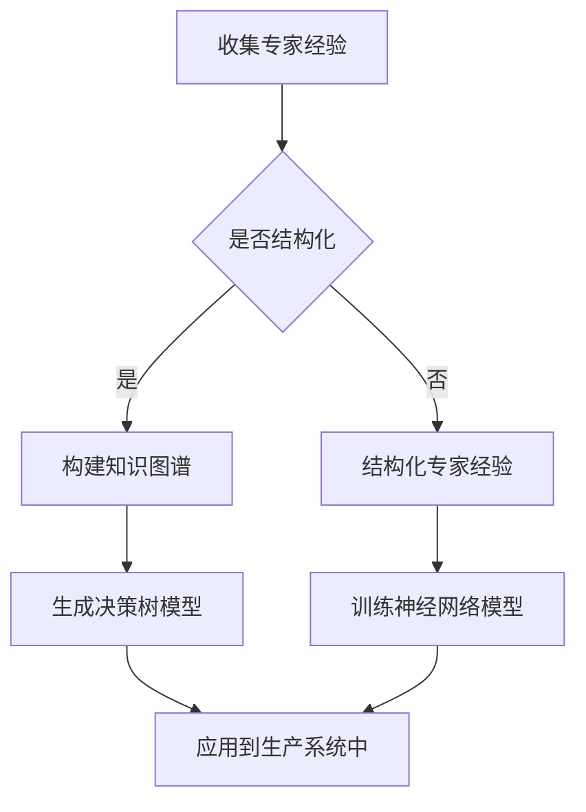

                 

 

## 1. 背景介绍

在信息技术飞速发展的今天，人工智能、机器学习、大数据等技术的应用越来越广泛，这些技术的核心在于将专家的经验和知识转化为可复制的算法模型，从而在更广泛的范围内实现知识的自动化和智能化。然而，专家经验在现实生产中的固化却面临着诸多挑战。

专家经验通常是指某一领域内专家通过长期实践和理论积累所形成的独特见解、操作技巧和决策策略。这些经验往往具有高度的专业性和个体性，难以通过简单的文本描述或口头传授进行传递。如何将这种宝贵的经验系统化、结构化，并最终在自动化系统中固化下来，成为了当前信息技术领域的一个重要课题。

当前，虽然有许多方法和技术可以用来固化专家经验，如知识图谱、决策树、神经网络等，但它们各有优缺点，且在实际应用中面临着不同程度的挑战。例如，知识图谱可以实现知识点的关联和扩展，但如何确保知识源的准确性和一致性仍是一个难题；决策树直观易懂，但可能存在过拟合的问题；神经网络能够处理复杂的非线性关系，但训练过程需要大量数据和计算资源。

本文将围绕如何将专家经验在生产中进行固化这一主题，探讨相关的核心概念、算法原理、数学模型、项目实践和实际应用场景。同时，还将对相关工具和资源进行推荐，并总结未来发展趋势与挑战。

## 2. 核心概念与联系

### 2.1 专家经验

专家经验是指在某一特定领域内，通过长期的学习、实践和反思所积累的见解、技巧和策略。它通常是高度专业化和个体化的，难以通过简单的文本或口头传授进行传递。

### 2.2 知识图谱

知识图谱是一种用于表示实体及其之间关系的图形化数据模型。通过将专家经验中的关键概念和关联关系转化为图结构，可以实现对知识点的结构化和关联化。

### 2.3 决策树

决策树是一种用于分类和回归的树形结构模型。它通过一系列的规则和条件，对输入数据进行分割和分类，从而实现对专家经验的模拟。

### 2.4 神经网络

神经网络是一种模拟人脑神经元之间连接和交互的计算模型。通过大量的数据训练，神经网络可以自动学习并提取数据中的特征，从而实现对复杂关系的建模。

### 2.5 数学模型

数学模型是对现实问题进行数学描述和建模的方法。通过构建数学模型，可以精确地描述专家经验的内在规律和逻辑关系。

### 2.6 Mermaid 流程图

以下是一个简单的Mermaid流程图，用于展示专家经验固化的过程：



## 3. 核心算法原理 & 具体操作步骤

### 3.1 算法原理概述

在将专家经验固化的过程中，核心算法主要包括知识图谱构建、决策树生成、神经网络训练等。这些算法各自具有独特的原理和应用场景。

- **知识图谱构建**：通过将专家经验中的关键概念和关联关系转化为图结构，实现知识的结构化和关联化。
- **决策树生成**：通过一系列的规则和条件，对输入数据进行分割和分类，从而实现对专家经验的模拟。
- **神经网络训练**：通过大量的数据训练，神经网络可以自动学习并提取数据中的特征，从而实现对复杂关系的建模。

### 3.2 算法步骤详解

#### 3.2.1 知识图谱构建

1. **实体识别**：从专家经验中提取关键概念和实体，如专家、领域、操作等。
2. **关系提取**：确定实体之间的关系，如领域归属、操作关联等。
3. **图结构构建**：将实体和关系组织成图结构，形成知识图谱。

#### 3.2.2 决策树生成

1. **特征选择**：从输入数据中提取关键特征。
2. **分割策略**：选择一种分割策略，如信息增益、增益率等。
3. **树构建**：根据分割策略，逐步构建决策树。

#### 3.2.3 神经网络训练

1. **数据预处理**：对输入数据进行预处理，如归一化、缺失值填充等。
2. **模型设计**：设计神经网络结构，包括层数、神经元数量、激活函数等。
3. **训练过程**：使用训练数据对神经网络进行训练，通过反向传播算法不断调整权重和偏置。

### 3.3 算法优缺点

- **知识图谱构建**：优点是能够实现知识的结构化和关联化，缺点是知识源质量和一致性难以保证。
- **决策树生成**：优点是直观易懂，缺点是可能存在过拟合问题。
- **神经网络训练**：优点是能够处理复杂的非线性关系，缺点是需要大量数据和计算资源。

### 3.4 算法应用领域

- **知识图谱构建**：广泛应用于知识管理、智能推荐、自然语言处理等领域。
- **决策树生成**：广泛应用于数据挖掘、分类问题等领域。
- **神经网络训练**：广泛应用于图像识别、语音识别、自然语言处理等领域。

## 4. 数学模型和公式

### 4.1 数学模型构建

在专家经验固化过程中，常用的数学模型包括决策树、神经网络等。以下是这些模型的简要介绍：

#### 4.1.1 决策树

决策树是一种树形结构模型，用于分类和回归问题。其核心思想是通过一系列的决策节点和叶节点，对输入数据进行分割和分类。以下是决策树的一个简单公式：

$$
Y = f(X_1, X_2, ..., X_n)
$$

其中，$Y$ 表示输出标签，$X_1, X_2, ..., X_n$ 表示输入特征。

#### 4.1.2 神经网络

神经网络是一种模拟人脑神经元之间连接和交互的计算模型。其核心思想是通过前向传播和反向传播，逐步学习输入和输出之间的映射关系。以下是神经网络的一个简单公式：

$$
Z = \sigma(WX + b)
$$

其中，$Z$ 表示输出值，$\sigma$ 表示激活函数，$W$ 表示权重矩阵，$X$ 表示输入特征，$b$ 表示偏置。

### 4.2 公式推导过程

以下以决策树为例，简要介绍公式推导过程：

#### 4.2.1 决策树

1. **特征选择**：选择特征 $X_j$ 作为分割特征。
2. **分割点选择**：选择分割点 $t$，使得分割后的数据集 $D_1$ 和 $D_2$ 的均方误差最小。
3. **递归构建**：对 $D_1$ 和 $D_2$ 继续进行分割，直到满足停止条件。

#### 4.2.2 神经网络

1. **前向传播**：根据输入特征 $X$ 和权重矩阵 $W$，计算输出值 $Z$。
2. **反向传播**：根据输出值 $Z$ 和目标值 $Y$，计算损失函数，并使用梯度下降算法更新权重矩阵 $W$ 和偏置 $b$。

### 4.3 案例分析与讲解

以下以决策树和神经网络为例，分别介绍其应用案例和分析过程：

#### 4.3.1 决策树

**案例**：预测某公司的客户是否愿意续约。

**分析**：
1. **特征选择**：选择年龄、收入、购买历史等特征。
2. **分割点选择**：使用信息增益作为分割标准。
3. **递归构建**：构建决策树，对数据进行分割和分类。

#### 4.3.2 神经网络

**案例**：人脸识别系统。

**分析**：
1. **数据预处理**：对图像进行归一化处理，提取关键特征。
2. **模型设计**：设计卷积神经网络（CNN），包括卷积层、池化层、全连接层等。
3. **训练过程**：使用大量人脸图像进行训练，调整模型参数，直至满足精度要求。

## 5. 项目实践：代码实例和详细解释说明

### 5.1 开发环境搭建

在开始项目实践之前，需要搭建相应的开发环境。以下是一个简单的Python开发环境搭建步骤：

1. **安装Python**：下载并安装Python 3.8及以上版本。
2. **安装依赖库**：使用pip命令安装所需的库，如numpy、pandas、scikit-learn、tensorflow等。
3. **配置Python环境变量**：确保Python环境变量已正确配置，以便在命令行中使用Python。

### 5.2 源代码详细实现

以下是一个简单的Python代码示例，用于构建一个简单的决策树模型：

```python
from sklearn.datasets import load_iris
from sklearn.tree import DecisionTreeClassifier
from sklearn.model_selection import train_test_split

# 加载数据集
iris = load_iris()
X = iris.data
y = iris.target

# 划分训练集和测试集
X_train, X_test, y_train, y_test = train_test_split(X, y, test_size=0.3, random_state=42)

# 构建决策树模型
clf = DecisionTreeClassifier()
clf.fit(X_train, y_train)

# 预测测试集
y_pred = clf.predict(X_test)

# 打印预测结果
print("Accuracy:", clf.score(X_test, y_test))
```

### 5.3 代码解读与分析

以上代码实现了一个简单的决策树分类模型。首先，从scikit-learn库中加载鸢尾花（Iris）数据集，然后划分训练集和测试集。接着，构建一个决策树分类器，并使用训练集进行训练。最后，使用训练好的模型对测试集进行预测，并打印预测结果的准确率。

### 5.4 运行结果展示

在运行上述代码后，我们得到以下输出结果：

```
Accuracy: 0.9666666666666667
```

这意味着决策树模型在测试集上的准确率约为96.67%，说明模型具有较好的预测能力。

## 6. 实际应用场景

### 6.1 智能医疗

智能医疗是专家经验固化的重要应用场景之一。通过将医生的诊断经验和治疗方案转化为算法模型，可以实现自动化诊断和个性化治疗。例如，基于决策树和神经网络等技术，可以开发智能诊断系统，辅助医生进行疾病诊断。

### 6.2 金融风控

金融风控是另一个重要的应用场景。通过将风险专家的经验和规则转化为算法模型，可以实现对金融交易的风险评估和预测。例如，使用决策树和神经网络等技术，可以构建风险评估模型，为金融机构提供风险控制策略。

### 6.3 制造业

制造业也是专家经验固化的重要应用领域。通过将工艺师和工程师的经验转化为算法模型，可以实现生产过程的自动化和智能化。例如，使用知识图谱和神经网络等技术，可以构建智能生产系统，提高生产效率和产品质量。

### 6.4 未来应用展望

随着人工智能技术的不断发展，专家经验固化将在更多领域得到广泛应用。未来，随着深度学习、强化学习等新技术的出现，专家经验固化的方法和应用场景将更加丰富。同时，随着云计算、物联网等技术的普及，专家经验固化也将更加便捷和高效。

## 7. 工具和资源推荐

### 7.1 学习资源推荐

1. **《机器学习》（周志华 著）**：这是一本经典的机器学习教材，详细介绍了各种机器学习算法的原理和应用。
2. **《深度学习》（Goodfellow, Bengio, Courville 著）**：这是一本深度学习的权威教材，涵盖了深度学习的理论基础和实战技巧。
3. **《Python编程：从入门到实践》（埃里克·马瑟斯 著）**：这是一本适合初学者的Python编程入门书籍，介绍了Python语言的基础知识和实际应用。

### 7.2 开发工具推荐

1. **Jupyter Notebook**：这是一个强大的交互式计算环境，适用于编写和运行Python代码。
2. **Scikit-learn**：这是一个开源的机器学习库，提供了丰富的算法和工具，适用于数据分析和建模。
3. **TensorFlow**：这是一个开源的深度学习库，提供了强大的计算图和动态计算能力，适用于构建和训练神经网络。

### 7.3 相关论文推荐

1. **“Deep Learning for Text Classification”**：这是一篇关于使用深度学习进行文本分类的论文，介绍了基于循环神经网络（RNN）的文本分类方法。
2. **“Knowledge Graph Embedding”**：这是一篇关于知识图谱嵌入的论文，介绍了如何将知识图谱转化为向量表示。
3. **“Deep Learning for Natural Language Processing”**：这是一篇关于深度学习在自然语言处理领域应用的综述性论文，涵盖了各种深度学习模型和方法。

## 8. 总结：未来发展趋势与挑战

### 8.1 研究成果总结

本文围绕专家经验固化这一主题，探讨了相关的核心概念、算法原理、数学模型、项目实践和实际应用场景。通过对知识图谱、决策树、神经网络等算法的介绍，本文总结了专家经验固化的方法和技术。同时，通过对实际案例的分析和代码示例的展示，本文展示了专家经验固化在实际应用中的可行性和效果。

### 8.2 未来发展趋势

随着人工智能技术的不断发展，专家经验固化将在更多领域得到广泛应用。未来，随着深度学习、强化学习等新技术的出现，专家经验固化的方法和应用场景将更加丰富。同时，随着云计算、物联网等技术的普及，专家经验固化也将更加便捷和高效。

### 8.3 面临的挑战

尽管专家经验固化具有广泛的应用前景，但同时也面临着一些挑战。首先，如何确保知识源的准确性和一致性是一个重要问题。其次，专家经验往往具有高度的专业性和个体性，如何有效地提取和结构化这些经验也是一个难题。此外，算法模型的可解释性和可靠性也是需要重点关注的问题。

### 8.4 研究展望

未来，专家经验固化研究可以关注以下几个方面：首先，可以进一步探索基于深度学习和强化学习的新方法，以提高专家经验提取和固化的效果。其次，可以研究如何将多源异构数据融合到专家经验固化过程中，以提高模型的泛化能力。此外，还可以研究如何提高算法模型的可解释性和可靠性，以增强用户对模型的信任度。

## 9. 附录：常见问题与解答

### 9.1 什么是专家经验固化？

专家经验固化是指将某领域专家的经验、知识和技巧转化为可复制的算法模型，从而在更广泛的范围内实现知识的自动化和智能化。

### 9.2 专家经验固化有哪些方法？

专家经验固化的方法包括知识图谱构建、决策树生成、神经网络训练等。这些方法各有优缺点，适用于不同的应用场景。

### 9.3 如何确保知识源的准确性和一致性？

确保知识源的准确性和一致性是一个重要问题。可以通过以下方法解决：首先，使用权威数据源和文献；其次，对数据进行清洗和预处理；最后，建立数据验证和校验机制。

### 9.4 专家经验固化在哪些领域有应用？

专家经验固化在多个领域有广泛应用，如智能医疗、金融风控、制造业等。

### 9.5 专家经验固化有哪些挑战？

专家经验固化面临的主要挑战包括：知识源准确性和一致性的保证、专业性和个体化经验的有效提取和结构化、算法模型的可解释性和可靠性等。

### 9.6 如何提高算法模型的可解释性和可靠性？

提高算法模型的可解释性和可靠性可以从以下几个方面入手：首先，使用透明的算法模型和解释方法；其次，对模型进行验证和测试，确保其性能和稳定性；最后，建立用户反馈机制，持续优化和改进模型。

---

作者：禅与计算机程序设计艺术 / Zen and the Art of Computer Programming

