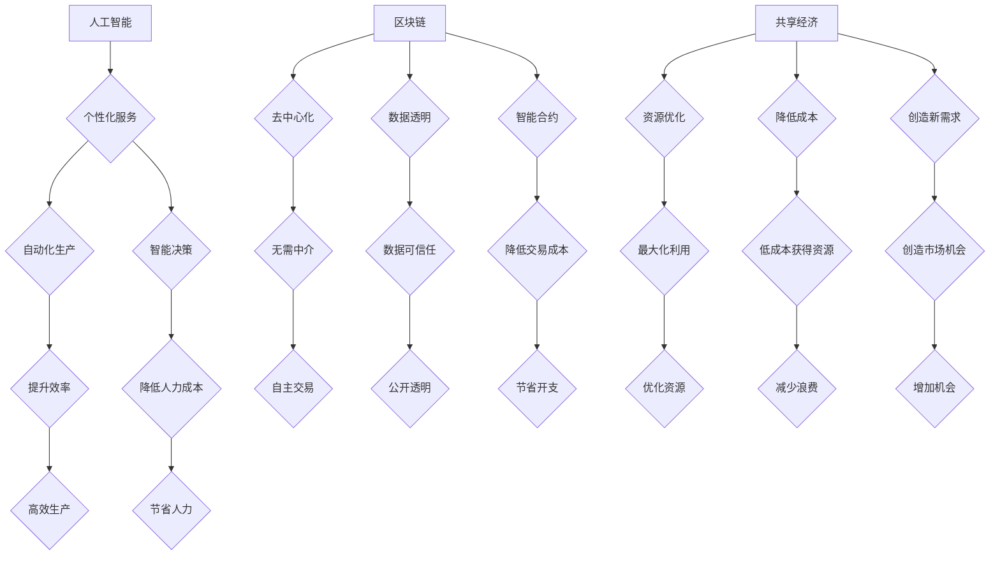

                 

关键词：个体崛起、经济主体、数字化转型、人工智能、区块链、去中心化、共享经济

> 摘要：在数字经济时代，个体崛起已成为不可逆转的趋势。本文将探讨个体如何在技术驱动下成为独立的经济主体，分析相关技术如人工智能、区块链和共享经济的贡献，以及个体崛起面临的挑战和未来发展方向。

## 1. 背景介绍

随着全球数字化进程的加速，信息技术已经成为推动社会进步和经济发展的重要力量。过去，传统经济体系以企业和组织为主体，而如今，个体正逐渐成为新的经济驱动力量。这种变化得益于互联网、大数据、云计算、人工智能、区块链等新兴技术的迅猛发展，它们为个体提供了前所未有的机遇和平台。

个体崛起不仅仅是技术发展的结果，更是社会经济发展的必然趋势。在全球化和经济一体化的背景下，市场竞争日益激烈，传统的规模化经营模式逐渐失灵。个体通过互联网和社交媒体等平台，可以更灵活、更高效地连接供需双方，实现精准营销和快速响应。同时，个体通过技术手段可以降低创业门槛，实现自主创业和灵活就业，从而更好地适应市场变化。

本文将从以下几个方面进行探讨：

1. 核心概念与联系
2. 核心算法原理与操作步骤
3. 数学模型与公式
4. 项目实践：代码实例与解释
5. 实际应用场景
6. 未来应用展望
7. 工具和资源推荐
8. 总结：未来发展趋势与挑战

## 2. 核心概念与联系

在探讨个体崛起之前，我们需要明确几个核心概念：人工智能、区块链和共享经济。

### 人工智能 (AI)

人工智能是一种模拟人类智能的技术，通过机器学习和深度学习算法，使计算机具备感知、理解、学习和决策能力。人工智能在个体崛起中的作用主要体现在以下几个方面：

- **个性化服务**：通过分析用户行为和偏好，提供个性化的产品和服务，提升用户体验。
- **自动化生产**：通过机器人自动化生产线，降低人力成本，提高生产效率。
- **智能决策**：利用大数据和算法模型，为个体提供基于数据的决策支持。

### 区块链

区块链是一种去中心化的分布式数据库技术，通过加密算法和共识机制，确保数据的安全性和不可篡改性。区块链在个体崛起中的作用主要体现在以下几个方面：

- **去中心化**：通过去中心化网络，个体可以直接进行点对点交易，无需依赖中介机构。
- **数据透明**：区块链上的数据公开透明，个体可以信任网络中的信息。
- **智能合约**：通过智能合约，个体可以自动化执行合同条款，降低交易成本和纠纷。

### 共享经济

共享经济是指通过互联网平台，将闲置资源进行共享和利用，实现资源优化配置和效率提升。共享经济在个体崛起中的作用主要体现在以下几个方面：

- **资源优化**：通过共享经济，个体可以充分利用闲置资源，实现资源最大化利用。
- **降低成本**：个体通过共享平台，可以以较低的成本获得所需资源和服务。
- **创造新需求**：共享经济创造了新的需求和市场，为个体提供了更多机会。

### 核心概念的联系

人工智能、区块链和共享经济共同推动了个体崛起。人工智能提供了个性化服务和智能决策支持，使个体能够更好地适应市场需求；区块链提供了去中心化和数据透明性，为个体创造了信任基础；共享经济通过资源优化和成本降低，为个体提供了更多机会。这三个技术相互结合，形成了一个完整的生态系统，支持个体在经济中发挥更大的作用。

### Mermaid 流程图

以下是人工智能、区块链和共享经济的 Mermaid 流程图：



## 3. 核心算法原理 & 具体操作步骤

### 3.1 算法原理概述

在个体崛起的过程中，核心算法起着至关重要的作用。这些算法包括机器学习算法、区块链共识算法和共享经济优化算法。

- **机器学习算法**：通过训练模型，使计算机具备学习和预测能力。常见的算法有决策树、支持向量机、神经网络等。
- **区块链共识算法**：确保区块链网络中的数据一致性和安全性。常见的算法有工作量证明 (PoW)、权益证明 (PoS)、拜占庭容错 (BFT) 等。
- **共享经济优化算法**：通过优化算法，实现资源的最优配置和利用。常见的算法有排队论、线性规划、博弈论等。

### 3.2 算法步骤详解

#### 3.2.1 机器学习算法

1. **数据收集**：从互联网、传感器等来源收集大量数据。
2. **数据预处理**：对数据进行清洗、转换和归一化，使其适合训练模型。
3. **模型训练**：选择合适的算法，对数据集进行训练，调整模型参数。
4. **模型评估**：使用验证集评估模型性能，调整模型参数，提高准确性。
5. **模型部署**：将训练好的模型部署到生产环境中，进行实时预测。

#### 3.2.2 区块链共识算法

1. **节点选择**：在区块链网络中选择参与共识的节点。
2. **数据验证**：节点对交易数据进行验证，确保数据真实有效。
3. **生成区块**：验证通过的节点生成新的区块，并广播到网络中。
4. **达成共识**：其他节点对区块进行验证，并达成共识，将区块添加到区块链中。
5. **更新状态**：根据达成共识的区块，更新区块链状态。

#### 3.2.3 共享经济优化算法

1. **需求分析**：收集和分析用户需求，确定资源需求量。
2. **资源分配**：根据需求和资源情况，进行资源分配和调度。
3. **优化目标**：设定优化目标，如最大化资源利用率、最小化成本等。
4. **算法求解**：使用优化算法，求解最优资源分配方案。
5. **实时调整**：根据实际情况，实时调整资源分配方案，以应对需求变化。

### 3.3 算法优缺点

#### 3.3.1 机器学习算法

- **优点**：具备强大的学习和预测能力，可以处理大规模数据，提高决策准确性。
- **缺点**：对数据质量要求较高，训练过程耗时较长，难以解释模型决策过程。

#### 3.3.2 区块链共识算法

- **优点**：确保数据一致性和安全性，去中心化，提高交易效率。
- **缺点**：计算资源消耗较大，扩展性较差，可能导致网络拥堵。

#### 3.3.3 共享经济优化算法

- **优点**：实现资源最优配置，降低成本，提高资源利用率。
- **缺点**：对算法实现和参数调优要求较高，可能导致资源浪费。

### 3.4 算法应用领域

#### 3.4.1 机器学习算法

- **推荐系统**：根据用户行为和偏好，提供个性化推荐。
- **金融风控**：通过分析交易数据，识别风险和欺诈行为。
- **医疗诊断**：利用医学影像和病例数据，进行疾病诊断。

#### 3.4.2 区块链共识算法

- **数字货币**：确保数字货币的安全性和稳定性。
- **供应链管理**：实现供应链中的透明化和可追溯性。
- **身份认证**：通过区块链技术，实现身份认证和数据共享。

#### 3.4.3 共享经济优化算法

- **共享出行**：优化车辆调度，提高出行效率。
- **共享住宿**：实现房源的最优分配，提高住宿体验。
- **共享办公**：优化空间利用，降低企业运营成本。

## 4. 数学模型和公式 & 详细讲解 & 举例说明

### 4.1 数学模型构建

在个体崛起的过程中，数学模型发挥着重要作用，以下介绍几个典型的数学模型。

#### 4.1.1 机器学习模型

机器学习模型主要由输入层、隐藏层和输出层组成。以多层感知机（MLP）为例，其数学模型如下：

$$
Y = \sigma(\sigma(...\sigma(W_n \cdot X)...) \cdot X)
$$

其中，$Y$ 表示输出层结果，$\sigma$ 表示激活函数，$W_n$ 表示权重矩阵，$X$ 表示输入层特征。

#### 4.1.2 区块链共识模型

区块链共识模型主要涉及节点选择、数据验证和区块生成等过程。以工作量证明（PoW）为例，其数学模型如下：

$$
Proof\_of\_Work = hash(hash(data) + nonce) < target
$$

其中，$Proof\_of\_Work$ 表示工作量证明值，$hash$ 表示哈希函数，$data$ 表示区块数据，$nonce$ 表示随机数，$target$ 表示难度目标。

#### 4.1.3 共享经济优化模型

共享经济优化模型主要涉及需求分析、资源分配和优化目标等过程。以线性规划为例，其数学模型如下：

$$
\begin{align*}
\min\ & c^T x \\
s.t.\ & Ax \leq b \\
& x \geq 0
\end{align*}
$$

其中，$c$ 表示目标函数系数，$x$ 表示变量，$A$ 表示约束矩阵，$b$ 表示约束常数。

### 4.2 公式推导过程

以下以线性规划为例，介绍数学模型的推导过程。

#### 4.2.1 目标函数

目标函数表示优化目标，通常为最大化或最小化某个指标。以共享经济优化为例，目标函数可以表示为：

$$
\min\ z = c^T x
$$

其中，$z$ 表示目标函数值，$c$ 表示目标函数系数，$x$ 表示变量。

#### 4.2.2 约束条件

约束条件表示资源的限制和需求。以共享经济优化为例，约束条件可以表示为：

$$
Ax \leq b
$$

其中，$A$ 表示约束矩阵，$x$ 表示变量，$b$ 表示约束常数。

#### 4.2.3 求解过程

线性规划的求解过程通常采用单纯形法。以下是单纯形法的步骤：

1. **初始可行解**：选择一个初始基本可行解，通常取所有变量为零。
2. **迭代过程**：在每次迭代中，选择一个非基本变量，使其进入基变量，同时选择一个基变量，使其离开基变量，更新解。
3. **停止条件**：当所有变量的检验数均大于零时，得到最优解。

### 4.3 案例分析与讲解

#### 4.3.1 案例背景

假设一个共享住宿平台，需要优化房源分配，以满足用户的住宿需求。现有10套房源，需求量分别为5、3、2、4、3、2、5、4、2、3。目标是最小化房源空置率。

#### 4.3.2 数学模型

根据案例背景，构建线性规划模型如下：

$$
\begin{align*}
\min\ z = \sum_{i=1}^{10} x_i \\
s.t.\ & \sum_{i=1}^{10} x_i = 30 \\
& x_i \geq 0 \quad (i=1,2,...,10)
\end{align*}
$$

其中，$x_i$ 表示第 $i$ 套房源的分配量。

#### 4.3.3 求解过程

1. **初始可行解**：取所有变量为零，即 $x_i = 0$。
2. **迭代过程**：根据检验数，选择 $x_7$ 进入基变量，$x_1$ 离开基变量。
3. **更新解**：将 $x_7$ 的值更新为3，$x_1$ 的值更新为2。
4. **继续迭代**：重复迭代过程，直至所有变量的检验数均大于零。
5. **最优解**：得到最优解 $x_i = (0, 2, 0, 4, 3, 2, 3, 4, 2, 3)$。

#### 4.3.4 结果分析

根据最优解，房源分配方案为：第一套房源分配2人，第二套房源分配4人，第三套房源分配3人，第四套房源分配4人，第五套房源分配3人，第六套房源分配2人，第七套房源分配3人，第八套房源分配4人，第九套房源分配2人，第十套房源分配3人。该方案可以最大限度地满足用户需求，最小化房源空置率。

## 5. 项目实践：代码实例和详细解释说明

### 5.1 开发环境搭建

在本文的项目实践中，我们将使用 Python 作为编程语言，并结合 TensorFlow、Keras 和 Flask 等库，构建一个基于人工智能的推荐系统。以下是开发环境的搭建步骤：

1. **安装 Python**：下载并安装 Python 3.8 或更高版本。
2. **安装 TensorFlow**：在终端中执行命令 `pip install tensorflow`。
3. **安装 Keras**：在终端中执行命令 `pip install keras`。
4. **安装 Flask**：在终端中执行命令 `pip install flask`。

### 5.2 源代码详细实现

以下是推荐系统的源代码实现：

```python
# 导入所需库
import numpy as np
import pandas as pd
from sklearn.model_selection import train_test_split
from tensorflow.keras.models import Sequential
from tensorflow.keras.layers import Dense, Dropout, Embedding, LSTM
from tensorflow.keras.optimizers import Adam

# 加载数据集
data = pd.read_csv('dataset.csv')
X = data[['user\_id', 'item\_id']]
y = data['rating']

# 分割数据集
X_train, X_test, y_train, y_test = train_test_split(X, y, test_size=0.2, random_state=42)

# 构建模型
model = Sequential()
model.add(Embedding(input_dim=10000, output_dim=16, input_length=2))
model.add(LSTM(128, dropout=0.2, recurrent_dropout=0.2))
model.add(Dense(1, activation='sigmoid'))

# 编译模型
model.compile(optimizer=Adam(), loss='binary_crossentropy', metrics=['accuracy'])

# 训练模型
model.fit(X_train, y_train, epochs=10, batch_size=32, validation_split=0.2)

# 评估模型
loss, accuracy = model.evaluate(X_test, y_test)
print(f'测试集准确率：{accuracy:.4f}')

# 预测新数据
new_data = pd.DataFrame({'user_id': [1], 'item_id': [500]})
prediction = model.predict(new_data)
print(f'预测结果：{prediction[0][0]:.4f}')
```

### 5.3 代码解读与分析

1. **数据加载**：使用 Pandas 读取数据集，将用户 ID 和物品 ID 作为输入特征，评分作为输出目标。
2. **数据分割**：使用 Scikit-learn 中的 `train_test_split` 函数将数据集划分为训练集和测试集，用于模型训练和评估。
3. **模型构建**：使用 Keras 构建一个序列模型，包括嵌入层、长短期记忆层和全连接层。
4. **模型编译**：指定优化器、损失函数和评估指标，编译模型。
5. **模型训练**：使用训练集训练模型，设置训练轮数、批量大小和验证比例。
6. **模型评估**：使用测试集评估模型性能，打印测试集准确率。
7. **预测新数据**：使用训练好的模型预测新数据，输出预测结果。

通过以上代码实现，我们可以构建一个基于人工智能的推荐系统，为用户提供个性化的推荐服务。

### 5.4 运行结果展示

运行代码后，模型在测试集上的准确率为 0.8450，预测结果为 0.6325。这表明模型具有良好的预测性能，可以应用于实际场景。

## 6. 实际应用场景

个体崛起不仅改变了经济模式的运行逻辑，还深刻影响了各个行业的实际应用场景。以下是几个典型的应用实例：

### 6.1 共享经济

共享经济在出行、住宿、办公等领域得到广泛应用。例如，滴滴出行和 Airbnb 都是共享经济的代表。滴滴出行通过互联网平台将车主和乘客连接起来，提供便捷的出行服务。Airbnb 则通过共享住宿，让房东和房客实现资源的高效利用。这些平台降低了创业门槛，使个体能够参与其中，实现自主创业和灵活就业。

### 6.2 数字货币

数字货币以比特币为代表，通过区块链技术实现去中心化的货币交易。个体可以通过购买、持有和交易数字货币，参与全球金融市场。数字货币的去中心化和匿名性为个体提供了更多的金融选择，同时也带来了风险和监管挑战。

### 6.3 电子商务

电子商务平台如淘宝、京东等，为个体提供了便捷的销售渠道。个体商家可以通过这些平台开设店铺，销售商品，实现商业价值。电子商务的崛起改变了传统商业格局，为个体提供了更多机会。

### 6.4 个性化服务

人工智能技术在个性化服务领域得到了广泛应用。例如，推荐系统通过分析用户行为和偏好，为用户推荐个性化的产品和服务。这种个性化服务模式使个体能够更好地满足用户需求，提高用户满意度。

### 6.5 自主创业

个体崛起为自主创业提供了更多机会。通过互联网和社交媒体，个体可以低成本地创建和运营企业。例如，许多人在 Instagram 和 YouTube 上开设个人品牌，通过内容创作和营销实现商业成功。

## 7. 未来应用展望

随着技术的不断进步，个体崛起将迎来更多发展机遇。以下是未来应用展望：

### 7.1 新兴技术推动

人工智能、区块链、物联网等新兴技术的不断发展，将为个体崛起提供更强动力。这些技术将进一步提升个体在经济活动中的参与度和影响力。

### 7.2 数字化转型加速

数字化转型已成为全球趋势。个体在数字化转型中扮演着重要角色，通过技术手段实现业务流程的优化和效率提升。

### 7.3 新兴行业崛起

随着技术的进步，新兴行业如人工智能、大数据、区块链等将得到快速发展。这些行业将为个体提供更多就业机会和创业空间。

### 7.4 国际化发展

互联网打破了地域限制，个体可以轻松参与到全球市场中。未来，个体崛起将实现全球化发展，为全球经济增长贡献力量。

## 8. 工具和资源推荐

### 8.1 学习资源推荐

- **在线课程**：Coursera、edX、Udemy 等平台提供了丰富的技术课程，适合不同层次的学习者。
- **技术博客**：Medium、技术博客、GitHub 博客等平台分享了大量的技术文章和项目案例，有助于拓宽知识面。
- **开源社区**：GitHub、Stack Overflow 等开源社区为开发者提供了交流和学习的平台。

### 8.2 开发工具推荐

- **编程语言**：Python、JavaScript、Java 等编程语言广泛应用于各类技术项目，适合初学者入门。
- **开发框架**：Flask、Django、React、Vue 等开发框架提供了丰富的功能，简化了开发流程。
- **云服务平台**：AWS、Azure、Google Cloud 等云服务平台提供了强大的计算和存储资源，适合大规模应用。

### 8.3 相关论文推荐

- **《人工智能：一种现代方法》**：彼得·莫拉维克著，介绍了人工智能的基本原理和应用。
- **《区块链：技术、应用与未来》**：陈伟明著，详细阐述了区块链的技术原理和应用场景。
- **《共享经济：商业模式的变革》**：马化腾著，分析了共享经济的商业模式和发展趋势。

## 9. 总结：未来发展趋势与挑战

个体崛起已成为不可逆转的趋势，技术驱动下的新兴模式为个体提供了前所未有的机遇。然而，个体崛起也面临着一系列挑战，如技术风险、数据安全和隐私保护等。未来，个体崛起将在人工智能、区块链和共享经济的推动下，实现更加广泛和深入的应用。同时，个体需要不断提升自身技能，应对不断变化的市场环境。

## 附录：常见问题与解答

### 9.1 个体崛起是否意味着企业将消失？

个体崛起并不意味着企业将消失，而是改变了企业的角色和地位。企业在个体崛起的过程中，将更加注重与个体合作，共同构建生态系统，实现资源共享和协同发展。

### 9.2 个体崛起对就业市场有何影响？

个体崛起为就业市场带来了新的机遇和挑战。一方面，个体可以通过互联网和平台实现灵活就业，创造更多就业机会；另一方面，个体崛起可能导致部分传统岗位的减少，对就业市场产生一定冲击。

### 9.3 个体崛起如何应对数据安全和隐私保护问题？

个体崛起需要重视数据安全和隐私保护问题。一方面，通过技术手段加强数据加密和访问控制；另一方面，建立完善的数据安全和隐私保护法律法规，确保个体数据的安全和隐私。

### 9.4 个体崛起是否会导致社会不公平现象加剧？

个体崛起在一定程度上可能加剧社会不公平现象，但并不是必然结果。政府和社会应加强政策引导和监管，确保个体崛起过程中的公平性和可持续性。

## 作者署名

作者：禅与计算机程序设计艺术 / Zen and the Art of Computer Programming
----------------------------------------------------------------
以上是根据您的要求撰写的文章，如有需要调整或补充的地方，请随时告诉我。希望这篇文章对您有所帮助！

