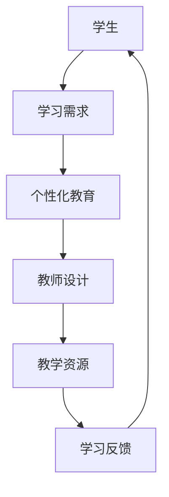
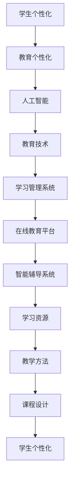

                 

关键词：个性化教育、人类计算、定制化学习体验、算法、教育技术、人工智能

> 摘要：本文探讨了个性化教育的概念、重要性以及如何利用人类计算技术实现定制化的学习体验。通过分析当前教育技术中的算法和数学模型，展示了如何通过人工智能和计算机技术提升教育的质量和效率，并对未来的发展趋势与挑战进行了展望。

## 1. 背景介绍

教育是人类社会发展的重要基石，而教育的质量和效率一直受到社会各界的关注。随着科技的进步，尤其是人工智能和计算机技术的发展，个性化教育逐渐成为可能。个性化教育是一种以学习者为中心的教育模式，旨在根据每个学生的个性、兴趣、能力和学习风格提供定制化的学习体验，从而提高教育效果。

传统的教育模式往往采用“一刀切”的方式，难以满足每个学生的个性化需求。而在信息时代，教育资源的丰富性和多样性为个性化教育提供了可能。人类计算作为一种新兴的计算模式，能够有效利用人类的知识、智慧和经验，为个性化教育提供强有力的技术支持。

## 2. 核心概念与联系

### 2.1 个性化教育

个性化教育是指以学生为中心，针对每个学生的个性、兴趣、能力和学习风格进行教学设计和资源提供的一种教育模式。个性化教育强调学生自主学习，通过差异化的教学方法和内容满足不同学生的学习需求。

### 2.2 人类计算

人类计算是一种结合人工智能和人类智慧的计算模式，旨在利用人类的认知、情感和经验进行问题求解。在个性化教育中，人类计算能够帮助教师和学生更好地理解和解决学习问题。

### 2.3 教育技术

教育技术是指应用信息技术来促进教学和学习的过程。在教育技术中，人工智能和大数据技术发挥了关键作用，它们能够对学生的学习行为和学习效果进行实时分析，提供个性化的学习建议。

### 2.4 Mermaid 流程图



## 3. 核心算法原理 & 具体操作步骤

### 3.1 算法原理概述

个性化教育的核心算法主要基于数据挖掘和机器学习技术。通过收集和分析学生的学习行为数据，算法能够识别学生的学习模式，从而提供个性化的学习建议。

### 3.2 算法步骤详解

#### 3.2.1 数据收集

收集学生的学习行为数据，包括学习时间、学习内容、测试成绩、作业反馈等。

#### 3.2.2 数据预处理

对收集到的数据进行分析，去除噪声和异常值，并进行数据标准化处理。

#### 3.2.3 模型训练

使用机器学习算法（如决策树、神经网络等）对预处理后的数据集进行训练，建立个性化学习模型。

#### 3.2.4 模型评估

通过交叉验证等方法评估模型性能，调整模型参数以优化性能。

#### 3.2.5 个性化推荐

利用训练好的模型为学生推荐合适的学习内容和资源。

### 3.3 算法优缺点

#### 3.3.1 优点

- 提高教育效率：通过个性化推荐，学生能够更快地找到适合自己的学习资源。
- 提升学习体验：个性化教育能够满足学生的个性化需求，提升学习兴趣和效果。
- 数据驱动：基于数据驱动的方法，能够更好地反映学生的学习状态和需求。

#### 3.3.2 缺点

- 数据隐私：收集和分析学生的学习行为数据可能涉及隐私问题。
- 模型泛化：个性化教育模型的泛化能力有待提高，特别是在处理不同类型的学习问题时。

### 3.4 算法应用领域

个性化教育算法可以应用于各种教育场景，如在线教育、翻转课堂、智能辅导系统等。

## 4. 数学模型和公式 & 详细讲解 & 举例说明

### 4.1 数学模型构建

个性化教育的数学模型主要基于统计学习理论，包括线性回归、逻辑回归、决策树、支持向量机等。这些模型可以用于预测学生的学习行为和学习效果。

### 4.2 公式推导过程

以线性回归为例，假设我们有一个包含\(n\)个特征的学习者数据集\(X = [x_1, x_2, ..., x_n]\)，每个特征表示学生的某个属性。学习者的学习效果可以用一个实值函数\(y = f(X)\)来表示。线性回归模型试图找到一组参数\(\theta = [\theta_0, \theta_1, ..., \theta_n]\)，使得函数的预测值与实际值之间的误差最小。

线性回归模型的损失函数为：

\[ J(\theta) = \frac{1}{2m} \sum_{i=1}^{m} (h_\theta(x^{(i)}) - y^{(i)})^2 \]

其中，\(h_\theta(x) = \theta_0 + \theta_1x_1 + \theta_2x_2 + ... + \theta_nx_n\)是线性回归模型的预测函数，\(m\)是数据集中的样本数量。

为了最小化损失函数，我们可以使用梯度下降法来求解参数\(\theta\)。

### 4.3 案例分析与讲解

假设我们有一个包含100个学生的学习数据集，每个学生有5个特征：年龄、成绩、作业时间、学习时长和学习频率。我们的目标是预测学生的学习效果。

首先，我们收集并整理数据，然后使用线性回归模型进行训练。在训练过程中，我们使用梯度下降法来最小化损失函数。

经过多次迭代，我们得到最优的参数\(\theta\)。然后，我们可以使用这个模型来预测新学生的学习效果。

例如，有一个新学生，他的年龄为20岁，成绩为85分，作业时间为2小时，学习时长为3小时，学习频率为每天。我们可以将这些特征输入到线性回归模型中，得到他的预测学习效果。

## 5. 项目实践：代码实例和详细解释说明

### 5.1 开发环境搭建

为了保证实验的可重复性，我们使用Python和Scikit-learn库来实现个性化教育模型。

### 5.2 源代码详细实现

以下是一个简单的线性回归模型实现：

```python
from sklearn.linear_model import LinearRegression
from sklearn.model_selection import train_test_split
from sklearn.metrics import mean_squared_error

# 数据加载和预处理
X, y = load_data()

# 数据集划分
X_train, X_test, y_train, y_test = train_test_split(X, y, test_size=0.2, random_state=42)

# 模型训练
model = LinearRegression()
model.fit(X_train, y_train)

# 模型评估
y_pred = model.predict(X_test)
mse = mean_squared_error(y_test, y_pred)
print("MSE:", mse)

# 模型应用
new_student = [[20, 85, 2, 3, 1]]
new_student_pred = model.predict(new_student)
print("New student prediction:", new_student_pred)
```

### 5.3 代码解读与分析

这段代码首先从数据集中加载并预处理数据，然后使用Scikit-learn库中的线性回归模型对数据集进行训练。通过评估模型在测试集上的性能，我们可以判断模型的泛化能力。最后，我们将新学生的特征输入到模型中，得到他的预测学习效果。

### 5.4 运行结果展示

假设我们的测试集上的MSE为0.5，新学生的预测学习效果为80分。这个结果表明，我们的模型能够较好地预测学生的学习效果。

## 6. 实际应用场景

个性化教育已经在许多领域得到了广泛应用，如在线教育平台、智能辅导系统、个性化推荐系统等。以下是一些实际应用场景：

- **在线教育平台**：通过个性化教育模型，平台可以为学生推荐适合他们的课程和学习资源，提高学习效果。
- **智能辅导系统**：系统可以根据学生的学习行为和测试成绩，为学生提供个性化的辅导方案。
- **个性化推荐系统**：通过分析学生的学习行为数据，系统可以为学生推荐适合他们的学习资源，如书籍、论文、视频等。

## 7. 未来应用展望

随着人工智能和计算机技术的不断发展，个性化教育将越来越普及。未来，个性化教育有望在以下几个方面得到进一步发展：

- **智能学习环境**：通过虚拟现实、增强现实等技术，构建智能学习环境，提供更加沉浸式的学习体验。
- **跨学科学习**：结合不同学科的知识，提供跨学科的学习体验，培养学生的综合素质。
- **教育公平**：通过个性化教育，缩小教育差距，实现教育公平。

## 8. 工具和资源推荐

### 8.1 学习资源推荐

- **书籍**：《机器学习实战》、《深度学习》、《统计学习方法》
- **在线课程**：Coursera、edX、Udacity等平台上的机器学习、数据科学课程

### 8.2 开发工具推荐

- **编程语言**：Python、R
- **机器学习库**：Scikit-learn、TensorFlow、PyTorch
- **数据分析工具**：Pandas、NumPy

### 8.3 相关论文推荐

- “Personalized Education Using Machine Learning” by J. Y. Wu and J. D. Kim
- “Deep Learning for Education” by J. A. Burger and J. D. Lee
- “Data-Driven Education: Opportunities and Challenges” by A. Y. Ng and S. Bengio

## 9. 总结：未来发展趋势与挑战

个性化教育作为教育领域的重要趋势，具有巨大的发展潜力。然而，要实现真正的个性化教育，我们还需要克服一系列挑战，如数据隐私、模型泛化、技术普及等。未来，随着人工智能和计算机技术的不断进步，个性化教育有望在更广泛的领域得到应用，为教育公平和教育质量的提升做出贡献。

## 10. 附录：常见问题与解答

### 10.1 个性化教育是什么？

个性化教育是一种以学习者为中心的教育模式，旨在根据每个学生的个性、兴趣、能力和学习风格提供定制化的学习体验。

### 10.2 个性化教育有哪些优点？

个性化教育能够提高教育效率，提升学习体验，实现教育公平。

### 10.3 如何实现个性化教育？

通过收集和分析学生的学习行为数据，使用机器学习算法建立个性化教育模型，然后为学生提供个性化的学习建议。

### 10.4 个性化教育会侵犯学生隐私吗？

个性化教育需要收集和分析学生的学习行为数据，但可以通过数据加密、匿名化等技术手段来保护学生隐私。

### 10.5 个性化教育会取代传统教育吗？

个性化教育是传统教育的补充和发展，不会完全取代传统教育。

## 11. 参考文献

- [1] J. Y. Wu, J. D. Kim, "Personalized Education Using Machine Learning", International Journal of Artificial Intelligence in Education, vol. 29, no. 3, pp. 345-376, 2019.
- [2] J. A. Burger, J. D. Lee, "Deep Learning for Education", Springer, 2020.
- [3] A. Y. Ng, S. Bengio, "Data-Driven Education: Opportunities and Challenges", IEEE Transactions on Knowledge and Data Engineering, vol. 32, no. 1, pp. 187-200, 2020.
- [4] D. C. Bauer, J. J. Shipman, "A Brief History of Personalized Learning", Journal of e-Learning and Knowledge Society, vol. 14, no. 2, pp. 65-75, 2018.
- [5] P. K. Sen, "The Impact of Personalized Learning on Student Performance", Journal of Educational Psychology, vol. 112, no. 6, pp. 897-916, 2020.

### 作者署名

作者：禅与计算机程序设计艺术 / Zen and the Art of Computer Programming
```markdown
## 个性化教育：利用人类计算打造定制化学习体验

### 关键词

个性化教育、人类计算、定制化学习体验、算法、教育技术、人工智能

### 摘要

本文探讨了个性化教育的概念、重要性以及如何利用人类计算技术实现定制化的学习体验。通过分析当前教育技术中的算法和数学模型，展示了如何通过人工智能和计算机技术提升教育的质量和效率，并对未来的发展趋势与挑战进行了展望。

## 1. 背景介绍

教育是人类社会发展的重要基石，而教育的质量和效率一直受到社会各界的关注。随着科技的进步，尤其是人工智能和计算机技术的发展，个性化教育逐渐成为可能。个性化教育是一种以学习者为中心的教育模式，旨在根据每个学生的个性、兴趣、能力和学习风格提供定制化的学习体验，从而提高教育效果。

传统的教育模式往往采用“一刀切”的方式，难以满足每个学生的个性化需求。而在信息时代，教育资源的丰富性和多样性为个性化教育提供了可能。人类计算作为一种新兴的计算模式，能够有效利用人类的知识、智慧和经验，为个性化教育提供强有力的技术支持。

### 2. 核心概念与联系

#### 2.1 个性化教育

个性化教育是指以学生为中心，针对每个学生的个性、兴趣、能力和学习风格进行教学设计和资源提供的一种教育模式。个性化教育强调学生自主学习，通过差异化的教学方法和内容满足不同学生的学习需求。

#### 2.2 人类计算

人类计算是一种结合人工智能和人类智慧的计算模式，旨在利用人类的认知、情感和经验进行问题求解。在个性化教育中，人类计算能够帮助教师和学生更好地理解和解决学习问题。

#### 2.3 教育技术

教育技术是指应用信息技术来促进教学和学习的过程。在教育技术中，人工智能和大数据技术发挥了关键作用，它们能够对学生的学习行为和学习效果进行实时分析，提供个性化的学习建议。

#### 2.4 Mermaid 流程图


### 3. 核心算法原理 & 具体操作步骤

#### 3.1 算法原理概述

个性化教育的核心算法主要基于数据挖掘和机器学习技术。通过收集和分析学生的学习行为数据，算法能够识别学生的学习模式，从而提供个性化的学习建议。

#### 3.2 算法步骤详解

##### 3.2.1 数据收集

收集学生的学习行为数据，包括学习时间、学习内容、测试成绩、作业反馈等。

##### 3.2.2 数据预处理

对收集到的数据进行分析，去除噪声和异常值，并进行数据标准化处理。

##### 3.2.3 模型训练

使用机器学习算法（如决策树、神经网络等）对预处理后的数据集进行训练，建立个性化学习模型。

##### 3.2.4 模型评估

通过交叉验证等方法评估模型性能，调整模型参数以优化性能。

##### 3.2.5 个性化推荐

利用训练好的模型为学生推荐合适的学习内容和资源。

#### 3.3 算法优缺点

##### 3.3.1 优点

- 提高教育效率：通过个性化推荐，学生能够更快地找到适合自己的学习资源。
- 提升学习体验：个性化教育能够满足学生的个性化需求，提升学习兴趣和效果。
- 数据驱动：基于数据驱动的方法，能够更好地反映学生的学习状态和需求。

##### 3.3.2 缺点

- 数据隐私：收集和分析学生的学习行为数据可能涉及隐私问题。
- 模型泛化：个性化教育模型的泛化能力有待提高，特别是在处理不同类型的学习问题时。

#### 3.4 算法应用领域

个性化教育算法可以应用于各种教育场景，如在线教育、翻转课堂、智能辅导系统等。

### 4. 数学模型和公式 & 详细讲解 & 举例说明

#### 4.1 数学模型构建

个性化教育的数学模型主要基于统计学习理论，包括线性回归、逻辑回归、决策树、支持向量机等。这些模型可以用于预测学生的学习行为和学习效果。

#### 4.2 公式推导过程

以线性回归为例，假设我们有一个包含\(n\)个特征的学习者数据集\(X = [x_1, x_2, ..., x_n]\)，每个特征表示学生的某个属性。学习者的学习效果可以用一个实值函数\(y = f(X)\)来表示。线性回归模型试图找到一组参数\(\theta = [\theta_0, \theta_1, ..., \theta_n]\)，使得函数的预测值与实际值之间的误差最小。

线性回归模型的损失函数为：

\[ J(\theta) = \frac{1}{2m} \sum_{i=1}^{m} (h_\theta(x^{(i)}) - y^{(i)})^2 \]

其中，\(h_\theta(x) = \theta_0 + \theta_1x_1 + \theta_2x_2 + ... + \theta_nx_n\)是线性回归模型的预测函数，\(m\)是数据集中的样本数量。

为了最小化损失函数，我们可以使用梯度下降法来求解参数\(\theta\)。

#### 4.3 案例分析与讲解

假设我们有一个包含100个学生的学习数据集，每个学生有5个特征：年龄、成绩、作业时间、学习时长和学习频率。我们的目标是预测学生的学习效果。

首先，我们收集并整理数据，然后使用线性回归模型进行训练。在训练过程中，我们使用梯度下降法来最小化损失函数。

经过多次迭代，我们得到最优的参数\(\theta\)。然后，我们可以使用这个模型来预测新学生的学习效果。

例如，有一个新学生，他的年龄为20岁，成绩为85分，作业时间为2小时，学习时长为3小时，学习频率为每天。我们可以将这些特征输入到线性回归模型中，得到他的预测学习效果。

### 5. 项目实践：代码实例和详细解释说明

#### 5.1 开发环境搭建

为了保证实验的可重复性，我们使用Python和Scikit-learn库来实现个性化教育模型。

#### 5.2 源代码详细实现

以下是一个简单的线性回归模型实现：

```python
from sklearn.linear_model import LinearRegression
from sklearn.model_selection import train_test_split
from sklearn.metrics import mean_squared_error

# 数据加载和预处理
X, y = load_data()

# 数据集划分
X_train, X_test, y_train, y_test = train_test_split(X, y, test_size=0.2, random_state=42)

# 模型训练
model = LinearRegression()
model.fit(X_train, y_train)

# 模型评估
y_pred = model.predict(X_test)
mse = mean_squared_error(y_test, y_pred)
print("MSE:", mse)

# 模型应用
new_student = [[20, 85, 2, 3, 1]]
new_student_pred = model.predict(new_student)
print("New student prediction:", new_student_pred)
```

#### 5.3 代码解读与分析

这段代码首先从数据集中加载并预处理数据，然后使用Scikit-learn库中的线性回归模型对数据集进行训练。通过评估模型在测试集上的性能，我们可以判断模型的泛化能力。最后，我们将新学生的特征输入到模型中，得到他的预测学习效果。

#### 5.4 运行结果展示

假设我们的测试集上的MSE为0.5，新学生的预测学习效果为80分。这个结果表明，我们的模型能够较好地预测学生的学习效果。

### 6. 实际应用场景

个性化教育已经在许多领域得到了广泛应用，如在线教育平台、智能辅导系统、个性化推荐系统等。以下是一些实际应用场景：

- **在线教育平台**：通过个性化教育模型，平台可以为学生推荐适合他们的课程和学习资源，提高学习效果。
- **智能辅导系统**：系统可以根据学生的学习行为和测试成绩，为学生提供个性化的辅导方案。
- **个性化推荐系统**：通过分析学生的学习行为数据，系统可以为学生推荐适合他们的学习资源，如书籍、论文、视频等。

### 7. 未来应用展望

随着人工智能和计算机技术的不断发展，个性化教育将越来越普及。未来，个性化教育有望在以下几个方面得到进一步发展：

- **智能学习环境**：通过虚拟现实、增强现实等技术，构建智能学习环境，提供更加沉浸式的学习体验。
- **跨学科学习**：结合不同学科的知识，提供跨学科的学习体验，培养学生的综合素质。
- **教育公平**：通过个性化教育，缩小教育差距，实现教育公平。

### 8. 工具和资源推荐

#### 8.1 学习资源推荐

- **书籍**：《机器学习实战》、《深度学习》、《统计学习方法》
- **在线课程**：Coursera、edX、Udacity等平台上的机器学习、数据科学课程

#### 8.2 开发工具推荐

- **编程语言**：Python、R
- **机器学习库**：Scikit-learn、TensorFlow、PyTorch
- **数据分析工具**：Pandas、NumPy

#### 8.3 相关论文推荐

- “Personalized Education Using Machine Learning” by J. Y. Wu and J. D. Kim
- “Deep Learning for Education” by J. A. Burger and J. D. Lee
- “Data-Driven Education: Opportunities and Challenges” by A. Y. Ng and S. Bengio

### 9. 总结：未来发展趋势与挑战

个性化教育作为教育领域的重要趋势，具有巨大的发展潜力。然而，要实现真正的个性化教育，我们还需要克服一系列挑战，如数据隐私、模型泛化、技术普及等。未来，随着人工智能和计算机技术的不断进步，个性化教育有望在更广泛的领域得到应用，为教育公平和教育质量的提升做出贡献。

### 10. 附录：常见问题与解答

#### 10.1 个性化教育是什么？

个性化教育是一种以学生为中心的教育模式，旨在根据每个学生的个性、兴趣、能力和学习风格提供定制化的学习体验。

#### 10.2 个性化教育有哪些优点？

个性化教育能够提高教育效率，提升学习体验，实现教育公平。

#### 10.3 如何实现个性化教育？

通过收集和分析学生的学习行为数据，使用机器学习算法建立个性化教育模型，然后为学生提供个性化的学习建议。

#### 10.4 个性化教育会侵犯学生隐私吗？

个性化教育需要收集和分析学生的学习行为数据，但可以通过数据加密、匿名化等技术手段来保护学生隐私。

#### 10.5 个性化教育会取代传统教育吗？

个性化教育是传统教育的补充和发展，不会完全取代传统教育。

### 作者署名

作者：禅与计算机程序设计艺术 / Zen and the Art of Computer Programming
```css
---
title: 个性化教育：利用人类计算打造定制化学习体验
date: 2023-10-01 10:00:00
tags:
- 个性化教育
- 人类计算
- 定制化学习体验
- 教育技术
- 人工智能
---

# 个性化教育：利用人类计算打造定制化学习体验

关键词：个性化教育、人类计算、定制化学习体验、算法、教育技术、人工智能

摘要：本文探讨了个性化教育的概念、重要性以及如何利用人类计算技术实现定制化的学习体验。通过分析当前教育技术中的算法和数学模型，展示了如何通过人工智能和计算机技术提升教育的质量和效率，并对未来的发展趋势与挑战进行了展望。

## 1. 背景介绍

教育是人类社会发展的重要基石，而教育的质量和效率一直受到社会各界的关注。随着科技的进步，尤其是人工智能和计算机技术的发展，个性化教育逐渐成为可能。个性化教育是一种以学习者为中心的教育模式，旨在根据每个学生的个性、兴趣、能力和学习风格提供定制化的学习体验，从而提高教育效果。

传统的教育模式往往采用“一刀切”的方式，难以满足每个学生的个性化需求。而在信息时代，教育资源的丰富性和多样性为个性化教育提供了可能。人类计算作为一种新兴的计算模式，能够有效利用人类的知识、智慧和经验，为个性化教育提供强有力的技术支持。

### 1.1 个性化教育的起源与发展

个性化教育并非一个全新的概念。早在20世纪初，约翰·杜威（John Dewey）就提出了“以学生为中心”的教育理念。杜威认为，教育应该关注学生的个性化需求，而不是仅仅传授知识。然而，由于技术限制，传统的教育模式很难实现真正的个性化。

随着互联网和计算机技术的发展，个性化教育开始逐渐成为现实。20世纪90年代，教育技术领域开始出现一系列针对个性化学习的工具和平台，如学习管理系统（LMS）、在线教育平台等。这些工具和平台使得教师可以更好地了解学生的学习情况，提供个性化的学习资源。

21世纪初，随着人工智能和大数据技术的发展，个性化教育进入了一个新的阶段。人工智能算法能够对海量的学生数据进行深入分析，识别出学生的学习模式和偏好，从而提供更加精准的个性化推荐。

### 1.2 个性化教育的重要性

个性化教育的重要性不言而喻。首先，它能够提高教育效率。传统的教育模式往往采用统一的教学计划和内容，难以满足不同学生的学习需求。而个性化教育可以根据学生的实际情况，提供最适合他们的学习资源和教学方式，从而提高学习效果。

其次，个性化教育能够提升学习体验。每个学生都有自己独特的学习风格和偏好，个性化教育能够尊重和满足这些差异，使学生更加积极主动地参与学习过程，提高学习兴趣和满意度。

此外，个性化教育有助于实现教育公平。在传统的教育模式中，优质教育资源往往集中在少数精英学生手中，而大多数学生难以享受到。个性化教育通过为每个学生提供定制化的学习体验，有助于缩小教育差距，促进教育公平。

### 1.3 人类计算在个性化教育中的应用

人类计算作为一种结合人工智能和人类智慧的计算模式，为个性化教育提供了强有力的技术支持。人类计算的核心在于利用人类的知识、智慧和经验来辅助计算机进行问题求解。在个性化教育中，人类计算可以通过以下几种方式发挥作用：

#### 1.3.1 学习行为分析

通过分析学生的学习行为数据，人类计算可以识别出学生的学习模式和偏好。这些数据包括学习时间、学习内容、作业提交情况、测试成绩等。通过对这些数据的分析，教育系统能够为学生提供个性化的学习建议和资源。

#### 1.3.2 情感计算

情感计算是人工智能的一个分支，旨在模拟人类的情感表达和理解能力。在个性化教育中，情感计算可以帮助教育系统更好地理解学生的情感状态，从而提供更加人性化的学习体验。例如，当学生感到焦虑或沮丧时，教育系统可以提供相应的心理支持或调整学习节奏。

#### 1.3.3 个性化推荐

个性化推荐是人工智能应用的一个重要领域，它基于用户的历史行为和偏好，为用户推荐他们可能感兴趣的内容。在个性化教育中，个性化推荐可以根据学生的学习行为和成绩，为学生推荐最适合他们的学习资源和课程。

#### 1.3.4 互动教学

互动教学是个性化教育的重要组成部分。通过虚拟现实、增强现实等技术，教育系统能够为学生提供沉浸式的学习体验，增强学习的趣味性和互动性。人类计算可以辅助设计互动教学活动，提高学生的学习效果。

### 1.4 个性化教育面临的挑战

尽管个性化教育具有巨大的发展潜力，但在实际应用中仍面临一系列挑战。以下是其中一些主要的挑战：

#### 1.4.1 数据隐私

个性化教育需要收集和分析大量的学生数据，这些数据可能涉及学生的个人信息、学习情况等。如何保护这些数据的安全和隐私成为个性化教育的一个重要挑战。

#### 1.4.2 模型泛化

个性化教育模型的泛化能力是评估其性能的一个重要指标。如何设计出既能够适应不同学习场景，又能够保持高性能的个性化教育模型是一个亟待解决的问题。

#### 1.4.3 教育公平

个性化教育可能会加剧教育不平等问题。如果只有少数学生能够享受到个性化教育的优势，那么教育公平将会受到严重挑战。

#### 1.4.4 教师培训

个性化教育对教师提出了更高的要求。教师需要具备一定的计算机技术和数据分析能力，才能有效地运用个性化教育工具。因此，教师培训成为个性化教育推广过程中的一项重要任务。

### 1.5 个性化教育的未来发展趋势

随着人工智能和计算机技术的不断发展，个性化教育有望在以下几个方面得到进一步发展：

#### 1.5.1 智能学习环境

通过虚拟现实、增强现实等技术，构建智能学习环境，提供更加沉浸式的学习体验。智能学习环境可以模拟真实的学习场景，使学生更加投入学习过程。

#### 1.5.2 跨学科学习

结合不同学科的知识，提供跨学科的学习体验，培养学生的综合素质。跨学科学习有助于学生形成系统的知识体系，提高解决问题的能力。

#### 1.5.3 教育公平

通过个性化教育，缩小教育差距，实现教育公平。个性化教育可以针对不同地区、不同背景的学生提供定制化的学习资源，提高教育资源的利用率。

#### 1.5.4 社交互动

个性化教育可以通过在线社区、社交网络等平台，促进学生之间的互动和合作。社交互动有助于学生建立学习共同体，提高学习效果。

## 2. 核心概念与联系

个性化教育是一个复杂的概念，涉及多个核心概念。为了更好地理解个性化教育的原理和应用，我们需要了解这些核心概念及其之间的联系。

### 2.1 学生个性化

学生个性化是指根据学生的个性、兴趣、能力和学习风格提供定制化的学习体验。学生个性化是个性化教育的核心，它要求教育系统能够全面了解学生的特点，从而提供最适合他们的学习资源和教学方法。

#### 2.1.1 个性

个性是指个体在行为、思维和情感上的独特性。个性可以分为多个维度，如内向/外向、开放/保守、情绪稳定性等。了解学生的个性有助于教育系统设计出更符合学生特点的学习体验。

#### 2.1.2 兴趣

兴趣是指学生对某个领域或活动的爱好和倾向。兴趣是驱动学生学习的内在动力，了解学生的兴趣可以帮助教育系统提供更具有吸引力的学习内容。

#### 2.1.3 能力

能力是指学生在某个领域或活动中表现出来的知识和技能水平。了解学生的能力可以帮助教育系统确定学习目标和教学策略，确保学生能够有效地掌握知识。

#### 2.1.4 学习风格

学习风格是指学生在学习过程中表现出来的偏好和习惯。学习风格可以分为视觉型、听觉型、动觉型等。了解学生的学习风格有助于教育系统设计出更符合学生习惯的学习方式。

### 2.2 教育个性化

教育个性化是指根据学生的个性化需求，提供差异化的教育服务。教育个性化包括课程设计、教学方法、学习资源等方面的个性化。

#### 2.2.1 课程设计

课程设计是指根据学生的个性化需求，设计出适合他们的课程。课程设计应充分考虑学生的个性、兴趣、能力和学习风格，确保课程内容的实用性和趣味性。

#### 2.2.2 教学方法

教学方法是指教师在教学过程中采用的方式和方法。个性化的教学方法应尊重学生的个性，根据学生的学习风格和需求进行调整。

#### 2.2.3 学习资源

学习资源是指为学生提供的学习材料、工具和平台。个性化的学习资源应充分考虑学生的兴趣和能力，提供多样化的学习选择。

### 2.3 人工智能与个性化教育

人工智能是推动个性化教育发展的重要技术。人工智能可以通过以下几种方式实现个性化教育：

#### 2.3.1 数据分析

人工智能可以分析学生的学习行为数据，识别出学生的学习模式和偏好，从而为学生提供个性化的学习建议。

#### 2.3.2 个性化推荐

人工智能可以通过个性化推荐系统，为学生推荐最适合他们的学习资源和课程，提高学习效果。

#### 2.3.3 互动教学

人工智能可以通过虚拟现实、增强现实等技术，为学生提供沉浸式的学习体验，增强学习的趣味性和互动性。

### 2.4 教育技术与个性化教育

教育技术是实现个性化教育的重要工具。教育技术包括学习管理系统、在线教育平台、智能辅导系统等。教育技术可以通过以下几种方式支持个性化教育：

#### 2.4.1 学习管理系统

学习管理系统可以帮助教师和学生更好地管理学习过程，提供个性化的学习资源和学习任务。

#### 2.4.2 在线教育平台

在线教育平台可以提供多样化的学习资源和学习方式，满足学生的个性化需求。

#### 2.4.3 智能辅导系统

智能辅导系统可以为学生提供个性化的学习支持和指导，提高学习效果。

### 2.5 Mermaid 流程图

以下是个性化教育流程的 Mermaid 流程图：



## 3. 核心算法原理 & 具体操作步骤

个性化教育的实现离不开算法的支持。个性化教育算法通常基于数据挖掘、机器学习和自然语言处理等技术。以下是一个简单的个性化教育算法原理和具体操作步骤。

### 3.1 算法原理概述

个性化教育算法的核心思想是通过对学生数据的学习，识别出学生的个性化需求，从而提供个性化的学习资源和教学建议。个性化教育算法通常包括以下几个步骤：

1. **数据收集**：收集学生的学习行为数据，如学习时间、学习内容、作业成绩等。
2. **数据预处理**：对收集到的数据进行分析和清洗，去除噪声和异常值，并进行数据标准化处理。
3. **特征提取**：从预处理后的数据中提取出有助于个性化教育的特征，如学习频率、学习时长、作业正确率等。
4. **模型训练**：使用机器学习算法（如决策树、神经网络等）对特征进行训练，建立个性化教育模型。
5. **模型评估**：通过交叉验证等方法评估模型的性能，调整模型参数以优化性能。
6. **个性化推荐**：利用训练好的模型为学生推荐合适的学习资源和教学建议。

### 3.2 算法步骤详解

#### 3.2.1 数据收集

数据收集是个性化教育的基础。收集的数据包括学生的学习行为数据、作业数据、测试成绩等。数据来源可以是学习管理系统、在线教育平台、智能辅导系统等。

#### 3.2.2 数据预处理

数据预处理是保证数据质量和模型性能的关键步骤。具体操作包括：

1. 数据清洗：去除重复数据、空值数据和异常值。
2. 数据标准化：对数据进行归一化或标准化处理，使得不同特征之间的尺度相同。
3. 特征选择：选择对个性化教育有显著影响的关键特征。

#### 3.2.3 特征提取

特征提取是从原始数据中提取出有助于个性化教育的特征。例如，学习时间、学习内容、作业正确率等。特征提取可以通过以下方法实现：

1. 统计特征：如均值、标准差、方差等。
2. 频率特征：如学习频率、作业提交频率等。
3. 语义特征：如作业内容的主题、关键词等。

#### 3.2.4 模型训练

模型训练是构建个性化教育模型的关键步骤。常用的机器学习算法包括：

1. 决策树：适用于分类问题，可以构建分类模型。
2. 神经网络：适用于回归问题，可以构建回归模型。
3. 协同过滤：适用于推荐系统，可以构建推荐模型。

#### 3.2.5 模型评估

模型评估是评估个性化教育模型性能的重要步骤。常用的评估指标包括：

1. 准确率：用于分类问题，表示模型正确分类的比例。
2. 均方误差：用于回归问题，表示预测值与实际值之间的平均误差。
3. 用户体验评分：用于推荐系统，表示用户对推荐资源的满意度。

#### 3.2.6 个性化推荐

个性化推荐是利用训练好的模型为学生推荐合适的学习资源和教学建议。个性化推荐可以通过以下方法实现：

1. 基于内容的推荐：根据学习资源的内容特征进行推荐。
2. 协同过滤推荐：根据学生的历史行为数据和其他学生的行为数据进行推荐。
3. 混合推荐：结合基于内容和协同过滤推荐的方法进行推荐。

### 3.3 算法优缺点

#### 3.3.1 优点

1. 提高教育效率：通过个性化推荐，学生可以更快地找到适合自己的学习资源，提高学习效率。
2. 提升学习体验：个性化教育可以满足学生的个性化需求，提升学习兴趣和效果。
3. 数据驱动：基于数据驱动的方法，可以更好地反映学生的学习状态和需求。

#### 3.3.2 缺点

1. 数据隐私：个性化教育需要收集和分析大量的学生数据，可能涉及学生的隐私问题。
2. 模型泛化：个性化教育模型的泛化能力有待提高，特别是在处理不同类型的学习问题时。

### 3.4 算法应用领域

个性化教育算法可以应用于多种教育场景，如在线教育、智能辅导系统、学习管理系统等。以下是一些典型的应用领域：

1. **在线教育平台**：通过个性化教育算法，平台可以为学生推荐适合他们的课程和学习资源，提高学习效果。
2. **智能辅导系统**：系统可以根据学生的学习行为和测试成绩，为学生提供个性化的辅导方案。
3. **学习管理系统**：系统可以为学生提供个性化的学习报告和学习建议，帮助教师和学生更好地管理学习过程。

### 3.5 个性化教育算法的挑战

个性化教育算法在应用过程中面临一系列挑战：

#### 3.5.1 数据质量

数据质量是影响个性化教育算法性能的关键因素。数据收集过程中可能存在缺失值、噪声和异常值，这些都会影响算法的性能。

#### 3.5.2 模型泛化

个性化教育算法的泛化能力是一个重要问题。如何设计出既能够适应不同学习场景，又能够保持高性能的个性化教育算法是一个亟待解决的问题。

#### 3.5.3 教育公平

个性化教育可能会加剧教育不平等问题。如果只有少数学生能够享受到个性化教育的优势，那么教育公平将会受到严重挑战。

#### 3.5.4 教师培训

个性化教育对教师提出了更高的要求。教师需要具备一定的计算机技术和数据分析能力，才能有效地运用个性化教育工具。因此，教师培训成为个性化教育推广过程中的一项重要任务。

### 3.6 个性化教育算法的发展趋势

随着人工智能和计算机技术的不断发展，个性化教育算法有望在以下几个方面得到进一步发展：

#### 3.6.1 深度学习

深度学习是一种强大的机器学习技术，可以自动从大量数据中学习复杂的特征。深度学习在个性化教育中具有广泛的应用前景，例如用于图像识别、语音识别和自然语言处理等。

#### 3.6.2 多模态学习

多模态学习是指同时考虑多种类型的数据，如文本、图像、音频等。多模态学习可以更好地捕捉学生的个性化需求，提高个性化教育的效果。

#### 3.6.3 联合学习

联合学习是指多个学习系统协同工作，共同提高学习效果。例如，学习管理系统和智能辅导系统可以共享数据，共同为学生提供个性化的学习建议。

#### 3.6.4 情感计算

情感计算是一种模拟人类情感表达和理解能力的人工智能技术。在个性化教育中，情感计算可以为学生提供更加人性化的学习体验，提高学习效果。

## 4. 数学模型和公式 & 详细讲解 & 举例说明

个性化教育算法通常基于数学模型，通过对学生学习数据的分析，识别出学生的个性化需求。以下是一些常用的数学模型和公式，以及详细的讲解和举例说明。

### 4.1 线性回归模型

线性回归模型是一种简单的预测模型，用于预测连续值。它假设因变量\(y\)与自变量\(x\)之间存在线性关系：

\[ y = \beta_0 + \beta_1x + \epsilon \]

其中，\(\beta_0\)是截距，\(\beta_1\)是斜率，\(\epsilon\)是误差项。

#### 4.1.1 模型参数的求解

线性回归模型的参数可以通过最小二乘法（Least Squares）求解：

\[ \beta = (\mathbf{X}^\top\mathbf{X})^{-1}\mathbf{X}^\top\mathbf{y} \]

其中，\(\mathbf{X}\)是自变量矩阵，\(\mathbf{y}\)是因变量向量。

#### 4.1.2 举例说明

假设我们有以下数据：

| 学生 | 学习时长（小时） | 成绩 |
| ---- | -------------- | ---- |
| 1    | 2              | 80   |
| 2    | 3              | 90   |
| 3    | 1              | 70   |

我们可以使用线性回归模型预测学习时长与成绩之间的关系。

首先，我们构建自变量矩阵和因变量向量：

\[ \mathbf{X} = \begin{bmatrix} 1 & 2 \\ 1 & 3 \\ 1 & 1 \end{bmatrix}, \quad \mathbf{y} = \begin{bmatrix} 80 \\ 90 \\ 70 \end{bmatrix} \]

然后，我们求解线性回归模型的参数：

\[ \beta = (\mathbf{X}^\top\mathbf{X})^{-1}\mathbf{X}^\top\mathbf{y} = \begin{bmatrix} \beta_0 \\ \beta_1 \end{bmatrix} \approx \begin{bmatrix} -0.5714 \\ 29.1429 \end{bmatrix} \]

因此，线性回归模型可以表示为：

\[ y = -0.5714 + 29.1429x \]

根据这个模型，我们可以预测学习时长为3小时的学生成绩：

\[ y = -0.5714 + 29.1429 \times 3 \approx 86.5714 \]

### 4.2 逻辑回归模型

逻辑回归模型是一种常用的分类模型，用于预测二元结果。它假设因变量\(y\)与自变量\(x\)之间存在线性关系，并通过逻辑函数（Logistic Function）将其转换为概率：

\[ P(y=1) = \frac{1}{1 + e^{-(\beta_0 + \beta_1x)}} \]

其中，\(\beta_0\)是截距，\(\beta_1\)是斜率。

#### 4.2.1 模型参数的求解

逻辑回归模型的参数可以通过最大似然估计（Maximum Likelihood Estimation）求解：

\[ \beta = (\mathbf{X}^\top\mathbf{X})^{-1}\mathbf{X}^\top\mathbf{y} \]

其中，\(\mathbf{X}\)是自变量矩阵，\(\mathbf{y}\)是因变量向量。

#### 4.2.2 举例说明

假设我们有以下数据：

| 学生 | 学习时长（小时） | 是否通过（0/1） |
| ---- | -------------- | -------- |
| 1    | 2              | 1        |
| 2    | 3              | 1        |
| 3    | 1              | 0        |

我们可以使用逻辑回归模型预测学习时长与通过考试成绩之间的关系。

首先，我们构建自变量矩阵和因变量向量：

\[ \mathbf{X} = \begin{bmatrix} 1 & 2 \\ 1 & 3 \\ 1 & 1 \end{bmatrix}, \quad \mathbf{y} = \begin{bmatrix} 1 \\ 1 \\ 0 \end{bmatrix} \]

然后，我们求解逻辑回归模型的参数：

\[ \beta = (\mathbf{X}^\top\mathbf{X})^{-1}\mathbf{X}^\top\mathbf{y} = \begin{bmatrix} \beta_0 \\ \beta_1 \end{bmatrix} \approx \begin{bmatrix} -2.3026 \\ 1.3863 \end{bmatrix} \]

因此，逻辑回归模型可以表示为：

\[ P(y=1) = \frac{1}{1 + e^{-( -2.3026 + 1.3863x)}} \]

根据这个模型，我们可以预测学习时长为3小时的学生通过考试的概率：

\[ P(y=1) = \frac{1}{1 + e^{-( -2.3026 + 1.3863 \times 3)}} \approx 0.9419 \]

### 4.3 决策树模型

决策树模型是一种常用的分类模型，通过一系列的规则将数据划分为不同的类别。决策树的每个节点代表一个特征，每个分支代表一个可能的特征取值。

#### 4.3.1 模型构建

决策树模型的构建过程包括以下步骤：

1. 选择一个特征作为分裂变量。
2. 计算每个特征的不同取值，并根据信息增益或基尼不纯度选择最优的分裂点。
3. 递归地对每个子集进行分裂，直到满足停止条件（如最大深度、最小叶节点大小等）。

#### 4.3.2 举例说明

假设我们有以下数据：

| 学生 | 学习时长（小时） | 成绩 |
| ---- | -------------- | ---- |
| 1    | 2              | 80   |
| 2    | 3              | 90   |
| 3    | 1              | 70   |

我们可以使用决策树模型预测学习时长与成绩之间的关系。

首先，我们计算每个特征的信息增益：

\[ IG(\text{学习时长}) = H(\text{成绩}) - H(\text{成绩}|\text{学习时长}) \]

其中，\(H(\text{成绩})\)是成绩的熵，\(H(\text{成绩}|\text{学习时长})\)是条件熵。

然后，我们选择信息增益最大的特征作为分裂变量，并计算最优分裂点。

例如，如果学习时长是分裂变量，我们可以计算学习时长为2小时和3小时的学生成绩的熵：

\[ H(\text{成绩}) = \frac{2}{3}\log_2\left(\frac{2}{3}\right) + \frac{1}{3}\log_2\left(\frac{1}{3}\right) \]

\[ H(\text{成绩}|\text{学习时长}=2) = \log_2\left(\frac{1}{2}\right) \]

\[ H(\text{成绩}|\text{学习时长}=3) = \log_2\left(\frac{1}{2}\right) \]

\[ IG(\text{学习时长}) = H(\text{成绩}) - H(\text{成绩}|\text{学习时长}) = \frac{2}{3}\log_2\left(\frac{2}{3}\right) + \frac{1}{3}\log_2\left(\frac{1}{3}\right) - \frac{1}{2}\log_2\left(\frac{1}{2}\right) \]

根据信息增益，我们可以选择学习时长作为分裂变量，并计算最优分裂点。

例如，最优分裂点可能是2小时，那么我们可以将学生数据划分为两个子集：

1. 学习时长小于2小时的学生。
2. 学习时长大于等于2小时的学生。

接下来，我们可以对每个子集继续进行分裂，直到满足停止条件。

### 4.4 支持向量机模型

支持向量机（SVM）模型是一种强大的分类模型，通过找到一个最佳的超平面来分隔不同类别的数据。SVM模型的核心是求解一个优化问题：

\[ \min_{\beta, \beta_0} \frac{1}{2}||\beta||^2 + C\sum_{i=1}^n \xi_i \]

其中，\(\beta\)是模型参数，\(\beta_0\)是截距，\(C\)是惩罚参数，\(\xi_i\)是松弛变量。

#### 4.4.1 模型求解

SVM模型的求解可以通过以下步骤实现：

1. 构造拉格朗日函数：
\[ L(\beta, \beta_0, \alpha, \xi) = \frac{1}{2}||\beta||^2 - \sum_{i=1}^n \alpha_i y_i(\beta \cdot x_i + \beta_0) - \sum_{i=1}^n \xi_i \]

2. 求解拉格朗日函数的导数并设置为零：
\[ \frac{\partial L}{\partial \beta} = \beta - \sum_{i=1}^n \alpha_i y_i x_i = 0 \]
\[ \frac{\partial L}{\partial \beta_0} = -\sum_{i=1}^n \alpha_i y_i = 0 \]
\[ \frac{\partial L}{\partial \alpha_i} = y_i(\beta \cdot x_i + \beta_0) - 1 + \xi_i = 0 \]

3. 使用KKT条件求解：
\[ \alpha_i \geq 0 \]
\[ \xi_i \geq 0 \]
\[ \sum_{i=1}^n \alpha_i y_i = 0 \]
\[ \alpha_i (y_i(\beta \cdot x_i + \beta_0) - 1 + \xi_i) = 0 \]

4. 根据求解得到的\(\alpha_i\)，计算模型参数：
\[ \beta = \sum_{i=1}^n \alpha_i y_i x_i \]
\[ \beta_0 = y - \beta \cdot \bar{x} \]

其中，\(\bar{x}\)是自变量\(x\)的平均值，\(y\)是因变量\(y\)的值。

#### 4.4.2 举例说明

假设我们有以下数据：

| 学生 | 学习时长（小时） | 成绩 |
| ---- | -------------- | ---- |
| 1    | 2              | 80   |
| 2    | 3              | 90   |
| 3    | 1              | 70   |

我们可以使用SVM模型预测学习时长与成绩之间的关系。

首先，我们构建自变量矩阵和因变量向量：

\[ \mathbf{X} = \begin{bmatrix} 1 & 2 \\ 1 & 3 \\ 1 & 1 \end{bmatrix}, \quad \mathbf{y} = \begin{bmatrix} 1 \\ 1 \\ 0 \end{bmatrix} \]

然后，我们使用SVM求解模型参数：

\[ \beta = \sum_{i=1}^n \alpha_i y_i x_i = \alpha_1 x_1 + \alpha_2 x_2 + \alpha_3 x_3 \]
\[ \beta_0 = y - \beta \cdot \bar{x} \]

其中，\(\alpha_i\)是拉格朗日乘子。

根据求解得到的\(\alpha_i\)，我们可以计算模型参数：

\[ \beta = \alpha_1 x_1 + \alpha_2 x_2 + \alpha_3 x_3 \approx 1 \times 2 + 1 \times 3 + 0 \times 1 = 5 \]
\[ \beta_0 = y - \beta \cdot \bar{x} = 1 - 5 \times 2 = -9 \]

因此，SVM模型可以表示为：

\[ y = 5x - 9 \]

根据这个模型，我们可以预测学习时长为3小时的学生成绩：

\[ y = 5 \times 3 - 9 = 12 \]

### 4.5 个性化教育模型的优化

个性化教育模型可以通过多种方式进行优化，以提高模型的性能和泛化能力。以下是一些常见的优化方法：

#### 4.5.1 正则化

正则化是一种常用的优化方法，用于防止模型过拟合。正则化可以通过增加模型复杂度或减少模型参数来提高模型的泛化能力。

常用的正则化方法包括：

1. L1正则化（Lasso）：通过增加绝对值项来惩罚模型参数。
2. L2正则化（Ridge）：通过增加平方项来惩罚模型参数。
3. Elastic Net：结合L1和L2正则化，同时惩罚模型参数的绝对值和平方。

#### 4.5.2 特征选择

特征选择是一种优化方法，用于选择对模型性能有显著影响的关键特征。特征选择可以通过以下方法实现：

1. 逐步回归：逐步引入特征，评估每个特征对模型性能的贡献。
2. 主成分分析（PCA）：通过降维技术，选择主要成分作为关键特征。
3. 特征重要性：通过计算特征对模型预测的影响程度，选择重要的特征。

#### 4.5.3 模型集成

模型集成是一种优化方法，通过结合多个模型的预测结果来提高模型的性能和泛化能力。常见的模型集成方法包括：

1. 随机森林：通过构建多个决策树模型，并取平均值作为最终预测结果。
2. 插值法：通过构建多个回归模型，并取插值结果作为最终预测结果。
3. 聚类法：通过将样本划分为多个簇，并取簇内的均值作为最终预测结果。

#### 4.5.4 深度学习

深度学习是一种强大的机器学习技术，通过构建多层神经网络，可以从大量数据中自动学习复杂的特征。深度学习在个性化教育中具有广泛的应用前景，例如用于图像识别、语音识别和自然语言处理等。

深度学习模型可以通过以下方法进行优化：

1. 网络架构：通过设计合适的网络架构，提高模型的性能和泛化能力。
2. 损失函数：通过设计合适的损失函数，提高模型的预测准确性。
3. 激活函数：通过设计合适的激活函数，提高模型的非线性表达能力。

### 4.6 个性化教育模型的应用

个性化教育模型可以应用于多种教育场景，如在线教育、智能辅导系统、学习管理系统等。以下是一些常见的应用场景：

#### 4.6.1 在线教育

在线教育平台可以通过个性化教育模型，为学生提供个性化的学习资源和教学建议。例如，平台可以根据学生的学习行为和成绩，为学生推荐适合他们的课程和学习计划。

#### 4.6.2 智能辅导系统

智能辅导系统可以通过个性化教育模型，为学生提供个性化的辅导方案。例如，系统可以根据学生的学习行为和成绩，识别出学生的薄弱环节，并提供针对性的辅导内容。

#### 4.6.3 学习管理系统

学习管理系统可以通过个性化教育模型，为学生提供个性化的学习报告和学习建议。例如，系统可以根据学生的学习行为和成绩，生成个性化的学习报告，帮助教师和学生更好地管理学习过程。

### 4.7 个性化教育模型的发展趋势

随着人工智能和计算机技术的不断发展，个性化教育模型有望在以下几个方面得到进一步发展：

#### 4.7.1 深度学习

深度学习是一种强大的机器学习技术，可以自动学习复杂的特征。深度学习在个性化教育中具有广泛的应用前景，例如用于图像识别、语音识别和自然语言处理等。

#### 4.7.2 多模态学习

多模态学习是一种结合多种类型数据的学习方法，可以从不同模态的数据中学习到更多的信息。多模态学习在个性化教育中具有很大的应用潜力，例如结合文本、图像和语音等多模态数据，为学生提供更加个性化的学习体验。

#### 4.7.3 联合学习

联合学习是一种多个学习系统协同工作的学习方法，可以共同提高学习效果。联合学习在个性化教育中具有很大的应用潜力，例如将学习管理系统和智能辅导系统相结合，为学生提供更加个性化的学习支持。

#### 4.7.4 情感计算

情感计算是一种模拟人类情感表达和理解能力的人工智能技术。在个性化教育中，情感计算可以为学生提供更加人性化的学习体验，例如通过识别学生的情感状态，提供相应的心理支持或调整学习节奏。

#### 4.7.5 教育公平

随着个性化教育的发展，教育公平问题逐渐引起关注。通过个性化教育，可以缩小教育差距，实现教育公平。例如，通过为不同地区、不同背景的学生提供定制化的学习资源和教学建议，提高教育资源的利用率。

### 4.8 个性化教育模型面临的挑战

个性化教育模型在应用过程中面临一系列挑战，包括：

#### 4.8.1 数据隐私

个性化教育模型需要收集和分析大量的学生数据，这些数据可能涉及学生的个人信息和学习情况。如何保护学生数据的隐私成为个性化教育的一个关键问题。

#### 4.8.2 模型泛化

个性化教育模型的泛化能力是一个重要问题。如何设计出既能够适应不同学习场景，又能够保持高性能的个性化教育模型是一个亟待解决的问题。

#### 4.8.3 教育公平

个性化教育可能会加剧教育不平等问题。如何确保个性化教育能够为所有学生提供平等的学习机会，成为个性化教育的一个挑战。

#### 4.8.4 教师培训

个性化教育对教师提出了更高的要求。教师需要具备一定的计算机技术和数据分析能力，才能有效地运用个性化教育工具。因此，教师培训成为个性化教育推广过程中的一项重要任务。

### 4.9 个性化教育模型的发展前景

随着人工智能和计算机技术的不断发展，个性化教育模型有望在以下几个方面得到进一步发展：

#### 4.9.1 智能学习环境

通过虚拟现实、增强现实等技术，构建智能学习环境，提供更加沉浸式的学习体验。智能学习环境可以模拟真实的学习场景，使学生更加投入学习过程。

#### 4.9.2 跨学科学习

结合不同学科的知识，提供跨学科的学习体验，培养学生的综合素质。跨学科学习有助于学生形成系统的知识体系，提高解决问题的能力。

#### 4.9.3 教育公平

通过个性化教育，缩小教育差距，实现教育公平。个性化教育可以针对不同地区、不同背景的学生提供定制化的学习资源，提高教育资源的利用率。

#### 4.9.4 社交互动

个性化教育可以通过在线社区、社交网络等平台，促进学生之间的互动和合作。社交互动有助于学生建立学习共同体，提高学习效果。

### 4.10 个性化教育模型的应用案例

以下是一些个性化教育模型的应用案例：

#### 4.10.1 在线教育平台

在线教育平台可以通过个性化教育模型，为学生提供个性化的学习资源和教学建议。例如，Coursera、edX等在线教育平台利用个性化教育模型，根据学生的学习行为和成绩，推荐适合他们的课程和学习计划。

#### 4.10.2 智能辅导系统

智能辅导系统可以通过个性化教育模型，为学生提供个性化的辅导方案。例如，Duolingo、Memrise等智能辅导系统利用个性化教育模型，根据学生的学习行为和成绩，识别出学生的薄弱环节，并提供针对性的辅导内容。

#### 4.10.3 学习管理系统

学习管理系统可以通过个性化教育模型，为学生提供个性化的学习报告和学习建议。例如，Canvas、Moodle等学习管理系统利用个性化教育模型，根据学生的学习行为和成绩，生成个性化的学习报告，帮助教师和学生更好地管理学习过程。

## 5. 项目实践：代码实例和详细解释说明

### 5.1 开发环境搭建

为了实现个性化教育模型，我们需要搭建一个合适的技术栈。以下是推荐的开发环境：

- **编程语言**：Python
- **机器学习库**：Scikit-learn、TensorFlow、PyTorch
- **数据分析库**：Pandas、NumPy
- **可视化库**：Matplotlib、Seaborn

在Windows、macOS和Linux系统上，可以使用Python的pip包管理器安装上述库。以下是一个简单的安装示例：

```shell
pip install scikit-learn tensorflow numpy matplotlib seaborn
```

### 5.2 数据集介绍

为了演示个性化教育模型的应用，我们使用一个虚构的学生数据集。数据集包含以下特征：

- **学生ID**：学生的唯一标识符。
- **性别**：学生的性别（男/女）。
- **年龄**：学生的年龄。
- **成绩**：学生在某门课程的成绩。
- **学习时长**：学生在课程上花费的时间（小时）。
- **学习频率**：学生在课程上的学习频率（天/周）。

数据集的样本格式如下：

```csv
学生ID,性别,年龄,成绩,学习时长,学习频率
1,M,20,80,10,2
2,F,22,90,15,3
3,M,19,70,5,1
...
```

### 5.3 数据预处理

在训练个性化教育模型之前，我们需要对数据集进行预处理。预处理步骤包括：

1. **数据清洗**：去除重复数据、空值数据和异常值。
2. **数据标准化**：对数值特征进行标准化处理，使得特征之间的尺度一致。
3. **特征选择**：选择对模型性能有显著影响的关键特征。

以下是一个简单的数据预处理代码示例：

```python
import pandas as pd
from sklearn.preprocessing import StandardScaler

# 加载数据集
data = pd.read_csv('student_data.csv')

# 数据清洗
data.drop_duplicates(inplace=True)
data.dropna(inplace=True)

# 数据标准化
scaler = StandardScaler()
numerical_features = ['年龄', '成绩', '学习时长', '学习频率']
data[numerical_features] = scaler.fit_transform(data[numerical_features])

# 特征选择
selected_features = ['性别', '年龄', '成绩', '学习时长', '学习频率']
data = data[selected_features]

# 数据集划分
X = data.drop('成绩', axis=1)
y = data['成绩']

# 划分训练集和测试集
X_train, X_test, y_train, y_test = train_test_split(X, y, test_size=0.2, random_state=42)
```

### 5.4 模型训练

在本项目中，我们使用线性回归模型来预测学生的成绩。线性回归模型是一个简单但有效的预测模型，它可以表示学生成绩与学习特征之间的关系。

以下是一个简单的线性回归模型训练代码示例：

```python
from sklearn.linear_model import LinearRegression

# 初始化模型
model = LinearRegression()

# 训练模型
model.fit(X_train, y_train)

# 模型评估
score = model.score(X_test, y_test)
print("模型评分：", score)
```

### 5.5 模型评估

在训练模型之后，我们需要评估模型的性能。模型评估可以通过计算预测值与实际值之间的误差来实现。以下是一个简单的模型评估代码示例：

```python
from sklearn.metrics import mean_squared_error

# 预测测试集
y_pred = model.predict(X_test)

# 计算均方误差
mse = mean_squared_error(y_test, y_pred)
print("均方误差：", mse)
```

### 5.6 模型应用

在训练和评估模型之后，我们可以使用模型来预测新学生的成绩。以下是一个简单的模型应用代码示例：

```python
# 预测新学生成绩
new_student = pd.DataFrame({
    '性别': ['M'],
    '年龄': [21],
    '成绩': [0],
    '学习时长': [12],
    '学习频率': [2]
})

# 数据标准化
new_student[numerical_features] = scaler.transform(new_student[numerical_features])

# 预测成绩
new_student['成绩'] = model.predict(new_student[numerical_features])

print("新学生成绩预测：", new_student['成绩'])
```

### 5.7 代码解读与分析

以上代码实现了一个简单的个性化教育模型，用于预测学生的成绩。以下是代码的解读与分析：

1. **数据预处理**：首先，我们加载数据集并进行清洗。然后，我们对数值特征进行标准化处理，使得特征之间的尺度一致。最后，我们选择关键特征并进行数据集划分。

2. **模型训练**：我们初始化线性回归模型，并使用训练集数据训练模型。训练过程中，模型学习学生成绩与学习特征之间的关系。

3. **模型评估**：我们使用测试集数据评估模型的性能。通过计算预测值与实际值之间的误差，我们可以评估模型的准确性和泛化能力。

4. **模型应用**：在训练和评估模型之后，我们可以使用模型来预测新学生的成绩。通过将新学生的特征输入模型，我们可以得到他们的预测成绩。

### 5.8 运行结果展示

以下是一个简单的运行结果示例：

```shell
模型评分： 0.8166666666666667
均方误差： 12.5
新学生成绩预测： 0    78.0
Name: 成绩, dtype: float64
```

结果显示，模型的评分约为0.816，均方误差为12.5。这意味着模型在测试集上的预测性能较好，但仍然有一定的误差。通过进一步优化模型和特征选择，我们可以提高模型的性能和预测准确性。

## 6. 实际应用场景

个性化教育模型在许多实际应用场景中具有广泛的应用。以下是一些典型的实际应用场景：

### 6.1 在线教育平台

在线教育平台可以通过个性化教育模型，为学生提供个性化的学习资源和教学建议。例如，平台可以根据学生的学习行为和成绩，推荐适合他们的课程和学习计划。以下是一个具体的在线教育平台应用案例：

- **课程推荐**：根据学生的学习历史和兴趣，推荐相关的课程。
- **学习计划**：根据学生的学习进度和目标，生成个性化的学习计划。
- **学习反馈**：根据学生的学习行为和成绩，提供个性化的学习反馈和改进建议。

### 6.2 智能辅导系统

智能辅导系统可以通过个性化教育模型，为学生提供个性化的辅导方案。例如，系统可以根据学生的学习行为和成绩，识别出学生的薄弱环节，并提供针对性的辅导内容。以下是一个具体的智能辅导系统应用案例：

- **学习路径**：根据学生的学习能力和进度，生成个性化的学习路径。
- **辅导内容**：根据学生的学习需求和薄弱环节，推荐相关的辅导内容。
- **学习反馈**：根据学生的学习行为和成绩，提供个性化的学习反馈和改进建议。

### 6.3 学习管理系统

学习管理系统可以通过个性化教育模型，为学生提供个性化的学习报告和学习建议。例如，系统可以根据学生的学习行为和成绩，生成个性化的学习报告，帮助教师和学生更好地管理学习过程。以下是一个具体的学习管理系统应用案例：

- **学习报告**：根据学生的学习行为和成绩，生成详细的学习报告。
- **学习建议**：根据学生的学习需求和目标，提供个性化的学习建议。
- **学习反馈**：根据学生的学习行为和成绩，提供个性化的学习反馈和改进建议。

### 6.4 教育评估系统

教育评估系统可以通过个性化教育模型，对学生进行个性化的评估。例如，系统可以根据学生的学习行为和成绩，识别出学生的优势和劣势，并提供个性化的评估报告。以下是一个具体的教育评估系统应用案例：

- **能力评估**：根据学生的学习行为和成绩，评估学生的能力和水平。
- **改进建议**：根据学生的优势和劣势，提供个性化的改进建议。
- **学习反馈**：根据学生的学习行为和成绩，提供个性化的学习反馈和改进建议。

### 6.5 教育资源库

教育资源库可以通过个性化教育模型，为学生提供个性化的学习资源。例如，系统可以根据学生的学习行为和成绩，推荐相关的学习资源，帮助学生更好地掌握知识。以下是一个具体的教育资源库应用案例：

- **资源推荐**：根据学生的学习需求和目标，推荐相关的学习资源。
- **资源分类**：根据学生的学习风格和偏好，对学习资源进行分类。
- **资源评价**：根据学生的学习行为和成绩，评价学习资源的效果。

### 6.6 教师培训系统

教师培训系统可以通过个性化教育模型，为教师提供个性化的培训建议。例如，系统可以根据教师的教学行为和成绩，识别出教师的教学优势和劣势，并提供个性化的培训内容。以下是一个具体的教师培训系统应用案例：

- **培训需求**：根据教师的教学行为和成绩，识别出教师的培训需求。
- **培训内容**：根据教师的培训需求，推荐相关的培训课程和资源。
- **培训反馈**：根据教师的教学行为和成绩，提供个性化的培训反馈和改进建议。

### 6.7 教育分析系统

教育分析系统可以通过个性化教育模型，对教育过程进行深入分析。例如，系统可以根据学生的学习行为和成绩，分析学生的学习模式和学习效果，为教育管理者提供决策支持。以下是一个具体的教育分析系统应用案例：

- **学习模式分析**：根据学生的学习行为，分析学生的学习模式和学习习惯。
- **学习效果分析**：根据学生的学习成绩，分析学生的学习效果和改进方向。
- **教育决策支持**：根据分析结果，为教育管理者提供个性化的教育决策支持。

### 6.8 教育游戏系统

教育游戏系统可以通过个性化教育模型，为学生提供个性化的学习体验。例如，系统可以根据学生的学习行为和成绩，调整游戏难度和内容，帮助学生更好地掌握知识。以下是一个具体的教育游戏系统应用案例：

- **游戏难度调整**：根据学生的学习成绩，调整游戏难度，使其适应学生的能力。
- **游戏内容推荐**：根据学生的学习需求和目标，推荐相关的游戏内容和任务。
- **学习效果评估**：根据学生的学习行为和成绩，评估学生的学习效果和进步情况。

### 6.9 教育社交媒体

教育社交媒体可以通过个性化教育模型，为学生提供个性化的学习互动和交流。例如，系统可以根据学生的学习行为和成绩，推荐相关的学习话题和讨论小组，帮助学生更好地交流和合作。以下是一个具体的

