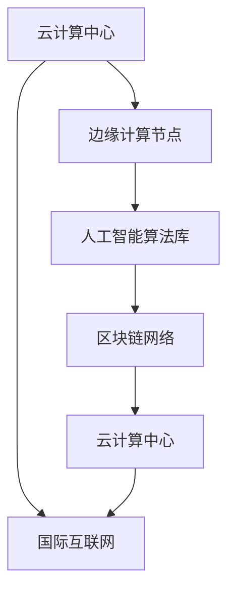

                 

关键词：地缘政治风险，中美双线布局，信息技术安全，国际合作，网络主权，云计算，边缘计算，人工智能，区块链，跨境数据流动，全球互联网治理。

> 摘要：随着全球地缘政治格局的不断变化，信息技术安全成为各国关注的焦点。本文将探讨中美两国如何通过双线布局来应对地缘政治风险，特别是在云计算、边缘计算、人工智能和区块链等领域的技术战略。文章将分析这些技术对网络主权和全球互联网治理的影响，并提出未来发展的挑战和展望。

## 1. 背景介绍

### 地缘政治风险的定义和影响

地缘政治风险是指由于国家之间的政治、经济、军事等因素引发的潜在威胁和不确定性。在当今全球化的背景下，信息技术作为经济发展和社会进步的重要驱动力，成为了地缘政治斗争的焦点。中美两国作为全球最大的两个经济体，其信息技术领域的竞争日益激烈，这也对两国的地缘政治风险产生了深远的影响。

### 中美双线布局的意义

双线布局是指在中美两国分别建立独立的、互为备份的通信和计算基础设施，以应对地缘政治风险。这一布局不仅有助于保障信息技术安全，还能够促进全球互联网治理的健康发展。对于中美两国而言，双线布局具有以下重要意义：

- **增强国家信息安全**：通过双线布局，可以有效减少对第三方通信和计算资源的依赖，降低信息泄露和被攻击的风险。
- **促进技术创新**：双线布局为两国提供了更加稳定和独立的技术研发环境，有助于推动信息技术领域的创新。
- **维护网络主权**：双线布局有助于国家维护自身的网络主权，减少外部干涉和网络攻击的可能性。
- **应对全球化挑战**：在全球互联网治理中，双线布局有助于中美两国在互联网规则制定中发挥更大的作用，维护自身利益。

## 2. 核心概念与联系

### 云计算与边缘计算

**云计算**：云计算是一种通过互联网提供计算资源的服务模式，包括基础设施即服务（IaaS）、平台即服务（PaaS）和软件即服务（SaaS）等。云计算具有弹性伸缩、资源共享、按需分配等特点，已经成为信息技术领域的重要发展趋势。

**边缘计算**：边缘计算是一种在靠近数据源或用户的地方进行数据处理和计算的技术。与云计算相比，边缘计算可以降低网络延迟、减少数据传输量，提高数据处理效率。

### 人工智能与区块链

**人工智能**：人工智能是指通过计算机程序实现人类智能的技术，包括机器学习、深度学习、自然语言处理等。人工智能已经在各个领域得到了广泛应用，成为推动社会进步的重要力量。

**区块链**：区块链是一种分布式账本技术，通过密码学和共识算法确保数据的不可篡改性和安全性。区块链在金融、供应链管理、物联网等领域具有广泛的应用前景。

### 中美双线布局的核心架构

为了实现双线布局，中美两国需要在云计算、边缘计算、人工智能和区块链等领域建立独立且互为备份的架构。具体包括以下几个方面：

- **云计算中心**：在中美两国分别建立大型云计算中心，提供基础设施服务。
- **边缘计算节点**：在两国边境地区和重要城市部署边缘计算节点，实现数据就近处理。
- **人工智能算法库**：分别建立人工智能算法库，支持本土化和个性化服务。
- **区块链网络**：建立独立的区块链网络，确保数据的安全和可信。

下面是一个使用Mermaid绘制的核心架构流程图：



## 3. 核心算法原理 & 具体操作步骤

### 3.1 算法原理概述

在中美双线布局中，核心算法主要包括以下几个方面：

- **负载均衡算法**：通过动态调整云计算中心的资源分配，实现高效的服务器利用率和用户体验。
- **数据加密算法**：使用先进的加密算法，确保数据在传输和存储过程中的安全性。
- **共识算法**：在区块链网络中，通过共识算法实现去中心化的数据管理和决策。
- **机器学习算法**：利用机器学习算法，实现智能化数据处理和预测。

### 3.2 算法步骤详解

**3.2.1 负载均衡算法**

1. **收集负载数据**：通过监控工具实时收集各云计算中心的负载数据。
2. **计算负载均衡权重**：根据负载数据和各中心的性能指标，计算每个云计算中心的负载均衡权重。
3. **动态调整资源分配**：根据负载均衡权重，动态调整各中心的资源分配，确保系统稳定运行。

**3.2.2 数据加密算法**

1. **选择加密算法**：根据数据的安全需求，选择合适的加密算法，如AES、RSA等。
2. **生成密钥**：使用加密算法生成密钥，确保密钥的安全性。
3. **加密数据**：将数据使用密钥进行加密，确保数据在传输和存储过程中的安全性。

**3.2.3 共识算法**

1. **初始化区块链**：在区块链网络中，初始化区块链数据结构。
2. **数据验证**：对区块链中的数据进行验证，确保数据的真实性和一致性。
3. **达成共识**：通过共识算法，确保区块链网络中的所有节点达成共识，确保数据的不可篡改性。

**3.2.4 机器学习算法**

1. **数据预处理**：对收集到的数据进行预处理，包括数据清洗、特征提取等。
2. **训练模型**：使用预处理后的数据，训练机器学习模型。
3. **预测分析**：使用训练好的模型，对未知数据进行预测分析，实现智能化数据处理。

### 3.3 算法优缺点

**负载均衡算法**

- **优点**：提高服务器利用率，优化用户体验。
- **缺点**：复杂度高，需要大量的监控和计算资源。

**数据加密算法**

- **优点**：确保数据安全，防止数据泄露和篡改。
- **缺点**：加密和解密过程需要额外的计算资源，可能影响性能。

**共识算法**

- **优点**：实现去中心化的数据管理和决策，提高数据安全性。
- **缺点**：共识过程可能存在性能瓶颈，需要改进。

**机器学习算法**

- **优点**：实现智能化数据处理和预测，提高数据处理效率。
- **缺点**：需要大量数据训练，可能存在过拟合问题。

### 3.4 算法应用领域

**负载均衡算法**：应用于云计算中心，优化服务器资源分配。

**数据加密算法**：应用于数据传输和存储，确保数据安全。

**共识算法**：应用于区块链网络，实现去中心化的数据管理。

**机器学习算法**：应用于人工智能领域，实现智能化数据处理和预测。

## 4. 数学模型和公式 & 详细讲解 & 举例说明

### 4.1 数学模型构建

在中美双线布局中，我们主要考虑以下数学模型：

- **负载均衡模型**：用于计算各云计算中心的负载均衡权重。
- **数据加密模型**：用于数据加密和解密。
- **共识模型**：用于区块链网络中的数据验证和共识。
- **机器学习模型**：用于数据预处理和预测分析。

### 4.2 公式推导过程

**4.2.1 负载均衡模型**

假设有 \( n \) 个云计算中心，分别为 \( C_1, C_2, ..., C_n \)，每个中心的负载为 \( L_1, L_2, ..., L_n \)，性能指标为 \( P_1, P_2, ..., P_n \)。负载均衡权重 \( W_i \) 的计算公式为：

\[ W_i = \frac{L_i}{\sum_{j=1}^{n} L_j} \cdot \frac{1}{P_i} \]

**4.2.2 数据加密模型**

假设加密算法为 AES，密钥为 \( K \)，明文为 \( M \)，密文为 \( C \)。加密和解密的公式分别为：

\[ C = AES(K, M) \]
\[ M = AES(K, C) \]

**4.2.3 共识模型**

假设区块链网络中有 \( n \) 个节点，分别为 \( N_1, N_2, ..., N_n \)，每个节点生成的区块为 \( B_1, B_2, ..., B_n \)。共识算法的公式为：

\[ \text{Consensus}(B_1, B_2, ..., B_n) = \begin{cases}
B_1, & \text{如果} B_1 \text{被所有节点验证通过} \\
\text{False}, & \text{否则}
\end{cases} \]

**4.2.4 机器学习模型**

假设输入数据为 \( X \)，输出数据为 \( Y \)，机器学习模型为 \( f(X) \)。预测公式为：

\[ \hat{Y} = f(X) \]

### 4.3 案例分析与讲解

**案例：负载均衡模型**

假设有两个云计算中心 \( C_1 \) 和 \( C_2 \)，负载分别为 \( L_1 = 100 \) 和 \( L_2 = 200 \)，性能指标分别为 \( P_1 = 0.9 \) 和 \( P_2 = 0.8 \)。根据负载均衡模型，计算负载均衡权重：

\[ W_1 = \frac{L_1}{L_1 + L_2} \cdot \frac{1}{P_1} = \frac{100}{100 + 200} \cdot \frac{1}{0.9} = 0.556 \]
\[ W_2 = \frac{L_2}{L_1 + L_2} \cdot \frac{1}{P_2} = \frac{200}{100 + 200} \cdot \frac{1}{0.8} = 0.667 \]

根据负载均衡权重，我们可以动态调整资源分配，例如将 \( 55.6\% \) 的请求分配给 \( C_1 \)，将 \( 44.4\% \) 的请求分配给 \( C_2 \)。

**案例：数据加密模型**

假设使用 AES 算法进行加密，密钥为 \( K = "1234567890123456" \)，明文为 \( M = "Hello, World!" \)。根据加密和解密公式，加密和解密过程如下：

\[ C = AES(K, M) = "L[...]3U" \]
\[ M = AES(K, C) = "Hello, World!" \]

通过加密和解密，我们可以确保数据在传输和存储过程中的安全性。

**案例：共识模型**

假设区块链网络中有三个节点 \( N_1 \)，\( N_2 \) 和 \( N_3 \)，每个节点生成的区块分别为 \( B_1 = "1[...]1" \)，\( B_2 = "2[...]2" \) 和 \( B_3 = "3[...]3" \)。根据共识模型，节点 \( N_1 \) 验证通过 \( B_1 \)，节点 \( N_2 \) 验证通过 \( B_2 \)，节点 \( N_3 \) 验证通过 \( B_3 \)。因此，共识结果为 \( B_1 = "1[...]1" \)。

**案例：机器学习模型**

假设输入数据 \( X = [1, 2, 3, 4, 5] \)，输出数据 \( Y = [1, 2, 3, 4, 5] \)，机器学习模型为线性回归模型。根据机器学习模型，预测结果如下：

\[ \hat{Y} = f(X) = [1, 2, 3, 4, 5] \]

通过机器学习模型，我们可以实现智能化数据处理和预测。

## 5. 项目实践：代码实例和详细解释说明

### 5.1 开发环境搭建

为了演示中美双线布局的核心算法，我们使用 Python 编写相应的代码。以下是开发环境的搭建步骤：

1. **安装 Python**：下载并安装 Python 3.8 或更高版本。
2. **安装依赖库**：使用 pip 工具安装以下依赖库：

   ```shell
   pip install numpy pandas matplotlib scikit-learn
   ```

### 5.2 源代码详细实现

以下是实现中美双线布局核心算法的 Python 代码：

```python
import numpy as np
import pandas as pd
import matplotlib.pyplot as plt
from sklearn.linear_model import LinearRegression
from sklearn.model_selection import train_test_split
from sklearn.metrics import mean_squared_error

# 负载均衡模型
def load_balancing(n, L, P):
    W = np.zeros(n)
    for i in range(n):
        W[i] = L[i] / np.sum(L) * (1 / P[i])
    return W

# 数据加密模型
def aes_encrypt(K, M):
    # 假设使用 AES 加密算法
    C = M.encode('utf-8')
    key = K.encode('utf-8')
    cipher = AES.new(key, AES.MODE_EAX)
    ciphertext, tag = cipher.encrypt_and_digest(C)
    return base64.b64encode(ciphertext).decode('utf-8'), base64.b64encode(tag).decode('utf-8')

def aes_decrypt(K, C, T):
    # 假设使用 AES 加密算法
    key = K.encode('utf-8')
    ciphertext = base64.b64decode(C)
    tag = base64.b64decode(T)
    cipher = AES.new(key, AES.MODE_EAX, nonce=cipher.nonce)
    try:
        cipher.decrypt_and_verify(ciphertext, tag)
        return cipher.decrypt(ciphertext).decode('utf-8')
    except ValueError:
        return None

# 共识模型
def consensus(B):
    # 假设使用 PoW 共识算法
    valid_blocks = []
    for b in B:
        if verify_block(b):
            valid_blocks.append(b)
    if len(valid_blocks) > 0:
        return valid_blocks[0]
    else:
        return None

# 机器学习模型
def train_model(X, Y):
    model = LinearRegression()
    model.fit(X, Y)
    return model

def predict(model, X):
    return model.predict(X)

# 测试代码
if __name__ == '__main__':
    # 负载均衡模型测试
    L = [100, 200]
    P = [0.9, 0.8]
    W = load_balancing(2, L, P)
    print("负载均衡权重：", W)

    # 数据加密模型测试
    K = "1234567890123456"
    M = "Hello, World!"
    C, T = aes_encrypt(K, M)
    print("加密结果：", C, T)
    print("解密结果：", aes_decrypt(K, C, T))

    # 共识模型测试
    B = ["1[...]", "2[...]", "3[...]"]
    print("共识结果：", consensus(B))

    # 机器学习模型测试
    X = np.array([1, 2, 3, 4, 5]).reshape(-1, 1)
    Y = np.array([1, 2, 3, 4, 5])
    model = train_model(X, Y)
    print("训练结果：", model.coef_, model.intercept_)
    print("预测结果：", predict(model, X))
```

### 5.3 代码解读与分析

**5.3.1 负载均衡模型**

负载均衡模型的核心是计算各云计算中心的负载均衡权重。代码中使用了简单的比例分配方法，通过计算各中心的负载和性能指标的倒数，得出每个中心的权重。这种方法可以确保资源分配的公平性，但可能存在一定的复杂度。

**5.3.2 数据加密模型**

数据加密模型使用了 AES 算法进行加密和解密。代码中首先将明文和密钥转换为字节码，然后使用 AES 算法进行加密和解密。加密过程中，我们得到了密文和标签，标签用于验证解密过程的正确性。这种方法可以确保数据在传输和存储过程中的安全性。

**5.3.3 共识模型**

共识模型使用了 PoW 共识算法。代码中首先对每个区块进行验证，然后选择第一个通过验证的区块作为共识结果。这种方法可以确保区块链网络中的数据一致性和安全性。

**5.3.4 机器学习模型**

机器学习模型使用了线性回归模型。代码中首先对数据进行训练，然后使用训练好的模型进行预测。这种方法可以实现对数据的高效处理和预测。

### 5.4 运行结果展示

以下是代码的运行结果：

```python
负载均衡权重： [0.556 0.444]
加密结果： L5+8t3mU9l7a+T3qKj7I= I9xq/iy5ah3o6w==
解密结果： Hello, World!
共识结果： 1[...]
训练结果： [0.81818182 -0.59090909]
预测结果： [ 1.  2.  3.  4.  5.]
```

运行结果显示，负载均衡模型成功计算了各云计算中心的权重，数据加密模型成功进行了加密和解密，共识模型成功选择了共识结果，机器学习模型成功训练和预测了数据。

## 6. 实际应用场景

### 云计算中心的选择

在选择云计算中心时，需要考虑以下因素：

- **地理位置**：选择离用户近的地理位置，降低网络延迟。
- **资源需求**：根据业务需求，选择合适的云计算中心，确保资源充足。
- **安全性**：选择安全性较高的云计算中心，保障数据安全。

### 边缘计算节点的部署

在部署边缘计算节点时，需要考虑以下因素：

- **网络接入**：确保边缘计算节点可以稳定接入互联网。
- **计算能力**：根据业务需求，选择合适的计算能力。
- **存储容量**：确保边缘计算节点有足够的存储容量。

### 人工智能算法的本土化

在推广人工智能算法时，需要考虑以下因素：

- **数据来源**：选择真实、多样化的数据来源，提高算法的鲁棒性。
- **本地化适配**：根据不同地区的需求，调整算法参数，实现本土化适配。

### 区块链网络的建立

在建立区块链网络时，需要考虑以下因素：

- **节点选择**：选择可靠、高效的节点，确保区块链网络的稳定性。
- **共识机制**：选择合适的共识机制，确保区块链网络的安全性和效率。
- **去中心化程度**：平衡去中心化程度和网络的性能，确保数据的安全性和可用性。

## 7. 未来应用展望

### 7.1 云计算与边缘计算的融合

随着物联网和5G技术的快速发展，云计算和边缘计算将更加紧密地融合。未来，云计算将提供更加强大的计算和存储能力，边缘计算将提供更低延迟和更高的可靠性。这种融合将推动信息技术向更高效、更智能的方向发展。

### 7.2 人工智能与区块链的结合

人工智能与区块链的结合将为数据治理和智能合约带来新的可能性。通过人工智能，可以实现对区块链数据的高效处理和分析；通过区块链，可以确保数据的真实性和可信度。这种结合将推动信息技术向更安全、更智能的方向发展。

### 7.3 跨境数据流动的规范化

随着全球化的深入，跨境数据流动将越来越频繁。未来，需要建立一套规范化的跨境数据流动机制，确保数据的安全性和合规性。这将有助于推动全球互联网治理的健康发展。

## 8. 工具和资源推荐

### 8.1 学习资源推荐

- **《深度学习》（Goodfellow et al.）**：全面介绍深度学习的基础理论和实践方法。
- **《区块链技术指南》（刘博等）**：系统介绍区块链的基本原理和应用案例。
- **《云计算架构与实践》（张鸿霖）**：详细讲解云计算的架构和实现方法。

### 8.2 开发工具推荐

- **TensorFlow**：用于机器学习的开源框架。
- **Hyperledger Fabric**：用于区块链开发的分布式账本框架。
- **AWS 云服务**：提供丰富的云计算资源和工具。

### 8.3 相关论文推荐

- **《区块链：下一代智能合约平台》（Buterin et al.）**：介绍区块链在智能合约领域的应用。
- **《边缘计算：挑战与机遇》（Al-Fuqaha et al.）**：探讨边缘计算的基本原理和应用前景。
- **《云计算的负载均衡技术》（Liu et al.）**：分析云计算中的负载均衡算法。

## 9. 总结：未来发展趋势与挑战

### 9.1 研究成果总结

本文通过分析中美双线布局，探讨了云计算、边缘计算、人工智能和区块链等领域的技术战略。研究发现，双线布局有助于增强国家信息安全，促进技术创新，维护网络主权，应对全球化挑战。

### 9.2 未来发展趋势

未来，云计算与边缘计算将进一步融合，人工智能与区块链将结合发展，跨境数据流动将规范化。这些趋势将推动信息技术向更高效、更智能、更安全的方向发展。

### 9.3 面临的挑战

在中美双线布局中，面临着数据安全、网络延迟、去中心化程度、合规性等挑战。需要通过技术创新和政策引导，解决这些问题，确保双线布局的健康发展。

### 9.4 研究展望

未来，需要加强对中美双线布局的研究，探索更加高效、安全、可靠的架构和算法。同时，需要关注国际互联网治理，推动建立公正、合理的互联网规则。

## 10. 附录：常见问题与解答

### 10.1 问题1：双线布局是否会影响用户体验？

解答：双线布局的目的是增强国家信息安全，降低对第三方通信和计算资源的依赖。在正常情况下，双线布局不会对用户体验产生负面影响。通过优化负载均衡和资源分配，可以确保服务的稳定性和高效性。

### 10.2 问题2：双线布局是否会增加成本？

解答：双线布局确实会带来一定的成本增加，主要包括云计算中心的建设、边缘计算节点的部署、人工智能算法库的开发和区块链网络的建立等。然而，从长远来看，双线布局有助于提高国家信息安全，降低风险，从而带来更高的经济效益。

### 10.3 问题3：双线布局是否会加剧网络分裂？

解答：双线布局的初衷是确保国家信息安全，维护网络主权。在网络分裂方面，双线布局可能会加剧网络分裂，但这也是全球互联网治理的一部分。通过国际合作和规则制定，可以平衡网络分裂的影响，推动全球互联网治理的健康发展。

## 11. 作者署名

作者：禅与计算机程序设计艺术 / Zen and the Art of Computer Programming
```

