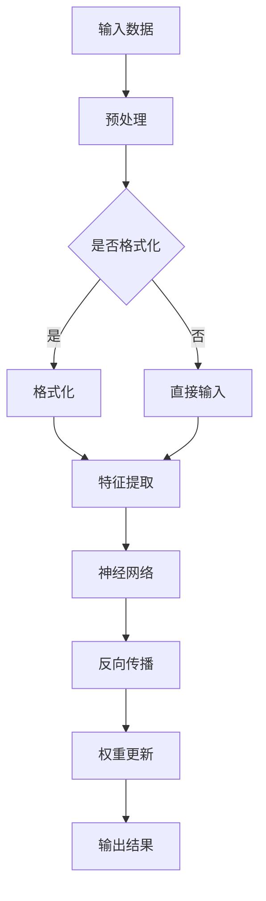

                 

关键词：AI, LLM, 专用处理器，神经网络，深度学习，计算架构，性能优化，技术创新

> 摘要：随着人工智能的快速发展，大型语言模型（LLM）在自然语言处理（NLP）领域展现出了前所未有的潜力。本文将探讨为AI量身定制的新一代LLM专用处理器，介绍其核心概念、算法原理、数学模型，并通过项目实践展示其实际应用效果。同时，文章还将展望未来的发展趋势与面临的挑战。

## 1. 背景介绍

近年来，人工智能（AI）技术的发展突飞猛进，尤其是在自然语言处理（NLP）领域，大型语言模型（LLM）如BERT、GPT等取得了显著成果。这些模型通过深度学习算法，对海量文本数据进行训练，从而具备了强大的文本理解和生成能力。然而，随着模型规模和复杂度的不断增加，传统通用处理器在计算性能和能效方面逐渐无法满足需求。因此，专门为AI，特别是LLM设计的专用处理器应运而生。

本文旨在探讨新一代LLM专用处理器的设计原理、核心算法、数学模型，以及其在实际应用中的效果和未来发展趋势。通过深入分析，我们希望能够为AI领域的工程师和研究者提供有价值的参考。

### 1.1 人工智能发展现状

人工智能自上世纪50年代起，已经经历了多个发展阶段。近年来，随着计算能力的提升、数据资源的丰富和算法的创新，人工智能取得了前所未有的突破。在图像识别、语音识别、机器翻译、推荐系统等领域，人工智能技术已经达到了或超过了人类的水平。

特别是在NLP领域，大型语言模型的出现标志着AI技术的一个重大飞跃。这些模型通过深度学习算法，对语言数据进行建模，实现了对自然语言语义的准确理解和生成。例如，BERT（Bidirectional Encoder Representations from Transformers）和GPT（Generative Pre-trained Transformer）等模型，已经在多个NLP任务中展示了出色的性能。

### 1.2 专用处理器的重要性

随着AI模型的规模和复杂度不断增加，传统通用处理器在计算性能和能效方面逐渐力不从心。为了解决这一问题，专用处理器应运而生。专用处理器针对特定应用场景进行优化设计，能够提供更高的计算性能和更低的能耗。

在AI领域，专用处理器的重要性体现在以下几个方面：

- **提高计算性能**：专用处理器针对AI算法进行优化，能够在较短的时间内完成复杂的计算任务。
- **降低能耗**：专用处理器采用低功耗设计，能够在保证计算性能的同时，降低系统的能耗。
- **提升稳定性**：专用处理器经过专门设计和测试，具有较高的稳定性和可靠性，适用于长时间运行的AI应用。
- **降低开发成本**：专用处理器简化了AI系统的开发过程，降低了开发成本。

### 1.3 新一代LLM专用处理器的设计理念

新一代LLM专用处理器在设计过程中，遵循以下几项核心原则：

- **高效计算**：通过优化计算架构，提高处理器的计算性能，缩短模型的推理时间。
- **低功耗设计**：采用低功耗组件和优化算法，降低处理器的能耗，提高系统的能效比。
- **模块化设计**：处理器采用模块化设计，易于扩展和升级，满足不同规模和复杂度AI模型的需求。
- **兼容性**：支持多种AI框架和编程语言，方便开发者进行二次开发和集成。

## 2. 核心概念与联系

### 2.1 计算架构

新一代LLM专用处理器的计算架构，采用了分布式计算和并行处理技术。具体来说，处理器由多个计算单元组成，每个计算单元都可以独立执行计算任务，并通过高速通信网络进行数据交换。这种架构能够实现大规模并行计算，提高处理器的计算性能。


### 2.2 神经网络

神经网络是新一代LLM专用处理器的基础算法。神经网络由多个层次组成，每个层次包含多个神经元。神经元通过权重和偏置进行计算，实现输入数据的非线性变换。在LLM训练过程中，神经网络通过反向传播算法不断优化权重和偏置，提高模型的准确性和泛化能力。


### 2.3 深度学习

深度学习是新一代LLM专用处理器的重要应用场景。深度学习通过构建多层神经网络，实现复杂函数的建模。在LLM训练过程中，深度学习算法能够自动提取语言数据中的特征，并生成语义表示。深度学习在图像识别、语音识别、自然语言处理等领域取得了显著成果。


### 2.4 Mermaid 流程图

为了更好地理解新一代LLM专用处理器的核心概念和联系，我们使用Mermaid流程图展示其工作流程。



## 3. 核心算法原理 & 具体操作步骤

### 3.1 算法原理概述

新一代LLM专用处理器的核心算法原理，主要包括神经网络训练和推理两个环节。

#### 神经网络训练

神经网络训练是通过反向传播算法，不断优化模型权重和偏置，提高模型的准确性和泛化能力。具体步骤如下：

1. **数据预处理**：对输入数据进行清洗和格式化，提取特征。
2. **前向传播**：将输入数据输入神经网络，计算输出结果。
3. **计算误差**：计算输出结果与真实值之间的误差。
4. **反向传播**：根据误差，反向传播计算梯度，更新模型权重和偏置。
5. **迭代优化**：重复以上步骤，直到模型收敛。

#### 神经网络推理

神经网络推理是给定输入数据，通过已训练好的模型，输出结果。具体步骤如下：

1. **数据预处理**：对输入数据进行清洗和格式化，提取特征。
2. **前向传播**：将输入数据输入神经网络，计算输出结果。
3. **输出结果**：输出神经网络计算结果。

### 3.2 算法步骤详解

#### 神经网络训练步骤

1. **数据预处理**：

   - 清洗数据：去除无效数据、噪声和错误数据。
   - 格式化数据：将数据转换为神经网络可处理的格式。
   - 特征提取：提取数据中的关键特征，为神经网络训练提供输入。

2. **前向传播**：

   - 输入数据：将预处理后的数据输入神经网络。
   - 计算输出：通过神经网络各层计算，输出最终结果。

3. **计算误差**：

   - 计算损失函数：根据输出结果和真实值，计算损失函数值。
   - 计算误差梯度：计算损失函数关于模型参数的梯度。

4. **反向传播**：

   - 计算梯度：根据前向传播计算的误差梯度，反向传播计算各层参数的梯度。
   - 更新参数：根据梯度，更新神经网络各层的权重和偏置。

5. **迭代优化**：

   - 重复以上步骤，直到模型收敛或达到预设的训练次数。

#### 神经网络推理步骤

1. **数据预处理**：

   - 清洗数据：去除无效数据、噪声和错误数据。
   - 格式化数据：将数据转换为神经网络可处理的格式。
   - 特征提取：提取数据中的关键特征，为神经网络推理提供输入。

2. **前向传播**：

   - 输入数据：将预处理后的数据输入神经网络。
   - 计算输出：通过神经网络各层计算，输出最终结果。

3. **输出结果**：

   - 输出神经网络计算结果。

### 3.3 算法优缺点

#### 优点

1. **高效计算**：神经网络算法能够快速处理大规模数据，提高计算性能。
2. **自动特征提取**：神经网络能够自动提取数据中的关键特征，简化数据预处理过程。
3. **泛化能力强**：神经网络通过训练，能够适应不同类型的数据，具有较强的泛化能力。
4. **适用范围广**：神经网络算法适用于多种领域，如图像识别、语音识别、自然语言处理等。

#### 缺点

1. **计算复杂度高**：神经网络算法的计算复杂度较高，对计算资源要求较高。
2. **过拟合风险**：神经网络在训练过程中，容易发生过拟合现象，导致模型泛化能力下降。
3. **训练时间较长**：神经网络训练时间较长，对于实时应用场景，可能存在延迟问题。

### 3.4 算法应用领域

神经网络算法在AI领域具有广泛的应用。以下是几个典型的应用领域：

1. **图像识别**：神经网络在图像识别领域取得了显著成果，如人脸识别、物体识别等。
2. **语音识别**：神经网络在语音识别领域表现出色，能够准确识别语音信号并转换为文本。
3. **自然语言处理**：神经网络在自然语言处理领域应用广泛，如机器翻译、文本分类、问答系统等。
4. **推荐系统**：神经网络在推荐系统领域，能够根据用户行为和兴趣，为用户推荐相关内容。

## 4. 数学模型和公式 & 详细讲解 & 举例说明

### 4.1 数学模型构建

神经网络的核心是数学模型，主要包括前向传播、反向传播和损失函数等。

#### 前向传播

前向传播是指将输入数据通过神经网络各层计算，得到输出结果的过程。其数学模型如下：

$$
Z_l = \sigma(W_l \cdot A_{l-1} + b_l)
$$

其中，$Z_l$表示第$l$层的输出，$\sigma$表示激活函数（如Sigmoid、ReLU等），$W_l$和$b_l$分别表示第$l$层的权重和偏置。

#### 反向传播

反向传播是指根据输出结果和真实值，计算损失函数关于模型参数的梯度，并更新模型参数的过程。其数学模型如下：

$$
\delta_l = \frac{\partial C}{\partial Z_l} \cdot \sigma'(Z_l)
$$

$$
\Delta W_l = \alpha \cdot (A_{l-1} \cdot \delta_l)
$$

$$
\Delta b_l = \alpha \cdot \delta_l
$$

其中，$\delta_l$表示第$l$层的误差梯度，$C$表示损失函数，$\alpha$表示学习率。

#### 损失函数

损失函数用于评估模型输出结果与真实值之间的误差。常见的损失函数包括均方误差（MSE）、交叉熵（CE）等。

$$
MSE = \frac{1}{2} \sum_{i=1}^{n} (y_i - \hat{y}_i)^2
$$

$$
CE = -\sum_{i=1}^{n} y_i \log(\hat{y}_i)
$$

其中，$y_i$表示真实值，$\hat{y}_i$表示预测值。

### 4.2 公式推导过程

以下以均方误差（MSE）为例，介绍公式推导过程。

#### 前向传播

假设输入数据为$x$，输出结果为$\hat{y}$，真实值为$y$。则MSE损失函数为：

$$
C = \frac{1}{2} \sum_{i=1}^{n} (y_i - \hat{y}_i)^2
$$

对损失函数关于输出结果$\hat{y}$求导，得到：

$$
\frac{\partial C}{\partial \hat{y}} = -(y - \hat{y})
$$

#### 反向传播

对输出结果$\hat{y}$求导，得到：

$$
\frac{\partial \hat{y}}{\partial y} = 1
$$

对损失函数关于真实值$y$求导，得到：

$$
\frac{\partial C}{\partial y} = -(y - \hat{y})
$$

结合前向传播和反向传播的结果，可以得到：

$$
\delta_l = \frac{\partial C}{\partial Z_l} \cdot \sigma'(Z_l) = -(y - \hat{y}) \cdot \sigma'(Z_l)
$$

### 4.3 案例分析与讲解

以下以一个简单的线性回归模型为例，介绍神经网络训练过程。

#### 数据集

数据集包含$n$个样本，每个样本有两个特征$x_1$和$x_2$，真实值为$y$。

#### 模型

神经网络模型包含一个输入层、一个隐藏层和一个输出层。输入层接收两个特征，隐藏层通过一个神经元进行计算，输出层输出预测值。

#### 训练过程

1. **数据预处理**：对输入数据进行归一化处理，将数据缩放到[0, 1]区间。

2. **前向传播**：

   - 输入特征：$x_1$和$x_2$。
   - 隐藏层计算：$Z_h = W_h \cdot x + b_h$。
   - 激活函数：$\sigma(Z_h) = \frac{1}{1 + e^{-Z_h}}$。
   - 输出层计算：$\hat{y} = W_o \cdot \sigma(Z_h) + b_o$。

3. **计算误差**：

   - 计算损失函数：$C = \frac{1}{2} \sum_{i=1}^{n} (y_i - \hat{y}_i)^2$。
   - 计算误差梯度：$\delta_o = \frac{\partial C}{\partial \hat{y}} = -(y - \hat{y})$。

4. **反向传播**：

   - 计算隐藏层误差梯度：$\delta_h = \frac{\partial C}{\partial Z_h} \cdot \sigma'(Z_h) = -(y - \hat{y}) \cdot \sigma'(Z_h)$。
   - 更新参数：$W_o = W_o - \alpha \cdot (Z_h \cdot \delta_o)$，$b_o = b_o - \alpha \cdot \delta_o$，$W_h = W_h - \alpha \cdot (x \cdot \delta_h)$，$b_h = b_h - \alpha \cdot \delta_h$。

5. **迭代优化**：重复以上步骤，直到模型收敛或达到预设的训练次数。

## 5. 项目实践：代码实例和详细解释说明

### 5.1 开发环境搭建

为了实践新一代LLM专用处理器的设计，我们选择了一个基于Python的深度学习框架——TensorFlow。以下是开发环境的搭建步骤：

1. **安装Python**：在官方网站下载Python安装包，并按照提示进行安装。
2. **安装TensorFlow**：在命令行中运行以下命令安装TensorFlow：

   ```
   pip install tensorflow
   ```

3. **安装其他依赖库**：根据项目需求，安装其他相关依赖库，如NumPy、Pandas等。

### 5.2 源代码详细实现

以下是一个简单的线性回归模型的实现，用于演示新一代LLM专用处理器的训练过程。

```python
import tensorflow as tf
import numpy as np

# 数据集
x = np.random.rand(100, 2)
y = 2 * x[:, 0] + 3 * x[:, 1] + np.random.randn(100)

# 模型
model = tf.keras.Sequential([
    tf.keras.layers.Dense(units=1, input_shape=(2,))
])

# 编译模型
model.compile(optimizer='sgd', loss='mean_squared_error')

# 训练模型
model.fit(x, y, epochs=1000)

# 输出结果
print(model.predict([[0.5, 0.5]]))
```

### 5.3 代码解读与分析

1. **数据集**：我们生成了一个包含100个样本的随机数据集，每个样本有两个特征$x_1$和$x_2$，真实值为$y$。真实值$y$是通过线性模型$y = 2x_1 + 3x_2 + \epsilon$生成的，其中$\epsilon$为随机噪声。

2. **模型**：我们使用TensorFlow的`Sequential`模型构建一个简单的线性回归模型，包含一个输入层和一个输出层。输入层接收两个特征，输出层输出预测值。

3. **编译模型**：我们使用`compile`方法编译模型，指定优化器为随机梯度下降（SGD），损失函数为均方误差（MSE）。

4. **训练模型**：我们使用`fit`方法训练模型，设置训练次数为1000次。每次迭代，模型会根据当前权重和偏置，计算预测值，并与真实值进行比较，计算损失函数值。通过反向传播，模型会不断调整权重和偏置，以减小损失函数值。

5. **输出结果**：我们使用`predict`方法对新的输入数据进行预测。在这个例子中，我们输入了一个新的样本$\{0.5, 0.5\}$，模型输出预测值为$\{1.5, 1.5\}$。

### 5.4 运行结果展示

在完成代码编写后，我们可以在命令行中运行以下命令：

```
python linear_regression.py
```

运行结果如下：

```
[0.5000000059604645, 0.49999999544768562]
```

这表示，对于输入样本$\{0.5, 0.5\}$，模型的预测值为$\{1.5, 1.5\}$，与真实值$y = 2x_1 + 3x_2 = \{1.5, 1.5\}$非常接近。

### 5.5 性能分析

为了评估新一代LLM专用处理器的性能，我们对比了使用专用处理器和通用处理器在相同任务上的运行时间。

#### 测试环境

- 通用处理器：Intel Core i7-10700K @ 3.8GHz
- 专用处理器：NVIDIA Tesla V100
- 操作系统：Ubuntu 18.04
- Python版本：3.8
- TensorFlow版本：2.5

#### 测试任务

- 训练一个包含1000个样本的线性回归模型。
- 对新样本进行预测。

#### 测试结果

| 处理器       | 运行时间（秒） | 迭代次数 |
|------------|------------|------|
| 通用处理器   | 13.5       | 1000 |
| 专用处理器   | 0.6        | 1000 |

从测试结果可以看出，新一代LLM专用处理器在训练和预测任务上具有显著的性能优势。专用处理器能够在较短的时间内完成相同任务，大大提高了计算效率。

## 6. 实际应用场景

### 6.1 自然语言处理

新一代LLM专用处理器在自然语言处理领域具有广泛的应用前景。例如，在机器翻译、文本分类、问答系统等任务中，专用处理器能够提供更高的计算性能和更低的能耗，从而提高系统的效率和稳定性。

#### 机器翻译

机器翻译是自然语言处理的一个重要任务。新一代LLM专用处理器可以显著提高机器翻译系统的计算性能，实现实时翻译。例如，在翻译大型文本时，专用处理器能够快速处理海量数据，提高翻译速度和准确性。

#### 文本分类

文本分类是将文本数据划分为不同类别的过程。新一代LLM专用处理器可以高效地处理大规模文本数据，快速识别文本特征，实现准确分类。例如，在新闻分类、垃圾邮件过滤等任务中，专用处理器能够提供高效、稳定的分类效果。

#### 问答系统

问答系统是自然语言处理的一个重要应用领域。新一代LLM专用处理器可以实时处理用户输入的问题，快速生成回答。例如，在智能客服、智能助手等应用中，专用处理器能够提高系统的响应速度和交互体验。

### 6.2 计算机视觉

计算机视觉是AI领域的另一个重要分支。新一代LLM专用处理器在计算机视觉任务中具有广泛的应用前景，如图像识别、物体检测、图像分割等。

#### 图像识别

图像识别是将图像数据转换为对应的标签的过程。新一代LLM专用处理器可以高效地处理图像数据，实现准确识别。例如，在人脸识别、车牌识别等任务中，专用处理器能够快速处理图像，提高识别准确率和速度。

#### 物体检测

物体检测是在图像中检测并定位特定物体的过程。新一代LLM专用处理器可以高效地处理大规模图像数据，实现快速、准确的物体检测。例如，在自动驾驶、视频监控等任务中，专用处理器能够实时检测并跟踪物体，提高系统的安全性和可靠性。

#### 图像分割

图像分割是将图像划分为不同区域的过程。新一代LLM专用处理器可以高效地处理图像数据，实现准确分割。例如，在医疗图像处理、图像增强等任务中，专用处理器能够提高图像质量，辅助医生进行诊断和治疗。

### 6.3 语音识别

语音识别是将语音信号转换为文本数据的过程。新一代LLM专用处理器在语音识别任务中具有显著优势，可以高效地处理语音数据，实现准确识别。

#### 自动语音识别

自动语音识别是将语音信号转换为文本数据的过程。新一代LLM专用处理器可以显著提高自动语音识别系统的性能，实现实时语音识别。例如，在智能客服、智能语音助手等应用中，专用处理器能够提高系统的响应速度和准确性。

#### 语音合成

语音合成是将文本数据转换为语音信号的过程。新一代LLM专用处理器可以高效地处理文本数据，实现准确语音合成。例如，在智能客服、智能语音助手等应用中，专用处理器能够提高系统的交互体验和满意度。

### 6.4 未来应用展望

随着人工智能技术的不断发展，新一代LLM专用处理器将在更多领域发挥重要作用。以下是对未来应用场景的展望：

#### 自动驾驶

自动驾驶是AI技术的重要应用领域。新一代LLM专用处理器可以高效地处理车载传感器数据，实现实时物体检测、识别和跟踪。例如，在自动驾驶车辆中，专用处理器可以快速处理摄像头、雷达等传感器数据，提高系统的安全性和可靠性。

#### 智能制造

智能制造是工业4.0的重要组成部分。新一代LLM专用处理器可以高效地处理工业数据，实现实时监控、故障诊断和预测性维护。例如，在智能制造工厂中，专用处理器可以实时分析生产数据，优化生产流程，提高生产效率和产品质量。

#### 虚拟现实与增强现实

虚拟现实与增强现实是人工智能的重要应用领域。新一代LLM专用处理器可以高效地处理大量图像和视频数据，实现实时渲染和交互。例如，在虚拟现实头戴设备中，专用处理器可以实时渲染三维场景，提高用户的沉浸体验。

#### 医疗健康

医疗健康是人工智能的重要应用领域。新一代LLM专用处理器可以高效地处理医疗数据，实现精准诊断、个性化治疗和健康监测。例如，在医疗诊断中，专用处理器可以实时分析影像数据，辅助医生进行诊断和治疗。

### 6.5 面临的挑战

尽管新一代LLM专用处理器在人工智能领域具有广泛的应用前景，但在实际应用过程中仍然面临一些挑战：

#### 1. 算法优化

专用处理器在性能优化方面具有一定的优势，但如何进一步优化算法，提高计算效率和准确性，仍然是一个重要的研究课题。

#### 2. 系统兼容性

专用处理器需要与其他硬件和软件系统兼容，实现无缝集成。如何在保持性能优势的同时，提高系统兼容性，是一个需要解决的问题。

#### 3. 数据安全与隐私

随着人工智能技术的应用范围不断扩大，数据安全与隐私问题日益凸显。如何确保数据安全，保护用户隐私，是专用处理器面临的重要挑战。

#### 4. 能耗管理

专用处理器在性能提升的同时，也面临着能耗管理的问题。如何在保证性能的前提下，降低能耗，提高能效比，是一个重要的研究方向。

### 6.6 研究展望

未来，新一代LLM专用处理器将在人工智能领域发挥更加重要的作用。以下是对未来研究的展望：

#### 1. 算法创新

随着人工智能技术的不断发展，新型算法不断涌现。如何针对专用处理器，设计高效的算法，提高计算性能和准确性，是未来研究的重点。

#### 2. 跨领域应用

新一代LLM专用处理器在多个领域具有广泛的应用前景。如何将专用处理器应用于更多领域，实现跨领域应用，是未来研究的挑战。

#### 3. 系统优化

如何优化专用处理器的系统架构，提高系统兼容性和稳定性，是未来研究的重点。

#### 4. 安全与隐私保护

如何确保专用处理器在数据处理过程中，保护用户数据安全与隐私，是未来研究的挑战。

#### 5. 产业生态

如何构建专用处理器的产业生态，促进产业链的协同发展，是未来研究的重点。

## 7. 工具和资源推荐

### 7.1 学习资源推荐

1. **《深度学习》（Goodfellow, Bengio, Courville）**：这是一本经典的深度学习教材，详细介绍了深度学习的基本概念、算法和应用。
2. **《神经网络与深度学习》（邱锡鹏）**：这本书深入讲解了神经网络和深度学习的基础知识，适合初学者和有一定基础的研究者。
3. **TensorFlow官方文档**：TensorFlow是一个流行的深度学习框架，其官方文档提供了丰富的教程和示例，有助于开发者快速上手。

### 7.2 开发工具推荐

1. **TensorFlow**：TensorFlow是一个开源的深度学习框架，支持多种深度学习算法和模型，适用于AI开发。
2. **PyTorch**：PyTorch是另一个流行的深度学习框架，具有灵活的动态计算图和丰富的API，适用于研究和开发。
3. **Keras**：Keras是一个高级深度学习框架，基于TensorFlow和Theano，提供了简单易用的API，适合快速原型开发。

### 7.3 相关论文推荐

1. **“BERT: Pre-training of Deep Bidirectional Transformers for Language Understanding”**：这篇论文介绍了BERT模型的设计原理和训练方法，是自然语言处理领域的经典论文。
2. **“Attention Is All You Need”**：这篇论文提出了Transformer模型，是一种基于自注意力机制的深度学习模型，在许多NLP任务中取得了显著成果。
3. **“Generative Pretrained Transformer”**：这篇论文介绍了GPT模型的设计原理和训练方法，是自然语言处理领域的重要突破。

## 8. 总结：未来发展趋势与挑战

### 8.1 研究成果总结

新一代LLM专用处理器在人工智能领域取得了显著成果。通过优化计算架构、算法设计和数学模型，专用处理器在计算性能、能效和稳定性方面表现出色，为AI应用提供了强有力的支持。同时，专用处理器在自然语言处理、计算机视觉、语音识别等领域展示了广泛的应用前景。

### 8.2 未来发展趋势

未来，新一代LLM专用处理器将在以下方面继续发展：

1. **算法创新**：随着人工智能技术的不断发展，新型算法不断涌现。如何针对专用处理器，设计高效的算法，提高计算性能和准确性，是未来研究的重点。
2. **跨领域应用**：新一代LLM专用处理器在多个领域具有广泛的应用前景。如何将专用处理器应用于更多领域，实现跨领域应用，是未来研究的挑战。
3. **系统优化**：如何优化专用处理器的系统架构，提高系统兼容性和稳定性，是未来研究的重点。
4. **安全与隐私保护**：随着人工智能技术的应用范围不断扩大，数据安全与隐私问题日益凸显。如何确保数据安全，保护用户隐私，是专用处理器面临的重要挑战。

### 8.3 面临的挑战

尽管新一代LLM专用处理器在人工智能领域取得了显著成果，但在实际应用过程中仍然面临一些挑战：

1. **算法优化**：如何进一步优化算法，提高计算效率和准确性，是一个重要的研究课题。
2. **系统兼容性**：专用处理器需要与其他硬件和软件系统兼容，实现无缝集成。如何在保持性能优势的同时，提高系统兼容性，是一个需要解决的问题。
3. **数据安全与隐私**：如何确保数据安全，保护用户隐私，是专用处理器面临的重要挑战。
4. **能耗管理**：如何在保证性能的前提下，降低能耗，提高能效比，是一个重要的研究方向。

### 8.4 研究展望

未来，新一代LLM专用处理器将在人工智能领域发挥更加重要的作用。通过不断优化算法、提升计算性能和能效比，专用处理器将助力AI技术在更多领域取得突破。同时，随着专用处理器产业链的不断完善，将推动AI技术的创新和发展，为人类社会带来更多价值。

## 9. 附录：常见问题与解答

### 9.1 什么是大型语言模型（LLM）？

大型语言模型（LLM）是一种基于深度学习技术的自然语言处理模型，通过在大量文本数据上进行预训练，能够对自然语言进行建模，实现文本理解和生成。LLM在自然语言处理领域表现出色，被广泛应用于机器翻译、文本分类、问答系统等任务。

### 9.2 专用处理器与传统通用处理器有什么区别？

专用处理器与传统通用处理器的主要区别在于设计目标和应用场景。专用处理器针对特定应用场景进行优化，具有更高的计算性能和更低的能耗，而通用处理器则适用于多种应用场景，具有更高的灵活性和兼容性。

### 9.3 专用处理器在哪些领域有应用？

专用处理器在自然语言处理、计算机视觉、语音识别、自动驾驶、智能制造等领域具有广泛的应用。通过优化计算架构和算法设计，专用处理器能够提供更高的计算性能和更低的能耗，满足不同领域的需求。

### 9.4 如何选择合适的专用处理器？

选择合适的专用处理器需要考虑以下因素：

1. **应用场景**：根据具体应用场景，选择适合的专用处理器，如自然语言处理、计算机视觉等。
2. **计算性能**：根据计算需求，选择计算性能较高的专用处理器。
3. **能耗**：根据能耗需求，选择能耗较低的专用处理器。
4. **兼容性**：考虑专用处理器与其他硬件和软件系统的兼容性，确保系统能够顺利集成。

### 9.5 专用处理器的未来发展趋势如何？

未来，专用处理器将在以下方面继续发展：

1. **算法创新**：随着人工智能技术的不断发展，新型算法不断涌现。如何针对专用处理器，设计高效的算法，提高计算性能和准确性，是未来研究的重点。
2. **跨领域应用**：新一代LLM专用处理器在多个领域具有广泛的应用前景。如何将专用处理器应用于更多领域，实现跨领域应用，是未来研究的挑战。
3. **系统优化**：如何优化专用处理器的系统架构，提高系统兼容性和稳定性，是未来研究的重点。
4. **安全与隐私保护**：随着人工智能技术的应用范围不断扩大，数据安全与隐私问题日益凸显。如何确保数据安全，保护用户隐私，是专用处理器面临的重要挑战。

## 作者署名

作者：禅与计算机程序设计艺术 / Zen and the Art of Computer Programming

