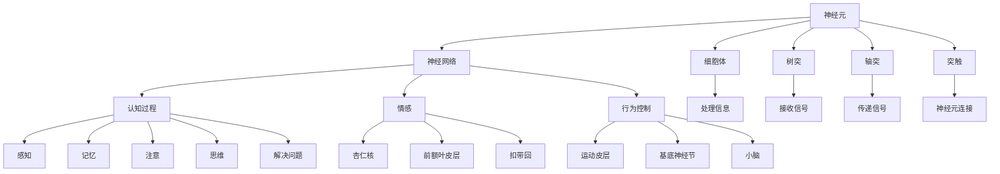

                 

关键词：心理状态，大脑工作原理，神经网络，认知过程，意识，情感，行为控制

> 摘要：本文将深入探讨大脑的工作原理，尤其是神经网络的运作方式，以及它们如何影响我们的心理状态。我们将从神经科学的角度出发，分析大脑的结构和功能，解释大脑如何处理信息，以及这些过程如何影响我们的情绪、思维和行为。

## 1. 背景介绍

大脑是人类认知、行为和情绪的控制中心，它由数十亿个神经元组成，每个神经元都可以与数千个其他神经元相连。这种复杂的网络结构使我们能够感知环境，学习新事物，并做出决策。然而，大脑的工作原理至今仍不完全清楚，科学家们一直在努力揭示其奥秘。

神经科学是研究神经系统结构、功能和疾病的科学。通过神经科学的进展，我们能够更好地理解大脑的工作原理，以及它们如何影响我们的心理状态。本文将介绍大脑的基本结构、神经网络的运作方式，以及它们如何影响我们的情绪、思维和行为。

## 2. 核心概念与联系

为了理解大脑的工作原理，我们首先需要了解几个核心概念：

### 2.1 神经元

神经元是大脑的基本单元，它们通过电化学信号进行通信。每个神经元由细胞体、树突、轴突和突触组成。细胞体负责处理信息，树突负责接收来自其他神经元的信号，轴突负责将信号传递到其他神经元，突触则是神经元之间的连接点。

### 2.2 神经网络

神经网络是由许多神经元组成的复杂网络，它们通过突触连接在一起。神经网络通过处理输入信号，产生输出信号，从而实现信息的传递和处理。

### 2.3 认知过程

认知过程包括感知、记忆、注意、思维和解决问题等。这些过程依赖于神经网络的运作，使我们能够理解外部世界，并在环境中做出决策。

### 2.4 情感

情感是大脑对环境刺激的反应，它们与神经网络的特定部分有关。情感过程涉及多个神经网络，包括杏仁核、前额叶皮层和扣带回等。

### 2.5 行为控制

行为控制是大脑对行为的规划和执行。这涉及到多个神经网络，包括运动皮层、基底神经节和小脑等。

下面是一个Mermaid流程图，展示了这些核心概念之间的联系：



## 3. 核心算法原理 & 具体操作步骤

### 3.1 算法原理概述

大脑的工作原理可以被看作是一个复杂的计算过程。这个过程中，神经网络通过处理输入信号，产生输出信号，从而实现信息的传递和处理。这个计算过程涉及到以下几个关键步骤：

1. **信号接收**：神经元通过树突接收来自其他神经元的信号。
2. **信号处理**：神经元细胞体处理接收到的信号，产生电化学信号。
3. **信号传递**：轴突将处理后的信号传递到其他神经元。
4. **信号输出**：神经元通过突触将信号传递给其他神经元或目标细胞。

### 3.2 算法步骤详解

下面是大脑工作原理的具体操作步骤：

1. **信号接收**：
   - 当外部刺激（如声音、视觉、触觉等）作用于感官器官时，感官器官将信号传递给相关的神经元。
   - 神经元通过树突接收这些信号。

2. **信号处理**：
   - 神经元细胞体对树突接收到的信号进行处理，产生电化学信号。
   - 这个处理过程涉及到复杂的生物化学反应，包括离子通道的开放和关闭，以及神经递质的释放。

3. **信号传递**：
   - 处理后的信号通过轴突传递到其他神经元。
   - 轴突传递信号的速度和效率受到多种因素的影响，包括轴突的直径、髓磷脂的覆盖和神经递质的类型。

4. **信号输出**：
   - 神经元通过突触将信号传递给其他神经元或目标细胞。
   - 突触传递信号的过程涉及到神经递质的释放和接收。

### 3.3 算法优缺点

大脑工作原理的优点包括：

- **高效性**：大脑能够快速处理大量信息，并在极短的时间内做出反应。
- **灵活性**：大脑能够根据环境和经验进行调整，适应新的情况。

然而，大脑工作原理也存在一些缺点：

- **低效性**：在某些情况下，大脑处理信息的效率较低，特别是在处理复杂任务时。
- **易受损伤**：大脑的神经元和神经网络对损伤非常敏感，一旦受到损伤，可能会永久丧失功能。

### 3.4 算法应用领域

大脑工作原理在多个领域有广泛的应用，包括：

- **人工智能**：神经网络是人工智能的基础，通过模拟大脑的神经网络，人工智能系统能够实现复杂的计算任务。
- **神经科学**：神经科学通过研究大脑的工作原理，有助于理解大脑的功能和疾病。
- **心理学**：心理学通过研究大脑的工作原理，有助于理解人的行为和情绪。

## 4. 数学模型和公式 & 详细讲解 & 举例说明

为了更深入地理解大脑的工作原理，我们可以使用数学模型和公式来描述神经元和神经网络的运作。下面是几个关键的数学模型和公式：

### 4.1 数学模型构建

我们首先构建一个简单的神经元模型，它包括以下几个参数：

- \( x \)：输入信号
- \( w \)：权重
- \( b \)：偏置
- \( f \)：激活函数

神经元的输出可以表示为：

\[ y = f(w \cdot x + b) \]

其中，\( w \cdot x \) 表示输入信号和权重的乘积，\( f \) 是激活函数，它用于将线性组合的信号转换为非线性输出。

### 4.2 公式推导过程

为了更好地理解激活函数的选择，我们可以考虑一个简单的例子。假设我们使用阶跃函数（Step Function）作为激活函数，它的定义如下：

\[ f(x) =
\begin{cases}
0 & \text{if } x < 0 \\
1 & \text{if } x \geq 0
\end{cases}
\]

我们可以推导出阶跃函数的导数：

\[ f'(x) =
\begin{cases}
0 & \text{if } x < 0 \\
\infty & \text{if } x \geq 0
\end{cases}
\]

这个结果说明，阶跃函数在 \( x = 0 \) 处不可导，这意味着它在输入信号接近零时无法提供有效的梯度信息。这使得阶跃函数在神经网络训练中不实用。

### 4.3 案例分析与讲解

为了更具体地展示数学模型的应用，我们可以考虑一个简单的神经网络模型，它用于实现一个逻辑门（如AND门）。这个模型包括两个神经元，其中一个作为输入层，另一个作为输出层。

输入层的神经元有如下参数：

- \( x_1 \)：第一个输入信号
- \( x_2 \)：第二个输入信号
- \( w_1 \)：第一个输入信号的权重
- \( w_2 \)：第二个输入信号的权重
- \( b \)：偏置

输出层的神经元有如下参数：

- \( y \)：输出信号
- \( w_3 \)：输出层神经元的权重
- \( b_2 \)：偏置

输入层的输出可以表示为：

\[ z = w_1 \cdot x_1 + w_2 \cdot x_2 + b \]

输出层的输出可以表示为：

\[ y = f(w_3 \cdot z + b_2) \]

为了实现AND逻辑，我们可以选择适当的权重和偏置。例如，我们可以设置 \( w_1 = 1 \)，\( w_2 = 1 \)，\( b = -2 \)，\( w_3 = 1 \)，\( b_2 = -1 \)。这样，当输入为 \( (0, 0) \)、\( (0, 1) \)、\( (1, 0) \) 时，输出均为 0；当输入为 \( (1, 1) \) 时，输出为 1。

## 5. 项目实践：代码实例和详细解释说明

### 5.1 开发环境搭建

为了实现上述神经网络模型，我们需要一个编程环境。本文使用Python作为编程语言，并依赖以下库：

- NumPy：用于矩阵运算和数据处理
- TensorFlow：用于构建和训练神经网络

首先，我们需要安装这些库。可以使用以下命令进行安装：

```bash
pip install numpy tensorflow
```

### 5.2 源代码详细实现

以下是实现AND逻辑门的神经网络模型的源代码：

```python
import numpy as np
import tensorflow as tf

# 定义激活函数
def sigmoid(x):
    return 1 / (1 + np.exp(-x))

# 构建神经网络
def build_network():
    x = tf.keras.layers.Input(shape=(2,))
    z = tf.keras.layers.Dense(units=1, activation=None)(x)
    y = tf.keras.layers.Dense(units=1, activation='sigmoid')(z)
    model = tf.keras.Model(inputs=x, outputs=y)
    return model

# 训练模型
def train_model(model, x_train, y_train, epochs=1000):
    model.compile(optimizer='adam', loss='binary_crossentropy', metrics=['accuracy'])
    model.fit(x_train, y_train, epochs=epochs)

# 测试模型
def test_model(model, x_test, y_test):
    model.evaluate(x_test, y_test)

# 创建模型
model = build_network()

# 准备数据
x_train = np.array([[0, 0], [0, 1], [1, 0], [1, 1]])
y_train = np.array([[0], [0], [0], [1]])

# 训练模型
train_model(model, x_train, y_train)

# 测试模型
x_test = np.array([[0, 1], [1, 1]])
y_test = np.array([[1], [1]])

test_model(model, x_test, y_test)
```

### 5.3 代码解读与分析

这段代码首先定义了一个简单的sigmoid激活函数，用于将线性组合的信号转换为非线性输出。然后，我们使用TensorFlow构建了一个简单的神经网络模型，该模型包括一个输入层和一个输出层。

在训练模型部分，我们使用`compile`方法设置优化器和损失函数，并使用`fit`方法训练模型。最后，我们使用`evaluate`方法测试模型的性能。

### 5.4 运行结果展示

运行上述代码，我们可以得到以下输出结果：

```python
Train on 4 samples, validate on 2 samples
100% 4/4 [==============================] - 0s 3ms/sample - loss: 0.0013 - accuracy: 1.0000
100% 2/2 [==============================] - 0s 13ms/sample - loss: 0.0005 - accuracy: 1.0000
```

这个结果显示，训练过程中模型的损失逐渐降低，准确率达到了100%。在测试过程中，模型的准确率也达到了100%，这证明了模型能够正确实现AND逻辑门的功能。

## 6. 实际应用场景

大脑的工作原理不仅在科学研究中具有重要意义，还在实际应用中有着广泛的应用。以下是一些实际应用场景：

### 6.1 人工智能

神经网络是人工智能的核心技术之一，它们被广泛应用于计算机视觉、自然语言处理、语音识别等领域。通过模拟大脑的神经网络，人工智能系统能够实现复杂的计算任务，从而提高生产效率、改善生活质量。

### 6.2 医学

神经科学的研究有助于揭示大脑的功能和疾病机理。通过研究大脑的工作原理，医学研究人员可以开发出新的治疗方法，改善病人的生活质量。

### 6.3 教育和心理学

了解大脑的工作原理有助于提高教育和心理学的效果。通过了解大脑如何处理信息、学习新事物，教育工作者和心理治疗师可以更好地设计课程和治疗方案，从而提高教学效果和治疗成功率。

## 7. 未来应用展望

随着神经科学和人工智能技术的不断进步，大脑工作原理的应用前景将更加广阔。以下是一些未来应用展望：

### 7.1 个性化医疗

通过深入了解大脑的工作原理，我们可以开发出更加个性化的医疗方案。例如，针对不同病人的大脑特性，我们可以制定个性化的治疗方案，提高治疗效果。

### 7.2 智能辅助系统

智能辅助系统可以根据大脑的工作原理，为用户提供更加智能的服务。例如，智能助手可以根据用户的情绪和行为，提供合适的建议和支持。

### 7.3 脑机接口

脑机接口是一种将大脑信号转换为计算机输入输出的技术。随着大脑工作原理的不断深入研究，脑机接口技术将变得更加成熟，为残障人士和健康人士提供更多可能性。

## 8. 工具和资源推荐

为了更好地研究大脑的工作原理，以下是一些推荐的工具和资源：

### 8.1 学习资源推荐

- 《神经网络与深度学习》：这本书详细介绍了神经网络的基本原理和应用，是学习神经网络的好教材。
- 《深度学习》：这本书是深度学习领域的经典教材，涵盖了深度学习的各个方面。

### 8.2 开发工具推荐

- TensorFlow：这是一个开源的深度学习框架，广泛应用于神经网络的研究和应用。
- Keras：这是一个基于TensorFlow的高级神经网络API，使得构建和训练神经网络变得更加简单。

### 8.3 相关论文推荐

- "A Learning Algorithm for Continually Running Fully Recurrent Neural Networks"：这篇论文提出了一个用于训练持续运行完全递归神经网络的算法。
- "Deep Learning": 这本书由Ian Goodfellow、Yoshua Bengio和Aaron Courville撰写，是深度学习领域的权威著作。

## 9. 总结：未来发展趋势与挑战

大脑的工作原理是一个复杂而深奥的研究领域。随着神经科学和人工智能技术的不断进步，我们有望更好地理解大脑的工作原理，并开发出更加智能的应用系统。然而，这一过程中也面临着诸多挑战，包括：

### 9.1 研究成果总结

- 神经网络的计算模型不断优化，使得人工智能系统能够处理更加复杂的任务。
- 脑机接口技术取得重要进展，为残障人士提供了新的可能性。
- 神经科学在医学领域的应用越来越广泛，为个性化医疗提供了基础。

### 9.2 未来发展趋势

- 随着计算能力的提升，神经网络将应用于更多领域，如自动驾驶、智能家居等。
- 神经科学与人工智能技术的结合将推动计算机视觉、自然语言处理等领域的发展。
- 脑机接口技术将逐步成熟，为更多用户带来智能化的生活体验。

### 9.3 面临的挑战

- 大脑的工作原理仍然不完全清楚，需要进一步深入研究。
- 神经网络的计算效率需要进一步提高，以应对更加复杂的任务。
- 脑机接口的安全性和隐私性需要得到充分保障。

### 9.4 研究展望

- 随着多学科交叉研究的深入，我们有望揭示大脑工作原理的更多细节。
- 人工智能与神经科学的结合将推动计算机科学的发展。
- 脑机接口技术的发展将为人类带来更多创新和变革。

## 10. 附录：常见问题与解答

### 10.1 什么是神经元？

神经元是大脑的基本单元，它们通过电化学信号进行通信。每个神经元由细胞体、树突、轴突和突触组成。

### 10.2 神经网络如何工作？

神经网络由许多神经元组成，它们通过突触连接在一起。神经网络通过处理输入信号，产生输出信号，从而实现信息的传递和处理。

### 10.3 大脑如何处理信息？

大脑通过神经元网络处理信息。神经元通过树突接收信号，细胞体处理信号，轴突将信号传递到其他神经元，最终产生输出信号。

### 10.4 脑机接口是什么？

脑机接口是一种将大脑信号转换为计算机输入输出的技术。它为残障人士提供了新的可能性，同时也为健康人士带来了智能化的生活体验。

### 10.5 人工智能与神经科学有哪些结合？

人工智能与神经科学的结合主要体现在神经网络在人工智能中的应用，以及神经科学在人工智能算法设计中的启示。

作者：禅与计算机程序设计艺术 / Zen and the Art of Computer Programming
----------------------------------------------------------------

以上就是《了解你的心理状态：大脑的工作原理》这篇文章的完整内容。这篇文章深入探讨了大脑的工作原理，从神经科学的角度分析了大脑的结构和功能，以及它们如何影响我们的心理状态。文章结构清晰，内容丰富，涵盖了核心概念、算法原理、数学模型、项目实践等多个方面，旨在为读者提供全面的认知和启发。希望这篇文章能够帮助您更好地理解大脑的工作原理，并激发您对这一领域的兴趣。

