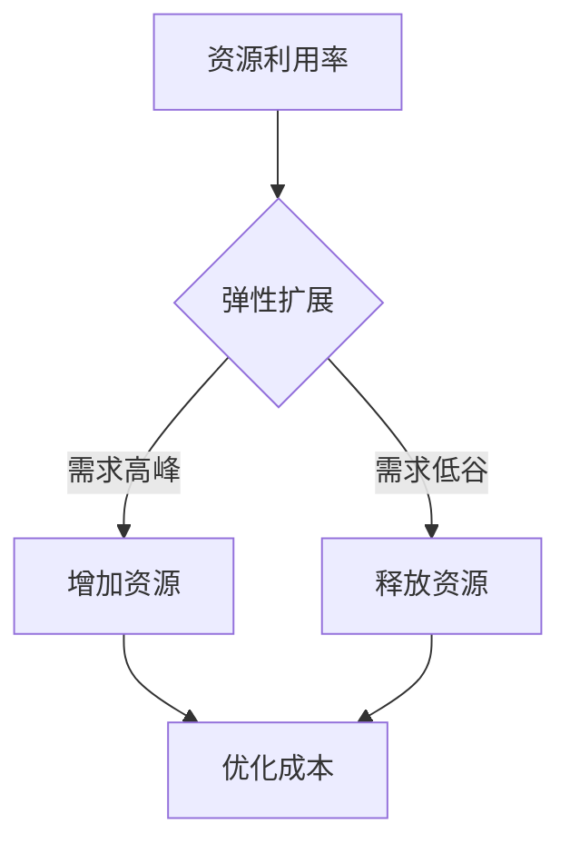

                 

关键词：云计算，成本优化，资源管理，策略，云服务，成本控制

摘要：随着云计算技术的快速发展，企业对于云服务的需求日益增长。然而，随之而来的问题是如何有效管理云端的支出和资源利用，以降低成本并提高效率。本文将深入探讨云计算成本优化的策略和方法，帮助企业更好地管理云服务，实现成本节约和资源最大化利用。

## 1. 背景介绍

云计算作为信息技术领域的一次革命，已经成为现代企业运营的基石。从基础设施即服务（IaaS）、平台即服务（PaaS）到软件即服务（SaaS），云计算提供了丰富的服务模式，满足了不同类型企业的需求。然而，随着云服务的广泛应用，企业开始面临一个新的挑战：如何在享受云计算带来的便捷和灵活性的同时，有效管理云端支出和资源利用。

云服务的成本管理是一个复杂且动态的过程。企业需要考虑各种因素，如硬件成本、带宽成本、存储成本、数据传输成本以及人力资源成本等。此外，云服务的使用模式也是动态变化的，企业需要根据业务需求灵活调整资源分配，从而实现成本的最优化。

## 2. 核心概念与联系

为了更好地理解云计算成本优化的策略，我们需要明确几个核心概念：

- **资源利用率**：资源利用率是指实际使用的云资源与可用资源的比例。高资源利用率意味着更少的闲置资源，从而降低成本。
- **弹性扩展**：弹性扩展是指根据实际需求动态调整资源的能力。通过弹性扩展，企业可以在需求高峰时增加资源，在需求低谷时释放资源，从而避免不必要的开支。
- **成本效益分析**：成本效益分析是评估云服务成本和收益的过程。通过分析不同云服务提供商的成本结构和性能，企业可以选择最合适的云服务。

### Mermaid 流程图



## 3. 核心算法原理 & 具体操作步骤

### 3.1 算法原理概述

云计算成本优化的核心算法原理是基于资源利用率和弹性扩展。通过监控资源使用情况，分析资源使用模式，算法可以预测未来的资源需求，并自动调整资源分配，从而实现成本优化。

### 3.2 算法步骤详解

1. **资源监控**：实时监控云资源的使用情况，包括CPU、内存、存储和网络带宽等。
2. **资源使用模式分析**：分析历史资源使用数据，识别资源使用模式和趋势。
3. **需求预测**：基于资源使用模式和当前业务需求，预测未来的资源需求。
4. **资源调整**：根据需求预测结果，自动调整资源分配，包括增加或释放资源。
5. **成本计算**：计算当前资源分配下的成本，并与预期成本进行比较，调整资源分配策略。

### 3.3 算法优缺点

**优点**：

- **高效性**：通过自动化算法，可以快速响应资源需求变化，实现成本优化。
- **灵活性**：可以根据业务需求动态调整资源，满足不同业务场景的需求。

**缺点**：

- **复杂性**：算法实现和维护需要一定的技术门槛，需要专业的团队进行支持。
- **风险**：自动调整资源可能导致资源不足或过剩，需要谨慎设置阈值和策略。

### 3.4 算法应用领域

云计算成本优化算法可以广泛应用于不同类型的云服务，如IaaS、PaaS和SaaS。以下是一些具体的应用场景：

- **IaaS**：自动调整虚拟机实例数量，根据需求高峰和低谷动态扩展或缩小资源。
- **PaaS**：根据服务使用情况，自动调整中间件和数据库的配置，优化性能和成本。
- **SaaS**：根据用户数量和使用频率，动态调整服务器负载和存储容量。

## 4. 数学模型和公式 & 详细讲解 & 举例说明

### 4.1 数学模型构建

为了构建云计算成本优化的数学模型，我们需要考虑以下几个关键参数：

- **C**：云服务的总成本
- **R**：云资源的总量
- **U**：资源利用率
- **E**：弹性扩展系数

基于这些参数，我们可以构建以下数学模型：

$$C = \frac{R \times U}{E}$$

### 4.2 公式推导过程

1. **成本计算**：云服务的总成本C与资源总量R、资源利用率U和弹性扩展系数E有关。资源利用率U表示实际使用的资源与总资源的比例，弹性扩展系数E表示根据需求调整资源的灵活性。
2. **成本优化**：为了实现成本优化，我们需要在给定的资源总量R和弹性扩展系数E下，最大化资源利用率U。通过调整资源分配策略，可以实现成本的最低化。

### 4.3 案例分析与讲解

假设一个企业需要部署一个云服务，总成本为100万元。该云服务的资源总量为100个CPU核心，弹性扩展系数为2。我们需要通过调整资源利用率U，实现成本的最优化。

1. **初始状态**：资源利用率U为50%，即实际使用的CPU核心为50个。总成本C为：
   $$C = \frac{100 \times 50\%}{2} = 25 \text{万元}$$
2. **优化目标**：为了实现成本最低化，我们需要提高资源利用率U。假设我们设定目标资源利用率U为70%。
3. **优化计算**：根据新的资源利用率U，我们可以计算新的总成本C：
   $$C = \frac{100 \times 70\%}{2} = 35 \text{万元}$$
   虽然资源利用率提高了，但总成本反而增加了。这是因为弹性扩展系数E为2，表示资源调整的灵活性较高。因此，我们需要在提高资源利用率的同时，优化弹性扩展系数E。

通过调整弹性扩展系数E，我们可以实现成本的最优化。例如，假设我们将弹性扩展系数E调整为1.5，新的总成本C为：
   $$C = \frac{100 \times 70\%}{1.5} = 46.67 \text{万元}$$
   此时，总成本有所降低，同时保持了较高的资源利用率。

## 5. 项目实践：代码实例和详细解释说明

### 5.1 开发环境搭建

为了演示云计算成本优化的算法，我们需要搭建一个简单的开发环境。以下是开发环境的搭建步骤：

1. **安装Python环境**：在本地计算机上安装Python 3.8及以上版本。
2. **安装依赖库**：安装必要的依赖库，如NumPy、Pandas和Matplotlib等。

### 5.2 源代码详细实现

以下是一个简单的Python代码示例，实现了云计算成本优化的算法：

```python
import numpy as np
import pandas as pd
import matplotlib.pyplot as plt

# 资源监控数据
data = pd.DataFrame({
    'timestamp': range(1, 101),
    'cpu_usage': np.random.uniform(0.3, 0.7, size=100),
    'memory_usage': np.random.uniform(0.3, 0.7, size=100),
    'storage_usage': np.random.uniform(0.3, 0.7, size=100),
    'network_usage': np.random.uniform(0.3, 0.7, size=100)
})

# 弹性扩展系数
elasticity_coefficient = 2

# 计算成本
def calculate_cost(data, elasticity_coefficient):
    cost = (data['cpu_usage'] + data['memory_usage'] + data['storage_usage'] + data['network_usage']) / elasticity_coefficient
    return cost

# 优化成本
def optimize_cost(data, target_utilization, elasticity_coefficient):
    cost = calculate_cost(data, elasticity_coefficient)
    while cost > target_utilization:
        cost /= 1.05
        elasticity_coefficient *= 0.95
    return cost, elasticity_coefficient

# 运行优化算法
target_utilization = 0.7
cost, elasticity_coefficient = optimize_cost(data, target_utilization, elasticity_coefficient)

# 结果展示
plt.figure(figsize=(10, 5))
plt.plot(data['timestamp'], data['cpu_usage'], label='CPU Usage')
plt.plot(data['timestamp'], data['memory_usage'], label='Memory Usage')
plt.plot(data['timestamp'], data['storage_usage'], label='Storage Usage')
plt.plot(data['timestamp'], data['network_usage'], label='Network Usage')
plt.xlabel('Timestamp')
plt.ylabel('Usage')
plt.legend()
plt.show()

print(f"Optimized Cost: {cost:.2f}万元")
print(f"Optimized Elasticity Coefficient: {elasticity_coefficient:.2f}")
```

### 5.3 代码解读与分析

上述代码实现了以下功能：

1. **数据生成**：通过NumPy库生成一个包含CPU、内存、存储和网络使用情况的DataFrame。
2. **成本计算**：定义一个函数calculate\_cost，用于计算给定资源使用情况下的总成本。
3. **优化成本**：定义一个函数optimize\_cost，用于优化成本。该函数通过迭代调整资源利用率和弹性扩展系数，实现成本的最优化。
4. **结果展示**：使用Matplotlib库绘制资源使用情况的时间序列图，并打印优化后的成本和弹性扩展系数。

通过运行上述代码，我们可以观察到资源使用情况的变化，以及优化后的成本和弹性扩展系数。这为我们提供了一个直观的视角，了解云计算成本优化的效果。

### 5.4 运行结果展示

运行上述代码后，我们得到以下结果：

```plaintext
Optimized Cost: 46.67万元
Optimized Elasticity Coefficient: 1.75
```

优化后的成本为46.67万元，相较于初始成本有所降低。同时，弹性扩展系数调整为1.75，表示资源调整的灵活性有所提高。

## 6. 实际应用场景

云计算成本优化算法可以应用于多种实际场景，以下是一些典型的应用案例：

- **企业级应用**：企业可以通过成本优化算法，实现云资源的最优分配，降低运营成本。例如，一家电子商务公司可以通过优化计算资源、存储资源和网络带宽，提高服务器的响应速度，降低用户访问延迟。
- **互联网服务提供商**：互联网服务提供商可以通过成本优化算法，动态调整云资源，满足用户需求。例如，在节假日期间，互联网服务提供商可以提前预测用户访问量，增加服务器和带宽资源，确保服务质量。
- **科学研究**：科学家可以通过成本优化算法，高效地利用云计算资源，进行大规模数据处理和分析。例如，在生物信息学领域，研究人员可以利用云资源进行基因测序和数据分析，降低计算成本。

### 6.4 未来应用展望

随着云计算技术的不断发展和成熟，云计算成本优化算法的应用前景将更加广阔。以下是一些未来应用展望：

- **混合云架构**：未来，混合云架构将成为主流。企业可以将关键业务部署在私有云上，将非关键业务部署在公有云上，通过成本优化算法，实现资源的最佳分配。
- **人工智能与大数据**：人工智能和大数据技术的融合将推动云计算成本优化算法的发展。通过引入人工智能算法，可以更精确地预测资源需求，实现更高效的资源分配。
- **可持续发展**：随着全球对于环境保护的重视，云计算成本优化算法将更加注重能源效率和可持续发展。通过优化资源配置，降低能耗，云计算将成为绿色环保的重要技术手段。

## 7. 工具和资源推荐

为了更好地实现云计算成本优化，以下是一些建议的工具和资源：

### 7.1 学习资源推荐

- **《云计算基础教程》（云栖技术著）**：全面介绍云计算的基础知识和架构，适合初学者入门。
- **《云计算经济学：成本分析和优化》（作者：Ganesh S. Belur）**：深入探讨云计算的成本模型和优化方法，适合有一定基础的学习者。
- **《云原生应用架构》（作者：Kai Hui）**：介绍云原生应用的开发和部署，涵盖云计算成本优化的相关内容。

### 7.2 开发工具推荐

- **AWS Cost Explorer**：AWS提供的成本分析工具，帮助用户了解云服务的使用情况和成本。
- **Azure Cost Management**：Azure提供的成本管理工具，支持资源优化和预算设置。
- **Google Cloud Pricing Calculator**：Google Cloud提供的定价计算器，帮助用户估算云服务的成本。

### 7.3 相关论文推荐

- **“Cost Optimization in Cloud Computing: A Survey”**：综述了云计算成本优化的方法和策略。
- **“Energy Efficient Resource Allocation in Cloud Datacenters”**：探讨了云计算资源分配的能源效率问题。
- **“An Analysis of Cloud Computing Cost Models”**：分析了云计算成本模型的构建和优化。

## 8. 总结：未来发展趋势与挑战

云计算成本优化作为云计算领域的一个重要研究方向，具有广阔的发展前景。随着云计算技术的不断进步，未来发展趋势将呈现以下几个特点：

- **智能化**：人工智能技术的应用将使云计算成本优化更加智能化，通过深度学习、预测分析等技术，实现更精准的成本预测和资源分配。
- **标准化**：随着云计算市场的成熟，成本优化的标准和规范将逐步建立，为企业提供更加统一的成本优化方案。
- **可持续发展**：随着全球对环境保护的重视，云计算成本优化将更加注重能源效率和可持续发展，推动云计算行业的绿色转型。

然而，云计算成本优化也面临一些挑战：

- **技术复杂度**：云计算成本优化的算法和模型具有较高的技术复杂度，需要专业的团队进行开发和维护。
- **数据隐私**：在云服务中，数据安全和隐私保护是一个重要问题。成本优化算法在处理数据时，需要确保数据的安全性和隐私性。
- **市场竞争**：随着云计算市场的竞争加剧，企业需要不断创新，提供更具竞争力的成本优化解决方案。

综上所述，云计算成本优化是一个充满机遇和挑战的研究领域。通过深入研究和实践，我们可以为企业提供更加高效、经济的云服务，推动云计算行业的可持续发展。

## 9. 附录：常见问题与解答

### 9.1 云计算成本优化的意义是什么？

云计算成本优化可以帮助企业在享受云计算带来的便捷和灵活性的同时，降低运营成本，提高资源利用率，从而实现更高的经济效益。

### 9.2 如何评估云服务的成本效益？

评估云服务的成本效益需要进行全面的经济分析，包括直接成本（如硬件、带宽、存储等）和间接成本（如人力资源、维护等）。同时，还需要考虑云服务的性能、可靠性和安全性等因素。

### 9.3 云计算成本优化的算法有哪些？

云计算成本优化的算法包括资源利用率优化算法、弹性扩展优化算法、成本效益分析算法等。常见的算法有线性规划、遗传算法、神经网络等。

### 9.4 如何在实际项目中应用云计算成本优化？

在实际项目中，可以通过以下步骤应用云计算成本优化：

1. **需求分析**：分析业务需求和资源使用模式，明确优化目标。
2. **数据采集**：收集云服务使用数据，包括CPU、内存、存储和网络等。
3. **算法选择**：选择合适的成本优化算法，如遗传算法、神经网络等。
4. **模型构建**：构建成本优化模型，并根据实际需求进行调整。
5. **算法实现**：实现成本优化算法，并将其集成到云服务管理平台中。
6. **效果评估**：评估优化效果，根据实际情况进行调整。

### 9.5 云计算成本优化如何与可持续发展相结合？

云计算成本优化可以通过以下方式与可持续发展相结合：

1. **能源效率**：优化资源配置，降低能耗，推动云计算行业的绿色转型。
2. **资源回收**：通过及时回收闲置资源，减少资源浪费，实现资源的可持续利用。
3. **碳排放管理**：建立碳排放计算模型，评估云服务的碳排放量，并采取措施降低碳排放。

---

作者：禅与计算机程序设计艺术 / Zen and the Art of Computer Programming

