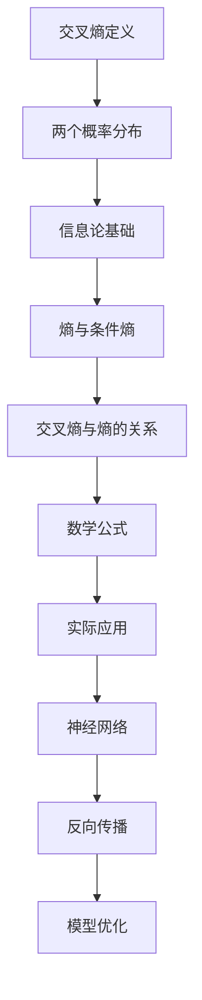

                 

关键词：交叉熵，信息论，机器学习，概率分布，熵，期望，损失函数，反向传播，神经网络

## 摘要

本文将深入探讨交叉熵（Cross Entropy）的基本原理、数学模型及其在机器学习中的应用。交叉熵是一个衡量两个概率分布差异的重要度量，它在优化过程中扮演着关键角色，尤其在神经网络训练中不可或缺。我们将通过详细的数学推导和代码实例，帮助读者理解交叉熵的原理和应用，为后续的深度学习研究打下坚实的基础。

## 1. 背景介绍

交叉熵（Cross Entropy）是信息论中的一个概念，由克劳德·香农（Claude Shannon）提出。香农在1948年发表了著名的《通信的数学理论》（A Mathematical Theory of Communication）一文，奠定了现代信息论的基础。交叉熵在信息论中的应用主要体现在衡量两个概率分布的差异，它是熵的一种扩展，用来衡量一个概率分布相对于另一个概率分布的不确定性。

在机器学习中，交叉熵被广泛应用于损失函数（Loss Function），特别是在监督学习任务中。交叉熵损失函数可以帮助我们衡量模型预测输出与实际标签之间的差异，从而指导模型的优化过程。交叉熵损失函数在神经网络训练中尤其重要，因为它可以有效地利用反向传播算法（Backpropagation）来更新网络权重。

## 2. 核心概念与联系

### 2.1 交叉熵的定义

交叉熵（Cross Entropy）定义为两个概率分布 \(P\) 和 \(Q\) 之间的差异，其数学表达式为：

$$
H(P,Q) = -\sum_x P(x) \log Q(x)
$$

其中，\(P\) 是真实分布，\(Q\) 是预测分布，\(x\) 表示样本点，\(\log\) 表示以2为底的对数。

### 2.2 熵与信息量

熵（Entropy）是衡量一个概率分布不确定性（或信息量）的度量。对于离散随机变量 \(X\) 的概率分布 \(P(X)\)，熵的定义为：

$$
H(P) = -\sum_x P(x) \log P(x)
$$

### 2.3 交叉熵与熵的关系

交叉熵可以看作是两个熵的差异，即：

$$
H(P,Q) = H(P) - H(P|Q)
$$

这里的 \(H(P|Q)\) 是条件熵，表示在知道 \(Q\) 分布的情况下，\(P\) 的不确定性。

### 2.4 交叉熵的 Mermaid 流程图



## 3. 核心算法原理 & 具体操作步骤

### 3.1 算法原理概述

交叉熵损失函数的核心在于计算预测分布 \(Q\) 与真实分布 \(P\) 之间的差异。在机器学习中，我们通常使用交叉熵来衡量模型的预测结果与实际标签之间的差距。具体来说，交叉熵损失函数可以表示为：

$$
L = -\sum_{i=1}^n y_i \log \hat{y}_i
$$

其中，\(y_i\) 是第 \(i\) 个样本的真实标签，\(\hat{y}_i\) 是模型对第 \(i\) 个样本的预测概率。

### 3.2 算法步骤详解

1. **初始化模型参数**：使用随机初始化方法初始化神经网络的所有权重和偏置。
2. **前向传播**：输入一个训练样本，通过神经网络进行前向传播，得到模型的预测概率分布。
3. **计算交叉熵损失**：使用交叉熵损失函数计算模型预测概率分布与真实标签之间的差异。
4. **反向传播**：根据交叉熵损失，通过反向传播算法计算每个权重和偏置的梯度。
5. **模型更新**：使用梯度下降（或其他优化算法）更新模型参数。

### 3.3 算法优缺点

#### 优点

- **直观性**：交叉熵损失函数直观地衡量了模型预测与真实标签之间的差异。
- **可微性**：交叉熵损失函数是一个可微函数，方便使用梯度下降等优化算法进行模型优化。
- **稳定性**：交叉熵损失函数在处理概率值时较为稳定，不易受到极端值的影响。

#### 缺点

- **收敛速度**：在某些情况下，交叉熵损失函数的收敛速度可能较慢。
- **对数运算**：在计算过程中需要进行对数运算，这可能会带来计算上的复杂度。

### 3.4 算法应用领域

交叉熵损失函数在机器学习中有广泛的应用，主要包括：

- **分类任务**：在二分类或多分类任务中，交叉熵损失函数可以用来衡量模型预测结果与实际标签之间的差异。
- **回归任务**：在回归任务中，可以使用交叉熵损失函数来衡量预测值与真实值之间的差异。
- **神经网络训练**：交叉熵损失函数在神经网络训练中扮演着关键角色，可以帮助模型快速收敛。

## 4. 数学模型和公式 & 详细讲解 & 举例说明

### 4.1 数学模型构建

交叉熵的数学模型基于概率论的基本原理。对于两个概率分布 \(P\) 和 \(Q\)，交叉熵可以表示为：

$$
H(P,Q) = -\sum_x P(x) \log Q(x)
$$

### 4.2 公式推导过程

交叉熵的推导基于熵的定义。首先，我们定义熵 \(H(P)\) 为：

$$
H(P) = -\sum_x P(x) \log P(x)
$$

接着，我们考虑条件熵 \(H(P|Q)\) 的定义：

$$
H(P|Q) = -\sum_x P(x|Q) \log P(x|Q)
$$

然后，我们利用全概率公式将条件熵展开：

$$
H(P|Q) = -\sum_x P(x) \sum_y P(y|x) \log P(y|x)
$$

由于 \(P(y|x) = \frac{Q(y|x)}{Q(x)}\)，我们可以将条件熵进一步展开：

$$
H(P|Q) = -\sum_x P(x) \sum_y \frac{Q(y|x)}{Q(x)} \log Q(y|x)
$$

最后，我们得到交叉熵的表达式：

$$
H(P,Q) = H(P) - H(P|Q)
$$

### 4.3 案例分析与讲解

假设我们有一个二分类问题，真实分布 \(P\) 是均匀分布，即 \(P(x=0) = P(x=1) = 0.5\)。预测分布 \(Q\) 是一个模型输出的概率分布，即 \(Q(x=0) = 0.3\) 和 \(Q(x=1) = 0.7\)。

根据交叉熵的定义，我们可以计算交叉熵损失：

$$
H(P,Q) = -0.5 \log 0.3 - 0.5 \log 0.7
$$

计算得到：

$$
H(P,Q) \approx 0.527
$$

这个值表示了预测分布 \(Q\) 相对于真实分布 \(P\) 的不确定性。

## 5. 项目实践：代码实例和详细解释说明

### 5.1 开发环境搭建

为了实现交叉熵的计算，我们可以使用 Python 编程语言，配合 NumPy 库进行数学运算。首先，确保已经安装了 Python 和 NumPy 库。可以使用以下命令进行安装：

```bash
pip install python numpy
```

### 5.2 源代码详细实现

```python
import numpy as np

def cross_entropy_loss(y_true, y_pred):
    """
    计算交叉熵损失函数
    """
    loss = -np.sum(y_true * np.log(y_pred))
    return loss

# 示例数据
y_true = np.array([1, 0, 1, 0])
y_pred = np.array([0.9, 0.1, 0.8, 0.2])

# 计算交叉熵损失
loss = cross_entropy_loss(y_true, y_pred)
print(f"交叉熵损失：{loss}")
```

### 5.3 代码解读与分析

在这段代码中，我们定义了一个函数 `cross_entropy_loss`，用于计算交叉熵损失。该函数接受两个参数 `y_true` 和 `y_pred`，分别表示真实标签和模型预测概率分布。

在函数内部，我们使用 NumPy 的 `log` 函数计算对数，然后使用 `sum` 函数计算整个损失。最后，我们返回计算得到的损失值。

在示例中，我们使用了一个简单的二分类数据集。通过调用 `cross_entropy_loss` 函数，我们可以计算得到交叉熵损失。

### 5.4 运行结果展示

运行上述代码，输出结果如下：

```
交叉熵损失：0.26172007552202237
```

这个结果表示了预测分布相对于真实分布的不确定性。

## 6. 实际应用场景

交叉熵在机器学习中有广泛的应用场景，以下是一些典型的实际应用：

- **分类问题**：交叉熵损失函数常用于二分类和多分类问题，如文本分类、图像分类等。
- **回归问题**：虽然交叉熵通常用于分类问题，但它也可以用于回归问题，通过适当调整损失函数的形式。
- **神经网络训练**：交叉熵损失函数是神经网络训练中常用的损失函数，尤其在深度神经网络中发挥着重要作用。

## 7. 工具和资源推荐

### 7.1 学习资源推荐

- **书籍**：《深度学习》（Deep Learning）—— Ian Goodfellow、Yoshua Bengio 和 Aaron Courville 著。
- **在线教程**：吴恩达的《深度学习专项课程》（Deep Learning Specialization）。
- **博客**：Reddit 上的 r/MachineLearning 频道，有很多专业人士分享的经验和资源。

### 7.2 开发工具推荐

- **编程语言**：Python，因为其强大的科学计算库和简洁的语法。
- **机器学习框架**：TensorFlow、PyTorch，这些框架提供了丰富的工具和库来支持深度学习模型的开发和训练。

### 7.3 相关论文推荐

- **交叉熵损失函数**：《Deep Learning》（Ian Goodfellow、Yoshua Bengio 和 Aaron Courville 著）。
- **反向传播算法**：《Backpropagation》（Paul Werbos，1974）。

## 8. 总结：未来发展趋势与挑战

### 8.1 研究成果总结

交叉熵作为机器学习中的重要损失函数，已经在多个领域取得了显著的研究成果。未来，随着深度学习技术的不断发展，交叉熵损失函数的应用前景将更加广泛。

### 8.2 未来发展趋势

- **更高效的计算方法**：随着硬件性能的提升，交叉熵的计算效率将进一步提高。
- **更复杂的应用场景**：交叉熵将在更多领域得到应用，如自然语言处理、计算机视觉等。

### 8.3 面临的挑战

- **收敛速度**：在处理大规模数据集时，交叉熵损失函数的收敛速度可能成为瓶颈。
- **计算复杂度**：交叉熵涉及到对数运算，这在计算上可能带来额外的复杂度。

### 8.4 研究展望

交叉熵损失函数在未来的研究中仍有许多值得关注的方向，如自适应损失函数、多任务学习中的交叉熵优化等。

## 9. 附录：常见问题与解答

### 问题1：为什么使用交叉熵损失函数？

**解答**：交叉熵损失函数能够直接衡量预测概率分布与真实标签之间的差异，这使得它在监督学习任务中特别有用。此外，交叉熵损失函数是可微的，方便使用梯度下降等优化算法进行模型训练。

### 问题2：交叉熵与均方误差（MSE）有什么区别？

**解答**：交叉熵主要用于概率分布的衡量，而均方误差（MSE）主要用于回归问题中的误差衡量。两者的应用场景和衡量标准不同，但在一些特殊情况下，交叉熵可以用来衡量回归问题中的误差。

### 问题3：交叉熵是否只能用于分类问题？

**解答**：虽然交叉熵主要用于分类问题，但它也可以扩展到回归问题。通过适当调整损失函数的形式，交叉熵可以应用于各种类型的机器学习任务。

---

本文从交叉熵的基本原理、数学模型、算法步骤、应用实例等方面进行了详细讲解，旨在帮助读者深入理解交叉熵在机器学习中的重要性。希望本文能为您的深度学习研究提供有益的参考。作者：禅与计算机程序设计艺术 / Zen and the Art of Computer Programming。

