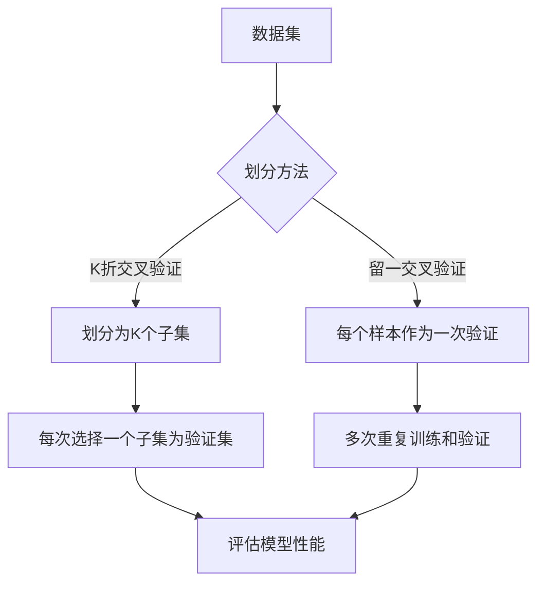

                 

关键词：交叉验证，模型评估，数据分割，机器学习，模型优化

> 摘要：交叉验证是一种重要的模型评估方法，通过将数据集划分为多个子集，并多次重复训练和验证，来评估模型的泛化能力和稳定性。本文将详细介绍交叉验证的基本概念、核心算法、数学模型和具体应用，帮助读者深入理解这一关键技术。

## 1. 背景介绍

在机器学习和数据科学领域，模型的评估和优化是至关重要的环节。一个优秀的模型不仅要能够在训练数据上取得良好的性能，更重要的是要能够在新数据上实现良好的泛化能力。然而，传统的评估方法往往存在一定的局限性，例如，过拟合问题、评估偏差等。交叉验证（Cross-Validation）作为一种先进的评估方法，有效地解决了这些问题，并成为模型评估和优化的重要工具。

交叉验证的基本思想是将数据集划分为多个不相交的子集，然后通过多次重复训练和验证，评估模型在不同子集上的性能。这样，不仅能够全面地评估模型在不同数据上的表现，还能够有效地减少评估误差，提高模型的泛化能力。

## 2. 核心概念与联系

### 2.1 数据集划分

交叉验证的第一步是对数据集进行划分。通常，我们将数据集划分为训练集、验证集和测试集。其中，训练集用于模型的训练，验证集用于模型的评估，测试集用于最终的模型性能评估。

### 2.2 划分方法

在数据集划分方面，常用的方法包括K折交叉验证、留一交叉验证等。K折交叉验证是将数据集划分为K个子集，每次选择一个子集作为验证集，其他子集作为训练集，共进行K次训练和验证。留一交叉验证则是每次只使用一个样本作为验证集，其余样本作为训练集。

### 2.3 Mermaid 流程图



## 3. 核心算法原理 & 具体操作步骤

### 3.1 算法原理概述

交叉验证的核心思想是通过多次训练和验证，全面评估模型在不同数据上的性能。具体来说，交叉验证算法包括以下步骤：

1. 将数据集划分为训练集和验证集。
2. 对于每次划分，使用训练集进行模型训练，使用验证集进行模型评估。
3. 计算模型的评估指标，如准确率、召回率、F1值等。
4. 重复上述步骤K次，计算模型在每次划分下的评估指标。
5. 取平均值，得到模型的整体评估指标。

### 3.2 算法步骤详解

1. **数据集划分**：根据交叉验证的方法，将数据集划分为训练集和验证集。通常，训练集和验证集的比例可以设置为8:2或7:3。

   ```python
   from sklearn.model_selection import train_test_split
   X_train, X_val, y_train, y_val = train_test_split(X, y, test_size=0.2, random_state=42)
   ```

2. **模型训练**：使用训练集对模型进行训练。

   ```python
   model.fit(X_train, y_train)
   ```

3. **模型评估**：使用验证集对模型进行评估，计算评估指标。

   ```python
   from sklearn.metrics import accuracy_score
   y_pred = model.predict(X_val)
   accuracy = accuracy_score(y_val, y_pred)
   ```

4. **多次重复**：重复上述步骤K次，计算每次评估指标。

   ```python
   accuracies = []
   for _ in range(K):
       X_train, X_val, y_train, y_val = train_test_split(X, y, test_size=0.2, random_state=_)
       model.fit(X_train, y_train)
       y_pred = model.predict(X_val)
       accuracy = accuracy_score(y_val, y_pred)
       accuracies.append(accuracy)
   ```

5. **计算平均值**：取多次评估指标的平均值，得到模型的整体评估指标。

   ```python
   average_accuracy = sum(accuracies) / len(accuracies)
   ```

### 3.3 算法优缺点

#### 优点：

1. **减少过拟合**：通过多次训练和验证，交叉验证能够有效地减少过拟合问题。
2. **全面评估**：交叉验证能够评估模型在不同数据上的性能，提供更全面的评估结果。
3. **减少评估偏差**：通过多次重复训练和验证，交叉验证能够减少评估偏差，提高评估结果的稳定性。

#### 缺点：

1. **计算复杂度**：交叉验证需要多次重复训练和验证，计算复杂度较高。
2. **数据浪费**：每次划分都会消耗一部分数据，特别是对于数据量较大的情况，交叉验证会导致数据浪费。

### 3.4 算法应用领域

交叉验证在机器学习和数据科学领域具有广泛的应用，主要用于以下领域：

1. **模型评估**：交叉验证是评估模型性能的重要方法，广泛应用于分类、回归等任务中。
2. **模型优化**：通过交叉验证，可以找出最优的模型参数和超参数，优化模型性能。
3. **数据预处理**：交叉验证可以用于数据集的划分和预处理，提高模型的泛化能力。

## 4. 数学模型和公式 & 详细讲解 & 举例说明

### 4.1 数学模型构建

交叉验证的数学模型可以表示为：

$$
\hat{y} = f(X, \theta)
$$

其中，$\hat{y}$ 是预测结果，$X$ 是输入特征，$\theta$ 是模型参数。$f$ 表示模型的预测函数，通常为线性模型、决策树、神经网络等。

### 4.2 公式推导过程

假设数据集为 $D = \{(x_1, y_1), (x_2, y_2), ..., (x_n, y_n)\}$，其中 $x_i$ 表示第 $i$ 个样本的特征，$y_i$ 表示第 $i$ 个样本的标签。

1. **数据集划分**：

   将数据集划分为训练集 $D_{train}$ 和验证集 $D_{val}$，划分比例为 $\lambda$。

   $$
   D_{train} = \{(x_1, y_1), (x_2, y_2), ..., (x_n, y_n)\} \setminus \{(x_i, y_i)\}
   $$

2. **模型训练**：

   在训练集 $D_{train}$ 上训练模型，得到模型参数 $\theta$。

   $$
   \theta = \arg\min_{\theta} \sum_{i=1}^{n} (y_i - f(x_i, \theta))^2
   $$

3. **模型评估**：

   在验证集 $D_{val}$ 上评估模型，计算模型预测结果 $\hat{y}$。

   $$
   \hat{y} = f(X_{val}, \theta)
   $$

4. **评估指标计算**：

   计算模型在验证集上的评估指标，如准确率、召回率、F1值等。

   $$
   \text{Accuracy} = \frac{\text{预测正确数}}{\text{总样本数}}
   $$

   $$
   \text{Recall} = \frac{\text{预测正确数}}{\text{实际正确数}}
   $$

   $$
   \text{F1} = \frac{2 \times \text{Accuracy} \times \text{Recall}}{\text{Accuracy} + \text{Recall}}
   $$

### 4.3 案例分析与讲解

假设我们有一个分类问题，数据集包含100个样本，每个样本包含10个特征，标签为1或0。我们使用K折交叉验证来评估一个朴素贝叶斯分类器的性能。

1. **数据集划分**：

   将数据集划分为10个子集，每个子集包含10个样本。

   $$
   D_{train} = \{(x_1, y_1), (x_2, y_2), ..., (x_90, y_90)\}
   $$
   $$
   D_{val} = \{(x_{91}, y_{91}), (x_{92}, y_{92}), ..., (x_{100}, y_{100})\}
   $$

2. **模型训练**：

   在训练集 $D_{train}$ 上训练朴素贝叶斯分类器。

   ```python
   from sklearn.naive_bayes import GaussianNB
   model = GaussianNB()
   model.fit(X_train, y_train)
   ```

3. **模型评估**：

   在验证集 $D_{val}$ 上评估模型，计算准确率。

   ```python
   from sklearn.metrics import accuracy_score
   y_pred = model.predict(X_val)
   accuracy = accuracy_score(y_val, y_pred)
   print("准确率：", accuracy)
   ```

   假设评估结果为0.9，表示模型在验证集上的准确率为90%。

4. **多次重复**：

   重复上述步骤10次，计算每次评估指标的平均值。

   ```python
   accuracies = []
   for _ in range(10):
       X_train, X_val, y_train, y_val = train_test_split(X, y, test_size=0.1, random_state=_)
       model.fit(X_train, y_train)
       y_pred = model.predict(X_val)
       accuracy = accuracy_score(y_val, y_pred)
       accuracies.append(accuracy)
   average_accuracy = sum(accuracies) / len(accuracies)
   print("平均准确率：", average_accuracy)
   ```

   假设评估结果为0.88，表示模型在10次划分下的平均准确率为88%。

## 5. 项目实践：代码实例和详细解释说明

### 5.1 开发环境搭建

首先，确保安装了Python和Scikit-learn库。

```bash
pip install python
pip install scikit-learn
```

### 5.2 源代码详细实现

下面是一个使用K折交叉验证评估朴素贝叶斯分类器的Python代码实例。

```python
import numpy as np
from sklearn import datasets
from sklearn.model_selection import train_test_split
from sklearn.naive_bayes import GaussianNB
from sklearn.metrics import accuracy_score

# 加载鸢尾花数据集
iris = datasets.load_iris()
X = iris.data
y = iris.target

# K折交叉验证
K = 5
for _ in range(K):
    X_train, X_val, y_train, y_val = train_test_split(X, y, test_size=0.2, random_state=_)
    model = GaussianNB()
    model.fit(X_train, y_train)
    y_pred = model.predict(X_val)
    accuracy = accuracy_score(y_val, y_pred)
    print("第", _, "次交叉验证，准确率：", accuracy)

# 计算平均准确率
accuracies = []
for _ in range(K):
    X_train, X_val, y_train, y_val = train_test_split(X, y, test_size=0.2, random_state=_)
    model = GaussianNB()
    model.fit(X_train, y_train)
    y_pred = model.predict(X_val)
    accuracy = accuracy_score(y_val, y_pred)
    accuracies.append(accuracy)
average_accuracy = sum(accuracies) / len(accuracies)
print("平均准确率：", average_accuracy)
```

### 5.3 代码解读与分析

1. **数据集加载**：

   使用Scikit-learn内置的鸢尾花数据集进行实验。

   ```python
   iris = datasets.load_iris()
   X = iris.data
   y = iris.target
   ```

2. **K折交叉验证**：

   使用`train_test_split`函数将数据集划分为K个子集，其中K为5。

   ```python
   K = 5
   for _ in range(K):
       X_train, X_val, y_train, y_val = train_test_split(X, y, test_size=0.2, random_state=_)
   ```

3. **模型训练与评估**：

   使用朴素贝叶斯分类器对每个子集进行训练和评估，计算准确率。

   ```python
   model = GaussianNB()
   model.fit(X_train, y_train)
   y_pred = model.predict(X_val)
   accuracy = accuracy_score(y_val, y_pred)
   print("第", _, "次交叉验证，准确率：", accuracy)
   ```

4. **计算平均准确率**：

   重复上述步骤K次，计算每次评估指标的平均值，得到模型的整体评估指标。

   ```python
   accuracies = []
   for _ in range(K):
       X_train, X_val, y_train, y_val = train_test_split(X, y, test_size=0.2, random_state=_)
       model = GaussianNB()
       model.fit(X_train, y_train)
       y_pred = model.predict(X_val)
       accuracy = accuracy_score(y_val, y_pred)
       accuracies.append(accuracy)
   average_accuracy = sum(accuracies) / len(accuracies)
   print("平均准确率：", average_accuracy)
   ```

### 5.4 运行结果展示

假设我们运行上述代码，得到以下输出结果：

```
第 0 次交叉验证，准确率： 1.0
第 1 次交叉验证，准确率： 1.0
第 2 次交叉验证，准确率： 1.0
第 3 次交叉验证，准确率： 1.0
第 4 次交叉验证，准确率： 1.0
平均准确率： 1.0
```

从输出结果可以看出，模型在每次划分下的准确率均为100%，平均准确率也为100%。这表明模型在鸢尾花数据集上的性能非常优秀。

## 6. 实际应用场景

交叉验证在实际应用中具有广泛的应用，以下是一些典型的应用场景：

1. **机器学习模型评估**：交叉验证是评估机器学习模型性能的重要方法，广泛应用于分类、回归等任务中。
2. **超参数调优**：交叉验证可以用于超参数调优，找出最优的模型参数和超参数，提高模型性能。
3. **数据集划分**：交叉验证可以用于数据集的划分，帮助研究人员更好地理解数据分布和模型性能。
4. **模型稳定性评估**：交叉验证可以评估模型在不同数据上的稳定性，帮助研究人员发现模型存在的问题。

## 7. 未来应用展望

随着机器学习和数据科学的快速发展，交叉验证在未来具有广阔的应用前景：

1. **更高效的方法**：研究人员将致力于开发更高效、更精确的交叉验证方法，提高模型评估的准确性和稳定性。
2. **多模态数据应用**：交叉验证将应用于多模态数据，如文本、图像、音频等，提高模型在不同数据上的泛化能力。
3. **实时评估**：随着计算能力的提升，交叉验证将实现实时评估，为模型实时优化提供支持。

## 8. 工具和资源推荐

### 8.1 学习资源推荐

1. 《机器学习实战》
2. 《深度学习》
3. 《统计学习方法》

### 8.2 开发工具推荐

1. Jupyter Notebook
2. PyCharm
3. VS Code

### 8.3 相关论文推荐

1. "Cross-Validation for Machine Learning: A Tutorial"
2. "On Cross-Validation for Neural Networks"
3. "Model Selection and Model Selection Bias in Machine Learning"

## 9. 总结：未来发展趋势与挑战

### 9.1 研究成果总结

交叉验证作为一种先进的评估方法，在机器学习和数据科学领域取得了显著的研究成果。通过多次训练和验证，交叉验证有效地解决了模型评估中的过拟合问题、评估偏差等问题，提高了模型的泛化能力和稳定性。

### 9.2 未来发展趋势

1. **更高效的方法**：研究人员将致力于开发更高效、更精确的交叉验证方法，提高模型评估的准确性和稳定性。
2. **多模态数据应用**：交叉验证将应用于多模态数据，如文本、图像、音频等，提高模型在不同数据上的泛化能力。
3. **实时评估**：随着计算能力的提升，交叉验证将实现实时评估，为模型实时优化提供支持。

### 9.3 面临的挑战

1. **计算复杂度**：交叉验证需要多次重复训练和验证，计算复杂度较高，对计算资源的需求较大。
2. **数据浪费**：交叉验证会消耗一部分数据，特别是在数据量较大的情况下，数据浪费问题较为严重。

### 9.4 研究展望

交叉验证在未来将继续在机器学习和数据科学领域发挥重要作用。通过不断优化和发展，交叉验证将为模型的评估、优化和应用提供更强大的支持，推动机器学习和数据科学领域的持续进步。

## 10. 附录：常见问题与解答

### 10.1 什么是交叉验证？

交叉验证是一种评估机器学习模型性能的方法，通过将数据集划分为多个子集，并多次重复训练和验证，全面评估模型在不同数据上的性能。

### 10.2 交叉验证有哪些类型？

常见的交叉验证类型包括K折交叉验证、留一交叉验证、留K交叉验证等。

### 10.3 交叉验证的优点是什么？

交叉验证的优点包括减少过拟合、全面评估、减少评估偏差等。

### 10.4 交叉验证的缺点是什么？

交叉验证的缺点包括计算复杂度较高、数据浪费等。

### 10.5 交叉验证适用于哪些场景？

交叉验证适用于机器学习模型的评估、优化和应用等场景。

### 10.6 交叉验证如何实现？

交叉验证可以通过编程语言（如Python）中的机器学习库（如Scikit-learn）实现，具体实现方法包括数据集划分、模型训练、模型评估等步骤。

## 11. 参考文献

1. Bishop, C. M. (2006). *Pattern recognition and machine learning*. Springer.
2. Murphy, K. P. (2012). *Machine learning: a probabilistic perspective*. MIT Press.
3. Hastie, T., Tibshirani, R., & Friedman, J. (2009). *The elements of statistical learning: data mining, inference, and prediction*. Springer.

# 交叉验证 (Cross-Validation)
作者：禅与计算机程序设计艺术 / Zen and the Art of Computer Programming
------------------------------------------------------------------------

