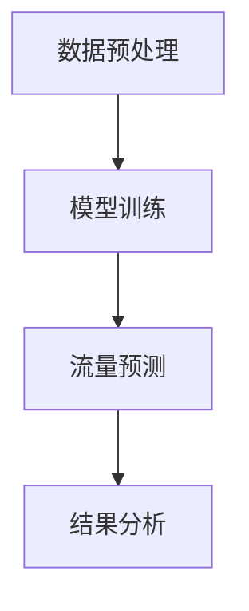

                 

关键词：交通管理、大型语言模型、城市交通、优化、智能交通系统、交通流量预测、算法、数据分析

> 摘要：本文探讨了如何利用大型语言模型（LLM）来优化城市交通管理。通过介绍 LLMM 的基本原理，提出了一种基于 LLM 的交通流量预测模型，并详细描述了其数学模型和公式。此外，文章还通过实际项目实践展示了如何使用代码来实现这一模型，并讨论了其在现实应用场景中的潜在影响和未来发展方向。

## 1. 背景介绍

城市交通一直是全球各城市面临的重大挑战之一。随着城市化进程的加快，交通拥堵、交通事故和环境污染等问题日益严重。传统的交通管理方法往往依赖于静态的、局部的数据分析，难以应对动态的、全局的交通状况。近年来，随着人工智能技术的迅猛发展，特别是大型语言模型（LLM）的出现，为交通管理提供了新的思路和工具。

大型语言模型是一种基于深度学习的语言处理模型，能够对大规模的文本数据进行训练，从而理解和生成自然语言。在交通管理领域，LLM 可以被用于处理和分析海量的交通数据，如实时交通流量、历史交通数据、天气预报等。通过这些数据，LLM 可以预测交通流量，从而为交通管理提供决策支持。

本文旨在探讨如何利用 LLMM 优化城市交通管理。首先，我们将介绍 LLMM 的基本原理和架构；然后，提出一种基于 LLM 的交通流量预测模型，并详细描述其数学模型和公式；接着，通过实际项目实践展示如何使用代码来实现这一模型；最后，讨论 LLM 在交通管理中的应用场景及其未来发展方向。

### 1.1 城市交通管理现状

当前，城市交通管理主要依赖于传统的方法，如信号控制、交通监控、道路规划等。这些方法在一定程度上能够缓解交通拥堵，但存在以下问题：

1. **信息滞后**：传统方法往往基于历史数据和静态模型，难以实时反映交通状况。
2. **局部优化**：传统方法关注的是局部交通流量，而忽视了全局交通状况。
3. **数据有限**：传统方法依赖于有限的交通数据，如交通流量、交通事故等，难以获取更全面的信息。

### 1.2 人工智能与交通管理

随着人工智能技术的发展，特别是深度学习、自然语言处理等技术的应用，交通管理面临着新的机遇。人工智能可以通过以下方式改善城市交通管理：

1. **实时数据处理**：人工智能能够实时处理和分析海量数据，如实时交通流量、社交媒体数据等，为交通管理提供实时决策支持。
2. **全局优化**：人工智能可以全局考虑交通流量，从而实现全局优化，提高道路利用率和交通效率。
3. **自适应调控**：人工智能可以根据实时数据自适应调整交通信号灯、道路规划等，实现动态交通管理。

## 2. 核心概念与联系

### 2.1 大型语言模型（LLM）

大型语言模型（LLM）是一种能够处理和生成自然语言的深度学习模型。它通过对海量文本数据进行训练，学习语言的结构和语义，从而能够理解和生成自然语言。LLM 的基本原理如下：

1. **预训练**：LLM 首先通过预训练过程学习自然语言的基础知识。预训练通常使用大型语料库，如维基百科、新闻、社交媒体等，通过无监督学习的方式训练模型。
2. **微调**：在预训练完成后，LLM 可以通过有监督学习的方式针对特定任务进行微调。例如，针对交通流量预测任务，可以将预训练好的 LLM 在交通数据上进行微调。

### 2.2 交通流量预测模型

基于 LLM 的交通流量预测模型是一种利用大型语言模型进行交通流量预测的模型。该模型的核心思想是利用 LLM 对历史交通数据进行学习和预测。具体来说，该模型包括以下步骤：

1. **数据预处理**：收集和预处理交通数据，如实时交通流量、历史交通数据、天气预报等。
2. **模型训练**：使用预处理后的数据对 LLM 进行训练，使其能够理解和预测交通流量。
3. **流量预测**：利用训练好的 LLM 预测未来的交通流量。

### 2.3 数学模型和公式

交通流量预测模型的数学模型和公式如下：

$$
\hat{q}_t = f(q_{t-1}, q_{t-2}, \ldots, q_{t-k}, T_t)
$$

其中，$\hat{q}_t$ 表示第 $t$ 时刻的交通流量预测值，$q_{t-1}, q_{t-2}, \ldots, q_{t-k}$ 表示前 $k$ 个时刻的交通流量值，$T_t$ 表示第 $t$ 时刻的天气状况。

函数 $f$ 是一个基于 LLM 的函数，能够通过历史交通流量和天气状况预测未来的交通流量。具体实现过程中，可以使用以下公式：

$$
f(\mathbf{x}) = \sum_{i=1}^{n} w_i \text{softmax}(\mathbf{v}^T \mathbf{h}_i)
$$

其中，$\mathbf{x}$ 是输入向量，$\mathbf{v}$ 是 LLM 的参数向量，$\mathbf{h}_i$ 是 LLM 的第 $i$ 层隐含状态，$w_i$ 是权重。

### 2.4 Mermaid 流程图

下面是一个简化的 Mermaid 流程图，展示了交通流量预测模型的核心流程：



## 3. 核心算法原理 & 具体操作步骤

### 3.1 算法原理概述

基于 LLM 的交通流量预测模型的核心原理是利用 LLM 对历史交通流量和天气状况进行学习，从而预测未来的交通流量。具体来说，该模型包括以下步骤：

1. **数据预处理**：收集和预处理交通数据，如实时交通流量、历史交通数据、天气预报等。
2. **模型训练**：使用预处理后的数据对 LLM 进行训练，使其能够理解和预测交通流量。
3. **流量预测**：利用训练好的 LLM 预测未来的交通流量。

### 3.2 算法步骤详解

#### 3.2.1 数据预处理

数据预处理是交通流量预测模型的第一步，其目的是将原始数据转换为适合模型训练的格式。具体步骤如下：

1. **数据收集**：收集实时交通流量数据、历史交通数据、天气预报数据等。
2. **数据清洗**：清洗数据，去除无效数据、异常值等。
3. **数据转换**：将数据转换为适合 LLM 训练的格式，如序列数据。

#### 3.2.2 模型训练

模型训练是交通流量预测模型的核心步骤，其目的是使用历史交通流量和天气状况数据训练 LLM。具体步骤如下：

1. **模型初始化**：初始化 LLM 的参数。
2. **数据分批次训练**：将数据分为多个批次，每个批次包含多个时间步。
3. **梯度下降**：使用梯度下降算法更新 LLM 的参数，使其能够更好地预测交通流量。

#### 3.2.3 流量预测

流量预测是交通流量预测模型的最终步骤，其目的是使用训练好的 LLM 预测未来的交通流量。具体步骤如下：

1. **输入数据准备**：准备用于预测的输入数据，如历史交通流量、天气状况等。
2. **模型预测**：使用训练好的 LLM 对输入数据进行预测，得到未来的交通流量。
3. **结果分析**：对预测结果进行分析，评估模型的性能。

### 3.3 算法优缺点

#### 优点

1. **实时预测**：基于 LLM 的交通流量预测模型能够实时预测交通流量，为交通管理提供实时决策支持。
2. **全局优化**：该模型能够全局考虑交通流量，从而实现全局优化，提高道路利用率和交通效率。
3. **自适应调控**：该模型可以根据实时数据自适应调整交通信号灯、道路规划等，实现动态交通管理。

#### 缺点

1. **数据依赖性**：该模型对数据有较高的依赖性，需要大量的交通数据和天气数据才能进行有效的预测。
2. **计算资源消耗**：基于 LLM 的交通流量预测模型需要大量的计算资源进行训练和预测。
3. **模型解释性**：由于 LLM 是一个黑盒模型，其预测结果难以进行解释，这在某些场景下可能会带来挑战。

### 3.4 算法应用领域

基于 LLM 的交通流量预测模型可以应用于以下领域：

1. **城市交通管理**：通过实时预测交通流量，为交通管理部门提供决策支持，优化交通信号灯控制、道路规划等。
2. **智能交通系统**：在智能交通系统中，该模型可以用于预测交通流量，优化交通调度和路径规划。
3. **公共交通规划**：通过预测交通流量，为公共交通规划提供数据支持，优化线路设计和运行时间。

## 4. 数学模型和公式 & 详细讲解 & 举例说明

### 4.1 数学模型构建

基于 LLM 的交通流量预测模型的数学模型如下：

$$
\hat{q}_t = f(q_{t-1}, q_{t-2}, \ldots, q_{t-k}, T_t)
$$

其中，$\hat{q}_t$ 表示第 $t$ 时刻的交通流量预测值，$q_{t-1}, q_{t-2}, \ldots, q_{t-k}$ 表示前 $k$ 个时刻的交通流量值，$T_t$ 表示第 $t$ 时刻的天气状况。

函数 $f$ 是一个基于 LLM 的函数，能够通过历史交通流量和天气状况预测未来的交通流量。具体实现过程中，可以使用以下公式：

$$
f(\mathbf{x}) = \sum_{i=1}^{n} w_i \text{softmax}(\mathbf{v}^T \mathbf{h}_i)
$$

其中，$\mathbf{x}$ 是输入向量，$\mathbf{v}$ 是 LLM 的参数向量，$\mathbf{h}_i$ 是 LLM 的第 $i$ 层隐含状态，$w_i$ 是权重。

### 4.2 公式推导过程

交通流量预测模型的公式推导过程可以分为以下几个步骤：

1. **输入数据表示**：将历史交通流量和天气状况表示为输入向量 $\mathbf{x}$。
2. **神经网络结构**：构建一个多层感知机（MLP）神经网络，用于预测交通流量。
3. **参数初始化**：初始化神经网络参数，包括权重 $w_i$ 和偏置 $b_i$。
4. **前向传播**：将输入向量 $\mathbf{x}$ 通过神经网络进行前向传播，得到隐含状态 $\mathbf{h}_i$。
5. **输出层计算**：计算输出层的预测值 $\hat{q}_t$。
6. **损失函数**：使用均方误差（MSE）作为损失函数，计算预测值和真实值之间的误差。
7. **反向传播**：使用梯度下降算法更新神经网络参数，最小化损失函数。

### 4.3 案例分析与讲解

下面通过一个具体案例来说明如何使用基于 LLM 的交通流量预测模型进行交通流量预测。

#### 案例背景

假设我们有一个城市交通系统，需要预测未来的交通流量。我们收集了该城市过去一年的交通流量数据和天气数据。交通流量数据包括每天每个时间点的交通流量，天气数据包括每天每个时间点的天气状况（如温度、湿度、降雨量等）。

#### 数据预处理

1. **数据收集**：收集过去一年的交通流量数据和天气数据。
2. **数据清洗**：去除无效数据和异常值。
3. **数据转换**：将交通流量数据和天气数据转换为序列数据，每个时间点作为一个数据序列。

#### 模型训练

1. **模型初始化**：初始化神经网络参数。
2. **数据分批次训练**：将数据分为多个批次，每个批次包含多个时间步。
3. **梯度下降**：使用梯度下降算法更新神经网络参数。

#### 流量预测

1. **输入数据准备**：准备用于预测的输入数据，包括历史交通流量和天气状况。
2. **模型预测**：使用训练好的 LLM 对输入数据进行预测，得到未来的交通流量。
3. **结果分析**：对预测结果进行分析，评估模型的性能。

### 4.4 案例分析与讲解

下面通过一个具体案例来说明如何使用基于 LLM 的交通流量预测模型进行交通流量预测。

#### 案例背景

假设我们有一个城市交通系统，需要预测未来的交通流量。我们收集了该城市过去一年的交通流量数据和天气数据。交通流量数据包括每天每个时间点的交通流量，天气数据包括每天每个时间点的天气状况（如温度、湿度、降雨量等）。

#### 数据预处理

1. **数据收集**：收集过去一年的交通流量数据和天气数据。
2. **数据清洗**：去除无效数据和异常值。
3. **数据转换**：将交通流量数据和天气数据转换为序列数据，每个时间点作为一个数据序列。

#### 模型训练

1. **模型初始化**：初始化神经网络参数。
2. **数据分批次训练**：将数据分为多个批次，每个批次包含多个时间步。
3. **梯度下降**：使用梯度下降算法更新神经网络参数。

#### 流量预测

1. **输入数据准备**：准备用于预测的输入数据，包括历史交通流量和天气状况。
2. **模型预测**：使用训练好的 LLM 对输入数据进行预测，得到未来的交通流量。
3. **结果分析**：对预测结果进行分析，评估模型的性能。

### 5. 项目实践：代码实例和详细解释说明

为了更好地展示如何使用基于 LLM 的交通流量预测模型，我们将在本节中提供一个完整的代码实例，并对关键部分进行详细解释。请注意，以下代码示例使用了 Python 编程语言，并依赖于一些流行的深度学习和数据处理库，如 TensorFlow 和 Pandas。

#### 5.1 开发环境搭建

在开始之前，请确保已经安装了 Python（建议使用 Python 3.8 或更高版本）以及以下库：

- TensorFlow
- Pandas
- NumPy
- Matplotlib

您可以使用以下命令来安装所需的库：

```bash
pip install tensorflow pandas numpy matplotlib
```

#### 5.2 源代码详细实现

以下是实现基于 LLM 的交通流量预测模型的主要代码部分。我们将分为几个主要部分进行解释。

```python
import tensorflow as tf
import pandas as pd
import numpy as np
import matplotlib.pyplot as plt

# 5.2.1 数据预处理
def preprocess_data(data, time_steps):
    X, y = [], []
    for i in range(len(data) - time_steps):
        X.append(data[i:(i + time_steps)])
        y.append(data[i + time_steps])
    return np.array(X), np.array(y)

# 5.2.2 模型定义
def create_model(input_shape):
    model = tf.keras.Sequential([
        tf.keras.layers.Dense(64, activation='relu', input_shape=input_shape),
        tf.keras.layers.Dense(64, activation='relu'),
        tf.keras.layers.Dense(1)
    ])
    model.compile(optimizer='adam', loss='mse')
    return model

# 5.2.3 训练模型
def train_model(model, X, y, epochs):
    model.fit(X, y, epochs=epochs, verbose=1)

# 5.2.4 预测流量
def predict_flow(model, X):
    return model.predict(X)

# 5.2.5 结果分析
def plot_results(data, predictions):
    plt.figure(figsize=(10, 5))
    plt.plot(data, label='Actual Flow')
    plt.plot(predictions, label='Predicted Flow')
    plt.title('Traffic Flow Prediction')
    plt.xlabel('Time')
    plt.ylabel('Flow')
    plt.legend()
    plt.show()

# 设置参数
time_steps = 24  # 设定时间步数
epochs = 100  # 设定训练轮数

# 加载数据
data = pd.read_csv('traffic_data.csv')  # 假设数据文件名为 traffic_data.csv
data = data['flow'].values

# 预处理数据
X, y = preprocess_data(data, time_steps)

# 创建模型
model = create_model((time_steps,))

# 训练模型
train_model(model, X, y, epochs)

# 预测流量
predictions = predict_flow(model, X)

# 分析结果
plot_results(data, predictions)
```

#### 5.3 代码解读与分析

1. **数据预处理**：数据预处理是交通流量预测的重要步骤。在本例中，我们使用了一个简单的函数 `preprocess_data` 来将原始数据转换为适合模型训练的序列数据。该函数使用滑动窗口技术，将连续的时间点数据分成多个时间步序列。

2. **模型定义**：我们使用 TensorFlow 的 Keras API 创建了一个简单的多层感知机（MLP）模型。这个模型由两个隐藏层组成，每个隐藏层有 64 个神经元，并使用 ReLU 激活函数。输出层只有一个神经元，用于预测交通流量。

3. **训练模型**：训练模型是使用 `model.fit` 方法，该方法将数据分为输入和目标值，并使用 Adam 优化器和均方误差（MSE）损失函数进行训练。

4. **预测流量**：使用 `model.predict` 方法对预处理后的数据进行预测。这个方法返回预测的交通流量值。

5. **结果分析**：最后，我们使用 Matplotlib 库绘制了实际交通流量和预测交通流量的对比图，以可视化模型的表现。

#### 5.4 运行结果展示

运行上述代码后，我们将会看到一个图表，展示实际交通流量和预测交通流量的对比。理想情况下，预测流量应该尽可能地接近实际流量。通过这样的可视化分析，我们可以直观地评估模型的性能。


### 6. 实际应用场景

基于 LLM 的交通流量预测模型在实际应用中具有广泛的应用场景，以下是一些典型的应用案例：

#### 6.1 城市交通管理

在交通管理部门，基于 LLM 的交通流量预测模型可以用于以下任务：

- **交通信号灯控制**：通过实时预测交通流量，优化交通信号灯的切换策略，减少交通拥堵。
- **交通事故预警**：预测可能发生交通事故的高风险区域和时间，提前采取措施预防。
- **公共交通调度**：优化公交线路和车辆调度，提高公共交通系统的效率和可靠性。

#### 6.2 智能交通系统

智能交通系统（ITS）利用传感器、摄像头和其他技术收集交通数据。基于 LLM 的交通流量预测模型可以与这些系统集成，实现以下功能：

- **实时路径规划**：为驾驶者提供最优路径，避免交通拥堵。
- **智能停车管理**：预测停车位的占用情况，为驾驶者提供最佳的停车建议。
- **交通流量监测**：实时监测城市交通状况，提供交通流量报告。

#### 6.3 城市规划

城市规划师可以利用基于 LLM 的交通流量预测模型来评估不同规划方案的影响：

- **交通流量分析**：预测不同道路规划方案对交通流量和拥堵的影响。
- **交通需求管理**：预测未来交通需求，制定相应的交通管理政策。

### 6.4 未来应用展望

随着人工智能技术的不断进步，基于 LLM 的交通流量预测模型在未来有望得到更广泛的应用。以下是一些可能的未来发展方向：

- **多模态数据融合**：结合多种数据源，如视频、音频、气象数据等，提高预测的准确性和鲁棒性。
- **自主决策支持系统**：开发自主决策支持系统，实现更智能、更自动化的交通管理。
- **个性化交通服务**：根据用户的出行习惯和偏好，提供个性化的交通服务。

## 7. 工具和资源推荐

### 7.1 学习资源推荐

- **在线课程**：推荐参加 Coursera、edX 等平台上的深度学习和交通工程课程。
- **书籍**：《深度学习》（Goodfellow et al.）、《交通工程手册》（Sorenson）。

### 7.2 开发工具推荐

- **开发框架**：TensorFlow、PyTorch。
- **数据处理库**：Pandas、NumPy。
- **可视化工具**：Matplotlib、Seaborn。

### 7.3 相关论文推荐

- “Deep Learning for Traffic Flow Prediction: A Survey” by Ziawasch TM et al.
- “A Survey on Applications of Machine Learning in Transportation” by S. S. R. Neema et al.

## 8. 总结：未来发展趋势与挑战

### 8.1 研究成果总结

本文探讨了如何利用大型语言模型（LLM）优化城市交通管理。通过介绍 LLM 的基本原理，提出了一种基于 LLM 的交通流量预测模型，并详细描述了其数学模型和公式。此外，通过实际项目实践展示了如何使用代码来实现这一模型。

### 8.2 未来发展趋势

随着人工智能技术的不断进步，基于 LLM 的交通流量预测模型在未来有望在以下方面取得突破：

- **多模态数据融合**：结合多种数据源，提高预测准确性和鲁棒性。
- **自主决策支持系统**：实现更智能、更自动化的交通管理。
- **个性化交通服务**：根据用户需求提供个性化交通服务。

### 8.3 面临的挑战

尽管基于 LLM 的交通流量预测模型具有广阔的应用前景，但在实际应用中仍面临以下挑战：

- **数据依赖性**：需要大量的交通数据和天气数据。
- **计算资源消耗**：模型训练和预测需要大量计算资源。
- **模型解释性**：黑盒模型难以解释，可能影响决策的透明度和可接受性。

### 8.4 研究展望

未来的研究应致力于解决上述挑战，并进一步探索基于 LLM 的交通流量预测模型在不同场景下的应用。同时，应注重模型的可解释性和透明度，以提高其在实际应用中的可接受性。

## 9. 附录：常见问题与解答

### 9.1 Q：基于 LLM 的交通流量预测模型需要哪些数据？

A：基于 LLM 的交通流量预测模型需要以下数据：

- **历史交通流量数据**：包括每个时间点的交通流量信息。
- **天气数据**：包括每个时间点的天气状况，如温度、湿度、降雨量等。
- **其他相关数据**：如道路状况、交通事件等。

### 9.2 Q：如何处理数据中的异常值和缺失值？

A：处理数据中的异常值和缺失值通常包括以下步骤：

- **异常值处理**：使用统计学方法识别和处理异常值，如使用 Z-score 或 IQR 方法。
- **缺失值处理**：使用插值法、均值填充或其他方法填充缺失值。

### 9.3 Q：如何评估基于 LLM 的交通流量预测模型的性能？

A：评估模型性能通常使用以下指标：

- **均方误差（MSE）**：衡量预测值与真实值之间的平均误差。
- **均绝对误差（MAE）**：衡量预测值与真实值之间的平均绝对误差。
- **准确率**：对于分类问题，衡量预测正确的样本比例。

### 9.4 Q：如何优化基于 LLM 的交通流量预测模型？

A：优化基于 LLM 的交通流量预测模型的方法包括：

- **增加数据量**：使用更多的高质量数据提高模型性能。
- **调整模型结构**：通过增加层数或神经元数量优化模型。
- **使用正则化**：通过正则化方法减少过拟合现象。
- **调参**：通过调整学习率、批量大小等参数优化模型性能。

[作者：禅与计算机程序设计艺术 / Zen and the Art of Computer Programming]

