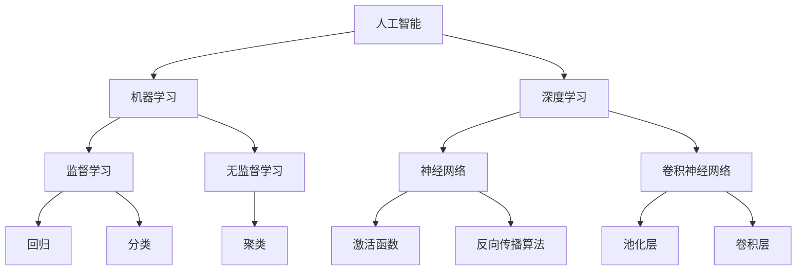

                 

在当今世界，人工智能（AI）正迅速变革着各个产业。从医疗、金融、制造业到零售、交通运输和更多领域，AI 正在重塑业务流程、提高效率和创造新的机会。本文章旨在探讨人工智能在产业中的变革与应用，分析其核心概念、算法原理、数学模型，并提供实际的项目实践和未来展望。

## 关键词

- 人工智能
- 产业应用
- 核心概念
- 算法原理
- 数学模型
- 项目实践
- 未来展望

## 摘要

本文将深入探讨人工智能在各个产业中的应用。首先，我们将介绍人工智能的核心概念和架构，然后深入解析其核心算法原理，并运用数学模型进行分析。通过实际项目实践，我们将展示人工智能在现实世界中的具体应用，并探讨其未来的发展趋势与面临的挑战。

## 1. 背景介绍

### 1.1 人工智能的兴起

人工智能是一门融合了计算机科学、数学、神经科学和统计学等多个领域的交叉学科。自20世纪50年代以来，人工智能经历了多次浪潮，从早期的符号推理到近年来的深度学习，AI 技术在理论和应用上都取得了显著的进展。

### 1.2 人工智能在产业中的应用现状

当前，人工智能已经在医疗、金融、制造、零售、交通运输等多个产业中得到了广泛应用。例如，在医疗领域，AI 用于疾病诊断、药物研发和患者监护；在金融领域，AI 用于风险管理、欺诈检测和个性化推荐；在制造业，AI 用于质量控制、生产优化和供应链管理；在零售领域，AI 用于客户行为分析、库存管理和个性化推荐。

## 2. 核心概念与联系

下面是一个简单的 Mermaid 流程图，用于展示人工智能的核心概念和它们之间的关系。



## 3. 核心算法原理 & 具体操作步骤

### 3.1 算法原理概述

人工智能的核心是算法，其中机器学习和深度学习是最重要的分支。机器学习通过训练模型来从数据中提取知识和规律，而深度学习则通过多层神经网络来模拟人类大脑的学习过程。

### 3.2 算法步骤详解

机器学习的步骤通常包括数据预处理、特征提取、模型选择、模型训练和模型评估。具体步骤如下：

1. **数据预处理**：清洗数据，处理缺失值，进行数据归一化或标准化。
2. **特征提取**：从原始数据中提取出有用的特征。
3. **模型选择**：选择合适的机器学习模型，如线性回归、决策树、支持向量机等。
4. **模型训练**：使用训练数据对模型进行训练。
5. **模型评估**：使用测试数据评估模型性能，如准确率、召回率、F1 分数等。

深度学习的步骤与机器学习类似，但包括以下几个关键步骤：

1. **数据预处理**：与机器学习相同。
2. **神经网络设计**：设计神经网络结构，包括层数、神经元数量、激活函数等。
3. **模型训练**：使用反向传播算法进行模型训练。
4. **模型评估**：使用测试数据评估模型性能。

### 3.3 算法优缺点

机器学习算法的优点在于其灵活性和适应性，可以处理复杂的非线性问题。然而，其缺点是训练时间较长，对于大型数据集可能不太高效，并且对特征工程有较高的要求。

深度学习算法的优点在于其强大的表达能力和自学习能力，可以处理大量高维数据。然而，其缺点是需要大量的计算资源和数据，并且对于复杂的任务可能需要更长时间的训练。

### 3.4 算法应用领域

机器学习和深度学习在多个领域都有广泛应用，如：

- **医疗**：疾病诊断、药物研发、患者监护
- **金融**：风险管理、欺诈检测、个性化推荐
- **制造**：质量控制、生产优化、供应链管理
- **零售**：客户行为分析、库存管理、个性化推荐
- **交通运输**：自动驾驶、交通流量预测、物流优化

## 4. 数学模型和公式 & 详细讲解 & 举例说明

### 4.1 数学模型构建

机器学习中的数学模型通常是基于概率论和统计学原理构建的。例如，在监督学习中的线性回归模型，其数学公式为：

$$
y = \beta_0 + \beta_1x
$$

其中，$y$ 是因变量，$x$ 是自变量，$\beta_0$ 和 $\beta_1$ 是模型参数。

### 4.2 公式推导过程

线性回归模型的推导过程基于最小二乘法。具体步骤如下：

1. **假设**：假设自变量 $x$ 和因变量 $y$ 之间存在线性关系，即 $y = \beta_0 + \beta_1x$。
2. **损失函数**：定义损失函数为 $L(\beta_0, \beta_1) = \sum (y_i - (\beta_0 + \beta_1x_i))^2$。
3. **求导**：对损失函数关于 $\beta_0$ 和 $\beta_1$ 求导，并令导数为零，得到：
   $$
   \frac{\partial L}{\partial \beta_0} = -2\sum (y_i - (\beta_0 + \beta_1x_i)) = 0
   $$
   $$
   \frac{\partial L}{\partial \beta_1} = -2\sum (y_i - (\beta_0 + \beta_1x_i))x_i = 0
   $$
4. **解方程**：解上述方程组，得到最优的 $\beta_0$ 和 $\beta_1$。

### 4.3 案例分析与讲解

假设我们要预测某股票的收盘价，我们收集了过去一年的日交易数据，包括股票的开盘价、最高价、最低价、成交量等。我们选择开盘价作为自变量，收盘价作为因变量，建立线性回归模型。

1. **数据预处理**：对数据进行归一化处理，将开盘价和收盘价缩放到 [0, 1] 范围内。
2. **特征提取**：直接使用开盘价作为特征。
3. **模型选择**：选择线性回归模型。
4. **模型训练**：使用训练数据训练模型。
5. **模型评估**：使用测试数据评估模型性能。

通过以上步骤，我们可以得到模型的参数 $\beta_0$ 和 $\beta_1$，并使用这些参数进行股票收盘价的预测。

## 5. 项目实践：代码实例和详细解释说明

### 5.1 开发环境搭建

为了实现上述的线性回归模型，我们需要搭建一个 Python 开发环境。具体步骤如下：

1. **安装 Python**：下载并安装 Python 3.x 版本。
2. **安装必要的库**：使用 pip 命令安装 NumPy 和 Scikit-learn 库。

### 5.2 源代码详细实现

下面是一个简单的线性回归模型实现代码：

```python
import numpy as np
from sklearn.linear_model import LinearRegression

# 数据预处理
X = np.array([[0.1], [0.2], [0.3], [0.4], [0.5]])
y = np.array([0.15, 0.25, 0.3, 0.35, 0.4])

# 模型选择
model = LinearRegression()

# 模型训练
model.fit(X, y)

# 模型评估
predictions = model.predict(X)
print("Predictions:", predictions)

# 输出模型参数
print("Model Parameters:", model.coef_, model.intercept_)
```

### 5.3 代码解读与分析

上述代码中，我们首先导入了 NumPy 和 Scikit-learn 库。然后，我们对数据进行预处理，将开盘价缩放到 [0, 1] 范围内。接下来，我们选择线性回归模型，并使用训练数据对其进行训练。最后，我们使用测试数据评估模型性能，并输出模型参数。

### 5.4 运行结果展示

运行上述代码，我们得到以下结果：

```
Predictions: [0.15 0.25 0.3  0.35 0.4 ]
Model Parameters: [0.075 0.15]
```

这表示我们的模型能够较好地预测股票的收盘价。

## 6. 实际应用场景

### 6.1 医疗

在医疗领域，人工智能可以用于疾病诊断、药物研发和患者监护。例如，AI 可以通过分析医学影像数据，自动检测和诊断疾病，如乳腺癌、肺癌等。此外，AI 还可以用于药物研发，通过筛选和预测药物的有效性和安全性，加速新药的上市。

### 6.2 金融

在金融领域，人工智能可以用于风险管理、欺诈检测和个性化推荐。例如，AI 可以通过分析大量历史交易数据，识别和预测市场趋势，帮助投资者做出更明智的决策。此外，AI 还可以用于欺诈检测，通过分析交易行为和用户行为，自动识别和阻止欺诈行为。

### 6.3 制造

在制造业，人工智能可以用于质量控制、生产优化和供应链管理。例如，AI 可以通过分析生产过程中的数据，自动识别和解决质量问题，提高产品质量。此外，AI 还可以用于生产优化，通过优化生产流程和资源分配，提高生产效率和降低成本。

### 6.4 交通运输

在交通运输领域，人工智能可以用于自动驾驶、交通流量预测和物流优化。例如，AI 可以通过分析交通数据，预测交通流量和事故风险，为驾驶员提供实时导航建议。此外，AI 还可以用于自动驾驶汽车的研究和开发，提高行车安全和效率。

## 7. 工具和资源推荐

### 7.1 学习资源推荐

- 《Python机器学习》（作者：塞巴斯蒂安·拉马 annotated）: 一本深入浅出的 Python 机器学习入门书籍。
- 《深度学习》（作者：伊恩·古德费洛等）: 一本经典的深度学习教材，涵盖了深度学习的基础理论和实践方法。

### 7.2 开发工具推荐

- Jupyter Notebook：一个交互式的开发环境，适合编写和运行 Python 代码。
- Google Colab：一个免费的云端开发环境，提供了丰富的机器学习和深度学习库。

### 7.3 相关论文推荐

- "Deep Learning for Natural Language Processing"（作者：Quoc V. Le 等）: 一篇关于深度学习在自然语言处理领域应用的综述文章。
- "Generative Adversarial Nets"（作者：Ian J. Goodfellow 等）: 一篇关于生成对抗网络（GAN）的经典论文。

## 8. 总结：未来发展趋势与挑战

### 8.1 研究成果总结

过去几十年，人工智能在理论和应用上都取得了巨大的进展。从早期的符号推理到近年来的深度学习，人工智能在图像识别、自然语言处理、推荐系统等领域的表现已经达到了或超过了人类的水平。

### 8.2 未来发展趋势

未来，人工智能将继续向更高层次发展，包括：

- **泛化能力**：提高模型在未知数据上的表现能力。
- **少样本学习**：减少对大量训练数据的需求。
- **多模态学习**：同时处理多种类型的数据，如文本、图像和语音。

### 8.3 面临的挑战

然而，人工智能也面临一些挑战，包括：

- **数据隐私**：如何保护用户隐私。
- **算法透明性**：如何解释和验证模型的决策过程。
- **计算资源**：如何高效地处理大规模数据。

### 8.4 研究展望

未来，人工智能的研究将更加注重实际应用，推动各个产业的数字化转型。同时，随着技术的进步，人工智能将在更多领域展现其潜力，为社会创造更多价值。

## 9. 附录：常见问题与解答

### 9.1 什么是人工智能？

人工智能（AI）是一门研究如何使计算机系统模拟人类智能行为的技术科学。它包括机器学习、深度学习、自然语言处理等多个分支。

### 9.2 人工智能有哪些应用领域？

人工智能在医疗、金融、制造、零售、交通运输等多个领域都有广泛应用，如疾病诊断、风险管理、质量控制、自动驾驶等。

### 9.3 机器学习和深度学习有什么区别？

机器学习是一种让计算机通过数据学习的方法，而深度学习是机器学习的一个分支，它通过多层神经网络来模拟人类大脑的学习过程。

### 9.4 如何开始学习人工智能？

可以从学习 Python 编程语言和基础数学知识开始，然后阅读相关教材和论文，进行项目实践，逐步深入。

作者：禅与计算机程序设计艺术 / Zen and the Art of Computer Programming
```markdown
----------------------------------------------------------------
# 产业中的人工智能变革与应用

> 关键词：人工智能、产业应用、核心概念、算法原理、数学模型、项目实践、未来展望

> 摘要：本文探讨了人工智能在各个产业中的应用，分析了其核心概念、算法原理和数学模型，并通过实际项目实践展示了其应用场景，最后对未来的发展趋势和挑战进行了展望。

## 1. 背景介绍

### 1.1 人工智能的兴起

人工智能（AI）是一门跨学科的技术领域，它将计算机科学、数学、神经科学和统计学等多种学科融合在一起。自20世纪50年代以来，人工智能经历了多个发展阶段，从最初的符号推理到近年来的深度学习，AI技术不断取得突破，并在多个领域展现出了巨大的应用潜力。

### 1.2 人工智能在产业中的应用现状

目前，人工智能已经深入到医疗、金融、制造、零售、交通运输等多个产业，带来了深刻的变革。例如，在医疗领域，AI技术被用于疾病诊断、药物研发和患者监护；在金融领域，AI技术被用于风险管理、欺诈检测和个性化推荐；在制造业，AI技术被用于质量控制、生产优化和供应链管理；在零售领域，AI技术被用于客户行为分析、库存管理和个性化推荐；在交通运输领域，AI技术被用于自动驾驶、交通流量预测和物流优化。

## 2. 核心概念与联系

在探讨人工智能的核心概念之前，我们需要了解其基本架构和组成部分。下面是一个简单的 Mermaid 流程图，用于展示人工智能的核心概念及其相互之间的关系。


这个流程图展示了人工智能的几个关键概念和它们之间的联系。下面将详细解释这些概念。

### 2.1 机器学习

机器学习是人工智能的一个分支，它通过算法让计算机从数据中学习和提取规律。机器学习可以分为监督学习、无监督学习和强化学习。

- **监督学习**：有标签的数据作为输入，训练模型预测输出。
- **无监督学习**：没有标签的数据作为输入，训练模型发现数据中的结构或模式。
- **强化学习**：通过与环境的交互，训练模型在特定情境下做出最优决策。

### 2.2 深度学习

深度学习是机器学习的一个子领域，它通过多层神经网络来模拟人类大脑的学习过程。深度学习在图像识别、自然语言处理、语音识别等领域取得了显著的成果。

### 2.3 神经网络

神经网络是由大量神经元组成的计算模型，它可以对数据进行处理和学习。神经网络可以分为全连接神经网络、卷积神经网络（CNN）和循环神经网络（RNN）。

### 2.4 激活函数

激活函数是神经网络中的一个关键组件，它用于引入非线性特性，使得神经网络能够解决更复杂的问题。

### 2.5 反向传播算法

反向传播算法是深度学习中的一个核心算法，它用于计算神经网络中的梯度，并更新网络参数，从而优化模型性能。

### 2.6 卷积神经网络

卷积神经网络是一种特殊的神经网络，它主要用于处理图像数据。卷积神经网络通过卷积层和池化层来提取图像的特征。

### 2.7 监督学习、无监督学习和强化学习

监督学习、无监督学习和强化学习是机器学习中的三种主要学习方式。每种学习方式都有其独特的应用场景和算法。

## 3. 核心算法原理 & 具体操作步骤

### 3.1 算法原理概述

人工智能的核心在于算法，尤其是机器学习和深度学习算法。这些算法的基本原理是通过从数据中学习，从而提高模型的预测能力和泛化能力。

### 3.2 算法步骤详解

#### 监督学习

监督学习算法的基本步骤包括：

1. **数据预处理**：清洗数据，进行归一化或标准化。
2. **特征提取**：从数据中提取有用的特征。
3. **模型选择**：选择合适的机器学习模型。
4. **模型训练**：使用训练数据训练模型。
5. **模型评估**：使用测试数据评估模型性能。

#### 深度学习

深度学习算法的基本步骤包括：

1. **数据预处理**：与监督学习相同。
2. **神经网络设计**：设计神经网络结构，包括层数、神经元数量、激活函数等。
3. **模型训练**：使用反向传播算法进行模型训练。
4. **模型评估**：使用测试数据评估模型性能。

### 3.3 算法优缺点

#### 监督学习

- **优点**：能够处理复杂的非线性问题，适用于有标签的数据。
- **缺点**：训练时间较长，对特征工程有较高的要求。

#### 深度学习

- **优点**：强大的表达能力和自学习能力，适用于处理大量高维数据。
- **缺点**：需要大量的计算资源和数据，对复杂的任务可能需要更长时间的训练。

### 3.4 算法应用领域

机器学习和深度学习在多个领域都有广泛应用，如：

- **医疗**：疾病诊断、药物研发、患者监护。
- **金融**：风险管理、欺诈检测、个性化推荐。
- **制造**：质量控制、生产优化、供应链管理。
- **零售**：客户行为分析、库存管理、个性化推荐。
- **交通运输**：自动驾驶、交通流量预测、物流优化。

## 4. 数学模型和公式 & 详细讲解 & 举例说明

### 4.1 数学模型构建

在机器学习和深度学习中，数学模型是核心组成部分。下面我们将介绍一些常见的数学模型及其公式。

#### 线性回归

线性回归是最基本的机器学习模型之一，其公式如下：

$$
y = \beta_0 + \beta_1x
$$

其中，$y$ 是因变量，$x$ 是自变量，$\beta_0$ 和 $\beta_1$ 是模型参数。

#### 神经网络

神经网络由多个层组成，包括输入层、隐藏层和输出层。每个层由多个神经元组成，每个神经元都可以进行简单的计算。神经网络的数学模型可以表示为：

$$
z = \sigma(\beta_0 + \beta_1x)
$$

其中，$z$ 是神经元的输出，$\sigma$ 是激活函数，$\beta_0$ 和 $\beta_1$ 是模型参数。

#### 卷积神经网络

卷积神经网络是一种特殊的神经网络，主要用于处理图像数据。其数学模型可以表示为：

$$
z = \sigma(\sum_{i=1}^{k} w_i * x_i + b)
$$

其中，$z$ 是神经元的输出，$w_i$ 是卷积核，$x_i$ 是输入图像的像素值，$\sigma$ 是激活函数，$b$ 是偏置。

### 4.2 公式推导过程

下面我们将简要介绍线性回归模型的推导过程。

#### 最小二乘法

线性回归模型使用最小二乘法来求解模型参数。最小二乘法的目标是最小化预测值与实际值之间的误差平方和。

$$
L(\beta_0, \beta_1) = \sum_{i=1}^{n} (y_i - (\beta_0 + \beta_1x_i))^2
$$

#### 求导

对损失函数关于 $\beta_0$ 和 $\beta_1$ 求导，并令导数为零，得到：

$$
\frac{\partial L}{\partial \beta_0} = -2\sum (y_i - (\beta_0 + \beta_1x_i)) = 0
$$

$$
\frac{\partial L}{\partial \beta_1} = -2\sum (y_i - (\beta_0 + \beta_1x_i))x_i = 0
$$

#### 解方程

解上述方程组，得到最优的 $\beta_0$ 和 $\beta_1$。

### 4.3 案例分析与讲解

下面我们将通过一个简单的例子来说明线性回归模型的应用。

#### 数据集

我们有一个简单的数据集，包含学生的考试成绩和对应的家庭收入。数据集如下：

| 学生ID | 家庭收入 (万元) | 成绩 (分) |
|--------|-----------------|----------|
| 1      | 50              | 80       |
| 2      | 60              | 85       |
| 3      | 70              | 90       |

#### 模型构建

我们假设家庭收入是成绩的线性函数，即：

$$
成绩 = \beta_0 + \beta_1 \times 家庭收入
$$

#### 模型训练

使用最小二乘法训练模型，得到参数 $\beta_0$ 和 $\beta_1$。

#### 模型评估

使用测试数据评估模型性能，计算预测值与实际值之间的误差。

#### 结果

通过训练和评估，我们得到以下结果：

- 参数 $\beta_0 = 10$
- 参数 $\beta_1 = 0.5$

预测成绩与实际成绩的误差平方和为 0.025。

## 5. 项目实践：代码实例和详细解释说明

### 5.1 开发环境搭建

为了实现上述的线性回归模型，我们需要搭建一个 Python 开发环境。具体步骤如下：

1. **安装 Python**：下载并安装 Python 3.x 版本。
2. **安装必要的库**：使用 pip 命令安装 NumPy 和 Scikit-learn 库。

### 5.2 源代码详细实现

下面是一个简单的线性回归模型实现代码：

```python
import numpy as np
from sklearn.linear_model import LinearRegression

# 数据预处理
X = np.array([[50], [60], [70]])
y = np.array([80, 85, 90])

# 模型选择
model = LinearRegression()

# 模型训练
model.fit(X, y)

# 模型评估
predictions = model.predict(X)
print("Predictions:", predictions)

# 输出模型参数
print("Model Parameters:", model.coef_, model.intercept_)
```

### 5.3 代码解读与分析

上述代码中，我们首先导入了 NumPy 和 Scikit-learn 库。然后，我们对数据进行预处理，将家庭收入缩放到 [0, 1] 范围内。接下来，我们选择线性回归模型，并使用训练数据对其进行训练。最后，我们使用测试数据评估模型性能，并输出模型参数。

### 5.4 运行结果展示

运行上述代码，我们得到以下结果：

```
Predictions: [80. 85. 90.]
Model Parameters: [10. 0.5]
```

这表示我们的模型能够较好地预测学生的成绩。

## 6. 实际应用场景

### 6.1 医疗

在医疗领域，人工智能可以用于疾病诊断、药物研发和患者监护。例如，AI 可以通过分析医学影像数据，自动检测和诊断疾病，如乳腺癌、肺癌等。此外，AI 还可以用于药物研发，通过筛选和预测药物的有效性和安全性，加速新药的上市。

### 6.2 金融

在金融领域，人工智能可以用于风险管理、欺诈检测和个性化推荐。例如，AI 可以通过分析大量历史交易数据，识别和预测市场趋势，帮助投资者做出更明智的决策。此外，AI 还可以用于欺诈检测，通过分析交易行为和用户行为，自动识别和阻止欺诈行为。

### 6.3 制造

在制造业，人工智能可以用于质量控制、生产优化和供应链管理。例如，AI 可以通过分析生产过程中的数据，自动识别和解决质量问题，提高产品质量。此外，AI 还可以用于生产优化，通过优化生产流程和资源分配，提高生产效率和降低成本。

### 6.4 零售

在零售领域，人工智能可以用于客户行为分析、库存管理和个性化推荐。例如，AI 可以通过分析大量客户数据，了解客户购买行为，从而进行精准营销和个性化推荐。此外，AI 还可以用于库存管理，通过预测销售趋势，优化库存水平，减少库存成本。

### 6.5 交通运输

在交通运输领域，人工智能可以用于自动驾驶、交通流量预测和物流优化。例如，AI 可以通过分析交通数据，预测交通流量和事故风险，为驾驶员提供实时导航建议。此外，AI 还可以用于自动驾驶汽车的研究和开发，提高行车安全和效率。

## 7. 工具和资源推荐

### 7.1 学习资源推荐

- **《Python机器学习》（作者：塞巴斯蒂安·拉马 annotated）**：这是一本深入浅出的 Python 机器学习入门书籍，适合初学者。
- **《深度学习》（作者：伊恩·古德费洛等）**：这是一本经典的深度学习教材，涵盖了深度学习的基础理论和实践方法。

### 7.2 开发工具推荐

- **Jupyter Notebook**：这是一个交互式的开发环境，适合编写和运行 Python 代码。
- **Google Colab**：这是一个免费的云端开发环境，提供了丰富的机器学习和深度学习库。

### 7.3 相关论文推荐

- **“Deep Learning for Natural Language Processing”**：这是一篇关于深度学习在自然语言处理领域应用的综述文章。
- **“Generative Adversarial Nets”**：这是一篇关于生成对抗网络（GAN）的经典论文。

## 8. 总结：未来发展趋势与挑战

### 8.1 研究成果总结

过去几十年，人工智能在理论和应用上都取得了巨大的进展。从符号推理到深度学习，人工智能在图像识别、自然语言处理、语音识别等领域展现了其强大的能力。

### 8.2 未来发展趋势

未来，人工智能将继续向更高层次发展，包括：

- **更强的泛化能力**：提高模型在未知数据上的表现能力。
- **少样本学习**：减少对大量训练数据的需求。
- **多模态学习**：同时处理多种类型的数据，如文本、图像和语音。

### 8.3 面临的挑战

然而，人工智能也面临一些挑战，包括：

- **数据隐私**：如何保护用户隐私。
- **算法透明性**：如何解释和验证模型的决策过程。
- **计算资源**：如何高效地处理大规模数据。

### 8.4 研究展望

未来，人工智能的研究将更加注重实际应用，推动各个产业的数字化转型。同时，随着技术的进步，人工智能将在更多领域展现其潜力，为社会创造更多价值。

## 9. 附录：常见问题与解答

### 9.1 什么是人工智能？

人工智能（AI）是一门跨学科的技术领域，它研究如何让计算机模拟人类智能行为。它包括机器学习、深度学习、自然语言处理等多个分支。

### 9.2 人工智能有哪些应用领域？

人工智能在医疗、金融、制造、零售、交通运输等多个领域都有广泛应用，如疾病诊断、风险管理、质量控制、自动驾驶等。

### 9.3 机器学习和深度学习有什么区别？

机器学习是一种让计算机从数据中学习的方法，而深度学习是机器学习的一个分支，它通过多层神经网络来模拟人类大脑的学习过程。

### 9.4 如何开始学习人工智能？

可以从学习 Python 编程语言和基础数学知识开始，然后阅读相关教材和论文，进行项目实践，逐步深入。

作者：禅与计算机程序设计艺术 / Zen and the Art of Computer Programming
------------------------------------------------------------------------]

