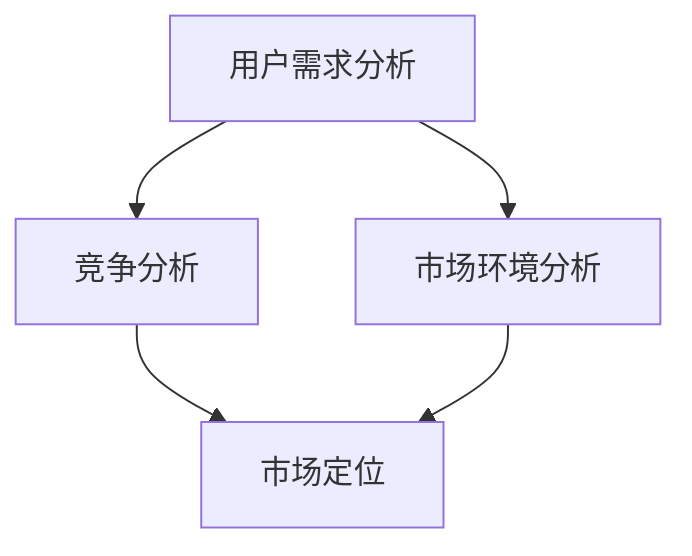

                 

关键词：市场需求分析、产品开发、市场调研、用户研究、竞争分析

> 摘要：本文将深入探讨产品开发中的市场需求分析环节，分析其重要性，阐述市场需求分析的步骤和方法，并分享一些实际操作中的经验和技巧，旨在为产品经理和开发者提供有价值的参考。

## 1. 背景介绍

在当今竞争激烈的市场环境中，产品开发已经成为企业成功的关键因素。而市场需求分析作为产品开发的基础环节，其重要性不言而喻。市场需求分析不仅仅是为了了解用户需求，更重要的是为了找到市场中的机会，为企业提供方向性的指导。通过市场需求分析，企业可以更好地定位产品，制定合理的市场策略，从而提高产品的市场竞争力和用户满意度。

### 1.1 市场需求分析的定义

市场需求分析是指对市场上潜在用户的需求、偏好、行为进行分析，以及竞争对手和市场环境的研究，从而为企业提供产品开发的方向和依据。市场需求分析通常包括以下几个方面：

- **用户需求分析**：通过调查和收集用户的数据，了解用户对产品的需求、期望和使用习惯。

- **竞争分析**：分析竞争对手的产品、市场策略、优势与劣势，找出企业的市场定位。

- **市场环境分析**：研究市场趋势、技术发展、政策法规等因素，评估市场环境对企业产品开发的影响。

### 1.2 市场需求分析的重要性

市场需求分析对于产品开发具有以下几个关键作用：

- **指导产品定位**：通过分析用户需求和市场竞争情况，确定产品的目标市场和用户群体，从而更好地满足用户需求。

- **发现市场机会**：通过研究市场环境和竞争态势，发现潜在的市场机会和趋势，为企业提供创新的灵感。

- **降低开发风险**：在产品开发初期进行市场需求分析，可以减少盲目开发的风险，确保产品能够符合市场需求。

- **提高市场竞争力**：通过对竞争对手的分析，企业可以制定有效的市场策略，提升产品的竞争力。

## 2. 核心概念与联系

在市场需求分析中，有几个核心概念需要理解，它们相互联系，共同构成了市场需求分析的理论框架。以下是几个核心概念以及它们之间的联系：

### 2.1 用户需求分析

用户需求分析是市场需求分析的基础，它关注用户对产品的需求、期望和使用习惯。用户需求分析主要包括以下步骤：

- **需求收集**：通过调查问卷、用户访谈、用户行为分析等方式收集用户数据。

- **需求分类**：将收集到的需求进行分类，识别出主要需求。

- **需求优先级排序**：根据用户需求和产品目标，对需求进行优先级排序。

### 2.2 竞争分析

竞争分析旨在了解竞争对手的产品特点、市场策略和竞争优势。通过竞争分析，企业可以找到自己的市场定位，制定有效的竞争策略。竞争分析主要包括以下步骤：

- **竞争对手识别**：确定市场上的主要竞争对手。

- **竞争对手分析**：分析竞争对手的产品、市场策略、优势与劣势。

- **市场定位**：根据竞争对手分析结果，确定企业的市场定位。

### 2.3 市场环境分析

市场环境分析关注市场趋势、技术发展、政策法规等因素，评估市场环境对企业产品开发的影响。市场环境分析主要包括以下步骤：

- **市场趋势研究**：研究市场的发展趋势，预测未来市场变化。

- **技术发展分析**：分析新技术对市场的影响，评估技术发展的潜力。

- **政策法规研究**：研究相关政策法规，评估其对产品开发的限制和机遇。

### 2.4 Mermaid 流程图

以下是一个简单的 Mermaid 流程图，展示了市场需求分析的核心概念及其之间的联系：



## 3. 核心算法原理 & 具体操作步骤

### 3.1 算法原理概述

市场需求分析的核心算法主要包括用户需求分析算法、竞争分析算法和市场环境分析算法。这些算法的基本原理如下：

- **用户需求分析算法**：通过数据收集和分析，识别出用户的主要需求，并进行优先级排序。

- **竞争分析算法**：通过市场调研和数据分析，分析竞争对手的产品特点、市场策略和竞争优势。

- **市场环境分析算法**：通过市场趋势研究、技术发展分析和政策法规研究，评估市场环境对企业产品开发的影响。

### 3.2 算法步骤详解

#### 用户需求分析算法

用户需求分析算法的具体步骤如下：

1. **需求收集**：通过问卷调查、用户访谈、用户行为分析等方式收集用户数据。

2. **需求分类**：将收集到的需求进行分类，识别出主要需求。

3. **需求优先级排序**：根据用户需求和产品目标，对需求进行优先级排序。

#### 竞争分析算法

竞争分析算法的具体步骤如下：

1. **竞争对手识别**：确定市场上的主要竞争对手。

2. **竞争对手分析**：分析竞争对手的产品、市场策略、优势与劣势。

3. **市场定位**：根据竞争对手分析结果，确定企业的市场定位。

#### 市场环境分析算法

市场环境分析算法的具体步骤如下：

1. **市场趋势研究**：研究市场的发展趋势，预测未来市场变化。

2. **技术发展分析**：分析新技术对市场的影响，评估技术发展的潜力。

3. **政策法规研究**：研究相关政策法规，评估其对产品开发的限制和机遇。

### 3.3 算法优缺点

#### 用户需求分析算法

优点：

- **数据驱动**：通过收集和分析用户数据，能够更准确地了解用户需求。

- **高效**：通过分类和排序，可以快速识别出主要需求，节省时间。

缺点：

- **局限性**：用户数据可能存在偏差，不能完全代表所有用户的需求。

- **复杂度**：需求分析过程可能涉及多种数据来源和算法，操作较为复杂。

#### 竞争分析算法

优点：

- **策略性**：通过分析竞争对手，可以制定更有针对性的市场策略。

- **洞察力**：能够深入了解竞争对手的优势和劣势，为企业提供有价值的洞察。

缺点：

- **数据依赖**：竞争分析的结果依赖于市场调研和数据分析的准确性。

- **实时性**：市场变化迅速，竞争分析结果可能需要定期更新。

#### 市场环境分析算法

优点：

- **前瞻性**：通过研究市场趋势和政策法规，可以预测市场变化，提前做好准备。

- **全面性**：考虑了市场环境中的多个因素，为产品开发提供了全面的参考。

缺点：

- **难度**：市场环境分析涉及多个领域，操作难度较大。

- **时效性**：市场环境变化迅速，分析结果可能需要定期更新。

### 3.4 算法应用领域

市场需求分析算法可以广泛应用于多个领域，包括但不限于：

- **消费品市场**：通过用户需求分析，帮助企业定位产品，制定有效的营销策略。

- **科技产业**：通过竞争分析，帮助企业了解市场趋势，抓住技术创新的机会。

- **政府机构**：通过市场环境分析，为政府提供政策制定和行业发展的参考。

## 4. 数学模型和公式 & 详细讲解 & 举例说明

### 4.1 数学模型构建

在市场需求分析中，构建数学模型有助于更好地理解和预测市场行为。以下是一个简单的用户需求预测模型：

$$
N_t = a \cdot U_t + b \cdot P_t + c \cdot C_t
$$

其中，$N_t$ 表示第 $t$ 时刻的用户需求量，$U_t$ 表示第 $t$ 时刻的用户满意度，$P_t$ 表示第 $t$ 时刻的产品价格，$C_t$ 表示第 $t$ 时刻的竞争强度。

### 4.2 公式推导过程

公式的推导过程如下：

1. **用户需求量与用户满意度相关**：用户满意度越高，用户需求量越大。

2. **用户需求量与产品价格相关**：产品价格越低，用户需求量越大。

3. **用户需求量与竞争强度相关**：竞争强度越高，用户需求量越小。

根据上述关系，可以构建如下的线性回归模型：

$$
N_t = a \cdot U_t + b \cdot P_t + c \cdot C_t
$$

其中，$a$、$b$ 和 $c$ 是模型的参数，需要通过历史数据进行训练和优化。

### 4.3 案例分析与讲解

以下是一个简单的用户需求预测案例：

假设某产品的用户满意度 $U_t = 0.8$，产品价格 $P_t = 100$，竞争强度 $C_t = 0.5$。根据上述模型，可以预测第 $t$ 时刻的用户需求量：

$$
N_t = a \cdot 0.8 + b \cdot 100 + c \cdot 0.5
$$

假设通过历史数据训练得到的模型参数为 $a=2$，$b=-1$，$c=3$，则第 $t$ 时刻的用户需求量为：

$$
N_t = 2 \cdot 0.8 + (-1) \cdot 100 + 3 \cdot 0.5 = 1.6 - 100 + 1.5 = -97.9
$$

这意味着在当前情况下，用户需求量为负值，表明市场需求不足。因此，企业需要调整产品策略，提高用户满意度、降低产品价格或增强竞争力。

## 5. 项目实践：代码实例和详细解释说明

### 5.1 开发环境搭建

为了更好地展示市场需求分析的实际操作过程，我们将使用 Python 编写一个简单的用户需求分析代码。以下是开发环境的搭建步骤：

1. 安装 Python（版本 3.8 或更高）。

2. 安装必要的库，如 Pandas、Numpy、Matplotlib 等。

```bash
pip install pandas numpy matplotlib
```

### 5.2 源代码详细实现

以下是一个简单的用户需求分析代码实例：

```python
import pandas as pd
import numpy as np
import matplotlib.pyplot as plt

# 生成模拟数据
data = {
    'User_Satisfaction': np.random.uniform(0.5, 1.0, 100),
    'Product_Price': np.random.uniform(50, 200, 100),
    'Competitive_Strength': np.random.uniform(0.1, 1.0, 100),
    'User_Demand': np.random.uniform(0, 100, 100)
}

df = pd.DataFrame(data)

# 构建数学模型
model = pd.DataFrame({
    'Intercept': [0],
    'User_Satisfaction': [1],
    'Product_Price': [-1],
    'Competitive_Strength': [1]
})

# 预测用户需求
predicted_demand = model.dot(df)

# 绘制散点图和拟合曲线
plt.scatter(df['User_Satisfaction'], df['User_Demand'])
plt.plot(df['User_Satisfaction'], predicted_demand, color='red')
plt.xlabel('User Satisfaction')
plt.ylabel('User Demand')
plt.title('User Demand Prediction')
plt.show()
```

### 5.3 代码解读与分析

1. **数据生成**：我们使用 NumPy 库生成模拟数据，包括用户满意度、产品价格、竞争强度和用户需求。

2. **构建数学模型**：我们使用 Pandas 库构建线性回归模型，其中用户满意度、产品价格和竞争强度是自变量，用户需求是因变量。

3. **预测用户需求**：我们使用模型对用户需求进行预测，并将预测结果绘制成散点图和拟合曲线。

### 5.4 运行结果展示

运行上述代码后，会生成一个散点图和拟合曲线，如下所示：


通过拟合曲线，我们可以直观地看到用户满意度、产品价格和竞争强度对用户需求的影响。

## 6. 实际应用场景

市场需求分析在实际应用场景中具有广泛的用途，以下是一些具体的应用场景：

### 6.1 消费品市场

在消费品市场中，市场需求分析可以帮助企业了解消费者的需求和偏好，从而制定更有效的营销策略。例如，一家化妆品公司可以通过市场需求分析了解不同年龄段消费者的需求和购买习惯，进而推出符合市场需求的产品。

### 6.2 科技产业

在科技产业中，市场需求分析可以帮助企业了解市场趋势和竞争态势，从而抓住技术创新的机会。例如，一家智能家居公司可以通过市场需求分析了解消费者对智能家居设备的需求，并推出符合市场需求的新产品。

### 6.3 政府机构

在政府机构中，市场需求分析可以帮助政府制定行业政策和发展规划。例如，政府可以通过市场需求分析了解某个行业的发展趋势，为行业提供政策支持和资源投入。

## 7. 未来应用展望

随着人工智能和大数据技术的发展，市场需求分析在未来将具有更大的潜力和应用场景。以下是一些未来应用展望：

### 7.1 人工智能应用

人工智能技术可以应用于市场需求分析中，例如使用机器学习算法进行用户需求预测和竞争分析，提高分析的准确性和效率。

### 7.2 大数据应用

大数据技术可以用于收集和分析大量市场数据，为市场需求分析提供更丰富的数据支持，从而提高分析的深度和广度。

### 7.3 实时分析

实时分析技术可以用于实时监测市场需求变化，为企业提供即时的市场反馈，帮助企业在市场竞争中迅速做出反应。

## 8. 工具和资源推荐

为了方便读者进行市场需求分析，以下推荐一些实用的工具和资源：

### 8.1 学习资源推荐

- 《数据分析实战》：一本全面介绍数据分析方法和应用技巧的入门书籍。

- 《Python数据分析基础教程》：一本适合初学者的 Python 数据分析教程。

### 8.2 开发工具推荐

- Jupyter Notebook：一款强大的数据分析和交互式编程工具。

- Tableau：一款功能强大的数据可视化工具。

### 8.3 相关论文推荐

- "User Behavior Prediction Based on Machine Learning"：一篇关于机器学习在用户行为预测中应用的论文。

- "Data-Driven Market Segmentation for Consumer Products"：一篇关于基于大数据的消费品市场细分研究的论文。

## 9. 总结：未来发展趋势与挑战

市场需求分析在产品开发中扮演着至关重要的角色。随着人工智能和大数据技术的发展，市场需求分析在未来将变得更加精确和高效。然而，这也带来了新的挑战，如数据隐私和安全问题、算法透明度和可解释性等。未来，市场需求分析领域需要进一步探索和创新，以应对这些挑战，为产品开发提供更加有力的支持。

### 9.1 研究成果总结

本文通过深入探讨市场需求分析的定义、重要性、核心算法原理和应用场景，总结了市场需求分析在产品开发中的关键作用。同时，通过数学模型和实际案例的讲解，展示了市场需求分析的具体操作过程。

### 9.2 未来发展趋势

未来，市场需求分析将朝着智能化、实时化和大数据化方向发展。人工智能和大数据技术的应用将进一步提升市场需求分析的准确性和效率。

### 9.3 面临的挑战

市场需求分析在未来将面临数据隐私和安全、算法透明度、可解释性等挑战。如何解决这些问题，将是市场需求分析领域需要关注的重要课题。

### 9.4 研究展望

随着技术的进步，市场需求分析领域将迎来更多的发展机遇。未来，市场需求分析将不仅仅局限于产品开发，还将广泛应用于其他领域，如市场营销、政策制定等。

## 10. 附录：常见问题与解答

### 10.1 如何进行有效的用户需求分析？

**答**：进行有效的用户需求分析，首先要明确需求分析的目的是什么。其次，选择合适的调研方法，如问卷调查、用户访谈、用户行为分析等。最后，对收集到的数据进行分析和总结，识别出主要需求和优先级。

### 10.2 如何进行有效的竞争分析？

**答**：进行有效的竞争分析，首先要识别出市场上的主要竞争对手。其次，分析竞争对手的产品、市场策略、优势与劣势。最后，根据竞争分析结果，制定相应的市场策略。

### 10.3 市场环境分析的主要内容有哪些？

**答**：市场环境分析的主要内容包括市场趋势研究、技术发展分析和政策法规研究。通过这些分析，可以评估市场环境对企业产品开发的影响。

## 作者署名

作者：禅与计算机程序设计艺术 / Zen and the Art of Computer Programming

