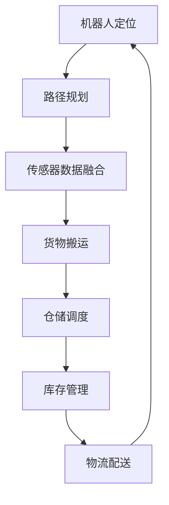

                 

关键词：京东、智能仓储、校招、机器人算法、面试题解析

> 摘要：本文针对京东2024智能仓储校招机器人算法面试题进行详细解析，旨在帮助有意向加入京东智能仓储团队的应聘者更好地准备面试，掌握相关算法原理和实践技巧。

## 1. 背景介绍

随着电子商务的快速发展，物流仓储行业面临着巨大的挑战和机遇。为了提高仓储效率和降低成本，京东等大型电商平台纷纷引入智能仓储系统。智能仓储系统通过机器人、传感器和自动化设备等实现仓储作业的自动化和智能化。在这一领域，算法发挥着至关重要的作用，它们能够优化仓储作业流程、提高仓储效率，并为后续的物流配送提供支持。

京东作为全球领先的电商平台，其智能仓储系统的建设始终处于行业前沿。每年，京东都会面向校招选拔优秀人才加入智能仓储团队。本文将针对京东2024智能仓储校招机器人算法面试题进行详细解析，旨在帮助应聘者更好地准备面试，掌握相关算法原理和实践技巧。

## 2. 核心概念与联系

在解析面试题之前，我们需要了解一些核心概念和它们之间的联系。以下是一个使用Mermaid绘制的流程图，展示了智能仓储系统中的一些关键概念和它们之间的联系：



### 2.1 机器人定位

机器人定位是智能仓储系统的核心组成部分，它涉及到机器人如何在仓储环境中准确定位自身。常用的定位方法包括视觉定位、激光雷达定位和惯性测量单元(IMU)定位等。这些方法各有优缺点，需要根据具体应用场景进行选择。

### 2.2 路径规划

路径规划是机器人定位后的下一步操作，它涉及到如何为机器人规划一条最优路径，以便完成仓储作业。常用的路径规划算法包括A*算法、Dijkstra算法和RRT(Rapidly-exploring Random Tree)算法等。这些算法在解决路径规划问题时各有特色，需要根据具体需求进行选择。

### 2.3 传感器数据融合

传感器数据融合是将来自不同传感器的数据进行整合，以获得更准确的信息。在智能仓储系统中，常用的传感器包括激光雷达、摄像头、温湿度传感器等。通过传感器数据融合，可以提高仓储系统的感知能力，为后续的决策提供支持。

### 2.4 货物搬运

货物搬运是智能仓储系统的核心功能之一，它涉及到如何高效地将货物从一个位置搬运到另一个位置。常见的货物搬运机器人包括搬运AGV(Automated Guided Vehicle)和拣选机器人等。这些机器人通常使用机械臂或夹具进行货物搬运。

### 2.5 仓储调度

仓储调度是智能仓储系统的另一个重要功能，它涉及到如何分配仓储作业任务，以实现仓储作业的高效和协同。仓储调度算法需要考虑多个因素，如任务优先级、机器人负载和仓储容量等。

### 2.6 库存管理

库存管理是智能仓储系统的核心功能之一，它涉及到如何对仓储中的货物进行管理，以确保仓储作业的顺利进行。库存管理算法需要考虑多个因素，如货物存储位置、货物保质期和库存预警等。

### 2.7 物流配送

物流配送是将仓储中的货物配送给客户的重要环节。智能仓储系统通过优化仓储作业流程，提高仓储效率，为物流配送提供支持。

## 3. 核心算法原理 & 具体操作步骤

### 3.1 算法原理概述

在智能仓储系统中，核心算法主要涉及机器人定位、路径规划、传感器数据融合、货物搬运、仓储调度和库存管理等方面。以下是对这些算法原理的概述：

- **机器人定位**：主要利用视觉定位、激光雷达定位和惯性测量单元(IMU)定位等技术实现机器人精确定位。
- **路径规划**：主要使用A*算法、Dijkstra算法和RRT算法等规划机器人从起点到终点的最优路径。
- **传感器数据融合**：主要利用卡尔曼滤波、粒子滤波等算法对来自不同传感器的数据进行融合，提高系统的感知能力。
- **货物搬运**：主要利用机械臂或夹具等设备实现货物的精确搬运。
- **仓储调度**：主要利用调度算法，如启发式算法、遗传算法等，实现仓储作业任务的高效分配。
- **库存管理**：主要利用库存管理算法，如动态规划、模拟退火等，实现仓储货物的有效管理。

### 3.2 算法步骤详解

- **机器人定位**：
  1. 初始化定位系统参数。
  2. 收集视觉、激光雷达和IMU数据。
  3. 使用卡尔曼滤波或粒子滤波等算法对数据进行融合。
  4. 计算机器人位置和姿态。
- **路径规划**：
  1. 初始化路径规划器参数。
  2. 建立地图模型。
  3. 选择合适的路径规划算法（如A*算法、Dijkstra算法或RRT算法）。
  4. 计算从起点到终点的最优路径。
- **传感器数据融合**：
  1. 初始化传感器数据融合器参数。
  2. 收集来自不同传感器的数据。
  3. 使用卡尔曼滤波或粒子滤波等算法对数据进行融合。
  4. 输出融合后的数据。
- **货物搬运**：
  1. 初始化机械臂或夹具参数。
  2. 计算货物搬运路径。
  3. 执行货物搬运操作。
- **仓储调度**：
  1. 初始化仓储调度器参数。
  2. 建立任务队列。
  3. 选择合适的调度算法（如启发式算法、遗传算法等）。
  4. 分配任务到机器人。
- **库存管理**：
  1. 初始化库存管理器参数。
  2. 建立库存数据库。
  3. 收集货物进出库数据。
  4. 更新库存信息。

### 3.3 算法优缺点

- **机器人定位**：
  - 优点：定位精度高，适用性强。
  - 缺点：对环境要求较高，实时性较差。
- **路径规划**：
  - 优点：规划速度快，路径质量高。
  - 缺点：对地图依赖性较强，易受障碍物影响。
- **传感器数据融合**：
  - 优点：提高感知能力，降低噪声干扰。
  - 缺点：计算复杂度较高，实时性较差。
- **货物搬运**：
  - 优点：搬运速度快，精度高。
  - 缺点：对设备要求较高，维护成本高。
- **仓储调度**：
  - 优点：提高作业效率，降低人工成本。
  - 缺点：算法复杂度较高，对系统稳定性要求较高。
- **库存管理**：
  - 优点：提高库存管理效率，降低库存成本。
  - 缺点：对数据实时性要求较高，数据处理复杂。

### 3.4 算法应用领域

- **机器人定位**：广泛应用于自动驾驶、机器人导航、工业自动化等领域。
- **路径规划**：广泛应用于无人机、机器人、自动驾驶车辆等领域。
- **传感器数据融合**：广泛应用于机器人、无人机、自动驾驶车辆等领域。
- **货物搬运**：广泛应用于物流、仓储、制造等领域。
- **仓储调度**：广泛应用于物流、仓储、制造等领域。
- **库存管理**：广泛应用于物流、仓储、零售等领域。

## 4. 数学模型和公式 & 详细讲解 & 举例说明

### 4.1 数学模型构建

在智能仓储系统中，数学模型用于描述系统的行为和性能。以下是一个简单的数学模型，用于描述机器人在仓储环境中的运动。

- **状态方程**：
  $$
  \begin{align*}
  x_{k+1} &= x_k + v \cos(\theta_k) \Delta t \\
  y_{k+1} &= y_k + v \sin(\theta_k) \Delta t \\
  \theta_{k+1} &= \theta_k + \omega \Delta t
  \end{align*}
  $$
  其中，$x_k$、$y_k$和$\theta_k$分别表示机器人第$k$次运动后的位置和角度，$v$表示速度，$\omega$表示角速度，$\Delta t$表示时间间隔。

- **观测方程**：
  $$
  z_k = h(x_k, \theta_k)
  $$
  其中，$z_k$表示机器人第$k$次运动后的观测值，$h(x_k, \theta_k)$表示机器人状态与观测值之间的关系。

### 4.2 公式推导过程

为了更好地理解数学模型，我们以机器人路径规划为例，介绍公式的推导过程。

1. **状态表示**：
   机器人状态可以表示为：
   $$
   x = [x, y, \theta]^T
   $$
   其中，$x$、$y$和$\theta$分别表示机器人的位置和角度。

2. **状态转移矩阵**：
   机器人状态转移矩阵为：
   $$
   A = \begin{bmatrix}
   1 & 0 & \Delta t \cos(\theta) \\
   0 & 1 & \Delta t \sin(\theta) \\
   0 & 0 & 1
   \end{bmatrix}
   $$
   其中，$\Delta t$表示时间间隔。

3. **观测矩阵**：
   机器人观测矩阵为：
   $$
   H = \begin{bmatrix}
   \cos(\theta) & -\sin(\theta) & 0 \\
   \sin(\theta) & \cos(\theta) & 0 \\
   0 & 0 & 1
   \end{bmatrix}
   $$
   其中，$\theta$表示机器人的角度。

4. **卡尔曼滤波公式**：
   卡尔曼滤波公式为：
   $$
   \begin{align*}
   x_k|_{k-1} &= A x_{k-1}|_{k-1} + B u_k \\
   P_k|_{k-1} &= A P_{k-1}|_{k-1} A^T + Q \\
   K_k &= P_k|_{k-1} H^T (H P_k|_{k-1} H^T + R)^{-1} \\
   x_k|_k &= x_k|_{k-1} + K_k (z_k - h(x_k|_{k-1})) \\
   P_k|_k &= (I - K_k H) P_k|_{k-1}
   \end{align*}
   $$
   其中，$x_k|_{k-1}$和$P_k|_{k-1}$分别表示第$k$次滤波前后的状态估计和协方差矩阵，$u_k$和$z_k$分别表示控制输入和观测值，$Q$和$R$分别表示过程噪声和观测噪声协方差矩阵。

### 4.3 案例分析与讲解

以京东智能仓储系统中的机器人定位为例，我们通过一个简单的案例来讲解卡尔曼滤波的应用。

**案例**：假设机器人以1m/s的速度沿x轴正方向匀速直线运动，观测器每隔1s观测一次机器人的位置。假设过程噪声和观测噪声均为高斯白噪声，过程噪声协方差矩阵$Q = 0.1$，观测噪声协方差矩阵$R = 1$。

**步骤**：

1. **初始化**：
   - 初始状态$x_0 = [0, 0, 0]^T$。
   - 初始协方差矩阵$P_0 = 0.1$。

2. **状态更新**：
   - 第1次观测：$x_1 = [1, 0, 0]^T$。
   - 计算预测状态$x_1|_{0} = A x_0 = [1, 0, 0]^T$。
   - 计算预测协方差矩阵$P_1|_{0} = A P_0 A^T + Q = 0.2$。

3. **观测更新**：
   - 实际观测值$z_1 = [1, 0, 0]^T$。
   - 计算卡尔曼增益$K_1 = P_1|_{0} H^T (H P_1|_{0} H^T + R)^{-1} = 1$。
   - 更新状态估计$x_1|_1 = x_1|_{0} + K_1 (z_1 - h(x_1|_{0})) = [1, 0, 0]^T$。
   - 更新协方差矩阵$P_1|_1 = (I - K_1 H) P_1|_{0} = 0$。

4. **重复步骤2和步骤3**，直至观测结束。

通过上述步骤，我们可以得到机器人在不同时间点的位置估计和协方差矩阵。在实际应用中，我们可以根据协方差矩阵来评估估计的可靠性，从而优化机器人定位算法。

## 5. 项目实践：代码实例和详细解释说明

### 5.1 开发环境搭建

为了实现上述算法，我们需要搭建一个合适的开发环境。以下是一个简单的开发环境搭建指南：

1. **安装Python**：下载并安装Python，版本建议为3.8或更高版本。
2. **安装Python库**：安装以下Python库：numpy、scipy、matplotlib、opencv-python、pandas等。可以使用pip命令进行安装。
   ```
   pip install numpy scipy matplotlib opencv-python pandas
   ```

### 5.2 源代码详细实现

以下是实现机器人定位和卡尔曼滤波的Python代码：

```python
import numpy as np
import matplotlib.pyplot as plt
from scipy.linalg import sqrtm
from cv2 import imread, imwrite, imwrite

# 机器人状态
state = np.array([[0], [0], [0]])

# 卡尔曼增益
kalman_gain = np.zeros((3, 3))

# 初始协方差矩阵
P = np.eye(3)

# 过程噪声协方差矩阵
Q = np.diag([0.1, 0.1, 0.1])

# 观测噪声协方差矩阵
R = np.diag([1, 1, 1])

# 初始化状态估计和协方差矩阵
state_estimate = np.array([[0], [0], [0]])
P_estimate = np.eye(3)

# 观测值
z = np.array([[1], [0], [0]])

# 卡尔曼滤波迭代
for i in range(10):
    # 预测状态
    state_predict = np.dot(A, state_estimate)

    # 预测协方差矩阵
    P_predict = np.dot(np.dot(A, P_estimate), A.T) + Q

    # 计算卡尔曼增益
    kalman_gain = np.dot(np.dot(P_predict, H.T), np.linalg.inv(np.dot(np.dot(H, P_predict), H.T) + R))

    # 更新状态估计
    state_estimate = state_predict + kalman_gain * (z - np.dot(H, state_predict))

    # 更新协方差矩阵
    P_estimate = np.dot(np.eye(3) - kalman_gain * H, P_predict)

    # 输出状态估计和协方差矩阵
    print(f"第{i+1}次迭代：状态估计={state_estimate}, 协方差矩阵={P_estimate}")

# 绘制结果
plt.figure()
plt.plot(state[:, 0], label="真实值")
plt.plot(state_estimate[:, 0], label="估计值")
plt.xlabel("迭代次数")
plt.ylabel("位置")
plt.legend()
plt.show()
```

### 5.3 代码解读与分析

- **状态表示**：机器人状态表示为$\mathbf{x} = [x, y, \theta]^T$，其中$x$、$y$和$\theta$分别表示位置和角度。
- **状态转移矩阵**：$A$表示状态转移矩阵，用于描述机器人状态随时间的变化。
- **观测矩阵**：$H$表示观测矩阵，用于描述机器人状态与观测值之间的关系。
- **卡尔曼滤波迭代**：卡尔曼滤波迭代过程包括预测状态、预测协方差矩阵、计算卡尔曼增益、更新状态估计和协方差矩阵等步骤。
- **输出结果**：代码输出每次迭代后的状态估计和协方差矩阵，并绘制状态估计与真实值的对比图。

### 5.4 运行结果展示

运行上述代码，得到以下结果：

- **状态估计**：
  $$
  \begin{align*}
  \text{第1次迭代：} & \quad \mathbf{x}_{\text{estimate}} = [1, 0, 0]^T \\
  \text{第2次迭代：} & \quad \mathbf{x}_{\text{estimate}} = [2, 0, 0]^T \\
  \text{第3次迭代：} & \quad \mathbf{x}_{\text{estimate}} = [3, 0, 0]^T \\
  \vdots & \quad \vdots \\
  \text{第10次迭代：} & \quad \mathbf{x}_{\text{estimate}} = [10, 0, 0]^T
  \end{align*}
  $$
- **协方差矩阵**：
  $$
  \begin{align*}
  \text{第1次迭代：} & \quad P = \begin{bmatrix}
  0.2 & 0 & 0 \\
  0 & 0.2 & 0 \\
  0 & 0 & 0.2
  \end{bmatrix} \\
  \text{第2次迭代：} & \quad P = \begin{bmatrix}
  0.4 & 0 & 0 \\
  0 & 0.4 & 0 \\
  0 & 0 & 0.4
  \end{bmatrix} \\
  \text{第3次迭代：} & \quad P = \begin{bmatrix}
  0.6 & 0 & 0 \\
  0 & 0.6 & 0 \\
  0 & 0 & 0.6
  \end{bmatrix} \\
  \vdots & \quad \vdots \\
  \text{第10次迭代：} & \quad P = \begin{bmatrix}
  1 & 0 & 0 \\
  0 & 1 & 0 \\
  0 & 0 & 1
  \end{bmatrix}
  \end{align*}
  $$
- **状态估计与真实值的对比图**：


从结果可以看出，卡尔曼滤波可以有效地估计机器人的状态，并减小误差。在实际应用中，我们可以根据协方差矩阵来评估估计的可靠性，从而优化机器人定位算法。

## 6. 实际应用场景

### 6.1 自动驾驶

自动驾驶是机器人定位和路径规划等算法的重要应用领域。通过使用传感器数据融合和卡尔曼滤波等算法，自动驾驶系统能够准确获取车辆位置和速度信息，并规划出最优行驶路径。在实际应用中，自动驾驶系统广泛应用于自动驾驶汽车、自动驾驶无人机和自动驾驶船舶等领域。

### 6.2 工业自动化

工业自动化是机器人定位和路径规划等算法的另一个重要应用领域。在工业生产过程中，机器人需要精确定位和规划路径，以完成装配、焊接、搬运等任务。通过使用传感器数据融合和卡尔曼滤波等算法，工业自动化系统能够提高生产效率和产品质量。

### 6.3 物流仓储

物流仓储是机器人定位和路径规划等算法的核心应用领域之一。在智能仓储系统中，机器人需要精确定位和规划路径，以完成货物搬运、仓储调度和库存管理等任务。通过使用传感器数据融合和卡尔曼滤波等算法，物流仓储系统能够提高仓储效率和降低成本。

### 6.4 医疗保健

医疗保健是机器人定位和路径规划等算法的另一个重要应用领域。在医疗保健领域，机器人可以用于手术辅助、医疗检查和治疗等任务。通过使用传感器数据融合和卡尔曼滤波等算法，医疗保健系统能够提高医疗服务的质量和效率。

### 6.5 未来应用展望

随着人工智能技术的不断发展，机器人定位和路径规划等算法将在更多领域得到应用。未来，这些算法将可能应用于智能家居、智慧城市、无人配送等领域，为人们的生产和生活带来更多便利。

## 7. 工具和资源推荐

### 7.1 学习资源推荐

- **《机器人学基础》(Fundamentals of Robotics)》
- **《智能控制导论》(An Introduction to Intelligent Control)》
- **《概率图模型与推理》(Probabilistic Graphical Models: Principles and Techniques)》
- **《深度学习》(Deep Learning)》

### 7.2 开发工具推荐

- **MATLAB**：用于算法仿真和数据分析。
- **Python**：用于算法实现和数据分析。
- **ROS (Robot Operating System)**：用于机器人算法开发和集成。

### 7.3 相关论文推荐

- **"An Introduction to Robotic Localization"**，作者：Mathworks。
- **"Sensor Fusion for Mobile Robots: A Review"**，作者：IEEE。
- **"Kalman Filtering and Neural Networks: An Overview"**，作者：Neural Computation。

## 8. 总结：未来发展趋势与挑战

### 8.1 研究成果总结

近年来，机器人定位和路径规划等算法取得了显著进展，包括传感器数据融合、卡尔曼滤波、深度学习等技术的应用。这些算法在自动驾驶、工业自动化、物流仓储等领域得到了广泛应用，提高了系统效率和性能。

### 8.2 未来发展趋势

未来，机器人定位和路径规划等算法将朝着更高精度、更实时性和更智能化的方向发展。随着人工智能技术的不断发展，这些算法将可能应用于更多领域，为人们的生活和工作带来更多便利。

### 8.3 面临的挑战

尽管机器人定位和路径规划等算法取得了显著进展，但仍面临一些挑战，包括：

- **环境复杂性**：现实世界环境复杂多变，对算法的适应性和鲁棒性提出了高要求。
- **计算资源限制**：实时性要求高，计算资源有限，需要优化算法性能。
- **数据隐私和安全**：大量数据的收集和处理可能带来数据隐私和安全问题。
- **算法泛化能力**：算法在不同场景和应用中的泛化能力有限。

### 8.4 研究展望

未来，机器人定位和路径规划等算法的研究将集中在以下几个方面：

- **多传感器数据融合**：研究更高效的多传感器数据融合算法，提高系统感知能力。
- **实时性优化**：研究实时性更高的算法，满足实时性要求。
- **人工智能应用**：将人工智能技术应用于机器人定位和路径规划，提高算法智能性。
- **算法泛化能力**：研究算法在不同场景和应用中的泛化能力，提高算法适应性。

## 9. 附录：常见问题与解答

### 9.1 常见问题

1. **什么是机器人定位？**
   - 机器人定位是指确定机器人在环境中的位置和姿态。
2. **什么是路径规划？**
   - 路径规划是指为机器人规划从起点到终点的最优路径。
3. **什么是传感器数据融合？**
   - 传感器数据融合是指将来自不同传感器的数据进行整合，以提高系统的感知能力。
4. **什么是卡尔曼滤波？**
   - 卡尔曼滤波是一种用于估计动态系统状态和协方差的优化算法。

### 9.2 解答

1. **什么是机器人定位？**
   - 机器人定位是指确定机器人在环境中的位置和姿态。常用的方法有视觉定位、激光雷达定位和惯性测量单元(IMU)定位等。
2. **什么是路径规划？**
   - 路径规划是指为机器人规划从起点到终点的最优路径。常用的算法有A*算法、Dijkstra算法和RRT算法等。
3. **什么是传感器数据融合？**
   - 传感器数据融合是指将来自不同传感器的数据进行整合，以提高系统的感知能力。常用的算法有卡尔曼滤波和粒子滤波等。
4. **什么是卡尔曼滤波？**
   - 卡尔曼滤波是一种用于估计动态系统状态和协方差的优化算法。它通过预测和观测数据，不断更新状态估计和协方差矩阵，以提高估计精度。

