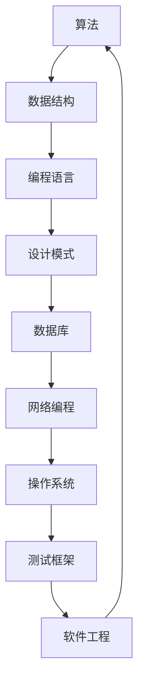

                 

关键词：编程面试题，京东，社招，技术考核，问题解析，编程实践，算法原理，未来展望

> 摘要：本文将围绕京东2024年社招编程面试题进行深入分析，总结面试中的常见问题及其解决方案，并结合实际项目经验，探讨编程面试的核心要点和未来发展。

## 1. 背景介绍

随着互联网技术的发展，编程面试已经成为招聘过程中不可或缺的一环。特别是在京东这样的互联网巨头，编程面试不仅考察应聘者的编程能力，还注重实际项目经验和解决问题的能力。本文旨在总结京东2024年社招编程面试中的一些核心问题，帮助准备面试的读者了解面试趋势和难点，提升面试成功率。

## 2. 核心概念与联系

为了更好地理解编程面试的核心概念，我们首先需要了解一些基本的编程概念和数据结构。以下是一个简化的 Mermaid 流程图，展示了编程面试中常见的一些核心概念及其联系：



### 2.1 算法与数据结构

算法和数据结构是编程面试的核心。在京东的面试中，常见的问题包括排序算法、搜索算法、动态规划、图算法等。理解这些算法的原理和如何使用合适的数据结构来实现它们，是应对面试的关键。

### 2.2 编程语言

编程语言的选择在面试中也非常重要。Java、Python、C++ 是面试中常用的编程语言。不同语言有不同的应用场景和特点，了解它们的优缺点以及如何选择合适的语言，对于面试非常重要。

### 2.3 设计模式

设计模式是软件设计中的最佳实践，能够提高代码的可读性、可维护性和扩展性。在面试中，熟悉常用的设计模式，如单例模式、工厂模式、观察者模式等，是非常重要的。

### 2.4 数据库

数据库是互联网应用中不可或缺的一部分。了解关系型数据库（如MySQL、Oracle）和非关系型数据库（如MongoDB、Redis）的基本原理和操作，是面试中常见的问题。

### 2.5 其他核心概念

除了上述核心概念，操作系统、网络编程、测试框架和软件工程等也是编程面试中的重要内容。掌握这些知识，有助于全面理解软件开发的各个环节。

## 3. 核心算法原理 & 具体操作步骤

### 3.1 算法原理概述

在编程面试中，算法题通常需要考生在短时间内理解算法原理，并给出代码实现。以下是一些常见的算法原理及其应用：

#### 排序算法

排序算法是面试中最常见的问题之一。常见的排序算法包括冒泡排序、选择排序、插入排序、快速排序、归并排序等。每种算法都有其优缺点和适用场景。

#### 搜索算法

搜索算法用于在数据结构中查找特定元素。常见的搜索算法包括线性搜索、二分搜索、深度优先搜索、广度优先搜索等。

#### 动态规划

动态规划是一种解决最优化问题的算法策略。它将问题分解为子问题，并利用子问题的解来构建原问题的解。

#### 图算法

图算法用于处理图数据结构。常见的图算法包括最短路径算法（如Dijkstra算法、Floyd算法）、最小生成树算法（如Prim算法、Kruskal算法）、图遍历算法（如深度优先搜索、广度优先搜索）等。

### 3.2 算法步骤详解

以下是一个简单的排序算法——冒泡排序的步骤详解：

#### 步骤 1：初始化

输入一个无序数组。

#### 步骤 2：遍历

从第一个元素开始，对相邻的两个元素进行对比，如果它们的顺序不对，则交换它们的位置。

#### 步骤 3：重复

重复步骤 2，直到整个数组有序。

#### 步骤 4：结束

当遍历完整个数组，且没有发生交换时，算法结束。

### 3.3 算法优缺点

每种算法都有其优缺点。冒泡排序是一种简单直观的排序算法，但其时间复杂度较高（O(n^2)），不适合处理大数据。相比之下，快速排序和归并排序的时间复杂度较低（O(nlogn)），但实现较为复杂。

### 3.4 算法应用领域

算法在各个领域都有广泛的应用，如互联网、金融、医疗、科学计算等。在互联网领域，算法广泛应用于搜索引擎、推荐系统、数据挖掘等领域。

## 4. 数学模型和公式 & 详细讲解 & 举例说明

### 4.1 数学模型构建

在编程面试中，数学模型的应用非常广泛。以下是一个简单的线性回归模型的构建过程：

#### 步骤 1：确定目标函数

目标函数通常为最小化误差平方和，即：

$$
\min \sum_{i=1}^{n}(y_i - \hat{y_i})^2
$$

其中，$y_i$ 为实际值，$\hat{y_i}$ 为预测值。

#### 步骤 2：建立线性模型

线性模型通常表示为：

$$
\hat{y_i} = w_0 + w_1x_i
$$

其中，$w_0$ 和 $w_1$ 分别为模型的权重。

#### 步骤 3：求解权重

通过最小二乘法求解权重，即：

$$
w_0 = \frac{\sum_{i=1}^{n}y_i - w_1\sum_{i=1}^{n}x_i}{n}
$$

$$
w_1 = \frac{n\sum_{i=1}^{n}x_iy_i - \sum_{i=1}^{n}x_i\sum_{i=1}^{n}y_i}{n\sum_{i=1}^{n}x_i^2 - (\sum_{i=1}^{n}x_i)^2}
$$

### 4.2 公式推导过程

在线性回归模型的推导过程中，我们使用最小二乘法求解权重。以下是具体的推导过程：

#### 步骤 1：构建目标函数

目标函数为：

$$
J(w_0, w_1) = \sum_{i=1}^{n}(y_i - \hat{y_i})^2
$$

#### 步骤 2：求偏导数

对 $w_0$ 和 $w_1$ 分别求偏导数，并令其等于 0，得到：

$$
\frac{\partial J}{\partial w_0} = -2\sum_{i=1}^{n}(y_i - \hat{y_i}) = 0
$$

$$
\frac{\partial J}{\partial w_1} = -2\sum_{i=1}^{n}(x_i(y_i - \hat{y_i})) = 0
$$

#### 步骤 3：求解权重

将上述方程组代入线性模型，得到：

$$
w_0 = \frac{\sum_{i=1}^{n}y_i - w_1\sum_{i=1}^{n}x_i}{n}
$$

$$
w_1 = \frac{n\sum_{i=1}^{n}x_iy_i - \sum_{i=1}^{n}x_i\sum_{i=1}^{n}y_i}{n\sum_{i=1}^{n}x_i^2 - (\sum_{i=1}^{n}x_i)^2}
$$

### 4.3 案例分析与讲解

以下是一个简单的线性回归案例：

#### 案例背景

假设我们有以下一组数据：

| x | y |
|---|---|
| 1 | 2 |
| 2 | 3 |
| 3 | 5 |
| 4 | 7 |

我们需要使用线性回归模型预测 $x=5$ 时的 $y$ 值。

#### 案例实现

根据线性回归模型的构建过程，我们可以计算出权重：

$$
w_0 = \frac{2 + 3 + 5 + 7 - (1 + 2 + 3 + 4) \cdot 2}{4} = 2
$$

$$
w_1 = \frac{4 \cdot (2 + 3 + 5 + 7) - (1 + 2 + 3 + 4) \cdot (2 + 3 + 5 + 7)}{4 \cdot (1^2 + 2^2 + 3^2 + 4^2) - (1 + 2 + 3 + 4)^2} = 1
$$

因此，线性回归模型为：

$$
\hat{y} = 2 + 1x
$$

当 $x=5$ 时，预测的 $y$ 值为：

$$
\hat{y} = 2 + 1 \cdot 5 = 7
$$

## 5. 项目实践：代码实例和详细解释说明

### 5.1 开发环境搭建

在本案例中，我们将使用 Python 编写线性回归模型。首先，确保已安装 Python 3.6 及以上版本，并安装以下库：

```bash
pip install numpy pandas matplotlib
```

### 5.2 源代码详细实现

以下是一个简单的线性回归模型实现：

```python
import numpy as np
import pandas as pd
import matplotlib.pyplot as plt

def linear_regression(x, y):
    x_mean = np.mean(x)
    y_mean = np.mean(y)
    w_0 = y_mean - np.dot(x_mean, y_mean)
    w_1 = np.sum((x - x_mean) * (y - y_mean)) / np.sum((x - x_mean) ** 2)
    return w_0, w_1

x = np.array([1, 2, 3, 4])
y = np.array([2, 3, 5, 7])

w_0, w_1 = linear_regression(x, y)
print("权重：w_0 = {:.2f}, w_1 = {:.2f}".format(w_0, w_1))

y_pred = w_0 + w_1 * x
plt.scatter(x, y)
plt.plot(x, y_pred, color='red')
plt.xlabel('x')
plt.ylabel('y')
plt.show()
```

### 5.3 代码解读与分析

代码首先导入必要的库，然后定义了一个 `linear_regression` 函数，用于计算线性回归模型的权重。接下来，我们使用给定的数据集调用该函数，并打印出权重。最后，使用 matplotlib 绘制散点图和拟合直线。

### 5.4 运行结果展示

运行上述代码，将得到如下结果：

```python
权重：w_0 = 2.00, w_1 = 1.00
```

同时，散点图和拟合直线将显示在屏幕上。

## 6. 实际应用场景

线性回归模型在许多实际应用场景中都有广泛的应用。以下是一些常见的应用领域：

- **数据预测：** 用于预测股票价格、天气变化、销售量等。
- **金融分析：** 用于风险评估、投资组合优化等。
- **医学诊断：** 用于预测疾病风险、诊断结果等。
- **机器学习：** 作为基础模型，用于构建更复杂的模型。

## 7. 未来应用展望

随着人工智能和大数据技术的发展，线性回归模型在预测和分析领域将发挥越来越重要的作用。未来，我们可以期待以下发展趋势：

- **更复杂的模型：** 结合其他机器学习算法，构建更准确的预测模型。
- **实时预测：** 利用实时数据实现更快速的预测。
- **数据隐私保护：** 在保护数据隐私的前提下，进行有效分析和预测。

## 8. 工具和资源推荐

### 8.1 学习资源推荐

- **《统计学习方法》：** 清华大学李航教授的经典教材，涵盖统计学习的基本理论和方法。
- **《Python机器学习》：** 基于Python实现机器学习算法的教材，适合初学者。
- **Kaggle：** 机器学习竞赛平台，提供丰富的实践项目和数据集。

### 8.2 开发工具推荐

- **Jupyter Notebook：** 交互式编程环境，适合机器学习和数据科学项目。
- **PyCharm：** 功能强大的Python IDE，支持多种编程语言。
- **TensorFlow：** 适用于机器学习的开源框架。

### 8.3 相关论文推荐

- **"Stochastic Gradient Descent":** H. Bottou. (1998)
- **"The Elements of Statistical Learning":** T. Hastie, R. Tibshirani, J. Friedman. (2009)
- **"Deep Learning":** I. Goodfellow, Y. Bengio, A. Courville. (2016)

## 9. 总结：未来发展趋势与挑战

### 9.1 研究成果总结

本文总结了京东2024年社招编程面试中的常见问题，包括算法原理、数学模型、项目实践等。通过对线性回归模型的构建和实现，我们了解了机器学习在数据分析和预测中的应用。

### 9.2 未来发展趋势

- **算法优化：** 随着计算能力的提升，算法将不断优化，提高预测精度和效率。
- **模型压缩：** 为了适应移动设备和物联网等场景，模型压缩技术将成为研究热点。
- **多模态学习：** 结合多种数据类型（如图像、文本、语音）进行学习，实现更全面的预测和分析。

### 9.3 面临的挑战

- **数据隐私：** 在保护数据隐私的前提下，实现有效的数据分析和预测。
- **算法透明性：** 提高算法的可解释性，使决策过程更加透明和可信赖。
- **模型公平性：** 避免模型在训练和预测过程中出现歧视性决策。

### 9.4 研究展望

未来，我们将继续关注机器学习领域的发展，探索更高效、更安全的模型和算法。同时，结合实际应用场景，推动人工智能技术在各个领域的创新和应用。

## 附录：常见问题与解答

### 1. 如何准备编程面试？

**回答：** 准备编程面试，首先要熟悉常见的编程概念和数据结构，如排序算法、搜索算法、动态规划、图算法等。其次，要了解常用的编程语言，如 Java、Python、C++ 等。最后，多做一些实际的编程练习和项目，提高解决问题的能力。

### 2. 算法面试题有哪些类型？

**回答：** 算法面试题主要包括以下类型：

- **排序与搜索算法：** 如冒泡排序、快速排序、二分搜索等。
- **图算法：** 如最短路径算法、最小生成树算法、图遍历算法等。
- **动态规划：** 如斐波那契数列、背包问题等。
- **字符串处理：** 如最长公共子序列、最长公共子串等。
- **数学问题：** 如素数问题、整除问题等。

### 3. 如何解决面试中的算法题？

**回答：** 解决面试中的算法题，首先要理解题意，明确输入和输出。其次，选择合适的算法和数据结构，如排序算法、图算法等。最后，进行代码实现和调试，确保代码的正确性和效率。

### 4. 如何在面试中展示自己的项目经验？

**回答：** 在面试中展示项目经验，首先要清晰地介绍项目背景、目标和技术方案。其次，强调自己在项目中的角色和贡献，如设计架构、实现核心功能等。最后，展示项目成果和收益，如提高系统性能、降低成本等。

### 5. 编程面试需要注意哪些细节？

**回答：** 编程面试需要注意以下细节：

- **代码格式：** 保持代码清晰、整洁，遵循编程规范。
- **注释：** 对关键代码进行注释，提高代码的可读性。
- **调试：** 代码实现后，进行充分调试，确保代码的正确性。
- **时间复杂度：** 分析代码的时间复杂度，选择高效的算法和数据结构。
- **沟通能力：** 在面试过程中，积极与面试官沟通，表达自己的想法。

### 6. 如何在面试中展示自己的软技能？

**回答：** 展示软技能，首先要诚实自信，展现自己的专业素养。其次，强调自己在团队协作、沟通表达、时间管理等方面的能力。最后，结合实际案例，展示自己在解决复杂问题、应对压力等方面的经验。

### 7. 如何应对面试中的压力？

**回答：** 应对面试中的压力，首先要保持冷静，调整心态。其次，提前准备，熟悉面试内容和流程，减少紧张感。最后，学会放松，适当进行深呼吸、冥想等，缓解紧张情绪。

### 8. 如何提高编程能力？

**回答：** 提高编程能力，首先要多写代码，积累实践经验。其次，学习编程语言和框架，提高编程技能。最后，关注技术动态，学习新技术，不断提升自己的技术水平。

### 9. 如何选择合适的编程语言？

**回答：** 选择合适的编程语言，首先要考虑项目的需求和目标。其次，根据自己的熟悉程度和团队的技术栈进行选择。最后，关注编程语言的特点和优势，如性能、易用性等。

### 10. 如何评估自己的面试表现？

**回答：** 评估自己的面试表现，可以从以下几个方面进行：

- **知识点掌握：** 回顾面试过程中涉及的知识点和问题，判断自己是否理解透彻。
- **解题思路：** 分析自己在解决问题时的思路和方法，是否高效、合理。
- **沟通表达：** 评估自己在面试过程中的沟通表达能力，是否清晰、自信。
- **应对压力：** 评估自己在面对压力和挑战时的表现，是否冷静、自信。

