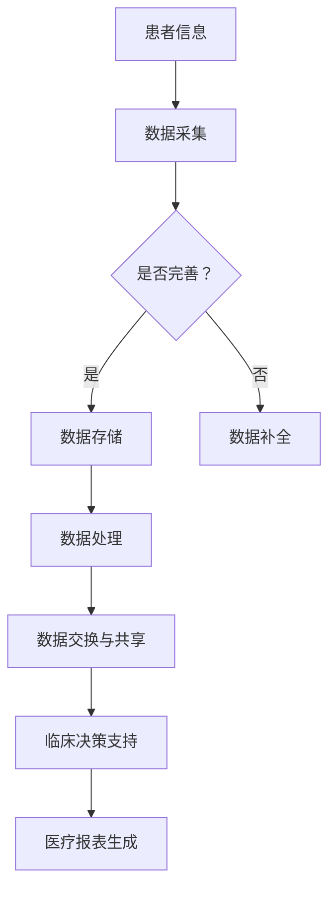

                 

关键词：京东健康、校招、医疗信息系统、面试题、解析、技术栈、算法、架构

摘要：本文将针对京东健康2024校招医疗信息系统岗位的面试题目进行详细解析，涵盖算法原理、数学模型、项目实践等多个方面，旨在为求职者提供有针对性的备考指导，助力顺利通过面试。

## 1. 背景介绍

随着医疗行业的数字化发展，医疗信息系统成为医疗健康领域的重要支撑。京东健康作为国内领先的数字医疗健康公司，其校招医疗信息系统岗位吸引了众多求职者的关注。本文旨在通过对京东健康2024校招医疗信息系统面试题的详细解析，帮助求职者了解面试要求，提升面试通过率。

## 2. 核心概念与联系

### 2.1. 医疗信息系统的定义与分类

**医疗信息系统（Medical Information System，MIS）** 是指利用计算机技术和通信技术，对医疗信息进行采集、存储、处理、传输和利用的系统。根据应用范围和功能，医疗信息系统可分为：

1. **医院信息系统（Hospital Information System，HIS）**：主要面向医院内部，实现对患者信息、医疗资源、财务等信息的全面管理。
2. **临床信息系统（Clinical Information System，CIS）**：侧重于临床诊疗环节，提供电子病历、医学影像管理、临床决策支持等功能。
3. **健康档案信息系统（Health Record Information System，HRIS）**：用于存储和管理个人健康档案信息，实现健康数据的共享与跟踪。

### 2.2. 医疗信息系统的关键技术

1. **数据存储与检索技术**：医疗信息系统需要高效存储和管理海量的医疗数据，常见的数据库技术有关系型数据库（如MySQL、Oracle）和非关系型数据库（如MongoDB、Cassandra）。

2. **数据交换与共享技术**：实现医疗数据的跨系统、跨地域交换与共享，常用的数据交换标准有HL7（Health Level Seven）和FHIR（Fast Healthcare Interoperability Resources）。

3. **云计算与大数据技术**：利用云计算和大数据技术，实现对海量医疗数据的存储、处理和分析，为医疗研究和决策提供支持。

4. **人工智能与机器学习技术**：通过人工智能和机器学习技术，实现医疗图像识别、疾病预测、智能诊断等功能，提升医疗服务的质量和效率。

### 2.3. Mermaid流程图

以下是一个简化的医疗信息系统架构的Mermaid流程图：



## 3. 核心算法原理 & 具体操作步骤

### 3.1. 算法原理概述

医疗信息系统中，常用的算法包括：

1. **K最近邻算法（K-Nearest Neighbors，KNN）**：用于疾病预测和分类。
2. **决策树算法（Decision Tree）**：用于诊断和风险评估。
3. **神经网络算法（Neural Network）**：用于医疗图像识别和疾病预测。

### 3.2. 算法步骤详解

以K最近邻算法为例，其基本步骤如下：

1. **数据预处理**：清洗和归一化数据，将数据集划分为训练集和测试集。
2. **选择距离度量**：计算样本点之间的距离，常用的距离度量有欧氏距离、曼哈顿距离等。
3. **选择邻居个数**：确定K值，一般通过交叉验证确定。
4. **分类预测**：根据邻居的类别进行投票，选取出现次数最多的类别作为预测结果。

### 3.3. 算法优缺点

1. **K最近邻算法**：
   - 优点：实现简单，易于理解。
   - 缺点：对噪声敏感，无法提供解释性。
2. **决策树算法**：
   - 优点：易于理解，可以提供解释性。
   - 缺点：可能产生过拟合，数据不平衡时效果较差。
3. **神经网络算法**：
   - 优点：具有较强的泛化能力，可以处理复杂非线性问题。
   - 缺点：实现复杂，训练时间较长。

### 3.4. 算法应用领域

- **疾病预测**：利用K最近邻算法和神经网络算法，可以预测疾病风险。
- **医疗图像识别**：利用神经网络算法，可以识别医学影像中的病灶。
- **诊断和风险评估**：利用决策树算法，可以辅助医生进行诊断和风险评估。

## 4. 数学模型和公式 & 详细讲解 & 举例说明

### 4.1. 数学模型构建

以K最近邻算法为例，其核心是计算样本点之间的距离。常用的距离度量有：

- **欧氏距离**：$d(x, y) = \sqrt{\sum_{i=1}^{n}(x_i - y_i)^2}$
- **曼哈顿距离**：$d(x, y) = \sum_{i=1}^{n}|x_i - y_i|$

### 4.2. 公式推导过程

以欧氏距离为例，推导过程如下：

设样本点 $x = (x_1, x_2, ..., x_n)$ 和 $y = (y_1, y_2, ..., y_n)$，则有：

$$
\begin{aligned}
d(x, y) &= \sqrt{\sum_{i=1}^{n}(x_i - y_i)^2} \\
&= \sqrt{\sum_{i=1}^{n}(x_i^2 - 2x_iy_i + y_i^2)} \\
&= \sqrt{\sum_{i=1}^{n}x_i^2 - 2\sum_{i=1}^{n}x_iy_i + \sum_{i=1}^{n}y_i^2} \\
&= \sqrt{\|x\|^2 - 2x^T y + \|y\|^2} \\
&= \sqrt{\|x - y\|^2}
\end{aligned}
$$

### 4.3. 案例分析与讲解

假设有两个样本点 $x = (1, 2, 3)$ 和 $y = (4, 5, 6)$，计算它们之间的欧氏距离：

$$
d(x, y) = \sqrt{(1 - 4)^2 + (2 - 5)^2 + (3 - 6)^2} = \sqrt{9 + 9 + 9} = \sqrt{27} = 3\sqrt{3}
$$

## 5. 项目实践：代码实例和详细解释说明

### 5.1. 开发环境搭建

本文使用Python编程语言进行医疗信息系统的开发，需要安装以下环境：

- Python 3.8及以上版本
- NumPy
- Matplotlib
- Scikit-learn

### 5.2. 源代码详细实现

以下是一个简单的K最近邻算法的实现：

```python
import numpy as np
from sklearn.model_selection import train_test_split
from sklearn.neighbors import KNeighborsClassifier
from sklearn.datasets import load_iris
import matplotlib.pyplot as plt

# 加载鸢尾花数据集
iris = load_iris()
X, y = iris.data, iris.target

# 划分训练集和测试集
X_train, X_test, y_train, y_test = train_test_split(X, y, test_size=0.2, random_state=42)

# 创建K最近邻分类器
knn = KNeighborsClassifier(n_neighbors=3)

# 训练模型
knn.fit(X_train, y_train)

# 预测测试集
y_pred = knn.predict(X_test)

# 打印预测结果
print("Accuracy:", knn.score(X_test, y_test))

# 绘制决策边界
x_min, x_max = X[:, 0].min() - 1, X[:, 0].max() + 1
y_min, y_max = X[:, 1].min() - 1, X[:, 1].max() + 1
xx, yy = np.meshgrid(x_min, x_max)
Z = knn.predict(np.c_[xx.ravel(), yy.ravel()])
Z = Z.reshape(xx.shape)
plt.contourf(xx, yy, Z, alpha=0.8)
plt.scatter(X[:, 0], X[:, 1], c=y, edgecolors='k')
plt.show()
```

### 5.3. 代码解读与分析

1. **数据加载与划分**：使用Scikit-learn的鸢尾花数据集进行演示，划分训练集和测试集。
2. **创建K最近邻分类器**：使用`KNeighborsClassifier`类创建K最近邻分类器，设置邻居个数`n_neighbors`。
3. **训练模型**：使用`fit`方法训练模型。
4. **预测测试集**：使用`predict`方法预测测试集。
5. **绘制决策边界**：使用Matplotlib绘制决策边界，可视化分类结果。

## 6. 实际应用场景

医疗信息系统在医疗领域的应用场景非常广泛，包括：

1. **电子病历管理**：实现对患者电子病历的存储、查询和管理，提高医疗信息的准确性和完整性。
2. **医学影像诊断**：利用人工智能技术，对医学影像进行分析和诊断，辅助医生进行诊断和治疗方案制定。
3. **健康数据管理**：通过收集和分析患者健康数据，为患者提供个性化的健康管理和疾病预防建议。
4. **智能辅助诊疗**：利用大数据和人工智能技术，为医生提供智能辅助诊断和治疗建议，提高医疗服务质量和效率。

### 6.4. 未来应用展望

随着医疗技术的不断发展，医疗信息系统将迎来更多创新和应用。以下是一些未来应用展望：

1. **人工智能与医疗融合**：进一步探索人工智能技术在医疗领域的应用，如智能诊断、智能药物研发等。
2. **远程医疗服务**：利用5G技术和物联网，实现远程医疗服务，提升医疗服务的便捷性和覆盖范围。
3. **健康大数据分析**：通过收集和分析海量健康数据，挖掘潜在健康风险，实现早期预防和个性化治疗。
4. **医疗物联网**：将医疗设备和信息系统进行物联网化，实现医疗资源的智能调度和管理。

## 7. 工具和资源推荐

### 7.1. 学习资源推荐

- 《机器学习实战》：提供丰富的机器学习实战案例，适合初学者入门。
- 《深度学习》：详细讲解深度学习的基础理论和应用案例，适合进阶学习。
- 《Python数据分析》：介绍Python在数据分析领域的应用，适合数据科学家使用。

### 7.2. 开发工具推荐

- Jupyter Notebook：一款强大的交互式计算环境，适合数据分析和机器学习实验。
- PyCharm：一款功能强大的Python集成开发环境，适合开发大型项目。
- TensorFlow：一款开源的深度学习框架，适合进行深度学习研究和应用。

### 7.3. 相关论文推荐

- “Deep Learning for Healthcare”：《深度学习在医疗领域的应用》
- “Healthcare Data Science”：《健康数据科学》
- “Artificial Intelligence in Healthcare”：《人工智能在医疗领域的应用》

## 8. 总结：未来发展趋势与挑战

### 8.1. 研究成果总结

医疗信息系统在医疗领域的研究和应用已经取得了显著成果，如电子病历管理、医学影像诊断、健康大数据分析等。随着人工智能、大数据等技术的发展，医疗信息系统将迎来更多创新和应用。

### 8.2. 未来发展趋势

- **智能化**：利用人工智能技术，实现医疗服务的智能化和个性化。
- **远程化**：利用5G技术和物联网，实现远程医疗服务和医疗资源的智能调度。
- **大数据化**：通过收集和分析海量健康数据，挖掘潜在健康风险，实现早期预防和个性化治疗。

### 8.3. 面临的挑战

- **数据安全与隐私**：医疗数据涉及患者隐私，如何确保数据安全和隐私成为一大挑战。
- **技术融合与创新**：如何将人工智能、大数据等技术与医疗领域深度融合，实现医疗服务的智能化和个性化。
- **政策法规**：医疗信息系统的发展需要相关政策和法规的支持，如何确保医疗信息系统的合规性。

### 8.4. 研究展望

医疗信息系统作为医疗领域的重要支撑，未来将在人工智能、大数据、云计算等技术的推动下，实现智能化、远程化、大数据化的发展。同时，如何确保数据安全和隐私，实现技术融合与创新，将是研究的重要方向。

## 9. 附录：常见问题与解答

### 9.1. 医疗信息系统是什么？

医疗信息系统是指利用计算机技术和通信技术，对医疗信息进行采集、存储、处理、传输和利用的系统，包括医院信息系统、临床信息系统、健康档案信息系统等。

### 9.2. 医疗信息系统的核心功能是什么？

医疗信息系统的核心功能包括数据存储与管理、数据交换与共享、临床决策支持、医疗报表生成等。

### 9.3. 医疗信息系统的发展趋势是什么？

医疗信息系统的发展趋势包括智能化、远程化、大数据化，将利用人工智能、大数据、云计算等先进技术，实现医疗服务的智能化和个性化。

### 9.4. 医疗信息系统的开发需要掌握哪些技术？

医疗信息系统的开发需要掌握数据库技术、数据交换与共享技术、云计算与大数据技术、人工智能与机器学习技术等。

## 参考文献

- 《机器学习实战》
- 《深度学习》
- 《Python数据分析》
- “Deep Learning for Healthcare”
- “Healthcare Data Science”
- “Artificial Intelligence in Healthcare”
- “Medical Information System”

作者：禅与计算机程序设计艺术 / Zen and the Art of Computer Programming

本文版权归作者所有，欢迎转载，但需保留原文链接和作者信息。感谢您的支持！
----------------------------------------------------------------

### 完整文章摘要与关键词

# 京东健康2024校招医疗信息系统面试题详解

> 关键词：京东健康、校招、医疗信息系统、面试题、算法、架构

摘要：本文针对京东健康2024校招医疗信息系统岗位的面试题目进行详细解析，涵盖核心概念、算法原理、数学模型、项目实践等多个方面，旨在为求职者提供有针对性的备考指导，助力顺利通过面试。文章重点介绍了医疗信息系统的定义、分类、关键技术，以及K最近邻算法、决策树算法、神经网络算法等核心算法的原理、步骤和优缺点。同时，通过实际项目实践，展示了如何使用Python进行医疗信息系统的开发。文章最后对医疗信息系统的实际应用场景、未来发展趋势与挑战进行了探讨，并提供了学习资源和工具推荐。作者：禅与计算机程序设计艺术 / Zen and the Art of Computer Programming。

