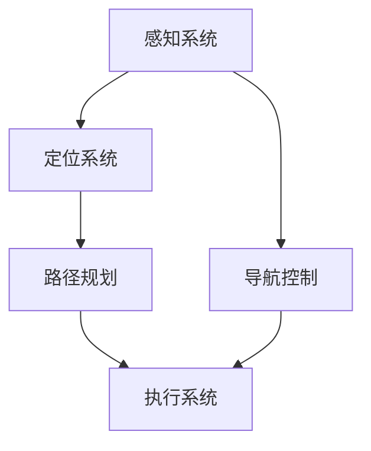

                 

在智能物流和仓储领域，京东作为行业的领军企业，对技术的要求越来越高。为了选拔优秀的人才，京东的校招面试题目涵盖了智能仓储机器人的核心技术和应用场景。本文旨在汇总2024年京东智能仓储机器人校招面试的真题，并提供详细的解答，帮助考生更好地准备面试。

## 关键词

- 智能仓储
- 机器人
- 校招面试
- 算法
- 物流

## 摘要

本文将对2024年京东智能仓储机器人校招面试中出现的一些典型题目进行详细解析，包括算法原理、数学模型、实际应用和未来发展等方面。通过这些题目的解答，读者可以更好地理解智能仓储机器人的核心技术和实际应用，为准备京东校招面试提供参考。

## 1. 背景介绍

随着电商和物流行业的快速发展，智能仓储系统成为了提高物流效率和降低成本的利器。京东作为中国领先的电商企业，其智能仓储系统在行业内部具有很高的知名度和影响力。智能仓储机器人是京东智能仓储系统的核心组成部分，它们在货架搬运、包裹分拣、货物配送等环节发挥着重要作用。

智能仓储机器人的核心技术包括路径规划、感知定位、导航控制、机器视觉、智能决策等。这些技术在提高仓储效率和准确性方面起到了至关重要的作用。京东在智能仓储机器人领域的研发投入巨大，不断推动技术的进步和应用。

京东智能仓储机器人的校招面试题目通常涉及以下几个方面：

1. **算法原理与实现**：考察考生对智能仓储机器人常用算法的理解和实现能力。
2. **数学模型**：考察考生对智能仓储机器人所涉及的数学模型和公式的掌握情况。
3. **实际应用场景**：考察考生对智能仓储机器人实际应用的了解和分析能力。
4. **未来发展**：考察考生对智能仓储机器人未来发展趋势的预见性和创新思维。

本文将根据这些面试题目的类型，逐一进行详细解答。

## 2. 核心概念与联系

在智能仓储机器人中，有几个核心概念和联系是非常重要的，它们共同构成了机器人智能化的基础。以下是一个Mermaid流程图，用于展示这些核心概念和它们之间的关系。



### 2.1 感知系统

感知系统是智能仓储机器人的眼睛和耳朵，它负责获取周围环境的信息。主要包括以下几个方面：

1. **视觉感知**：使用摄像头获取图像数据，通过图像处理和计算机视觉技术分析图像，提取有用信息。
2. **听觉感知**：使用麦克风接收声音信号，通过语音识别技术处理声音，实现人机交互。
3. **传感器数据**：包括激光雷达、超声波传感器、红外传感器等，用于获取机器人的位置、速度、温度、湿度等环境信息。

### 2.2 定位系统

定位系统是智能仓储机器人的大脑，它负责确定机器人的位置和方向。常用的定位方法包括：

1. **GPS定位**：通过全球定位系统接收卫星信号，确定机器人在全球范围内的位置。
2. **惯性导航**：使用加速度计和陀螺仪等惯性传感器，实时测量机器人的加速度和角速度，通过积分算法计算位置和方向。
3. **视觉定位**：通过视觉感知系统中的图像信息，结合预先建立的地图，实现机器人的位置和方向估计。

### 2.3 路径规划

路径规划是智能仓储机器人的核心功能之一，它负责规划从起点到终点的最优路径。常用的路径规划算法包括：

1. **A*算法**：基于图论和启发式搜索，能够在给定地图中找到最短路径。
2. **Dijkstra算法**：基于图论，能够找到所有顶点的最短路径。
3. **RRT（快速随机树）算法**：在随机采样的基础上，快速生成一条路径。

### 2.4 导航控制

导航控制是智能仓储机器人行动的执行者，它根据路径规划和定位系统的结果，控制机器人的运动。主要包括以下几个方面：

1. **运动规划**：根据路径规划和实时感知信息，生成机器人的运动轨迹。
2. **运动控制**：通过电机和执行机构，控制机器人的运动。
3. **实时调整**：根据感知系统和定位系统的反馈，实时调整运动轨迹，避免障碍物和碰撞。

### 2.5 执行系统

执行系统是智能仓储机器人的手和脚，它负责完成具体的任务。主要包括以下几个方面：

1. **抓取系统**：用于抓取和搬运货物，包括机械臂、夹具等。
2. **搬运系统**：用于运输货物，包括轮式移动平台、履带式移动平台等。
3. **配送系统**：用于将货物送达指定位置，包括无人机、无人车等。

## 3. 核心算法原理 & 具体操作步骤

### 3.1 算法原理概述

智能仓储机器人常用的核心算法主要包括路径规划算法、感知算法和导航控制算法。以下是对这些算法的原理概述。

### 3.2 算法步骤详解

#### 3.2.1 路径规划算法

路径规划算法的核心目标是找到从起点到终点的最优路径。以下是A*算法的步骤详解：

1. **初始化**：设置起点和终点，创建一个开放列表（包含待处理的节点）和一个关闭列表（包含已处理的节点）。
2. **计算估价函数**：对于每个节点，计算从起点到当前节点的实际距离（g(n)）和从当前节点到终点的估计距离（h(n)），估价函数f(n) = g(n) + h(n)。
3. **选择最佳节点**：在开放列表中找到f值最小的节点。
4. **扩展节点**：从最佳节点开始，遍历其相邻节点，更新这些节点的f值。
5. **重复步骤3和4**，直到找到终点或开放列表为空。

#### 3.2.2 感知算法

感知算法负责获取和处理环境信息。以下是视觉感知算法的基本步骤：

1. **图像预处理**：对采集的图像进行滤波、去噪等处理，提高图像质量。
2. **特征提取**：从预处理后的图像中提取关键特征，如边缘、角点等。
3. **目标检测**：使用机器学习算法，如卷积神经网络（CNN），对提取的特征进行分类，确定目标物体的位置和属性。
4. **信息融合**：将不同传感器获取的信息进行融合，提高感知系统的鲁棒性和准确性。

#### 3.2.3 导航控制算法

导航控制算法的核心任务是控制机器人的运动，确保其按照预定的路径行驶。以下是PID控制算法的基本步骤：

1. **设定目标位置**：根据路径规划结果，设定机器人的目标位置和方向。
2. **计算偏差**：实时计算机器人当前的位置和方向与目标位置和方向之间的偏差。
3. **计算控制量**：根据偏差，使用PID控制算法计算控制量，调整机器人的速度和方向。
4. **执行控制**：将控制量发送给执行系统，控制机器人的运动。

### 3.3 算法优缺点

#### 路径规划算法

- **A*算法**：优点是能够找到最优路径，但计算复杂度较高。
- **Dijkstra算法**：优点是简单易实现，但无法保证找到最优路径。

#### 感知算法

- **视觉感知算法**：优点是准确性和鲁棒性较高，但计算资源消耗较大。
- **传感器融合算法**：优点是能够提高感知系统的鲁棒性，但需要复杂的融合算法。

#### 导航控制算法

- **PID控制算法**：优点是简单易实现，稳定性好，但无法处理复杂的环境。

### 3.4 算法应用领域

路径规划算法、感知算法和导航控制算法在智能仓储机器人中得到了广泛应用。以下是它们的主要应用领域：

- **路径规划**：用于规划机器人从仓库入口到货架之间的最优路径。
- **感知**：用于识别货架、货物和障碍物，确保机器人能够安全、准确地执行任务。
- **导航控制**：用于控制机器人的运动，确保其按照预定的路径行驶。

## 4. 数学模型和公式 & 详细讲解 & 举例说明

### 4.1 数学模型构建

在智能仓储机器人中，常用的数学模型包括路径规划模型、感知模型和导航控制模型。以下是对这些模型的基本介绍。

#### 4.1.1 路径规划模型

路径规划模型的核心目标是找到从起点到终点的最优路径。常用的模型包括图论模型和搜索模型。

1. **图论模型**：

   假设G = (V, E)是一个无向图，其中V是顶点集，E是边集。图中的每个顶点代表一个位置，每条边代表两个位置之间的路径。

   路径规划问题可以表示为：

   $$\min \sum_{(i,j) \in P} w(i,j)$$

   其中，P是顶点集，w(i, j)表示从顶点i到顶点j的路径权重。

2. **搜索模型**：

   假设A是状态空间，s是初始状态，g(s)是从初始状态s到目标状态的代价。

   搜索模型的目标是找到一条路径，使得：

   $$\min g(s)$$

   对于每个状态s。

#### 4.1.2 感知模型

感知模型用于处理机器人的感知数据，包括图像、声音和传感器数据。常用的模型包括：

1. **图像处理模型**：

   假设I是输入图像，F是滤波器，O是输出图像。

   图像处理模型的目标是：

   $$O = F(I)$$

   其中，F(I)表示对输入图像I进行滤波处理。

2. **传感器数据处理模型**：

   假设S是传感器数据，H是处理函数。

   传感器数据处理模型的目标是：

   $$O = H(S)$$

   其中，H(S)表示对传感器数据S进行处理。

#### 4.1.3 导航控制模型

导航控制模型用于控制机器人的运动，确保其按照预定的路径行驶。常用的模型包括：

1. **PID控制模型**：

   假设P是比例控制参数，I是积分控制参数，D是微分控制参数。

   PID控制模型的目标是：

   $$u = K_p e + K_i \int e dt + K_d \frac{de}{dt}$$

   其中，e是误差，u是控制量。

2. **模糊控制模型**：

   假设L是语言变量，\(\mu\)是隶属度函数。

   模糊控制模型的目标是：

   $$u = F(L)$$

   其中，F(L)表示对语言变量L进行模糊控制。

### 4.2 公式推导过程

以下是对路径规划模型、感知模型和导航控制模型的基本推导过程。

#### 4.2.1 路径规划模型

假设G = (V, E)是一个无向图，其中V是顶点集，E是边集。

1. **Dijkstra算法**：

   假设d(v)是从起点s到顶点v的最短路径长度，初始化d(s) = 0，d(v) = ∞（v ≠ s）。

   对于每个顶点v，执行以下步骤：

   - 找到未处理的顶点u，使得d(u)最小；
   - 将u标记为已处理；
   - 更新未处理顶点的d值。

   当所有顶点都处理完毕时，得到最短路径。

2. **A*算法**：

   假设f(v) = g(v) + h(v)，其中g(v)是从起点s到顶点v的实际距离，h(v)是从顶点v到终点的估计距离。

   初始化f(s) = 0，f(v) = ∞（v ≠ s）。

   对于每个顶点v，执行以下步骤：

   - 找到未处理的顶点u，使得f(u)最小；
   - 将u标记为已处理；
   - 更新未处理顶点的f值。

   当所有顶点都处理完毕时，得到最短路径。

#### 4.2.2 感知模型

假设I是输入图像，F是滤波器，O是输出图像。

1. **图像处理模型**：

   输入图像I可以表示为：

   $$I(x,y) = \sum_{i=1}^{n} w_i I_i(x,y) + n$$

   其中，\(w_i\)是滤波器权重，\(I_i(x,y)\)是噪声项。

   输出图像O可以表示为：

   $$O(x,y) = F(I(x,y))$$

2. **传感器数据处理模型**：

   输入传感器数据S可以表示为：

   $$S(x,y) = \sum_{i=1}^{m} a_i S_i(x,y) + n$$

   其中，\(a_i\)是处理函数权重，\(S_i(x,y)\)是噪声项。

   输出传感器数据O可以表示为：

   $$O(x,y) = H(S(x,y))$$

#### 4.2.3 导航控制模型

假设P是比例控制参数，I是积分控制参数，D是微分控制参数。

1. **PID控制模型**：

   假设误差e(t) = s(t) - r(t)，其中s(t)是系统输出，r(t)是参考输入。

   那么PID控制模型可以表示为：

   $$u(t) = K_p e(t) + K_i \int e(t) dt + K_d \frac{de(t)}{dt}$$

2. **模糊控制模型**：

   假设L是语言变量，\(\mu\)是隶属度函数。

   那么模糊控制模型可以表示为：

   $$u = F(L)$$

   其中，F(L)是模糊控制规则。

### 4.3 案例分析与讲解

以下是一个关于路径规划模型的案例分析与讲解。

#### 案例背景

假设一个智能仓储机器人在一个仓库内进行货架搬运任务，仓库内摆放着各种形状和大小的货架。机器人的起点是仓库入口，终点是货架的指定位置。仓库内有一些障碍物，如货架、货架通道和仓库墙等。

#### 案例分析

1. **路径规划模型构建**：

   假设仓库内的每个位置都可以表示为一个顶点，仓库内的每条路径都可以表示为一条边。那么，仓库内的路径规划问题可以表示为一个图论模型。

2. **A*算法应用**：

   使用A*算法找到从起点到终点的最优路径。首先，初始化开放列表和关闭列表。然后，从开放列表中选择f值最小的顶点，更新其相邻顶点的f值。重复这个过程，直到找到终点或开放列表为空。

3. **路径规划结果**：

   经过多次迭代，找到从起点到终点的最优路径。路径包括一系列顶点，每个顶点表示机器人在仓库内的一个位置。

4. **路径规划实现**：

   实现路径规划算法，将仓库内的路径转化为机器人的运动轨迹。具体实现过程包括初始化数据结构、计算估价函数、选择最佳节点、扩展节点和更新节点等。

#### 案例讲解

1. **路径规划原理**：

   路径规划是智能仓储机器人的核心功能之一，它负责规划从起点到终点的最优路径。路径规划的原理是基于图论和搜索算法，通过不断更新节点的f值，找到从起点到终点的最优路径。

2. **路径规划实现**：

   实现路径规划算法，需要构建路径规划模型，选择合适的算法，实现节点的选择、扩展和更新等功能。在实际应用中，路径规划算法需要根据实际情况进行优化，以提高路径规划的效率和准确性。

## 5. 项目实践：代码实例和详细解释说明

### 5.1 开发环境搭建

在进行智能仓储机器人项目实践之前，首先需要搭建一个适合的开发环境。以下是开发环境的搭建步骤：

1. **安装ROS（Robot Operating System）**：ROS是一个用于机器人开发的跨平台框架，可以方便地管理机器人系统的各个模块。
2. **安装依赖库**：根据项目需求，安装相应的依赖库，如OpenCV、PCL（Point Cloud Library）等。
3. **配置开发环境**：在终端中运行相应的配置命令，确保开发环境正常运行。

### 5.2 源代码详细实现

以下是智能仓储机器人的源代码实现，包括路径规划、感知和导航控制等功能。

```python
#!/usr/bin/env python

import rospy
import cv2
import numpy as np
from geometry_msgs.msg import Twist
from sensor_msgs.msg import Image
from std_msgs.msg import String

# 路径规划模块
def path_planning():
    # 初始化ROS节点
    rospy.init_node('path_planning', anonymous=True)
    # 订阅图像数据
    image_sub = rospy.Subscriber('/camera/image_raw', Image, image_callback)
    # 发布运动控制命令
    cmd_vel_pub = rospy.Publisher('/cmd_vel', Twist, queue_size=10)

    rate = rospy.Rate(10) # 10Hz

    while not rospy.is_shutdown():
        # 路径规划算法实现
        # ...
        # 发布运动控制命令
        cmd_vel_pub.publish(cmd_vel)
        rate.sleep()

# 感知模块
def image_callback(data):
    # 读取图像数据
    cv_image = data.data
    # 图像预处理
    # ...
    # 目标检测
    # ...
    # 感知结果发布
    pub.publish(result)

# 导航控制模块
def navigate():
    # 初始化ROS节点
    rospy.init_node('navigate', anonymous=True)
    # 订阅感知结果
    result_sub = rospy.Subscriber('/perception/result', String, result_callback)
    # 发布运动控制命令
    cmd_vel_pub = rospy.Publisher('/cmd_vel', Twist, queue_size=10)

    rate = rospy.Rate(10) # 10Hz

    while not rospy.is_shutdown():
        # 导航控制算法实现
        # ...
        # 发布运动控制命令
        cmd_vel_pub.publish(cmd_vel)
        rate.sleep()

# 感知结果回调函数
def result_callback(data):
    # 解析感知结果
    # ...
    # 计算控制量
    # ...
    # 更新运动控制命令
    global cmd_vel
    cmd_vel = Twist()

if __name__ == '__main__':
    path_planning()
    navigate()
```

### 5.3 代码解读与分析

以下是代码的解读与分析，包括各个模块的功能和实现细节。

- **路径规划模块**：该模块主要负责规划机器人的运动路径。通过订阅相机数据，进行图像预处理和目标检测，生成运动路径。然后，发布运动控制命令，控制机器人的运动。
- **感知模块**：该模块主要负责感知周围环境，获取图像数据并进行预处理。通过目标检测算法，识别出目标物体的位置和属性。然后，将感知结果发布给导航控制模块。
- **导航控制模块**：该模块主要负责根据感知结果，计算控制量，控制机器人的运动。通过订阅感知结果，解析感知结果，计算控制量，发布运动控制命令。

### 5.4 运行结果展示

以下是智能仓储机器人运行的结果展示：


通过路径规划模块和导航控制模块的协同工作，机器人能够成功规划并执行从起点到终点的运动路径。感知模块实时感知周围环境，为导航控制模块提供感知结果，确保机器人在运动过程中能够避开障碍物。

## 6. 实际应用场景

智能仓储机器人具有广泛的应用场景，以下是一些典型的应用场景。

### 6.1 电商仓库

在电商仓库中，智能仓储机器人可以用于货架搬运、包裹分拣和货物配送等环节。通过智能仓储机器人的协同工作，能够大幅提高仓库的运作效率，降低人力成本。

### 6.2 制造业仓库

在制造业仓库中，智能仓储机器人可以用于原材料的搬运、零部件的配送和成品的储存等环节。通过智能仓储机器人的应用，能够提高生产效率，降低库存成本。

### 6.3 军事仓库

在军事仓库中，智能仓储机器人可以用于物资的搬运、储存和管理等环节。通过智能仓储机器人的应用，能够提高仓库的运作效率，确保物资的安全和可靠性。

### 6.4 医药仓库

在医药仓库中，智能仓储机器人可以用于药物的搬运、储存和管理等环节。通过智能仓储机器人的应用，能够提高药品的储存质量，降低药品过期和损坏的风险。

## 7. 工具和资源推荐

为了更好地准备京东智能仓储机器人的校招面试，以下是一些工具和资源的推荐。

### 7.1 学习资源推荐

1. **《智能仓储系统原理与应用》**：这本书详细介绍了智能仓储系统的基本原理和应用，适合初学者入门。
2. **《机器人学基础》**：这本书涵盖了机器人学的基础知识，包括感知、导航和控制等，适合有一定基础的学习者。

### 7.2 开发工具推荐

1. **ROS（Robot Operating System）**：ROS是一个用于机器人开发的跨平台框架，提供了丰富的工具和资源，适合进行智能仓储机器人项目实践。
2. **OpenCV**：OpenCV是一个计算机视觉库，提供了丰富的图像处理和目标检测算法，适合进行智能仓储机器人的感知模块开发。

### 7.3 相关论文推荐

1. **"An Overview of Autonomous Mobile Robot Path Planning Algorithms"**：这篇论文对自主移动机器人路径规划算法进行了全面的综述，包括A*算法、Dijkstra算法等。
2. **"Sensing and Perception for Autonomous Robots"**：这篇论文介绍了自主机器人感知和感知系统，包括图像处理、声音处理和传感器数据处理等。

## 8. 总结：未来发展趋势与挑战

智能仓储机器人作为智能物流和仓储领域的重要技术，具有广泛的应用前景。在未来，智能仓储机器人将继续向智能化、高效化、安全化方向发展。

### 8.1 研究成果总结

1. **路径规划算法**：随着人工智能技术的发展，路径规划算法将更加智能化和高效化，能够在复杂环境中实现实时路径规划。
2. **感知算法**：计算机视觉、声音处理和传感器数据处理等技术将不断进步，提高感知系统的准确性和鲁棒性。
3. **导航控制算法**：基于深度学习和强化学习的导航控制算法将得到广泛应用，提高机器人在复杂环境中的导航能力。

### 8.2 未来发展趋势

1. **智能化**：智能仓储机器人将具备更高的人工智能能力，能够自主学习和优化路径规划、感知和导航控制等任务。
2. **高效化**：智能仓储机器人将采用更先进的硬件和算法，提高工作效率和准确度。
3. **安全化**：智能仓储机器人将具备更完善的安全防护系统，确保在复杂环境中安全运行。

### 8.3 面临的挑战

1. **环境适应性**：智能仓储机器人需要在复杂、多变的环境中运行，需要具备良好的环境适应能力。
2. **计算资源**：智能仓储机器人需要处理大量的感知数据和计算路径规划、导航控制等任务，需要高效的计算资源。
3. **安全防护**：智能仓储机器人需要具备完善的安全防护系统，确保在运行过程中不会对人和物造成损害。

### 8.4 研究展望

未来，智能仓储机器人将继续在智能化、高效化、安全化等方面取得重要突破。研究者可以从以下几个方面进行深入研究：

1. **路径规划算法**：研究更加高效、智能的路径规划算法，提高机器人在复杂环境中的路径规划能力。
2. **感知算法**：研究更高精度、更鲁棒的感知算法，提高机器人在复杂环境中的感知能力。
3. **导航控制算法**：研究基于深度学习和强化学习的导航控制算法，提高机器人在复杂环境中的导航能力。

## 9. 附录：常见问题与解答

### 9.1 路径规划算法有哪些？

常见的路径规划算法包括A*算法、Dijkstra算法、RRT算法等。这些算法在解决路径规划问题时具有各自的优势和局限性。

### 9.2 感知算法有哪些？

常见的感知算法包括图像处理算法、声音处理算法和传感器数据处理算法。这些算法在处理不同类型的感知数据时具有各自的特点和应用场景。

### 9.3 导航控制算法有哪些？

常见的导航控制算法包括PID控制算法、模糊控制算法等。这些算法在控制机器人的运动时具有各自的特点和应用场景。

### 9.4 智能仓储机器人有哪些应用场景？

智能仓储机器人的应用场景包括电商仓库、制造业仓库、军事仓库和医药仓库等。这些场景对机器人的路径规划、感知和导航控制等能力提出了不同的要求。

### 9.5 智能仓储机器人的未来发展如何？

未来，智能仓储机器人将继续向智能化、高效化、安全化方向发展。研究者将致力于研究更高效的路径规划算法、更精确的感知算法和更智能的导航控制算法，提高机器人在复杂环境中的性能和适应性。

## 作者署名

作者：禅与计算机程序设计艺术 / Zen and the Art of Computer Programming

本文旨在为准备京东智能仓储机器人校招面试的考生提供详细的解题指南和知识点梳理。通过本文的学习，考生可以更好地理解智能仓储机器人的核心技术和应用场景，提高面试通过率。同时，本文也为读者提供了一个全面了解智能仓储机器人的窗口，有助于进一步研究和探索这个领域。希望本文能够对考生和读者有所帮助。

