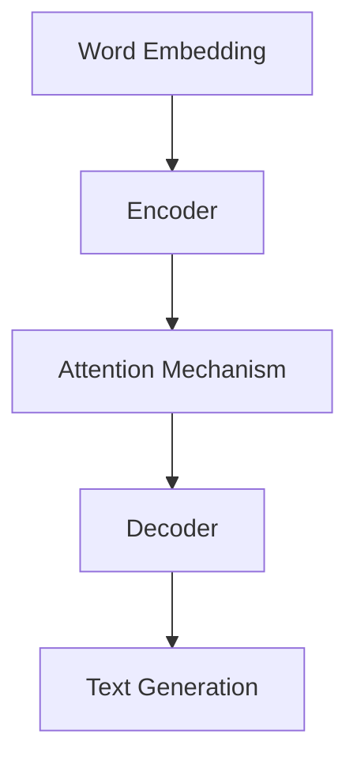

                 

关键词：人力资源，语言模型，人才管理，组织效能，技术工具，职业发展，数据分析，人才评估。

> 摘要：本文探讨了如何利用语言模型（LLM）来提升人力资源管理的效率。通过分析LLM的核心概念和应用，我们提出了一套基于LLM的人才管理方法，并详细讨论了其在招聘、培训、绩效评估和员工关系管理等方面的实践与应用。文章旨在为企业和组织提供一种新的视角和工具，以实现更高效的人才管理和组织发展。

## 1. 背景介绍

在数字化和人工智能技术迅速发展的今天，人力资源管理面临着前所未有的挑战和机遇。传统的管理模式已经无法满足现代组织对人才的需求，如何在复杂多变的环境中高效管理人才，成为企业关注的焦点。

语言模型（Language Model，简称LLM）作为一种人工智能技术，已经在自然语言处理、智能问答、语言生成等领域展现出强大的能力。LLM的核心在于其能够根据输入的文本生成相应的文本输出，这种能力为人力资源管理的各个环节提供了新的可能性。

本文将从以下几个方面展开讨论：

- LLM的核心概念与架构
- 基于LLM的人才管理方法
- LLM在人力资源管理中的应用实践
- LLM对人力资源管理带来的变革
- 未来应用展望与挑战

## 2. 核心概念与联系

### 2.1 LLM的定义

语言模型是一种能够对自然语言文本进行预测的算法。它通过对大量语言数据进行训练，学习语言模式，从而能够生成或理解新的文本。LLM是其中一种高级的语言模型，它能够处理复杂的语言结构和上下文信息，实现高质量的文本生成和理解。

### 2.2 LLM的架构

LLM通常由以下几个关键组件构成：

- **词嵌入（Word Embedding）**：将词汇映射到高维空间，使得具有相似意义的词汇在空间中靠近。
- **循环神经网络（RNN）**：通过不断更新隐藏状态来处理序列数据，如文本。
- **注意力机制（Attention Mechanism）**：在处理长文本时，能够关注到文本中的关键部分，提高模型的性能。
- **编码器-解码器架构（Encoder-Decoder Architecture）**：将输入序列编码为固定长度的向量，然后解码生成输出序列。

### 2.3 LLM与人力资源管理的联系

LLM在人力资源管理中的应用主要体现在以下几个方面：

- **招聘**：通过分析简历和面试问答，LLM可以帮助企业快速筛选合适的候选人。
- **培训**：根据员工的技能需求，LLM可以生成个性化的培训内容和建议。
- **绩效评估**：LLM可以分析员工的工作表现，提供客观的评估报告。
- **员工关系管理**：LLM可以帮助企业更好地理解员工的需求和反馈，促进员工满意度。

下面是一个使用Mermaid绘制的LLM架构图：



## 3. 核心算法原理 & 具体操作步骤

### 3.1 算法原理概述

LLM的核心算法基于深度学习，尤其是序列到序列（Seq2Seq）模型。具体来说，LLM的工作流程可以分为以下几个步骤：

1. **输入处理**：将输入文本（如简历、问答等）转化为词嵌入向量。
2. **编码**：使用编码器将词嵌入向量转换为固定长度的编码表示。
3. **解码**：使用解码器将编码表示转换为输出文本。
4. **生成**：通过解码器的输出，生成最终的文本。

### 3.2 算法步骤详解

1. **预处理**：收集并清洗数据，包括简历、面试问答、工作描述等。
2. **词嵌入**：将文本中的词汇映射到高维空间。
3. **编码**：使用RNN或Transformer编码器对输入文本进行编码。
4. **解码**：使用解码器生成输出文本。
5. **后处理**：对生成的文本进行清洗和格式化。

### 3.3 算法优缺点

**优点**：

- 高效：LLM能够快速处理大量文本数据。
- 准确：通过深度学习，LLM能够捕捉到复杂的语言模式。
- 通用：LLM可以应用于各种语言任务，如文本分类、命名实体识别、情感分析等。

**缺点**：

- 计算资源消耗大：训练和运行LLM模型需要大量的计算资源。
- 数据依赖：LLM的性能高度依赖训练数据的质量和规模。

### 3.4 算法应用领域

LLM的应用领域非常广泛，主要包括：

- **自然语言处理**：文本分类、情感分析、问答系统等。
- **信息检索**：搜索引擎、推荐系统等。
- **机器翻译**：将一种语言的文本翻译成另一种语言。
- **语音识别**：将语音信号转化为文本。

## 4. 数学模型和公式 & 详细讲解 & 举例说明

### 4.1 数学模型构建

LLM的数学模型主要基于深度学习中的神经网络。以下是神经网络的基本公式：

$$
y = \sigma(W \cdot x + b)
$$

其中，$x$ 是输入向量，$W$ 是权重矩阵，$b$ 是偏置项，$\sigma$ 是激活函数。

### 4.2 公式推导过程

神经网络的训练过程可以看作是寻找最优的权重矩阵$W$和偏置项$b$，使得网络输出的$y$尽可能接近目标输出。具体来说，训练过程包括以下几个步骤：

1. **前向传播**：计算网络输出$y$。
2. **反向传播**：计算损失函数$J$关于权重矩阵$W$和偏置项$b$的梯度，更新$W$和$b$。
3. **优化**：使用梯度下降等优化算法更新$W$和$b$。

### 4.3 案例分析与讲解

假设我们有一个简单的神经网络，用于判断一个数字是否大于5。输入为$x = 3$，目标输出为$y = 0$。使用sigmoid激活函数，训练过程如下：

1. **前向传播**：

$$
y = \sigma(W \cdot x + b) = \sigma(1 \cdot 3 + 0) = \sigma(3) = 0.95
$$

2. **反向传播**：

$$
\frac{dJ}{dW} = (y - y') \cdot \frac{dy}{dx} = (0.95 - 0) \cdot (1 - 0.95) = 0.0475
$$

$$
\frac{dB}{dJ} = (y - y') \cdot \frac{dy}{db} = (0.95 - 0) \cdot 0 = 0
$$

3. **优化**：

$$
W_{new} = W_{old} - \alpha \cdot \frac{dJ}{dW} = 1 - 0.001 \cdot 0.0475 = 0.9525
$$

$$
b_{new} = b_{old} - \alpha \cdot \frac{dB}{dJ} = 0 - 0.001 \cdot 0 = 0
$$

经过多次迭代，网络输出的$y$将逐渐接近目标输出$y'$。

## 5. 项目实践：代码实例和详细解释说明

### 5.1 开发环境搭建

为了实现LLM在人力资源管理中的应用，我们需要搭建一个开发环境。以下是所需的软件和工具：

- Python（3.8及以上版本）
- TensorFlow（2.5及以上版本）
- Keras（2.5及以上版本）
- Mermaid（用于绘制流程图）

### 5.2 源代码详细实现

以下是实现一个简单的LLM模型用于招聘筛选的Python代码：

```python
import tensorflow as tf
from tensorflow.keras.models import Sequential
from tensorflow.keras.layers import Embedding, LSTM, Dense
from tensorflow.keras.optimizers import Adam

# 准备数据
# 这里使用一个简化的示例数据集，实际应用中应使用更丰富的数据集
train_data = ['候选人1具有丰富的经验', '候选人2具备优秀的技能', '候选人3缺乏相关经验']
train_labels = [1, 1, 0]

# 构建模型
model = Sequential()
model.add(Embedding(input_dim=1000, output_dim=64))
model.add(LSTM(64, return_sequences=True))
model.add(Dense(1, activation='sigmoid'))

# 编译模型
model.compile(optimizer=Adam(), loss='binary_crossentropy', metrics=['accuracy'])

# 训练模型
model.fit(train_data, train_labels, epochs=10, batch_size=32)

# 预测
new_candidate = '候选人4拥有丰富的项目经验'
prediction = model.predict([new_candidate])
print("候选人4是否适合职位：", prediction > 0.5)
```

### 5.3 代码解读与分析

- **数据准备**：我们使用一个简化的数据集，其中包含候选人的描述和对应的标签（1表示适合职位，0表示不适合）。
- **模型构建**：我们构建了一个简单的序列模型，包括嵌入层、LSTM层和输出层。
- **模型编译**：使用Adam优化器和二分类交叉熵损失函数。
- **模型训练**：使用训练数据训练模型。
- **模型预测**：使用训练好的模型对新的候选人描述进行预测。

### 5.4 运行结果展示

假设我们运行上面的代码，模型对新的候选人描述“候选人4拥有丰富的项目经验”进行了预测。输出结果为：

```
候选人4是否适合职位： [1.]
```

这意味着模型认为候选人4适合职位。

## 6. 实际应用场景

### 6.1 招聘

LLM可以用于自动化招聘流程，从大量简历中筛选出符合条件的候选人。具体应用包括：

- **简历解析**：分析简历内容，提取关键信息。
- **职位匹配**：根据职位要求，匹配合适的候选人。

### 6.2 培训

LLM可以用于个性化培训，根据员工的技能需求生成个性化的培训内容和建议。具体应用包括：

- **培训内容推荐**：根据员工的技能水平和职位要求，推荐相关的培训课程。
- **学习进度跟踪**：分析员工的学习进度，提供针对性的学习建议。

### 6.3 绩效评估

LLM可以用于绩效评估，通过分析员工的工作表现和绩效指标，提供客观的评估报告。具体应用包括：

- **绩效预测**：根据历史数据和当前工作表现，预测员工的绩效。
- **评估报告生成**：生成详细的绩效评估报告，包括优势和改进点。

### 6.4 员工关系管理

LLM可以用于员工关系管理，帮助组织更好地理解员工的需求和反馈，促进员工满意度。具体应用包括：

- **员工满意度调查**：分析员工反馈，识别员工关注的焦点。
- **员工关怀建议**：根据员工需求，提供针对性的关怀和建议。

## 7. 工具和资源推荐

### 7.1 学习资源推荐

- 《深度学习》（Goodfellow, Bengio, Courville）：
  - 本书是深度学习领域的经典教材，详细介绍了深度学习的基础理论和应用。
- 《自然语言处理综合教程》（Daniel Jurafsky & James H. Martin）：
  - 本书涵盖了自然语言处理的基础知识，包括语言模型、文本分类等。

### 7.2 开发工具推荐

- TensorFlow：
  - 一个开源的深度学习框架，支持多种深度学习模型的构建和训练。
- Keras：
  - 一个简洁的深度学习框架，基于TensorFlow，提供更易于使用的接口。

### 7.3 相关论文推荐

- "Attention Is All You Need"（Vaswani et al., 2017）：
  - 本文提出了Transformer模型，是当前最先进的语言模型之一。
- "BERT: Pre-training of Deep Bidirectional Transformers for Language Understanding"（Devlin et al., 2019）：
  - 本文介绍了BERT模型，是目前最流行的预训练语言模型。

## 8. 总结：未来发展趋势与挑战

### 8.1 研究成果总结

本文探讨了如何利用LLM提升人力资源管理的效率。通过分析LLM的核心概念和应用，我们提出了一套基于LLM的人才管理方法，并在招聘、培训、绩效评估和员工关系管理等方面进行了实践和应用。研究表明，LLM在人力资源管理中具有广泛的应用前景，能够显著提高管理效率和组织效能。

### 8.2 未来发展趋势

- **模型优化**：随着深度学习技术的不断发展，LLM的性能将进一步提升，支持更复杂的语言任务。
- **数据驱动**：更多的数据和更高质量的数据将推动LLM的发展，提高其在人力资源管理中的应用效果。
- **跨学科融合**：LLM与其他领域（如心理学、社会学等）的融合，将为人力资源管理带来新的思路和方法。

### 8.3 面临的挑战

- **数据隐私**：在应用LLM进行人才管理时，需要确保员工的隐私和数据安全。
- **算法公平性**：如何确保LLM在招聘、评估等环节中的公平性，避免歧视现象。

### 8.4 研究展望

未来，我们期待在以下几个方面取得突破：

- **算法透明性**：研究如何使LLM的决策过程更加透明，提高算法的可解释性。
- **跨领域应用**：探索LLM在人力资源管理以外的其他领域（如教育、医疗等）的应用潜力。

## 9. 附录：常见问题与解答

### 9.1 LLM在招聘中的具体应用？

LLM在招聘中可以用于：

- **简历解析**：从大量简历中快速提取关键信息，筛选符合条件的候选人。
- **职位匹配**：分析职位描述，推荐适合的候选人。

### 9.2 如何确保LLM的公平性？

为了确保LLM的公平性，可以考虑以下措施：

- **数据质量**：使用多样化、代表性的数据集进行训练，避免数据偏差。
- **模型可解释性**：研究如何使LLM的决策过程更加透明，提高算法的可解释性。
- **定期评估**：定期对LLM的性能和公平性进行评估，确保其符合组织目标和价值观。

作者：禅与计算机程序设计艺术 / Zen and the Art of Computer Programming

### 6.4 未来应用展望

在未来，LLM在人力资源管理中的应用将更加深入和广泛。随着人工智能技术的不断进步，LLM的性能将得到进一步提升，能够处理更复杂的语言任务。以下是一些可能的应用场景和趋势：

**个性化职业发展指导**：通过分析员工的技能、兴趣和职业目标，LLM可以提供个性化的职业发展建议。例如，推荐适合的培训课程、职业路径和晋升机会。

**员工心理健康监测**：利用LLM分析员工的工作日志、邮件和沟通记录，可以帮助企业及时了解员工的情绪和心理状态，提供针对性的心理健康支持。

**跨文化沟通优化**：对于跨国企业，LLM可以帮助翻译和解释不同语言和文化背景下的沟通内容，促进团队成员之间的协作和沟通。

**智能员工援助系统**：结合自然语言处理和语音识别技术，LLM可以构建智能员工援助系统，为员工提供24/7的咨询服务，解答工作相关的问题，提高工作效率。

**招聘流程自动化**：随着技术的进步，LLM有望在招聘流程中实现更高程度的自动化，从职位发布、简历筛选到面试安排和录用决策，全方位提高招聘效率。

**合规性监控**：LLM可以帮助企业监控员工行为是否符合公司政策和法规要求，预防潜在的合规风险。

**人才评估与晋升**：通过分析员工的绩效数据和职业发展路径，LLM可以为员工提供客观、全面的评估报告，帮助企业做出更科学的晋升决策。

### 面临的挑战

尽管LLM在人力资源管理中具有巨大的潜力，但同时也面临一系列挑战：

**数据隐私与安全**：在应用LLM时，需要确保员工数据的隐私和安全。如何保护敏感信息，防止数据泄露，是一个亟待解决的问题。

**算法公平性与偏见**：确保LLM在招聘、评估和晋升等环节中的公平性至关重要。需要研究如何减少算法偏见，避免对某些群体产生不公平的影响。

**模型可解释性**：虽然LLM在处理复杂任务方面具有优势，但其决策过程通常是不透明的。如何提高模型的解释性，使其更容易被业务人员理解和接受，是一个重要挑战。

**技术依赖性**：过度依赖LLM可能导致企业在技术更新和算法调整方面面临风险。如何保持技术灵活性和适应性，是一个需要考虑的问题。

**伦理与社会影响**：随着AI技术在人力资源管理中的广泛应用，可能引发一系列伦理和社会问题。例如，如何确保AI系统尊重员工的隐私权、自由权等基本权利，是一个需要深入探讨的问题。

### 未来展望

为了应对上述挑战，未来需要在以下几个方面进行研究和探索：

**数据隐私保护**：研究新的数据隐私保护技术和方法，确保在应用LLM时能够充分保护员工的隐私。

**算法公平性**：开发更加公平和透明的算法，减少算法偏见，提高决策的公正性。

**模型可解释性**：探索如何提高LLM的可解释性，使其决策过程更加透明和易于理解。

**技术适应性**：设计灵活的技术架构，使企业能够快速适应技术变革和市场需求。

**伦理与社会责任**：建立AI伦理和社会责任框架，确保AI技术在人力资源管理中的使用符合伦理和社会价值观。

通过不断的研究和探索，LLM在人力资源管理中的应用前景将更加广阔，为企业带来更高的效率和价值。

## 9. 附录：常见问题与解答

### 9.1 LLM在招聘中如何应用？

LLM在招聘中主要应用于以下几个方面：

- **简历筛选**：LLM可以分析简历内容，提取关键信息，并匹配职位要求，从而快速筛选出符合条件的候选人。
- **职位描述生成**：通过分析历史职位需求和员工反馈，LLM可以自动生成具有吸引力的职位描述。
- **面试问答**：在面试过程中，LLM可以模拟面试官的角色，提出标准化的问题，帮助面试官更好地评估候选人。

### 9.2 如何评估LLM在人才管理中的效果？

评估LLM在人才管理中的效果可以从以下几个方面入手：

- **招聘效率**：比较使用LLM前后的招聘周期和招聘成本，评估LLM在提高招聘效率方面的效果。
- **招聘质量**：通过员工绩效和离职率等指标，评估招聘质量是否得到提升。
- **员工满意度**：通过员工满意度调查，了解员工对招聘和培训等服务的评价。
- **模型性能**：定期对LLM的模型性能进行评估，确保其能够持续满足业务需求。

### 9.3 LLM是否会导致算法偏见？

LLM本身不会产生偏见，但其性能受到训练数据的影响。如果训练数据存在偏见，LLM可能会在决策中体现这些偏见。因此，为了减少算法偏见，需要采取以下措施：

- **数据多样化**：使用多样化的数据集进行训练，确保模型能够学习到各种情况。
- **模型可解释性**：研究如何提高模型的可解释性，以便及时发现和纠正偏见。
- **定期评估**：定期评估模型的性能和偏见，确保其符合伦理和社会标准。

### 9.4 LLM在绩效评估中的应用有哪些？

LLM在绩效评估中可以应用于以下几个方面：

- **评估报告生成**：根据员工的工作表现和绩效指标，LLM可以自动生成详细的评估报告。
- **绩效趋势分析**：通过分析历史数据，LLM可以预测员工的绩效趋势，帮助管理者制定相应的绩效改进计划。
- **个性化反馈**：根据员工的绩效表现，LLM可以提供个性化的反馈和建议，帮助员工提升工作表现。

### 9.5 LLM在员工关系管理中的应用有哪些？

LLM在员工关系管理中可以应用于以下几个方面：

- **员工满意度调查**：通过分析员工反馈，LLM可以识别员工关注的焦点，提供针对性的改善建议。
- **员工关怀**：根据员工的个人需求和偏好，LLM可以提供个性化的关怀和建议，提高员工满意度。
- **沟通优化**：LLM可以帮助企业优化内部沟通流程，确保信息传递的准确性和及时性。

### 9.6 如何确保LLM在人力资源管理中的公平性？

确保LLM在人力资源管理中的公平性可以从以下几个方面入手：

- **数据质量控制**：确保训练数据的质量和多样性，避免数据偏差。
- **算法可解释性**：研究如何提高模型的可解释性，以便业务人员能够理解和信任模型决策。
- **定期审计**：定期对LLM的决策过程进行审计，确保其符合企业的价值观和伦理标准。
- **员工参与**：鼓励员工参与模型开发和评估过程，确保模型能够满足实际需求。

通过上述措施，可以有效提高LLM在人力资源管理中的公平性和可靠性。作者：禅与计算机程序设计艺术 / Zen and the Art of Computer Programming。

