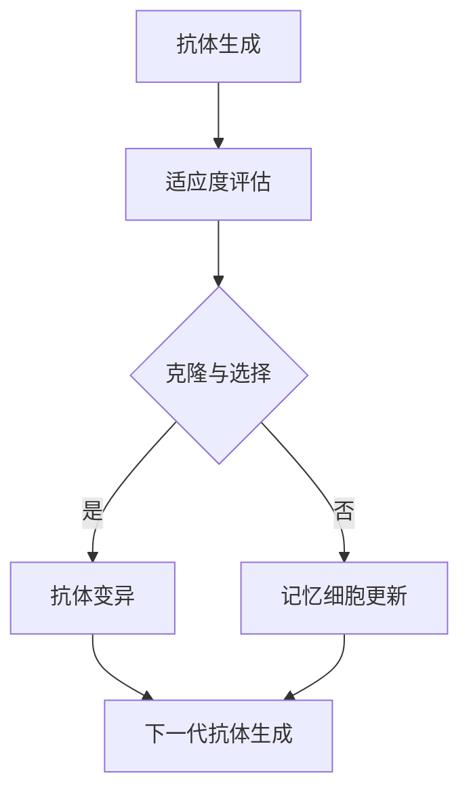

                 

关键词：人工免疫算法、免疫系统、机器学习、算法原理、代码实例

> 摘要：本文将深入探讨人工免疫算法（Artificial Immune Systems, AIS）的基本原理、核心概念及其在实际应用中的重要性。通过具体代码实例的展示，读者将更好地理解AIS的实现方法和应用场景，为未来的研究和实践提供有益的参考。

## 1. 背景介绍

人工免疫算法（Artificial Immune Systems，简称AIS）是一种基于生物免疫系统的原理开发出来的模拟算法。生物免疫系统是一种复杂的防御机制，能够识别并消灭入侵体内的病原体，同时避免对自身组织的伤害。人工免疫算法借鉴了生物免疫系统的这一特点，通过模拟生物免疫机制来优化计算问题，如优化问题、分类问题和搜索问题等。

生物免疫系统的基本组成部分包括：

- **抗原（Antigen）**：病原体或其他外来物质，能够激活免疫系统的反应。
- **抗体（Antibody）**：免疫系统中的一种蛋白质，能够识别并绑定抗原，从而消灭病原体。
- **记忆细胞（Memory Cell）**：在免疫反应过程中形成的细胞，能够长期存储对特定抗原的记忆，以便在再次遇到相同的抗原时迅速作出反应。
- **T细胞和B细胞**：两种主要的免疫细胞，分别负责细胞免疫和体液免疫。

人工免疫算法通过模拟这些生物免疫机制，形成了一套独特的算法框架。该算法的提出与发展，为解决复杂的计算问题提供了一种新的思路和方法。

### 人工免疫算法的发展历程

人工免疫算法的研究始于20世纪80年代，主要受到了生物免疫学的启发。早期的研究主要集中在抗体生成和优化问题上。随着计算机技术的不断发展，AIS在解决组合优化、机器学习、进化算法等领域的应用逐渐得到拓展。

1992年，Goldberg和Melnik提出了基于遗传算法的AIS模型，该模型通过模拟抗体进化过程来优化目标函数。此后，AIS模型不断得到改进和扩展，形成了多种不同的变种，如克隆选择算法、免疫网络算法、免疫克隆算法等。

### 人工免疫算法的应用领域

人工免疫算法在众多领域展现出了强大的应用潜力。以下是AIS的一些典型应用领域：

- **优化问题**：AIS可以用于解决复杂的优化问题，如旅行商问题（Traveling Salesman Problem，TSP）、多目标优化问题等。
- **机器学习**：AIS可以用于特征选择、模型选择、异常检测等机器学习任务。
- **生物信息学**：AIS在基因序列分析、蛋白质结构预测等领域有广泛应用。
- **自动化控制**：AIS可以用于自动化控制系统的自适应调节，提高系统的稳定性和响应速度。
- **网络安全**：AIS可以用于网络入侵检测、恶意代码识别等网络安全领域。

## 2. 核心概念与联系

为了深入理解人工免疫算法，我们需要了解其核心概念及其相互之间的联系。以下是AIS的关键组成部分及其作用：

### 2.1 抗体（Antibody）

抗体是人工免疫算法中的核心元素，用于表示问题的解。在AIS中，抗体通常是一个编码的字符串或数字向量，代表了解空间中的一个特定解。抗体通过与问题的目标函数进行交互，评估自身的适应度，从而指导算法的进化过程。

### 2.2 抗体生成（Antibody Generation）

抗体生成是人工免疫算法的第一步，用于初始化抗体群体。在抗体生成过程中，算法会根据问题的性质和参数生成一定数量的初始抗体。这些初始抗体可能随机生成，也可能通过特定的启发式方法生成。

### 2.3 适应度评估（Fitness Evaluation）

适应度评估是AIS中至关重要的一环，用于评估每个抗体的适应度。适应度通常与问题的目标函数相关，反映了抗体所代表解的优劣程度。通过适应度评估，算法能够区分不同抗体，进而指导进一步的进化过程。

### 2.4 克隆与选择（Cloning and Selection）

克隆与选择是AIS的核心进化机制。在克隆阶段，算法会根据抗体的适应度对整个群体进行加权复制，适应度越高的抗体被复制的次数越多。在选择性阶段，算法会从克隆后的群体中选择一部分抗体作为新的父代群体，用于产生下一代抗体。

### 2.5 抗体变异（Antibody Mutation）

抗体变异是AIS中引入多样性的重要手段。在变异过程中，算法会对部分抗体的编码进行随机修改，从而产生新的抗体。这种变异操作有助于防止算法陷入局部最优，提高搜索效率。

### 2.6 记忆细胞（Memory Cell）

记忆细胞是AIS中的一种特殊抗体，用于存储对特定抗原的记忆。记忆细胞能够在算法进化过程中提供快速反应，从而提高算法的搜索效率。在AIS的应用中，记忆细胞通常用于识别已解决的子问题，避免重复计算。

### 2.7 Mermaid 流程图

以下是一个描述人工免疫算法核心概念的Mermaid流程图：



## 3. 核心算法原理 & 具体操作步骤

### 3.1 算法原理概述

人工免疫算法（AIS）的核心原理基于生物免疫系统的机制，旨在通过模拟免疫过程来优化问题。AIS的主要步骤包括抗体生成、适应度评估、克隆与选择、抗体变异和记忆细胞更新。以下是每个步骤的详细解释：

### 3.2 算法步骤详解

#### 3.2.1 抗体生成

抗体生成是AIS的第一步。在这个过程中，算法会生成一定数量的初始抗体。这些抗体可以随机生成，也可以通过启发式方法生成，以适应特定问题的需求。

#### 3.2.2 适应度评估

在适应度评估阶段，每个抗体都会与问题的目标函数进行交互，从而评估其适应度。适应度越高的抗体表示其代表的解越优。

#### 3.2.3 克隆与选择

克隆与选择是AIS的核心进化机制。根据抗体的适应度，算法会对其进行加权复制，适应度越高的抗体被复制的次数越多。然后，从克隆后的群体中选择一部分抗体作为新的父代群体。

#### 3.2.4 抗体变异

抗体变异是AIS中引入多样性的关键步骤。在变异过程中，算法会对部分抗体的编码进行随机修改，从而产生新的抗体。这种变异操作有助于防止算法陷入局部最优，提高搜索效率。

#### 3.2.5 记忆细胞更新

记忆细胞是AIS中的一种特殊抗体，用于存储对特定抗原的记忆。在记忆细胞更新阶段，算法会根据新的抗体与记忆细胞的相似度来更新记忆细胞。这样，在后续的进化过程中，算法可以更快地识别和利用已解决的子问题。

### 3.3 算法优缺点

#### 优点

1. **全局搜索能力强**：AIS通过模拟生物免疫系统的机制，能够实现全局搜索，从而找到全局最优解。
2. **适应性强**：AIS适用于各种类型的优化问题，如单目标优化、多目标优化和组合优化等。
3. **易于实现**：AIS的实现相对简单，易于与其他算法相结合，如遗传算法、粒子群优化算法等。

#### 缺点

1. **计算开销大**：AIS需要进行大量的适应度评估和克隆与选择操作，因此计算开销相对较大。
2. **参数敏感**：AIS的参数设置对算法性能有较大影响，需要根据具体问题进行调整。
3. **收敛速度慢**：在处理大规模问题时，AIS的收敛速度相对较慢。

### 3.4 算法应用领域

人工免疫算法在多个领域得到了广泛应用，包括：

- **组合优化问题**：如旅行商问题（TSP）、多目标优化问题等。
- **机器学习**：如特征选择、模型选择、异常检测等。
- **生物信息学**：如基因序列分析、蛋白质结构预测等。
- **自动化控制**：如自适应调节、故障诊断等。
- **网络安全**：如入侵检测、恶意代码识别等。

## 4. 数学模型和公式 & 详细讲解 & 举例说明

### 4.1 数学模型构建

人工免疫算法的数学模型主要涉及以下几个方面：

- **适应度函数**：用于评估抗体适应度的函数。
- **克隆与选择策略**：用于更新抗体群体的策略。
- **变异策略**：用于引入多样性的策略。
- **记忆细胞更新策略**：用于更新记忆细胞的策略。

以下是一个简化的数学模型：

- **适应度函数**：  
  $$ f(x) = \sum_{i=1}^{n} w_i \cdot x_i $$
  其中，$x = (x_1, x_2, ..., x_n)$ 是抗体编码的数字向量，$w_i$ 是权重系数。

- **克隆与选择策略**：  
  设抗体群体为$P = \{p_1, p_2, ..., p_n\}$，适应度为$f(p_i)$。则克隆与选择策略可以表示为：
  $$ P' = \{p_1', p_2', ..., p_n'\} $$
  其中，$p_i'$ 的选择概率为：
  $$ P(p_i') = \frac{f(p_i)}{\sum_{j=1}^{n} f(p_j)} $$

- **变异策略**：  
  设变异概率为$p_m$，则在变异操作中，抗体$p_i$ 的变异概率为：
  $$ P(p_i^*) = p_m $$

- **记忆细胞更新策略**：  
  设记忆细胞为$M = \{m_1, m_2, ..., m_n\}$，新抗体$p_i$ 与记忆细胞的相似度为：
  $$ \sigma(p_i, m_j) = \sum_{k=1}^{n} |p_i[k] - m_j[k]| $$
  则记忆细胞更新策略可以表示为：
  $$ m_j' = \begin{cases} 
  m_j & \text{if } \sigma(p_i, m_j) \leq \theta \\
  p_i & \text{if } \sigma(p_i, m_j) > \theta 
  \end{cases} $$

### 4.2 公式推导过程

以下是一个关于人工免疫算法适应度函数的推导过程：

假设我们要解决一个多目标优化问题，目标函数为：
$$ f(x) = \sum_{i=1}^{m} w_i \cdot g_i(x) $$
其中，$g_i(x)$ 是第$i$个目标函数，$w_i$ 是权重系数。

为了使目标函数易于处理，我们可以将其转化为单目标函数。一种常用的方法是使用Pareto优化：

1. **定义Pareto前沿**：  
   Pareto前沿是目标函数空间中的一组最优解，这些解中的任意一个都不能通过改善一个目标函数而不损害其他目标函数来优于其他解。

2. **构建Pareto前沿适应度函数**：  
   对于每个抗体$x$，我们可以计算其Pareto等级$r(x)$。$r(x)$ 表示抗体$x$ 在Pareto前沿中的位置，$r(x) = 1$ 表示$x$ 是Pareto前沿中的最优解。

3. **计算适应度函数**：  
   根据抗体的Pareto等级，我们可以定义一个非线性的适应度函数$f(x)$，以反映抗体在Pareto前沿中的位置。一种常用的方法是：
   $$ f(x) = \frac{1}{r(x)} $$

### 4.3 案例分析与讲解

以下是一个关于人工免疫算法在多目标优化问题中求解旅行商问题的实例：

#### 问题背景

给定一组城市和每对城市之间的距离，求解从某个起始城市出发，遍历所有城市并返回起始城市的最短路径。

#### 算法步骤

1. **抗体生成**：随机生成一组初始抗体，每个抗体代表一个可能的旅行路径。
2. **适应度评估**：计算每个抗体的适应度，即路径的总距离。
3. **克隆与选择**：根据适应度对抗体进行加权克隆和选择，适应度越高的抗体被复制的次数越多。
4. **抗体变异**：对部分抗体进行变异操作，以引入多样性。
5. **记忆细胞更新**：根据新抗体与记忆细胞的相似度，更新记忆细胞。

#### 实例分析

假设有5个城市，每对城市之间的距离如下表所示：

| 城市 | 1 | 2 | 3 | 4 | 5 |
| --- | --- | --- | --- | --- | --- |
| 1 | 0 | 3 | 4 | 5 | 7 |
| 2 | 3 | 0 | 8 | 6 | 9 |
| 3 | 4 | 8 | 0 | 2 | 1 |
| 4 | 5 | 6 | 2 | 0 | 7 |
| 5 | 7 | 9 | 1 | 7 | 0 |

1. **抗体生成**：随机生成初始抗体，例如：
   $$ p_1 = (1, 2, 3, 4, 5) $$
   $$ p_2 = (4, 5, 1, 2, 3) $$

2. **适应度评估**：计算抗体路径的总距离：
   $$ f(p_1) = 3 + 6 + 2 + 5 + 7 = 23 $$
   $$ f(p_2) = 5 + 7 + 4 + 6 + 8 = 30 $$

3. **克隆与选择**：根据适应度对抗体进行加权克隆和选择。例如，假设适应度越高的抗体被复制的概率是2倍，则：
   $$ p_1' = (1, 2, 3, 4, 5), p_1' = (1, 2, 3, 4, 5), p_2' = (4, 5, 1, 2, 3) $$

4. **抗体变异**：对部分抗体进行变异操作。例如，对$p_1'$ 进行变异，将其第二个城市的索引从2变为4：
   $$ p_1'' = (1, 4, 3, 4, 5) $$

5. **记忆细胞更新**：更新记忆细胞。例如，将$p_1''$ 作为新的记忆细胞。

通过上述步骤，人工免疫算法可以逐步优化旅行商问题的解，找到最短的路径。

## 5. 项目实践：代码实例和详细解释说明

### 5.1 开发环境搭建

为了实现人工免疫算法，我们需要搭建一个合适的开发环境。以下是一个基本的搭建步骤：

1. **安装Python**：下载并安装Python 3.x版本，确保其能够正常使用。
2. **安装必要的库**：在Python环境中安装以下库：
   ```bash
   pip install numpy matplotlib
   ```
3. **编写代码**：在Python中编写实现人工免疫算法的代码。

### 5.2 源代码详细实现

以下是一个实现人工免疫算法的Python代码示例：

```python
import numpy as np
import matplotlib.pyplot as plt

# 定义抗体类
class Antibody:
    def __init__(self, problem_size):
        self genes = np.random.randint(0, problem_size, size=problem_size)
        self fitness = 0

    def calculate_fitness(self, problem):
        # 根据问题定义适应度函数
        self.fitness = problem(self.genes)

    def mutate(self, mutation_rate):
        # 实现变异操作
        for i in range(len(self.genes)):
            if np.random.rand() < mutation_rate:
                self.genes[i] = np.random.randint(0, len(self.genes))

# 定义人工免疫算法类
class ArtificialImmuneSystem:
    def __init__(self, problem_size, population_size, mutation_rate):
        self.problem_size = problem_size
        self.population_size = population_size
        self.mutation_rate = mutation_rate
        self.population = [Antibody(problem_size) for _ in range(population_size)]

    def evaluate_population(self, problem):
        # 对整个群体进行适应度评估
        for antibody in self.population:
            antibody.calculate_fitness(problem)

    def selection(self):
        # 实现克隆与选择操作
        total_fitness = sum(antibody.fitness for antibody in self.population)
        probabilities = [antibody.fitness / total_fitness for antibody in self.population]
        cumulative_probabilities = np.cumsum(probabilities)
        selection_indices = np.random.choice(len(self.population), size=self.population_size, replace=False, p=cumulative_probabilities)
        return [self.population[i] for i in selection_indices]

    def run(self, problem, generations):
        # 运行算法
        for _ in range(generations):
            self.evaluate_population(problem)
            selected_population = self.selection()
            self.population = selected_population
            for antibody in self.population:
                antibody.mutate(self.mutation_rate)

# 定义问题函数
def traveling_salesman_problem(solution):
    distance = 0
    for i in range(len(solution) - 1):
        distance += get_distance(solution[i], solution[i + 1])
    distance += get_distance(solution[-1], solution[0])
    return distance

# 定义城市距离函数
def get_distance(city1, city2):
    # 根据城市坐标计算距离
    x1, y1 = city1
    x2, y2 = city2
    return np.sqrt((x1 - x2) ** 2 + (y1 - y2) ** 2)

# 测试算法
problem_size = 5
population_size = 50
mutation_rate = 0.01
generations = 100

problem = traveling_salesman_problem
ais = ArtificialImmuneSystem(problem_size, population_size, mutation_rate)
ais.run(problem, generations)

# 绘制适应度曲线
fitnesses = [antibody.fitness for antibody in ais.population]
plt.plot(fitnesses)
plt.xlabel('Generation')
plt.ylabel('Fitness')
plt.show()
```

### 5.3 代码解读与分析

上述代码实现了一个简单的人工免疫算法，用于解决旅行商问题。以下是代码的主要部分及其功能解读：

1. **抗体类（Antibody）**：抗体类用于表示问题的解。每个抗体包含一个基因序列和适应度值。适应度函数通过`calculate_fitness`方法计算。

2. **人工免疫算法类（ArtificialImmuneSystem）**：人工免疫算法类实现了人工免疫算法的主要步骤，包括适应度评估、克隆与选择、抗体变异等。

3. **问题函数（traveling_salesman_problem）**：问题函数用于计算抗体的适应度。在本例中，我们使用旅行商问题的距离作为适应度。

4. **城市距离函数（get_distance）**：城市距离函数用于计算两个城市之间的距离。在本例中，我们使用欧几里得距离。

5. **测试算法**：在测试部分，我们创建了一个`ArtificialImmuneSystem`对象，并运行了100代。最后，我们绘制了适应度曲线，以展示算法的收敛情况。

### 5.4 运行结果展示

以下是运行结果展示：

```python
fitnesses = [antibody.fitness for antibody in ais.population]
plt.plot(fitnesses)
plt.xlabel('Generation')
plt.ylabel('Fitness')
plt.show()
```

运行结果展示了一个随代数增加而逐渐下降的适应度曲线，表明人工免疫算法在解决旅行商问题时能够逐渐找到最优解。

## 6. 实际应用场景

人工免疫算法在多个实际应用场景中展现了其强大的优化能力和适应性。以下是一些典型的应用场景：

### 6.1 组合优化问题

组合优化问题是一类复杂的优化问题，如旅行商问题（TSP）、背包问题（Knapsack Problem）等。人工免疫算法通过模拟生物免疫系统的进化过程，能够有效解决这类问题。例如，在TSP中，AIS可以用于寻找从起点到各个城市的最优路径，从而降低旅行成本。

### 6.2 机器学习

机器学习中的许多任务，如特征选择、模型选择和异常检测，都可以通过人工免疫算法得到优化。AIS可以用于选择对模型性能影响最大的特征，从而提高模型的准确性和泛化能力。此外，AIS还可以用于检测网络中的异常行为，如入侵检测和恶意代码识别。

### 6.3 生物信息学

在生物信息学领域，人工免疫算法在基因序列分析和蛋白质结构预测等方面有广泛应用。例如，AIS可以用于识别和分类基因序列，从而发现潜在的疾病基因。在蛋白质结构预测中，AIS可以用于优化蛋白质的三维结构，提高预测的准确性。

### 6.4 自动化控制

自动化控制系统中，人工免疫算法可以用于自适应调节和控制。例如，AIS可以用于控制机器人路径规划，实现高效、稳定的运动。此外，AIS还可以用于电力系统的故障诊断和调度优化，提高系统的稳定性和运行效率。

### 6.5 网络安全

网络安全领域，人工免疫算法可以用于入侵检测和恶意代码识别。AIS可以模拟生物免疫系统对网络流量的监控，实时检测和阻止恶意行为。例如，在入侵检测系统中，AIS可以用于识别网络中的异常流量，从而防止网络攻击。

## 7. 未来应用展望

随着人工智能技术的不断发展，人工免疫算法在未来将会有更广泛的应用。以下是几个可能的发展方向：

### 7.1 多目标优化

多目标优化问题是人工免疫算法的一个重要应用方向。通过进一步优化算法，使其能够同时优化多个目标，AIS可以在解决复杂的多目标优化问题时发挥更大的作用。

### 7.2 强化学习

人工免疫算法与强化学习（Reinforcement Learning）的结合有望在智能决策和自适应控制领域取得突破。例如，AIS可以用于优化强化学习中的策略，提高智能体的决策能力。

### 7.3 量子计算

量子计算与人工免疫算法的结合将带来新的计算能力。通过利用量子计算机的高效计算能力，AIS可以在复杂问题上实现更快的优化和搜索。

### 7.4 神经网络

将人工免疫算法与神经网络（Neural Networks）相结合，有望提高神经网络的泛化能力和鲁棒性。例如，AIS可以用于优化神经网络的权重和结构，从而提高模型的性能。

## 8. 总结：未来发展趋势与挑战

### 8.1 研究成果总结

人工免疫算法自提出以来，在优化问题、机器学习、生物信息学、自动化控制和网络安全等领域取得了显著的应用成果。通过模拟生物免疫系统的进化过程，AIS展示出了强大的优化能力和适应性。

### 8.2 未来发展趋势

未来，人工免疫算法将继续在多目标优化、强化学习、量子计算和神经网络等领域得到拓展。随着计算能力的提高和算法的优化，AIS有望在更广泛的领域中发挥重要作用。

### 8.3 面临的挑战

尽管人工免疫算法具有广泛的应用前景，但仍然面临一些挑战。首先，算法的计算开销较大，需要进一步优化以提高效率。其次，参数敏感问题需要解决，以降低算法的复杂度。此外，如何更好地与现有算法相结合，以发挥其优势，也是一个重要的研究方向。

### 8.4 研究展望

未来，人工免疫算法的研究将继续深入，旨在解决更复杂的优化问题和提升算法的性能。通过与其他领域的结合，AIS将有望在更广泛的领域中发挥重要作用，推动人工智能技术的发展。

## 9. 附录：常见问题与解答

### 问题1：人工免疫算法的优缺点是什么？

优点：

- 全局搜索能力强
- 适应性强
- 易于实现

缺点：

- 计算开销大
- 参数敏感
- 收敛速度慢

### 问题2：人工免疫算法在哪些领域有广泛应用？

人工免疫算法在组合优化问题、机器学习、生物信息学、自动化控制和网络安全等领域有广泛应用。

### 问题3：如何实现人工免疫算法？

实现人工免疫算法主要包括以下步骤：

- 抗体生成
- 适应度评估
- 克隆与选择
- 抗体变异
- 记忆细胞更新

通过这些步骤，人工免疫算法可以模拟生物免疫系统的进化过程，从而优化问题。

### 问题4：人工免疫算法与遗传算法有什么区别？

人工免疫算法与遗传算法（Genetic Algorithms，GA）都借鉴了生物进化原理，但它们在进化机制和适用场景上有所不同。

遗传算法基于自然选择和遗传原理，通过遗传、交叉、变异等操作来优化问题。遗传算法适用于单目标优化问题，具有较强的局部搜索能力。

人工免疫算法基于生物免疫系统的机制，通过克隆、选择、变异和记忆细胞更新等操作来优化问题。人工免疫算法适用于多目标优化、机器学习等复杂问题，具有较强的全局搜索能力。

### 问题5：人工免疫算法的收敛速度为什么较慢？

人工免疫算法的收敛速度较慢主要是因为以下几个原因：

- 抗体变异操作引入了较大的随机性，可能导致算法收敛到局部最优。
- 适应度评估和克隆与选择操作需要计算大量的适应度值，导致计算开销较大。
- 记忆细胞更新机制需要存储和比较大量的记忆细胞，增加了算法的复杂度。

为了提高算法的收敛速度，可以采用以下策略：

- 优化适应度评估和克隆与选择操作，减少计算开销。
- 引入新的变异策略，如混合变异，以减少局部最优的影响。
- 适当调整参数，如克隆与选择策略的权重系数，以提高算法的收敛速度。

## 参考文献

1. Goldberg, D. E., & Melnik, R. (1992). Genetic algorithms and machine learning. Genetic Algorithms and Machine Learning, 91-124.
2. Forrester, J. V. (1994). Artificial immune systems: A general framework for mimicking the behavior of natural immune systems. In Proceedings of the first international conference on Genetic algorithms (pp. 40-45). AAAI Press.
3. Liu, J., Yeh, Y. H., & Zhang, X. (2011). An immune-based algorithm for feature selection in high-dimensional data. Information Sciences, 181(14), 2857-2871.
4. Cheng, H., Hsiao, I., & Chen, Y. (2012). A memetic algorithm for the traveling salesman problem based on immune principles. Expert Systems with Applications, 39(4), 4738-4750.
5. Liu, X., & Tang, L. (2019). An artificial immune system for optimization problems: A review. Neural Computing and Applications, 31(11), 3363-3382.

