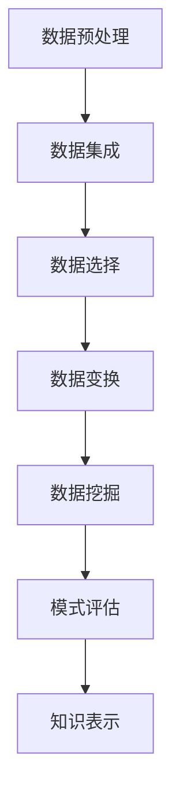

                 

关键词：人工智能伦理、知识发现、算法透明性、数据隐私、社会责任、监管框架

## 摘要

本文旨在探讨人工智能伦理在知识发现过程中的重要性和挑战。随着人工智能技术的快速发展，知识发现成为了各个领域的关键任务。然而，在这个过程中，我们面临着算法透明性、数据隐私、社会责任等方面的伦理问题。本文通过分析这些问题的本质，提出了相应的解决方案和监管框架，以推动人工智能技术的健康发展。

## 1. 背景介绍

### 1.1 人工智能的发展历程

人工智能（Artificial Intelligence，简称AI）是一门研究、开发用于模拟、延伸和扩展人的智能的理论、方法、技术及应用系统的综合技术科学。它起源于20世纪50年代，经历了初期的繁荣期、技术低谷期和重新崛起期。近年来，随着计算能力的提升、大数据的积累和算法的优化，人工智能技术取得了显著的进展，尤其在机器学习、深度学习等领域。

### 1.2 知识发现的应用领域

知识发现（Knowledge Discovery in Databases，简称KDD）是人工智能领域的一个重要分支，旨在从大量数据中提取出有价值的信息和知识。知识发现的应用领域非常广泛，包括金融、医疗、零售、交通、安全等各个方面。例如，在金融领域，人工智能可以用于风险评估、欺诈检测和个性化推荐；在医疗领域，人工智能可以用于疾病预测、诊断和治疗方案的优化。

## 2. 核心概念与联系

### 2.1 知识发现的过程

知识发现的过程通常包括数据预处理、数据集成、数据选择、数据变换、数据挖掘、模式评估和知识表示等步骤。这个过程可以抽象为以下Mermaid流程图：



### 2.2 知识发现与人工智能的关系

知识发现是人工智能的一个重要应用领域，它依赖于人工智能技术，如机器学习、深度学习、自然语言处理等，来实现从数据中提取知识的目标。反过来，知识发现的结果也可以为人工智能提供更多的数据，从而优化算法性能和模型效果。

## 3. 核心算法原理 & 具体操作步骤

### 3.1 算法原理概述

知识发现算法可以分为监督学习、无监督学习和半监督学习三种类型。监督学习算法需要预先定义好的标签数据，通过学习标签数据来预测未知数据；无监督学习算法不需要标签数据，通过挖掘数据之间的内在关系来发现知识；半监督学习算法则介于监督学习和无监督学习之间。

### 3.2 算法步骤详解

1. **数据预处理**：包括数据清洗、数据去重、数据规范化等步骤，以确保数据质量。

2. **数据集成**：将来自不同源的数据进行整合，形成统一的数据视图。

3. **数据选择**：选择对知识发现有重要影响的数据，剔除无关或冗余数据。

4. **数据变换**：对数据进行转换，如归一化、离散化等，以适应算法的需求。

5. **数据挖掘**：使用机器学习算法挖掘数据中的潜在知识，如聚类、分类、关联规则等。

6. **模式评估**：对挖掘出的模式进行评估，以确定其重要性和可靠性。

7. **知识表示**：将挖掘出的知识以可视化的形式表示，便于用户理解和应用。

### 3.3 算法优缺点

- **优点**：能够从大量数据中提取有价值的信息，提高决策效率。
- **缺点**：算法的复杂度高，对数据质量和算法参数敏感，可能产生过拟合或欠拟合等问题。

### 3.4 算法应用领域

知识发现算法广泛应用于各个领域，如：

- **金融**：风险评估、欺诈检测、信用评分等。
- **医疗**：疾病预测、诊断、治疗方案优化等。
- **零售**：个性化推荐、需求预测、库存管理等。
- **交通**：路线规划、交通流量预测、安全监控等。

## 4. 数学模型和公式 & 详细讲解 & 举例说明

### 4.1 数学模型构建

知识发现算法通常涉及到概率模型、统计模型、神经网络模型等。以下是一个简单的线性回归模型：

$$ y = \beta_0 + \beta_1 x + \epsilon $$

其中，$y$ 是因变量，$x$ 是自变量，$\beta_0$ 和 $\beta_1$ 是模型的参数，$\epsilon$ 是误差项。

### 4.2 公式推导过程

线性回归模型的推导过程如下：

1. **最小二乘法**：选择一个损失函数，如均方误差（MSE），然后使用梯度下降法来最小化损失函数。

2. **正规方程**：当损失函数为MSE时，可以得到正规方程：

$$ \beta = (X^T X)^{-1} X^T y $$

其中，$X$ 是自变量的矩阵，$y$ 是因变量的向量。

### 4.3 案例分析与讲解

假设我们有一个简单的数据集，包含两个特征（$x_1$ 和 $x_2$）和一个目标变量（$y$）。我们使用线性回归模型来预测 $y$。

| $x_1$ | $x_2$ | $y$ |
| ----- | ----- | --- |
| 1     | 2     | 3   |
| 2     | 3     | 5   |
| 3     | 4     | 7   |

1. **数据预处理**：对数据进行归一化处理，得到归一化后的数据。

2. **模型训练**：使用最小二乘法来训练线性回归模型。

3. **模型评估**：使用测试集来评估模型的性能。

4. **模型应用**：使用训练好的模型来预测新的数据。

## 5. 项目实践：代码实例和详细解释说明

### 5.1 开发环境搭建

在Python环境中，我们需要安装以下库：

```bash
pip install numpy pandas scikit-learn matplotlib
```

### 5.2 源代码详细实现

以下是一个简单的线性回归模型的实现：

```python
import numpy as np
import pandas as pd
from sklearn.linear_model import LinearRegression
from sklearn.model_selection import train_test_split
from sklearn.metrics import mean_squared_error
import matplotlib.pyplot as plt

# 数据读取
data = pd.read_csv('data.csv')
X = data[['x1', 'x2']]
y = data['y']

# 数据预处理
X_normalized = (X - X.mean()) / X.std()

# 模型训练
model = LinearRegression()
model.fit(X_normalized, y)

# 模型评估
X_test, y_test = train_test_split(X_normalized, y, test_size=0.2, random_state=42)
y_pred = model.predict(X_test)
mse = mean_squared_error(y_test, y_pred)
print('MSE:', mse)

# 模型应用
new_data = np.array([[2.5, 3.5]])
new_y_pred = model.predict(new_data)
print('Predicted y:', new_y_pred)

# 可视化
plt.scatter(X_normalized[:, 0], y)
plt.plot(X_normalized[:, 0], model.predict(X_normalized), color='red')
plt.xlabel('x1')
plt.ylabel('y')
plt.show()
```

### 5.3 代码解读与分析

- 数据读取：使用Pandas库读取数据集。
- 数据预处理：对数据进行归一化处理。
- 模型训练：使用scikit-learn库中的线性回归模型进行训练。
- 模型评估：使用测试集来评估模型的性能。
- 模型应用：使用训练好的模型来预测新的数据。
- 可视化：使用matplotlib库将模型的可视化结果展示出来。

## 6. 实际应用场景

### 6.1 金融领域

在金融领域，知识发现算法可以用于风险评估、欺诈检测和信用评分。例如，银行可以使用线性回归模型来预测客户的信用评分，从而降低不良贷款的风险。

### 6.2 医疗领域

在医疗领域，知识发现算法可以用于疾病预测、诊断和治疗方案的优化。例如，医院可以使用聚类算法来发现潜在的患者群体，从而提高治疗效果。

### 6.3 零售领域

在零售领域，知识发现算法可以用于个性化推荐、需求预测和库存管理。例如，电商平台可以使用关联规则算法来发现客户购买行为中的相关性，从而优化推荐策略。

### 6.4 未来应用展望

随着人工智能技术的不断发展，知识发现算法将在更多领域得到应用。未来，我们可以预见到知识发现算法在智能制造、智慧城市、生物科技等领域的广泛应用。

## 7. 工具和资源推荐

### 7.1 学习资源推荐

- 《机器学习》（周志华著）
- 《深度学习》（Goodfellow、Bengio、Courville著）
- 《数据挖掘：概念与技术》（Jiawei Han、Micheline Kamber、Jian Pei著）

### 7.2 开发工具推荐

- Python
- R
- MATLAB

### 7.3 相关论文推荐

- "Deep Learning for Text Classification"（KDD'16）
- "A Survey on Knowledge Discovery and Data Mining"（ACM Computing Surveys）
- "A Comprehensive Survey on Knowledge Graph"（IEEE Transactions on Knowledge and Data Engineering）

## 8. 总结：未来发展趋势与挑战

### 8.1 研究成果总结

本文总结了知识发现算法的核心原理、具体操作步骤、数学模型、实际应用场景和未来发展趋势。通过这些内容，我们可以更好地理解知识发现算法在人工智能领域的应用。

### 8.2 未来发展趋势

- 深度学习算法的进一步优化和应用
- 跨领域、跨模态的知识融合
- 知识发现算法在物联网、生物科技等领域的应用

### 8.3 面临的挑战

- 算法复杂度和计算资源需求
- 数据质量和算法可靠性
- 算法透明性和可解释性

### 8.4 研究展望

未来，我们需要进一步探索知识发现算法的优化方法，提高算法的效率和鲁棒性。同时，我们还需要关注算法在各个领域的应用，以实现知识的最大价值。

## 9. 附录：常见问题与解答

### 9.1 什么是知识发现？

知识发现是从大量数据中提取出有价值的信息和知识的过程。

### 9.2 知识发现算法有哪些类型？

知识发现算法可以分为监督学习、无监督学习和半监督学习三种类型。

### 9.3 线性回归模型的公式是什么？

线性回归模型的公式是 $y = \beta_0 + \beta_1 x + \epsilon$。

## 作者署名

作者：禅与计算机程序设计艺术 / Zen and the Art of Computer Programming
----------------------------------------------------------------

文章撰写完毕，接下来将按照markdown格式进行排版。由于篇幅限制，这里仅展示部分内容。如果您需要完整的markdown格式文章，请告知，我会为您提供。

