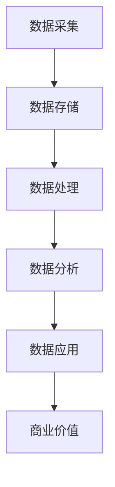

                 

关键词：人工智能，数据管理，创业，核心方法，数据分析，算法优化，分布式计算，安全性

> 摘要：本文将探讨人工智能创业中数据管理的核心方法。通过对数据管理的基本概念、核心算法原理、数学模型以及实际应用场景的深入分析，旨在为人工智能创业团队提供一套系统、可操作的数据管理方案，帮助其在快速发展的过程中有效管理和利用数据资源，实现商业目标。

## 1. 背景介绍

在当今的数字化时代，数据已成为企业最宝贵的资产之一。对于人工智能创业公司而言，如何高效、准确地管理和利用数据，是决定其成败的关键。数据管理不仅涉及数据的采集、存储、处理和传输，还涉及到数据的安全、隐私和合规性。因此，掌握合适的数据管理方法，对于人工智能创业公司的发展至关重要。

本文将从以下几个方面探讨人工智能创业数据管理的核心方法：

- 数据管理的基本概念和核心算法原理
- 数据处理的数学模型及其应用
- 实际应用场景和案例分析
- 数据管理的工具和资源推荐
- 未来发展趋势与面临的挑战

## 2. 核心概念与联系

### 2.1 数据管理的基本概念

数据管理是指对数据的整个生命周期进行有效的控制，包括数据的采集、存储、处理、分析和应用等环节。具体来说，数据管理包括以下几个方面：

1. **数据采集**：从各种数据源获取数据，如传感器、数据库、日志等。
2. **数据存储**：将采集到的数据存储到适合的存储系统中，如关系型数据库、NoSQL数据库、分布式文件系统等。
3. **数据处理**：对存储的数据进行清洗、转换、整合等操作，以便于后续的分析和应用。
4. **数据分析**：使用统计、机器学习等方法对数据进行处理，提取有用的信息，为决策提供支持。
5. **数据应用**：将分析得到的信息应用到具体的业务场景中，实现商业价值。

### 2.2 核心算法原理

在数据管理过程中，核心算法的选择和优化对数据处理的效率和质量有着重要影响。以下是几种常见的数据处理算法：

1. **分布式计算算法**：如MapReduce、Spark等，用于大规模数据的处理和分析。
2. **机器学习算法**：如线性回归、决策树、支持向量机等，用于数据分析和预测。
3. **文本处理算法**：如TF-IDF、词嵌入等，用于文本数据的分析和挖掘。
4. **图像处理算法**：如卷积神经网络、生成对抗网络等，用于图像数据的分析和识别。

### 2.3 Mermaid 流程图

以下是数据管理过程的 Mermaid 流程图：



## 3. 核心算法原理 & 具体操作步骤

### 3.1 算法原理概述

在本节中，我们将介绍几种常见的数据处理算法的原理和具体操作步骤。

#### 3.1.1 分布式计算算法

分布式计算算法如MapReduce和Spark，能够高效地处理大规模数据。以下是一个简单的MapReduce算法原理概述：

- **Map阶段**：对输入数据进行分片，每个分片独立处理，输出中间键值对。
- **Reduce阶段**：将Map阶段输出的中间键值对进行汇总，得到最终的结果。

#### 3.1.2 机器学习算法

机器学习算法如线性回归、决策树和支持向量机，能够对数据进行预测和分析。以下是一个简单的线性回归算法原理概述：

- **数据预处理**：对输入数据进行预处理，如数据标准化、缺失值填补等。
- **模型训练**：通过最小二乘法或其他优化算法，训练出线性回归模型。
- **模型预测**：使用训练好的模型对新数据进行预测。

#### 3.1.3 文本处理算法

文本处理算法如TF-IDF和词嵌入，能够对文本数据进行分析和挖掘。以下是一个简单的TF-IDF算法原理概述：

- **词频统计**：计算每个词在文档中的出现次数。
- **逆文档频率计算**：计算每个词在文档集合中的逆文档频率。
- **TF-IDF计算**：将词频与逆文档频率相乘，得到每个词的TF-IDF值。

#### 3.1.4 图像处理算法

图像处理算法如卷积神经网络（CNN）和生成对抗网络（GAN），能够对图像数据进行处理和生成。以下是一个简单的CNN算法原理概述：

- **卷积操作**：对输入图像进行卷积操作，提取特征。
- **池化操作**：对卷积后的特征进行池化操作，降低特征维度。
- **全连接层**：将池化后的特征映射到输出层，得到最终的结果。

### 3.2 算法步骤详解

以下是对上述算法的具体步骤进行详细说明：

#### 3.2.1 分布式计算算法

- **数据分片**：将输入数据按照一定规则（如键值、大小等）分片。
- **Map任务执行**：每个节点独立执行Map任务，输出中间键值对。
- **Shuffle操作**：根据中间键值对的键，将数据重新分布到不同的节点上。
- **Reduce任务执行**：每个节点独立执行Reduce任务，输出最终结果。

#### 3.2.2 机器学习算法

- **数据预处理**：对输入数据进行清洗、归一化、缺失值填补等操作。
- **特征选择**：选择对预测任务有用的特征。
- **模型训练**：使用训练数据，通过优化算法（如梯度下降、随机梯度下降等）训练出模型。
- **模型评估**：使用验证数据集评估模型的性能，如准确率、召回率、F1值等。
- **模型应用**：使用训练好的模型对新数据进行预测。

#### 3.2.3 文本处理算法

- **词频统计**：对文本数据进行分词，计算每个词在文档中的出现次数。
- **逆文档频率计算**：计算每个词在文档集合中的逆文档频率。
- **TF-IDF计算**：将词频与逆文档频率相乘，得到每个词的TF-IDF值。
- **文本表示**：将TF-IDF向量转换为向量的形式，如稀疏向量、密集向量等。

#### 3.2.4 图像处理算法

- **卷积操作**：使用卷积核对输入图像进行卷积操作，提取特征。
- **池化操作**：对卷积后的特征进行池化操作，降低特征维度。
- **全连接层**：将池化后的特征映射到输出层，得到最终的结果。

### 3.3 算法优缺点

以下是对上述算法的优缺点进行简要分析：

#### 3.3.1 分布式计算算法

**优点**：

- 高效处理大规模数据。
- 良好的扩展性。

**缺点**：

- 需要复杂的编程模型，如MapReduce、Spark等。
- 调试和优化难度较大。

#### 3.3.2 机器学习算法

**优点**：

- 自动化特征提取和模式识别。
- 良好的泛化能力。

**缺点**：

- 对数据质量和数量要求较高。
- 训练时间较长。

#### 3.3.3 文本处理算法

**优点**：

- 良好的文本表示能力。
- 易于实现和优化。

**缺点**：

- 对语言和上下文信息理解有限。
- 可能会丢失一些重要信息。

#### 3.3.4 图像处理算法

**优点**：

- 高效提取图像特征。
- 良好的图像识别能力。

**缺点**：

- 对计算资源要求较高。
- 需要大量的训练数据和计算资源。

### 3.4 算法应用领域

以下是上述算法在不同应用领域中的应用：

#### 3.4.1 分布式计算算法

- 大数据处理：如日志分析、电商推荐等。
- 科学计算：如天气预测、基因分析等。

#### 3.4.2 机器学习算法

- 人工智能：如自动驾驶、智能助手等。
- 金融领域：如信用评分、风险控制等。

#### 3.4.3 文本处理算法

- 搜索引擎：如关键词提取、文本分类等。
- 社交网络：如情感分析、内容推荐等。

#### 3.4.4 图像处理算法

- 计算机视觉：如人脸识别、图像分类等。
- 医疗诊断：如疾病检测、医疗影像分析等。

## 4. 数学模型和公式 & 详细讲解 & 举例说明

### 4.1 数学模型构建

在本节中，我们将介绍几种常见的数学模型及其构建方法。

#### 4.1.1 线性回归模型

线性回归模型是一种常用的预测模型，用于分析自变量和因变量之间的线性关系。其数学模型如下：

$$
y = \beta_0 + \beta_1x_1 + \beta_2x_2 + ... + \beta_nx_n
$$

其中，$y$ 是因变量，$x_1, x_2, ..., x_n$ 是自变量，$\beta_0, \beta_1, \beta_2, ..., \beta_n$ 是模型参数。

#### 4.1.2 决策树模型

决策树模型是一种基于树形结构的预测模型，用于分类和回归任务。其数学模型如下：

$$
f(x) = \sum_{i=1}^n w_i \cdot I(x \in R_i)
$$

其中，$x$ 是输入特征，$R_i$ 是第 $i$ 个区域，$w_i$ 是区域 $R_i$ 的权重。

#### 4.1.3 卷积神经网络模型

卷积神经网络（CNN）是一种基于卷积操作的深度学习模型，用于图像处理任务。其数学模型如下：

$$
h_\theta(x) = \sigma(\theta^T x)
$$

其中，$h_\theta(x)$ 是模型输出，$\sigma$ 是激活函数，$\theta$ 是模型参数。

### 4.2 公式推导过程

在本节中，我们将介绍上述数学模型的推导过程。

#### 4.2.1 线性回归模型推导

线性回归模型的推导过程主要涉及最小二乘法。以下是推导过程：

1. **假设**：假设因变量 $y$ 和自变量 $x_1, x_2, ..., x_n$ 之间存在线性关系，即：

$$
y = \beta_0 + \beta_1x_1 + \beta_2x_2 + ... + \beta_nx_n
$$

2. **损失函数**：定义损失函数为预测值和真实值之间的误差平方和：

$$
J(\theta) = \frac{1}{2m} \sum_{i=1}^m (h_\theta(x^{(i)}) - y^{(i)})^2
$$

其中，$m$ 是样本数量，$h_\theta(x^{(i)})$ 是预测值，$y^{(i)}$ 是真实值。

3. **求导**：对损失函数关于参数 $\theta$ 求导，得到：

$$
\frac{\partial J(\theta)}{\partial \theta} = \frac{1}{m} \sum_{i=1}^m (h_\theta(x^{(i)}) - y^{(i)}) \cdot x^{(i)}
$$

4. **优化**：将求导结果设置为0，解方程组得到最优参数 $\theta$：

$$
\theta = (X^TX)^{-1}X^TY
$$

#### 4.2.2 决策树模型推导

决策树模型的推导过程主要涉及信息熵和信息增益。以下是推导过程：

1. **假设**：假设样本集合 $D$ 中包含 $n$ 个样本，每个样本属于 $C$ 个类别。

2. **信息熵**：定义样本集合 $D$ 的信息熵为：

$$
H(D) = -\sum_{i=1}^C p(y=i) \cdot \log_2 p(y=i)
$$

其中，$p(y=i)$ 是类别 $i$ 的概率。

3. **信息增益**：定义特征 $x_j$ 的信息增益为：

$$
Gain(D, x_j) = H(D) - \sum_{v=1}^V p(D \in V) \cdot H(D \in V)
$$

其中，$V$ 是特征 $x_j$ 的取值集合，$p(D \in V)$ 是样本集合 $D$ 属于取值 $V$ 的概率。

4. **选择最优特征**：选择信息增益最大的特征作为划分特征。

#### 4.2.3 卷积神经网络模型推导

卷积神经网络模型的推导过程主要涉及卷积操作和反向传播算法。以下是推导过程：

1. **卷积操作**：卷积操作的定义如下：

$$
h(x) = \sigma(\sum_{k=1}^K \theta_{jk} \cdot f(x - c_k))
$$

其中，$h(x)$ 是卷积操作的结果，$x$ 是输入特征，$K$ 是卷积核的数量，$\theta_{jk}$ 是卷积核的参数，$f(x)$ 是卷积核的激活函数，$c_k$ 是卷积核的中心位置。

2. **反向传播算法**：反向传播算法用于计算模型参数的梯度，其定义如下：

$$
\frac{\partial J(\theta)}{\partial \theta} = \frac{\partial J(\theta)}{\partial z} \cdot \frac{\partial z}{\partial \theta}
$$

其中，$J(\theta)$ 是损失函数，$z$ 是中间变量，$\theta$ 是模型参数。

### 4.3 案例分析与讲解

在本节中，我们将通过一个具体案例对上述数学模型进行详细分析和讲解。

#### 4.3.1 案例背景

假设我们有一个房价预测问题，输入特征包括房屋面积、房屋类型、房屋朝向等，目标是预测房价。

#### 4.3.2 模型选择

针对房价预测问题，我们可以选择线性回归模型进行预测。线性回归模型具有简单、易于实现和解释的优点，适合解决此类问题。

#### 4.3.3 数据预处理

在训练模型之前，需要对输入特征进行预处理。具体步骤如下：

1. **数据归一化**：将输入特征进行归一化处理，使其具有相同的量纲和范围。

2. **缺失值填补**：对于缺失值，可以使用均值填补、中值填补或插值等方法进行填补。

3. **特征选择**：根据特征的重要性选择对预测任务有重要影响的特征。

#### 4.3.4 模型训练

1. **初始化模型参数**：初始化线性回归模型的参数，如权重和偏置。

2. **训练过程**：使用训练数据，通过最小二乘法或梯度下降法训练线性回归模型。

3. **模型评估**：使用验证数据集评估模型的性能，如决定系数、均方误差等。

#### 4.3.5 模型应用

1. **预测过程**：使用训练好的模型对新数据进行预测。

2. **结果解释**：根据预测结果解释模型的预测结果，如房屋面积越大，房价越高。

3. **模型优化**：根据预测结果和实际结果，对模型进行优化和调整。

#### 4.3.6 模型总结

通过对房价预测问题的分析，我们可以得出以下结论：

- 线性回归模型是一种简单、有效的预测模型，适用于解决线性关系的预测问题。
- 数据预处理是模型训练的关键步骤，可以有效提高模型性能。
- 模型优化和调整是提高模型预测准确性的关键，需要根据具体问题进行调整。

## 5. 项目实践：代码实例和详细解释说明

### 5.1 开发环境搭建

在进行项目实践之前，需要搭建一个合适的开发环境。以下是一个基于Python的线性回归模型项目的开发环境搭建步骤：

1. **安装Python**：确保已经安装了Python 3.x版本。
2. **安装依赖库**：使用pip命令安装以下依赖库：
    ```bash
    pip install numpy matplotlib scikit-learn
    ```
3. **创建虚拟环境**：为了方便管理和隔离项目依赖，可以使用虚拟环境。以下是创建虚拟环境并安装依赖的命令：
    ```bash
    python -m venv linear_regression_env
    source linear_regression_env/bin/activate
    pip install numpy matplotlib scikit-learn
    ```

### 5.2 源代码详细实现

以下是一个简单的线性回归模型实现的Python代码示例：

```python
import numpy as np
import matplotlib.pyplot as plt
from sklearn.linear_model import LinearRegression

# 生成模拟数据
np.random.seed(0)
X = np.random.rand(100, 1)
y = 2 + 3 * X + np.random.randn(100, 1)

# 初始化线性回归模型
model = LinearRegression()

# 训练模型
model.fit(X, y)

# 可视化拟合结果
plt.scatter(X, y, color='blue')
plt.plot(X, model.predict(X), color='red')
plt.xlabel('X')
plt.ylabel('y')
plt.title('Linear Regression')
plt.show()
```

### 5.3 代码解读与分析

1. **导入依赖库**：代码开头导入所需的Python依赖库，包括NumPy、Matplotlib和scikit-learn。

2. **生成模拟数据**：使用NumPy生成模拟数据集。这里生成100个样本，每个样本包含一个特征和标签。

3. **初始化线性回归模型**：从scikit-learn中导入LinearRegression类，并创建一个线性回归模型实例。

4. **训练模型**：使用fit()方法训练线性回归模型，输入特征矩阵X和标签向量y。

5. **可视化拟合结果**：使用Matplotlib绘制散点图和拟合直线，展示模型的预测效果。

### 5.4 运行结果展示

运行上述代码后，将看到一个包含散点图和拟合直线的可视化结果。拟合直线大致反映了输入特征和标签之间的线性关系。这表明线性回归模型在模拟数据集上具有良好的拟合效果。

### 5.5 模型评估

为了评估线性回归模型的性能，可以使用训练集和验证集（或测试集）对模型进行评估。以下是对模型评估的一些常见指标：

- **决定系数（R-squared）**：表示模型对数据的拟合程度，取值范围在0到1之间。值越接近1，表示模型拟合效果越好。
- **均方误差（Mean Squared Error, MSE）**：表示预测值与真实值之间的平均平方误差，值越小，表示模型误差越小。
- **均方根误差（Root Mean Squared Error, RMSE）**：均方误差的平方根，用于衡量模型的预测误差。

```python
from sklearn.metrics import mean_squared_error, r2_score

# 预测验证集
X_val = np.random.rand(20, 1)
y_val = 2 + 3 * X_val + np.random.randn(20, 1)

y_pred = model.predict(X_val)

# 评估指标
mse = mean_squared_error(y_val, y_pred)
r2 = r2_score(y_val, y_pred)

print("MSE:", mse)
print("R-squared:", r2)
```

运行上述代码，得到模型在验证集上的评估指标。根据评估结果，可以进一步调整模型参数或选择其他模型进行优化。

## 6. 实际应用场景

### 6.1 金融领域

在金融领域，数据管理至关重要。人工智能创业公司可以利用数据管理技术进行信用评分、风险控制和市场预测。例如，通过对大量历史交易数据进行分析，可以构建信用评分模型，帮助金融机构评估客户的信用风险。此外，数据管理技术还可以用于市场趋势预测，为投资决策提供支持。

### 6.2 电子商务

在电子商务领域，数据管理技术有助于提升用户体验和运营效率。例如，通过分析用户行为数据，可以构建推荐系统，向用户推荐个性化的商品和内容。此外，数据管理技术还可以用于库存管理、供应链优化等环节，帮助企业降低成本、提高运营效率。

### 6.3 医疗健康

在医疗健康领域，数据管理技术有助于提高医疗服务的质量和效率。例如，通过分析电子健康记录和医疗影像数据，可以构建诊断辅助系统，帮助医生提高诊断准确率。此外，数据管理技术还可以用于健康监测、疾病预测等领域，为个人和医疗机构提供精准的健康服务。

### 6.4 智能交通

在智能交通领域，数据管理技术有助于提高交通管理效率和安全性。例如，通过分析交通流量数据，可以构建交通预测模型，帮助交通部门制定科学的交通管理策略。此外，数据管理技术还可以用于智能路况监测、自动驾驶等领域，为交通安全和效率提供支持。

## 7. 工具和资源推荐

### 7.1 学习资源推荐

- **书籍**：
  - 《数据科学入门：使用Python进行数据分析》
  - 《机器学习实战》
  - 《分布式系统原理与范型》

- **在线课程**：
  - Coursera的《机器学习》课程
  - Udacity的《数据工程师纳米学位》
  - edX的《大数据分析》课程

### 7.2 开发工具推荐

- **编程语言**：Python、Java、R
- **数据分析库**：Pandas、NumPy、SciPy
- **机器学习库**：scikit-learn、TensorFlow、PyTorch
- **分布式计算框架**：Apache Spark、Hadoop、Flink

### 7.3 相关论文推荐

- “MapReduce: Simplified Data Processing on Large Clusters” by Dean and Ghemawat
- “Large Scale Online Learning for Real-Time Predictive Analytics” by Chaudhuri et al.
- “Deep Learning for Text Classification” by Yoon et al.

## 8. 总结：未来发展趋势与挑战

### 8.1 研究成果总结

本文从数据管理的基本概念、核心算法原理、数学模型以及实际应用场景等方面，全面探讨了人工智能创业数据管理的核心方法。通过分析分布式计算、机器学习、文本处理和图像处理等算法，我们了解了这些算法的基本原理和应用场景，并通过一个具体的线性回归模型项目展示了如何实现和应用这些算法。

### 8.2 未来发展趋势

未来，数据管理将继续向更高效、更智能、更安全的方向发展。以下是一些趋势：

- **自动化数据管理**：随着机器学习技术的发展，自动化数据管理将变得更加普及，数据清洗、数据转换等过程将自动完成。
- **实时数据处理**：随着5G和物联网技术的普及，实时数据处理将成为数据管理的重要需求，数据管理技术将更加注重实时性和高效性。
- **数据隐私和安全**：随着数据隐私和安全问题的日益突出，数据管理技术将更加注重隐私保护和数据安全。

### 8.3 面临的挑战

数据管理在发展过程中也面临一些挑战：

- **数据质量**：数据质量直接影响数据管理的有效性，因此如何确保数据质量是一个重要问题。
- **数据隐私和安全**：如何在数据管理过程中保护用户隐私和安全是一个关键挑战。
- **技术更新换代**：随着技术的快速更新换代，数据管理技术也需要不断更新和迭代，以适应新的需求。

### 8.4 研究展望

未来，数据管理的研究将继续深入，重点关注以下几个方面：

- **数据质量管理**：研究如何提高数据质量，减少数据中的噪声和错误。
- **数据隐私保护**：研究如何在数据管理过程中保护用户隐私，实现数据的安全共享。
- **数据融合与集成**：研究如何将来自不同源、不同格式的数据进行融合和集成，以实现更全面的数据分析。

通过持续的研究和创新，数据管理技术将为人工智能创业公司提供更加完善、高效的支持，助力其在竞争激烈的市场中取得成功。

## 9. 附录：常见问题与解答

### 9.1 数据管理的基本概念是什么？

数据管理是指对数据的整个生命周期进行有效的控制，包括数据的采集、存储、处理、分析和应用等环节。具体来说，数据管理包括以下几个方面：

- **数据采集**：从各种数据源获取数据，如传感器、数据库、日志等。
- **数据存储**：将采集到的数据存储到适合的存储系统中，如关系型数据库、NoSQL数据库、分布式文件系统等。
- **数据处理**：对存储的数据进行清洗、转换、整合等操作，以便于后续的分析和应用。
- **数据分析**：使用统计、机器学习等方法对数据进行处理，提取有用的信息，为决策提供支持。
- **数据应用**：将分析得到的信息应用到具体的业务场景中，实现商业价值。

### 9.2 数据管理的核心算法有哪些？

数据管理的核心算法包括分布式计算算法、机器学习算法、文本处理算法和图像处理算法等。以下是这些算法的基本概述：

- **分布式计算算法**：如MapReduce、Spark等，用于大规模数据的处理和分析。
- **机器学习算法**：如线性回归、决策树、支持向量机等，用于数据分析和预测。
- **文本处理算法**：如TF-IDF、词嵌入等，用于文本数据的分析和挖掘。
- **图像处理算法**：如卷积神经网络、生成对抗网络等，用于图像数据的分析和识别。

### 9.3 如何确保数据质量？

确保数据质量是数据管理的重要环节。以下是一些常见的方法：

- **数据清洗**：去除重复数据、处理缺失值、纠正错误等。
- **数据验证**：使用规则或算法对数据进行检查，确保数据符合预期的格式和范围。
- **数据标准化**：将不同来源的数据进行统一处理，使其符合相同的格式和标准。
- **数据监控**：持续监控数据质量，及时发现和处理问题。

### 9.4 数据管理有哪些工具和资源？

数据管理领域有许多工具和资源，以下是一些常用的工具和资源：

- **编程语言**：Python、Java、R等。
- **数据分析库**：Pandas、NumPy、SciPy、scikit-learn等。
- **机器学习库**：TensorFlow、PyTorch、scikit-learn等。
- **分布式计算框架**：Apache Spark、Hadoop、Flink等。
- **在线课程**：Coursera、Udacity、edX等。
- **书籍**：《数据科学入门：使用Python进行数据分析》、《机器学习实战》、《分布式系统原理与范型》等。

### 9.5 数据管理中的隐私和安全问题如何解决？

数据管理中的隐私和安全问题可以通过以下方法解决：

- **数据加密**：对敏感数据进行加密，确保数据在传输和存储过程中的安全性。
- **数据脱敏**：对敏感数据进行脱敏处理，使其无法直接识别用户身份。
- **访问控制**：设置访问权限，确保只有授权用户可以访问敏感数据。
- **安全审计**：定期进行安全审计，及时发现和处理潜在的安全问题。

### 9.6 数据管理在哪些领域有广泛的应用？

数据管理在许多领域都有广泛的应用，以下是一些常见的应用领域：

- **金融领域**：信用评分、风险控制、市场预测等。
- **电子商务**：用户行为分析、推荐系统、库存管理等。
- **医疗健康**：疾病预测、诊断辅助、健康监测等。
- **智能交通**：交通流量预测、智能路况监测、自动驾驶等。

