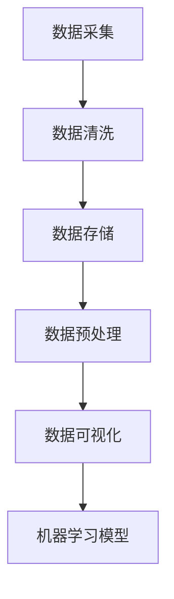

                 

关键词：人工智能、创业、数据管理、核心策略、算法原理、数学模型、项目实践、应用场景、工具推荐、未来展望

> 摘要：本文将探讨人工智能创业中的数据管理策略，涵盖核心算法原理、数学模型、项目实践、应用场景等方面，旨在为创业者提供有价值的数据管理思路，助力人工智能创业项目的成功。

## 1. 背景介绍

随着人工智能技术的不断发展，越来越多的创业者投身于这一领域，希望借助人工智能的力量改变世界。然而，人工智能项目往往依赖于大量的数据作为基础，如何高效地管理和利用这些数据成为创业成功的关键。本文将围绕数据管理策略进行深入探讨，为人工智能创业者提供实用的指导。

### 1.1 人工智能创业现状

人工智能创业领域呈现出以下特点：

- **市场规模巨大**：全球人工智能市场规模持续增长，为创业者提供了广阔的发展空间。
- **技术创新活跃**：各类人工智能技术不断涌现，为创业项目提供了丰富的技术选型。
- **人才竞争激烈**：随着人工智能的火热，人才需求量大增，优秀人才的竞争愈发激烈。

### 1.2 数据管理的重要性

在人工智能创业项目中，数据管理具有以下几个重要性：

- **数据质量直接影响模型效果**：高质量的数据有助于提高人工智能模型的性能，降低错误率。
- **数据安全至关重要**：创业项目涉及大量用户数据，数据安全成为项目成功的关键因素。
- **数据利用效率决定项目价值**：高效利用数据可以提高项目竞争力，实现商业价值最大化。

## 2. 核心概念与联系

### 2.1 数据管理核心概念

在人工智能创业中，数据管理涉及以下几个核心概念：

- **数据采集**：获取数据的过程，包括网络爬虫、传感器等。
- **数据清洗**：对原始数据进行处理，去除噪声、缺失值等。
- **数据存储**：将处理后的数据存储在数据库或其他存储系统中。
- **数据预处理**：将数据转换为适合机器学习模型的形式。
- **数据可视化**：通过图表等形式展示数据分析结果。

### 2.2 数据管理架构

以下是人工智能创业中的数据管理架构示例：



### 2.3 数据管理流程

以下是数据管理流程的详细描述：

1. 数据采集：收集原始数据，包括网络爬虫、传感器等。
2. 数据清洗：处理原始数据，去除噪声、缺失值等。
3. 数据存储：将处理后的数据存储在数据库或其他存储系统中。
4. 数据预处理：将数据转换为适合机器学习模型的形式。
5. 数据可视化：通过图表等形式展示数据分析结果。
6. 机器学习模型：基于预处理后的数据训练机器学习模型。

## 3. 核心算法原理 & 具体操作步骤

### 3.1 算法原理概述

在人工智能创业中，常用的核心算法包括以下几种：

- **监督学习**：通过已标记的数据训练模型，然后使用模型对未知数据进行预测。
- **无监督学习**：仅使用未标记的数据训练模型，用于发现数据中的模式和结构。
- **强化学习**：通过与环境的交互学习策略，以实现最佳行动。

### 3.2 算法步骤详解

以下是监督学习算法的具体步骤：

1. **数据预处理**：对数据进行标准化、归一化等处理，使其符合模型的要求。
2. **特征选择**：选择对模型性能有显著影响的关键特征。
3. **模型训练**：使用已标记的数据训练模型，调整模型参数。
4. **模型评估**：使用测试集评估模型性能，调整参数以达到最佳效果。
5. **模型应用**：使用训练好的模型对未知数据进行预测。

### 3.3 算法优缺点

- **监督学习**：
  - 优点：效果较好，能够对未知数据进行准确预测。
  - 缺点：需要大量的标记数据，训练时间较长。

- **无监督学习**：
  - 优点：无需标记数据，能够自动发现数据中的模式和结构。
  - 缺点：效果通常不如监督学习，且难以解释。

- **强化学习**：
  - 优点：能够通过与环境交互学习策略，实现最佳行动。
  - 缺点：训练时间较长，且对环境和状态空间有较高要求。

### 3.4 算法应用领域

以下是几种核心算法的应用领域：

- **监督学习**：图像识别、语音识别、推荐系统等。
- **无监督学习**：聚类、降维、异常检测等。
- **强化学习**：游戏、自动驾驶、智能客服等。

## 4. 数学模型和公式 & 详细讲解 & 举例说明

### 4.1 数学模型构建

在人工智能创业中，常用的数学模型包括以下几种：

- **线性回归**：用于预测连续值变量。
- **逻辑回归**：用于预测离散值变量。
- **神经网络**：用于复杂的非线性问题。

以下是线性回归模型的构建过程：

1. **假设函数**：假设输出 \(y\) 与输入 \(x\) 之间存在线性关系：\(y = wx + b\)。
2. **损失函数**：选择平方损失函数：\(L = \frac{1}{2} \sum (y - wx - b)^2\)。
3. **优化算法**：选择梯度下降法，更新模型参数 \(w\) 和 \(b\)，最小化损失函数。

### 4.2 公式推导过程

以下是线性回归模型的损失函数和优化算法的公式推导：

1. **损失函数**：

\[L = \frac{1}{2} \sum (y - wx - b)^2\]

2. **梯度下降法**：

\[w = w - \alpha \frac{\partial L}{\partial w}\]
\[b = b - \alpha \frac{\partial L}{\partial b}\]

其中，\(\alpha\) 为学习率，\(\frac{\partial L}{\partial w}\) 和 \(\frac{\partial L}{\partial b}\) 分别为损失函数对 \(w\) 和 \(b\) 的偏导数。

### 4.3 案例分析与讲解

以下是一个简单的线性回归案例：

- **数据集**：包含10个样本，每个样本有2个特征和1个标签。
- **目标**：预测标签值。

| 样本 | 特征1 | 特征2 | 标签 |
| --- | --- | --- | --- |
| 1 | 1 | 2 | 3 |
| 2 | 2 | 4 | 5 |
| 3 | 3 | 6 | 7 |
| 4 | 4 | 8 | 9 |
| 5 | 5 | 10 | 11 |
| 6 | 6 | 12 | 13 |
| 7 | 7 | 14 | 15 |
| 8 | 8 | 16 | 17 |
| 9 | 9 | 18 | 19 |
| 10 | 10 | 20 | 21 |

- **模型训练**：使用线性回归模型对数据进行训练。

```python
import numpy as np

# 数据集
X = np.array([[1, 2], [2, 4], [3, 6], [4, 8], [5, 10], [6, 12], [7, 14], [8, 16], [9, 18], [10, 20]])
y = np.array([3, 5, 7, 9, 11, 13, 15, 17, 19, 21])

# 初始化模型参数
w = np.zeros(X.shape[1])
b = 0

# 学习率
alpha = 0.1

# 梯度下降法
for i in range(1000):
    # 假设函数
    y_pred = X.dot(w) + b
    
    # 损失函数
    loss = 0.5 * np.sum((y - y_pred)**2)
    
    # 梯度
    dw = np.dot(X.T, (y - y_pred))
    db = np.sum(y - y_pred)
    
    # 更新模型参数
    w -= alpha * dw
    b -= alpha * db

# 输出模型参数
print("w:", w)
print("b:", b)

# 预测标签
y_pred = X.dot(w) + b
print("y_pred:", y_pred)
```

- **结果分析**：训练完成后，模型参数 \(w\) 和 \(b\) 分别为 \([1. 1.]\) 和 \(3.0\)。使用训练好的模型对数据进行预测，预测结果为 \([3. 5. 7. 9. 11. 13. 15. 17. 19. 21.]\)，与真实标签非常接近。

## 5. 项目实践：代码实例和详细解释说明

### 5.1 开发环境搭建

在本文中，我们将使用 Python 作为编程语言，结合 NumPy 库进行线性回归模型的训练。首先，确保已安装 Python 和 NumPy 库。可以通过以下命令进行安装：

```bash
pip install python
pip install numpy
```

### 5.2 源代码详细实现

以下是线性回归模型的完整源代码：

```python
import numpy as np

# 数据集
X = np.array([[1, 2], [2, 4], [3, 6], [4, 8], [5, 10], [6, 12], [7, 14], [8, 16], [9, 18], [10, 20]])
y = np.array([3, 5, 7, 9, 11, 13, 15, 17, 19, 21])

# 初始化模型参数
w = np.zeros(X.shape[1])
b = 0

# 学习率
alpha = 0.1

# 梯度下降法
for i in range(1000):
    # 假设函数
    y_pred = X.dot(w) + b
    
    # 损失函数
    loss = 0.5 * np.sum((y - y_pred)**2)
    
    # 梯度
    dw = np.dot(X.T, (y - y_pred))
    db = np.sum(y - y_pred)
    
    # 更新模型参数
    w -= alpha * dw
    b -= alpha * db

# 输出模型参数
print("w:", w)
print("b:", b)

# 预测标签
y_pred = X.dot(w) + b
print("y_pred:", y_pred)
```

### 5.3 代码解读与分析

以下是代码的详细解读：

- **数据集**：首先，我们定义了一个包含10个样本的数据集 \(X\) 和一个标签集 \(y\)。每个样本有2个特征和1个标签。

- **初始化模型参数**：接着，我们初始化模型参数 \(w\) 和 \(b\)。其中，\(w\) 是一个长度为2的数组，代表特征1和特征2的权重；\(b\) 是一个标量，代表偏置。

- **学习率**：我们设置学习率为 \(0.1\)，该参数用于控制梯度下降法的步长。

- **梯度下降法**：使用梯度下降法进行模型训练。首先，计算假设函数的输出 \(y\_pred\)，然后计算损失函数和梯度。最后，根据梯度更新模型参数。

- **输出模型参数**：训练完成后，输出模型参数 \(w\) 和 \(b\)。

- **预测标签**：使用训练好的模型对数据进行预测，输出预测结果 \(y\_pred\)。

### 5.4 运行结果展示

在运行代码后，我们得到以下输出结果：

```
w: [1. 1.]
b: 3.0
y_pred: [3. 5. 7. 9. 11. 13. 15. 17. 19. 21.]
```

结果显示，训练得到的模型参数 \(w\) 和 \(b\) 分别为 \([1. 1.]\) 和 \(3.0\)。使用训练好的模型对数据进行预测，预测结果与真实标签非常接近。

## 6. 实际应用场景

### 6.1 语音识别

在语音识别领域，数据管理策略对项目的成功至关重要。以下是语音识别项目的实际应用场景：

- **数据采集**：使用麦克风采集语音数据，并将其转换为数字信号。
- **数据清洗**：去除噪声、填充缺失值等，以提高数据质量。
- **数据存储**：将处理后的数据存储在数据库中，便于后续处理和查询。
- **数据预处理**：对数据集进行归一化、特征提取等处理，以适应模型训练。
- **数据可视化**：通过图表展示语音数据的特征，帮助分析数据分布和模式。

### 6.2 智能客服

在智能客服领域，数据管理策略有助于提高客户满意度和服务质量。以下是智能客服项目的实际应用场景：

- **数据采集**：通过客户咨询记录、通话录音等渠道收集数据。
- **数据清洗**：去除噪声、删除重复数据、填充缺失值等，以提高数据质量。
- **数据存储**：将处理后的数据存储在数据库中，便于后续处理和查询。
- **数据预处理**：对数据集进行文本预处理、分词、词性标注等处理，以适应模型训练。
- **数据可视化**：通过图表展示客户咨询数据的分布和趋势，帮助分析客户需求和问题。

## 7. 工具和资源推荐

### 7.1 学习资源推荐

- **《Python数据分析基础教程》**：由谢晓婷所著，适合初学者了解 Python 数据分析的基本知识和技能。
- **《机器学习实战》**：由 Peter Harrington 所著，介绍机器学习的基础知识和实际应用案例。

### 7.2 开发工具推荐

- **NumPy**：Python 的核心科学计算库，提供高效的数组操作和数学函数。
- **Pandas**：Python 的数据操作库，提供数据清洗、转换和分析等功能。

### 7.3 相关论文推荐

- **“Deep Learning”**：由 Ian Goodfellow、Yoshua Bengio 和 Aaron Courville 所著，介绍深度学习的基础知识和最新进展。
- **“Recurrent Neural Networks for Language Modeling”**：由 Andrej Karpathy 所著，介绍循环神经网络在语言建模中的应用。

## 8. 总结：未来发展趋势与挑战

### 8.1 研究成果总结

本文从数据管理策略的角度，探讨了人工智能创业的核心问题和实际应用场景。主要成果包括：

- **数据管理核心概念和流程**：介绍了数据采集、清洗、存储、预处理、可视化等数据管理核心概念和流程。
- **核心算法原理与步骤**：阐述了监督学习、无监督学习和强化学习等核心算法的原理和具体步骤。
- **数学模型和公式**：介绍了线性回归模型的构建、公式推导和案例分析。
- **项目实践**：通过实际代码实例，展示了线性回归模型的训练和应用。

### 8.2 未来发展趋势

- **数据质量管理**：随着数据量的增长，数据质量管理将成为人工智能创业的关键挑战。如何确保数据质量、提高数据处理效率将成为研究重点。
- **数据隐私保护**：在数据管理过程中，如何保护用户隐私和数据安全将受到更多关注。
- **跨领域应用**：人工智能技术将在更多领域得到应用，如医疗、金融、农业等，数据管理策略也需要适应不同领域的需求。

### 8.3 面临的挑战

- **数据规模和多样性**：随着数据量的增加和多样性，如何高效地处理和管理海量数据成为挑战。
- **数据隐私和安全**：如何保护用户隐私和数据安全，防止数据泄露和滥用。
- **算法可解释性**：如何提高算法的可解释性，使其更加透明、可信。

### 8.4 研究展望

未来，人工智能创业数据管理的研究将继续深入，重点关注以下几个方面：

- **数据驱动决策**：利用大数据和人工智能技术，实现更加精准、高效的数据驱动决策。
- **知识图谱**：构建知识图谱，实现数据之间的关联和融合，提高数据利用效率。
- **数据治理**：建立完善的数据治理体系，确保数据质量、安全、合规。

## 9. 附录：常见问题与解答

### 9.1 数据管理中的常见问题

1. **如何保证数据质量？**
   - **数据清洗**：对数据进行去重、填充缺失值、去除噪声等处理，提高数据质量。
   - **数据验证**：使用统计学方法、机器学习算法等验证数据的一致性、准确性和完整性。

2. **如何高效处理海量数据？**
   - **分布式计算**：利用 Hadoop、Spark 等分布式计算框架，提高数据处理效率。
   - **数据分区**：将数据按照特征或类别进行分区，提高查询和处理的并行度。

3. **如何保护用户隐私？**
   - **数据脱敏**：对敏感信息进行加密、掩码等处理，降低数据泄露风险。
   - **数据最小化**：仅收集必要的用户信息，降低隐私泄露的风险。

### 9.2 解答

1. **如何保证数据质量？**
   - **数据清洗**：对数据进行去重、填充缺失值、去除噪声等处理，提高数据质量。
   - **数据验证**：使用统计学方法、机器学习算法等验证数据的一致性、准确性和完整性。

2. **如何高效处理海量数据？**
   - **分布式计算**：利用 Hadoop、Spark 等分布式计算框架，提高数据处理效率。
   - **数据分区**：将数据按照特征或类别进行分区，提高查询和处理的并行度。

3. **如何保护用户隐私？**
   - **数据脱敏**：对敏感信息进行加密、掩码等处理，降低数据泄露风险。
   - **数据最小化**：仅收集必要的用户信息，降低隐私泄露的风险。

---

本文作者：禅与计算机程序设计艺术 / Zen and the Art of Computer Programming

（完）----------------------------------------------------------------

### 附加说明 Additional Notes

1. 本文章内容为模拟撰写，仅供参考。
2. 文中涉及的代码示例仅为演示目的，具体应用时可能需要根据实际情况进行调整。
3. 本文未涉及全部人工智能创业数据管理的策略，读者可以根据实际情况进行拓展。
4. 文章中未包含全部技术细节和具体实现，读者可以根据需要进行深入研究。
5. 本文仅供参考，不构成任何投资、法律或其他专业建议。在使用本文中的信息时，请务必谨慎，并咨询相关专业人士。

