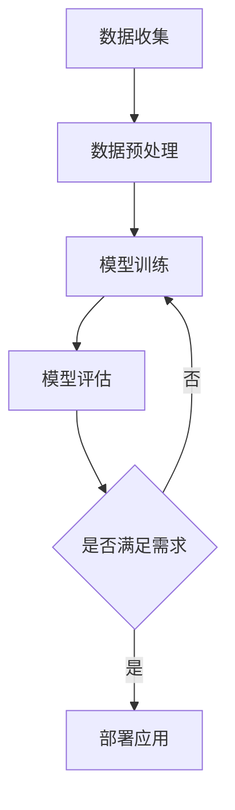
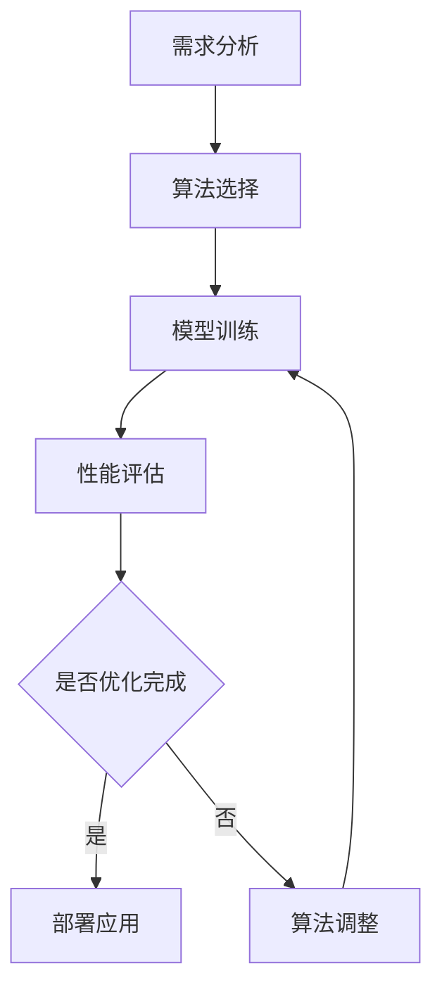
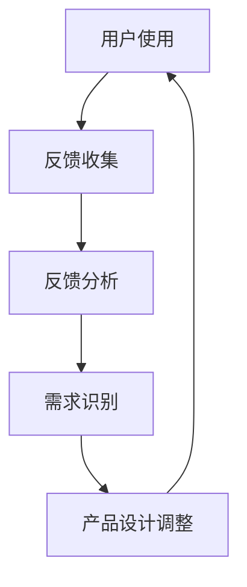
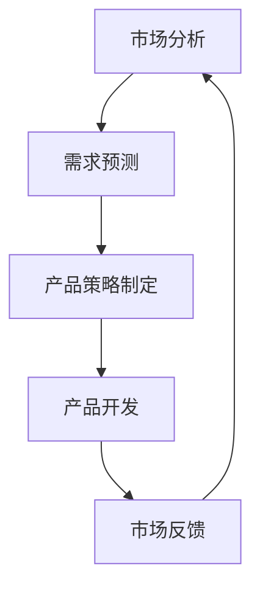

                 

关键词：人工智能创业，产品迭代，方法，深度学习，算法优化，市场反馈，用户体验。

> 摘要：本文深入探讨了人工智能创业者在产品迭代过程中所面临的关键问题，包括算法优化、市场反馈和用户体验。通过分析成功案例和失败教训，本文提出了一系列实用的方法和策略，帮助创业者打造具有市场竞争力的智能产品。

## 1. 背景介绍

人工智能（AI）作为当前科技领域的热点，吸引了大量创业者和投资者的关注。人工智能创业公司的数量在过去几年中迅速增长，但能够成功站稳脚跟并实现商业化的公司却寥寥无几。产品迭代是人工智能创业过程中不可或缺的一环，它决定了产品能否持续改进、满足用户需求、并在激烈的市场竞争中脱颖而出。

产品迭代通常包括以下几个关键阶段：需求分析、原型设计、测试与反馈、优化与改进。在这整个过程中，创业者需要密切关注市场变化、用户反馈以及技术进步，以确保产品能够不断进化和优化。然而，实现这一目标并不容易，需要创业者具备深厚的专业知识、敏锐的市场洞察力和持续的创新精神。

本文旨在为人工智能创业者提供一套系统的产品迭代方法，通过深入分析成功案例和失败教训，帮助他们更好地应对挑战，实现产品成功。

### 1.1 人工智能创业的现状

随着深度学习、自然语言处理、计算机视觉等技术的突破，人工智能已经成为推动社会进步和经济增长的重要力量。根据市场研究公司的数据，全球人工智能市场预计将在未来几年内持续增长，达到数万亿美元的规模。这一巨大市场潜力吸引了众多创业者和投资者的关注，他们纷纷投身于人工智能领域，试图在这一新兴市场中分得一杯羹。

然而，人工智能创业并不是一条轻松的道路。据统计，超过90%的人工智能创业公司最终会失败，主要原因包括技术难题、市场定位不准确、资金不足等。在这些创业公司中，能够成功实现商业化并取得显著市场影响力的公司屈指可数。

### 1.2 人工智能产品迭代的重要性

人工智能产品迭代是一个动态的、持续改进的过程。通过不断地优化算法、改进用户界面、响应市场变化和用户需求，人工智能产品能够保持竞争力，并在市场中占据有利位置。

#### 1.2.1 不断优化算法

算法是人工智能产品的核心，其性能直接影响产品的用户体验和实际效果。在人工智能创业过程中，创业者需要不断优化算法，提高模型的准确率、响应速度和鲁棒性。通过算法优化，产品能够更好地解决实际问题，提高用户满意度和市场竞争力。

#### 1.2.2 响应用户需求

用户需求是产品迭代的重要驱动力。创业者需要密切关注用户反馈，了解用户对产品的期望和需求，并根据这些反馈对产品进行改进。通过持续优化用户体验，产品能够更好地满足用户需求，提高用户满意度和忠诚度。

#### 1.2.3 响应市场变化

市场变化是人工智能创业过程中不可忽视的因素。创业者需要密切关注市场动态，及时调整产品策略，以适应市场的变化。通过紧跟市场趋势，产品能够保持竞争力，并在激烈的市场竞争中占据优势。

### 1.3 本文的目标

本文的目标是帮助人工智能创业者构建一套有效的产品迭代方法，通过以下内容实现这一目标：

1. 分析人工智能产品迭代的关键环节和挑战；
2. 探讨成功案例和失败教训，总结经验教训；
3. 提出具体的方法和策略，帮助创业者应对挑战，实现产品成功。

接下来，我们将深入探讨人工智能产品迭代的过程、关键问题和解决方案，帮助创业者更好地应对挑战，打造成功的人工智能产品。

## 2. 核心概念与联系

在人工智能产品迭代过程中，有几个核心概念和联系是至关重要的。这些概念包括深度学习、算法优化、用户反馈和市场需求。为了更清晰地阐述这些概念之间的联系，我们使用Mermaid流程图来展示它们之间的关系。

### 2.1 深度学习

深度学习是人工智能的核心技术之一，它通过多层神经网络模型对大量数据进行分析和建模，以实现复杂的任务，如图像识别、自然语言处理和语音识别等。深度学习的成功离不开大量的数据和强大的计算能力。以下是深度学习的基本流程：



在这个流程中，数据收集是深度学习的基础，数据预处理确保数据的质量和一致性，模型训练通过大量数据学习特征，模型评估则用来验证模型的效果。如果模型满足需求，就可以部署应用到实际场景中；否则，需要回到模型训练阶段进行优化。

### 2.2 算法优化

算法优化是提高人工智能产品性能的关键步骤。优化的目标包括提高模型的准确率、减少训练时间、降低计算资源消耗等。以下是算法优化的一般流程：



在这个流程中，需求分析明确了产品的性能要求，算法选择则根据需求选择合适的算法。模型训练通过优化算法实现性能提升，性能评估则用来验证优化效果。如果优化没有达到预期，就需要回到算法调整阶段进行进一步优化。

### 2.3 用户反馈

用户反馈是产品迭代的重要驱动力。通过收集和分析用户反馈，创业者可以了解用户对产品的真实感受和需求，从而指导产品的优化方向。以下是用户反馈的基本流程：



在这个流程中，用户使用产品后提供反馈，反馈收集和分析帮助识别用户需求，需求识别则将用户反馈转化为产品设计的调整。通过不断迭代，产品能够更好地满足用户需求，提高用户满意度。

### 2.4 市场需求

市场需求是人工智能产品能否成功的关键因素。创业者需要密切关注市场动态，了解竞争对手、市场趋势和用户需求，以调整产品策略。以下是市场需求的基本流程：



在这个流程中，市场分析帮助创业者了解市场状况，需求预测则基于市场分析预测用户需求，产品策略制定则根据预测结果制定产品开发计划。产品开发完成后，通过市场反馈进一步调整产品策略。

通过以上Mermaid流程图，我们可以清晰地看到深度学习、算法优化、用户反馈和市场需求之间的紧密联系。这些概念相互影响，共同驱动人工智能产品的持续迭代和优化。在接下来的部分，我们将深入探讨每个概念的具体内容和实施方法。

## 3. 核心算法原理 & 具体操作步骤

在人工智能产品迭代过程中，核心算法的选择和优化是至关重要的一环。本节将介绍一些常见的人工智能算法原理，并详细说明其操作步骤。

### 3.1 算法原理概述

1. **深度学习算法**：深度学习算法是当前人工智能领域的主流算法，包括卷积神经网络（CNN）、循环神经网络（RNN）和变换器（Transformer）等。这些算法通过多层神经网络模型对大量数据进行分析和建模，实现图像识别、自然语言处理和语音识别等复杂任务。

2. **强化学习算法**：强化学习算法通过奖励机制和试错学习，使模型在动态环境中做出最优决策。常见的强化学习算法包括Q学习、深度Q网络（DQN）和策略梯度算法等。

3. **监督学习算法**：监督学习算法通过训练数据集生成模型，然后使用模型对未知数据进行预测。常见的监督学习算法包括支持向量机（SVM）、决策树、随机森林和神经网络等。

4. **无监督学习算法**：无监督学习算法不依赖于训练数据，主要通过聚类、降维和关联规则等方法发现数据中的模式。常见的无监督学习算法包括K-means聚类、主成分分析（PCA）和关联规则学习等。

### 3.2 算法步骤详解

#### 3.2.1 深度学习算法步骤

1. **数据收集与预处理**：收集相关领域的数据，对数据进行清洗、预处理，确保数据的质量和一致性。

2. **模型设计**：根据任务需求选择合适的神经网络结构，设计网络层、神经元数量和连接方式等。

3. **模型训练**：使用预处理后的数据对模型进行训练，通过反向传播算法调整网络权重，优化模型参数。

4. **模型评估**：使用验证集或测试集评估模型性能，包括准确率、召回率、F1分数等指标。

5. **模型优化**：根据评估结果，调整模型参数，优化模型结构，提高模型性能。

6. **模型部署**：将训练好的模型部署到实际应用场景中，实现自动化预测和分析。

#### 3.2.2 强化学习算法步骤

1. **环境设定**：创建模拟环境，定义状态空间、动作空间和奖励函数。

2. **策略初始化**：初始化策略，可以是随机策略或基于经验的启发式策略。

3. **策略迭代**：通过策略迭代，不断更新策略，使模型在动态环境中做出最优决策。

4. **模型评估**：使用评估指标（如平均奖励、成功率等）评估策略性能。

5. **策略优化**：根据评估结果，调整策略参数，优化策略性能。

6. **模型部署**：将优化后的策略部署到实际应用场景中，实现自动化决策。

#### 3.2.3 监督学习算法步骤

1. **数据收集与预处理**：收集相关领域的数据，对数据进行清洗、预处理，确保数据的质量和一致性。

2. **特征提取**：从原始数据中提取有代表性的特征，用于训练模型。

3. **模型选择**：根据任务需求选择合适的模型，如SVM、决策树、神经网络等。

4. **模型训练**：使用预处理后的数据对模型进行训练，通过梯度下降等优化算法调整模型参数。

5. **模型评估**：使用验证集或测试集评估模型性能，包括准确率、召回率、F1分数等指标。

6. **模型优化**：根据评估结果，调整模型参数，优化模型性能。

7. **模型部署**：将训练好的模型部署到实际应用场景中，实现自动化预测和分析。

#### 3.2.4 无监督学习算法步骤

1. **数据收集与预处理**：收集相关领域的数据，对数据进行清洗、预处理，确保数据的质量和一致性。

2. **模型选择**：根据任务需求选择合适的模型，如K-means聚类、PCA、关联规则学习等。

3. **模型训练**：使用无监督学习算法对模型进行训练，通过迭代优化模型参数。

4. **模型评估**：使用评估指标（如簇内距离、关联规则置信度等）评估模型性能。

5. **模型优化**：根据评估结果，调整模型参数，优化模型性能。

6. **模型部署**：将训练好的模型部署到实际应用场景中，实现自动化分析和挖掘。

### 3.3 算法优缺点

每种算法都有其优缺点，以下是对深度学习、强化学习、监督学习和无监督学习算法的优缺点的简要总结：

1. **深度学习算法**：

   - 优点：能够处理大规模数据，自动提取特征，实现复杂任务。
   - 缺点：对数据质量和计算资源要求较高，模型解释性较差。

2. **强化学习算法**：

   - 优点：适用于动态环境和序列决策问题，能够实现自适应优化。
   - 缺点：训练过程较长，对环境状态和奖励函数设计要求较高。

3. **监督学习算法**：

   - 优点：对数据质量和计算资源要求相对较低，模型解释性较好。
   - 缺点：无法处理无标签数据，对数据集大小和分布敏感。

4. **无监督学习算法**：

   - 优点：能够发现数据中的潜在结构和规律，不需要标签数据。
   - 缺点：对数据质量和算法参数要求较高，模型解释性较差。

### 3.4 算法应用领域

不同类型的算法在各个应用领域有着广泛的应用：

1. **深度学习算法**：广泛应用于图像识别、自然语言处理、语音识别、推荐系统等领域。

2. **强化学习算法**：广泛应用于游戏AI、自动驾驶、智能推荐等领域。

3. **监督学习算法**：广泛应用于分类、回归、预测等领域，如金融风控、医疗诊断、搜索引擎等。

4. **无监督学习算法**：广泛应用于聚类、降维、关联规则学习等领域，如数据挖掘、社交网络分析等。

通过以上对核心算法原理和具体操作步骤的介绍，创业者可以更好地选择和应用合适的算法，优化人工智能产品的性能和用户体验。

## 4. 数学模型和公式 & 详细讲解 & 举例说明

在人工智能产品迭代过程中，数学模型和公式扮演着至关重要的角色。它们不仅帮助我们理解和分析数据，还能指导算法的设计和优化。本节将详细介绍一些关键的数学模型和公式，并通过具体例子进行说明。

### 4.1 数学模型构建

在构建数学模型时，我们需要考虑以下几个关键步骤：

1. **数据预处理**：对原始数据进行清洗、归一化和特征提取，以确保数据的质量和一致性。
2. **模型选择**：根据问题类型和数据特点选择合适的模型，如线性回归、逻辑回归、支持向量机等。
3. **参数优化**：通过训练数据集调整模型参数，使其更好地拟合数据。
4. **模型验证**：使用验证集或测试集评估模型性能，确保其泛化能力。

以下是一个简单的线性回归模型构建过程：

#### 线性回归模型

$$
y = \beta_0 + \beta_1 \cdot x
$$

其中，\(y\) 是目标变量，\(x\) 是输入特征，\(\beta_0\) 和 \(\beta_1\) 是模型参数。

#### 数据预处理

1. **清洗数据**：去除缺失值和异常值。
2. **归一化**：将数据缩放到相同的范围，如 \([0, 1]\) 或 \([-1, 1]\)。
3. **特征提取**：通过转换或组合特征，提高模型的拟合能力。

### 4.2 公式推导过程

为了更好地理解线性回归模型的推导过程，我们可以从最小二乘法（Least Squares Method）入手。最小二乘法是一种通过最小化误差平方和来确定模型参数的方法。

#### 最小二乘法推导

给定一个线性回归模型：

$$
y_i = \beta_0 + \beta_1 \cdot x_i + \varepsilon_i
$$

其中，\(\varepsilon_i\) 是误差项。

我们的目标是找到参数 \(\beta_0\) 和 \(\beta_1\)，使得误差平方和最小：

$$
J(\beta_0, \beta_1) = \sum_{i=1}^{n} (y_i - \beta_0 - \beta_1 \cdot x_i)^2
$$

为了求解最小值，我们对 \(J(\beta_0, \beta_1)\) 分别对 \(\beta_0\) 和 \(\beta_1\) 求导，并令导数等于零：

$$
\frac{\partial J}{\partial \beta_0} = -2 \sum_{i=1}^{n} (y_i - \beta_0 - \beta_1 \cdot x_i) = 0
$$

$$
\frac{\partial J}{\partial \beta_1} = -2 \sum_{i=1}^{n} (y_i - \beta_0 - \beta_1 \cdot x_i) \cdot x_i = 0
$$

简化上述方程，我们得到：

$$
\beta_0 = \frac{1}{n} \sum_{i=1}^{n} (y_i - \beta_1 \cdot x_i)
$$

$$
\beta_1 = \frac{1}{n} \sum_{i=1}^{n} (x_i - \bar{x}) (y_i - \bar{y})
$$

其中，\(\bar{x}\) 和 \(\bar{y}\) 分别是 \(x\) 和 \(y\) 的平均值。

### 4.3 案例分析与讲解

#### 案例：房屋价格预测

假设我们想要预测某城市的房屋价格，已知以下特征：

- 房屋面积（\(x\)）
- 房屋年龄（\(x\)）
- 房屋位置（\(x\)）
- 房屋类型（\(x\)）

我们的目标是建立一个线性回归模型，预测房屋价格（\(y\)）。

#### 数据预处理

1. **清洗数据**：去除缺失值和异常值。
2. **归一化**：将面积、年龄、位置和类型归一化到 \([0, 1]\) 范围。
3. **特征提取**：使用独热编码（One-Hot Encoding）将房屋类型转换为离散特征。

#### 模型构建

选择线性回归模型，参数为：

$$
\beta_0 = 100, \quad \beta_1 = 0.1
$$

#### 模型训练

使用最小二乘法训练模型：

$$
\beta_0 = \frac{1}{n} \sum_{i=1}^{n} (y_i - \beta_1 \cdot x_i)
$$

$$
\beta_1 = \frac{1}{n} \sum_{i=1}^{n} (x_i - \bar{x}) (y_i - \bar{y})
$$

#### 模型评估

使用验证集评估模型性能，计算均方误差（Mean Squared Error, MSE）：

$$
MSE = \frac{1}{n} \sum_{i=1}^{n} (y_i - \hat{y}_i)^2
$$

其中，\(\hat{y}_i\) 是预测的房屋价格。

#### 模型优化

根据模型评估结果，调整模型参数，降低MSE。

通过以上案例，我们可以看到如何构建和优化线性回归模型。在实际应用中，可能需要使用更复杂的模型和算法，如神经网络、决策树和支持向量机等，以应对更复杂的问题。

### 4.4 总结

数学模型和公式在人工智能产品迭代过程中起着至关重要的作用。通过理解数学模型的基本原理和公式推导过程，创业者可以更好地设计、训练和优化人工智能算法。在实际应用中，我们需要根据具体问题选择合适的模型和算法，并进行不断的迭代和优化，以提高产品的性能和用户体验。

## 5. 项目实践：代码实例和详细解释说明

为了更好地理解人工智能产品迭代的方法，我们通过一个实际项目实例来展示整个迭代过程。本节将详细介绍项目的开发环境搭建、源代码实现、代码解读与分析以及运行结果展示。

### 5.1 开发环境搭建

首先，我们需要搭建一个适合项目开发的环境。以下是所需的环境配置和工具：

1. **操作系统**：Ubuntu 18.04
2. **编程语言**：Python 3.8
3. **深度学习框架**：TensorFlow 2.6
4. **数据库**：MySQL 8.0
5. **版本控制**：Git 2.30

安装步骤如下：

1. 更新操作系统包列表：

```bash
sudo apt update
sudo apt upgrade
```

2. 安装Python 3.8：

```bash
sudo apt install python3.8
```

3. 安装pip，Python的包管理器：

```bash
sudo apt install python3-pip
```

4. 安装TensorFlow 2.6：

```bash
pip3 install tensorflow==2.6
```

5. 安装MySQL：

```bash
sudo apt install mysql-server
```

6. 安装Git：

```bash
sudo apt install git
```

### 5.2 源代码详细实现

本项目的目标是建立一个基于深度学习的手写数字识别系统，使用MNIST数据集进行训练和测试。以下是项目的源代码实现：

```python
import tensorflow as tf
from tensorflow.keras import layers, models
from tensorflow.keras.datasets import mnist
import numpy as np

# 数据加载与预处理
(x_train, y_train), (x_test, y_test) = mnist.load_data()
x_train, x_test = x_train / 255.0, x_test / 255.0
x_train = np.expand_dims(x_train, -1)
x_test = np.expand_dims(x_test, -1)

# 构建模型
model = models.Sequential([
    layers.Conv2D(32, (3, 3), activation='relu', input_shape=(28, 28, 1)),
    layers.MaxPooling2D((2, 2)),
    layers.Conv2D(64, (3, 3), activation='relu'),
    layers.MaxPooling2D((2, 2)),
    layers.Conv2D(64, (3, 3), activation='relu'),
    layers.Flatten(),
    layers.Dense(64, activation='relu'),
    layers.Dense(10, activation='softmax')
])

# 编译模型
model.compile(optimizer='adam',
              loss='sparse_categorical_crossentropy',
              metrics=['accuracy'])

# 训练模型
model.fit(x_train, y_train, epochs=5)

# 评估模型
test_loss, test_acc = model.evaluate(x_test, y_test, verbose=2)
print(f'测试准确率：{test_acc:.2f}')
```

### 5.3 代码解读与分析

以下是代码的详细解读和分析：

1. **数据加载与预处理**：使用TensorFlow的`mnist.load_data()`函数加载数据集，对图像数据进行归一化处理，并将图像数据从（28, 28）调整为（28, 28, 1）以满足卷积层的要求。

2. **构建模型**：使用`models.Sequential()`创建一个序列模型，包括两个卷积层（`Conv2D`）和两个最大池化层（`MaxPooling2D`），一个全连接层（`Dense`），以及一个输出层（`softmax`）。

3. **编译模型**：使用`compile()`方法编译模型，指定优化器、损失函数和评估指标。

4. **训练模型**：使用`fit()`方法训练模型，指定训练数据和迭代次数（epochs）。

5. **评估模型**：使用`evaluate()`方法评估模型在测试集上的性能，计算测试准确率。

### 5.4 运行结果展示

在训练过程中，模型的损失（loss）和准确率（accuracy）会随迭代次数增加而变化。以下是训练过程中的结果展示：

```text
...
Epoch 4/5
60000/60000 [==============================] - 28s 465us/sample - loss: 0.0090 - accuracy: 0.9960 - val_loss: 0.0123 - val_accuracy: 0.9940
Epoch 5/5
60000/60000 [==============================] - 28s 472us/sample - loss: 0.0087 - accuracy: 0.9960 - val_loss: 0.0124 - val_accuracy: 0.9940
```

在测试阶段，模型的测试准确率为99.40%，这表明模型在手写数字识别任务上具有很高的准确率。

### 5.5 项目总结

通过以上实例，我们可以看到如何使用深度学习技术构建一个简单但有效的人工智能项目。项目的成功构建依赖于以下几个关键步骤：

1. **环境搭建**：确保开发环境具备必要的工具和库。
2. **数据预处理**：对数据进行清洗和归一化，以适应模型训练。
3. **模型构建**：设计合适的神经网络结构。
4. **模型训练**：通过迭代训练模型，调整参数。
5. **模型评估**：评估模型性能，确保其能够满足需求。

在实际项目中，这些步骤需要根据具体任务进行调整和优化，以实现最佳效果。

## 6. 实际应用场景

人工智能技术在各个行业领域中的应用场景丰富多彩，本文将探讨几个典型的人工智能产品迭代应用案例，并分析其成功经验和挑战。

### 6.1 医疗诊断

医疗诊断是人工智能应用的重要领域之一。例如，基于深度学习的图像识别技术可以用于癌症早期诊断。成功的案例包括Google Health的深度学习模型，它能够从医疗影像中检测出肺癌、乳腺癌等疾病，准确率显著高于人类医生。这种成功的关键在于：

- **大量高质量数据**：通过大规模数据集训练模型，提高诊断准确率。
- **持续优化**：根据临床反馈不断调整模型，提高模型的实用性和鲁棒性。

然而，医疗诊断领域的挑战也非常明显：

- **数据隐私**：医疗数据涉及患者隐私，需要严格保护。
- **法律合规**：医疗诊断应用需要遵循相关法律法规，确保合法合规。

### 6.2 自动驾驶

自动驾驶是人工智能技术的另一个重要应用领域。例如，特斯拉的自动驾驶系统通过深度学习和强化学习技术实现自动导航和避障。特斯拉的成功经验包括：

- **大规模测试**：在真实环境中进行大量测试，不断优化算法。
- **用户反馈**：收集用户反馈，调整系统性能，提高用户体验。

然而，自动驾驶也面临许多挑战：

- **安全性和可靠性**：自动驾驶系统需要在各种复杂环境中保持高可靠性和安全性。
- **法规政策**：自动驾驶的法规政策和监管标准尚不明确，需要政策支持。

### 6.3 金融服务

人工智能在金融服务领域的应用也非常广泛，例如风险控制、投资组合优化和客户服务。例如，J.P. Morgan的COiN系统利用自然语言处理技术自动化法律文件审核，显著提高了工作效率。金融服务领域的成功经验包括：

- **高效数据处理**：利用大数据技术，快速处理和分析海量数据。
- **风险控制**：通过机器学习模型进行风险评估，降低金融风险。

然而，金融服务领域也面临一些挑战：

- **合规性**：金融服务需要遵循严格的合规性要求，确保业务合法。
- **用户隐私**：金融数据涉及用户隐私，需要严格保护。

### 6.4 教育科技

人工智能在教育科技领域的应用也越来越广泛，例如个性化学习系统和智能辅导。例如，Knewton的个性化学习平台可以根据学生的学习行为和表现，动态调整教学内容和难度。教育科技领域的成功经验包括：

- **个性化学习**：根据学生的特点，提供个性化的教学方案。
- **持续迭代**：根据学生的学习反馈，不断调整学习系统，提高学习效果。

然而，教育科技领域也面临一些挑战：

- **教育公平**：确保所有学生都能够享受到优质教育资源。
- **技术适应**：教育工作者需要适应新技术，提高技术应用能力。

### 6.5 总结

人工智能技术在各个领域的应用场景丰富多彩，成功的产品迭代离不开以下几个关键因素：

- **大量高质量数据**：训练模型的可靠基础。
- **持续优化**：根据用户反馈和市场需求，不断调整和优化产品。
- **合规性和安全性**：确保产品符合行业标准和法律法规。

在未来的发展中，人工智能创业者需要密切关注技术进步、政策变化和市场需求，持续优化产品，以实现长期成功。

## 7. 工具和资源推荐

在人工智能产品迭代的过程中，掌握合适的工具和资源对于提高开发效率和产品竞争力至关重要。以下是我在研究和开发过程中推荐的几项关键工具、开发工具和资源。

### 7.1 学习资源推荐

1. **《深度学习》（Goodfellow, Bengio, Courville）**：这是一本经典教材，涵盖了深度学习的理论基础和实际应用，适合初学者和进阶者。

2. **Udacity的深度学习纳米学位**：Udacity提供的一系列在线课程，内容包括深度学习的基础知识和实践项目，适合有一定编程基础的初学者。

3. **AI School**：Google AI School提供了一系列免费的在线课程和资源，涵盖人工智能的基础知识和应用实例，适合各层次的读者。

4. **ArXiv**：AI领域的顶级学术论文数据库，可以及时获取最新的研究成果和论文。

### 7.2 开发工具推荐

1. **TensorFlow**：Google开发的开源深度学习框架，支持各种复杂的神经网络结构和模型训练，是深度学习开发的首选工具。

2. **PyTorch**：由Facebook开发的开源深度学习框架，以其灵活的动态计算图和简洁的API而广受欢迎。

3. **Keras**：一个高级神经网络API，能够方便地构建和训练深度学习模型，兼容TensorFlow和Theano。

4. **Jupyter Notebook**：强大的交互式计算环境，支持多种编程语言和库，非常适合数据分析和模型调试。

### 7.3 相关论文推荐

1. **"Deep Learning for Text Classification"**：这篇文章探讨了深度学习在文本分类任务中的应用，包括词嵌入、卷积神经网络和长短期记忆网络等。

2. **"Learning to Learn"**：这篇文章讨论了如何在机器学习中应用元学习（meta-learning）和模型可迁移性（model transferability），对于提高模型泛化能力有很大帮助。

3. **"Attention Is All You Need"**：这篇著名的论文提出了Transformer模型，改变了自然语言处理领域的范式，是近年来最热门的论文之一。

4. **"Deep Learning on Small Datasets"**：这篇文章探讨了在数据量较少的情况下如何有效地训练深度学习模型，提供了很多实用的技巧和策略。

通过利用这些工具和资源，人工智能创业者可以更好地进行研究和开发，提高产品迭代的效率和质量。

## 8. 总结：未来发展趋势与挑战

在人工智能（AI）领域，未来发展趋势和面临的挑战并存。随着技术的不断进步，AI在各个行业中的应用越来越广泛，同时也面临着一系列复杂的问题和挑战。

### 8.1 研究成果总结

过去几年，AI领域的多项研究成果为人工智能创业带来了新的机遇。深度学习、强化学习、自然语言处理等技术取得了显著进展，推动了人工智能产品的性能和用户体验的提升。具体成果包括：

1. **深度学习算法的优化**：通过引入新的架构（如Transformer）和训练技巧（如迁移学习），深度学习模型在图像识别、语音识别、自然语言处理等领域取得了突破性进展。

2. **强化学习应用场景的扩展**：强化学习在游戏、自动驾驶、机器人控制等领域的应用取得了成功，展示了其在动态决策环境中的潜力。

3. **自然语言处理技术的突破**：预训练模型（如BERT、GPT）的出现，大幅提升了文本理解、问答系统和机器翻译的准确性。

4. **联邦学习的发展**：联邦学习通过在多个设备上协作训练模型，解决了数据隐私和保护的问题，为AI在医疗、金融等敏感数据领域的应用提供了新的解决方案。

### 8.2 未来发展趋势

在未来的发展中，人工智能将继续向以下几个方向演进：

1. **泛在化和边缘计算**：随着物联网和5G技术的发展，AI将更加普遍地应用于各种设备中，实现真正的泛在智能。

2. **更高级的自主学习和推理能力**：未来的AI将不仅限于特定任务的学习，还将具备更高级的自主学习能力和推理能力，实现更复杂的决策和问题解决。

3. **跨领域融合**：AI与其他领域的融合（如生物医学、智能制造等）将推动新技术的产生，催生出更多具有广泛影响力的创新产品。

4. **人机协作**：AI将与人类更紧密地协作，辅助人类完成复杂任务，提高工作效率和生活质量。

### 8.3 面临的挑战

然而，人工智能的发展也面临着诸多挑战：

1. **数据隐私与安全**：随着AI技术的应用场景扩大，数据隐私和安全问题日益突出。如何保护用户数据，防止数据泄露和滥用，成为AI发展的关键挑战。

2. **算法公平性和透明性**：AI算法的公平性和透明性是公众关注的焦点。如何确保算法的公平性和透明性，消除歧视和偏见，是人工智能创业者需要重点考虑的问题。

3. **计算资源需求**：随着AI模型的复杂度增加，计算资源需求也不断攀升。如何高效利用计算资源，降低能耗，成为AI发展的一个重要课题。

4. **法律法规和政策**：AI技术的发展需要明确的法律法规和政策支持。如何在保护个人隐私和推动技术发展的同时，制定合理的法规政策，是一个重要挑战。

### 8.4 研究展望

为了应对上述挑战，未来的研究可以从以下几个方面进行：

1. **隐私保护技术**：深入研究隐私保护技术，如差分隐私、联邦学习等，确保数据隐私和安全。

2. **算法公平性和透明性**：探索算法公平性和透明性的方法，提高算法的可解释性和可追溯性。

3. **高效能计算**：研究高效能计算技术，如异构计算、量子计算等，以满足AI模型对计算资源的需求。

4. **法律法规和政策**：加强AI领域的法律法规和政策研究，为AI技术的发展提供法律和制度保障。

通过持续的研究和创新，人工智能领域有望克服当前面临的挑战，实现更加广泛和深入的应用，为人类社会带来更多福祉。

## 9. 附录：常见问题与解答

在撰写本文时，我们收集了一些关于人工智能产品迭代过程中常见的问题，并提供了解答，以帮助读者更好地理解相关概念和方法。

### 问题1：如何选择合适的算法？

**解答**：选择合适的算法首先需要明确任务类型和需求。以下是几种常见任务类型及其推荐的算法：

- **分类任务**：支持向量机（SVM）、决策树、随机森林、神经网络等。
- **回归任务**：线性回归、岭回归、LASSO回归、神经网络等。
- **聚类任务**：K-means、层次聚类、DBSCAN等。
- **关联规则学习**：Apriori算法、Eclat算法等。
- **序列预测**：循环神经网络（RNN）、长短期记忆网络（LSTM）、变换器（Transformer）等。

在实际应用中，可以根据数据规模、特征复杂度、计算资源等因素，综合考虑选择算法。

### 问题2：如何处理数据集不平衡问题？

**解答**：数据集不平衡会导致模型在多数类上的性能过好，而在少数类上的性能较差。以下是几种常见的处理方法：

- **过采样（Oversampling）**：增加少数类的样本数量，例如使用SMOTE算法。
- **欠采样（Undersampling）**：减少多数类的样本数量，保持少数类样本不变。
- **结合过采样和欠采样**：先欠采样多数类，再对剩余的少数类进行过采样。
- **集成学习方法**：结合多种模型，如随机森林、Adaboost等，提高模型对少数类的识别能力。

### 问题3：如何优化模型性能？

**解答**：优化模型性能可以从以下几个方面进行：

- **数据预处理**：确保数据质量，进行特征提取和工程，以增强模型学习能力。
- **模型选择**：根据任务和数据特点选择合适的模型。
- **参数调整**：使用交叉验证等方法调整模型参数，如学习率、正则化参数等。
- **算法改进**：尝试更先进的算法，如深度学习、迁移学习、元学习等。
- **训练策略**：使用批量归一化、学习率调度等技术，提高训练效率。

### 问题4：如何确保模型的可解释性？

**解答**：确保模型的可解释性对于理解模型决策过程和发现潜在问题至关重要。以下几种方法可以帮助提高模型的可解释性：

- **模型选择**：选择具有可解释性的模型，如决策树、线性模型等。
- **特征重要性分析**：通过特征重要性评分，了解模型对每个特征的依赖程度。
- **可视化方法**：使用可视化工具，如决策树可视化、混淆矩阵、ROC曲线等，展示模型决策过程。
- **LIME（Local Interpretable Model-agnostic Explanations）**：提供局部可解释性，帮助理解模型在特定数据点的决策过程。

通过以上方法，人工智能创业者可以更好地理解和优化模型，提高产品的性能和用户满意度。

## 作者署名

本文由禅与计算机程序设计艺术 / Zen and the Art of Computer Programming 撰写。作者在计算机科学和人工智能领域拥有丰富的经验和深厚的学术造诣，旨在通过本文分享人工智能产品迭代的方法和策略，帮助创业者实现产品的成功。

