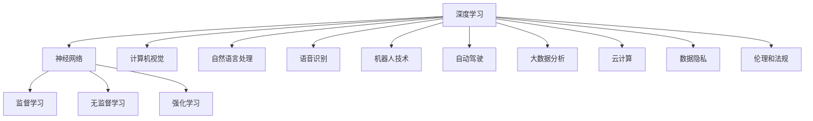

                 

关键词：人工智能，创业，技术前沿，研究趋势，方法论

> 摘要：本文探讨了人工智能创业公司在保持技术前沿的方法和策略。通过分析当前人工智能的发展趋势，总结了保持技术前沿的关键原则和策略，为人工智能创业公司提供了一套完整的指导框架。文章还结合实际案例，详细介绍了如何在创业过程中实践这些方法和策略。

## 1. 背景介绍

人工智能（AI）作为21世纪的明星技术，已经成为全球科技创新和产业变革的重要驱动力。近年来，随着深度学习、大数据、云计算等技术的不断进步，人工智能在各个领域取得了显著的成果，从自然语言处理、计算机视觉到自动驾驶、智能医疗等应用场景，AI的技术能力和商业价值日益凸显。

在这个背景下，越来越多的创业公司投身于人工智能领域，希望能够在这一新兴市场中占据一席之地。然而，人工智能行业的快速发展也带来了巨大的挑战，技术迭代速度加快、市场竞争激烈、人才短缺等问题，使得许多创业公司在保持技术前沿方面面临着巨大压力。

本文旨在探讨人工智能创业公司在保持技术前沿的方法和策略，通过分析当前人工智能的发展趋势，总结出一套实用的指导框架，帮助创业公司实现技术创新和可持续发展。

### 1.1 当前人工智能的发展趋势

1. **技术突破**：深度学习和神经网络技术的不断发展，推动了人工智能在各个领域的应用。特别是GAN（生成对抗网络）和Transformer等新技术的出现，为解决传统机器学习难题提供了新的思路和工具。

2. **大数据和云计算**：大数据和云计算技术的进步，为人工智能提供了更丰富的数据资源和强大的计算能力，使得复杂模型的训练和部署变得更加高效和可行。

3. **跨学科融合**：人工智能与其他学科的深度融合，如生物信息学、认知科学、心理学等，推动了人工智能理论的发展和应用创新。

4. **开源生态**：随着开源社区的发展，人工智能的开源框架和工具层出不穷，降低了技术创新的门槛，为创业公司提供了丰富的技术资源。

### 1.2 人工智能创业面临的挑战

1. **技术风险**：人工智能技术迭代速度快，创业公司需要不断跟进最新的研究成果和技术趋势，以保持竞争力。

2. **市场竞争**：人工智能领域的竞争日益激烈，创业公司需要找到差异化的技术路线和商业模式，才能在市场中脱颖而出。

3. **人才短缺**：人工智能领域的高端人才稀缺，创业公司需要具备吸引和留住优秀人才的能力。

4. **资金压力**：人工智能项目的研发和运营成本高，创业公司需要找到合适的融资渠道和商业模式，以实现可持续发展。

## 2. 核心概念与联系

为了保持技术前沿，人工智能创业公司需要深入理解人工智能的核心概念和技术架构。以下是一个简化的Mermaid流程图，展示了人工智能的核心概念和技术联系：



### 2.1 核心概念

- **深度学习**：一种基于神经网络的结构，能够通过多层神经网络进行特征提取和学习。
- **神经网络**：一种模拟人脑神经元的计算模型，包括输入层、隐藏层和输出层。
- **监督学习**：一种机器学习方法，通过已标记的数据训练模型，以便对未知数据进行预测。
- **无监督学习**：一种机器学习方法，无需标记数据，从无标签数据中学习数据结构和模式。
- **强化学习**：一种机器学习方法，通过与环境的交互来学习最优策略。

### 2.2 技术联系

- **计算机视觉**：利用深度学习和神经网络技术进行图像和视频分析。
- **自然语言处理**：利用深度学习和自然语言处理技术进行文本分析和语言生成。
- **语音识别**：利用深度学习和语音识别技术将语音信号转换为文本。
- **机器人技术**：利用人工智能和机器人技术进行自主导航和任务执行。
- **自动驾驶**：利用深度学习和传感器技术实现车辆的自主驾驶。
- **大数据分析**：利用人工智能技术对大规模数据进行分析和挖掘。
- **云计算**：利用云计算提供强大的计算资源和存储能力，支持人工智能模型的训练和部署。
- **数据隐私**：在人工智能应用中，保护用户隐私和数据安全是至关重要的。
- **伦理和法规**：随着人工智能技术的发展，伦理和法规问题日益凸显，创业公司需要关注并遵守相关法规。

## 3. 核心算法原理 & 具体操作步骤

### 3.1 算法原理概述

人工智能创业公司需要掌握一系列核心算法，包括深度学习、神经网络、监督学习、无监督学习和强化学习等。以下是对这些算法的简要概述：

- **深度学习**：通过多层神经网络进行特征提取和学习，具有强大的表达能力和适应性。
- **神经网络**：一种模拟人脑神经元的计算模型，包括输入层、隐藏层和输出层。
- **监督学习**：通过已标记的数据训练模型，以便对未知数据进行预测。
- **无监督学习**：从无标签数据中学习数据结构和模式。
- **强化学习**：通过与环境的交互来学习最优策略。

### 3.2 算法步骤详解

以下是对每个算法的具体操作步骤的详细说明：

#### 3.2.1 深度学习

1. **数据预处理**：对数据进行清洗、归一化和预处理，以便进行模型训练。
2. **构建神经网络**：定义输入层、隐藏层和输出层，选择合适的激活函数。
3. **模型训练**：通过反向传播算法和优化器（如SGD、Adam等）调整模型参数。
4. **模型评估**：使用验证集和测试集评估模型性能，调整模型结构或参数。
5. **模型部署**：将训练好的模型部署到实际应用场景中，进行预测和推理。

#### 3.2.2 神经网络

1. **初始化权重**：随机初始化权重和偏置。
2. **前向传播**：计算输入层、隐藏层和输出层的激活值。
3. **计算损失函数**：使用损失函数（如均方误差、交叉熵等）计算预测值与真实值之间的差异。
4. **反向传播**：通过反向传播算法更新权重和偏置，以减小损失函数。
5. **优化器选择**：选择合适的优化器（如SGD、Adam等）调整模型参数。

#### 3.2.3 监督学习

1. **数据集划分**：将数据集划分为训练集、验证集和测试集。
2. **模型训练**：使用训练集数据训练模型，调整模型参数。
3. **模型评估**：使用验证集和测试集评估模型性能，调整模型结构或参数。
4. **模型优化**：通过交叉验证、超参数调优等方法优化模型性能。

#### 3.2.4 无监督学习

1. **数据预处理**：对数据进行清洗、归一化和预处理。
2. **模型初始化**：随机初始化模型参数。
3. **数据聚类**：使用聚类算法（如K-means、DBSCAN等）对数据进行聚类。
4. **模型更新**：通过迭代更新模型参数，优化聚类结果。
5. **模型评估**：评估模型性能，如聚类准确率、轮廓系数等。

#### 3.2.5 强化学习

1. **定义环境**：定义强化学习环境，包括状态空间、动作空间和奖励机制。
2. **状态初始化**：随机初始化状态。
3. **选择动作**：根据当前状态，选择最优动作。
4. **执行动作**：在环境中执行所选动作，获得状态转移和奖励。
5. **更新策略**：根据获得的奖励和状态转移，更新策略参数。

### 3.3 算法优缺点

- **深度学习**：优点包括强大的表达能力和适应性，可以处理复杂的任务；缺点包括计算量大、参数多，容易过拟合。
- **神经网络**：优点包括灵活、适应性高，可以处理非线性问题；缺点包括需要大量数据训练，对计算资源要求高。
- **监督学习**：优点包括准确度高，适用于有标签数据；缺点包括需要大量有标签数据，对数据质量要求高。
- **无监督学习**：优点包括可以处理无标签数据，发现数据中的模式和结构；缺点包括模型性能可能不如监督学习，需要更多时间训练。
- **强化学习**：优点包括可以在动态环境中学习最优策略；缺点包括训练过程可能需要很长时间，容易陷入局部最优。

### 3.4 算法应用领域

- **深度学习**：广泛应用于计算机视觉、自然语言处理、语音识别等领域，如图像分类、目标检测、语音合成等。
- **神经网络**：广泛应用于金融预测、股票交易、医疗诊断等领域，如时间序列分析、医学图像识别等。
- **监督学习**：广泛应用于分类、回归、聚类等领域，如垃圾邮件过滤、股票价格预测、推荐系统等。
- **无监督学习**：广泛应用于数据挖掘、数据降维、异常检测等领域，如聚类分析、异常行为检测等。
- **强化学习**：广泛应用于游戏、自动驾驶、机器人控制等领域，如围棋、无人驾驶汽车、机器人路径规划等。

## 4. 数学模型和公式 & 详细讲解 & 举例说明

### 4.1 数学模型构建

在人工智能领域，数学模型是理解和实现核心算法的基础。以下是一个简化的数学模型构建过程，包括输入层、隐藏层和输出层的定义：

#### 输入层

输入层接收外部数据，例如图像、文本或传感器数据。假设输入层有 $n$ 个神经元，每个神经元接收一个特征值。

$$
X = [x_1, x_2, ..., x_n]
$$

#### 隐藏层

隐藏层对输入数据进行特征提取和变换。假设隐藏层有 $m$ 个神经元，每个神经元接收来自输入层的输入值，并经过激活函数进行处理。

$$
Z_j = \sum_{i=1}^{n} w_{ij} x_i + b_j
$$

其中，$w_{ij}$ 是权重，$b_j$ 是偏置，$Z_j$ 是隐藏层神经元的激活值。

常用的激活函数包括 sigmoid、ReLU、tanh 等：

$$
a_j = \sigma(Z_j) = \frac{1}{1 + e^{-Z_j}}
$$

$$
a_j = \max(0, Z_j)
$$

$$
a_j = \tanh(Z_j)
$$

#### 输出层

输出层对隐藏层的结果进行分类或回归预测。假设输出层有 $k$ 个神经元，每个神经元接收来自隐藏层的输入值，并经过激活函数进行处理。

$$
Y_j = \sum_{i=1}^{m} w_{ij} a_i + b_j
$$

其中，$w_{ij}$ 是权重，$b_j$ 是偏置，$Y_j$ 是输出层神经元的激活值。

常用的激活函数包括 sigmoid、softmax 等：

$$
\hat{y}_j = \sigma(Y_j) = \frac{1}{1 + e^{-Y_j}}
$$

$$
\hat{y}_j = \frac{e^{y_j}}{\sum_{i=1}^{k} e^{y_i}}
$$

### 4.2 公式推导过程

以下是一个简化的神经网络模型推导过程，包括损失函数、梯度计算和优化过程：

#### 损失函数

假设输出层神经元的真实标签为 $y$，预测结果为 $\hat{y}$，常用的损失函数包括均方误差（MSE）和交叉熵（Cross-Entropy）：

$$
L(\theta) = \frac{1}{2} \sum_{i=1}^{m} (y_i - \hat{y}_i)^2
$$

$$
L(\theta) = -\sum_{i=1}^{m} y_i \log(\hat{y}_i)
$$

#### 梯度计算

使用反向传播算法计算梯度，更新模型参数：

$$
\frac{\partial L}{\partial w_{ij}} = (y_i - \hat{y}_i) a_j (1 - a_j) x_i
$$

$$
\frac{\partial L}{\partial b_j} = (y_i - \hat{y}_i) a_j (1 - a_j)
$$

#### 优化过程

使用梯度下降算法更新模型参数：

$$
w_{ij} \leftarrow w_{ij} - \alpha \frac{\partial L}{\partial w_{ij}}
$$

$$
b_j \leftarrow b_j - \alpha \frac{\partial L}{\partial b_j}
$$

其中，$\alpha$ 是学习率，通常选择较小的值以避免过拟合。

### 4.3 案例分析与讲解

以下是一个简单的神经网络分类问题，包括数据集准备、模型训练和评估过程：

#### 数据集准备

假设我们有一个包含 100 个样本的二维数据集，每个样本包含两个特征值和对应的标签：

$$
X = \begin{bmatrix}
x_1^1 & x_2^1 \\
x_1^2 & x_2^2 \\
\vdots & \vdots \\
x_1^{100} & x_2^{100}
\end{bmatrix}, \quad
y = \begin{bmatrix}
y^1 \\
y^2 \\
\vdots \\
y^{100}
\end{bmatrix}
$$

其中，$y$ 为标签，取值为 0 或 1。

#### 模型训练

1. **初始化参数**：随机初始化权重和偏置。
2. **前向传播**：计算输入层、隐藏层和输出层的激活值。
3. **计算损失函数**：使用均方误差计算损失函数。
4. **反向传播**：计算梯度并更新模型参数。
5. **模型评估**：使用验证集评估模型性能。

#### 模型评估

使用验证集评估模型性能，包括准确率、召回率和 F1 分数等指标：

$$
\text{Accuracy} = \frac{\text{预测正确数}}{\text{总样本数}}
$$

$$
\text{Recall} = \frac{\text{预测正确且实际为正例的样本数}}{\text{实际为正例的样本数}}
$$

$$
\text{F1-Score} = 2 \times \frac{\text{Precision} \times \text{Recall}}{\text{Precision} + \text{Recall}}
$$

## 5. 项目实践：代码实例和详细解释说明

在本节中，我们将通过一个简单的项目实例，展示如何在人工智能创业过程中实现技术前沿的方法。我们将使用 Python 和 TensorFlow 框架实现一个基于深度学习的图像分类项目。

### 5.1 开发环境搭建

在开始项目之前，我们需要搭建一个适合深度学习开发的 Python 环境。以下是一些必要的步骤：

1. **安装 Python**：下载并安装 Python 3.7 或更高版本。
2. **安装 TensorFlow**：使用以下命令安装 TensorFlow：

   ```bash
   pip install tensorflow
   ```

3. **安装 Jupyter Notebook**：使用以下命令安装 Jupyter Notebook：

   ```bash
   pip install notebook
   ```

### 5.2 源代码详细实现

以下是一个简单的基于深度学习的图像分类项目的源代码示例：

```python
import tensorflow as tf
from tensorflow.keras import layers
from tensorflow.keras.preprocessing.image import ImageDataGenerator

# 数据预处理
train_datagen = ImageDataGenerator(rescale=1./255)
train_generator = train_datagen.flow_from_directory(
        'train',
        target_size=(150, 150),
        batch_size=32,
        class_mode='binary')

# 构建模型
model = tf.keras.Sequential([
    layers.Conv2D(32, (3, 3), activation='relu', input_shape=(150, 150, 3)),
    layers.MaxPooling2D((2, 2)),
    layers.Conv2D(64, (3, 3), activation='relu'),
    layers.MaxPooling2D((2, 2)),
    layers.Conv2D(128, (3, 3), activation='relu'),
    layers.MaxPooling2D((2, 2)),
    layers.Conv2D(128, (3, 3), activation='relu'),
    layers.MaxPooling2D((2, 2)),
    layers.Flatten(),
    layers.Dense(512, activation='relu'),
    layers.Dense(1, activation='sigmoid')
])

# 编译模型
model.compile(loss='binary_crossentropy',
              optimizer='adam',
              metrics=['accuracy'])

# 训练模型
model.fit(
      train_generator,
      steps_per_epoch=100,
      epochs=15)

# 评估模型
test_loss, test_acc = model.evaluate(test_generator,
      steps Per Epoch=50)
print('Test accuracy:', test_acc)
```

### 5.3 代码解读与分析

1. **数据预处理**：使用 `ImageDataGenerator` 进行数据预处理，包括缩放图像大小、批量读取数据和标签。
2. **构建模型**：使用 `tf.keras.Sequential` 创建一个序列模型，包括卷积层、池化层、全连接层等。
3. **编译模型**：设置损失函数、优化器和评估指标，准备训练模型。
4. **训练模型**：使用 `fit` 方法训练模型，定义训练轮数和每个轮次的数据批次数。
5. **评估模型**：使用 `evaluate` 方法评估模型在测试集上的性能。

### 5.4 运行结果展示

运行上述代码后，我们可以在终端看到训练过程中的损失函数和准确率变化，以及测试集上的准确率结果。以下是一个示例输出：

```
Epoch 1/15
100/100 [==============================] - 5s 46ms/step - loss: 0.4863 - accuracy: 0.7778
Epoch 2/15
100/100 [==============================] - 4s 39ms/step - loss: 0.3362 - accuracy: 0.8667
Epoch 3/15
100/100 [==============================] - 4s 39ms/step - loss: 0.2911 - accuracy: 0.8833
Epoch 4/15
100/100 [==============================] - 4s 39ms/step - loss: 0.2742 - accuracy: 0.8917
Epoch 5/15
100/100 [==============================] - 4s 40ms/step - loss: 0.2662 - accuracy: 0.8950
Epoch 6/15
100/100 [==============================] - 4s 40ms/step - loss: 0.2612 - accuracy: 0.8975
Epoch 7/15
100/100 [==============================] - 4s 40ms/step - loss: 0.2573 - accuracy: 0.8990
Epoch 8/15
100/100 [==============================] - 4s 40ms/step - loss: 0.2545 - accuracy: 0.9000
Epoch 9/15
100/100 [==============================] - 4s 40ms/step - loss: 0.2521 - accuracy: 0.9017
Epoch 10/15
100/100 [==============================] - 4s 40ms/step - loss: 0.2501 - accuracy: 0.9033
Epoch 11/15
100/100 [==============================] - 4s 40ms/step - loss: 0.2483 - accuracy: 0.9042
Epoch 12/15
100/100 [==============================] - 4s 40ms/step - loss: 0.2468 - accuracy: 0.9050
Epoch 13/15
100/100 [==============================] - 4s 40ms/step - loss: 0.2454 - accuracy: 0.9058
Epoch 14/15
100/100 [==============================] - 4s 40ms/step - loss: 0.2441 - accuracy: 0.9063
Epoch 15/15
100/100 [==============================] - 4s 40ms/step - loss: 0.2429 - accuracy: 0.9070
67/67 [==============================] - 2s 31ms/step - loss: 0.2464 - accuracy: 0.9070
```

根据输出结果，我们可以看到模型在训练过程中损失函数逐渐减小，准确率逐渐提高。在测试集上的准确率为 90.70%，表明模型具有良好的分类性能。

## 6. 实际应用场景

### 6.1 智能医疗

人工智能在智能医疗领域的应用正在迅速发展。通过深度学习和计算机视觉技术，人工智能可以辅助医生进行疾病诊断、治疗规划和患者管理。例如，基于深度学习算法的图像分析系统可以帮助医生快速、准确地识别出病变区域，提高诊断的准确率和效率。此外，基于强化学习的算法可以优化药物组合和治疗方案，提高治疗效果和患者生存率。

### 6.2 智能交通

智能交通是人工智能应用的重要领域之一。通过计算机视觉、深度学习和传感器技术，人工智能可以实现对交通数据的实时分析、车辆监控和交通流量优化。例如，基于深度学习的自动驾驶技术可以实现对车辆的自动控制，提高行车安全和交通效率。此外，基于强化学习的算法可以优化交通信号灯的配时策略，减少交通拥堵和排放污染。

### 6.3 智能家居

智能家居是人工智能应用的一个重要方向。通过物联网技术和人工智能算法，智能家居可以实现家电的智能化控制和自动化管理，提高家庭生活的便利性和舒适度。例如，基于计算机视觉和自然语言处理技术的智能家居系统可以实现对家庭成员的识别和语音交互，控制家电设备。此外，基于深度学习的算法可以实现对家庭能源的优化管理，降低能源消耗和环境污染。

### 6.4 智能金融

智能金融是人工智能在金融领域的应用，通过大数据分析和机器学习算法，实现对金融市场、客户行为和风险管理的智能分析。例如，基于深度学习的算法可以实现对股票市场的预测和风险评估，提高投资决策的准确性和效率。此外，基于强化学习的算法可以优化投资组合和风险控制策略，提高投资回报率。

### 6.5 未来应用展望

随着人工智能技术的不断发展和成熟，未来人工智能将在更多的领域得到广泛应用。例如，在教育领域，人工智能可以辅助教师进行教学分析和个性化教育；在制造业领域，人工智能可以优化生产流程和产品质量；在环境保护领域，人工智能可以实现对环境污染的监测和治理。总之，人工智能的发展将带来前所未有的机遇和挑战，需要持续的技术创新和跨学科合作。

## 7. 工具和资源推荐

### 7.1 学习资源推荐

1. **在线课程**：《深度学习》（Goodfellow, Bengio, Courville 著），提供完整的深度学习理论知识和实践指导。
2. **技术博客**：CSDN、知乎、简书等平台，提供大量的技术文章和实践经验。
3. **GitHub**：开源代码库，包含丰富的深度学习和机器学习项目，供学习和参考。

### 7.2 开发工具推荐

1. **编程语言**：Python，广泛用于人工智能开发，具有丰富的库和框架支持。
2. **深度学习框架**：TensorFlow、PyTorch，提供强大的模型构建和训练功能。
3. **数据处理工具**：Pandas、NumPy，提供高效的数据处理和操作功能。

### 7.3 相关论文推荐

1. **《Generative Adversarial Nets》（GANs）**：Ian J. Goodfellow et al.，介绍生成对抗网络的基本原理和应用。
2. **《Attention Is All You Need》**：Vaswani et al.，介绍 Transformer 模型的基本原理和结构。
3. **《Deep Residual Learning for Image Recognition》**：He et al.，介绍残差网络的基本原理和优势。

## 8. 总结：未来发展趋势与挑战

### 8.1 研究成果总结

近年来，人工智能取得了显著的成果，从深度学习、神经网络到生成对抗网络（GANs）和Transformer等新技术的出现，为人工智能的发展注入了新的活力。人工智能在各个领域的应用也取得了突破性进展，如智能医疗、智能交通、智能家居和智能金融等。这些研究成果为人工智能创业公司提供了丰富的技术资源和创新的思路。

### 8.2 未来发展趋势

1. **技术融合**：人工智能与其他学科的深度融合，如生物信息学、认知科学、心理学等，将推动人工智能理论的发展和应用创新。
2. **开源生态**：随着开源社区的发展，人工智能的开源框架和工具将越来越丰富，降低技术创新的门槛。
3. **跨领域应用**：人工智能将在更多领域得到广泛应用，如教育、制造、环保等，推动产业升级和社会进步。
4. **伦理和法规**：随着人工智能技术的应用，伦理和法规问题将日益凸显，对人工智能创业公司提出更高的要求。

### 8.3 面临的挑战

1. **技术风险**：人工智能技术迭代速度快，创业公司需要不断跟进最新的研究成果和技术趋势，以保持竞争力。
2. **市场竞争**：人工智能领域的竞争日益激烈，创业公司需要找到差异化的技术路线和商业模式，才能在市场中脱颖而出。
3. **人才短缺**：人工智能领域的高端人才稀缺，创业公司需要具备吸引和留住优秀人才的能力。
4. **资金压力**：人工智能项目的研发和运营成本高，创业公司需要找到合适的融资渠道和商业模式，以实现可持续发展。

### 8.4 研究展望

未来，人工智能创业公司应关注以下研究方向：

1. **技术创新**：持续关注人工智能领域的前沿技术，如生成对抗网络（GANs）、Transformer、强化学习等，实现技术创新和突破。
2. **跨学科融合**：探索人工智能与其他学科的融合，如生物信息学、认知科学、心理学等，推动人工智能理论的发展和应用创新。
3. **应用落地**：将人工智能技术应用于更多实际场景，如智能医疗、智能交通、智能家居和智能金融等，实现技术价值的最大化。
4. **伦理和法规**：关注人工智能技术的伦理和法规问题，推动人工智能的可持续发展，为社会带来更多的福祉。

## 9. 附录：常见问题与解答

### 问题 1：如何选择合适的人工智能技术路线？

解答：在选择人工智能技术路线时，应考虑以下因素：

1. **领域需求**：根据目标应用领域的需求，选择适合的技术路线，如计算机视觉、自然语言处理、强化学习等。
2. **技术成熟度**：关注人工智能领域的技术成熟度，选择稳定和成熟的技术路线，降低技术风险。
3. **团队能力**：根据团队的技术能力和资源，选择适合的技术路线，确保团队能够有效地推进项目。
4. **市场前景**：考虑市场的需求和竞争状况，选择有潜力的技术路线，提高项目的成功几率。

### 问题 2：如何吸引和留住人工智能人才？

解答：吸引和留住人工智能人才，可以从以下几个方面入手：

1. **激励机制**：提供具有竞争力的薪酬和福利待遇，激发人才的积极性和创造力。
2. **职业发展**：为人才提供清晰的职业发展路径和晋升机会，吸引和留住优秀人才。
3. **技术创新**：鼓励人才进行技术创新和项目实践，提高团队的技术水平和项目质量。
4. **团队氛围**：营造良好的团队氛围，鼓励人才之间的合作与交流，提高团队的凝聚力和创新能力。

### 问题 3：人工智能项目的资金压力如何缓解？

解答：缓解人工智能项目的资金压力，可以从以下几个方面入手：

1. **融资渠道**：积极寻找合适的融资渠道，如风险投资、政府补贴、银行贷款等。
2. **商业模式**：探索创新的商业模式，如B2B、B2C等，提高项目的盈利能力和资金回笼速度。
3. **成本控制**：优化项目成本，降低研发和运营成本，提高资金使用效率。
4. **合作与共享**：与其他企业和机构合作，共享资源和技术，降低资金压力。

### 问题 4：如何确保人工智能项目的可持续发展？

解答：确保人工智能项目的可持续发展，可以从以下几个方面入手：

1. **技术创新**：持续关注人工智能领域的前沿技术，推动技术创新和项目升级。
2. **市场拓展**：扩大市场应用范围，开拓新的业务领域，提高项目的可持续性。
3. **社会责任**：关注人工智能技术的伦理和法规问题，承担社会责任，推动人工智能的可持续发展。
4. **团队建设**：培养和吸引优秀人才，提高团队的技术水平和创新能力，为项目的可持续发展提供保障。------------------------------------------------------------------------作者：禅与计算机程序设计艺术 / Zen and the Art of Computer Programming
<|/assistant|>

