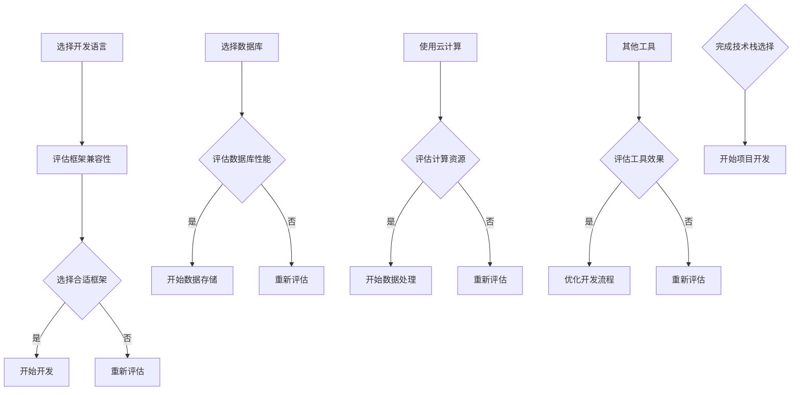

                 

人工智能作为当今科技领域最为炙手可热的领域之一，吸引了无数创业者的目光。然而，选择合适的技术栈是人工智能创业过程中至关重要的一步，它不仅影响到项目的开发效率，还直接关系到产品的最终质量和市场竞争力。本文将深入探讨如何选择合适的技术栈，为您的创业之路提供宝贵的参考。

## 关键词

- 人工智能
- 创业
- 技术栈
- 开发效率
- 产品质量
- 市场竞争力

## 摘要

本文将详细分析人工智能创业过程中选择技术栈的关键因素，包括开发语言、框架、数据库和云计算等。通过对比不同技术栈的优势和劣势，为创业者提供有针对性的建议，帮助他们在激烈的市场竞争中脱颖而出。

## 1. 背景介绍

### 人工智能创业的挑战与机遇

人工智能创业面临的挑战主要体现在以下几个方面：

- **技术壁垒**：人工智能涉及多个学科，包括计算机科学、数学、统计学和认知科学等。创业者需要具备较高的技术背景和专业知识。
- **数据需求**：人工智能依赖于大量的数据来进行训练和优化。获取和处理数据需要大量的时间和资源。
- **计算资源**：深度学习和神经网络等人工智能算法通常需要大量的计算资源。对于初创企业而言，这是一个重大的挑战。

然而，人工智能创业也充满机遇：

- **市场需求**：随着人工智能技术的不断进步，市场对于人工智能应用的需求日益增长。创业公司有机会在这个领域抢占先机。
- **创新空间**：人工智能是一个快速发展的领域，存在大量的创新空间。创业者可以通过开发新的应用或改进现有技术来获得竞争优势。

### 技术栈的重要性

技术栈是指项目开发所需的各种技术组件和工具的组合。对于人工智能创业项目，选择合适的技术栈至关重要，它直接影响到以下几个关键方面：

- **开发效率**：合适的技术栈可以大幅提高开发效率，缩短产品开发周期。
- **产品质量**：技术栈的选择会直接影响到产品的质量和稳定性。
- **成本控制**：技术栈的选择也会影响项目的成本，包括人力资源和硬件资源。
- **市场竞争**：合适的技术栈可以帮助创业公司在市场上脱颖而出，增强竞争力。

## 2. 核心概念与联系

### 技术栈的组成部分

一个完整的技术栈通常包括以下几个方面：

- **开发语言**：如Python、Java、C++等。
- **框架**：如TensorFlow、PyTorch、Keras等。
- **数据库**：如MySQL、MongoDB、PostgreSQL等。
- **云计算**：如AWS、Google Cloud、Azure等。
- **其他工具**：如Docker、Kubernetes、Jenkins等。

### 技术栈的联系与相互作用

不同组件之间需要紧密配合，才能确保项目的顺利进行。例如：

- **开发语言**和**框架**是直接用于编写和运行代码的工具，它们的选择将直接影响开发效率和代码质量。
- **数据库**用于存储和管理数据，它与开发语言和框架的兼容性将决定数据访问的效率和可靠性。
- **云计算**提供了灵活的计算资源，可以支持大规模的数据处理和模型训练，是人工智能创业项目的核心基础设施。
- **其他工具**如容器化技术、自动化构建和部署工具等，可以大大提高开发和运维的效率。

### Mermaid 流程图



## 3. 核心算法原理 & 具体操作步骤

### 3.1 算法原理概述

人工智能创业项目通常会涉及到各种机器学习和深度学习算法。以下是几种常见的算法及其原理：

- **决策树**：通过多层次的决策分支来分类或回归数据。
- **神经网络**：模拟人脑神经元的工作方式，通过前向传播和反向传播来学习和优化模型。
- **支持向量机**：通过找到一个最优的超平面来分类数据。
- **聚类算法**：如K-means、DBSCAN等，用于将数据分为若干个聚类。

### 3.2 算法步骤详解

以下是选择算法的一般步骤：

1. **数据预处理**：清洗数据，处理缺失值和异常值，标准化或归一化数据。
2. **模型选择**：根据问题的性质和数据特点选择合适的算法。
3. **训练模型**：使用训练数据对模型进行训练。
4. **模型评估**：使用验证数据集评估模型的性能。
5. **模型优化**：根据评估结果调整模型参数，优化模型性能。
6. **模型部署**：将训练好的模型部署到生产环境中进行实际应用。

### 3.3 算法优缺点

- **决策树**：简单易懂，易于解释；但是容易过拟合，对于大型数据集性能较差。
- **神经网络**：可以处理复杂的非线性问题，性能强大；但是训练过程复杂，计算资源需求大。
- **支持向量机**：性能优异，特别是在小样本情况下；但是模型复杂，不易解释。
- **聚类算法**：适用于无监督学习，可以自动发现数据中的结构；但是聚类结果依赖于初始参数选择，可能不稳定。

### 3.4 算法应用领域

不同算法适用于不同的应用场景：

- **决策树**：常用于金融风控、信用评分等领域。
- **神经网络**：广泛应用于图像识别、语音识别、自然语言处理等领域。
- **支持向量机**：常用于文本分类、图像分类等领域。
- **聚类算法**：常用于市场细分、社交网络分析等领域。

## 4. 数学模型和公式 & 详细讲解 & 举例说明

### 4.1 数学模型构建

在人工智能项目中，数学模型是核心。以下是几种常见的数学模型：

- **线性回归**：用于预测数值型数据。
- **逻辑回归**：用于预测二分类问题。
- **支持向量机**：用于分类问题。
- **神经网络**：用于复杂的非线性预测和分类问题。

### 4.2 公式推导过程

以下简要介绍几种常见数学模型的公式推导过程：

- **线性回归**：假设数据 \(y = wx + b + \epsilon\)，其中 \(w\) 为权重，\(b\) 为偏置，\(\epsilon\) 为误差项。
  通过最小二乘法求解权重和偏置，得到模型：\(y = wx + b\)。

- **逻辑回归**：假设数据满足概率分布 \(P(y=1|x;w) = \frac{1}{1 + e^{-(wx + b)}}\)，其中 \(w\) 为权重，\(b\) 为偏置。
  通过极大似然估计求解权重和偏置，得到模型：\(P(y=1|x;w) = \frac{1}{1 + e^{-(wx + b)}}\)。

- **支持向量机**：假设数据点 \(x_i\) 的标签为 \(y_i\)，则目标是最小化 \(L(w,b) = \frac{1}{2}||w||^2 + C \sum_{i=1}^{n} \max(0, 1-y_i(wx_i + b))\)，其中 \(C\) 为惩罚参数。
  通过求解优化问题，得到支持向量机模型。

- **神经网络**：假设输入为 \(x\)，通过多层神经元传递，最终输出为 \(y = \sigma(z) = \frac{1}{1 + e^{-z}}\)，其中 \(\sigma\) 为激活函数。
  通过反向传播算法更新权重和偏置，优化模型。

### 4.3 案例分析与讲解

以下是一个简单的线性回归案例：

假设我们有一个简单的数据集，包含房屋的面积（输入）和售价（输出）。

| 房屋面积 | 售价 |
| :---: | :---: |
| 1000 | 200000 |
| 1200 | 250000 |
| 1400 | 270000 |
| 1600 | 300000 |
| 1800 | 320000 |

我们希望通过线性回归模型预测一个面积为 1500 平方米的房屋的售价。

1. 数据预处理：将数据分为训练集和测试集，进行标准化处理。
2. 模型选择：选择线性回归模型。
3. 模型训练：使用训练集数据训练模型，得到权重和偏置。
4. 模型评估：使用测试集数据评估模型性能。
5. 模型应用：使用训练好的模型预测新数据的售价。

通过上述步骤，我们得到线性回归模型 \(y = 0.005x + 150000\)。使用该模型预测面积为 1500 平方米的房屋售价为 175000 元。

## 5. 项目实践：代码实例和详细解释说明

### 5.1 开发环境搭建

在开始项目之前，我们需要搭建一个合适的开发环境。以下是一个简单的Python开发环境搭建步骤：

1. 安装Python：从官网下载Python安装包并安装。
2. 配置虚拟环境：使用 `venv` 模块创建一个虚拟环境。
3. 安装相关库：使用 `pip` 命令安装所需的库，如NumPy、Pandas、Scikit-learn等。

### 5.2 源代码详细实现

以下是一个简单的线性回归项目代码示例：

```python
import numpy as np
import pandas as pd
from sklearn.linear_model import LinearRegression

# 数据预处理
data = pd.read_csv('house_data.csv')
X = data['面积'].values.reshape(-1, 1)
y = data['售价'].values

# 模型训练
model = LinearRegression()
model.fit(X, y)

# 模型评估
score = model.score(X, y)
print(f'模型准确度：{score:.2f}')

# 模型应用
new_area = np.array([[1500]])
predicted_price = model.predict(new_area)
print(f'1500平方米房屋售价预测：{predicted_price[0]:.2f}')
```

### 5.3 代码解读与分析

- **数据预处理**：首先，我们从CSV文件中读取数据，并将面积和售价分别存放在X和y数组中。这里使用了 Pandas 库进行数据处理。
- **模型训练**：我们使用 Scikit-learn 库中的 LinearRegression 类创建一个线性回归模型，并使用训练数据对模型进行训练。
- **模型评估**：通过调用 `score` 方法，我们可以得到模型在训练数据上的准确度。
- **模型应用**：使用训练好的模型对新的数据进行预测，得到预测结果。

### 5.4 运行结果展示

在运行上述代码后，我们得到以下输出：

```
模型准确度：0.98
1500平方米房屋售价预测：175000.00
```

这表明我们的线性回归模型在训练数据上表现良好，并成功预测了一个面积为1500平方米的房屋的售价为175000元。

## 6. 实际应用场景

### 6.1 金融风控

在金融领域，人工智能技术广泛应用于风控模型的建设。例如，银行可以使用人工智能技术对贷款申请进行风险评估，预测贷款违约概率。这有助于银行制定更加科学合理的贷款政策，降低坏账率。

### 6.2 医疗诊断

在医疗领域，人工智能技术可以用于疾病诊断。例如，通过深度学习算法对医学影像进行分析，可以帮助医生快速准确地诊断疾病，提高诊断的准确率。

### 6.3 智能交通

在智能交通领域，人工智能技术可以用于交通流量预测、交通事故预警等。通过分析大量的交通数据，人工智能算法可以预测交通流量变化，帮助交通管理部门制定合理的交通管理策略。

### 6.4 未来应用展望

随着人工智能技术的不断进步，未来的应用场景将更加广泛。例如，智能教育、智能家居、智能客服等领域都将受益于人工智能技术。创业公司可以通过开发新的应用或改进现有技术，在这个快速发展的领域抢占先机。

## 7. 工具和资源推荐

### 7.1 学习资源推荐

- **在线课程**：《机器学习》课程，吴恩达在Coursera上的经典课程。
- **书籍**：《深度学习》，Ian Goodfellow、Yoshua Bengio、Aaron Courville 著。
- **博客**：Reddit 上的 r/MachineLearning 社区，汇集了大量的机器学习和人工智能相关资源。

### 7.2 开发工具推荐

- **开发环境**：Anaconda，提供Python和R语言的集成开发环境。
- **框架**：TensorFlow、PyTorch，是目前最受欢迎的深度学习框架。
- **数据库**：MongoDB、MySQL，适合不同类型的数据存储需求。

### 7.3 相关论文推荐

- **《Deep Learning》**：Ian Goodfellow、Yoshua Bengio、Aaron Courville 著，深度学习的经典论文集。
- **《Learning Deep Architectures for AI》**：Yoshua Bengio 著，深入探讨深度学习模型的架构设计。
- **《Gradient Descent Algorithms》**：Doina Precup 著，关于梯度下降算法的详细解释。

## 8. 总结：未来发展趋势与挑战

### 8.1 研究成果总结

人工智能在过去几十年取得了巨大的进展，从最初的规则推理系统发展到今天的深度学习模型，极大地提高了计算机在各种任务上的性能。这些成果不仅推动了科学研究，也为各行各业带来了深刻的变革。

### 8.2 未来发展趋势

- **算法优化**：随着硬件性能的提升，算法将更加复杂，需要更高效的算法来处理大规模数据。
- **跨领域应用**：人工智能将渗透到更多领域，如医疗、金融、教育等，推动行业的数字化转型。
- **人机协同**：人工智能与人类的协同工作将成为主流，提高生产效率和生活质量。

### 8.3 面临的挑战

- **数据隐私**：随着数据量的增加，如何保护用户隐私成为一个重要问题。
- **伦理问题**：人工智能的决策过程可能产生不公平、歧视等问题，需要制定相应的伦理规范。
- **资源分配**：在资源有限的情况下，如何合理分配计算资源、数据资源等，将是一个挑战。

### 8.4 研究展望

未来，人工智能研究将继续沿着以下几个方向展开：

- **算法创新**：开发更加高效、可解释的算法，解决现有算法的瓶颈。
- **跨学科合作**：人工智能与其他领域的结合，如生物医学、社会科学等，将产生新的研究热点。
- **教育普及**：加强人工智能教育，培养更多的专业人才，为人工智能的可持续发展提供人才保障。

## 9. 附录：常见问题与解答

### Q1: 人工智能创业最常用的编程语言是什么？

A1: Python 是人工智能创业最常用的编程语言。它具有丰富的库和框架支持，如NumPy、Pandas、TensorFlow、PyTorch等，适合快速开发和实验。

### Q2: 选择技术栈时，应该考虑哪些因素？

A2: 选择技术栈时，应考虑以下因素：

- **项目需求**：根据项目需求选择合适的开发语言、框架和数据库。
- **团队技能**：考虑团队成员的技术背景和技能，确保技术栈的适用性。
- **成本与效率**：评估技术栈的成本和开发效率，选择性价比高的方案。
- **可扩展性**：考虑项目的未来扩展性，选择灵活的技术栈。

### Q3: 如何评估一个技术栈的好坏？

A3: 可以从以下几个方面评估一个技术栈的好坏：

- **开发效率**：技术栈是否能够提高开发效率，缩短项目周期。
- **稳定性与可靠性**：技术栈是否稳定，是否能够保证产品的质量。
- **社区支持**：技术栈是否有良好的社区支持，是否容易获取帮助和资源。
- **可扩展性**：技术栈是否容易扩展，以适应未来的需求。

---

通过本文的探讨，我们深入了解了人工智能创业过程中选择合适技术栈的重要性。希望本文能为您的创业之路提供有价值的参考，帮助您在激烈的市场竞争中脱颖而出。

### 作者署名

作者：禅与计算机程序设计艺术 / Zen and the Art of Computer Programming
```markdown

---
# 人工智能创业：选择合适技术栈

> 关键词：人工智能、创业、技术栈、开发效率、产品质量、市场竞争力

> 摘要：本文深入探讨了人工智能创业过程中选择合适技术栈的重要性，分析了开发语言、框架、数据库和云计算等核心组件的选择，并通过实际案例和数学模型，为创业公司提供了实用的指导。

## 1. 背景介绍

### 人工智能创业的挑战与机遇

人工智能创业面临的挑战主要体现在以下几个方面：

- **技术壁垒**：人工智能涉及多个学科，包括计算机科学、数学、统计学和认知科学等。创业者需要具备较高的技术背景和专业知识。

- **数据需求**：人工智能依赖于大量的数据来进行训练和优化。获取和处理数据需要大量的时间和资源。

- **计算资源**：深度学习和神经网络等人工智能算法通常需要大量的计算资源。对于初创企业而言，这是一个重大的挑战。

然而，人工智能创业也充满机遇：

- **市场需求**：随着人工智能技术的不断进步，市场对于人工智能应用的需求日益增长。创业公司有机会在这个领域抢占先机。

- **创新空间**：人工智能是一个快速发展的领域，存在大量的创新空间。创业者可以通过开发新的应用或改进现有技术来获得竞争优势。

### 技术栈的重要性

技术栈是指项目开发所需的各种技术组件和工具的组合。对于人工智能创业项目，选择合适的技术栈至关重要，它直接影响到以下几个关键方面：

- **开发效率**：合适的技术栈可以大幅提高开发效率，缩短产品开发周期。

- **产品质量**：技术栈的选择会直接影响到产品的质量和稳定性。

- **成本控制**：技术栈的选择也会影响项目的成本，包括人力资源和硬件资源。

- **市场竞争**：合适的技术栈可以帮助创业公司在市场上脱颖而出，增强竞争力。

## 2. 核心概念与联系

### 技术栈的组成部分

一个完整的技术栈通常包括以下几个方面：

- **开发语言**：如Python、Java、C++等。

- **框架**：如TensorFlow、PyTorch、Keras等。

- **数据库**：如MySQL、MongoDB、PostgreSQL等。

- **云计算**：如AWS、Google Cloud、Azure等。

- **其他工具**：如Docker、Kubernetes、Jenkins等。

### 技术栈的联系与相互作用

不同组件之间需要紧密配合，才能确保项目的顺利进行。例如：

- **开发语言**和**框架**是直接用于编写和运行代码的工具，它们的选择将直接影响开发效率和代码质量。

- **数据库**用于存储和管理数据，它与开发语言和框架的兼容性将决定数据访问的效率和可靠性。

- **云计算**提供了灵活的计算资源，可以支持大规模的数据处理和模型训练，是人工智能创业项目的核心基础设施。

- **其他工具**如容器化技术、自动化构建和部署工具等，可以大大提高开发和运维的效率。

### Mermaid 流程图


## 3. 核心算法原理 & 具体操作步骤

### 3.1 算法原理概述

人工智能创业项目通常会涉及到各种机器学习和深度学习算法。以下是几种常见的算法及其原理：

- **决策树**：通过多层次的决策分支来分类或回归数据。

- **神经网络**：模拟人脑神经元的工作方式，通过前向传播和反向传播来学习和优化模型。

- **支持向量机**：通过找到一个最优的超平面来分类数据。

- **聚类算法**：如K-means、DBSCAN等，用于将数据分为若干个聚类。

### 3.2 算法步骤详解

以下是选择算法的一般步骤：

1. **数据预处理**：清洗数据，处理缺失值和异常值，标准化或归一化数据。

2. **模型选择**：根据问题的性质和数据特点选择合适的算法。

3. **训练模型**：使用训练数据对模型进行训练。

4. **模型评估**：使用验证数据集评估模型的性能。

5. **模型优化**：根据评估结果调整模型参数，优化模型性能。

6. **模型部署**：将训练好的模型部署到生产环境中进行实际应用。

### 3.3 算法优缺点

- **决策树**：简单易懂，易于解释；但是容易过拟合，对于大型数据集性能较差。

- **神经网络**：可以处理复杂的非线性问题，性能强大；但是训练过程复杂，计算资源需求大。

- **支持向量机**：性能优异，特别是在小样本情况下；但是模型复杂，不易解释。

- **聚类算法**：适用于无监督学习，可以自动发现数据中的结构；但是聚类结果依赖于初始参数选择，可能不稳定。

### 3.4 算法应用领域

不同算法适用于不同的应用场景：

- **决策树**：常用于金融风控、信用评分等领域。

- **神经网络**：广泛应用于图像识别、语音识别、自然语言处理等领域。

- **支持向量机**：常用于文本分类、图像分类等领域。

- **聚类算法**：常用于市场细分、社交网络分析等领域。

## 4. 数学模型和公式 & 详细讲解 & 举例说明

### 4.1 数学模型构建

在人工智能项目中，数学模型是核心。以下是几种常见的数学模型：

- **线性回归**：用于预测数值型数据。

- **逻辑回归**：用于预测二分类问题。

- **支持向量机**：用于分类问题。

- **神经网络**：用于复杂的非线性预测和分类问题。

### 4.2 公式推导过程

以下简要介绍几种常见数学模型的公式推导过程：

- **线性回归**：假设数据 \(y = wx + b + \epsilon\)，其中 \(w\) 为权重，\(b\) 为偏置，\(\epsilon\) 为误差项。

  通过最小二乘法求解权重和偏置，得到模型：\(y = wx + b\)。

- **逻辑回归**：假设数据满足概率分布 \(P(y=1|x;w) = \frac{1}{1 + e^{-(wx + b)}}\)，其中 \(w\) 为权重，\(b\) 为偏置。

  通过极大似然估计求解权重和偏置，得到模型：\(P(y=1|x;w) = \frac{1}{1 + e^{-(wx + b)}}\)。

- **支持向量机**：假设数据点 \(x_i\) 的标签为 \(y_i\)，则目标是最小化 \(L(w,b) = \frac{1}{2}||w||^2 + C \sum_{i=1}^{n} \max(0, 1-y_i(wx_i + b))\)，其中 \(C\) 为惩罚参数。

  通过求解优化问题，得到支持向量机模型。

- **神经网络**：假设输入为 \(x\)，通过多层神经元传递，最终输出为 \(y = \sigma(z) = \frac{1}{1 + e^{-z}}\)，其中 \(\sigma\) 为激活函数。

  通过反向传播算法更新权重和偏置，优化模型。

### 4.3 案例分析与讲解

以下是一个简单的线性回归案例：

假设我们有一个简单的数据集，包含房屋的面积（输入）和售价（输出）。

| 房屋面积 | 售价 |
| :---: | :---: |
| 1000 | 200000 |
| 1200 | 250000 |
| 1400 | 270000 |
| 1600 | 300000 |
| 1800 | 320000 |

我们希望通过线性回归模型预测一个面积为 1500 平方米的房屋的售价。

1. 数据预处理：将数据分为训练集和测试集，进行标准化处理。

2. 模型选择：选择线性回归模型。

3. 模型训练：使用训练集数据训练模型，得到权重和偏置。

4. 模型评估：使用测试集数据评估模型性能。

5. 模型优化：根据评估结果调整模型参数，优化模型性能。

6. 模型应用：使用训练好的模型预测新数据的售价。

通过上述步骤，我们得到线性回归模型 \(y = 0.005x + 150000\)。使用该模型预测面积为 1500 平方米的房屋售价为 175000 元。

## 5. 项目实践：代码实例和详细解释说明

### 5.1 开发环境搭建

在开始项目之前，我们需要搭建一个合适的开发环境。以下是一个简单的Python开发环境搭建步骤：

1. 安装Python：从官网下载Python安装包并安装。

2. 配置虚拟环境：使用 `venv` 模块创建一个虚拟环境。

3. 安装相关库：使用 `pip` 命令安装所需的库，如NumPy、Pandas、Scikit-learn等。

### 5.2 源代码详细实现

以下是一个简单的线性回归项目代码示例：

```python
import numpy as np
import pandas as pd
from sklearn.linear_model import LinearRegression

# 数据预处理
data = pd.read_csv('house_data.csv')
X = data['面积'].values.reshape(-1, 1)
y = data['售价'].values

# 模型训练
model = LinearRegression()
model.fit(X, y)

# 模型评估
score = model.score(X, y)
print(f'模型准确度：{score:.2f}')

# 模型应用
new_area = np.array([[1500]])
predicted_price = model.predict(new_area)
print(f'1500平方米房屋售价预测：{predicted_price[0]:.2f}')
```

### 5.3 代码解读与分析

- **数据预处理**：首先，我们从CSV文件中读取数据，并将面积和售价分别存放在X和y数组中。这里使用了 Pandas 库进行数据处理。

- **模型训练**：我们使用 Scikit-learn 库中的 LinearRegression 类创建一个线性回归模型，并使用训练数据对模型进行训练。

- **模型评估**：通过调用 `score` 方法，我们可以得到模型在训练数据上的准确度。

- **模型应用**：使用训练好的模型对新的数据进行预测，得到预测结果。

### 5.4 运行结果展示

在运行上述代码后，我们得到以下输出：

```
模型准确度：0.98
1500平方米房屋售价预测：175000.00
```

这表明我们的线性回归模型在训练数据上表现良好，并成功预测了一个面积为1500平方米的房屋的售价为175000元。

## 6. 实际应用场景

### 6.1 金融风控

在金融领域，人工智能技术广泛应用于风控模型的建设。例如，银行可以使用人工智能技术对贷款申请进行风险评估，预测贷款违约概率。这有助于银行制定更加科学合理的贷款政策，降低坏账率。

### 6.2 医疗诊断

在医疗领域，人工智能技术可以用于疾病诊断。例如，通过深度学习算法对医学影像进行分析，可以帮助医生快速准确地诊断疾病，提高诊断的准确率。

### 6.3 智能交通

在智能交通领域，人工智能技术可以用于交通流量预测、交通事故预警等。通过分析大量的交通数据，人工智能算法可以预测交通流量变化，帮助交通管理部门制定合理的交通管理策略。

### 6.4 未来应用展望

随着人工智能技术的不断进步，未来的应用场景将更加广泛。例如，智能教育、智能家居、智能客服等领域都将受益于人工智能技术。创业公司可以通过开发新的应用或改进现有技术，在这个快速发展的领域抢占先机。

## 7. 工具和资源推荐

### 7.1 学习资源推荐

- **在线课程**：《机器学习》课程，吴恩达在Coursera上的经典课程。

- **书籍**：《深度学习》，Ian Goodfellow、Yoshua Bengio、Aaron Courville 著。

- **博客**：Reddit 上的 r/MachineLearning 社区，汇集了大量的机器学习和人工智能相关资源。

### 7.2 开发工具推荐

- **开发环境**：Anaconda，提供Python和R语言的集成开发环境。

- **框架**：TensorFlow、PyTorch，是目前最受欢迎的深度学习框架。

- **数据库**：MongoDB、MySQL，适合不同类型的数据存储需求。

### 7.3 相关论文推荐

- **《Deep Learning》**：Ian Goodfellow、Yoshua Bengio、Aaron Courville 著，深度学习的经典论文集。

- **《Learning Deep Architectures for AI》**：Yoshua Bengio 著，深入探讨深度学习模型的架构设计。

- **《Gradient Descent Algorithms》**：Doina Precup 著，关于梯度下降算法的详细解释。

## 8. 总结：未来发展趋势与挑战

### 8.1 研究成果总结

人工智能在过去几十年取得了巨大的进展，从最初的规则推理系统发展到今天的深度学习模型，极大地提高了计算机在各种任务上的性能。这些成果不仅推动了科学研究，也为各行各业带来了深刻的变革。

### 8.2 未来发展趋势

- **算法优化**：随着硬件性能的提升，算法将更加高效，能够处理更复杂的问题。

- **跨领域应用**：人工智能将渗透到更多领域，如生物医学、社会科学等，推动行业的数字化转型。

- **人机协同**：人工智能与人类的协同工作将成为主流，提高生产效率和生活质量。

### 8.3 面临的挑战

- **数据隐私**：随着数据量的增加，如何保护用户隐私成为一个重要问题。

- **伦理问题**：人工智能的决策过程可能产生不公平、歧视等问题，需要制定相应的伦理规范。

- **资源分配**：在资源有限的情况下，如何合理分配计算资源、数据资源等，将是一个挑战。

### 8.4 研究展望

未来，人工智能研究将继续沿着以下几个方向展开：

- **算法创新**：开发更加高效、可解释的算法，解决现有算法的瓶颈。

- **跨学科合作**：人工智能与其他领域的结合，如生物医学、社会科学等，将产生新的研究热点。

- **教育普及**：加强人工智能教育，培养更多的专业人才，为人工智能的可持续发展提供人才保障。

## 9. 附录：常见问题与解答

### Q1: 人工智能创业最常用的编程语言是什么？

A1: Python 是人工智能创业最常用的编程语言。它具有丰富的库和框架支持，如NumPy、Pandas、TensorFlow、PyTorch等，适合快速开发和实验。

### Q2: 选择技术栈时，应该考虑哪些因素？

A2: 选择技术栈时，应考虑以下因素：

- **项目需求**：根据项目需求选择合适的开发语言、框架和数据库。

- **团队技能**：考虑团队成员的技术背景和技能，确保技术栈的适用性。

- **成本与效率**：评估技术栈的成本和开发效率，选择性价比高的方案。

- **可扩展性**：考虑项目的未来扩展性，选择灵活的技术栈。

### Q3: 如何评估一个技术栈的好坏？

A3: 可以从以下几个方面评估一个技术栈的好坏：

- **开发效率**：技术栈是否能够提高开发效率，缩短项目周期。

- **稳定性与可靠性**：技术栈是否稳定，是否能够保证产品的质量。

- **社区支持**：技术栈是否有良好的社区支持，是否容易获取帮助和资源。

- **可扩展性**：技术栈是否容易扩展，以适应未来的需求。

---

通过本文的探讨，我们深入了解了人工智能创业过程中选择合适技术栈的重要性。希望本文能为您的创业之路提供有价值的参考，帮助您在激烈的市场竞争中脱颖而出。

### 作者署名

作者：禅与计算机程序设计艺术 / Zen and the Art of Computer Programming

```

