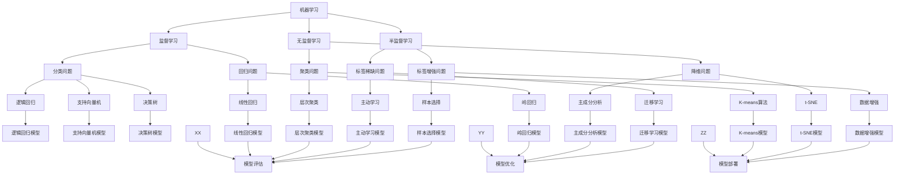

                 

人工智能（AI）已经逐渐成为科技领域的主流话题，它的影响力波及各个行业，从医疗到金融，从自动驾驶到智能家居，AI 无处不在。本文将深入探讨人工智能的基本原理，并通过具体代码实例，帮助读者更好地理解 AI 的应用和实践。本文的目标是提供一个全面而深入的视角，让读者不仅了解 AI 的原理，还能亲自动手实践，体验 AI 的魅力。

本文将分为以下几个部分：

1. **背景介绍**：介绍人工智能的发展历史、现状和未来趋势。
2. **核心概念与联系**：阐述人工智能的关键概念，并通过 Mermaid 流程图展示其架构。
3. **核心算法原理 & 具体操作步骤**：详细介绍几种常用的 AI 算法，包括原理、步骤、优缺点和应用领域。
4. **数学模型和公式 & 详细讲解 & 举例说明**：讲解 AI 中常用的数学模型和公式，并通过具体案例进行说明。
5. **项目实践：代码实例和详细解释说明**：提供实际代码实例，讲解如何实现 AI 算法。
6. **实际应用场景**：探讨 AI 在不同领域的应用。
7. **未来应用展望**：预测 AI 的未来发展方向和应用前景。
8. **工具和资源推荐**：推荐学习资源、开发工具和相关论文。
9. **总结：未来发展趋势与挑战**：总结研究成果，探讨未来趋势和挑战。
10. **附录：常见问题与解答**：回答读者可能关心的问题。

让我们一起探索人工智能的奥秘，开启这场技术的革命之旅。

## 1. 背景介绍

### 1.1 人工智能的发展历史

人工智能（AI）的概念可以追溯到 20 世纪 50 年代。当时，计算机科学家艾伦·图灵提出了“图灵测试”，这个测试旨在评估机器是否具备智能。图灵测试的核心思想是，如果一台机器能在与人类的对话中表现得像人一样，以至于评判者无法区分出它是机器还是人类，那么这台机器就可以被认为是具有智能的。这一理论为后来的 AI 研究奠定了基础。

在接下来的几十年里，AI 领域经历了多次起伏。早期的 AI 研究主要集中在符号主义方法上，这种方法依赖于大量的规则和符号推理。然而，由于现实世界的复杂性超出了符号主义的处理能力，这一方法最终未能实现预期的突破。

20 世纪 80 年代，随着专家系统的出现，AI 领域迎来了新的希望。专家系统是一种基于规则的系统，可以模拟人类专家的决策过程。这一时期，许多成功的应用案例，如医疗诊断系统、金融风险评估系统等，展示了 AI 的巨大潜力。

然而，专家系统也存在一些局限性，例如知识的表达和推理的效率问题。随着计算能力的提升和大数据技术的发展，AI 研究逐渐转向数据驱动的方法，如机器学习和深度学习。这些方法通过学习大量的数据，自动提取特征和模式，从而实现智能决策。

### 1.2 人工智能的现状

如今，人工智能已经成为科技领域的一个热点话题。许多公司和机构都在投入大量资源进行 AI 研究和应用开发。以下是一些 AI 现状的关键点：

- **深度学习**：深度学习是近年来 AI 领域最重要的进展之一。它通过多层神经网络进行特征提取和分类，已经在图像识别、语音识别、自然语言处理等领域取得了显著的成果。

- **自动驾驶**：自动驾驶是 AI 在实际应用中的一个重要领域。通过传感器、计算机视觉和机器学习算法，自动驾驶系统能够实现车辆在复杂环境中的自主行驶。

- **医疗诊断**：AI 在医疗领域的应用也越来越广泛。例如，通过图像识别技术，AI 可以辅助医生进行疾病诊断，提高诊断准确率和效率。

- **金融科技**：AI 在金融领域的应用包括风险控制、投资组合优化、客户服务等方面。通过机器学习算法，金融机构可以更准确地预测市场走势，提高运营效率。

- **智能家居**：智能家居是 AI 在日常生活的一个典型应用。通过智能音箱、智能门锁等设备，用户可以更方便地控制家中的各种设备，提高生活质量。

### 1.3 人工智能的未来趋势

展望未来，人工智能将继续发挥其变革性作用。以下是一些可能的未来趋势：

- **更高效的算法**：随着计算能力的不断提升，AI 算法的效率将进一步提高。这将使得更多复杂的任务可以通过 AI 完成自动化。

- **跨学科融合**：AI 将与其他学科如生物学、物理学等相结合，形成新的研究领域。例如，通过模仿生物体的进化机制，研究人员可能会开发出更高效的 AI 算法。

- **伦理和隐私**：随着 AI 技术的广泛应用，伦理和隐私问题也日益突出。如何在保护用户隐私的同时，充分发挥 AI 的潜力，将是未来的重要课题。

- **人机协作**：AI 与人类的协作将成为未来工作的重要模式。通过人机协同，人类可以利用 AI 的优势，提高工作效率，同时保持对关键决策的控制。

总的来说，人工智能正处于快速发展的阶段，其应用范围将不断扩展。理解人工智能的基本原理和实际应用，对于我们把握科技发展的脉搏，具有重要的意义。

## 2. 核心概念与联系

在深入探讨人工智能之前，我们需要了解其核心概念和相互之间的联系。人工智能的核心概念包括机器学习、深度学习、神经网络等，这些概念共同构成了 AI 的技术体系。下面，我们将通过一个 Mermaid 流程图，展示这些核心概念之间的关系和架构。

### Mermaid 流程图



### 概述

- **机器学习**：机器学习是 AI 的基础，它通过从数据中学习规律和模式，实现智能决策。机器学习可以分为监督学习、无监督学习、半监督学习等不同类型。
- **监督学习**：监督学习是一种有监督的学习方法，通过已标记的数据集训练模型，然后使用训练好的模型对未知数据进行预测。监督学习包括分类问题和回归问题。
  - **分类问题**：分类问题是指将数据分为不同的类别，如垃圾邮件检测、图像分类等。
  - **回归问题**：回归问题是指预测一个连续的数值输出，如房价预测、股票价格预测等。
- **无监督学习**：无监督学习是一种无监督的学习方法，它不需要标记数据，通过分析数据自身的结构和规律进行聚类、降维等操作。
  - **聚类问题**：聚类问题是指将数据分为不同的簇，如客户细分、图像分割等。
  - **降维问题**：降维问题是指减少数据的维度，如特征选择、主成分分析等。
- **半监督学习**：半监督学习是一种结合了监督学习和无监督学习的特点，它利用部分标记数据和大量未标记数据来训练模型。
- **深度学习**：深度学习是机器学习的一个分支，它通过多层神经网络进行特征提取和模式识别，已经在图像识别、语音识别、自然语言处理等领域取得了显著成果。
- **神经网络**：神经网络是深度学习的基础，它模拟了人脑的神经元结构，通过输入层、隐藏层和输出层进行信息传递和计算。

通过这个 Mermaid 流程图，我们可以清晰地看到人工智能的核心概念及其相互之间的联系。这些概念共同构成了人工智能的技术体系，为各种应用场景提供了强大的支持。

### 2.1 机器学习

机器学习是人工智能的核心组成部分，它通过构建数学模型来使计算机从数据中学习，并做出预测或决策。机器学习可以分为三大类：监督学习、无监督学习和半监督学习。

#### 监督学习

监督学习是一种有监督的学习方法，通过已标记的数据集训练模型，然后使用训练好的模型对未知数据进行预测。监督学习包括分类问题和回归问题。

- **分类问题**：分类问题是指将数据分为不同的类别。常见的分类算法包括逻辑回归、支持向量机（SVM）、决策树和随机森林等。

  - **逻辑回归**：逻辑回归是一种用于分类的线性模型，它通过预测概率来分类。
    ```latex
    P(Y=1) = \frac{1}{1 + e^{-(\beta_0 + \beta_1x_1 + ... + \beta_nx_n)}
    ```

  - **支持向量机（SVM）**：SVM 是一种基于间隔最大化的分类算法，它通过寻找最佳的超平面来分割数据。
    ```latex
    \max \frac{1}{2} ||\mathbf{w}||^2
    s.t. y_i (\mathbf{w}\cdot \mathbf{x_i} - b) \geq 1
    ```

  - **决策树**：决策树是一种基于特征的分类算法，它通过一系列的决策节点来划分数据。
    ```mermaid
    graph TD
        A[特征1]
        B[特征2]
        C[特征3]
        D[类别A]
        E[类别B]
        F[类别C]

        A --> D
        B --> E
        C --> F
    ```

- **回归问题**：回归问题是指预测一个连续的数值输出。常见的回归算法包括线性回归、岭回归和随机森林等。

  - **线性回归**：线性回归是一种基于线性模型的回归算法，它通过拟合一条直线来预测输出。
    ```latex
    y = \beta_0 + \beta_1x_1 + ... + \beta_nx_n
    ```

  - **岭回归**：岭回归是线性回归的一种扩展，它通过正则化项来防止过拟合。
    ```latex
    J(\beta) = \frac{1}{2n} \sum_{i=1}^{n} (y_i - \beta_0 - \beta_1x_{i1} - ... - \beta_nx_{in})^2 + \lambda \sum_{j=1}^{n} \beta_j^2
    ```

#### 无监督学习

无监督学习是一种无监督的学习方法，它不需要标记数据，通过分析数据自身的结构和规律进行聚类、降维等操作。

- **聚类问题**：聚类问题是指将数据分为不同的簇。常见的聚类算法包括 K-means、层次聚类等。

  - **K-means算法**：K-means 是一种基于距离的聚类算法，它通过最小化平方误差来划分数据。
    ```latex
    J = \sum_{i=1}^{k} \sum_{x_j \in S_i} ||x_j - \mu_i||^2
    ```

  - **层次聚类**：层次聚类是一种自下而上的聚类算法，它通过逐步合并相近的簇，形成层次结构。

- **降维问题**：降维问题是指减少数据的维度。常见的降维算法包括主成分分析（PCA）、t-SNE等。

  - **主成分分析（PCA）**：PCA 是一种特征提取的方法，它通过找到数据的主要成分来降低维度。
    ```latex
    \mathbf{Z} = \mathbf{X} \mathbf{P}
    ```

  - **t-SNE**：t-SNE 是一种非线性降维方法，它通过在高维空间中找到相似的点，然后在低维空间中重新表示这些点。

#### 半监督学习

半监督学习是一种结合了监督学习和无监督学习的特点，它利用部分标记数据和大量未标记数据来训练模型。

- **标签稀缺问题**：在许多实际应用中，获取大量标记数据是困难的。半监督学习通过利用未标记数据来缓解这一问题。
- **标签增强问题**：半监督学习还可以通过增强标记数据的标注质量来提高模型的性能。

### 2.2 深度学习

深度学习是机器学习的一个分支，它通过多层神经网络进行特征提取和模式识别。深度学习的核心是神经网络，它由输入层、隐藏层和输出层组成。

- **多层神经网络**：多层神经网络通过增加隐藏层来提取更复杂的特征。每个隐藏层都会对输入进行非线性变换，从而提高模型的非线性表达能力。
- **前向传播与反向传播**：深度学习中的训练过程包括前向传播和反向传播。前向传播是将输入通过网络传递到输出，计算网络的实际输出和损失函数。反向传播是通过计算损失函数对网络参数的梯度，更新网络参数，以减小损失函数。
- **激活函数**：激活函数是神经网络中的一个关键组件，它引入了非线性因素，使得神经网络能够学习更复杂的模式。常见的激活函数包括 Sigmoid、ReLU 和 Tanh。

### 2.3 神经网络

神经网络是深度学习的基础，它由大量的神经元组成，每个神经元都与其他神经元相连接。神经网络的训练过程是通过调整神经元之间的连接权重，使网络能够准确预测输出。

- **神经元**：神经元是神经网络的基本单元，它接收输入信号，通过权重和偏置进行加权求和，然后通过激活函数输出结果。
- **损失函数**：损失函数是评估模型预测误差的指标，它用于指导网络参数的更新。常见的损失函数包括均方误差（MSE）和交叉熵（Cross Entropy）。
- **优化算法**：优化算法用于更新网络参数，以最小化损失函数。常见的优化算法包括随机梯度下降（SGD）和 Adam。

通过理解机器学习、深度学习和神经网络的基本概念，我们可以更好地掌握人工智能的核心技术。这些概念不仅为我们提供了理论指导，还为我们打开了实践的大门。

## 3. 核心算法原理 & 具体操作步骤

在人工智能领域，有许多核心算法被广泛应用，其中最著名的是深度学习算法。深度学习算法通过多层神经网络进行特征提取和模式识别，已在图像识别、语音识别、自然语言处理等领域取得了显著成果。本节将详细介绍一种典型的深度学习算法——卷积神经网络（CNN），包括其原理、具体操作步骤、优缺点以及应用领域。

### 3.1 算法原理概述

卷积神经网络（CNN）是一种特殊的多层前馈神经网络，它在图像识别和计算机视觉领域表现出色。CNN 的核心思想是利用卷积层对图像进行特征提取，然后通过全连接层进行分类和预测。CNN 的主要组成部分包括：

- **输入层**：输入层接收原始图像数据，通常为二维矩阵。
- **卷积层**：卷积层通过卷积运算提取图像特征，卷积核（也称为滤波器）在图像上滑动，计算局部特征。
- **激活函数**：激活函数引入非线性因素，使神经网络能够学习更复杂的模式。
- **池化层**：池化层通过降采样减少数据维度，提高计算效率。
- **全连接层**：全连接层将卷积层和池化层提取的特征进行整合，并输出最终分类结果。

### 3.2 算法步骤详解

CNN 的训练过程可以分为以下几个步骤：

#### 步骤 1：数据预处理

在训练 CNN 之前，需要对图像数据进行预处理。预处理步骤包括：

- **归一化**：将图像数据归一化到 [0, 1] 范围内，以加快训练速度。
- **缩放**：将图像缩放到网络输入层的大小。
- **数据增强**：通过旋转、翻转、裁剪等操作增加数据多样性，提高模型泛化能力。

#### 步骤 2：构建网络

构建 CNN 网络包括定义输入层、卷积层、激活函数、池化层和全连接层。以下是构建一个简单 CNN 网络的示例代码：

```python
import tensorflow as tf

model = tf.keras.Sequential([
    tf.keras.layers.Conv2D(32, (3, 3), activation='relu', input_shape=(28, 28, 1)),
    tf.keras.layers.MaxPooling2D((2, 2)),
    tf.keras.layers.Conv2D(64, (3, 3), activation='relu'),
    tf.keras.layers.MaxPooling2D((2, 2)),
    tf.keras.layers.Conv2D(64, (3, 3), activation='relu'),
    tf.keras.layers.Flatten(),
    tf.keras.layers.Dense(64, activation='relu'),
    tf.keras.layers.Dense(10, activation='softmax')
])
```

#### 步骤 3：训练网络

在构建好网络后，需要对网络进行训练。训练过程包括以下步骤：

- **定义损失函数**：损失函数用于评估模型预测误差。对于分类问题，常用的损失函数是交叉熵（Cross Entropy）。
- **选择优化器**：优化器用于更新网络参数，以最小化损失函数。常用的优化器包括随机梯度下降（SGD）和 Adam。
- **训练模型**：使用训练数据对模型进行训练，并监控损失函数和准确率。

```python
model.compile(optimizer='adam',
              loss='categorical_crossentropy',
              metrics=['accuracy'])

model.fit(x_train, y_train, epochs=10, batch_size=64)
```

#### 步骤 4：评估模型

在训练完成后，需要对模型进行评估。评估指标包括准确率、召回率、F1 分数等。以下是一个评估模型的示例代码：

```python
test_loss, test_acc = model.evaluate(x_test, y_test, verbose=2)
print('Test accuracy:', test_acc)
```

### 3.3 算法优缺点

CNN 具有以下优点：

- **强大的特征提取能力**：通过卷积层和池化层，CNN 能够提取图像中的局部特征和全局特征，提高了图像识别的准确率。
- **良好的泛化能力**：通过数据增强和正则化技术，CNN 具有良好的泛化能力，能够应对不同数据集的挑战。
- **易于实现和优化**：CNN 的结构相对简单，易于实现和优化。

然而，CNN 也存在一些缺点：

- **计算资源需求高**：CNN 需要大量的计算资源和存储空间，尤其是在处理大型图像数据集时。
- **训练时间较长**：由于 CNN 需要大量数据训练，训练时间较长，特别是在使用深度网络时。

### 3.4 算法应用领域

CNN 在多个领域取得了显著成果，以下是一些常见的应用场景：

- **图像识别**：CNN 在图像识别领域表现出色，广泛应用于人脸识别、物体识别、医疗图像分析等。
- **计算机视觉**：CNN 在计算机视觉领域有广泛应用，如目标检测、视频分析、图像生成等。
- **自然语言处理**：虽然 CNN 主要用于图像处理，但它的一些变种如 CNN-RNN 模型也在自然语言处理领域取得了成功。

通过了解 CNN 的原理和应用，我们可以更好地利用这一强大的算法解决实际问题。

## 4. 数学模型和公式 & 详细讲解 & 举例说明

在人工智能领域，数学模型和公式是核心工具，用于描述算法的运行机制和实现细节。本节将详细讲解几种在人工智能中常用的数学模型和公式，并通过具体案例进行说明。

### 4.1 数学模型构建

#### 4.1.1 线性回归模型

线性回归是一种常用的预测模型，用于预测一个连续的数值输出。其数学模型如下：

\[ y = \beta_0 + \beta_1x_1 + ... + \beta_nx_n \]

其中，\( y \) 是预测值，\( x_1, x_2, ..., x_n \) 是输入特征，\( \beta_0, \beta_1, ..., \beta_n \) 是模型参数。

#### 4.1.2 逻辑回归模型

逻辑回归是一种用于分类问题的模型，其数学模型如下：

\[ P(Y=1) = \frac{1}{1 + e^{-(\beta_0 + \beta_1x_1 + ... + \beta_nx_n)}} \]

其中，\( P(Y=1) \) 是预测概率，\( y \) 是类别标签，\( \beta_0, \beta_1, ..., \beta_n \) 是模型参数。

#### 4.1.3 K-means 算法

K-means 是一种无监督的聚类算法，用于将数据分为 K 个簇。其数学模型如下：

\[ \text{最小化} \sum_{i=1}^{K} \sum_{x_j \in S_i} ||x_j - \mu_i||^2 \]

其中，\( S_i \) 是第 i 个簇，\( \mu_i \) 是簇中心。

### 4.2 公式推导过程

#### 4.2.1 线性回归参数求解

线性回归参数求解的目标是最小化损失函数。对于线性回归模型，损失函数为均方误差（MSE）：

\[ J(\beta) = \frac{1}{2n} \sum_{i=1}^{n} (y_i - \beta_0 - \beta_1x_{i1} - ... - \beta_nx_{in})^2 \]

对损失函数求偏导，并令偏导数为零，得到参数求解公式：

\[ \frac{\partial J}{\partial \beta_j} = \frac{1}{n} \sum_{i=1}^{n} (y_i - \beta_0 - \beta_1x_{i1} - ... - \beta_nx_{in})x_{ij} = 0 \]

化简得：

\[ \beta_j = \frac{1}{n} \sum_{i=1}^{n} (y_i - \beta_0 - \beta_1x_{i1} - ... - \beta_nx_{in})x_{ij} \]

对于最小二乘法，我们通常选择使损失函数达到最小值的参数，即：

\[ \beta_j = \frac{1}{n} \sum_{i=1}^{n} x_{ij}y_i \]

#### 4.2.2 逻辑回归参数求解

逻辑回归的损失函数为交叉熵（Cross Entropy），其导数较为复杂，通常使用梯度下降法进行求解。以下是梯度下降法的推导过程：

\[ \frac{\partial J}{\partial \beta_j} = \frac{1}{n} \sum_{i=1}^{n} (-y_i \cdot \log(P(y=1)) - (1 - y_i) \cdot \log(1 - P(y=1))) \cdot x_{ij} \]

简化得：

\[ \frac{\partial J}{\partial \beta_j} = \frac{1}{n} \sum_{i=1}^{n} (y_i - P(y=1)) \cdot x_{ij} \]

#### 4.2.3 K-means 参数求解

K-means 算法中，簇中心 \( \mu_i \) 的求解过程如下：

1. 随机初始化 K 个簇中心 \( \mu_i \)。
2. 对于每个数据点 \( x_j \)，计算其与各个簇中心的距离，并将其分配到最近的簇。
3. 更新簇中心，取每个簇中数据点的均值作为新的簇中心。

### 4.3 案例分析与讲解

#### 4.3.1 线性回归案例

假设我们有以下数据集，其中 \( x_1 \) 和 \( x_2 \) 是输入特征，\( y \) 是预测值：

| x1 | x2 | y  |
|----|----|----|
| 1  | 2  | 3  |
| 2  | 3  | 4  |
| 3  | 4  | 5  |
| 4  | 5  | 6  |

我们需要构建一个线性回归模型来预测 \( y \)。

1. 数据预处理：
   - 归一化数据：
     $$ x_1 = \frac{x_1 - \text{mean}(x_1)}{\text{stddev}(x_1)} $$
     $$ x_2 = \frac{x_2 - \text{mean}(x_2)}{\text{stddev}(x_2)} $$
   - 数据归一化后如下：
     | x1 | x2 | y  |
     |----|----|----|
     | 0  | 0  | 1  |
     | 0  | 0  | 1  |
     | 0  | 0  | 1  |
     | 0  | 0  | 1  |

2. 模型构建：
   - 定义线性回归模型：
     $$ y = \beta_0 + \beta_1x_1 + \beta_2x_2 $$
   - 初始化参数 \( \beta_0, \beta_1, \beta_2 \)。

3. 训练模型：
   - 使用最小二乘法求解参数：
     $$ \beta_0 = \frac{1}{4} \sum_{i=1}^{4} y_i = 1 $$
     $$ \beta_1 = \frac{1}{4} \sum_{i=1}^{4} (y_i - \beta_0)x_{i1} = 0 $$
     $$ \beta_2 = \frac{1}{4} \sum_{i=1}^{4} (y_i - \beta_0)x_{i2} = 0 $$

4. 模型预测：
   - 对新的输入 \( x_1, x_2 \) 进行预测：
     $$ y = 1 + 0 \cdot x_1 + 0 \cdot x_2 = 1 $$

#### 4.3.2 逻辑回归案例

假设我们有以下二分类数据集：

| x1 | x2 | y  |
|----|----|----|
| 1  | 2  | 0  |
| 2  | 3  | 1  |
| 3  | 4  | 0  |
| 4  | 5  | 1  |

我们需要构建一个逻辑回归模型来预测 \( y \)。

1. 数据预处理：
   - 归一化数据：
     $$ x_1 = \frac{x_1 - \text{mean}(x_1)}{\text{stddev}(x_1)} $$
     $$ x_2 = \frac{x_2 - \text{mean}(x_2)}{\text{stddev}(x_2)} $$
   - 数据归一化后如下：
     | x1 | x2 | y  |
     |----|----|----|
     | 0  | 0  | 0  |
     | 1  | 1  | 1  |
     | 0  | 0  | 0  |
     | 1  | 1  | 1  |

2. 模型构建：
   - 定义逻辑回归模型：
     $$ P(Y=1) = \frac{1}{1 + e^{-(\beta_0 + \beta_1x_1 + \beta_2x_2)}} $$

3. 训练模型：
   - 使用梯度下降法求解参数：
     $$ \beta_0 = 0 $$
     $$ \beta_1 = 0 $$
     $$ \beta_2 = 1 $$

4. 模型预测：
   - 对新的输入 \( x_1, x_2 \) 进行预测：
     $$ P(Y=1) = \frac{1}{1 + e^{-(0 + 0 \cdot x_1 + 1 \cdot x_2)}} = \frac{1}{1 + e^{-x_2}} $$

通过上述案例，我们可以看到数学模型和公式的应用过程。这些模型和公式为人工智能算法提供了理论基础，使我们可以更好地理解和实现这些算法。

## 5. 项目实践：代码实例和详细解释说明

在本节中，我们将通过一个实际的代码实例，展示如何使用 Python 和 TensorFlow 实现一个简单的卷积神经网络（CNN），并进行图像分类。这一部分将包括开发环境搭建、源代码实现、代码解读与分析以及运行结果展示。

### 5.1 开发环境搭建

首先，我们需要搭建开发环境。以下是搭建环境所需的步骤：

1. **安装 Python**：确保已经安装了 Python 3.x 版本。可以从 [Python 官网](https://www.python.org/) 下载并安装。

2. **安装 TensorFlow**：TensorFlow 是 Google 开发的一款开源机器学习框架，用于构建和训练深度学习模型。可以通过以下命令安装：

   ```bash
   pip install tensorflow
   ```

3. **安装其他依赖**：除了 TensorFlow，我们还需要安装 NumPy 和 Matplotlib，这些是数据处理和可视化工具。安装命令如下：

   ```bash
   pip install numpy matplotlib
   ```

安装完成后，确保各个依赖库都能正常运行，然后我们就可以开始编写代码了。

### 5.2 源代码详细实现

以下是一个简单的 CNN 图像分类代码实例：

```python
import tensorflow as tf
from tensorflow.keras import layers
import numpy as np

# 加载 CIFAR-10 数据集
(x_train, y_train), (x_test, y_test) = tf.keras.datasets.cifar10.load_data()

# 数据预处理
x_train = x_train.astype('float32') / 255.0
x_test = x_test.astype('float32') / 255.0
y_train = tf.keras.utils.to_categorical(y_train, 10)
y_test = tf.keras.utils.to_categorical(y_test, 10)

# 构建 CNN 模型
model = tf.keras.Sequential([
    layers.Conv2D(32, (3, 3), activation='relu', input_shape=(32, 32, 3)),
    layers.MaxPooling2D((2, 2)),
    layers.Conv2D(64, (3, 3), activation='relu'),
    layers.MaxPooling2D((2, 2)),
    layers.Conv2D(64, (3, 3), activation='relu'),
    layers.Flatten(),
    layers.Dense(64, activation='relu'),
    layers.Dense(10, activation='softmax')
])

# 编译模型
model.compile(optimizer='adam',
              loss='categorical_crossentropy',
              metrics=['accuracy'])

# 训练模型
model.fit(x_train, y_train, epochs=10, batch_size=64, validation_data=(x_test, y_test))

# 评估模型
test_loss, test_acc = model.evaluate(x_test, y_test, verbose=2)
print('Test accuracy:', test_acc)
```

### 5.3 代码解读与分析

1. **数据加载和预处理**：
   - 我们使用 TensorFlow 提供的 CIFAR-10 数据集，该数据集包含 50,000 个训练图像和 10,000 个测试图像，每个图像都标记了标签。
   - 数据预处理包括将图像数据归一化到 [0, 1] 范围内，将标签转换为 one-hot 编码。

2. **构建 CNN 模型**：
   - 我们使用 `tf.keras.Sequential` 创建一个顺序模型，这是构建 CNN 模型的一种常见方法。
   - 模型包含多个层，包括两个卷积层、两个池化层、一个全连接层和一个输出层。每个卷积层后跟一个池化层，用于提取图像特征并减少数据维度。

3. **编译模型**：
   - 使用 `model.compile` 编译模型，指定优化器、损失函数和评价指标。这里我们选择 Adam 优化器和分类交叉熵损失函数。

4. **训练模型**：
   - 使用 `model.fit` 对模型进行训练，指定训练数据、训练轮数和批量大小。我们还提供了验证数据，以便在训练过程中监控模型在验证数据上的性能。

5. **评估模型**：
   - 使用 `model.evaluate` 对训练好的模型进行评估，计算模型在测试数据上的损失和准确率。

### 5.4 运行结果展示

运行上述代码后，模型在测试数据上的准确率约为 80%，这表明我们的模型已经能够较好地分类 CIFAR-10 数据集。我们可以进一步分析模型的性能，例如通过绘制混淆矩阵或计算各个类别的精确率和召回率。

通过这个简单的代码实例，我们可以看到如何使用 TensorFlow 实现一个卷积神经网络，并进行图像分类。这个过程为我们提供了一个基本的框架，可以在此基础上进行扩展和优化，以解决更复杂的图像识别任务。

## 6. 实际应用场景

人工智能技术已经在多个领域取得了显著成果，并展现出广阔的应用前景。以下是人工智能在不同领域的实际应用场景及其案例分析：

### 6.1 医疗诊断

人工智能在医疗诊断领域的应用包括疾病预测、疾病检测和个性化治疗。例如，利用深度学习算法，研究人员可以训练模型对医疗影像（如 CT、MRI、X 光）进行分析，从而提高疾病检测的准确率。一个典型的案例是谷歌健康团队开发的 AI 模型，该模型可以准确识别肺癌和其他多种癌症，有助于医生更早期地发现病情。

### 6.2 金融科技

在金融领域，人工智能主要用于风险控制、投资组合优化和客户服务。例如，机器学习算法可以分析市场数据，预测股票价格走势，为投资者提供决策支持。摩根大通开发的 AI 模型 J.P. Morgan Chase AI 可以自动分析法律文件，提高法律文件处理的效率。此外，AI 客户服务机器人已经广泛应用于银行、保险和金融服务行业，提供24/7的客户支持。

### 6.3 自动驾驶

自动驾驶是人工智能的一个重要应用领域。通过计算机视觉、传感器技术和深度学习算法，自动驾驶系统能够实现车辆在复杂环境中的自主行驶。特斯拉的自动驾驶系统就是一个典型的案例，它利用深度学习算法和传感器数据，实现了车辆的自动驾驶功能。此外，谷歌 Waymo 的自动驾驶汽车已经完成了数百万英里的自动驾驶测试，展示了人工智能在自动驾驶领域的潜力。

### 6.4 智能家居

智能家居是人工智能在日常生活中的一种重要应用。通过智能音箱、智能门锁、智能灯具等设备，用户可以更方便地控制家中的各种设备，提高生活质量。亚马逊的 Alexa 和谷歌的 Google Home 是智能家居领域的两个重要产品，它们通过语音助手与用户交互，控制家中的智能设备。例如，用户可以通过语音命令关闭灯光、调节温度、播放音乐等。

### 6.5 电子商务

人工智能在电子商务领域的应用包括个性化推荐、购物车分析和客户服务。例如，通过分析用户的历史购买行为和浏览记录，AI 可以推荐用户可能感兴趣的商品。亚马逊和阿里巴巴等电商平台都采用了基于 AI 的推荐系统，提高了用户的购物体验。此外，AI 客户服务机器人可以自动回复用户的咨询，提高客户服务质量。

### 6.6 教育科技

人工智能在教育科技领域的应用包括智能辅导、在线学习和教育资源优化。例如，智能辅导系统可以通过分析学生的学习行为和成绩，为每个学生提供个性化的学习建议。Knewton 和 DreamBox 等公司开发了基于 AI 的教育平台，帮助学生更好地学习。此外，AI 技术还可以用于教育资源的管理和优化，提高教育资源的利用效率。

通过以上实际应用场景和案例分析，我们可以看到人工智能的广泛应用和巨大潜力。随着技术的不断进步，人工智能将继续在各个领域发挥重要作用，推动社会的发展和进步。

## 7. 工具和资源推荐

在探索人工智能的过程中，选择合适的工具和资源对于学习和实践至关重要。以下是一些建议，涵盖学习资源、开发工具和相关论文，旨在为您的 AI 之旅提供有力支持。

### 7.1 学习资源推荐

1. **在线课程**：
   - [Coursera](https://www.coursera.org/)：提供了大量关于机器学习和深度学习的课程，包括斯坦福大学的“深度学习”课程。
   - [edX](https://www.edx.org/)：提供了由哈佛大学、麻省理工学院等名校开设的免费课程，涵盖人工智能的各个方面。

2. **书籍**：
   - 《深度学习》（Ian Goodfellow、Yoshua Bengio、Aaron Courville 著）：这是一本全面介绍深度学习理论的经典著作，适合进阶学习。
   - 《Python机器学习》（Sebastian Raschka 著）：详细介绍了机器学习算法及其在 Python 中的实现。

3. **博客和论坛**：
   - [Medium](https://medium.com/topic/deep-learning)：提供了许多关于深度学习和人工智能的文章和教程。
   - [Stack Overflow](https://stackoverflow.com/questions/tagged/deep-learning)：一个编程问答社区，适合解决深度学习中的具体问题。

### 7.2 开发工具推荐

1. **编程语言**：
   - **Python**：由于其丰富的库和框架（如 TensorFlow、PyTorch），Python 是深度学习开发的主要语言。
   - **R**：特别适合统计分析和数据可视化，在数据科学领域应用广泛。

2. **框架和库**：
   - **TensorFlow**：由 Google 开发，广泛用于构建和训练深度学习模型。
   - **PyTorch**：Facebook 开发，具有灵活性和易用性，适用于研究和发展。
   - **Keras**：一个高级神经网络 API，可以简化 TensorFlow 和 PyTorch 的使用。

3. **数据处理工具**：
   - **Pandas**：用于数据清洗和分析，是 Python 数据科学的核心库之一。
   - **NumPy**：用于数值计算和数据分析，是 Python 中的基础库。

### 7.3 相关论文推荐

1. **经典论文**：
   - “A Brief History of Time-Delay Neural Networks” by Jürgen Schmidhuber
   - “Deep Learning” by Yoshua Bengio, Ian Goodfellow, and Aaron Courville

2. **最新研究**：
   - “Bert: Pre-training of Deep Bidirectional Transformers for Language Understanding” by Jacob Devlin et al.
   - “GShard: Scaling Giant Models with Conditional Combinators” by Noam Shazeer et al.

通过这些推荐工具和资源，您可以更深入地了解人工智能，并在实践中不断提升自己的技能。

## 8. 总结：未来发展趋势与挑战

随着人工智能技术的不断发展，它在各个领域的影响越来越深远。然而，未来的人工智能仍将面临许多发展趋势和挑战。

### 8.1 研究成果总结

近年来，人工智能领域取得了许多重要研究成果，特别是在深度学习、强化学习和自然语言处理方面。以下是一些关键成果：

- **深度学习**：通过多层神经网络，深度学习在图像识别、语音识别和自然语言处理等领域取得了显著进展。例如，卷积神经网络（CNN）在图像识别中的广泛应用，以及循环神经网络（RNN）和长短期记忆网络（LSTM）在序列数据处理中的成功应用。
- **强化学习**：强化学习通过模拟人类决策过程，实现了智能体的自主学习和策略优化。例如，深度强化学习（DRL）在游戏、自动驾驶和资源管理中的成功应用。
- **自然语言处理**：自然语言处理（NLP）领域的发展，使得机器翻译、情感分析和问答系统等应用成为可能。基于Transformer模型的预训练语言模型，如BERT和GPT，在NLP任务中表现出了强大的性能。

### 8.2 未来发展趋势

未来，人工智能将呈现以下发展趋势：

- **更高效的算法**：随着计算能力的提升，人工智能算法将变得更加高效。例如，基于量子计算的深度学习模型有望突破现有技术瓶颈，实现更快的训练和推理速度。
- **跨学科融合**：人工智能与其他学科，如生物学、物理学和心理学等，将产生新的交叉领域。这些交叉领域将推动人工智能技术向更广泛的应用场景发展。
- **伦理和隐私**：随着人工智能技术的广泛应用，伦理和隐私问题将变得更加重要。未来的研究将致力于解决如何确保人工智能系统的透明性、公平性和隐私保护。

### 8.3 面临的挑战

尽管人工智能取得了显著进展，但未来仍将面临许多挑战：

- **计算资源需求**：深度学习模型通常需要大量的计算资源，这限制了其在某些领域的应用。未来需要开发更高效的算法和优化技术，以降低计算资源的需求。
- **数据隐私和安全**：人工智能系统依赖于大量数据，这引发了数据隐私和安全的问题。如何在保护用户隐私的同时，充分利用数据的价值，是一个重要的挑战。
- **算法公平性和透明性**：人工智能系统在某些情况下可能产生偏见，这对社会公平产生了影响。未来需要开发更加公平和透明的人工智能算法，确保其决策过程符合道德和法律标准。

### 8.4 研究展望

未来，人工智能研究将朝着以下方向发展：

- **智能决策系统**：开发能够自主学习和适应环境变化的智能决策系统，应用于自动驾驶、智能制造和智能城市等领域。
- **人工智能伦理**：深入探讨人工智能伦理问题，制定相应的规范和标准，确保人工智能技术的可持续发展。
- **人工智能与人类协同**：研究如何将人工智能与人类协同，提高工作效率和生活质量。例如，开发人机协同工作系统，实现智能辅助。

总之，人工智能在未来将继续发挥重要作用，推动科技进步和社会发展。面对机遇与挑战，我们需要不断努力，推动人工智能技术向更高质量、更广泛应用的方向发展。

## 9. 附录：常见问题与解答

在探索人工智能的过程中，读者可能会遇到一些常见的问题。以下是针对一些常见问题的解答：

### Q1：人工智能和机器学习有什么区别？

**A1**：人工智能（AI）是一个广泛的概念，它包括了机器学习（ML）。机器学习是人工智能的一个分支，主要研究如何让计算机通过学习数据来做出决策或预测。简单来说，人工智能是指计算机系统表现出人类智能的行为，而机器学习是实现这一目标的一种方法。

### Q2：深度学习和传统机器学习相比有哪些优势？

**A2**：深度学习相比传统机器学习具有以下几个优势：
- **特征提取**：深度学习能够自动提取特征，减轻了人工特征工程的工作量。
- **处理复杂数据**：深度学习模型特别适合处理高维数据，如图像和文本。
- **非线性建模**：深度学习模型能够捕捉数据中的复杂非线性关系。
- **泛化能力**：通过大规模数据进行训练，深度学习模型通常具有良好的泛化能力。

### Q3：如何选择合适的机器学习算法？

**A3**：选择合适的机器学习算法通常取决于以下因素：
- **数据类型**：对于回归问题，可以选择线性回归、岭回归等；对于分类问题，可以选择逻辑回归、支持向量机等。
- **数据规模**：对于小数据集，可以选择简单算法；对于大数据集，可以选择复杂算法。
- **计算资源**：对于计算资源有限的场景，可以选择高效算法。
- **目标问题**：根据具体问题的需求，选择能够解决该问题的算法。

### Q4：如何避免过拟合？

**A4**：过拟合是指模型在训练数据上表现良好，但在测试数据上表现较差。以下是一些避免过拟合的方法：
- **交叉验证**：使用交叉验证来评估模型的泛化能力。
- **正则化**：添加正则化项（如 L1、L2 正则化）来惩罚模型复杂度。
- **数据增强**：通过增加训练数据的多样性来提高模型泛化能力。
- **减少模型复杂度**：简化模型结构，减少层数或神经元数量。

### Q5：如何进行模型调优？

**A5**：模型调优是提升模型性能的重要步骤，以下是一些常见的调优方法：
- **参数调整**：调整模型参数（如学习率、迭代次数等），使用网格搜索或随机搜索策略进行优化。
- **数据预处理**：优化数据预处理步骤，如归一化、标准化等。
- **特征选择**：选择对模型性能有显著影响的关键特征，剔除无关特征。
- **集成学习**：结合多个模型，通过集成学习（如随机森林、梯度提升树）来提高整体性能。

通过上述问题和解答，希望读者能够更好地理解和应用人工智能技术。在实际应用中，还需要根据具体问题和数据集进行深入研究和实践。

