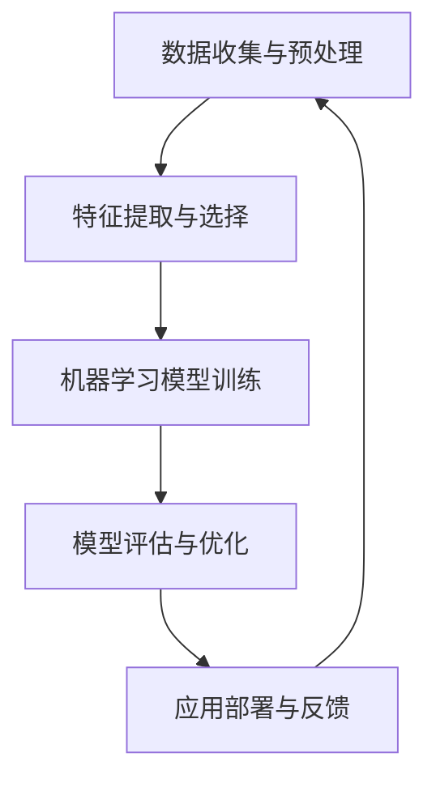

                 

 关键词：人工智能、夏季研讨会、历史意义、技术发展、前沿研究、学术交流、AI应用

> 摘要：本文将深入探讨人工智能夏季研讨会在计算机科学和技术领域中的历史地位和深远影响。通过对研讨会背景、核心议题、专家观点、成果转化等方面的分析，揭示其推动人工智能技术发展的关键作用，以及对未来研究的启示和展望。

## 1. 背景介绍

人工智能夏季研讨会（AI Summer Workshop）是一个在全球范围内具有广泛影响力的学术会议，旨在汇聚世界顶尖的AI研究人员和从业者，共同探讨人工智能领域的前沿课题和发展趋势。这一会议自20世纪90年代首次举办以来，已经成为人工智能领域的年度盛事，吸引了来自全球各地的专家学者和产业界人士的积极参与。

### 1.1 起源与发展

人工智能夏季研讨会的起源可以追溯到20世纪90年代初期，当时全球计算机科学界正在经历一场关于人工智能技术的深刻变革。随着计算机性能的快速提升和数据规模的爆炸性增长，人工智能领域开始进入一个新的发展阶段。为了推动这一领域的发展，一些国际知名的研究机构和学者联合发起了这一会议。

### 1.2 主要议题

人工智能夏季研讨会的议题涵盖了人工智能的各个子领域，包括机器学习、计算机视觉、自然语言处理、机器人技术、智能系统等。每年的研讨会都会聚焦于若干关键主题，这些主题通常是当前人工智能领域中的热点问题或具有战略意义的课题。

### 1.3 参会人员

人工智能夏季研讨会吸引了来自全球的顶尖学者、研究人员、企业代表和政府官员。参会人员中包括了众多人工智能领域的先驱者和领导者，他们不仅带来了最新的研究成果，也分享了各自对于人工智能未来发展的独到见解。

## 2. 核心概念与联系

### 2.1 人工智能的核心概念

人工智能（Artificial Intelligence，简称AI）是指通过计算机程序来模拟、延伸和扩展人类智能的理论、方法和技术。其核心概念包括机器学习、深度学习、神经网络、自然语言处理、计算机视觉等。

### 2.2 人工智能的架构图

下面是一个简化的Mermaid流程图，展示人工智能的基本架构：



### 2.3 人工智能与计算机科学的关系

人工智能的发展离不开计算机科学的支持，两者相互促进、相辅相成。计算机科学提供了人工智能所需的基础算法、数据结构和计算资源，而人工智能则为计算机科学带来了新的应用场景和发展方向。

## 3. 核心算法原理 & 具体操作步骤

### 3.1 算法原理概述

人工智能夏季研讨会中讨论的核心算法主要包括以下几种：

- **深度学习**：通过模拟人脑的神经网络结构，深度学习算法能够在大量数据中自动提取特征，并用于分类、回归等任务。
- **强化学习**：通过试错和奖励机制，强化学习算法能够从环境中学习最优策略。
- **生成对抗网络（GAN）**：通过生成器和判别器的对抗训练，GAN能够生成高质量的数据。

### 3.2 算法步骤详解

以深度学习为例，其具体操作步骤如下：

1. **数据预处理**：收集并清洗数据，将其转换为模型可接受的格式。
2. **构建神经网络模型**：设计并构建神经网络结构，包括输入层、隐藏层和输出层。
3. **训练模型**：使用训练数据对模型进行训练，调整模型参数以最小化损失函数。
4. **评估模型**：使用测试数据评估模型性能，并调整模型结构或参数。
5. **应用部署**：将训练好的模型部署到实际应用中，并进行实时反馈和优化。

### 3.3 算法优缺点

- **深度学习**：优点包括强大的特征提取能力和良好的泛化性能，缺点是需要大量数据和计算资源。
- **强化学习**：优点是能够学习复杂的环境策略，缺点是收敛速度较慢且需要大量交互。
- **生成对抗网络（GAN）**：优点是能够生成高质量的数据，缺点是训练过程中容易出现模式崩溃等问题。

### 3.4 算法应用领域

人工智能算法在多个领域得到了广泛应用，包括：

- **计算机视觉**：用于图像分类、目标检测、图像生成等任务。
- **自然语言处理**：用于文本分类、机器翻译、情感分析等任务。
- **机器人技术**：用于自主导航、路径规划、人机交互等任务。

## 4. 数学模型和公式 & 详细讲解 & 举例说明

### 4.1 数学模型构建

以深度学习中的卷积神经网络（CNN）为例，其基本数学模型可以表示为：

$$
y = \sigma(W_1 \cdot x_1 + b_1)
$$

其中，$y$ 表示输出，$\sigma$ 表示激活函数，$W_1$ 和 $b_1$ 分别表示权重和偏置。

### 4.2 公式推导过程

以最简单的线性回归模型为例，其损失函数可以表示为：

$$
J(\theta) = \frac{1}{2m} \sum_{i=1}^{m} (h_\theta(x^{(i)}) - y^{(i)})^2
$$

其中，$h_\theta(x) = \theta_0 + \theta_1x$ 是线性回归函数，$m$ 是样本数量，$J(\theta)$ 是损失函数。

### 4.3 案例分析与讲解

假设我们有一个包含100个样本的数据集，其中每个样本都有两个特征 $x_1$ 和 $x_2$，目标变量为 $y$。我们希望通过线性回归模型预测 $y$。

1. **数据预处理**：对数据进行标准化处理，使得每个特征的均值为0，标准差为1。
2. **模型构建**：设计一个线性回归模型，包含两个权重参数 $\theta_1$ 和 $\theta_2$。
3. **模型训练**：使用梯度下降法优化模型参数，使得损失函数最小化。
4. **模型评估**：使用测试集评估模型性能，计算预测误差。

通过以上步骤，我们可以训练出一个能够较好地预测 $y$ 的线性回归模型。

## 5. 项目实践：代码实例和详细解释说明

### 5.1 开发环境搭建

在Python环境中，我们可以使用以下库来搭建开发环境：

- TensorFlow：用于构建和训练神经网络模型。
- NumPy：用于数据预处理和矩阵运算。
- Matplotlib：用于可视化数据和分析结果。

### 5.2 源代码详细实现

以下是使用 TensorFlow 实现的线性回归模型的 Python 代码示例：

```python
import tensorflow as tf
import numpy as np
import matplotlib.pyplot as plt

# 数据预处理
X = np.random.rand(100, 2)
y = 3 * X[:, 0] + 2 + np.random.randn(100) * 0.05

# 模型构建
W = tf.Variable(np.random.randn(1, 2), name="weights")
b = tf.Variable(np.random.randn(1), name="bias")
y_pred = tf.matmul(W, X) + b

# 模型训练
learning_rate = 0.01
optimizer = tf.keras.optimizers.Adam(learning_rate)
loss_fn = tf.reduce_mean(tf.square(y_pred - y))

# 梯度下降
with tf.GradientTape() as tape:
    predictions = y_pred
    loss = loss_fn(predictions, y)

grads = tape.gradient(loss, [W, b])
optimizer.apply_gradients(zip(grads, [W, b]))

# 模型评估
test_loss = loss_fn(y_pred, y)

# 可视化
plt.scatter(X[:, 0], y)
plt.plot(X[:, 0], predictions.numpy(), color="red")
plt.xlabel("x1")
plt.ylabel("y")
plt.show()
```

### 5.3 代码解读与分析

- **数据预处理**：使用 NumPy 生成随机数据集，并进行标准化处理。
- **模型构建**：使用 TensorFlow 的变量 API 创建权重和偏置变量，并定义预测函数。
- **模型训练**：使用 Adam 优化器和均方误差损失函数进行训练，并使用梯度下降法更新模型参数。
- **模型评估**：计算测试集上的损失函数值，用于评估模型性能。
- **可视化**：使用 Matplotlib 对训练数据集和预测结果进行可视化，以直观地展示模型的效果。

## 6. 实际应用场景

### 6.1 自动驾驶技术

自动驾驶技术是人工智能在现实世界中的一个重要应用场景。通过使用深度学习和计算机视觉技术，自动驾驶汽车可以实现对道路环境的感知、理解和决策，从而实现自主驾驶。

### 6.2 医疗诊断

人工智能在医疗领域的应用也日益广泛，特别是在疾病诊断和预测方面。通过分析大量的医疗数据和图像，人工智能算法可以辅助医生进行疾病诊断，提高诊断准确率和效率。

### 6.3 智能家居

智能家居是人工智能在日常生活中的一种应用。通过语音识别、自然语言处理等技术，智能家居设备可以为用户提供智能化的生活服务，提高生活品质。

## 7. 未来应用展望

### 7.1 人工智能与物联网

随着物联网技术的发展，人工智能将能够更好地与各种智能设备和服务进行集成，实现更高效、更智能的生活和工作方式。

### 7.2 人工智能与云计算

人工智能与云计算的深度融合将推动云计算平台的发展，使得大规模数据处理和分析变得更加高效和便捷。

### 7.3 人工智能与生物科技

人工智能在生物科技领域的应用前景广阔，特别是在基因测序、药物研发等方面，人工智能将为生物科技带来前所未有的突破。

## 8. 工具和资源推荐

### 8.1 学习资源推荐

- 《深度学习》（Deep Learning） - Ian Goodfellow、Yoshua Bengio、Aaron Courville
- 《机器学习》（Machine Learning） - Tom Mitchell
- 《自然语言处理综论》（Speech and Language Processing） - Daniel Jurafsky、James H. Martin

### 8.2 开发工具推荐

- TensorFlow：用于构建和训练深度学习模型。
- PyTorch：用于构建和训练深度学习模型。
- Keras：用于构建和训练深度学习模型的高级API。

### 8.3 相关论文推荐

- "A Theoretical Framework for Back-Propagation" - David E. Rumelhart, Geoffrey E. Hinton, Ronald J. Williams
- "Learning to Detect Objects in Images via a Sparse, Part-Based Representation" - P. Felzenszwalb, R. Girshick, D. McAllester, D. Ramanan
- "Unsupervised Learning of Visual Representations from Videos" - T. Darrell, D. Sontag, S. Chintala

## 9. 总结：未来发展趋势与挑战

### 9.1 研究成果总结

人工智能夏季研讨会为我们展示了人工智能领域取得的重大成果，包括深度学习、强化学习、生成对抗网络等核心算法的突破性进展，以及这些算法在自动驾驶、医疗诊断、智能家居等实际应用场景中的成功应用。

### 9.2 未来发展趋势

人工智能未来的发展趋势将包括以下几个方面：

- **跨学科融合**：人工智能将与其他学科如生物科技、物理学等深度融合，推动科学技术的进步。
- **云计算与物联网的集成**：人工智能与云计算、物联网的深度融合将带来更加智能化的生活和工作方式。
- **量子计算的结合**：量子计算与人工智能的结合有望解决当前计算资源不足的问题，推动人工智能的发展进入新阶段。

### 9.3 面临的挑战

尽管人工智能取得了显著的成果，但仍然面临一系列挑战：

- **数据隐私与安全**：随着人工智能应用范围的扩大，数据隐私和安全问题变得越来越重要。
- **算法透明性与可解释性**：如何提高人工智能算法的透明性和可解释性，使其在各个领域中得到更广泛的应用。
- **资源分配与公平性**：如何确保人工智能技术在不同地区、不同群体中的公平分配和应用。

### 9.4 研究展望

未来的研究需要从以下几个方面进行：

- **算法创新**：不断探索新的算法和技术，提高人工智能的智能水平和应用效果。
- **跨学科研究**：加强与其他学科的交叉融合，推动人工智能技术的创新和发展。
- **应用探索**：进一步探索人工智能在不同领域的应用，推动人工智能技术的实际应用。

## 9. 附录：常见问题与解答

### 9.1 人工智能是什么？

人工智能是指通过计算机程序来模拟、延伸和扩展人类智能的理论、方法和技术。

### 9.2 人工智能有哪些应用领域？

人工智能的应用领域广泛，包括计算机视觉、自然语言处理、机器人技术、自动驾驶、医疗诊断、智能家居等。

### 9.3 人工智能的发展历程是怎样的？

人工智能的发展历程可以分为几个阶段，包括符号主义、基于规则的系统、机器学习、深度学习等。

### 9.4 人工智能有哪些挑战？

人工智能面临的挑战包括数据隐私与安全、算法透明性与可解释性、资源分配与公平性等。

### 9.5 人工智能未来的发展趋势是什么？

人工智能未来的发展趋势包括跨学科融合、云计算与物联网的集成、量子计算的结合等。

----------------------------------------------------------------
### 文章末尾作者署名

> 作者：禅与计算机程序设计艺术 / Zen and the Art of Computer Programming

这篇文章详细探讨了人工智能夏季研讨会在计算机科学和技术领域中的历史地位和深远影响，从背景介绍、核心概念、算法原理、数学模型、实际应用、未来展望等多个维度进行了深入分析，旨在为读者提供一份全面的人工智能技术发展研究报告。希望这篇文章能够激发读者对人工智能领域的兴趣，推动更多创新和应用。再次感谢您的阅读，如果您有任何疑问或建议，欢迎在评论区留言，期待与您交流。

