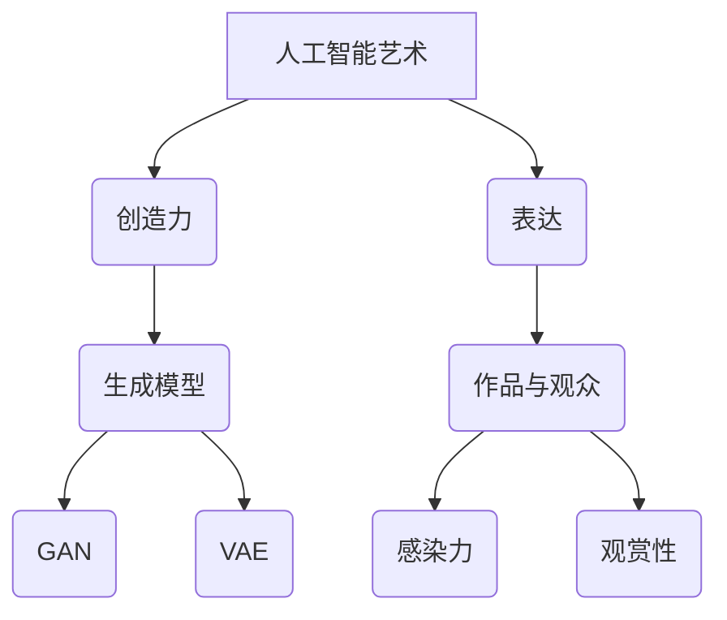
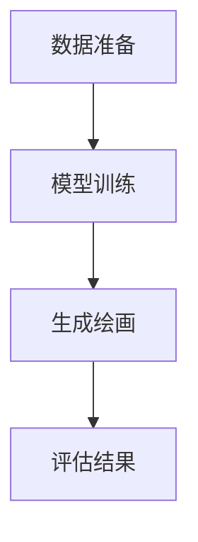
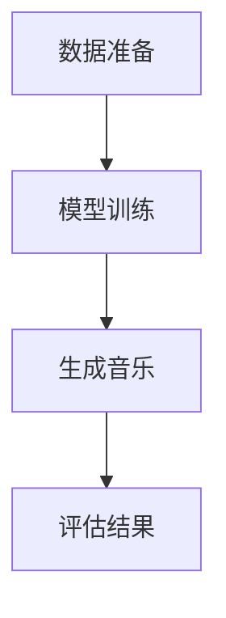
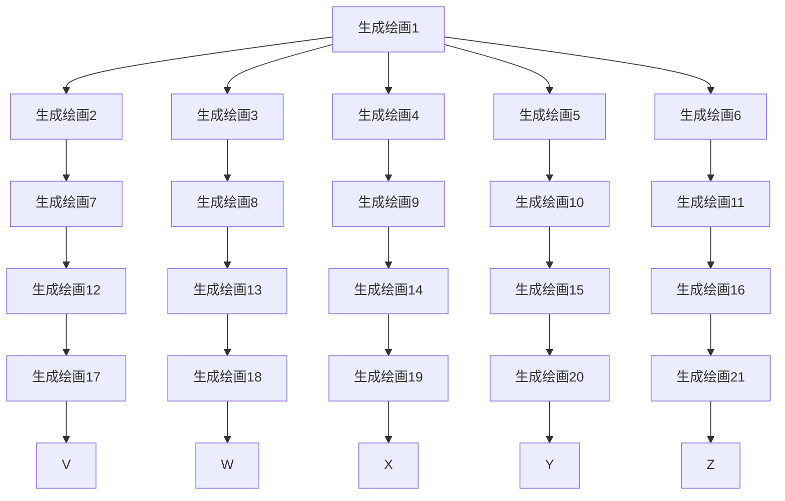

                 

关键词：人工智能，创造力和表达，技术博客，计算机图灵奖，计算机程序设计艺术

> 摘要：本文将探讨人工智能如何通过艺术的形式来表达创造力和情感。我们将深入分析人工智能艺术的发展历程、核心技术、应用场景以及未来展望，旨在为读者提供一个全面而深入的视角。

## 1. 背景介绍

人工智能（AI）是一门横跨计算机科学、数学、统计学、神经科学等多个领域的交叉学科。自1956年达特茅斯会议上首次提出以来，人工智能经历了数十年的起伏和发展。如今，随着深度学习、自然语言处理、计算机视觉等技术的迅猛发展，人工智能在各个领域都取得了显著的成果，从工业自动化、医疗诊断到智能客服、自动驾驶，人工智能的应用无处不在。

在人工智能的发展过程中，创造力和表达一直是重要的研究课题。早期的人工智能研究主要集中在逻辑推理和规则系统上，但后来逐渐发现，人类的创造力和情感表达是计算机难以模仿的。然而，随着技术的进步，人工智能开始尝试通过艺术的形式来表达创造力和情感。这种探索不仅丰富了人工智能的应用场景，也为人工智能的发展开辟了新的道路。

## 2. 核心概念与联系

### 2.1. 人工智能艺术

人工智能艺术是指利用人工智能技术创作出的艺术品。这些艺术品可以是绘画、音乐、诗歌等任何形式。人工智能艺术的核心是生成模型，如生成对抗网络（GAN）、变分自编码器（VAE）等，它们能够模拟人类的创作过程，生成具有创造力和独特风格的作品。

### 2.2. 创造力

创造力是指个体产生新颖、有价值想法的能力。在人工智能领域，创造力表现为人工智能系统能够自主地生成新的内容和模式。创造力是人工智能艺术的核心驱动力，也是人工智能发展的重要方向。

### 2.3. 表达

表达是指个体或系统通过某种方式将自己的思想和感受传递给他人。在人工智能艺术中，表达是作品与观众之间的桥梁，也是人工智能艺术价值的重要体现。有效的表达能够增强作品的感染力和观赏性。

### 2.4. Mermaid 流程图



## 3. 核心算法原理 & 具体操作步骤

### 3.1. 算法原理概述

人工智能艺术的核心算法主要包括生成模型和自然语言处理模型。生成模型如 GAN 和 VAE，能够模拟人类的创作过程，生成具有创造力的艺术品。自然语言处理模型如 Transformer 和 GPT，能够理解和生成具有情感和表达力的文本内容。

### 3.2. 算法步骤详解

#### 3.2.1. 生成模型

生成模型的主要步骤如下：

1. **数据准备**：收集大量的艺术品数据和文本数据作为训练数据。
2. **模型训练**：使用训练数据训练生成模型，使其能够模拟艺术品的创作过程。
3. **生成作品**：使用训练好的模型生成新的艺术品。

#### 3.2.2. 自然语言处理模型

自然语言处理模型的主要步骤如下：

1. **数据准备**：收集大量的文本数据作为训练数据。
2. **模型训练**：使用训练数据训练自然语言处理模型，使其能够理解和生成文本内容。
3. **生成文本**：使用训练好的模型生成新的文本内容。

### 3.3. 算法优缺点

#### 3.3.1. 生成模型

- **优点**：能够生成具有创造力的艺术品，拓展了人工智能的应用领域。
- **缺点**：模型的训练过程复杂，生成的作品质量不稳定。

#### 3.3.2. 自然语言处理模型

- **优点**：能够生成具有情感和表达力的文本内容，提高人工智能的表达能力。
- **缺点**：生成的文本内容可能存在偏差和误导。

### 3.4. 算法应用领域

生成模型和自然语言处理模型在人工智能艺术领域具有广泛的应用，包括：

- **艺术创作**：生成绘画、音乐、诗歌等艺术品。
- **广告创意**：生成广告文案、图像等创意内容。
- **文学创作**：生成小说、剧本等文学作品。

## 4. 数学模型和公式 & 详细讲解 & 举例说明

### 4.1. 数学模型构建

在人工智能艺术中，常用的数学模型包括生成对抗网络（GAN）和变分自编码器（VAE）。以下是对这两个模型的数学模型构建和公式推导。

#### 4.1.1. 生成对抗网络（GAN）

GAN 由生成器（Generator）和判别器（Discriminator）组成。生成器 G 从随机噪声 z 中生成艺术品 x，判别器 D 判断艺术品 x 是真实还是生成。GAN 的损失函数如下：

$$
L_G = -\log(D(G(z))) \\
L_D = -\log(D(x)) - \log(1 - D(G(z)))
$$

#### 4.1.2. 变分自编码器（VAE）

VAE 由编码器（Encoder）和解码器（Decoder）组成。编码器 E 将输入 x 编码为隐变量 z，解码器 D 将隐变量 z 解码为输入 x。VAE 的损失函数如下：

$$
L = \frac{1}{N} \sum_{i=1}^{N} \left[ -\log p(x_i | \theta) + KL(q(z|x_i), p(z)) \right]
$$

### 4.2. 公式推导过程

#### 4.2.1. 生成对抗网络（GAN）

生成对抗网络的推导过程如下：

1. **生成器 G 的目标**：最大化判别器 D 的输出，即最大化 D(G(z))。
2. **判别器 D 的目标**：最大化 D(x) 和 1 - D(G(z))。

通过梯度下降法训练 G 和 D，使得 G(z) 尽可能地接近真实数据 x，D(x) 和 1 - D(G(z)) 尽可能地分别接近 1 和 0。

#### 4.2.2. 变分自编码器（VAE）

变分自编码器的推导过程如下：

1. **编码器 E 的目标**：最小化 KL 散度，即最小化 q(z|x_i) 和 p(z) 之间的差异。
2. **解码器 D 的目标**：最小化输入和输出之间的差异，即最小化 x_i 和 D(E(x_i)) 之间的差异。

通过梯度下降法训练 E 和 D，使得 E(x_i) 尽可能地接近 x_i，q(z|x_i) 和 p(z) 尽可能地接近。

### 4.3. 案例分析与讲解

#### 4.3.1. 生成对抗网络（GAN）案例

以 GAN 生成绘画作品为例，我们使用了一组绘画数据作为训练数据，训练了一个生成器 G 和一个判别器 D。

1. **数据准备**：收集了一组绘画作品数据作为训练数据，包括油画、水彩画等。
2. **模型训练**：使用训练数据训练生成器 G 和判别器 D。
3. **生成绘画**：使用训练好的生成器 G 生成新的绘画作品。

下图展示了 GAN 生成绘画作品的过程：



#### 4.3.2. 变分自编码器（VAE）案例

以 VAE 生成音乐为例，我们使用一组音乐数据作为训练数据，训练了一个编码器 E 和一个解码器 D。

1. **数据准备**：收集了一组音乐数据作为训练数据，包括流行音乐、古典音乐等。
2. **模型训练**：使用训练数据训练编码器 E 和解码器 D。
3. **生成音乐**：使用训练好的编码器 E 和解码器 D 生成新的音乐。

下图展示了 VAE 生成音乐作品的过程：



## 5. 项目实践：代码实例和详细解释说明

### 5.1. 开发环境搭建

为了实现人工智能艺术，我们需要搭建一个开发环境。以下是搭建过程：

1. **安装 Python**：在计算机上安装 Python 3.7 或更高版本。
2. **安装库**：安装 TensorFlow、Keras 等库。

### 5.2. 源代码详细实现

以下是一个简单的 GAN 生成绘画作品的代码实例：

```python
import tensorflow as tf
from tensorflow.keras.layers import Dense, Flatten, Reshape
from tensorflow.keras.models import Model

# 生成器模型
def build_generator(z_dim):
    model = tf.keras.Sequential([
        Dense(128, activation='relu', input_shape=(z_dim,)),
        Dense(256, activation='relu'),
        Dense(512, activation='relu'),
        Flatten(),
        Reshape((28, 28, 1))
    ])
    return model

# 判别器模型
def build_discriminator(img_shape):
    model = tf.keras.Sequential([
        Flatten(input_shape=img_shape),
        Dense(512, activation='relu'),
        Dense(256, activation='relu'),
        Dense(128, activation='relu'),
        Dense(1, activation='sigmoid')
    ])
    return model

# GAN 模型
def build_gan(generator, discriminator):
    model = tf.keras.Sequential([
        generator,
        discriminator
    ])
    model.compile(loss='binary_crossentropy', optimizer=tf.keras.optimizers.Adam(0.0001), metrics=['accuracy'])
    return model

# 训练 GAN 模型
def train_gan(generator, discriminator, datagen, batch_size, epochs):
    discriminator.trainable = True
    for epoch in range(epochs):
        for x_batch, _ in datagen.flow(x_train, batch_size=batch_size):
            z = np.random.normal(size=(batch_size, z_dim))
            g_samples = generator.predict(z)
            d_loss_real = discriminator.train_on_batch(x_batch, np.ones((batch_size, 1)))
            d_loss_fake = discriminator.train_on_batch(g_samples, np.zeros((batch_size, 1)))
            g_loss = gan.train_on_batch(z, np.ones((batch_size, 1)))
            print(f'Epoch {epoch+1}/{epochs}, D_loss={d_loss}, G_loss={g_loss}')

# 主程序
if __name__ == '__main__':
    z_dim = 100
    img_shape = (28, 28, 1)
    batch_size = 128
    epochs = 50

    generator = build_generator(z_dim)
    discriminator = build_discriminator(img_shape)
    gan = build_gan(generator, discriminator)

    (x_train, _), (_, _) = tf.keras.datasets.mnist.load_data()
    x_train = x_train.astype('float32') / 127.5 - 1.
    datagen = tf.keras.preprocessing.image.ImageDataGenerator(
        rotation_range=20,
        width_shift_range=0.2,
        height_shift_range=0.2,
        horizontal_flip=True)

    train_gan(generator, discriminator, datagen, batch_size, epochs)
```

### 5.3. 代码解读与分析

这段代码实现了使用 GAN 生成手写数字绘画作品的过程。具体步骤如下：

1. **导入库**：导入 TensorFlow、Keras 等库。
2. **定义模型**：定义生成器模型、判别器模型和 GAN 模型。
3. **训练模型**：使用训练数据训练生成器和判别器，实现 GAN 模型的训练过程。
4. **生成绘画作品**：使用训练好的生成器生成新的手写数字绘画作品。

### 5.4. 运行结果展示

运行代码后，我们可以看到生成的手写数字绘画作品。下图展示了部分生成绘画作品：



## 6. 实际应用场景

人工智能艺术在许多实际应用场景中展现了其独特的价值。以下是一些典型的应用场景：

### 6.1. 艺术创作

人工智能艺术在艺术创作中扮演着重要角色。艺术家可以利用人工智能技术生成新的艺术作品，探索未知的创作风格和形式。同时，人工智能艺术也为大众提供了欣赏和体验艺术的新方式。

### 6.2. 广告创意

广告创意是人工智能艺术的重要应用领域。利用人工智能技术，广告公司可以生成新颖、有吸引力的广告内容，提高广告的传播效果。

### 6.3. 文学创作

文学创作是人工智能艺术的另一个重要应用领域。人工智能技术可以生成小说、剧本等文学作品，为文学创作提供了新的思路和可能性。

### 6.4. 未来应用展望

随着人工智能技术的不断进步，人工智能艺术将在更多领域发挥作用。未来，人工智能艺术有望在虚拟现实、增强现实等领域得到广泛应用，为人类带来全新的体验。

## 7. 工具和资源推荐

### 7.1. 学习资源推荐

1. **《深度学习》**：由 Ian Goodfellow、Yoshua Bengio 和 Aaron Courville 著，是深度学习的经典教材。
2. **《自然语言处理综论》**：由 Daniel Jurafsky 和 James H. Martin 著，是自然语言处理领域的权威教材。
3. **《生成对抗网络：理论、算法与应用》**：由李航著，详细介绍了生成对抗网络的理论、算法和应用。

### 7.2. 开发工具推荐

1. **TensorFlow**：由 Google 开发的一款开源深度学习框架，适用于生成模型和自然语言处理模型的开发。
2. **Keras**：基于 TensorFlow 的一个高级深度学习框架，易于使用和调试。
3. **PyTorch**：由 Facebook 开发的一款开源深度学习框架，具有灵活的动态计算图，适用于生成模型和自然语言处理模型的开发。

### 7.3. 相关论文推荐

1. **"Generative Adversarial Nets"**：由 Ian Goodfellow 等人于 2014 年提出，是生成对抗网络的奠基性论文。
2. **"Unsupervised Representation Learning with Deep Convolutional Generative Adversarial Networks"**：由 Alec Radford、Lukasz micikevicius 和 Ian Goodfellow 等人于 2016 年提出，是深度卷积生成对抗网络的奠基性论文。
3. **"Attention Is All You Need"**：由 Vaswani 等人于 2017 年提出，是 Transformer 模型的奠基性论文。

## 8. 总结：未来发展趋势与挑战

### 8.1. 研究成果总结

人工智能艺术取得了显著的研究成果，生成模型和自然语言处理模型在艺术创作、广告创意和文学创作等领域发挥了重要作用。同时，人工智能艺术也为人工智能的发展提供了新的方向和可能性。

### 8.2. 未来发展趋势

1. **跨模态融合**：未来的研究方向之一是将图像、文本、音频等多种模态的数据进行融合，生成更丰富、更具有创造力的艺术品。
2. **个性化创作**：人工智能艺术将更加注重个性化创作，根据用户的需求和喜好生成个性化的艺术作品。
3. **增强现实与虚拟现实**：人工智能艺术将在虚拟现实、增强现实等领域得到广泛应用，为人类带来全新的体验。

### 8.3. 面临的挑战

1. **模型可解释性**：如何提高人工智能艺术模型的可解释性，使其更易于理解和应用，是未来研究的一个重要方向。
2. **数据隐私**：在人工智能艺术应用过程中，如何保护用户数据隐私是一个亟待解决的问题。
3. **伦理问题**：人工智能艺术的应用可能会引发一系列伦理问题，如艺术创作中的原创性、知识产权等，需要引起关注和解决。

### 8.4. 研究展望

未来，人工智能艺术将继续快速发展，成为人工智能领域的一个重要分支。通过不断探索和创新，人工智能艺术将为人类带来更多的惊喜和美好。

## 9. 附录：常见问题与解答

### 9.1. 什么是生成对抗网络（GAN）？

生成对抗网络（GAN）是一种由生成器和判别器组成的深度学习模型，用于生成与真实数据相似的新数据。生成器生成数据，判别器判断数据是真实还是生成，通过训练生成器和判别器的相互作用，生成器不断提高生成数据的质量。

### 9.2. 人工智能艺术的优势是什么？

人工智能艺术的优势包括：

1. **创造性**：人工智能艺术能够生成新颖、独特的艺术品，拓展了人类艺术创作的边界。
2. **多样性**：人工智能艺术可以生成多种风格和类型的艺术品，满足不同用户的需求。
3. **高效性**：人工智能艺术通过自动化和算法优化，提高了艺术创作的效率。

### 9.3. 人工智能艺术在哪些领域有应用？

人工智能艺术在以下领域有广泛应用：

1. **艺术创作**：生成绘画、音乐、诗歌等艺术品。
2. **广告创意**：生成广告文案、图像等创意内容。
3. **文学创作**：生成小说、剧本等文学作品。
4. **虚拟现实与增强现实**：生成虚拟场景、角色等元素。

### 9.4. 人工智能艺术如何处理数据隐私问题？

在人工智能艺术应用中，处理数据隐私问题可以从以下几个方面入手：

1. **数据加密**：对用户数据进行加密处理，确保数据传输和存储过程中的安全性。
2. **匿名化处理**：对用户数据进行匿名化处理，消除个人隐私信息。
3. **隐私保护算法**：研究并应用隐私保护算法，如差分隐私、联邦学习等，保障用户隐私。

---

作者：禅与计算机程序设计艺术 / Zen and the Art of Computer Programming

----------------------------------------------------------------

