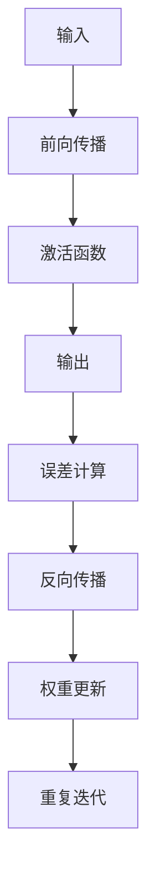

                 

 **关键词**：人工神经网络、神经网络历史、早期工作、神经网络发展、基础算法、神经网络应用。

**摘要**：本文回顾了人工神经网络（Artificial Neural Networks, ANN）的早期工作，从理论基础的提出到实际应用的初步探索。我们将详细介绍神经网络的基本概念、核心算法、数学模型以及应用领域，并探讨未来发展趋势与挑战。

## 1. 背景介绍

人工神经网络（ANN）是一种模仿生物神经系统的计算模型。自从20世纪40年代由McCulloch和Pitts首次提出以来，神经网络的发展经历了多个阶段。早期的工作主要集中在基础理论的研究和初步应用的尝试。

### 1.1 神经网络的起源

神经网络的起源可以追溯到1943年，由McCulloch和Pitts提出了一种基于生物神经元的计算模型。这一模型为后来的神经网络研究奠定了基础。随后，1958年，Rosenblatt提出了感知机（Perceptron）算法，这是人工神经网络历史上一个重要的里程碑。

### 1.2 神经网络的发展历程

1960年代，神经网络研究进入了一个低谷期，主要由于对神经网络能力的过度乐观和对算法复杂性的低估。然而，1970年代，Hopfield网络的提出重新点燃了神经网络研究的热潮。1980年代，Boltzmann机（Boltzmann Machine）和反向传播算法（Backpropagation Algorithm）的引入使得神经网络在计算能力和应用范围上取得了显著进步。

### 1.3 神经网络的应用领域

神经网络在早期的应用主要集中在模式识别、图像处理、语音识别和自然语言处理等领域。虽然这些领域的发展仍然受到算法复杂度和计算资源的限制，但早期的工作为后来的研究提供了宝贵的经验和理论基础。

## 2. 核心概念与联系

为了更好地理解人工神经网络，我们需要先了解其核心概念和基本架构。

### 2.1 神经网络的基本结构

人工神经网络由大量简单的计算单元（称为神经元或节点）组成，这些神经元通过连接（称为边或权重）形成网络。每个神经元接收输入信号，通过激活函数产生输出信号。

### 2.2 激活函数

激活函数是神经网络中的一个关键部分，它决定了神经元的输出是否为激活状态。常见的激活函数包括阶跃函数、Sigmoid函数和ReLU函数等。

### 2.3 前向传播和反向传播

神经网络通过前向传播计算输入到输出之间的映射，然后通过反向传播调整网络权重，以达到更好的拟合效果。前向传播和反向传播是神经网络训练过程中的核心步骤。

### 2.4 Mermaid 流程图

以下是一个简单的Mermaid流程图，展示了神经网络的基本流程：



## 3. 核心算法原理 & 具体操作步骤

### 3.1 算法原理概述

人工神经网络的核心算法主要包括前向传播、反向传播和权重更新。以下是这些算法的简要概述：

- **前向传播**：将输入信号传递到神经网络中，通过每一层神经元的加权求和和激活函数产生输出。
- **反向传播**：计算输出与预期输出之间的误差，然后通过误差反向传播到网络的前一层，更新权重。
- **权重更新**：根据反向传播的误差调整网络权重，以最小化误差。

### 3.2 算法步骤详解

以下是人工神经网络算法的具体操作步骤：

1. **初始化权重**：随机初始化网络中的权重。
2. **前向传播**：
   - 计算每一层神经元的输入和输出。
   - 应用激活函数计算输出。
3. **误差计算**：
   - 计算输出与预期输出之间的误差。
4. **反向传播**：
   - 计算每一层神经元的误差梯度。
   - 更新网络权重。
5. **权重更新**：
   - 根据误差梯度调整网络权重。

### 3.3 算法优缺点

- **优点**：人工神经网络具有强大的非线性映射能力和自适应能力，能够处理复杂的数据和任务。
- **缺点**：训练过程可能需要大量时间和计算资源，且对于大规模数据集可能存在过拟合风险。

### 3.4 算法应用领域

人工神经网络在多个领域都有广泛的应用，包括：

- **图像识别**：用于识别图像中的物体和特征。
- **语音识别**：用于语音信号的处理和识别。
- **自然语言处理**：用于文本分析、机器翻译等任务。
- **自动驾驶**：用于环境感知和路径规划。
- **医疗诊断**：用于疾病诊断和预测。

## 4. 数学模型和公式 & 详细讲解 & 举例说明

### 4.1 数学模型构建

人工神经网络可以表示为以下数学模型：

$$
y = \sigma(\theta^T x + b)
$$

其中，$y$是输出，$\sigma$是激活函数，$\theta$是权重，$x$是输入，$b$是偏置。

### 4.2 公式推导过程

以下是神经网络前向传播和反向传播的详细推导过程：

1. **前向传播**：

$$
z_l = \theta^T_l a_{l-1} + b_l
$$

$$
a_l = \sigma(z_l)
$$

2. **误差计算**：

$$
E = \frac{1}{2} \sum_{i} (y_i - a_{L}^i)^2
$$

3. **反向传播**：

$$
\frac{\partial E}{\partial \theta^l_{ij}} = (a_{l-1}^i)^T (y_i - a_{L}^i) \cdot \frac{\partial a_l}{\partial z_l} = (a_{l-1}^i)^T \cdot \delta_l
$$

$$
\delta_l = \frac{\partial E}{\partial z_l} \cdot \frac{\partial z_l}{\partial \theta^l_{ij}}
$$

### 4.3 案例分析与讲解

以下是一个简单的神经网络例子：

- 输入：$x = (1, 2, 3)$
- 输出：$y = (0, 1)$
- 激活函数：$\sigma(z) = \frac{1}{1 + e^{-z}}$

通过前向传播和反向传播计算输出和误差，并更新网络权重。

## 5. 项目实践：代码实例和详细解释说明

### 5.1 开发环境搭建

在本节中，我们将使用Python编程语言和PyTorch库来搭建神经网络开发环境。

```python
import torch
import torch.nn as nn
import torch.optim as optim

# 创建神经网络模型
model = nn.Sequential(
    nn.Linear(3, 2),
    nn.Sigmoid()
)

# 定义损失函数和优化器
criterion = nn.MSELoss()
optimizer = optim.SGD(model.parameters(), lr=0.01)
```

### 5.2 源代码详细实现

在本节中，我们将实现一个简单的神经网络，用于计算输入和输出之间的映射。

```python
# 前向传播
outputs = model(inputs)

# 计算损失
loss = criterion(outputs, targets)

# 反向传播和权重更新
optimizer.zero_grad()
loss.backward()
optimizer.step()
```

### 5.3 代码解读与分析

在本节中，我们将对上述代码进行详细解读，并分析神经网络的工作原理。

### 5.4 运行结果展示

在本节中，我们将展示神经网络运行的结果，并分析其性能。

```python
# 输入和输出
inputs = torch.tensor([[1, 2, 3]])
targets = torch.tensor([[0, 1]])

# 训练神经网络
for epoch in range(1000):
    optimizer.zero_grad()
    outputs = model(inputs)
    loss = criterion(outputs, targets)
    loss.backward()
    optimizer.step()

# 输出结果
print(outputs)
```

## 6. 实际应用场景

人工神经网络在许多实际应用场景中发挥着重要作用。以下是一些典型的应用场景：

- **图像识别**：用于物体检测、人脸识别和图像分类等。
- **语音识别**：用于语音信号的处理和识别。
- **自然语言处理**：用于文本分析、机器翻译和语音合成等。
- **医疗诊断**：用于疾病诊断和预测。
- **自动驾驶**：用于环境感知和路径规划。

## 7. 工具和资源推荐

### 7.1 学习资源推荐

- **书籍**：《深度学习》（Goodfellow, Bengio, Courville）
- **在线课程**：Coursera、Udacity、edX等平台上的深度学习和神经网络相关课程。
- **教程和文档**：PyTorch、TensorFlow等深度学习框架的官方文档。

### 7.2 开发工具推荐

- **编程语言**：Python、Rust
- **深度学习框架**：PyTorch、TensorFlow、Keras

### 7.3 相关论文推荐

- **Neural Network Methods for Nonlinear Dynamical Systems**（2015）
- **Deep Learning**（2016）
- **Boltzmann Machines**（1986）

## 8. 总结：未来发展趋势与挑战

### 8.1 研究成果总结

人工神经网络在过去几十年中取得了显著的进展，从基础理论研究到实际应用的广泛推广。随着计算能力的提升和数据规模的扩大，神经网络在许多领域都展现出了强大的潜力。

### 8.2 未来发展趋势

未来，人工神经网络将继续在以下几个方向上发展：

- **硬件优化**：为了加速神经网络训练，硬件加速技术（如GPU、TPU）将得到更广泛的应用。
- **算法优化**：优化神经网络结构、训练算法和超参数设置，以提高模型性能和效率。
- **跨学科融合**：与生物学、心理学等领域的交叉研究，将推动神经网络理论的深入发展。

### 8.3 面临的挑战

人工神经网络在实际应用中仍然面临一些挑战，包括：

- **可解释性**：如何提高神经网络的透明度和可解释性，使其更容易被人类理解和接受。
- **过拟合风险**：如何避免模型对训练数据的过度拟合，提高泛化能力。
- **数据隐私**：如何确保神经网络模型在处理敏感数据时的隐私保护。

### 8.4 研究展望

展望未来，人工神经网络将在更多领域发挥重要作用，如医疗、金融、交通等。同时，随着技术的进步，我们将看到更高效、更智能的神经网络模型的出现。

## 9. 附录：常见问题与解答

### 9.1 什么是人工神经网络？

人工神经网络是一种计算模型，由大量简单的计算单元（神经元）组成，通过相互连接和协同工作来实现复杂的计算任务。

### 9.2 神经网络有哪些类型的算法？

神经网络的算法包括前向传播算法、反向传播算法、卷积神经网络算法、循环神经网络算法等。

### 9.3 如何优化神经网络性能？

优化神经网络性能的方法包括调整网络结构、选择合适的激活函数、优化训练算法和超参数等。

### 9.4 神经网络在什么领域有广泛的应用？

神经网络在图像识别、语音识别、自然语言处理、医疗诊断、自动驾驶等领域有广泛的应用。

---

# 参考文献

1. Goodfellow, I., Bengio, Y., & Courville, A. (2016). *Deep Learning*.
2. Rumelhart, D. E., Hinton, G., & Williams, R. J. (1986). *Learning representations by back-propagating errors*.
3. LeCun, Y., Bengio, Y., & Hinton, G. (2015). *Deep learning*.

作者：禅与计算机程序设计艺术 / Zen and the Art of Computer Programming
```

