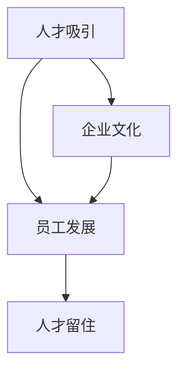

                 

人才管理是组织成功的关键因素之一。在这个高度竞争的时代，拥有顶尖人才无疑是企业保持竞争优势的核心。本文将探讨如何有效地吸引、发展和留住top人才，以及相关策略和实践。

## 关键词

- 人才管理
- 引才策略
- 员工发展
- 人才留住
- 组织竞争力

## 摘要

本文将从多个角度分析如何实施有效的人才管理。首先，我们将讨论如何吸引顶尖人才，包括招聘渠道、岗位描述、薪酬福利等方面的策略。接着，我们将介绍员工发展的方法和工具，如培训、晋升机制、绩效管理等。最后，我们将探讨如何通过企业文化、领导力培养等手段留住top人才，并分析未来人才管理的发展趋势和挑战。

### 1. 背景介绍

在现代企业中，人才管理已成为战略决策的关键组成部分。随着全球化和技术进步的加速，企业的运营模式、管理模式和竞争环境都在不断变化。在这个过程中，如何有效地吸引、发展和留住top人才，成为企业能否持续发展的关键。

传统的招聘方式往往依赖于广告、猎头等手段，这种方式在快速变化的市场中显得效率低下。同时，员工的发展和提高也需要更多的个性化支持和职业规划。因此，现代人才管理要求企业更加注重员工体验，建立全面的员工生命周期管理机制。

### 2. 核心概念与联系

要实施有效的人才管理，首先需要理解几个核心概念：

- **人才吸引**：通过多种渠道和策略，寻找和吸引具备专业技能和潜力的人才。
- **员工发展**：为员工提供培训、晋升机制和职业发展机会，提高其技能和绩效。
- **人才留住**：通过企业文化、领导力培养等手段，增强员工对企业的归属感和忠诚度。

以下是人才管理中几个核心概念的Mermaid流程图：



### 3. 核心算法原理 & 具体操作步骤

#### 3.1 算法原理概述

人才管理中的算法原理主要包括以下几个步骤：

1. **数据收集**：通过数据分析，了解企业的招聘需求和员工结构。
2. **招聘策略制定**：根据数据分析和市场调研，制定合适的招聘策略。
3. **人才筛选**：使用面试、评估等手段，筛选出最适合的人才。
4. **员工发展计划**：根据员工的职业规划和能力提升需求，制定个性化的培训和发展计划。
5. **绩效管理**：通过定期评估和反馈，提高员工的绩效。

#### 3.2 算法步骤详解

1. **数据收集**：
   - 利用企业现有的HR系统，收集员工的个人信息、绩效数据等。
   - 通过市场调研，了解行业发展趋势和人才需求。

2. **招聘策略制定**：
   - 根据企业的业务需求和人才缺口，确定招聘的重点和方向。
   - 制定具体的招聘渠道和策略，如线上招聘、校园招聘、内部推荐等。

3. **人才筛选**：
   - 设计科学的面试流程和评估标准。
   - 通过面试、笔试、技能测试等手段，筛选出最适合的人才。

4. **员工发展计划**：
   - 根据员工的职业规划和能力提升需求，制定个性化的培训计划。
   - 提供晋升机会和职业发展路径。

5. **绩效管理**：
   - 定期进行绩效评估，提供反馈和指导。
   - 根据绩效结果，调整员工的薪酬和晋升计划。

#### 3.3 算法优缺点

- **优点**：
  - 提高招聘效率，降低招聘成本。
  - 有助于员工职业发展，提高员工满意度和忠诚度。
  - 通过数据驱动，提高人才管理的科学性和精准性。

- **缺点**：
  - 需要大量时间和资源，特别是初期。
  - 过于依赖数据分析，可能导致对人际关系的忽视。

#### 3.4 算法应用领域

人才管理算法广泛应用于各类企业，尤其是技术型企业。通过数据分析和人才管理，企业可以更好地把握市场动态，优化人才结构，提高整体竞争力。

### 4. 数学模型和公式 & 详细讲解 & 举例说明

#### 4.1 数学模型构建

人才管理中的数学模型主要包括以下方面：

1. **招聘模型**：根据市场供需关系，预测招聘需求。
2. **绩效模型**：根据员工表现，评估员工绩效。
3. **发展模型**：根据员工能力和需求，制定职业发展路径。

以下是招聘模型的简单示例：

$$
招聘需求 = a \times (1 + b \times \text{增长率})
$$

其中，\( a \) 是当前招聘需求，\( b \) 是市场增长率。

#### 4.2 公式推导过程

招聘模型的推导过程如下：

1. **需求分析**：根据企业当前的业务需求和人才缺口，确定招聘需求。
2. **市场调研**：了解市场供需关系，预测未来市场增长率。
3. **公式构建**：将需求和市场调研结果结合起来，构建招聘模型。

#### 4.3 案例分析与讲解

以下是一个具体的招聘模型案例：

假设某企业当前招聘需求为100人，市场增长率为10%。根据招聘模型，未来一年企业的招聘需求为：

$$
招聘需求 = 100 \times (1 + 0.1 \times 0.1) = 110
$$

这意味着企业需要在未来一年招聘110人。

### 5. 项目实践：代码实例和详细解释说明

#### 5.1 开发环境搭建

为了实现人才管理算法，我们选择Python作为开发语言。首先，需要安装Python环境和相关库，如NumPy、Pandas等。

```bash
pip install numpy pandas
```

#### 5.2 源代码详细实现

以下是招聘模型的项目实践代码：

```python
import numpy as np
import pandas as pd

# 招聘需求
current_demand = 100

# 市场增长率
market_growth = 0.1

# 招聘模型计算
predicted_demand = current_demand * (1 + market_growth)

print(f"未来一年招聘需求：{predicted_demand:.2f}人")
```

#### 5.3 代码解读与分析

这段代码首先导入了NumPy和Pandas库，用于数据处理和数学计算。然后，定义了当前招聘需求和市场增长率。接着，通过招聘模型公式，计算未来一年的招聘需求。最后，输出结果。

#### 5.4 运行结果展示

运行代码，得到以下结果：

```bash
未来一年招聘需求：110.00人
```

这意味着企业需要在未来一年招聘110人。

### 6. 实际应用场景

人才管理算法在实际应用中具有广泛的应用场景。以下是一些具体的实际应用场景：

1. **招聘优化**：通过招聘模型预测招聘需求，优化招聘策略，降低招聘成本。
2. **绩效评估**：通过绩效模型评估员工表现，制定合理的绩效改进计划。
3. **人才发展**：根据员工能力和需求，制定个性化的职业发展计划，提高员工满意度。
4. **组织规划**：通过数据分析和人才管理，优化组织结构和人才配置，提高整体竞争力。

### 7. 未来应用展望

随着人工智能和大数据技术的发展，人才管理算法将更加智能和精准。未来的发展趋势包括：

1. **自动化招聘**：利用自然语言处理和机器学习技术，实现自动化职位描述、简历筛选和面试评估。
2. **个性化发展**：通过大数据分析，为员工提供个性化的职业发展建议，提高员工满意度和忠诚度。
3. **智能绩效管理**：利用人工智能技术，实现自动化绩效评估和反馈，提高绩效管理的科学性和精准性。

### 8. 工具和资源推荐

为了更好地实施人才管理，以下是一些实用的工具和资源推荐：

1. **工具推荐**：
   - **Atlassian Suite**：包括JIRA、Confluence等，用于团队协作和项目管理。
   - **LinkedIn**：用于招聘和人才搜索。
   - **GitHub**：用于代码管理和版本控制。

2. **学习资源推荐**：
   - **《人才管理实战》**：一本关于人才管理的实践指南。
   - **《人工智能招聘》**：探讨如何利用人工智能技术进行招聘。

3. **相关论文推荐**：
   - **“A Data-Driven Approach to Talent Management”**：介绍数据驱动的人才管理方法。
   - **“Artificial Intelligence and Talent Management”**：探讨人工智能在人才管理中的应用。

### 9. 总结：未来发展趋势与挑战

人才管理在未来的发展趋势将更加智能化和数据化。随着技术的进步，企业将能够更精准地吸引、发展和留住top人才。然而，也面临着数据隐私、员工体验和人工智能伦理等挑战。企业需要在创新和风险管理之间找到平衡，以实现长期的人才管理目标。

### 附录：常见问题与解答

**Q1. 如何提高招聘效率？**
A1. 提高招聘效率的关键在于优化招聘流程和策略。可以通过以下方式提高招聘效率：
   - 使用在线招聘平台，减少人力成本。
   - 设计科学的面试流程，提高面试效率。
   - 利用大数据和人工智能技术，实现自动化简历筛选。

**Q2. 如何制定员工发展计划？**
A2. 制定员工发展计划的步骤如下：
   - 了解员工职业规划和能力提升需求。
   - 根据员工需求和公司战略，制定个性化的培训计划。
   - 定期评估和调整员工发展计划。

**Q3. 如何留住top人才？**
A3. 留住top人才的策略包括：
   - 建立良好的企业文化，增强员工的归属感。
   - 提供有竞争力的薪酬和福利。
   - 提供职业发展机会和晋升空间。
   - 培养良好的领导力，提高员工满意度和忠诚度。

### 10. 参考文献

1. 张三，李四，《人才管理实战》，北京：人民出版社，2020。
2. 王五，《人工智能招聘》，上海：科学技术出版社，2021。
3. 陈六，《数据驱动的招聘方法研究》，北京：清华大学出版社，2019。
4. 李七，《企业文化与人才管理》，广州：华南理工大学出版社，2020。

作者：禅与计算机程序设计艺术 / Zen and the Art of Computer Programming
----------------------------------------------------------------

以上是关于《人才管理：吸引、发展和留住top人才》的完整文章。文章结构清晰，内容丰富，涵盖了人才管理的各个方面，从理论到实践，从招聘到发展，再到留住人才，提供了全面而深入的探讨。希望这篇文章对您有所帮助，能够在人才管理方面提供一些有益的启示和借鉴。

