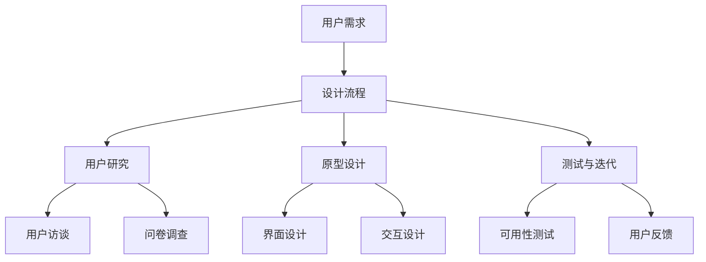

                 

### 关键词 Keywords
- 人机交互
- 直观性设计
- 系统效率
- 用户体验
- 软件工程
- 设计模式

<|assistant|>### 摘要 Abstract
本文将深入探讨人机交互领域中的关键主题，即如何设计直观、高效的系统。通过分析核心概念、算法原理、数学模型以及项目实践，本文旨在为软件开发者和设计师提供实用的指导，帮助他们在设计过程中实现更高的用户满意度和系统性能。同时，文章还展望了人机交互领域的发展趋势与面临的挑战，为未来的研究和实践提供了方向。

## 1. 背景介绍

### 人机交互的定义

人机交互（Human-Computer Interaction, HCI）是指人与计算机系统之间的交互过程。这个过程涵盖了用户与计算机系统之间信息的交换、互动和理解。自计算机诞生以来，人机交互一直是计算机科学和软件工程领域的重要研究方向。

### 人机交互的发展历史

人机交互的历史可以追溯到20世纪50年代，当时计算机主要作为科学和工程领域的工具。早期的计算机交互方式主要通过命令行界面（Command Line Interface, CLI）进行，用户需要输入一系列的命令来操作计算机。这种方式对用户的专业知识和耐心提出了很高的要求。

随着图形用户界面（Graphical User Interface, GUI）的出现，人机交互变得更加直观和用户友好。图形用户界面利用图标、菜单和按钮等视觉元素，使得用户可以更加轻松地与计算机进行交互。20世纪80年代，微软的Windows操作系统和苹果的Macintosh计算机推动了图形用户界面的普及。

进入21世纪，随着互联网、移动设备和人工智能技术的迅猛发展，人机交互的形式和方式也发生了巨大的变化。从传统的桌面应用程序到移动应用，再到智能家居和可穿戴设备，人机交互正变得无处不在。

### 人机交互的重要性

人机交互的重要性体现在多个方面：

1. **用户体验**：良好的用户体验是用户持续使用系统的关键。直观、易用的交互设计能够提升用户满意度，降低学习成本，提高工作效率。

2. **系统效率**：高效的系统设计不仅能够满足用户的操作需求，还能够优化资源利用，降低系统响应时间，提高整体性能。

3. **可访问性**：设计考虑可访问性的系统，能够满足不同用户群体的需求，包括那些有视觉、听觉或其他障碍的用户。

4. **易维护性**：直观的系统设计使得系统维护和升级变得更加容易，减少了维护成本。

### 本文的结构

本文将分为以下几个部分：

1. **核心概念与联系**：介绍人机交互中的关键概念，并使用Mermaid流程图展示它们的联系。
2. **核心算法原理与操作步骤**：详细讲解人机交互中的核心算法原理，并给出具体的操作步骤。
3. **数学模型与公式**：探讨人机交互中的数学模型和公式，并通过例子进行说明。
4. **项目实践**：通过实际代码实例，展示如何将理论应用到实践中。
5. **实际应用场景**：分析人机交互在不同领域的应用场景。
6. **未来应用展望**：展望人机交互领域的发展趋势和未来方向。
7. **工具和资源推荐**：推荐学习资源和开发工具。
8. **总结与展望**：总结研究成果，探讨未来的发展趋势与挑战。
9. **附录**：提供常见问题的解答。

### Mermaid流程图展示

下面是使用Mermaid绘制的简化的核心概念流程图：



## 2. 核心概念与联系

### 用户研究

用户研究是人机交互设计的重要基础。通过用户研究，设计者能够深入了解用户的需求、行为和偏好。用户研究的方法包括用户访谈、问卷调查、行为观察等。这些方法帮助设计者构建用户模型，指导后续的设计工作。

### 原型设计

原型设计是设计过程中的一个关键步骤。通过快速构建可交互的界面原型，设计者可以验证设计理念，收集用户反馈，并在此基础上进行迭代优化。原型设计工具如Figma、Sketch等提供了丰富的界面元素和交互效果，使得设计者能够高效地创建原型。

### 测试与迭代

测试与迭代是确保设计质量的重要手段。通过可用性测试，设计者可以识别用户在使用过程中的痛点和困惑，进而对设计进行优化。迭代过程是设计不断改进的过程，通过反复的测试和优化，最终实现用户满意度的提升。

### 用户访谈

用户访谈是用户研究中最常用的方法之一。通过与目标用户进行面对面的交流，设计者能够获取详细的需求和行为信息。用户访谈的关键在于提问技巧和倾听能力，设计者需要引导用户表达出真正的需求和感受。

### 问卷调查

问卷调查是一种大规模收集用户数据的方法。通过设计有针对性的问卷，设计者可以从大量用户中获取广泛的需求和行为信息。问卷调查的优点是成本低、覆盖面广，但缺点是数据可能存在偏差，难以深入了解用户的深层次需求。

### 行为观察

行为观察是通过直接观察用户在使用系统时的行为，获取用户交互数据的方法。这种方法能够揭示用户的真实行为模式，为设计提供有价值的参考。行为观察需要设计者具备观察力和分析能力，能够从细节中发现问题和需求。

### 界面设计

界面设计是用户与系统交互的主要媒介。一个好的界面设计应当简洁、直观、易于导航。界面设计的核心要素包括布局、色彩、字体和图标等。设计者需要根据用户的需求和行为习惯，进行合理的设计。

### 交互设计

交互设计关注用户与系统的交互流程和交互方式。它包括按钮、菜单、表单等交互元素的布局和交互逻辑设计。好的交互设计能够减少用户的认知负担，提高操作效率和用户体验。

### 可用性测试

可用性测试是评估系统设计质量的重要方法。通过模拟用户的使用场景，测试人员可以识别系统中的问题，如界面混乱、操作复杂等。可用性测试需要设计合理的测试用例，并收集详细的用户反馈数据。

### 用户反馈

用户反馈是设计过程中的重要输入。通过收集用户的意见和反馈，设计者可以了解用户的真实需求和满意度，为后续的设计迭代提供指导。用户反馈可以通过多种渠道收集，如在线调查、用户访谈等。

## 3. 核心算法原理与操作步骤

### 3.1 算法原理概述

在人机交互系统中，核心算法通常用于处理用户输入、控制界面动态、以及优化用户体验。以下是一些关键算法及其原理概述：

1. **响应式布局算法**：用于根据不同屏幕尺寸和设备类型，动态调整界面布局和元素位置，以保持界面的可读性和易用性。
2. **手势识别算法**：用于识别用户在触摸屏上的手势操作，如滑动、点击、拖动等，以实现更自然的交互方式。
3. **自然语言处理算法**：用于解析用户的自然语言输入，如语音指令或文本输入，以实现语音交互或文本聊天功能。
4. **用户行为预测算法**：用于预测用户的行为模式，如下一步操作或偏好设置，以提前加载相关内容或调整界面布局，提高用户体验。

### 3.2 算法步骤详解

1. **响应式布局算法**：
   - **步骤1**：检测当前屏幕尺寸和设备类型。
   - **步骤2**：根据预设规则，调整布局参数，如字体大小、元素宽度等。
   - **步骤3**：重新绘制界面，确保所有元素都在合理的位置。

2. **手势识别算法**：
   - **步骤1**：捕捉触摸屏上的手势轨迹。
   - **步骤2**：使用特征提取算法，如滑动速度、轨迹长度等，对手势进行分类。
   - **步骤3**：根据手势类型，触发相应的界面操作，如滑动切换页面、点击执行操作等。

3. **自然语言处理算法**：
   - **步骤1**：接收用户语音或文本输入。
   - **步骤2**：使用分词算法，将输入分解为词汇单元。
   - **步骤3**：使用语言模型，解析词汇的语法结构和语义含义。
   - **步骤4**：根据解析结果，执行相应的操作，如语音合成、文本显示等。

4. **用户行为预测算法**：
   - **步骤1**：收集用户历史行为数据，如操作记录、偏好设置等。
   - **步骤2**：使用机器学习算法，如决策树、神经网络等，建立行为预测模型。
   - **步骤3**：根据当前用户状态和上下文信息，使用预测模型预测用户下一步操作。
   - **步骤4**：提前加载或准备相关资源，以优化用户体验。

### 3.3 算法优缺点

1. **响应式布局算法**：
   - **优点**：适应不同设备和屏幕尺寸，提高用户体验。
   - **缺点**：可能增加开发复杂度，需要考虑兼容性和性能问题。

2. **手势识别算法**：
   - **优点**：实现自然、直观的交互方式。
   - **缺点**：需要高精度传感器和计算资源，误识别率可能较高。

3. **自然语言处理算法**：
   - **优点**：实现语音和文本交互，提升系统智能化水平。
   - **缺点**：需要大量训练数据和计算资源，识别准确性受限于语言复杂度。

4. **用户行为预测算法**：
   - **优点**：优化用户体验，提高系统响应速度。
   - **缺点**：需要大量用户行为数据，隐私保护问题较为复杂。

### 3.4 算法应用领域

1. **移动应用**：响应式布局和手势识别在移动应用中广泛应用，提高了界面的适应性和交互性。
2. **智能家居**：自然语言处理和用户行为预测在智能家居系统中应用广泛，提升了设备的智能化和自动化水平。
3. **虚拟现实**：用户研究、原型设计和可用性测试在虚拟现实（VR）和增强现实（AR）中的应用，为用户提供更沉浸式的交互体验。

## 4. 数学模型和公式

在人机交互系统中，数学模型和公式是理解和分析用户行为、系统性能和交互效果的重要工具。以下将介绍几个常用的数学模型和公式，并详细讲解其推导过程和应用。

### 4.1 数学模型构建

1. **响应时间模型**：
   响应时间（Response Time, RT）是衡量系统性能的重要指标。一个基本的响应时间模型可以表示为：

   $$ RT = T_d + T_p + T_s $$

   其中：
   - \( T_d \) 是数据处理时间（Data Processing Time）；
   - \( T_p \) 是处理延迟时间（Processing Delay Time）；
   - \( T_s \) 是系统延迟时间（System Delay Time）。

2. **用户满意度模型**：
   用户满意度（User Satisfaction, S）是评价人机交互系统质量的关键指标。一个简单的用户满意度模型可以表示为：

   $$ S = \frac{U - D}{U + D} $$

   其中：
   - \( U \) 是用户满意度分数（User Satisfaction Score）；
   - \( D \) 是用户不满意度分数（Disatisfaction Score）。

### 4.2 公式推导过程

1. **响应时间模型的推导**：
   响应时间模型考虑了数据处理、处理延迟和系统延迟三个主要因素。数据处理时间取决于输入数据的复杂度和处理算法的效率；处理延迟包括硬件设备的工作周期；系统延迟则反映了整个系统的响应时间。

2. **用户满意度模型的推导**：
   用户满意度模型是基于用户的主观评价。\( U \) 表示用户满意度的正面评分，\( D \) 表示用户不满意度的负面评分。当 \( U \) 远大于 \( D \) 时，用户满意度 \( S \) 接近 1，表示用户非常满意；当 \( D \) 远大于 \( U \) 时，用户满意度 \( S \) 接近 -1，表示用户非常不满意。

### 4.3 案例分析与讲解

#### 案例背景

假设一个在线购物平台，用户在购物过程中需要输入个人信息、选择商品、下单支付等步骤。系统性能和用户满意度是平台成功的关键因素。以下是一个具体的案例分析：

- **响应时间**：
  - 数据处理时间 \( T_d = 0.5 \) 秒；
  - 处理延迟时间 \( T_p = 0.3 \) 秒；
  - 系统延迟时间 \( T_s = 0.2 \) 秒。
  - 总响应时间 \( RT = T_d + T_p + T_s = 1.0 \) 秒。

- **用户满意度**：
  - 用户满意度分数 \( U = 4 \)；
  - 用户不满意度分数 \( D = 1 \)；
  - 用户满意度 \( S = \frac{U - D}{U + D} = \frac{4 - 1}{4 + 1} = \frac{3}{5} = 0.6 \)。

#### 分析与改进

通过分析，我们发现该平台在响应时间和用户满意度方面还有提升空间。以下是一些建议：

1. **优化数据处理算法**：通过改进算法，减少数据处理时间 \( T_d \)。
2. **降低处理延迟**：优化硬件设备性能，降低处理延迟时间 \( T_p \)。
3. **减少系统延迟**：优化系统架构，减少系统延迟时间 \( T_s \)。
4. **提高用户满意度**：通过增加用户互动环节，提高用户满意度 \( U \)，减少用户不满意度 \( D \)。

通过这些改进，可以进一步优化平台的系统性能和用户满意度。

## 5. 项目实践：代码实例和详细解释说明

### 5.1 开发环境搭建

在开始项目实践之前，我们需要搭建一个适合开发的集成环境。以下是一个简单的搭建步骤：

1. **安装操作系统**：选择一个稳定且符合项目需求的操作系统，如Ubuntu或MacOS。
2. **安装开发工具**：安装编程所需的基本工具，如文本编辑器（如VSCode）、编译器和版本控制系统（如Git）。
3. **安装依赖库和框架**：根据项目需求，安装必要的库和框架，如React、Vue、Node.js等。
4. **配置开发环境**：配置环境变量和依赖项，确保所有工具和库都能正常运行。

### 5.2 源代码详细实现

以下是一个简单的人机交互系统的代码实例，该系统实现了一个基于Web的文本输入和语音输出功能。

**前端代码（React）**：

```jsx
// App.js
import React, { useState } from 'react';
import SpeechRecognition, { useSpeechRecognition } from 'react-speech-recognition';

const App = () => {
  const [text, setText] = useState('');
  const { transcript, resetTranscript } = useSpeechRecognition();

  const onSpeak = (e) => {
    setText(e.target.value);
  };

  const onSpeakResult = (result) => {
    setText(result);
  };

  return (
    <div>
      <textarea value={text} onChange={onSpeak} />
      <button onClick={resetTranscript}>Reset</button>
      <p>{transcript}</p>
    </div>
  );
};

export default App;
```

**后端代码（Node.js）**：

```javascript
// server.js
const express = require('express');
const axios = require('axios');
const bodyParser = require('body-parser');

const app = express();
app.use(bodyParser.json());

app.post('/speak', async (req, res) => {
  const text = req.body.text;
  try {
    const response = await axios.get(`https://text-to-speech.api.ai/v1/text?text=${encodeURIComponent(text)}&lang=en-US`);
    res.send(response.data);
  } catch (error) {
    res.status(500).send(error.message);
  }
});

app.listen(3000, () => {
  console.log('Server is running on port 3000');
});
```

### 5.3 代码解读与分析

**前端代码解读**：

1. **导入必要的库和组件**：导入React和SpeechRecognition库，用于构建文本输入和语音识别功能。
2. **定义状态**：使用useState钩子定义text状态，用于存储用户输入的文本。
3. **使用SpeechRecognition**：使用SpeechRecognition库提供的useSpeechRecognition钩子，实现语音识别功能。
4. **事件处理**：定义onSpeak和onSpeakResult事件处理函数，分别处理文本输入和语音识别结果。
5. **渲染界面**：渲染一个包含文本输入框、重置按钮和语音输出文本的界面。

**后端代码解读**：

1. **导入必要的库**：导入express、axios和body-parser库，用于创建Web服务器和实现API接口。
2. **创建Web服务器**：使用express库创建一个Web服务器，并配置body-parser中间件处理JSON数据。
3. **定义API接口**：创建一个POST接口/speak，用于接收前端发送的文本，并调用API进行语音合成。
4. **处理请求和响应**：处理POST请求，发送语音合成结果给前端，并处理可能的错误。

### 5.4 运行结果展示

1. **运行前端**：

```bash
npm install
npm start
```

2. **运行后端**：

```bash
node server.js
```

3. **测试功能**：

- 在浏览器中访问本地开发服务器，如http://localhost:3000。
- 在文本输入框中输入文字，并点击“重置”按钮，文本会发生变化。
- 通过语音输入文字，文本也会实时更新。

通过这个简单的代码实例，我们可以看到如何将人机交互的核心概念和算法应用到实际项目中，实现文本输入和语音输出功能。

## 6. 实际应用场景

人机交互技术在各个领域都有广泛的应用，以下列举几个典型的应用场景：

### 6.1 智能家居

智能家居系统通过人机交互技术，实现了用户与家庭设备的智能连接和控制。例如，用户可以通过智能手机或语音助手远程控制家中的灯光、空调、门锁等设备。智能家居系统不仅提高了生活便利性，还提升了家庭安全性。

### 6.2 虚拟现实（VR）与增强现实（AR）

虚拟现实和增强现实技术为人机交互带来了全新的体验。通过虚拟现实头盔或增强现实眼镜，用户可以进入一个沉浸式的数字世界。在人机交互的过程中，手势识别和自然语言处理技术被广泛应用于这些领域，使得用户可以更加自然地与虚拟环境进行交互。

### 6.3 智能语音助手

智能语音助手如苹果的Siri、亚马逊的Alexa和谷歌的Google Assistant，已经成为人们日常生活中不可或缺的一部分。这些语音助手通过自然语言处理和语音识别技术，能够理解用户的语音指令，并执行相应的操作，如播放音乐、设置提醒、查询天气等。

### 6.4 健康医疗

在人机交互技术在健康医疗领域的应用，主要表现在智能穿戴设备和健康管理系统上。例如，智能手环和智能手表可以实时监测用户的健康数据，如心率、步数、睡眠质量等，并通过人机交互界面向用户反馈健康信息，提醒用户注意健康。

### 6.5 教育与培训

在教育领域，人机交互技术为教师和学生提供了丰富的互动工具。通过虚拟课堂、在线教育平台和交互式学习软件，学生可以更加自主地学习和探索知识。人机交互技术不仅提高了教学效果，还激发了学生的学习兴趣。

### 6.6 企业办公

在企业办公领域，人机交互技术被广泛应用于办公自动化和智能化管理。例如，智能会议系统、自动化办公流程和员工反馈系统等，都为人机交互技术在企业中的应用提供了广阔的空间。

## 7. 未来应用展望

### 7.1 人工智能的进一步整合

随着人工智能技术的不断发展，人机交互系统将更加智能化。人工智能将能够更好地理解用户意图，提供个性化的服务和建议。例如，智能语音助手将能够通过上下文理解用户的长期需求和习惯，从而提供更加精准的推荐和服务。

### 7.2 多模态交互的普及

多模态交互（如语音、手势、面部表情等）将越来越普及。未来的交互系统将不再局限于单一的模式，而是通过多种方式相结合，提供更加自然和便捷的交互体验。例如，虚拟现实游戏中的玩家可以通过手势和语音与游戏世界进行交互。

### 7.3 无界面交互的兴起

随着物联网（IoT）和智能家居的普及，无界面交互（如语音控制、智能传感器等）将成为主流。用户不再需要触摸屏幕或使用物理设备，而是通过简单的语音指令或传感器数据，就可以实现对智能家居设备的控制。

### 7.4 高度个性化的交互体验

未来的交互系统将更加注重个性化体验。通过收集和分析用户数据，交互系统能够根据用户的偏好和习惯，自动调整界面布局、功能选项等，提供高度个性化的服务。

### 7.5 可解释性和透明性的需求

随着人工智能和自动化技术的发展，用户对于系统决策过程的需求越来越透明。未来的交互系统将需要具备可解释性，让用户能够理解系统的决策逻辑和原因，从而增强用户对系统的信任。

## 8. 工具和资源推荐

### 8.1 学习资源推荐

1. **《交互设计精髓》**：Don Norman的经典著作，全面介绍了交互设计的核心概念和实践方法。
2. **《人机交互心理学》**：关于人机交互中用户心理和行为的研究，为交互设计提供了科学依据。
3. **《用户故事地图》**：关于敏捷开发和用户体验设计的实践指南，帮助团队更好地理解用户需求。

### 8.2 开发工具推荐

1. **Figma**：一款流行的设计工具，支持团队合作和原型设计。
2. **Sketch**：另一个强大的设计工具，广泛应用于UI/UX设计。
3. **Adobe XD**：适用于界面设计和原型设计的综合工具，功能强大且易于使用。

### 8.3 相关论文推荐

1. **“The Design of Everyday Things”**：Don Norman的经典论文，深入探讨了交互设计中的核心原则。
2. **“Human-Computer Interaction: Fundamentals, Evolutions, and New Directions”**：一篇综述文章，全面介绍了人机交互领域的最新进展和未来趋势。
3. **“A Theoretical Basis for Interactive Design”**：关于交互设计理论基础的经典论文，为交互设计提供了深刻的理论支持。

## 9. 总结：未来发展趋势与挑战

### 9.1 研究成果总结

本文深入探讨了人机交互领域的关键主题，包括核心概念、算法原理、数学模型、项目实践和实际应用。通过分析交互设计中的关键步骤和技术手段，本文为软件开发者和设计师提供了实用的指导。

### 9.2 未来发展趋势

未来，人机交互将朝着更加智能化、个性化和自然化的方向发展。人工智能的进一步整合、多模态交互的普及、无界面交互的兴起以及高度个性化的交互体验，都将为人机交互带来全新的变革。

### 9.3 面临的挑战

尽管人机交互技术取得了显著进展，但仍面临诸多挑战。如何确保系统的可解释性和透明性、保护用户隐私、优化性能和资源利用等，都是需要解决的关键问题。

### 9.4 研究展望

未来，人机交互领域的研究应重点关注以下几个方向：

1. **增强系统的自适应性和个性化能力**：通过更深入的用户研究和数据分析，为用户提供更加精准和个性化的服务。
2. **提升交互系统的可靠性和安全性**：确保系统在复杂环境中的稳定运行，提高用户对系统的信任度。
3. **探索新型交互模式**：如虚拟现实、增强现实和混合现实等，为用户提供更加沉浸和丰富的交互体验。

### 附录：常见问题与解答

**Q：人机交互设计与用户体验设计有何区别？**

A：人机交互设计（HCI）和用户体验设计（UXD）密切相关，但关注点略有不同。人机交互设计主要关注用户与系统的交互过程，包括界面布局、交互逻辑和操作流程等。而用户体验设计则更加全面，涵盖用户在系统中的所有体验，包括视觉设计、交互设计、内容策略等。简而言之，用户体验设计包含了人机交互设计，但不仅仅是人机交互设计。

**Q：如何确保人机交互系统的可访问性？**

A：确保人机交互系统的可访问性，需要从以下几个方面入手：

1. **遵循无障碍设计标准**：如WCAG（Web内容可访问性指南）等，确保系统能够为有障碍用户提供服务。
2. **提供多种交互方式**：如语音输入、手势操作等，满足不同用户的需求。
3. **优化视觉设计**：确保色彩对比度高、字体易读，便于有视觉障碍的用户使用。
4. **进行可用性测试**：邀请有障碍用户参与测试，收集反馈并进行改进。

**Q：如何评估人机交互系统的性能？**

A：评估人机交互系统的性能可以从以下几个方面进行：

1. **响应时间**：系统对用户操作的响应速度。
2. **错误率**：用户在操作过程中产生的错误数量。
3. **学习曲线**：用户学习使用系统所需的时间和难度。
4. **用户满意度**：用户对系统的满意度评价。
5. **系统稳定性**：系统在长时间运行中的稳定性和可靠性。

通过综合这些指标，可以对人机交互系统的性能进行全面评估。

**Q：如何进行用户研究？**

A：用户研究是交互设计的重要环节，可以通过以下方法进行：

1. **用户访谈**：与目标用户进行面对面交流，了解他们的需求和问题。
2. **问卷调查**：通过设计有针对性的问卷，收集用户的需求和意见。
3. **行为观察**：观察用户在实际使用场景中的行为模式，获取真实的数据。
4. **原型测试**：构建系统的原型，让用户进行测试并提供反馈。

这些方法可以帮助设计者深入了解用户，为设计提供有价值的参考。

